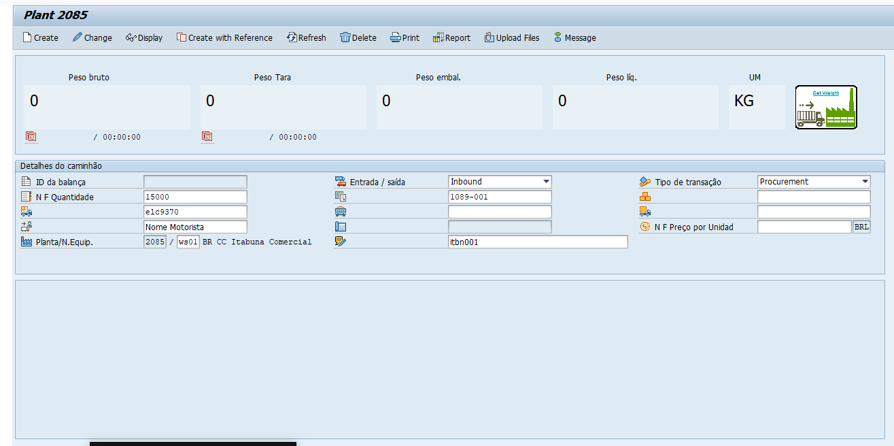

- Meeting with Vitor => #[[OD Cocoa]]
	- Preço Fixo
		- xk03 => Fornecedor => clicar no campo "Fornecedor" -> Abrir aba "T"
			- Nº ID fiscal 1 -> CNPJ
			- Nº ID fiscal 2 -> CPF
			- Irá aparecer o usuário registrado -> clica em cima dele
			- o Terceiro número será o Clifor do produtor. copie ele.
		- me2l => insira no campo "Fornecedor" -> o numero do fornecedor (clifor)
			- selecione abrangencia para ALV
			- Pesquise
	-
	- PTBF
		- ZWB600 =>
		- Create insira o número da planta
		- n F Preço faturado se for Pessoa juridica, fisica não coloca.
		- 
		- 
		- Bahia -> 100000035334
		- Para -> 100000035333
		- Outros -> 100000035335
		- Inserir sacaria
		- peso bruto = sacaria + peso liquido
		- 
		- ## GR Good Receivment
			- ZMM220 ->
			-
		-
		- ## Acertar qualidade
		-
-
-