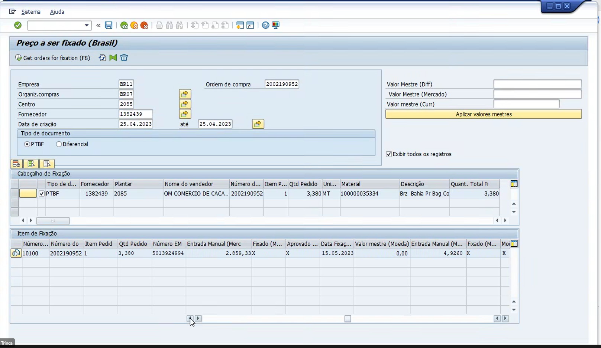
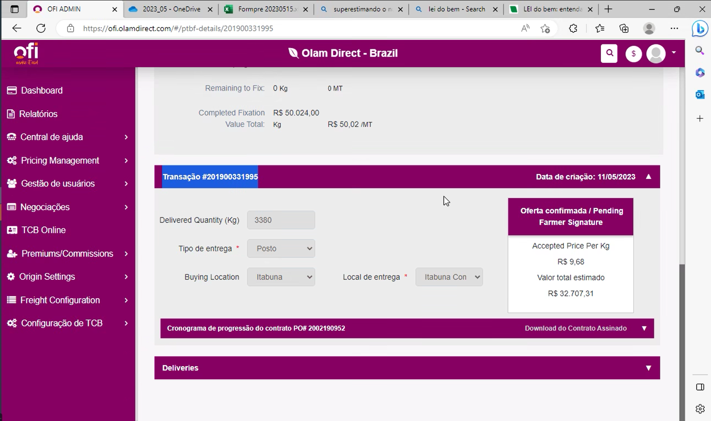

- [[OD Cocoa Help Desk]]
	- # Urgent
		- ## Farmer has received wrong written value int he contract on docusign.
		  collapsed:: true
			- _1684164519962_0.png)
			- _1684164537664_0.png)
			- ## Other problem sam farmer:
				- Aditivo chegou com com diferença de 0.2 centavos por quilo, o produtor aceitou um preço e nos recebemos diferente.
				- SAP diff
				  NET
		- ## Different values in SAP vs. OD
			- **Gross Diff** - 10% de erro.
			- **Net Diff** - 10% de erro.
		- ## Difference between the **farmer accept value** and the **OD value**
			- The farmer has accepted the value of BRL 14.80 and we received BR 14.82
			- Also the value on the log should display always 2 decimals for the value accepted.
			- 
			- 
			-
	- DONE Confirm if the docusign can be shared by e-mail.
		- Contract number OD: 201900332106
		- Contract SAP: 2002194231
		- Farmer: BORTOLINI CEREALISTA LTDA ME
		- CNPJ: 22598257/0001-20
		- There is a solution be changing the status for the group e-mail to DL.
			- |**e-mail**|**Branch**|**Accept external?**|
			  |ofi-ilheus.od@ofi.com|All branches| NO |
			- DONE Send e-mail to Monica with the request.
			-
	- E-mail - Central IT - centralit.servicedesk@olamnet.com
	- DONE Check with Irla the activities in what Mimoso was giving a hand.
	-
	-
	-