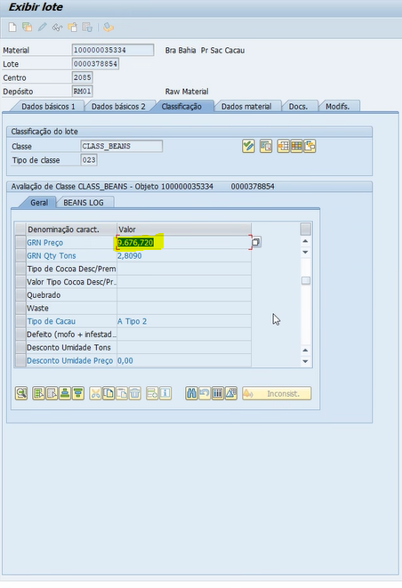

# Notes
	- ## Call with Irla
		- Help with the opening of the log of transaction and how data behave while being inserted on to SAP
		- How to use the combo of OD and Sap.
- #  To Do's
- DONE send meeting invite for ahmad.
	- 10:30 - 11:30 ali ajil siriram ahmad,
	- todos venkat em copia.
- DONE Schedule internal status report.
	- Insert ali, ajil, siriram, ahmad.
	- Venkat as optional
-
- # OD Problems [[OD Cocoa Help Desk]]
	- ## Carried Over
		- DONE Send e-mail and insert on the Excel tracker. [[OD Cocoa Help Desk]]
			- DONE Asking permission so access for Fiscal and Finance in OD
			  collapsed:: true
				- 1. The user manual is stuck for this issue.
				  2. The testing is stuck for this issue.
				- Images:
				  collapsed:: true
					- 
					- 
					-
			- DONE DIfference between the price accepted by the farmer and the price in the OD.
			- DONE Difference between the price in the OD and the SAP.
			- DONE Difference between the price in the SAP and the contract, decimal point.
			- DONE Contract for the farmer is arriving with both the Name of the OD Coffee and the e-mail for the coffee. -> confirm how it's doing.
			  collapsed:: true
				- Image:
				  collapsed:: true
					- 
					-
				-
			- DONE "Aditivo de Contrato" with typo mistake -> confirm how is doing.
			- DONE The signatures in the DocuSign contract are not following the correct frame of reference.
			  collapsed:: true
				- images:
				  collapsed:: true
					- {:height 186, :width 626}
			- DONE   Confirm if the e-mail for the witness can be changed enabling the all the commercial team to have access to it with Monica.
			- DONE Resend the e-mail from Monica with the copied personal from the Venkat's reference.
			  collapsed:: true
				- **IF CONDITION**
					- DONE Check if the problem with inserting the "Tipo Banco Parceiro" no SAP can be ignored, if so do **not reply** the Monica's e-mail.
			- DONE Take the variables needed for **Wilton** to make his work and what type of Data fill such fields.
			  collapsed:: true
				- As a Work around they are filling it manually.
				- DONE See the e-mail form **Monica** with the data that Wilton need in the SAP form OD.
			- DONE The Financial team need the bank attachment to have at least 2 inputs for the fiscal in Brazil says in law that we need at least the front and the back of the document.
			- DONE Should't be possible to edit the farmer profile after the commercial approval, for the internal audit will flag this as a security issue, both the fiscal an the finance should have read only access and cancel so it get beck for the commercial.
			- DONE Check access to Premiums and Commissions for Eduardo's profile.
			- DONE Duplicated contract in the SAP.
				- images:
					- 
					- 
			- DONE Value of contract is wrong
			  collapsed:: true
				- images
				  collapsed:: true
					- 
					- {:height 411, :width 716}
					- 
					-
			- DONE Jurídica users uploaded in to the OD as Física users.
				- Images:
				  collapsed:: true
					- 
			- DONE Differential problem.
				- Price R$/Kg is write but the price in the "i" icon for the price per ton ans the price per @ is wrong.
				- Differential
					- images:
						- 
						- 
						- 
				- Price unit of measurement:
					- Images
					  collapsed:: true
						- 
						- {:height 299, :width 596}
						- {:height 373, :width 656}
			- DONE The **price for Fixation** is being correctly uploaded in to the SAP it is used in both contract and payment.
				- 1. On ZMM8100 -> the price total fixed is R$ 14,572.45/MT
				  2. On ME23N PO -> The price highlighted should be the same as the previous price.
				  the price being displayed is the system price for the PTBF delivery of payload.
				- Images:
					- 
					- 
					-