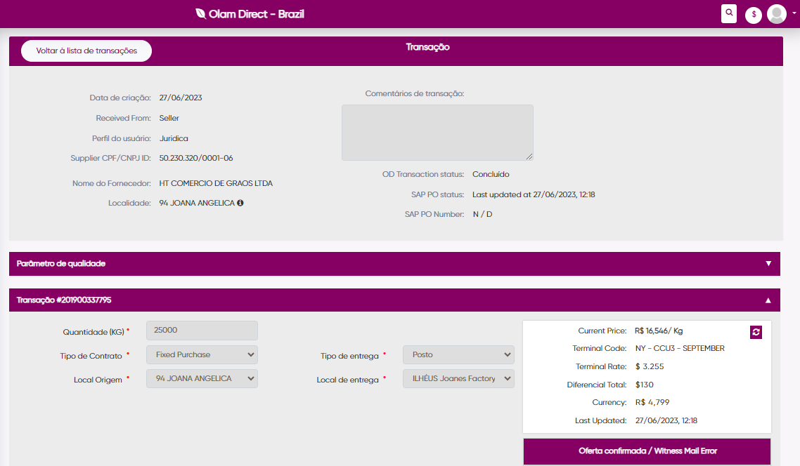
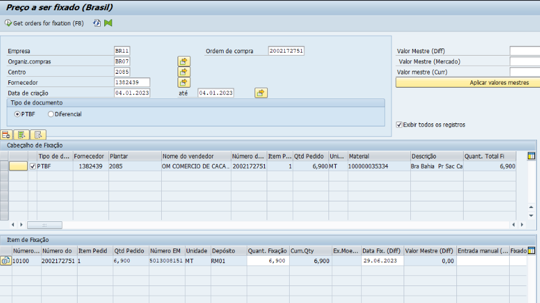

- # OD Meeting
  collapsed:: true
	- ## 1. OD Fix purchase not created on the SAP
		- Transaction 201900337795
		- Not uploaded in to SAP, we couldn't find it.
		- {:height 426, :width 716}
	- ## 2. OD Fixation didn't uploaded values on SAP correctly.
		- OD fixation did created a SAP PO number but the uploaded in the SAP has some data not filled.
		- PO Nº 2002172751
		- {:height 411, :width 716}
	- Drop e-mail to digital support with Eswarkumar, Rakesh
	-
- # Today
	- ## Quality params not filled
		- For Antonio Pimenta.
		- Did they checked it?