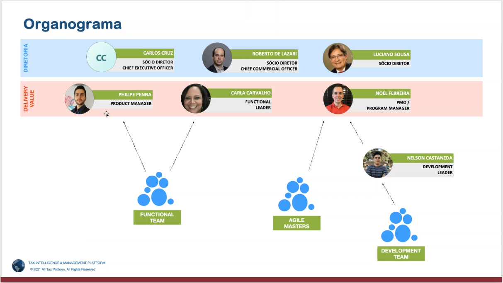

# Onboarding
	- Noel Ferreira PMO
	- Phillipe Penna
	-
	- **Agile e Lex -> All Tax**
		- **Agile** => SAP consultant
		- **Lex** => Tributary Consultant from Bahia
		- Front SAP why 5
		- ## What is Timp
			- Components:
				- Builders
			- Timp Division:
				- Structure => Calculation Views
					- Structure file, (dict) like type file.
				- Platform
				- Configuration
		- ## Petrobras Project
			- Since 2013
			- Contract:
			- 
			- Phillipe Penna know all the details of the Timp Product
			- Metodologia Safe, agile em escala.
			- Nelson Castaneda - TechLead
			-
			- How it works
				- Melhoria continua e sustentação
				- lines of services
					- Implementation
					  logseq.order-list-type:: number
					- Sustentation
					  logseq.order-list-type:: number
					- Specialized Services.
					  logseq.order-list-type:: number
				- Teams, papers, Responsabilities
				- Scaled Agile Frameworks SAFe
			- **Docebo**
			- Nelson, RH Daniel
			-
			-
			-
	-