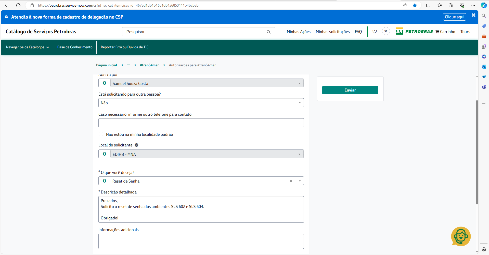

# Cards #[[Alltax - Cards]]
	- LATER PP-2860 Transport #PP-2860
	  background-color:: blue
		- LATER Validate changes to TC2 and Replicate structure
	- DONE PP-3278 Development #PP-3177
	  background-color:: pink
	  :LOGBOOK:
	  CLOCK: [2024-05-13 Mon 10:28:38]--[2024-05-13 Mon 12:45:41] =>  02:17:03
	  :END:
		- DONE Test the idea of N/A as string not null value identificatory
		  :LOGBOOK:
		  CLOCK: [2024-05-13 Mon 10:28:40]--[2024-05-13 Mon 12:45:36] =>  02:16:56
		  :END:
			- the issue has palliative solution for now, how ever there is a underling problem in the file: /timp/bcb/server/controllers/tablePersistence.xsjslib when the objectStatement on line 206 calls this.prepareInsertStatement() that is changing the values of the queries from NOT LIKE to LIKE.
	- LATER PP-3279 Development #PP-3251
	  background-color:: yellow
	  :LOGBOOK:
	  CLOCK: [2024-05-13 Mon 10:28:19]--[2024-05-13 Mon 10:28:23] =>  00:00:04
	  :END:
		- Waiting on #PP-3177
		- LATER Write Technical Specification
	- LATER PP-3276 Development #PP-3276
	  background-color:: yellow
		- LATER Analyse Aggregation Nodes in view CV_NF_IMP_OIL_PB
	- LATER PP-3296 Received #PP-3187
	  background-color:: red
		- Should be priority after PP-3278
		-
	- DONE PP-3303 Received
	  background-color:: red
	  :LOGBOOK:
	  CLOCK: [2024-05-13 Mon 12:46:44]--[2024-05-13 Mon 17:15:55] =>  04:29:11
	  :END:
		- Nelson Asked Priority
		- DONE Read EF
		  :LOGBOOK:
		  CLOCK: [2024-05-13 Mon 12:46:46]--[2024-05-13 Mon 13:04:27] =>  00:17:41
		  :END:
		- DONE Analysis
		  :LOGBOOK:
		  CLOCK: [2024-05-13 Mon 13:04:37]--[2024-05-13 Mon 17:15:49] =>  04:11:12
		  :END:
			- DONE  How the data is actually stored?
			  :LOGBOOK:
			  CLOCK: [2024-05-13 Mon 13:06:15]--[2024-05-13 Mon 16:37:24] =>  03:31:09
			  :END:
			- LATER If changed to Nvarchar 8 would impact on other structures?
			- LATER Meeting with Wesley to understand if the data can be changed or not
				- 237 retrieves information. Possible solution is a calculated field that reads the value from the LAUCHING_DATE
- # TODO #alltax
	- LATER Reset Password #passwork_reset_petrobras
	  collapsed:: true
	  :LOGBOOK:
	  CLOCK: [2024-05-13 Mon 17:15:33]--[2024-05-13 Mon 17:38:58] =>  00:23:25
	  :END:
		- https://petrobras.service-now.com/cs?id=sc_cat_item&sys_id=467ed1db1b1651d04a6853111b4bcbeb
		- Prezados, bom dia!
		- Solicito a associação dos perfis descritos abaixo ao meu usuário DB0U, no ambiente PEX 400.
		  Z:BC_SUPORTE_FUNCIONAL_FI_FT
		  Z:BC_SUPORTE_FUNCIONAL_MM
		- Obrigado!
		  Login - Catálogo de Serviços Petrobras
		  https://petrobras.service-now.com
		  Nesse pede o TIMP
		- E o HANA também
		- {:height 399, :width 748}
		- Boa tarde pessoal!
		  Este link é para solicitar o reset de senha dos ambientes TIMP:
		  Autorizações para #tranS4mar - Catálogo de Serviços Petrobras (service-now.com)
		- Segue Print de exemplo da solicitação:
		- ***SLS 602 é referente ao ambiente SHH
		  ***SLS 604 é referente ao ambiente PFS
-