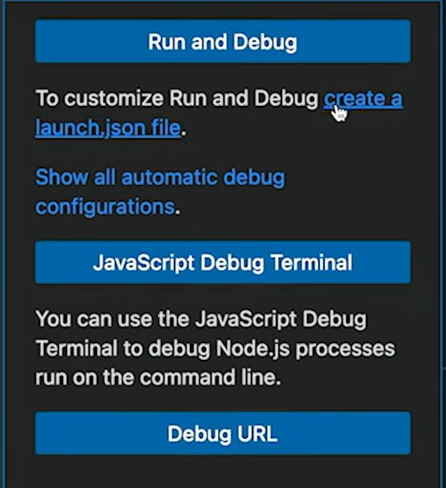

- #TypeScript #debug #debugging #[[Debugging Typescript]]
	- # Video Tutorial
		- [Alex Ziskind](https://www.youtube.com/@AZisk)
		-
		- {{video https://www.youtube.com/watch?v=4zdBk6wisxc}}
	- # To depurate Typescript you should:
		- Create a workspace with `npm init`
		  logseq.order-list-type:: number
		- Then you can create the TS configuration file, however to correctly debug you should insert the following flags in the process:
		  logseq.order-list-type:: number
			- `tsc --init --sourceMap --rootDir src --outDir dist`
			  logseq.order-list-type:: number
				- sourceMap: makes it mape the debug to the typescript file so you can debug it directly.
				  logseq.order-list-type:: number
			- Then when debugging for the first time you should choose the option of creating a launch.json file:
			  logseq.order-list-type:: number
				- {:width 300}
				  logseq.order-list-type:: number
			- logseq.order-list-type:: number
			  ```json
			  {
			      // Use IntelliSense to learn about possible attributes.
			      // Hover to view descriptions of existing attributes.
			      // For more information, visit: https://go.microsoft.com/fwlink/?linkid=830387
			      "version": "0.2.0",
			      "configurations": [
			          {
			              "type": "node",
			              "request": "launch",
			              "name": "Launch Program",
			              "skipFiles": [
			                  "<node_internals>/**"
			              ],
			              "program": "${workspaceFolder}/dist/index.js",
			              "outFiles": [
			                  "${workspaceFolder}/**/*.js"
			              ]
			          }
			      ]
			  }
			  ```
				- On the line 14, you should add the `dist/index.js` so it starts from there.
				  logseq.order-list-type:: number
			- Now it's just transpile with command `tsc` and you can debug it.
			  logseq.order-list-type:: number
		- logseq.order-list-type:: number
	- # How to Continuous Transpile or Watch Typescript
		- On the terminal you write:
		  logseq.order-list-type:: number
			- `npm i --save-dev typescript`
			  logseq.order-list-type:: number
			- On the `F1` menu you choose the: 
			  logseq.order-list-type:: number
				- `> Tasks: Configure Default Build Task` =>
				  logseq.order-list-type:: number
				- `tsc: watch - tsconfig.json`
				  logseq.order-list-type:: number
				- logseq.order-list-type:: number
				  ```json 
				  {
				  	"version": "2.0.0",
				  	"tasks": [
				  		{
				  			"type": "typescript",
				  			"tsconfig": "tsconfig.json",
				  			"option": "watch",
				  			"problemMatcher": [
				  				"$tsc-watch"
				  			],
				  			"group": {
				  				"kind": "build",
				  				"isDefault": true
				  			},
				  			"label": "tsc: watch - tsconfig.json"
				  		}
				  	]
				  }
				  ```
			- Then `F1` `> tasks: run build task` => this will watch your changes
			  logseq.order-list-type:: number