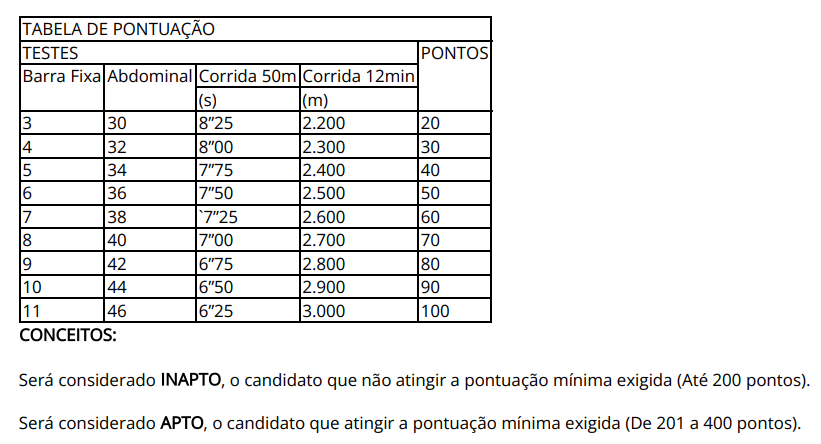
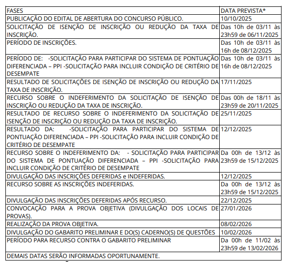

- N8N
-
- #carreira #futureplanning #carrer
	- ## *Concursos*
		- ### Entrada
			- Concurso para curta permanência, até 5 anos, com o objetivo de encontrar concursos com  maior compensação financeira.
			- *GCM Mairiporã*
			  logseq.order-list-type:: number
				- Preço: R$ 60
				  logseq.order-list-type:: number
				- Banca: Nosso Rumo
				  logseq.order-list-type:: number
				  collapsed:: true
					- Provas Anteriores: https://drive.google.com/drive/folders/1YSEaoDf3nNyI2WYiJ2qgrNTDeIOt8n1I
					  logseq.order-list-type:: number
				- Inscrições: 06OUT25 -> 06NOV25
				  logseq.order-list-type:: number
				- Salário: R$ 3.364 + 35% => R$ 4500
				  logseq.order-list-type:: number
				- Distância: 20 -> 30 min
				  logseq.order-list-type:: number
				- Provas: Objetiva, TAF, Direção, Psicologica e antecedentes
				  logseq.order-list-type:: number
				- Escalas: 12x36 aparentemente
				  logseq.order-list-type:: number
				- Dificuldade: 3/5
				  logseq.order-list-type:: number
				- Estudo: [[GCM Mairipora]]
				  logseq.order-list-type:: number
			- Policia Penal São Paulo
			  logseq.order-list-type:: number
				- Inscrições: 03NOV25 -> 16h00 08DEZ25 
				  logseq.order-list-type:: number
					- Pagamento: 23h00 08DEZ25
					  logseq.order-list-type:: number
				- Preço: R$ 122,17
				  logseq.order-list-type:: number
				- Banca: AOCP
				  logseq.order-list-type:: number
				- Salário: R$ 4500 base + adicionais
				  logseq.order-list-type:: number
				- Distância: 1h a 1:30h
				  logseq.order-list-type:: number
				- Provas: Objetiva, TAF, Psico, Investigação social
				  logseq.order-list-type:: number
					- Objetiva: 08FEV26 das 14h00 -> 17h00
					  logseq.order-list-type:: number
					- TAF: 
					  logseq.order-list-type:: number
				- Cronograma: 
				  logseq.order-list-type:: number
				- logseq.order-list-type:: number
				- Escalas: 12x36
				  logseq.order-list-type:: number
				- Dificuldade: 3/5
				  logseq.order-list-type:: number
				- Estudo: [[SAP SP - Policia Penal]]
				  logseq.order-list-type:: number
		- ## Medio Prazo
			- ### IGP RS
			  collapsed:: true
				- Incrições: 06SET25 -> 16OUT25
				- Preço: R$ 270
				- Banca: Fundatec
				- Prova: 14DEZ25
				- Salário R$17.000
				- Curso de Formação: em Porto Alegre
				- Dificuldade: 4/5
				- Escala: 12x36
				- Distância: Mudança de Estado
				- Provas: Objetiva, Medico, Psicológica e Vida Pregressa.
			- ### CGE SP
			  collapsed:: true
				- Incrições: 15SET25 -> 16OUT25
				- Preço: R$ 170
				- Banca: FGV
				- Prova: 14DEZ25
				- Salário: 17000
				- Dificuldade: 4/5
				- Escala: 40 semanais p. comercial
				- Distancia: 30 min - Pç. Sé
				- Provas: Objetiva + Redação
	- ## Lessionar
	  collapsed:: true
		- Mestrado
		- Aula informatica
	- ## IA - Automação
	  collapsed:: true
		- Pesquisa
		- Automações
		- Empresa
	- ## Marcenaria