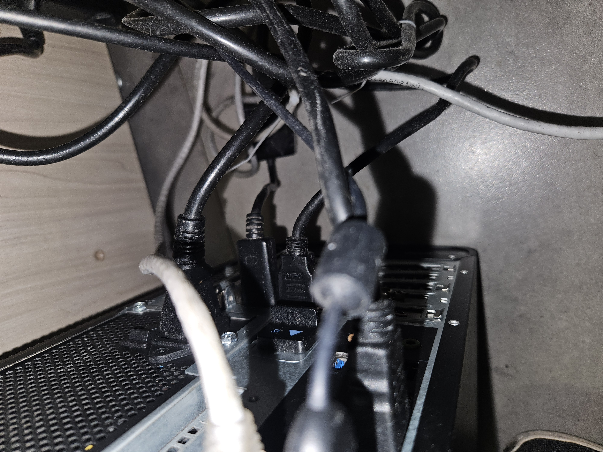
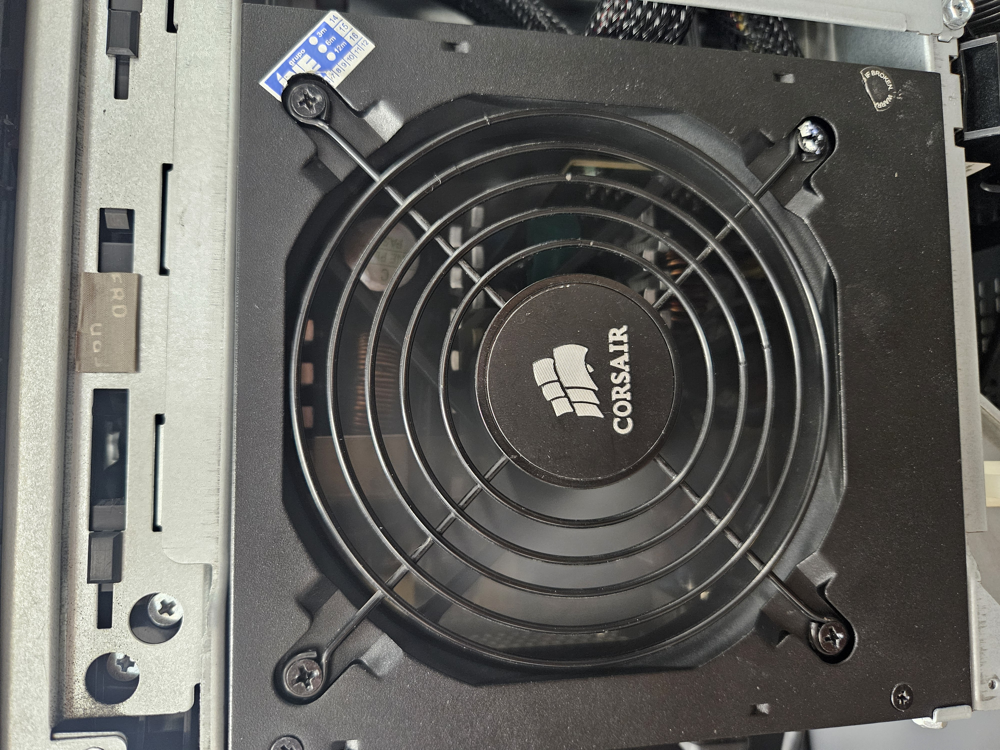
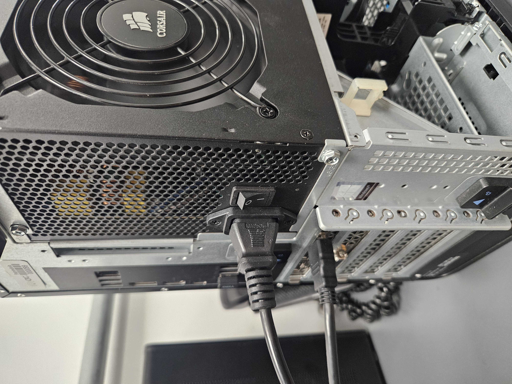
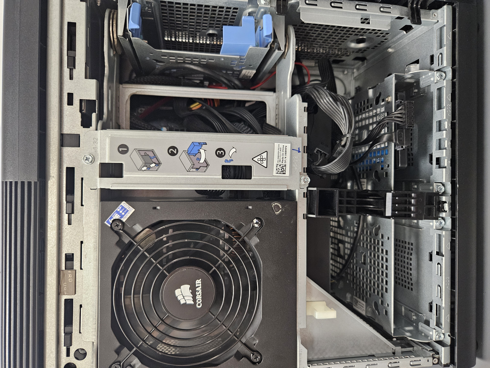

- Trimais #dailywork
	- [[Task - 004]]
	  collapsed:: true
		- #Trimais #infra
		- **Data Início**: [[May 23rd, 2026]]
		- **Data Término**: [[May 23rd, 2026]]
		- **Status**:
			- DONE
			  :LOGBOOK:
			  CLOCK: [2026-05-23 Sat 07:48:59]
			  CLOCK: [2026-05-23 Sat 11:26:31]
			  :END:
		- **Descrição**:
			- **Manutenção Preventiva**
				- windows update
				- Verificação de ventuinhas
				- Troca de pasta térmica
				- Limpeza dos contatos de RAM
				- Limpeza de Pó
				- Conferencia de baeria de BIOS
				- Atualização de Antivirus
			- **Notas:**
				- Ventuinha da fonte demontra barulhos
				- Gabinete não pode ter sua parede direita colada à parede
			- **Fotos**:
			  collapsed:: true
				-    
		- **Local**:
			- DESK-CFTV-02
		-
	- [[Task - 005]]
		- #Trimais #infra
		- **Data Início**: [[May 23rd, 2026]]
		- **Data Término**: /date
		- **Status**:
			- DOING
			  :LOGBOOK:
			  CLOCK: [2026-05-23 Sat 11:27:21]
			  :END:
		- **Descrição**:
			- **Manutenção preventiva**
				- DONE Windows update
				  :LOGBOOK:
				  CLOCK: [2026-05-23 Sat 13:01:57]--[2026-05-23 Sat 13:03:21] =>  00:01:24
				  :END:
				- DONE Verificação de Cooler
				  :LOGBOOK:
				  CLOCK: [2026-05-23 Sat 12:47:56]--[2026-05-23 Sat 12:47:58] =>  00:00:02
				  :END:
				- DONE Troca de pasta térmica
				  :LOGBOOK:
				  CLOCK: [2026-05-23 Sat 12:48:00]--[2026-05-23 Sat 12:48:01] =>  00:00:01
				  :END:
				- DONE Limpeza dos contatos de RAM
				  :LOGBOOK:
				  CLOCK: [2026-05-23 Sat 12:48:03]--[2026-05-23 Sat 12:48:03] =>  00:00:00
				  :END:
				- DONE Limpeza de Pó
				  :LOGBOOK:
				  CLOCK: [2026-05-23 Sat 12:48:09]--[2026-05-23 Sat 12:48:09] =>  00:00:00
				  :END:
				- DONE Conferencia de bateria de BIOS
				  :LOGBOOK:
				  CLOCK: [2026-05-23 Sat 12:48:13]--[2026-05-23 Sat 12:48:13] =>  00:00:00
				  :END:
				- DONE Atualização de Antivirus
				  :LOGBOOK:
				  CLOCK: [2026-05-23 Sat 13:01:51]--[2026-05-23 Sat 13:01:53] =>  00:00:02
				  CLOCK: [2026-05-23 Sat 13:01:54]--[2026-05-23 Sat 13:01:54] =>  00:00:00
				  :END:
		- **Local**:
			- DESK-CFTV-05
		-
	-