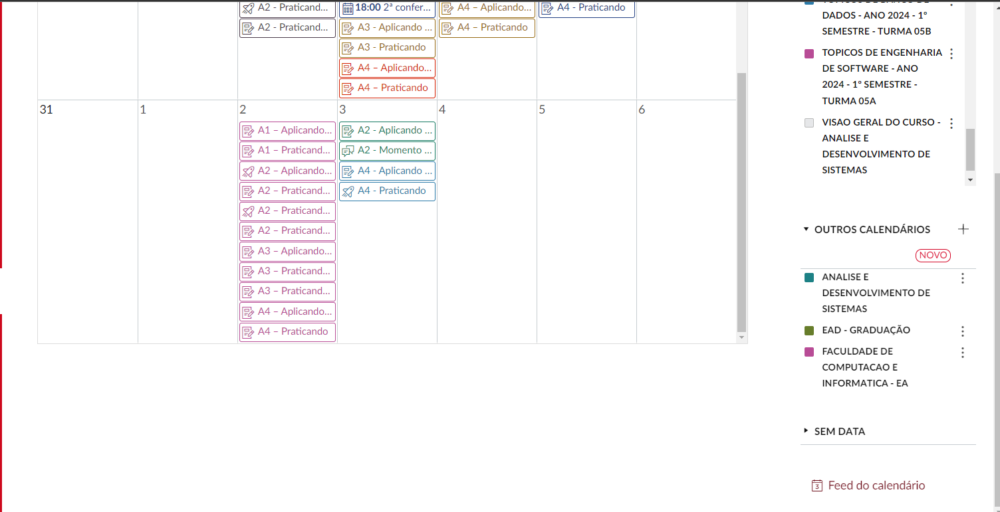

- [[Mackenzie]]
- # Avaliação de Professores
  collapsed:: true
	- ## Topicos em Engenharia de Dados
	  collapsed:: true
		- 
		- o professor colocou multiplas entregar no mesmo dia, aparentemente por facilidade, contudo isso somente atrapalha a correta utilização do calendário, que ficou excelente para o acompanhamento de aulas. a maioria dos professores colocou em datas espaçadas o que ajudou muito na organizaçao. Infelizmente esta prática derrota o ganho feito pelo novo AVA que ficou muito mais rápido e organizado.
- ## JOGOS DIGITAIS
  collapsed:: true
	- [[Jogos Digitais_5Sem]]
	  :LOGBOOK:
	  CLOCK: [2024-03-14 Thu 11:20:05]--[2024-03-14 Thu 11:20:06] =>  00:00:01
	  :END:
- ## MODELAGEM DE NEGOCIOS
  collapsed:: true
	- [[Modelagem de Negócios]]
- ## OBJETOS INTELIGENTES CONECTADOS
	- [[Objetos Inteligentes Conectados]]
- ## PRAT PROF EM ANALISE/DESEN SISTEMAS
	- [[PPADS]]
- ## PROBABILIDADE E ESTATISTICA APLICADA
	- [[Probabilidade e Estatística Aplicada]]
- ## SERVICOS EM NUVEM
  collapsed:: true
	- [[Servicos em Nuvem]]
- ## TESTE DE SOFTWARE
  collapsed:: true
	- [[Teste de Software]]
	- {{cards [[Teste de Software]]}}
		- Summary: 1 items, 1 review counts [[Mar 5th, 2024]]
			- Remembered:   1 (100%)
			- Forgotten :   0 (0%)
		- Summary: 4 items, 4 review counts [[Feb 29th, 2024]]
			- Remembered:   4 (100%)
			- Forgotten :   0 (0%)
		- Summary: 2 items, 2 review counts [[Feb 28th, 2024]]
			- Remembered:   2 (100%)
			- Forgotten :   0 (0%)
	-
- ## TOPICOS DE ENGENHARIA DE SOFTWARE
- ## TOPICOS DE BANCO DE DADOS
  collapsed:: true
	- [[Topicos de Banco de Dados]]
	- {{cards [[Topicos de Banco de Dados]] }}