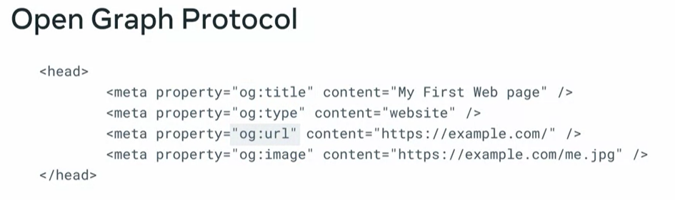
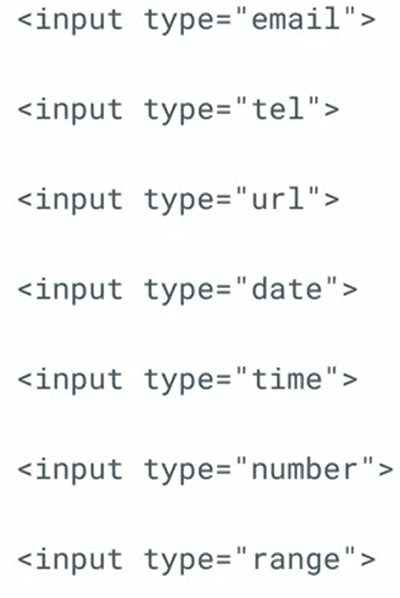
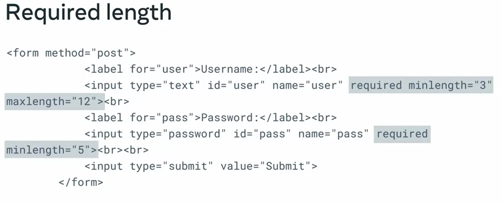
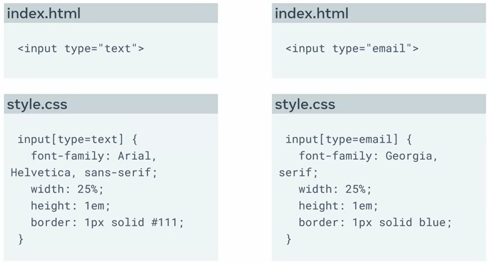
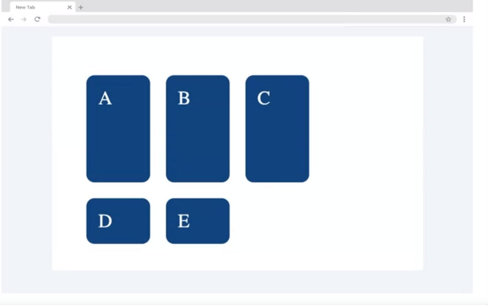
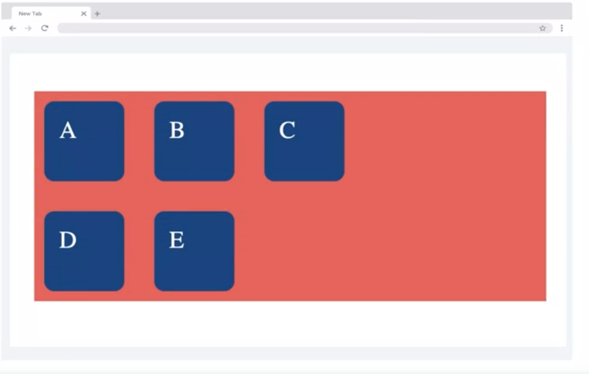
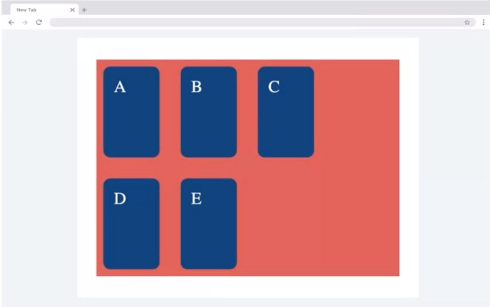

# Module 1
collapsed:: true
	- ## Semantic HTML cheat sheet
	  collapsed:: true
		- There are hundreds of semantic tags available to help describe the meaning of your HTML documents. Below is a cheat sheet with some of the most common ones you’ll use in this course and in your development career.
		- ### Sectioning tags
		  collapsed:: true
			- Use the following tags to organize your HTML document into structured sections.
			- <header>
			  The header of a content section or the web page. The web page header often contains the website branding or logo.
			  - <nav>
			  The navigation links of a section or the web page.
			  - <footer>
			  The footer of a content section or the web page. On a web page, it often contains secondary links, the copyright notice, privacy policy and cookie policy links.
			  - <main>
			  Specifies the main content of a section or the web page.
			  - <aside>
			  A secondary set of content that is not required to understand the main content.
			  - <article>
			  An independent, self-contained block of content such as a blog post or product.
			  - <section>
			  A standalone section of the document that is often used within the body and article elements.
			  - <details>
			  A collapsed section of content that can be expanded if the user wishes to view it.
			  - <summary>
			  Specifies the summary or caption of a <details> element.
			  - <h1><h2><h3><h4><h5><h6>
			  Headings on the web page. <h1> indicates the most important heading whereas <h6> indicates the least important.
			  - ### Content tags
			  collapsed:: true
			  - <blockquote>
			  Used to describe a quotation.
			  - <dd>
			  Used to define a description for the preceding <dt> element.
			  - <dl>
			  Used to define a description list.
			  - <dt>
			  Used to describe terms inside <dl> elements.
			  - <figcaption>
			  Defines a caption for a photo image.
			  - <figure>
			  Applies markup to a photo image.
			  - <hr>
			  Adds a horizontal line to the parent element.
			  - <li>
			  Used to define an item within a list.
			  - <menu>
			  A semantic alternative to <ul> tag.
			  - <ol>
			  Defines an ordered list.
			  - <p>
			  Defines a paragraph.
			  - <pre>
			  Used to represent preformatted text. Typically rendered in the web browser using a monospace font.
			  - <ul>
			  Unordered list
			  - ### Inline tags
			  collapsed:: true
			  - <a>
			  An anchor link to another HTML document.
			  - <abbr>
			  Specifies that the containing text is an abbreviation or acronym.
			  - <b>
			  Bolds the containing text. When used to indicate importance use <strong> instead.
			  - <br>
			  A line break. Moves the subsequent text to a new line.
			  - <cite>
			  Defines the title of creative work (for example a book, poem, song, movie, painting or sculpture). The text in the <cite> element is usually rendered in italics.
			  - <code>
			  Indicates that the containing text is a block of computer code.
			  - <data>
			  Indicates machine-readable data.
			  - <em>
			  Emphasizes the containing text.
			  - <i>
			  The containing text is displayed in italics. Used to indicate idiomatic text or technical terms.
			  - <mark>
			  The containing text should be marked or highlighted.
			  - <q>
			  The containing text is a short quotation.
			  - <s>
			  Displays the containing text with a strikethrough or line through it.
			  - <samp>
			  The containing text represents a sample.
			  - <small>
			  Used to represent small text, such as copyright and legal text.
			  - <span>
			  A generic element for grouping content for CSS styling.
			  - <strong>
			  Displays the containing text in bold. Used to indicate importance.
			  - <sub>
			  The containing text is subscript text, displayed with a lowered baseline.
			  - <sup>
			  The containing text is superscript text, displayed with a raised baseline.
			  - <time>
			  A semantic tag used to display both dates and times.
			  - <u>
			  Displays the containing text with a solid underline.
			  - <var>
			  The containing text is a variable in a mathematical expression.
			  - ### Embedded content and media tags
			  collapsed:: true
			  - <audio>
			  Used to embed audio in web pages.
			  - <canvas>
			  Used to render 2D and 3D graphics on web pages.
			  - <embed>
			  Used as a containing element for external content provided by an external application such as a media player or plug-in application.
			  - <iframe>
			  Used to embed a nested web page.
			  - 
			  Embeds an image on a web page.
			  - <object>
			  Similar to <embed> but the content is provided by a web browser plug-in.
			  - <picture>
			  An element that contains one  element and one or more <source> elements to offer alternative images for different displays/devices.
			  - <video>
			  Embeds a video on a web page.
			  - <source>
			  Specifies media resources for <picture>, <audio> and<video> elements.
			  - <svg>
			  Used to define Scalable Vector Graphics within a web page.
			  - ### Table tags
			  collapsed:: true
			  - <table>
			  Defines a table element to display table data within a web page.
			  - <thead>
			  Represents the header content of a table. Typically contains one <tr> element.
			  - <tbody>
			  Represents the main content of a table. Contains one or more <tr>elements.
			  - <tfoot>
			  Represents the footer content of a table. Typically contains one <tr> element.
			  - <tr>
			  Represents a row in a table. Contains one or more <td> elements when used within <tbody> or <tfoot>. When used within <thead>, contains one or more <th> elements.
			  - <td>
			  Represents a cell in a table. Contains the text content of the cell.
			  - <th>
			  Defines a header cell of a table. Contains the text content of the header.
			  - <caption>
			  Defines the caption of a table element.
			  - <colgroup>
			  Defines a semantic group of one or more columns in a table for formatting.
			  - <col>
			  Defines a semantic column in a table.
			  - ## Open Graph Protocol
			  collapsed:: true
			  - It's used to previously display links for the users, so them know what it's about.
			  - 
			  - Must contain all 4 metadata to be valid, and instead of `name` it uses `property` to declare the property, always using `og:`
			  - ## Input Validation
			  collapsed:: true
			  - {:width 200}
			  -
			  - ## Client Side Validation
			  collapsed:: true
			  - You can use the `minlenght`, `manxlenght` param stablish a minimum of characters
			  - 
			  - To give user a more realistic feedback you can use the `style` to make it:
			  - ```css 
			  input:focus:invalid {
			    border: 2px solid red;
			  }
			  ```
			  - ### [Client-side Validation](https://www.sitepoint.com/client-side-form-validation-html5/)
			  - #### **Validation with RegEx**
			  - ```html 
			   <input type="text" name="ssn"
			          pattern="^\d{3}-\d{2}-\d{4}$"
			          title="The Social Security Number" />
			   ```
			  - ```html 
			   <input type="text" pattern="^#+([a-fA-F0-9]{6}|[a-fA-F0-9]{3})$" >
			   ```
				- ```html 
				  <input type="text" pattern="^@[A-Za-z0-9_]{1,15}$" >
				  ```
			- **Customized error message:**
				- ```js 
				  var input = document.getElementById('myInput');
				  input.setCustomValidity('Please enter a valid email address.');
				  ```
			- #[[RegEx Cheat Sheet]]
			-
		-
	- ## Radio Buttons
	  collapsed:: true
		- when making a form you can use the tag `fieldset` to make sure the button belong to the same group
		- For mobile users you can use the `label` tag encapsulating the input so now any were you click on the input it makes it checked
		- ## Form Cheat Sheet
		  collapsed:: true
			- You can use the multiple argument to make the input multiple selectable
				- ```css 
				  <input type="file" id="gallery" name="gallery" multiple> 
				  ```
			- You can use the tag `min` `max` to delimit a value on a number or range input
				- ```css 
				  <input type="number" id="quantity" name="quantity" min="1" max="10"> 
				  <input type="range" id="volume" name="volume" min="1" max="100"> 
				  ```
	- ## Interactive Form Elements
	  collapsed:: true
		- To make the value of a `type="range"` to be displayed in the screen you can make it like:
			- ```HTML 
			  <div>
			    <label> . . . </label>
			  <input 
			         type="range" 
			         id="booking_people"
			         name="booking_people"
			         min="1" 
			         max="10" 
			         oninput="this.nextElementSibling.value = this.value"
			         />
			  <output>4</output>
			  </div>
			  
			  ```
		- To make a data list you can use the `datalist` tag
			- ```html 
			  <div>
			    <label> . . . </label>
			    <input 
			           id="booking_locations" 
			           name="booking_loaciton"
			           list="locations"
			           >
			    <datalist id="locations">
			      <options value="DonwTown"></options>
			      <options value="UpTwon"></options>
			    </datalist>
			  </div>
			  ```
	- ## Browser Differences
	  collapsed:: true
		- You can use the `input[type=text]` to make sure the input text is selected and costume style it
			- 
	- ## HTML Form Elements
	  collapsed:: true
		- ### `<textarea>`
		  collapsed:: true
			- Defines a multi-line input field, typically to allow the user to input longer textual data. The common attributes for this element include:
				- `cols` defines the width of the text area, the default value is 20
				- `form` the form element the text area is associated with
				- `maxlength` when specified, limits the maximum number of characters that can be entered in the text area
				- `minlength` the minimum number of characters that the user should enter
				- `readonly` once set, the user cannot modify the contents
				- `rows` defines the number of visible text lines for the text area
				- The following line of code defines a text area of 10 visible lines and nearly 30 characters wide where the user can input a maximum of 200 characters:
				- ```html
				  <textarea name="response" rows="10" cols="30" maxlength=”200”> 
				  </textarea>
				  ```
		- ### `<fieldset>`
			- Used to group related input elements in a form. For instance, elements related to the user’s personal information and educational qualification can be grouped separately in two field sets.
		- ### `<datalist>`
			- Specifies a list of pre-defined options for an input element. It differs from <select> since the user can still provide textual or numeric input other than the listed options.
			- ```html
			  <form action="/my_action_page"> 
			    <label for="flowers">Favourite flower:</label><br> 
			    <input list="flowers" name="flowers"> 
			    <datalist id="flowers"> 
			      <option value="Rose"> 
			      <option value="Lily"> 
			      <option value="Tulip"> 
			      <option value="Daffodil"> 
			      <option value="Orchid"> 
			    </datalist> 
			    ... 
			  </form>
			  ```
			-
		-
		-
		-
	- ## Video and Audio
	  collapsed:: true
		- ```html 
		  <audio loop controls>
		    <source src="song.ogg" type="audio/ogg" />
		  </audio>  
		  ```
		- ```HTML 
		  <video width="320" height="240" controls muted> <!-- should mute the video by default -->
		    <source src="film.mp4" type="video/ogg"/>
		  </video>
		  ```
	- ## Image
	  collapsed:: true
		- To make it accessible you should use like this:
			- ```html 
			  <figure> 
			      
			     <figcaption>A photo of myself on a beach in 2015</figcaption> 
			  </figure>
			  ```
			-
	- ## iFrame
	  collapsed:: true
		- Although useful to display other website in your own, it can be a security hazard for all code of the referred web page can be executed on your website, your can use the `allow` property to give is permission or not, also can use the `sandbox` property to restrict browser capabilities.
		-
- # Module 2
	- ## Flexbox
	- ## Grid
	  collapsed:: true
		- 2 dimensional layouts, it uses columns and rows,
		- Space in between **grid cells** are called **gutter** or **gaps**
		- e.g.:
			- ```css 
			  .container { 
			  	display: grid;
			    	grid-template-columns: 100px 100px 100px;
			    	grid-template-rows: 2fr 1fr;
			  }
			  ```
			- 
			- *The grid automatically occupies all the width and height of the page.*
			- ### Repeat
				- ```css 
				  .container { 
				  	display: grid;
				    	grid-template-columns: repeat(3, 100px);
				    	grid-auto-rows: 100px;
				    	grid-gap: 10px;
				    	background-color: rgb (202, 96, 96);
				  }
				  ```
				- 
				-
			- ### Minmax
				- ```css 
				  .container { 
				  	display: grid;
				    	grid-template-columns: repeat(3, 100px);
				    	grid-auto-rows: minmax(150px, auto);
				    	grid-gap: 10px;
				    	background-color: rgb (202, 96, 96);
				  }
				  ```
				- 
				-
	- ## Combination Selectors
	  collapsed:: true
		- If you would like to select all the given tags inside a specific one you can do it like:
			- ```css 
			  #blog h1 {}
			  ```
			- This way all the existing `h1` tags inside the `id ="blog"` will receive the characteristics
		- If you would like to select only the children of such `id ="blog"` tag you can do it like:
			- ```css 
			  #blog > h1 {}
			  ```
			- This will select only `h1` immediately below the `id ="blog"` tag
		- If you wat to refer to a tag and only use its siblings you can use the `~` operator
			- ```css 
			  h1 ~ p {}
			  ```
			- This will find all the `h1` tags that have `p` tags beside it and select them
		- If you wat to refer to a tag and only use its siblings you can use the `+` operator
			- ```css 
			  div + p {}
			  ```
			- This will find all the `div` tags that have `p` tags beside it and select just the first one
		-
	- ## Pseudo-classes
	  collapsed:: true
		- Based on the state of the class
		- ```css 
		  selector: pseudo-class {}
		  ```
		- **User dependent States**
			- `: hover` -> When the mouse hovers over the element
			- `: active` -> Only when the user clicks and holds the element
			- `: focus` -> When the focus is in the element
		- **Form States**
			- `: disabled` and `: enabled`
			- `: checked` and `: indeterminate`
			- `:valid` and `: invalid`
		- **Specific position based States**
			- `: first-fo-type`
			- `: last-of-type`
			- `: nth-of-type()`
			- `: nth-last-of type()`
		- **Rules for using it hierarchy**
			- LVHA
				- Link
				- Visitied
				- Hover
				- Active
		-
	- ## Transform & Transition
	  collapsed:: true
		- While transform changes the angle and positioning spatially of an element it's instantaneous, for that we use the transition that will control the speed in which the transition is done
		-
	- ## CSS animation
	  collapsed:: true
		- ```css 
		  @keyframe animationname { keyframes-selector {css-styles;}}
		  
		  @keyframe animationname {
		    from { color : blue; }
		    to { color: red; }
		  }
		  ```
	- ## Browser Specific CSS
		- Tools to check CSS cross platform compatibility
		- Modernizer
		- Reset.css
		- Normalize.css