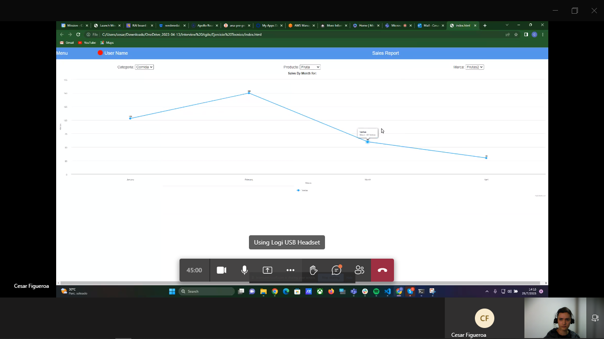

# Hiring
	- ## ToDo
		- DONE Send CTPS and registry report
		- LATER
	- Abaixo seguem os dados quanto seu contrato:
		- 1. Contrato CLT
		  2. Benefícios: VR (R$548,10 mensal), Assistência Médica/Odontológica; UNIMED/AMIL
		  3. Salário Bruto:** **R$ 5.055,47
		  4. Cargo: Desenvolvedor Pleno
		  5. Data de início:  14/08/2023
	-
	- ****Referente a sua data de início, nos envia a Ficha Cadastral (o Excel, e o print do seu cadastro da CTPS online, a parte onde consta sua informação), por tarde, por tarde amanhã dia 08/08/2023****., já que é necessário cadastrá-la antes. Se não, teríamos que adiar a sua data de entrada dependendo da data do envio desta informação.**
	- **O restante pode ser enviado num segundo e-mail.**
	-
	- **Realize o cadastro da sua CTPS online no seguinte enlace: [https://servicos.mte.gov.br/](https://servicos.mte.gov.br/)
	- Referente ao benefício de Refeição: responda-nos por favor se prefere Ticket Alimentação ou Ticket Restaurante
	- Além do seu endereço exato na ficha de cadastro de Excel, precisamos de um ponto de referência para solicitar envio da sua carteirinha de Vale Refeição
	- Anexo também relação de documentos necessários para admissão. Pode nos enviar as copias escaneadas via e-mail.
	- Anexo declaração de saúde do Plano Unimed, por favor preencha e assine conforme solicitado nela (este é um requisito para adicionar ao plano de saúde empresarial)
	- Também, anexo o Formulário de Movimentações AMIL, que seria para o plano odontológico. Preencha somente com suas informações, eles têm o restante.
	- Se tem dependentes, por favor preencha a ficha de Registro de Dependentes para a contabilidade.
	-
	-
	- Adicionalmente precisamos da sua certidão de antecedentes criminais que pode solicitar de forma gratuita aqui: [https://servicos.dpf.gov.br/antecedentes-criminais/certidao](https://servicos.dpf.gov.br/antecedentes-criminais/certidao)
	-
	- Referente ao seu exame admissional:
	- *Precisa realizar antes ou no mesmo dia que seria o seu início, mas não depois dessa data.*
	- Realize na clínica da sua preferência, e submeta a reembolso enviando o comprovante a este e-mail
	- Os dados da empresa para a nota são os seguintes:
	- **ALL TAX PLATFORM – SOLUÇÕES TRIBUTÁRIAS S.A**
	- **CNPJ nº 14.741.811/0001-58**
	- ** **
	- Endereço Administrativo:
	  Avenida Nações Unidas, 12901 - Torre Norte, 25º andar
	  Brooklin Paulista - 04578-910 - São Paulo - SP
	  Telefone : +55 11 - 4780-3915
	-
	-
	- Bem-vindo ao time ALLTAX!
- # Notes
  collapsed:: true
	- ## Names
		- -
	- ## Links
		- -
	- ## Tasks
		- home page that return a graph view based on, either one of:
			- Json object
			- API
		- Must have 3 selectorss for following criteria:
			- Category
			- Product
			- Brand
		- This must return a graph on the screen that shows the monthly sales filtered by the given criteria.
		- {:height 412, :width 718}
		- git -> enviar por e-mail
		- cesar.figueroa@alltaxplatform.com
		- ### Steps:
			- Choose a framework
			  logseq.order-list-type:: number
			- Choose the source of data
			  logseq.order-list-type:: number
			- Make the skeleton of the HomePage.
			  logseq.order-list-type:: number
				- nav bar
				  logseq.order-list-type:: number
					- Menu
					  logseq.order-list-type:: number
					- UserName
					  logseq.order-list-type:: number
					- Sales Report 

					  logseq.order-list-type:: number
				- filters
				  logseq.order-list-type:: number
				- graph
				  logseq.order-list-type:: number
			- Make the functions that filter the data.
			  logseq.order-list-type:: number
			- Make the Styles
			  logseq.order-list-type:: number
			- Publish it on github pages.
			  logseq.order-list-type:: number
			- Make a Readme.md for the github.
			  logseq.order-list-type:: number
			- If possible write the tests for it.
			  logseq.order-list-type:: number
		- This Repository uses React.JS to render a front end where you can select between: Category, Product, Brand and it will return a graph with all the monthly sells on this specific selection.
		- The Data, in the lib/data.js file was created using Open.Ai in order to save time making mock data.
			- ## Corrections on the exercise:
				- On App.jsx ln 14 -> getParamsForSelect() shouldn't receive params
				-
		-
- # Quick Links
  collapsed:: true
	- ## Repos
		- |**Project** |**Pages**|**Repo**|**Code**|
		  |Advice Component|[Pages](https://felipeguerra5.github.io/Advice-Api-Component/)|[Repo](https://github.com/FelipeGuerra5/Advice-Api-Component)|[Code](https://github.com/FelipeGuerra5/Advice-Api-Component/blob/main/src/App.jsx)|
		  |Rating Component|[Pages](https://felipeguerra5.github.io/Rating-Component/)|[Repo](https://github.com/FelipeGuerra5/Rating-Component)|[Vanilla Code](https://github.com/FelipeGuerra5/Rating-Component), [React Code](https://github.com/FelipeGuerra5/Rating-Component/blob/react-try/vite-project/src/App.jsx)|
		  |Rock Paper Scissors|[Pages](https://felipeguerra5.github.io/rock-paper-scissors/)|[Repo](https://github.com/FelipeGuerra5/rock-paper-scissors)|[Code](https://github.com/FelipeGuerra5/rock-paper-scissors/blob/main/app.js)|
		  |Invoice Report Reader - Python| - |[Repo](https://github.com/FelipeGuerra5/PDF_NFe_Report_Reader)|[Company 1](https://github.com/FelipeGuerra5/PDF_NFe_Report_Reader/blob/main/_objects/company_1.py),  [reportClass](https://github.com/FelipeGuerra5/PDF_NFe_Report_Reader/blob/main/_objects/reportclass.py)|
		  |Express React|-|[Repo](https://github.com/FelipeGuerra5/express-react/tree/main)|[Code Server](https://github.com/FelipeGuerra5/express-react/blob/main/server/server.js), [Code Client](https://github.com/FelipeGuerra5/express-react/blob/main/client/src/App.jsx)|
	- ## CV
		- 
		- 
		- [LinkedIn](https://www.linkedin.com/in/felipe-baldim-guerra-858556127/)
		-
	-
- # Questions
  collapsed:: true
	- ## About the Team and General
		- What is the structure, and for who I would be reporting?
		- What is the infrastructure for working environment?
			- Ergonomics, computer, coffee.
		- Can I use some tools I'm used to?
			- logseq, vscode, spotify, postman, insominia, github or it's blocked and only company dictates what can be used?
		- What kind of tasks would actually compose the life of a junior Full Stack Developer on All Tax and it's life cycle?
			- Card -> Deadlines and Development -> Documentation -> Pull Request
		- How much the opinion of the Developer matters on the final project?
			- Even though I know the junior dev should be quiet at the beginning
- # Final interview
  collapsed:: true
	- Desafio, inovação e resiliência.
		- Soluções que tiveram retorno 500 horas homem, anualmente com automações que fiz proativamente.
		- Tenho a habilidade de aprender rapidamente e de internalizar conhecimento e utiliza-lo de modo eficiente.
		- Além das habilidades técnicas posso oferecer o que poucos juniores podem, experiencia de mercado. trabalhao com e sem equipe, sou lider e sei seguir ordens, entrego resultado no prazo e mantenho a calma e polidez mesmo em situações de estresse.
		- Acredito que estas habilidades vão ao encontro do que a sua empresa tem como por princípio.
	-
	- Acreditamos que seu passado não determina seu futuro, Podemos mudar a qualquer momento, mas devemos ser corajosos.
	-
	- Ambas tem como valores: Foco, excelencia de trabalho são necessários e devem ser feitos com empatia.
	- O que sei sobre:
		- Valoriza o trabalho bem feito e entrega com qualidade.
		- Recompensa o esforço e afinco.
		- Com uma resposta financeiramente.
		-
	- **Eu sou** : Felipe 29 nos, casado e pai de dois filhos.
		- Hoje trabalho como desenvolvedor, mas sou oriundo da segurança pública o que faz de mim alguém disciplinado, que respeita hierarquia, trabalha bem em equipe ou solo, tenho boa resposta a feedback e sou pontual com minhas entregas.
		- Tenho uma mentalidade resolutiva, trago soluções aos problemas, sem que alguém tenham que me pedir.
		- Quando com dúvidas busco a resposta com colegas ou documentação, e, mesmo que demore, sempre encontro as respostas.
		-
		- Por que Agile: Lí na página em sua página que acreditam que passado não determina o futuro. e que com coragem é possível mudar, isso, aliado a extensa conversas com um ex funcionário, sou que valorizam, inclusive financeiramente, o funcinário esforaçado e que entrega serviços de qualidade são profissionais, prezam por excelencia, foco, resolução proativa e empatia com equipe e isso vai ao encontro dos meus valores.
		-
-