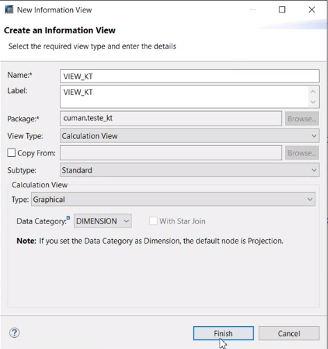
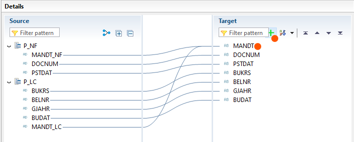
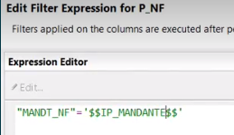
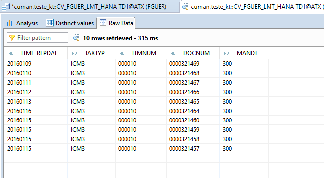

filters:: {}

- # Ponto
  collapsed:: true
	- **Daniel Mendes** -> daniel.mendes@alltaxplatform.com
	- Almoço não pode ter menos do que 1 hora.
	- 40 horas somente por semana, para que exista hora extra é necesário que o Carlos Cruz CEO, autorize as horas extras.
	- Edições somente podem ser feitas domente no dia seguinte.
	- Slicitação:
	  collapsed:: true
		- "Ajuste" + documento de comprovação se houver.
- # SAP Hana
	- ## Add new SAP System
	  collapsed:: true
		- Click on add system
		  logseq.order-list-type:: number
		- Insert as1-100-01 and port 00
		  logseq.order-list-type:: number
		- Continue
		  logseq.order-list-type:: number
		- Add you user as password
		  logseq.order-list-type:: number
		- In the prompt for System ID: ATX
		  logseq.order-list-type:: number
		- After that you need to change:
		  logseq.order-list-type:: number
		  collapsed:: true
			- XML: inserting the argument `custom_host` on the xml file.
			  logseq.order-list-type:: number
			- path to file: C:\Users\<youruser>\hdbstudio\.metadata\.plugins\com.sap.ndb.studio.datamodel
			  logseq.order-list-type:: number
			- on the tag: 
			  logseq.order-list-type:: number
			  collapsed:: true
				- logseq.order-list-type:: number
				  ```xml 
				  # Make shure to be the for the system you just added.
				  # From this:
				  <jdbc locale="en_US" securestore="true" validate_crtf="true"/>
				  
				  # To this:
				  <jdbc custom_host="as1-100-01:30044" locale="en_US" securestore="true" validate_crtf="true"/>
				  
				  # For the remaining tiers use:
				  # DATABASE_NAME;SQL_PORT;
				  # TD1;	 30044;	
				  # TQ1;	 30047;	
				  # TP1;	 30053;	
				  # TS1;	 30062;	
				  # TC2;	 30068;
				  ```
		- Maybe your system should be rebooted for it to work.
		  logseq.order-list-type:: number
		- XML for it.
		  logseq.order-list-type:: number
		  collapsed:: true
			- ```xml 
			  <?xml version="1.0" encoding="UTF-8"?>
			  <hdbstudio version="1.2">
			  <tree>
			  <sapsystem name="ATX:AS1-100-01:00:TD1:FGUER"/>
			  <sapsystem name="ATX:AS1-100-01:00:TQ1:FGUER"/>
			  <sapsystem name="ATX:AS1-100-01:00:TC2:FGUER"/>
			  </tree>
			  <sapsystems>
			  <sapsystem databasename="TD1" databasetype="USERDB" hostname="as1-100-01" instancenumber="0" open="true" secure="false" ssl="false" systemname="ATX" username="FGUER">
			  <jdbc custom_host="as1-100-01:30044" locale="en_GB" securestore="true" validate_crtf="true"/>
			  <sapcontrol state="OFF"/>
			  </sapsystem>
			  <sapsystem databasename="TQ1" databasetype="USERDB" hostname="as1-100-01" instancenumber="0" open="true" secure="false" ssl="false" systemname="ATX" username="FGUER">
			  <jdbc custom_host="as1-100-01:30047" locale="en_GB" securestore="true" validate_crtf="true"/>
			  <sapcontrol state="OFF"/>
			  </sapsystem>
			  <sapsystem databasename="TC2" databasetype="USERDB" hostname="as1-100-01" instancenumber="0" open="true" secure="false" ssl="false" systemname="ATX" username="FGUER">
			  <jdbc custom_host="as1-100-01:30068" locale="en_GB" validate_crtf="true"/>
			  <sapcontrol state="OFF"/>
			  </sapsystem>
			  </sapsystems>
			  </hdbstudio>
			  ```
	- ## Basic SQL Tutorial.
	  collapsed:: true
		- ### Class 1 - Viewing tables
		  collapsed:: true
			- {{video https://www.youtube.com/watch?v=e9IQMrTquQw&list=PLkzo92owKnVwHsbKSfJqefrMwNEJWoMzV}}
			- To get the SQL code from the table you can enter: view log -> double click -> get the SQL code.
			- Opening the SQL
			  logseq.order-list-type:: number
			- select from
			  logseq.order-list-type:: number
			  collapsed:: true
				- you can drag the table to the SQL and  it will bring it's name for you.
				  logseq.order-list-type:: number
			- ```SQL 
			  -- Code learnend
			  SELECT * FROM
			  ```
		- ### Class 2 - SELECT & FROM
		  collapsed:: true
			- {{video https://www.youtube.com/watch?v=_sdswDyEE-A&list=PLkzo92owKnVwHsbKSfJqefrMwNEJWoMzV&index=2}}
			- System -> catalog -> schema -> tables
			- ```sql 
			  -- To select columns by name from a table.
			  SELECT NameOfCloumn, anoterColumn FROM "STS"."tableName"
			  -- It's possible to select the name of other schema 
			  ```
		- ### Class 3 - WHERE
		  collapsed:: true
			- {{video https://www.youtube.com/watch?v=NAcqDIwQb8E&list=PLkzo92owKnVwHsbKSfJqefrMwNEJWoMzV&index=3}}
			- ```SQL 
			  WHERE
			  /* TO USE IN A SELECT BEFORE ALL CALCULATIONS, REFERS TO A SINGLE ROW */
			  
			  SELECT 
			  	*
			  FROM 
			  	"SAP_ECC_TIMP"."J_1BNFDOC"
			  WHERE PSTDAT LIKE '2016%' AND MANDT = '300'
			  
			  
			  ---------------------------------------------
			  --COMANDS
			  LIKE -- -> Means it is like: such and such
			  OR -- -> Is a or operator
			  AND -- -> Is a and operator
			  IN () -- Means an array with the criteria inside the parenthesis
			  
			  
			  ---------------------------------------------
			  
			  SELECT 
			  	*
			  FROM 
			  	"SAP_ECC_TIMP"."J_1BNFDOC"
			  WHERE 
			  	MANDT BETWEEN '250' AND '300' 
			      AND PSTDAT LIKE '2016%'
			      
			  SELECT *
			  FROM 
			  	"SAP_ECC_TIMP"."J_1BNFDOC"
			  WHERE "DOCNUM" IN ('0000213080', '0000213074', '0000213065')
			  
			  ```
		- ### Class 4 - AGREGATION FUNCTIONS
		  collapsed:: true
			- {{video https://www.youtube.com/watch?v=OM9ux-xiriU&list=PLkzo92owKnVwHsbKSfJqefrMwNEJWoMzV&index=4}}
			- ```SQL 
			  -- FUNCTIONS
			  COUNT() -> -- Count all the lines in a select
			  SUM()
			  MIN()
			  MAX()
			  -- All accept math operators
			  --------------------------------------------
			  SELECT
			  	COUNT("MANDT") AS "Count of Costumers",
			  	SUM("NTGEW") AS "Weight Sum",
			  	SUM("NTGEW") * .90 AS "Weight less humidity",
			      MIN("NTGEW")  AS "Minimal weight",
			      MAX("NTGEW")  AS "Maximal weight"
			  FROM 
			  	"SAP_ECC_TIMP"."J_1BNFDOC"
			  
			  
			  ```
		- ### Class 5 - GROUP BY
		  collapsed:: true
			- {{video https://www.youtube.com/watch?v=-60JFY3Kkas&list=PLkzo92owKnVwHsbKSfJqefrMwNEJWoMzV&index=5}}
			- ```SQL 
			  -- Must have group by for it to work
			  SELECT
			  	"DOCNUM",
			  	SUM("NTGEW") AS "Weight Sum"
			  FROM 
			  	"SAP_ECC_TIMP"."J_1BNFDOC"
			  GROUP BY "DOCNUM"
			  
			  
			  -- IF I WANT TO SEE ALL COLUMNS AND STILL SEE AGREGATION FUNCTIONS WITH GROUP BY
			  SELECT * FROM "SAP_ECC_TIMP"."J_1BNFDOC" AS "TABLE"
			  JOIN(
			  	SELECT
			  		"DOCNUM",
			  		SUM("NTGEW") AS "Weight Sum"
			  	FROM 
			  		"SAP_ECC_TIMP"."J_1BNFDOC"
			  	GROUP BY "DOCNUM"
			  ) AS "SUMOF"
			  ON "TABLE"."DOCNUM" = "SUMOF"."DOCNUM";
			  
			  ```
		- ### Class 6 - ORDER BY
		  collapsed:: true
			- {{video https://www.youtube.com/watch?v=nxmtJshTPjk&list=PLkzo92owKnVwHsbKSfJqefrMwNEJWoMzV&index=6}}
			- ```SQL 
			  ORDER BY "NAME_OF_COLUMN" ASC --Ascending
			  ORDER BY "NAME_OF_COLUMN" DESC --Descenbding
			  
			  SELECT
			  	"DOCNUM",
			  	"NTGEW"
			  FROM 
			  	"SAP_ECC_TIMP"."J_1BNFDOC"
			  ORDER BY "DOCNUM", "NTGEW" DESC;
			  ```
		- ### Class 7 - HAVING
		  collapsed:: true
			- {{video https://www.youtube.com/watch?v=yfDx__3HA_A&list=PLkzo92owKnVwHsbKSfJqefrMwNEJWoMzV&index=7}}
			- ```SQL 
			  HAVING
			  /* TO BE USED SPECIFICALLY WITH GROUP BY, WHICH MEANS:
			  INS TO FINS VALUES IN A AGREGATION FUNCTION */
			  
			  SELECT
			  	"DOCNUM",
			  	SUM("NTGEW") AS "Weight Sum"
			  FROM 
			  	"SAP_ECC_TIMP"."J_1BNFDOC"
			  GROUP BY "DOCNUM"
			  HAVING SUM("NTGEW") > 10
			  ORDER BY "DOCNUM" DESC;
			  ```
		- ### Class 8 - TOP
		  collapsed:: true
			- {{video https://www.youtube.com/watch?v=STfYqkQTnHA&list=PLkzo92owKnVwHsbKSfJqefrMwNEJWoMzV&index=8}}
			- ```sql 
			  TOP 
			  /* CAN BE USED TO TASKE ONLY THE TOP FROM THE GIVEN DATA
			  ALSO IF YOU WANT THE TOP 5 YOU SHOULD ORDER BY SUCH VALUE AS DESC */
			  
			  SELECT TOP 5
			  	"DOCNUM",
			  	SUM("NTGEW") AS "Weight Sum"
			  FROM 
			  	"SAP_ECC_TIMP"."J_1BNFDOC"
			  GROUP BY "DOCNUM"
			  ORDER BY "Weight Sum" DESC
			  
			  ```
		- ### Class 9 - CREATE
		  collapsed:: true
			- {{video https://www.youtube.com/watch?v=841z8q_tdYw&list=PLkzo92owKnVwHsbKSfJqefrMwNEJWoMzV&index=9}}
			- ```SQL CREATE 
			  
			  /* CAN BE USED TO CREATE TABLES, IF YOU JUST WNAT TO MAKE IT EASY
			  GO TO THE TABLE RIGHT CLICK ON TEH TABLE IN SAP HANA GO TO DEFINITIONS
			  AND EXPORT THE SQL FOR CREATING THE TABLE. */
			  
			  CREATE COLUMN TABLE "SIS"."TABLENAME" (
			    "SUPPLIEDRID" INTEGER CS_INT NOT NULL,
			    COLUMN_2 INTEGER CS_INT,
			    COLUMN_3 INTEGER CS_INT,
			    COLUMN_4 INTEGER CS_INT,
			    COLUMN_ 5 VARCHAR(10),
			    COLUMN_ 5 VARCHAR(50),
			    PRIMARY KEY ("SUPPLIEDRID")
			  )
			  ```
		- ### Class 10 - INSERT
		  collapsed:: true
			- {{video https://www.youtube.com/watch?v=ds8QSrp-arY&list=PLkzo92owKnVwHsbKSfJqefrMwNEJWoMzV&index=10}}
			- ```SQL 
			  INSERT
			  
			  ```
		- ### Class 11 - UPDATE
		  collapsed:: true
			- {{video https://www.youtube.com/watch?v=MIKJ3mAAyVg&list=PLkzo92owKnVwHsbKSfJqefrMwNEJWoMzV&index=11}}
			- ```SQL
			  UPDATE 
			  SET 
			  WHERE
			  /* UPDATE CAN BE USED FOR UPDATING THE DATA IN THE TABLE */
			  
			  UPDATE "NAME_OF_TABLE"
			  SET "COLUN1" = 1234
			  WHERE ID = 1
			  
			  ```
		- ### Class 12 - DELETE
		  collapsed:: true
			- {{video https://www.youtube.com/watch?v=MIKJ3mAAyVg&list=PLkzo92owKnVwHsbKSfJqefrMwNEJWoMzV&index=11}}
			- ```SQL
			  DELETE FROM "TABLE_NAME"
			  WHERE "ID" = 1
			  
			  -- INSTEAD OF = COULD BE < > AS WELL
			  ```
		- ### Class 13 - JOINS
		  collapsed:: true
			- {{video https://www.youtube.com/watch?v=NONPo4tXujY&list=PLkzo92owKnVwHsbKSfJqefrMwNEJWoMzV&index=13}}
			- You can open a view with the right button and just graphically join the table on the keys or you can use SQL code
			- ```sql 
			  SELECT
			  	T1."COLUMN_1",
			      T2."COLUNS_2"
			  FROM
			  	"STS"."TABLE_1" T1 INNER JOIN "STS"."TABLE_2" T2
			  on T1."KEY" = T2."KEY"
			  ```
		- ### Class 14 - SUB SELECTS
		  collapsed:: true
			- {{video https://www.youtube.com/watch?v=T3OqAtxfSkc&list=PLkzo92owKnVwHsbKSfJqefrMwNEJWoMzV&index=14}}
			- ```SQL 
			  SUB SELECT -- EXAMPLE
			  
			  SELECT *
			  FROM Funcionario
			  WHERE Salario > (
			    SELECT AVG(Salario)
			    FROM Fucnionario
			  );
			  ```
		- ### Class 15 - UNION
		  collapsed:: true
			- {{video https://www.youtube.com/watch?v=r0dUWAOeDXI&list=PLkzo92owKnVwHsbKSfJqefrMwNEJWoMzV&index=15}}
			- ```sql 
			  UNION -- WILL UNITE TWO TABLE FROM SELECTS INTO ONE WITH SINGLE VALUES.
			  UNION ALL -- WILL UNITE TWO TABLE BRINGING DUPLICATE VALUES.
			  
			  (SELECT * FROM "TABLE_NAME")
			  UNION
			  (SELECT * FROM "SECOND_TABLE")
			  ```
		- ### Class 16 - DROP
		  collapsed:: true
			- {{video https://www.youtube.com/watch?v=7Nbcaf6U8ag&list=PLkzo92owKnVwHsbKSfJqefrMwNEJWoMzV&index=16}}
			- ```sql 
			  DROP
			  
			  DROP TABLE Employees;
			  
			   /* ONY DELETE TEH TABLE, IF THERRE IS ANY 
			  OBJECTS DPENDENT ON IT WILL RETURN ERROR*/
			  DROP TABLE Employees RESTRICTED;
			  
			  -- WILL DELETE THE TABLE AND ALL OBJECTS DEPENDENT ON IT.
			  DROP TABLE Employees CASCADE; 
			  ```
		- ### Class 17 - VIEWS
		  collapsed:: true
			- {{video https://www.youtube.com/watch?v=d4eVRgX7jJ4&list=PLkzo92owKnVwHsbKSfJqefrMwNEJWoMzV&index=17}}
			- ```SQL
			  VIEW
			  /* IT WILL MAKE A VIZUALIZATION ONLY OF THE SELECTED DATA WITHE THE SAME TYPES
			  AND VALUES AS THE MAIN ONW */
			  
			  CREATE VIEW "SYSTEM"."NAME" AS 
			  SELECT
			  	"DOCNUM",
			  	SUM("NTGEW") AS "Weight Sum"
			  FROM 
			  	"SAP_ECC_TIMP"."J_1BNFDOC"
			  GROUP BY "DOCNUM"
			  ```
		- ### Class 18 - CREATE SCHEMA
		  collapsed:: true
			- {{video https://www.youtube.com/watch?v=Xy8XG8M4JhU&list=PLkzo92owKnVwHsbKSfJqefrMwNEJWoMzV&index=18}}
			- ```SQL
			  CREATE SCHEMA _TESTSCHEMA -- ONLY WHO CREATED HAS ACESS
			  
			  CREATE SCHEMA _TESTSCHEMA OWNED BY SUCHUSER -- ONLY THE OWNER HAS ACCESS,
			  -- BUT THE CREATOR CAN STILL DROP TEHE SCHEMA
			  
			  ```
		- ### Class 19 - TABLE TYPES
		  collapsed:: true
			-
			- {{video https://www.youtube.com/watch?v=G2UuzAITrQc&list=PLkzo92owKnVwHsbKSfJqefrMwNEJWoMzV&index=19}}
			- -
			- **Row Store Table**:
			  collapsed:: true
				- A Row Store table stores data in a row-based format, similar to traditional relational databases.
				  collapsed:: true
					- Each row in the table occupies a single row slot on disk, and all columns of a row are stored together.
					- Well-suited for transactional workloads and scenarios where you need to retrieve complete rows of data.
					- Performs well for operations that involve inserting, updating, or deleting a few rows at a time.
					- Typically used for OLTP (Online Transaction Processing) workloads.
					- Useful when you need to access multiple columns of a row in a single operation.
			- **Column Store Table**:
			  collapsed:: true
				- A Column Store table stores data in a column-based format, where each column is stored separately.
				  collapsed:: true
					- Data in each column is highly compressed and organized for efficient query processing.
					- Well-suited for analytical workloads, especially when aggregations, filtering, and complex joins are involved.
					- Ideal for scenarios where you need to access and analyze specific columns of data across a large number of rows.
					- Performs well for operations that involve large-scale data scans and aggregations.
					- Typically used for OLAP (Online Analytical Processing) workloads.
					- Useful when you need to perform operations like grouping, summing, counting, etc., on specific columns across many rows.
			- It is possibel to change the type of the table quickly
			- ```sql 
			  CREATE TABLE  -- WILL AUTOMATICALLY CREATE A ROW STORE TABLE
			  CREATE COLUMN TABLE -- WILL CREATE A COLUMN TABLE
			  
			  ALTER TABLE RowStoreTable ALTER TYPE (COLUMN TABLE IN "COLUMNSTORE");
			  --OR
			  ALTER TABLE RowStoreTable ALTER STORAGE (COLUMN TABLE IN "COLUMNSTORE");
			  
			  -- CREATE A TABLE TYPE THAT WILL BE USEFULL TO SOTORE PROCEDURES.
			  CREATE TYPE "SYSTEM"."TABLETYPE" AS TABLE ("ITEM" VARCHAR(100), "VLAUE" INT);
			  
			  ```
		- ### Class 20 - ARRAY DATA TYPE
		  collapsed:: true
			- {{video https://www.youtube.com/watch?v=8tn-qGGvv78&list=PLkzo92owKnVwHsbKSfJqefrMwNEJWoMzV&index=20}}
			-
		- ### Class 21 - MERGE INTO
		  collapsed:: true
			- {{video https://www.youtube.com/watch?v=tJIqHkbi_e0&list=PLkzo92owKnVwHsbKSfJqefrMwNEJWoMzV&index=22}}
			- ```SQL 
			  CREATE SCHEMA DEVTEST;
			  CREATE TABLE DEVTEST.T1 (A INTEGER, B VARCHAR(10));
			  CREATE TABLE DEVTEST.T2 (A INTEGER, B VARCHAR(10));
			  - TRUNCATE TABLE DEVTEST.T1;
			  TRUNCATE TABLE DEVTEST.T2;
			  - INSERT INTO DEVTEST.T1 VALUES(1, 'a1');
			  - INSERT INTO DEVTEST.T2 VALUES(1, 'b2000');
			  INSERT INTO DEVTEST.T2 VALUES(2, 'b3000');
			  - /*
			  MERGE INTO <target_table> [ [ AS ] <alias> ]
			  USING <table_reference>
			  ON <search_condition>
			  <merge_operation_specification>
			  */
			  MERGE INTO DEVTEST.T1 
			  USING DEVTEST.T2 
			  ON DEVTEST.T1.A = DEVTEST.T2.A
			  WHEN MATCHED THEN 
			  UPDATE SET DEVTEST.T1.B = DEVTEST.T2.B
			  --WHEN NOT MATCHED THEN 
			  --	INSERT VALUES(DEVTEST.T2.A, DEVTEST.T2.B)
			  ;
			  - SELECT * FROM DEVTEST.T1;
			  ```
	- ## KT Data Modeling
		- ### Session 1 - Walk Through
			- #### SAP Schemas
			  collapsed:: true
				- **FGUER** -> for the user to make the testing.
				- **SAP_ECC_CLIENT** has tables and objects customized for a specific client.
				- **SAP_ECC_TIMP** -> Client , Invoices, Client Info.
				- **TIMP** -> Tables and objects for the TIMP product, every component ahs it's tables.
				- **_SYS_BIC** -> Calculations View for performance on the Sys views perspective
			- #### Notes:
			  collapsed:: true
				- **Double quotes** -> are for Objects in SAP Hana
				- **Single quotes** -> are for Texts in SAP Hana
			- #### Content dir
			  collapsed:: true
				- **SAP** -> all the SAP created objects that can be used in the development.
				- **ATR -> modeling** had the most important packages you must know.
					- **Client** -> has the different clients models for TIMP.
					- **sem_tdf** -> Calculation views for clients in TDF, has today packages copied from SAP standard packages with some alterations.
					- **timp_standard** -> has the default packages for the TIMP product
			- **Creating Packages**
			  collapsed:: true
				- Always use small case, separation the names this underline e. g. `fguer_test`, for creating a package inside another you can use: `packge.fguer_test`
			- **Provisioning**
			  collapsed:: true
				- For making connection with other Data Base as Oracle, SSMS
			- **Security**
			  collapsed:: true
				- For creating and managing users.
				- Test users.
				-
				-
		- ### Session 2 - Creating The Calculation View
			- **Calculation View**
			  collapsed:: true
				- Where -> Are inside the content dir.
				- For the SAP view we can reuse it but not change it.
				- 
				- It's not recommended to use the PRV views.
			- **Create Calculation View**
			  collapsed:: true
				- {:height 511, :width 472}
				  collapsed:: true
					- **Name:**  short and descriptive names standard is to start with CV
					  logseq.order-list-type:: number
					- **Labels:** Should Reflect the Name
					  logseq.order-list-type:: number
					- **Package:** Where it should be created
					  logseq.order-list-type:: number
					- **Subtype:** Standard[
					  logseq.order-list-type:: number
					- **Type:** Always Graphical!
					  logseq.order-list-type:: number
					- **Data Category:** Always DIMENSION
					  logseq.order-list-type:: number
				- 
				  collapsed:: true
					- Always change this on the View Properties, so it may work properly.
					  logseq.order-list-type:: number
					- If the view is old and won't be used again you can check the deprecated flag.
					  logseq.order-list-type:: number
			- **Node Types**
			  collapsed:: true
				- **Notes:** all the names for the node types are to start with the first letters of it's function: U_FOO, A_FOO, so on.
				- **Projection**
				  collapsed:: true
					- ```sql 
					  SELECT * FROM
					  ```
					- 
				- **Aggregation**
				  collapsed:: true
					- ```sql 
					  -- It can be used to take only the distinct values from a selection
					  -- Display the max or min of a column 
					  DISTINCT
					  ```
					- 
					-
				- **Rank**
				  collapsed:: true
					- **It's a bit heavy on calculation so only use it if actually necessary**
					- ```sql 
					  -- To organize the information ASC and DSC
					  DISTINCT
					  ```
					- 
					- 
				- **Join**
				  collapsed:: true
					- ```sql 
					  -- Conection of two sources
					  JOIN
					  ```
					- 
				- **Union**
				  collapsed:: true
					- ```sql 
					  -- It contains all information for the bellow items
					  UNION
					  ```
					- 
					- 
					- To make the target manually click on the plus sign and then create column, which will contain the data you want to unite, also if both columns have the same name you can just use the *Auto Map By Name*
					  logseq.order-list-type:: number
			- Remember to **Auto-Organize**:
			  collapsed:: true
				- 
			- **How to Save and use IT**
			  collapsed:: true
				- **Activation**
				  collapsed:: true
					- After the CV is ready to test we change the privileges for the blank so it may run
					  collapsed:: true
						- 
						- 
					- if you click in all, it will activate everything that is open.
					- 
					- [WHERE] PS-ticket_number <description> (VIEWS)
				- **To use the View**
				  collapsed:: true
					- 
					-
			- **Filtering a calculation view Nodes**
			  collapsed:: true
				- Can only be applied on the projection and on the aggregation.
				- 
				- Select the projection where you want the filter to go. 
				  logseq.order-list-type:: number
				  A good practice is to make as close as possible to the table you are projecting
				- Than you can insert the rules for the filters -> Save and Activate again.
				  logseq.order-list-type:: number
			- **Making a Calculated Column**
			  collapsed:: true
				- 
				- Click on the projection and then on the right window you can create a new calculated column, then write the rule for the calculation and the name for the target column on the top.
				  logseq.order-list-type:: number
			- **Good Practice For Deleting Nodes**
			  collapsed:: true
				- 
				- When deleting nodes you can use the right button -> remove and Replace with -> node...
				  logseq.order-list-type:: number
				- This will make it sure to maintain the connection on the graph instead of loosing all configuration, basically you are taking care of everything you did on the last projection before semantics, in this case.
				  logseq.order-list-type:: number
			- **Input Params**
			  collapsed:: true
				- **Name of Input** -> IP_<NameOfField>
				- 
				- Name
				  logseq.order-list-type:: number
				- Is mandatory -> if necessary
				  logseq.order-list-type:: number
				- Multiple entries -> Always one.
				  logseq.order-list-type:: number
				- Param Type -> always constant
				  logseq.order-list-type:: number
				- Default value -> if necessary
				  logseq.order-list-type:: number
				- Can create expression on the input: 
				  logseq.order-list-type:: number
				- Data type: type of data | length: consult the table types | Scale = qtd of decimals
				  logseq.order-list-type:: number
				- Then on the filter created you can insert the input as equal to the column you desire to filter by.
				  logseq.order-list-type:: number
				  collapsed:: true
					- 
					  logseq.order-list-type:: number
			- **Already existing Input Params**
			  collapsed:: true
				- **Always do it for already existing input params**!
				  background-color:: yellow
				- You can use the input params of other views just open them and then, on the test view, click on plus sign -> Data sources: {:height 136, :width 594}
				- Then you can import all of them with Auto Map By Name: 
				-
				-
		- ### Session 3 - Reusing The Calculation View
			- **Calculation View JSON**
			  collapsed:: true
				- 
				- You Must increase the `"version"` by one every time it get an update.
				  background-color:: yellow
				- Title must be **UNIQUE**
				  background-color:: red
				- If the information for the title is given you can insert the 3 titles as the same.
				- **Label:** Should be write in Portuguese correctly, will be displayed as the label for client view.
				- **Is Shadow** -> it mean that this table can accept correction given that is possible for it to receive a wrong value
				- **Last ID** -> has the number of the last field inserted, also is the number of fields.
				- **Level**
				  collapsed:: true
					- At the domain as1-100-01-td1 . . . search by the Key on the JSON 371
					  
					  Level in the JSON file 
					  
					  Lançamentos contabeis.
					  
					  Only one level on the "Lançamento Contabil", the JSON has all the levels that will be displayed in each level.
					-
					-
					- **Fields**
					-
				- **Fields**
				  collapsed:: true
					- 
					  For each field there's going to be an structure like this.
					- **Active** must be true
					  background-color:: yellow
					- **IsKey:** only true if you know it is key
					- **Precision:** how many decimals, otherwise 0
					- **IsMeasure:** True only if it is **Type is Decimal**
					- **Label default** == **LabelPT**
					- **TableName** and **SapName** are both the names of the table of origin and columns of this data, insert it only if you know for shure.
					- **IsShadow:**
					  collapsed:: true
						- {:height 79, :width 355}
						  Only if it is for doing corrections, and it must fill the **ShadowTable** and **ShadowName**. also the is shadow on the first key should be changed to true as well
					- **JointAmount:**
					  collapsed:: true
						- {:height 57, :width 182}
						  Is a good practice to insert 1. wont return and error if you do not fill it.
						-
					-
					-
					-
				- **Data Fields:**
				  collapsed:: true
					- The type should be set as 
					  ```json 
					  // DateTime Stamp on SAP Hana is always as YYYYMMDD
					  ...
					  "type": "TIMESTAMP",
					  "dimension": 8, // always will have dimendion = 8
					  "precision": 0,
					  ...
					  ```
			- **How to Implement It**
			  collapsed:: true
				- Go to the browser based SAP Hana Studio, in all the same structure will be available.
				- Open the `package/atr/server/structures/structures.xsjslib`
				- Back up the hole file, then make the addition or alteration on the necessary key.
				  background-color:: red
				- Validate the Json schema before adding it to the main file either on the browser Json validator, or in the VSCode Pluggin.
				  background-color:: yellow
				- Remeber to change the Privileges to: **SQL Analytichs Priviledges**
				  background-color:: yellow
			- **Getting an ID for the view**
			  collapsed:: true
				- Get the list of IDs:
				  collapsed:: true
					- ```sql 
					  -- This will return all the view in the ATR, and ids not filled can be used
					  SELECT * FROM "TIMP"."ATR::Structure"
					  ORDER BY ID ASC;
					  ```
					- **Caveats**
					  background-color:: red
					  collapsed:: true
						- Some ranges are reserved to some specific type of views.
						  collapsed:: true
							- Reserved ID 
							  background-color:: red
							  |ID|Occupied By|
							  |370 - 399|Structures standard with TDF|
							  |500 - 549|Structures for Petrobras "Trabalhistas"|
							  |550 - 599|Structures Standard for Without TDF|
							-
						-
			- **Adding Privileges To The Package.**
				- 1. Right click on the parent package of the dir: `Calculation Views`
				  2. select Analytics Privileges.
				  3. Name should be:  Product_package_descriptive
				  e. g.: TIMP_ATR_Discriptive
				  
				- 
				- 
				- 
				- 
				- Beside the permission you must also insert it on the users profile.
				- 
				  Find the Security -> Roles Directory for the system you are working with name.core.server::name
				- 
				  Add your recently created privilege in the current document
				- 
				  Deploy the analytic privileges files with the new privilege.
				- When you make a request for it to go to **TQ1**  it automatically should be transported with the privileges by the developer responsible.
				  background-color:: blue
				- AP - Analytic Privileges must be stored in the same package as the VIEW
				  background-color:: blue
				- Each type of object, CV, AP should be stored in a separated **CHAIN LIST**.
				  background-color:: yellow
				-
				-
			- **Transport Solicitation**
				- Structure code (JSON) must be transported manually as they are used by a lot of user simultaneously.
				  background-color:: red
				- To Transport the Structure, just open in the TD1 copy it, then paste it on the TQ1 Online ide fo r SAP Hana under the Structures.xsjslib file.
				-
			-
	- ## KT Modelling Exercise
	  collapsed:: true
		- Crie uma calculation view: CV_GABRIELH_LMT_HANA que contém:
		  collapsed:: true
			- Crie uma projeção consumindo a tabela:
			  "SAP_ECC_TIMP"."J_1BNFDOC"
			  Com o filtro MANDT = '300' e insira o parâmetro de data inicial e final no campo ITMF_REPDAT
			- Crie uma projeção consumindo a tabela:
			  "SAP_ECC_TIMP"."J_1BNFLIN"
			  Com o filtro MANDT = '300' faça um inner join com a projeção de J_1BNFDOC com os campos MANDT e DOCNUM
			- Crie uma projeção consumindo a tabela:
				- SELECT * FROM "SAP_ECC_TIMP"."J_1BNFSTX" LIMIT 100;
				  Com o filtro MANDT = '300' e TAXTYP = 'ICM3'
			- Faça um inner join com a
				- projeção de J_1BNFDOC+J_1BNFLIN com os campos MANDT, DOCNUM e ITMNUM
			- Propagar os 10 primeiros campos de cada projeção para cima, sem repetir ou considerar campos em comum entre as projeções
		- **Answer**
		  collapsed:: true
			- {:height 492, :width 500}
			- 
			-
	- ## Creating Tables
		- **On the online ide editor for Sap HANA**
		- ### Server Side
		  collapsed:: true
			- Creation of a table and export it as JSON
		- On TIMP -> MDR
		  collapsed:: true
			- 
		- **Controllers**
		- **Models**
		  collapsed:: true
			- Create you models, creating table in the database, using ORM and exporting JSON obj.
			- 
			- to naming any exported component we are going to use camel case.
			- defaultFields:  you can have any number of defaultfields.
			- **Type : String**
			  collapsed:: true
				- Should have the size as well for it is not actually a string field but a **Varchar** field
			- **columName:** always UPPERCASE
		- After you created a table you can go to install
		- **Install**
		  collapsed:: true
			- 
			- 
			- 
		- **ADM**
		  collapsed:: true
			- Find MDR,
			- Install MDR again
		- on settings
		  collapsed:: true
			- 
			- On navigations links -> lifecycle management
			  collapsed:: true
				- Changes
				- Create
				- Sve teh chain list id
				- Click on approve my contribuition
				-
				-
				-
				-
	- ## Creating table exercise
	  collapsed:: true
		- 1. Create a table in MDR, naming "user"Model.xsjslib, being user your user without the "" with the following Fields: 
		  COMPANY(4)CHAR,
		  TAX(2)CHAR,
		  BRANCH(4)CHAR,
		  NAME(255)CHAR,
		  ISADMINISTRATOR()Boolean,
		  SALARY(16,4)DECIMAL,
		  ENTRYDATE(8)DATE.
		  all of them except for date are required
		  
		  id ,creation user creation date are required
		  4
	- ## Lodash
	  collapsed:: true
		- [Lodash Documentation](https://lodash.com/docs/4.17.15)
		- - `sortedUniq`: This function preforms the task of providing the unique values with sorted manner.
		  collapsed:: true
			- ```js 
			  const items = [1, 1, 2, 3, 3, 3, 5, 8, 8];
			  
			  const result = _.sortedUniq(items);
			  // Output-> [1, 2, 3, 5, 8]
			  ```
		- - `_assign`: This function is equivalend to ES6's Spread Operator. It is used to assign properties of one or many objects to a source object.
		  collapsed:: true
			- ```js 
			  let obj1 = { firstName: "Ram" };
			  let obj2 = { age: 24, address: "XYZ Street, main city, ACC" }
			  
			  let result = _.assign({ salary: 1000000 }, obj1, obj2);
			  
			  console.log(result);
			  
			  // output: Object {
			  //	salary: 1000000, 
			  //	firstName: "Ram", 
			  //  age: 24, 
			  // 	address: "XYZ Street, main city, ACC"
			  // }
			  ```
		- - `_.incldes`: This function returns a boolean value if the second argument is contained in the provided array(first argument).
		  collapsed:: true
			- ```js 
			  let names = ["apple", "orange", "mango"];
			  let result = _.includes(names, "mango");
			  
			  console.log(result);
			  // Output : true
			  ```
		- `_.keyby`: When we need to find a key with specific value. Normally we need to run a loop over the array but with the help of this function task can be done with one go.
		  collapsed:: true
			- ```js 
			  const students = [
			    { id: '123', name: 'Alice', age: 22 },
			    { id: '456', name: 'Bob', age: 24 },
			    { id: '789', name: 'Charlie', age: 21 }
			  ]
			  
			  const studentsById = _.keyBy(students, 'id'); // Create an object keyed by 'id'
			  
			  console.log(studentsById)
			  //{
			  //  '123': { id: '123', name: 'Alice', age: 22 },
			  //  '456': { id: '456', name: 'Bob', age: 24 },
			  //  '789': { id: '789', name: 'Charlie', age: 21 }
			  //
			  ```
		- - `_.difference`: This function helps to find the difference between two array.
		  collapsed:: true
			- ```js 
			  let arr1 = ['mango', 'apple', 'orange'];
			  let arr2 = ['orange', 'banana'];
			  
			  let diff = _.difference(arr1, arr2);
			  // Output: ['mango','apple'];
			  ```
		- - `_.intersection`: Returns common items between the arrays.
		  collapsed:: true
			- ```js 
			  let arr1 = ['mango', 'apple', 'orange'];
			  let arr2 = ['orange', banana];
			  
			  let matched = _.intersection(arr1, arr2);
			  // Output: ['orange'];
			  ```
		- - `_.map`: To transform an array of data into a new array based on a given transformation function.
		  collapsed:: true
			- ```js 
			  _.map({ 'a': 4, 'b': 8 }, square);
			  // => [16, 64] (iteration order is not guaranteed)
			  
			  var users = [
			    { 'user': 'barney' },
			    { 'user': 'fred' }
			  ];
			   
			  // The `_.property` iteratee shorthand.
			  _.map(users, 'user');
			  // => ['barney', 'fred']
			  ```
		- - `_.filter`: To filter elements from an array based on certain criteria.
		  collapsed:: true
			- ```js 
			  var users = [
			  - { 'user': 'barney', 'age': 36, 'active': true },
			  - { 'user': 'fred',   'age': 40, 'active': false }
			  - ];
			  - 
			  - _.filter(users, function(o) { return !o.active; });
			  - // => objects for ['fred']
			  - 
			  - // The `_.matches` iteratee shorthand.
			  - _.filter(users, { 'age': 36, 'active': true });
			  - // => objects for ['barney']
			  - 
			  - // The `_.matchesProperty` iteratee shorthand.
			  - _.filter(users, ['active', false]);
			  - // => objects for ['fred']
			  - 
			  - // The `_.property` iteratee shorthand.
			  - _.filter(users, 'active');
			  - // => objects for ['barney']
			  ```
		- - `_.forEach`: To iterate over elements in an array and perform an action on each element.
		  collapsed:: true
			- ```js 
			  _.forEach([1, 2], function(value) {
			  - console.log(value);
			  - });
			  - // => Logs `1` then `2`.
			  - 
			  - _.forEach({ 'a': 1, 'b': 2 }, function(value, key) {
			  - console.log(key);
			  - });
			  - // => Logs 'a' then 'b' (iteration order is not guaranteed).
			  ```
		- - `_.reduce`: To perform a reduction operation on an array, like summing or accumulating values.
		  collapsed:: true
			- ```js 
			  _.reduce(collection, [function], [accumulator])
			  
			  _.reduce([1, 2], function(sum, n) {
			  - return sum + n;
			  - }, 0);
			  - // => 3
			  - 
			  - _.reduce({ 'a': 1, 'b': 2, 'c': 1 }, function(result, value, key) {
			  - (result[value] || (result[value] = [])).push(key);
			  - return result;
			  - }, {});
			  - // => { '1': ['a', 'c'], '2': ['b'] } (iteration order is not guaranteed)
			  ```
		- - `_.find`: To find the first element in an array that matches a specific condition.
		  collapsed:: true
			- ```js 
			  var users = [
			    { 'user': 'barney',  'age': 36, 'active': true },
			    { 'user': 'fred',    'age': 40, 'active': false },
			    { 'user': 'pebbles', 'age': 1,  'active': true }
			  ];
			   
			  _.find(users, function(o) { return o.age < 40; });
			  // => object for 'barney'
			   
			  // The `_.matches` iteratee shorthand.
			  _.find(users, { 'age': 1, 'active': true });
			  // => object for 'pebbles'
			   
			  // The `_.matchesProperty` iteratee shorthand.
			  _.find(users, ['active', false]);
			  // => object for 'fred'
			   
			  // The `_.property` iteratee shorthand.
			  _.find(users, 'active');
			  // => object for 'barney'
			  ```
		- - `_.groupBy`: To group elements of an array based on a specific property.
		  collapsed:: true
			- ```js 
			  _.groupBy([6.1, 4.2, 6.3], Math.floor);
			  - // => { '4': [4.2], '6': [6.1, 6.3] }
			  - 
			  - // The `_.property` iteratee shorthand.
			  - _.groupBy(['one', 'two', 'three'], 'length');
			  - // => { '3': ['one', 'two'], '5': ['three'] }
			  ```
		- - `_.orderBy`: To sort elements of an array based on one or more criteria.
		  collapsed:: true
			- ```js 
			  
			  var users = [
			      { 'user': 'fred', 'age': 48 },
			      { 'user': 'barney', 'age': 34 },
			      { 'user': 'fred', 'age': 40 },
			      { 'user': 'barney', 'age': 36 }
			      ];
			      
			      // Sort by `user` in ascending order and by `age` in descending order.
			      _.orderBy(users, ['user', 'age'], ['asc', 'desc']);
			      // => objects for [['barney', 36], ['barney', 34], ['fred', 48], ['fred', 40]]
			  ```
		- - `_.isEqual`: To compare JSON objects for equality.-
		  collapsed:: true
			- ```js 
			  var object = { 'a': 1 };
			  var other = { 'a': 1 };
			   
			  _.isEqual(object, other);
			  // => true
			   
			  object === other;
			  // => false
			  ```
		- `_.cloneDeep`: To create a deep copy of a JSON object.
		  collapsed:: true
			- ```js 
			  var objects = [{ 'a': 1 }, { 'b': 2 }]; 
			  var deep = _.cloneDeep(objects);
			  console.log(deep[0] === objects[0]);
			  // => false
			  ```
			- In the case of just `_.clone()` the console.log() would return true
		- - `_.merge`: To merge JSON objects.
		  collapsed:: true
			- ```js 
			  var object = {
			    'a': [{ 'b': 2 }, { 'd': 4 }]
			  };
			   
			  var other = {
			    'a': [{ 'c': 3 }, { 'e': 5 }]
			  };
			   
			  _.merge(object, other);
			  // => { 'a': [{ 'b': 2, 'c': 3 }, { 'd': 4, 'e': 5 }] }
			  ```
		- - `_.isEmpty`: To check if a JSON object or array is empty.
		  collapsed:: true
			- ```js 
			  _.isEmpty(null);
			  // => true
			   
			  _.isEmpty(true);
			  // => true
			   
			  _.isEmpty(1);
			  // => true
			   
			  _.isEmpty([1, 2, 3]);
			  // => false
			   
			  _.isEmpty({ 'a': 1 });
			  // => false
			  ```
		- - `_.isArray`: To check if a value is an array.
		  collapsed:: true
			- ```js 
			  _.isArray([1, 2, 3]);
			  // => true
			   
			  _.isArray(document.body.children); -> // isArrayLike would return true
			  // => false
			   
			  _.isArray('abc');
			  // => false
			   
			  _.isArray(_.noop);
			  // => false
			  ```
			- To
		- - `_.isObject`: To check if a value is an object (including JSON objects).
		  collapsed:: true
			- ```js 
			  _.isObject({});
			  // => true
			   
			  _.isObject([1, 2, 3]);
			  // => true
			   
			  _.isObject(_.noop);
			  // => true
			   
			  _.isObject(null);
			  // => false
			  ```
		- - `_.isPlainObject`: To check if a value is a plain object.
		  collapsed:: true
			- ```js 
			  function Foo() {
			    this.a = 1;
			  }
			   
			  _.isPlainObject(new Foo);
			  // => false
			   
			  _.isPlainObject([1, 2, 3]);
			  // => false
			   
			  _.isPlainObject({ 'x': 0, 'y': 0 });
			  // => true
			   
			  _.isPlainObject(Object.create(null));
			  // => true
			  ```
		- - `_.uniq`: To get unique values from an array.
		  collapsed:: true
			- ```js 
			  _.uniq([2, 1, 2]);
			  // => [2, 1]
			  ```
		- - `_.compact`: To remove falsy values from an array. (`false`, `null`, `0`, `""`, `undefined`, and `NaN`)
		  collapsed:: true
			- ```js 
			  _.compact([0, 1, false, 2, '', 3]);
			  // => [1, 2, 3]
			  ```
		- - `_.pick`: To pick specific properties from a JSON object.
		  collapsed:: true
			- ```js 
			  var object = { 'a': 1, 'b': '2', 'c': 3 };
			   
			  _.pick(object, ['a', 'c']);
			  // => { 'a': 1, 'c': 3 }
			  ```
		- - `_.omit`: To omit specific properties from a JSON object.
		  collapsed:: true
			- ```js 
			  var object = { 'a': 1, 'b': '2', 'c': 3 };
			   
			  _.omit(object, ['a', 'c']);
			  // => { 'b': '2' }
			  ```
		- - `_.flatten`: To flatten a nested array structure.
		  collapsed:: true
			- `_.flattenDeep` flattens all the subarrays to the end.
			- ```js 
			  _.flatten([1, [2, [3, [4]], 5]]);
			  // => [1, 2, [3, [4]], 5]
			  ```
		- - `_.flattenDepth`: To flatten a nested array structure.
		  collapsed:: true
			- ```js 
			  var array = [1, [2, [3, [4]], 5]];
			   
			  _.flattenDepth(array, 1);
			  // => [1, 2, [3, [4]], 5]
			   
			  _.flattenDepth(array, 2);
			  // => [1, 2, 3, [4], 5]
			  ```
		-
	- ## Controller
	  collapsed:: true
		- Stooped video at 28:52
		- what is a controller.
		- ### Training Controller
			- **Code:**
			  collapsed:: true
				- ```js 
				  $.import('timp.mdr.server.models.mdrTraining', 'trainingModel');
				  const model = $.timp.mdr.server.models.mdrTraining.trainingModel.trainingTable;
				  
				  $.import('timp.core.server.api', 'api')
				  const coreAPI = $.timp.core.server.api.api
				  const util = coreAPI.util
				  const supervisorCoreController = coreAPI.supervisorCoreController
				  const userModel = $.createBaseRuntimeModel($.schema.slice(1, -1), 'CORE::USER', false, true)
				  const REGISTERS_BY_PAGE = 15
				  const _ = $.lodash
				  
				  const prepareWhereClause = function(object) {
				  	const where = [];
				  
				  	if (object && object.id) {
				  		where.push({
				  			field: 'id',
				  			operator: '$eq',
				  			value: object.id
				  		});
				  	}
				  	if (object.filterBy && object.filterBy !== "{}" && !_.isArray(object.filterBy)) {
				  		if (typeof object.filterBy.id !== "undefined" && !_.isNil(object.filterBy.id) && object.filterBy.id !== 0 ) {
				  			where.push({
				  				field: 'id',
				  				operator: '$eq',
				  				value: object.filterBy.id
				  			});
				  		}
				  	}
				  	if (object.advancedFilters && object.advancedFilters !== "{}") {
				  		let advancedFilt = object.advancedFilters;
				  		if (typeof advancedFilt.company !== "undefined" && advancedFilt.company.length > 0) {
				  			where.push({
				  				field: 'company',
				  				operator: $.lodash.isArray(advancedFilt.company) ? '$in' : '$eq',
				  				value: $.lodash.isArray(advancedFilt.company) ? advancedFilt.company.map(function(x) {
				  					return x;
				  				}) : advancedFilt.company
				  			});
				  		}
				  		if (typeof advancedFilt.name !== "undefined" && advancedFilt.name.length > 0) {
				  			where.push({
				  				field: 'name',
				  				operator: $.lodash.isArray(advancedFilt.name) ? '$in' : '$eq',
				  				value: $.lodash.isArray(advancedFilt.name) ? advancedFilt.name.map(function(x) {
				  					return x;
				  				}) : advancedFilt.name
				  			});
				  		}
				  		if (typeof advancedFilt.tax !== "undefined" && advancedFilt.tax.length > 0) {
				  			where.push({
				  				field: 'tax',
				  				operator: $.lodash.isArray(advancedFilt.tax) ? '$in' : '$eq',
				  				value: $.lodash.isArray(advancedFilt.tax) ? advancedFilt.tax.map(function(x) {
				  					return x;
				  				}) : advancedFilt.tax
				  			});
				  		}
				  		if (typeof advancedFilt.state !== "undefined" && advancedFilt.state.length > 0) {
				  			where.push({
				  				field: 'state',
				  				operator: $.lodash.isArray(advancedFilt.state) ? '$in' : '$eq',
				  				value: $.lodash.isArray(advancedFilt.state) ? advancedFilt.state.map(function(x) {
				  					return x;
				  				}) : advancedFilt.state
				  			});
				  		}
				  		if (typeof advancedFilt.branch !== "undefined" && advancedFilt.branch.length > 0) {
				  			where.push({
				  				field: 'branch',
				  				operator: $.lodash.isArray(advancedFilt.branch) ? '$in' : '$eq',
				  				value: $.lodash.isArray(advancedFilt.branch) ? advancedFilt.branch.map(function(x) {
				  					return x;
				  				}) : advancedFilt.branch
				  			});
				  		}
				  		if (typeof advancedFilt.creation !== "undefined" && advancedFilt.creation.length > 0) {
				  			where.push({
				  				field: 'creation',
				  				operator: $.lodash.isArray(advancedFilt.creation) ? '$in' : '$eq',
				  				value: $.lodash.isArray(advancedFilt.creation) ? advancedFilt.creation.map(function(x) {
				  					return x;
				  				}) : advancedFilt.creation
				  			});
				  		}
				  		if (!_.isNil(advancedFilt.creationDate) && !_.isEmpty(advancedFilt.creationDate)) {
				  			if (advancedFilt.creationDate.startDate == advancedFilt.creationDate.endDate) {
				  				advancedFilt.creationDate.endDate = $.moment(advancedFilt.creationDate.endDate, 'YYYYMMDD').add(1, 'days').format('YYYYMMDD')
				  			}
				  
				  			where.push({
				  				field: 'creationDate',
				  				operator: '$gte',
				  				value: {
				  					function: {
				  						name: 'TO_DATE',
				  						params: [advancedFilt.creationDate.startDate]
				  					}
				  				}
				  			});
				  
				  			where.push({
				  				field: 'creationDate',
				  				operator: '$lte',
				  				value: {
				  					function: {
				  						name: 'TO_DATE',
				  						params: [advancedFilt.creationDate.endDate]
				  					}
				  				}
				  			});
				  		}
				  
				  	}
				  	return where;
				  };
				  
				  const validateProperties = function(object, properties) {
				  
				  	for (let i = 0; i < properties.length; i++) {
				  		if (!$.lodash.has(object, properties[i])) {
				  			return false;
				  		}
				  	}
				  	return true;
				  };
				  
				  //CREATE
				  this.create = function(object) {
				  	let response = {};
				  
				  	try {
				  		if (validateProperties(object, ["name", "company", "branch", "state", "tax", "salary", "isAdministrator", "date"])) {
				  			object.isAdministrator = object.isAdministrator ? (object.isAdministrator === true ? 1 : 0) : 0;
				  			response = model.create(object);
				  		}
				  	} catch (error) {
				  		return error;
				  	}
				  	return response;
				  };
				  
				  //READ
				  this.read = function(object) {
				  	let response = {};
				  	try {
				  		const where = prepareWhereClause(object);
				  		response = model.find({
				  			where
				  		});
				  	} catch (error) {
				  		return error;
				  	}
				  	return response;
				  };
				  
				  //LIST
				  this.list = function(object) {
				  	let response = {
				  		results: [],
				  		totalPages: 1
				  	}
				  	try {
				  		const where = prepareWhereClause(object)
				  		const page = _.get(object, 'page', 1)
				  		const aliases = getAliases()
				  
				  		const modelResult = model.find({
				  			where,
				  			aliases,
				  			join: [{
				  				alias: 'CRU',
				  				type: 'left',
				  				map: 'creationUser',
				  				on: [{
				  					alias: 'CRU',
				  					field: 'id',
				  					operator: '$eq',
				  					value: {
				  						alias: 'main',
				  						field: 'creationUser'
				  					}
				                  }]
				              }, {
				  				alias: 'MU',
				  				type: 'left',
				  				map: 'modificationUser',
				  				on: [{
				  					alias: 'MU',
				  					field: 'id',
				  					operator: '$eq',
				  					value: {
				  						alias: 'main',
				  						field: 'modificationUser'
				  					}
				                  }]
				              }],
				  			paginate: {
				  				limit: REGISTERS_BY_PAGE,
				  				offset: REGISTERS_BY_PAGE * (page - 1)
				  			},
				  			orderBy: [{
				  				field: 'id',
				  				type: 'asc'
				              }]
				  		})
				  
				  		response.results = modelResult.results.map(result => {
				  			let temp = _.cloneDeep(result)
				  			temp.creationUser = {
				  				name: _.get(result, 'creationUser[0].name', ''),
				  				lastName: _.get(result, 'creationUser[0].lastName', ''),
				  				hanaUser: _.get(result, 'creationUser[0].hanaUser', '')
				  			}
				  			temp.modificationUser = {
				  				name: _.get(result, 'modificationUser[0].name', ''),
				  				lastName: _.get(result, 'modificationUser[0].lastName', ''),
				  				hanaUser: _.get(result, 'modificationUser[0].hanaUser', '')
				  			}
				  			return temp
				  		})
				  		response.totalPages = getTotalPages(where)
				  	} catch (e) {
				  		$.messageCodes.push({
				  			"code": "MDR266000",
				  			"type": 'E',
				  			"errorInfo": 'Test error',
				  			error: util.parseError(e)
				  		})
				  	}
				  
				  	return response
				  
				  }
				  
				  //UPDATE
				  this.update = function(object) {
				  	let response = {};
				  	try {
				  		if (object && object.id) {
				  			response = model.update(object, {
				  				where: [{
				  					field: 'id',
				  					operator: '$eq',
				  					value: object.id
				                  }]
				  			});
				  		}
				  	} catch (error) {
				  		return error;
				  	}
				  	return response;
				  };
				  
				  //DELETE
				  this.delete = function(object) {
				  	if (object.id) {
				  		var deleted = model.delete({
				  			where: [{
				  				field: 'id',
				  				operator: $.lodash.isArray(object.id) ? '$in' : '$eq',
				  				value: $.lodash.isArray(object.id) ? object.id.map(function(x) {
				  					return Number(x);
				  				}) : Number(object.id)
				                  }]
				  		});
				  		return deleted;
				  	};
				  	return false;
				  };
				  
				  const getTotalPages = function(where) {
				  	const countResult = model.find({
				  		where,
				  		count: true
				  	})
				  	const totalRegisters = _.get(countResult, 'results[0].tableCount', 0)
				  
				  	return Math.ceil(totalRegisters / REGISTERS_BY_PAGE)
				  }
				  
				  const getAliases = function() {
				  	const aliases = [{
				  		collection: model.getIdentity(),
				  		name: 'main',
				  		isPrimary: 'true'
				      }, {
				  		collection: userModel.getIdentity(),
				  		name: 'CRU'
				      }, {
				  		collection: userModel.getIdentity(),
				  		name: 'MU'
				      }]
				  	return aliases
				  }
				  this.getDistinctUsers = function() {
				  	const usersRuntimeModel = $.createBaseRuntimeModel($.schema.slice(1, -1), "CORE::USER", false, true);
				  	return model.find({
				  		distinct: true,
				  		select: [{
				  			alias: 'creationUser',
				  			field: 'id'
				          }, {
				  			alias: 'creationUser',
				  			field: 'name'
				          }, {
				  			alias: 'creationUser',
				  			field: 'lastName'
				          }],
				  		aliases: [{
				  			collection: model.getIdentity(),
				  			name: 'dirf'
				          }, {
				  			collection: usersRuntimeModel.getIdentity(),
				  			name: 'creationUser'
				          }],
				  		join: [{
				  			alias: 'creationUser',
				  			type: 'inner',
				  			map: 'creation',
				  			on: [{
				  				alias: 'creationUser',
				  				field: 'id',
				  				operator: '$eq',
				  				value: {
				  					alias: 'dirf',
				  					field: 'creationUser'
				  				}
				              }]
				          }]
				  	}).results;
				  };
				  this.listAdvFilters = function() {
				  	let users = this.getDistinctUsers();
				  	let filters = {
				  		company: [],
				  		tax: [],
				  		name: [],
				  		branch: [],
				  		state: [],
				  		date: [],
				  		creation: [],
				  		modification: []
				  	}
				  	if (!_.isNil(users) && _.isArray(users) && !_.isEmpty(users)) {
				  		let usersFilter = {};
				  		users = _.reduce(users, function(res, item) {
				  			let respo = {
				  				creation: [],
				  				modification: []
				  			};
				  			_.forEach(item.creation, function(user) {
				  				if (_.isNil(usersFilter[user.id])) {
				  					usersFilter[user.id] = true;
				  					respo.creation.push({
				  						key: user.id,
				  						name: user.name + ' ' + user.lastName
				  					});
				  				}
				  			});
				  			_.forEach(item.modification, function(user) {
				  				if (_.isNil(usersFilter[user.id])) {
				  					usersFilter[user.id] = true;
				  					respo.modification.push({
				  						key: user.id,
				  						name: user.name + ' ' + user.lastName
				  					});
				  				}
				  			});
				  			return respo;
				  		}, []);
				  	}
				  	filters.creation = users.creation
				  	filters.modification = users.modification
				  	model.find({}).results.map(function(element) {
				  		for (let k in element) {
				  			if (filters[k]) {
				  				filters[k].push({
				  					key: element[k],
				  					name: element[k]
				  				})
				  				filters[k] = _.uniq(filters[k]); //por cada ciclo evalua si hay datos repetidos y los elimina
				  			}
				  		}
				  	});
				  	return filters;
				  };
				  
				   this.validationRules = function (){
				      var rules = {
				          company: {
				              type: 'string',
				              size: 4,
				              required: true
				          },
				          tax: {
				              type: 'string',
				              size: 2,
				              required: true
				          },
				          state: {
				              type: 'string',
				              size: 2,
				              required: true
				          },
				          branch: {
				              type: 'string',
				              size: 4,
				              required: true
				          },
				          name: {
				              type: 'string',
				              size: 255,
				              required: true
				          },
				          isAdministrator: {
				              type: 'tinyint',
				              required: true
				          },
				          salary: {
				              type: 'decimal',
				              size: 16,
				              precision: 2,
				              required: true
				          },
				          date: {
				              type: 'date',
				              required: true
				          }
				      };
				      return rules;
				  };
				  
				  this.batchSaveFromImport = function(object) {
				  // 	$.import('timp.mdr.server.controllers', 'validateImport');
				  // 	const validation = $.timp.mdr.server.controllers.validateImport;
				  
				  	var _self = this;
				  
				  	const rules = _self.validationRules();
				  
				  	var response = {
				  		created: false,
				  		instance: [],
				  		invalidLines: []
				  	};
				   1
				  	try { 
				  		if (!_.Empty(object)) { 
				   
				  			var data = object.dataToSave;
				  			var dataToSave = _self.changeHanaKeyToModel(data, rules);
				  			//dataToSave = _self.checkCreated(dataToSave);
				  			var created = [];
				  			if (dataToSave) {
				  				dataToSave.forEach(function(item, index) {
				  					if (validateProperties(item, ["name", "company", "branch", "state", "tax", "salary", "isAdministrator", "date"])) {
				  					    item.salary = item.salary.replace(',', '');
				  						item.salary = item.salary ? parseFloat(item.salary) : null;
				  						created[index] = model.create(item);
				  						//make so that if the create doesnt work. put the index of the line and add it to invalidLines
				  					}
				  				});
				  				created.forEach(function(item) {
				  					if (item.results. created=== true) {
				  						response.created = true;
				  					}
				  				});
				  			}
				  		}
				  	} catch (e) {
				  		$.messageCodes.push({
				  			code: 'MDR201015', //An error occurred while trying to get the register(s)
				  			type: 'E',
				  			errorInfo: $.parseError(e)
				  		});
				  	}
				  
				  	return response;
				  }; 
				  
				  this.changeHanaKeyToModel = function(arrayData, rules) {
				  
				  	const fieldsMain = model.getDefinition().fields; 
				  	//mainTable.options.fields;
				  //     function snakeToCamel(str) {
				  // 			return str.toLowerCase().replace(/_([a-z])/g, function(match, letter) {
				  // 				return letter.toUpperCase();
				  // 			});
				  // 		}
				  	var newArrayData = arrayData.map(function(data) {
				  		let newData = {};
				  		Object.keys(fieldsMain).forEach(function(field) {
				  			newData[field] = data[fieldsMain[field].columnName] &&
				  				rules[field] && rules[field].type === "number" ?
				  				Number(data[fieldsMain[field].columnName]) :
				  				data[fieldsMain[field].columnName];
				  		});
				  		return newData;
				  	});
				  	return newArrayData;
				  };
				  ```
			- 
	- ## Privileges
	  collapsed:: true
		- Add the privileges for doing the CRUD
		- Got to **Endpoint.xsjs**
	- ## End Point
	  collapsed:: true
		- Add the controller to the endpoint
		- 
		- ### Create the URLs on the End Point - It will be used to test with postman
			- you must create a URL for each of the followintg: CRUD, listAdvancedFilters, list, BatchSaveForImport
		- 
	- ## Install
	  collapsed:: true
		- Add the privileges to your profile
		- 
		- 
	- ## Postman
	  collapsed:: true
		- is going to get a xcsrftoken that you can use to debug that specific session, here:
		- 
		-
		- ## Create
			- {"company":"3000","state":"BA","branch":"0031","tax":"10","name":"teste ","date":"2023-08-25","salary":10000,"isAdministrator":true}
		-
	- ## Sanity check
	  collapsed:: true
		- Model Fields match json fields
		  logseq.order-list-type:: number
			- type
			  logseq.order-list-type:: number
			- typo
			  logseq.order-list-type:: number
		- is the json valid?
		  logseq.order-list-type:: number
		- can I create using just a model without any parameters.
		  logseq.order-list-type:: number
	- ## UI
	  collapsed:: true
		- ### 3rd Task
		  collapsed:: true
			- 
			- 
			- Add the endpoints from server side in the endpoints file and the main file of the ui
			- Create `list.controller` and `list.view`
			- Add the mdr in menu (accordion) and library
			- **UI library content**
				- http://as1-100-01-td1:8000/timp/library/#/dialog
		- ### 4th Task
		  collapsed:: true
			- 
			- 
			- 
			- #### final task:
				- Create the batch upload and advanced filters
					- ch upload and advanced filters
				- End the UI part of the training register
		- ### Exercise UI
		  collapsed:: true
			- 
			- We are not going to work in the CSS as all of the id are already default and have the necessary style.
			- We are going to focus on the **App** and **i18n** directories.
			- STOPPED AT THE 06:00 MARK OF THE UI 1 VIDEO.
			- **UI Steps**
			  collapsed:: true
				- On the `ui -> app -> config -> endpoint.js` file you can create the Register for the UI
				  logseq.order-list-type:: number
					- 
					  logseq.order-list-type:: number
				- Add the **RegistorList** and the **RegisterEditor** layout to the main.js file, also in `UI -> app -> config ->`  for both are setting the routes for the UI.
				  logseq.order-list-type:: number
					- 
					  logseq.order-list-type:: number
				- On this link you can see the **SAP UI components** and how they work.
				  logseq.order-list-type:: number
					- This's going to be used to set the properties on the controllers for the UI
					  logseq.order-list-type:: number
						- `UI -> app -> Controllers -> mdrTraining -> list.controller.js`
						  logseq.order-list-type:: number
					- SAP UI Components:
					  logseq.order-list-type:: number
						- http://as1-100-01-td1:8000/timp/library/#/home
						  logseq.order-list-type:: number
						- Define the `onInit` function
						  logseq.order-list-type:: number
						- `onAfterRendering function()`
						  logseq.order-list-type:: number
						- `saveHTML function` the save the HTML for the view 
						  logseq.order-list-type:: number
				- On the `Views -> mdr -> trainingRegister -> list.view.html`
				  logseq.order-list-type:: number
					- This file calls the controller and it sets the 
					  logseq.order-list-type:: number
					- In this file you can use the items you added on the `list.controller.js` -> as you can see the example for the advanced filters button
					  logseq.order-list-type:: number
						- 
						  logseq.order-list-type:: number
						- 
						  logseq.order-list-type:: number
				- On the `Menu`  directory  you can set you view on the `accordion.controller.js` file so it would be available for the client to see.
				  logseq.order-list-type:: number
					- 
					  logseq.order-list-type:: number
					- 
					  logseq.order-list-type:: number
				- Install all the privileges so the changes may be activated.
				  logseq.order-list-type:: number
				- logseq.order-list-type:: number
		- ### Practice UI
		  collapsed:: true
			- **UI/app/config**
				- **main.js**
				  logseq.order-list-type:: number
				  collapsed:: true
					- Insert the code for the **Register** and the **RegisterEditor**
					  logseq.order-list-type:: number
						- logseq.order-list-type:: number
						  ```js 
						  routes: { ...
						    'fguerRegister': {
						        layout: 'app.views.layout.layout',
						        controller: 'app.controllers.mdrTraining.fguerRegister.list'
						    },
						    'fguerRegisterEditor': {
						        layout: 'app.views.layout.layout',
						        controller: 'app.controllers.mdrTraining.fguerRegister.editor'
						    }
						  ... }
						  ```
				- **endpoint.js**
				  logseq.order-list-type:: number
				  collapsed:: true
					- Add the URL for the methods, list, read, create, delete, update, listAdvFilters, BatchSaveFromImport.
					  logseq.order-list-type:: number
						- If you are working in another product that is not the MDR use the location accordingly
						  logseq.order-list-type:: number
						- logseq.order-list-type:: number
						  ```js 
						  mdrTraining: {
						    folder: 'timp/mdr/server/endpoint.xsjs', ...
						  
						  fguerRegister: {
						      list: 'fguer/list/',
						      read: 'fguer/read/',
						      create: 'fguer/create/',
						      delete: 'fguer/delete/',
						      update: 'fguer/update/',
						      listAdvFilters:'fguer/listAdvFilters/',
						      batchSaveFromImport:'fguer/batchSaveFromImport/'
						  }
						  ```
					- logseq.order-list-type:: number
			- **UI/app/Controllers/**
				- Create the package called nameController (in the example will be in the mdrTraining)
				  logseq.order-list-type:: number
				- Create the file editor.controller.js.
				  logseq.order-list-type:: number
					- **Code:**
					  logseq.order-list-type:: number
					  collapsed:: true
						- logseq.order-list-type:: number
						  ```js 
						  sap.ui.controller("app.controllers.mdrTraining.fguerRegister.editor", {
						  	
						  	// Initialize the controller toggle between the new and view type of views.
						  	onInit: function() {
						          let _viewName = "app.views.mdrTraining.fguerRegister.editorRight";
						          if(window.parameters.action === "new"){
						              this._views = {
						                  rightContent: {
						      				view: _viewName,
						      				wrapper: "#right-content"
						      			}
						              };
						          }else if(window.parameters.action === "view"){
						              _viewName = "app.views.mdrTraining.fguerRegister.info";
						          }
						          this.viewName = _viewName;
						          this.keyNameLocalStorage = "registerData";
						  		// Sets the controller name
						          this.controllerName = "fguerRegister";
						  	},
						  	
						  	onBeforeRendering: function() {
						  		
						  		// Sometimes this end up not workign properly
						  		var _self = this;
						  		$('.base-layout').toggleClass('left-collapsed');
						  		if (window.parameters.action === 'edit' || window.parameters.action === 'view') {
						  			var id = window.parameters.id;
						  			this.getLock({
						  				objectType: 'MDR::FGUER_MODEL',
						  				id: id,
						  				callback: function(_data) {
						  					if (_data.response === false) {
						  						let url = '/library?cadastro=fguerRegister';
						  						redirect({
						                              url: url,
						                              hasHash: true
						                          });
						  					} else {
						  						_self.coreServices.lock = _data.controller;
						  						var view = new sap.ui.view({
						  							viewName: _self.viewName,
						  							type: sap.ui.core.mvc.ViewType.HTML
						  						});
						  						$('#right-content').empty();
						  						var x = $('#right-content').bindView(view, {});
						  						_self.view = {
						  							rightContent: {
						  								getController: function() {
						  									return x.ctrl;
						  								}
						  							}
						  						};
						  					}
						  				}
						  			});
						  		}
						  	},
						  	onAfterRendering: function() {
						  	    this.initServices();
						  		var title = $('#main-title');
						  		title.innerText = i18n('fguer REGISTER');
						          let url = '#/library/fguerRegister';
						  		if (window.parameters.action === 'edit') {
						  			if (!this.privileges.fguerRegister.update)
						  			{
						  				redirect({
						                      url: url
						                  });
						  			}
						  			$('#main-title').text(i18n('EDIT') + ' ' + i18n('fguer REGISTER') + ' ('+window.parameters.id+')');
						  		}
						  
						  		if (window.parameters.action === 'new') {
						  			if (!this.privileges.fguerRegister.create){
						  				redirect({
						                      url: url
						                  });
						  		    }
						  			$('#main-title').text(i18n('CREATE NEW') + ' ' + i18n('fguer REGISTER'));
						  		}
						  		
						  		if (window.parameters.action === 'view') {
						  			if (!this.privileges.fguerRegister.read){
						  				redirect({
						                      url: url
						                  });
						  		    }
						  			$('#main-title').text(i18n('fguer REGISTER')+ ' ('+window.parameters.id+')');
						  		}
						  	},
						  	initServices: function(){
						  	    const _self = this;
						  	    this.coreServices.setRegisterLocalStorage = function(register){
						      	    let objectToSave = {
						      	        register: register,
						      	        controllerName: _self.controllerName
						      	    };
						      	    localStorage.setItem(_self.keyNameLocalStorage, JSON.stringify(objectToSave));
						      	};
						      	
						          this.coreServices.removeRegisterLocalStorage = function(){
						              localStorage.removeItem(_self.keyNameLocalStorage);
						          };
						          
						      	this.coreServices.getRegisterLocalStorage = function(){
						      	    let valueReturn = false;
						      	    let objectLocalStorage = localStorage.getItem(_self.keyNameLocalStorage);
						      	    if(objectLocalStorage){
						      	        try{
						      	            valueReturn = JSON.parse(objectLocalStorage);
						      	        }catch(e){
						      	            valueReturn = false;
						      	        }
						      	    }
						      	    return valueReturn;
						      	};
						      	
						      	this.coreServices.canUseRegisterLocalStorage = function(itemLocalStorage, parameters){
						      	    if(!parameters || parameters.callRegisterOfEndpoint){
						      	        return false;
						      	    }
						      	    let register = itemLocalStorage.register;
						      	    return itemLocalStorage && register && register.id && register.id === parameters.id && itemLocalStorage.controllerName === _self.controllerName ;
						      	};
						  	}
						  });
						  ```
				- Create the file editorRight.controller.js
				  logseq.order-list-type:: number
					- **Code:**
					  logseq.order-list-type:: number
					  collapsed:: true
						- logseq.order-list-type:: number
						  ```js 
						  /* global sap $ _ getCompaniesOption getFormattedOrganizationalPrivileges getStatesOption getBranchesOption */
						  
						  sap.ui.controller('app.controllers.mdrTraining.fguerRegister.editorRight', {
						      onDataRefactor: function (data) {
						          return $.extend(data, this.data)
						      },
						      onInit: function () { },
						      onAfterRendering: function (html) {
						          this.saveHTML(html)
						          this.setLocalVariables()
						          this.renderComponents()
						          this.loadData()
						      },
						      saveHTML: function (html) {
						          this.view = html
						          this.view = _.assign(this.view, {
						              toolbar: this.view.find('#toolbar'),
						              company: this.view.find('#company'),
						              // state: this.view.find('#state'), -> This table do not has state param
						              branch: this.view.find('#branch'),
						              tax: this.view.find('#tax'),
						              name: this.view.find('#name'),
						              salary: this.view.find('#salary'),
						              date: this.view.find('#date'),
						              isAdministrator: this.view.find('#isAdministrator')
						          })
						      },
						      setLocalVariables: function () {
						          this.id = Number(_.get(window, 'parameters.id', 0))
						          this.action = _.get(window, 'parameters.action', '')
						      },
						      renderComponents: function () {
						          this.renderCompany()
						          // this.renderState()
						          this.renderBranch()
						          this.renderTax()
						          this.renderName()
						          this.renderSalary()
						          this.renderDate()
						          this.renderIsAdministrator()
						          this.renderToolbar()
						          this.loader = this.view.baseLoader({
						          	modal: true
						          })
						      },
						      renderToolbar: function () {
						          this.view.toolbar.empty()
						          this.view.toolbar.ctrl = this.view.toolbar.bindBaseLibraryToolbar({
						              hideGrid: true,
						              leftButtons: [{
						                  text: i18n('SAVE'),
						                  icon: "floppydisc",
						                  iconFont: "Finance-and-Office",
						                  onPress: () => {
						                      this.showSaveConfirmation()
						                  },
						                  // Change to fguer
						                  enabled: _.get(this, 'privileges.fguerRegister.create', false)
						              }],
						              rightButtons: [{
						                  text: i18n('LIBRARY'),
						                  icon: "toleft",
						                  iconFont: "Sign-and-Symbols",
						                  onPress: () => {
						                      // Change to fguer
						                      let url = '#/library?cadastro=fguerRegister';
						                      redirect({
						                          url: url
						                      });
						                  },
						                  // Change to fguer
						                  enabled: _.get(this, 'privileges.fguerRegister.update', false)
						              }]
						          })  
						      },
						      renderCompany: function () {
						          this.view.company.empty()
						          this.view.company.ctrl = this.view.company.bindBaseAutocomplete({
						              required: true,
						              options: getCompaniesOption(getFormattedOrganizationalPrivileges(this.organizationalPrivileges)),
						              onCompleteChange: (oldValue, newValue) => {
						                  if (_.has(newValue, 'key')) {
						                      const stateOptions = getStatesOption(getFormattedOrganizationalPrivileges(this.organizationalPrivileges), newValue.key)
						                      this.renderState(stateOptions)
						                      return
						                  }
						                  this.renderState()
						              },
						              onChange: (oldValue, newValue) => {
						                  if (newValue.key === null) {
						                      this.renderState()
						                  }
						              }
						          })
						      },
						      // renderState: function (options = []) {
						      //     this.view.state.empty()
						      //     this.view.state.ctrl = this.view.state.bindBaseAutocomplete({
						      //         options,
						      //         required: true,
						      //         isDisabled: !options.length,
						      //         onCompleteChange: (oldValue, newValue) => {
						      //             if (_.has(newValue, 'key')) {
						      //                 const branchOptions = getBranchesOption(getFormattedOrganizationalPrivileges(this.organizationalPrivileges), this.view.company.ctrl.getKey(), newValue.key)
						      //                 this.renderBranch(branchOptions)
						      //                 return
						      //             }
						      //             this.renderBranch()
						      //         },
						      //         onChange: (oldValue, newValue) => {
						      //             if (_.get(newValue, 'key', null)) {
						      //                 this.renderBranch()
						      //             }
						      //         }
						      //     })
						      //     this.renderBranch()
						      // },
						      renderBranch: function (options = []) {
						          this.view.branch.empty()
						          this.view.branch.ctrl = this.view.branch.bindBaseAutocomplete({
						              options,
						              isDisabled: !options.length,
						              required: true
						          })
						      },
						      renderTax: function () {
						          this.view.tax.empty()
						          this.view.tax.ctrl = this.view.tax.bindBaseAutocomplete({
						              options: this.taxes,
						              required: true
						          })
						      },
						      renderName: function () {
						          this.view.name.empty()
						          this.view.name.ctrl = this.view.name.bindBaseInput({
						              required: true
						          })
						      },
						      renderSalary: function () {
						          this.view.salary.empty()
						          this.view.salary.ctrl = this.view.salary.bindBaseInput({
						              formatMoney: true,
						              required: true,
						              precision: 2,
						              onChange: () => {}
						          })
						      },
						      renderDate: function () {
						          this.view.date.empty()
						          this.view.date.ctrl = this.view.date.bindBaseDatePicker({
						              required: true
						          })
						          
						      },
						      renderIsAdministrator: function () {
						          this.view.isAdministrator.empty()
						          this.view.isAdministrator.ctrl = this.view.isAdministrator.bindBaseCheckbox({
						              id: 1
						          })
						      },
						      showSaveConfirmation: function () {
						          const dialog = $.baseDialog({
						              title: i18n('SAVE'),
						              modal: true,
						              size: 'small',
						              disableOuterClick: true,
						              text: i18n('CONFIRM SAVE'),
						              buttons: [{
						                  name: i18n('CANCEL'),
						                  isCloseButton: true
						          	},{
						                  name: i18n('APPLY'),
						                  click: () => {
						                      dialog.close()
						                      const registerIsValidToSave = this.validateFields()
						                      if (registerIsValidToSave) {
						                          this.saveRegister()
						                      } else {
						                          $.baseToast({
						                              text: i18n('FILL FIELDS REQUIRED'),
						                              type: 'E'
						                          })
						                      }
						                  }
						          	}]
						          })
						          dialog.open()
						      },
						      saveRegister: function () {
						          if (!this.action) {
						              return
						          }
						          
						          const endpoint = this.action === 'edit' && this.id ? 'update' : 'create'
						          const object = this.getObjectToSave()
						          this.loader.open()
						          // Change to fguer
						          Data.endpoints.mdrTraining.fguerRegister[endpoint].post(object).success((res) => {
						              if (_.get(res, 'results.created', false) || _.get(res, 'results.updated', false)) {
						                  $.baseToast({
						                      text: i18n('SUCCESSFULLY SAVED'),
						                      type: 'S'
						                  })
						              } else {
						                  $.baseToast({
						                      text: i18n('AN ERROR OCCURRED WHILE SAVING'),
						                      type: 'E'
						                  })
						              }
						              this.loader.close()
						          }).error(() => {
						              $.baseToast({
						                  text: i18n('AN ERROR OCCURRED WHILE SAVING'),
						                  type: 'E'
						              })
						              this.loader.close()
						          })
						      },
						      getObjectToSave: function () {
						          const object = {
						              company: this.view.company.ctrl.getKey(),
						              // state: this.view.state.ctrl.getKey(),
						              branch: this.view.branch.ctrl.getKey(),
						              tax: this.view.tax.ctrl.getKey(),
						              name: this.view.name.ctrl.getValue(),
						              date: this.formatDate(this.view.date.ctrl.getDateObject()),
						              salary: this.formatDecimal(this.view.salary.ctrl.getValue()),
						              isAdministrator: this.view.isAdministrator.ctrl.getChecked(),
						          }
						          
						          if(this.id) {
						              object.id = this.id
						          }
						          
						          return object
						      },
						      loadData: function () {
						          if (!this.id) {
						              return
						          }
						          const getParam = {
						              id: this.id
						          } 
						          
						          this.loader.open()
						          // Change to fguer
						          Data.endpoints.mdrTraining.fguerRegister.read.get(getParam).success((response) => {
						              const data = response.results
						              this.setValues(data)
						              this.loader.close()
						          }).error((err) => {
						              this.loader.close()
						              console.log(err)
						          })
						      },
						      setValues: function (data = {}) {
						      
						          this.view.company.ctrl.setKey(data[0].company)
						          // this.view.state.ctrl.setKey(data[0].state)
						          this.view.branch.ctrl.setKey(data[0].branch)
						          this.view.tax.ctrl.setKey(data[0].tax)
						          this.view.name.ctrl.setValue(data[0].name)
						          this.view.date.ctrl.setDate(parseDate(data[0].date.split('GMT')[0]))
						          this.view.salary.ctrl.setValue(formatMoney(data[0].salary || ''))
						          this.view.isAdministrator.ctrl.setChecked(data[0].isAdministrator)
						      },
						      formatDecimal: function (value) {
						          return Number(value.replace(/\./g, '').replace(/,/g, '.'))
						      },
						      validateFields: function () {
						          return this.view.date.ctrl._validate()
						      },
						      formatDate: function (date) {
						          if (!date) {
						              return date
						          }
						          
						          return moment(date).format('YYYY-MM-DD')
						      }
						  })
						  ```
				- Create a list.controller.js
				  logseq.order-list-type:: number
					- **Code:**
					  logseq.order-list-type:: number
					  collapsed:: true
						- logseq.order-list-type:: number
						  ```js 
						  sap.ui.controller("app.controllers.mdrTraining.fguerRegister.list", {
						      onDataRefactor: function (data) {
						          return $.extend(data, this.data);
						      },
						      onInit: function () { },
						      onAfterRendering: function (html) {
						          const _self = this;
						          _self.view = html;
						          _self.filterBox = _self.view.find('.search-box');
						          _self.table = _self.view.find('#table');
						          _self.Toolbar = _self.view.find('.toolbar');
						          _self.TilesPaginator = _self.view.find('.tiles-paginator');
						          var title = document.getElementById("main-title");
						          _self.saveHTML(html);
						          _self.bindViewsControllers();
						          _self.bindFilterEvents();
						          _self.renderElements();
						          _self.advancedFilters = {};
						          _self.filterBy = {};
						          _self.renderFilter();
						          //_self.getList();
						          _self.loadList();
						          _self.renderList();
						  
						      },
						  
						      saveHTML: function (html) {
						          this.view.showAdvancedFilters = this.view.find('#advanced-filters-btn');
						          this.view.applyFilters = this.view.find('#apply-filters-btn');
						          this.view.cleanFilters = this.view.find('#reset-filters-btn');
						          this.view.advancedFiltersContainer = this.view.find('#advanced-filters-container');
						          this.view.filters = {
						              company: this.view.find('#advanced-filter-company'),
						              tax: this.view.find('#advanced-filter-tax'),
						              // state: this.view.find('#advanced-filter-state'),
						              branch: this.view.find('#advanced-filter-branch'),
						              name: this.view.find('#advanced-filter-name'),
						              date: this.view.find('#advanced-filter-date'),
						              creation: this.view.find('#advanced-filter-creationUserName'),
						              creationDate: this.view.find('#advanced-filter-creationDate')
						          }
						      },
						  
						      bindViewsControllers: function () {
						          const _self = this;
						          _self.view.toolbar = _self.view.find('.toolbar');
						          _self.advancedFilters = _self.view.find('.library-advanced-filters-container');
						          _self.searchbox = _self.view.find(".search-box");
						  
						          //filters
						  
						          _self.resetFilters = _self.view.find("#reset-filters-btn");
						          _self.advancedFiltersBtn = _self.view.find("#advanced-filters-btn");
						          _self.list = _self.view.find('#list');
						          _self.tilesPaginator = _self.view.find('.tiles-paginator');
						          _self.view.infoPanel = _self.view.find("#info-content");
						          _self.filters = {};
						          _self.loader = _self.list.baseLoader({
						              modal: true
						          });
						      },
						      renderElements: function () {
						          const _self = this;
						          _self.renderToolbar();
						          _self.renderFilters();
						          _self.renderAdvancedFilters();
						      },
						      _showInfoPanel: function (element) {
						          const _self = this;
						          _self.view.infoPanel = _self.view.bindBaseInformationPanel({
						              id: element.id,
						              name: i18n('DETAIL'),
						              exactDate: true,
						              sections: [{
						                  name: i18n('ID'),
						                  content: [{
						                      name: element.id
						                  }]
						              }, {
						                  name: i18n('COMPANY'),
						                  content: [{
						                      name: element.company ? element.company : ""
						                  }]
						              }, {
						                  name: i18n('TAX'),
						                  content: [{
						                      name: element.tax ? element.tax : ""
						                  }]
						              }, {
						                  //     name: i18n('STATE'),
						                  //     content: [{
						                  //         name: element.state ? element.state : ""
						                  //     }]
						                  // }, {
						                  name: i18n('BRANCH'),
						                  content: [{
						                      name: element.branch ? element.branch : ""
						                  }]
						              }, {
						                  name: i18n('NAME'),
						                  content: [{
						                      name: element.name ? element.name : ""
						                  }]
						              }, {
						                  name: i18n('IS ADMINISTRATOR'),
						                  content: [{
						                      name: element.isAdministrator ? (element.isAdministrator === 1 ? "yes" : "no") : ""
						                  }]
						              }, {
						                  name: i18n('DATE'),
						                  content: [{
						                      name: element.date ? element.date : ""
						                  }]
						              }],
						              history: [{
						                  modificationUser: element.modificationUserName && element.modificationUserLastName ? element.modificationUserName + ' ' + element.modificationUserLastName : '',
						                  modificationDate: element.modificationDate,
						                  creationUser: element.creationUserName && element.creationUserLastName ? element.creationUserName + ' ' + element.creationUserLastName : '',
						                  creationDate: element.creationDate
						              }]
						          });
						      },
						      getList: function () {
						          const _self = this;
						          _self.loader.open();
						          const params = {
						              page: _self.coreServices.page || 1,
						              filterBy: this.getFilters()
						          };
						  
						          const errorCallback = function (e) {
						              console.error(e);
						              $.baseToast({
						                  text: i18n('REQUISITION ERROR'),
						                  isError: true
						              });
						              _self.renderList();
						              _self.loader.close();
						          };
						  
						          const successCallback = function (_res) {
						  
						              _self.tilesPaginator.empty();
						  
						              if (!_self.isGridView) {
						                  _self.renderList(_res.data);
						                  _self.list.removeClass("tilesMargin");
						              } else {
						                  _self.renderTiles(_res.data);
						                  _self.list.addClass("tilesMargin");
						              }
						              _self.loader.close();
						          };
						  
						          const parameters = _self.setFilters(params);
						          
						          Data.endpoints.mdrTraining.fguerRegister.list.post(params).success(successCallback).error(errorCallback);
						  
						      },
						      setFilters: function (params) {
						          const _self = this;
						          let parameters = '?page=' + params.page;
						          for (let filter in params.filterBy) {
						              parameters += `&${filter}=${params.filterBy[filter]}`;
						          }
						          return parameters;
						      },
						      renderList: function (data) {
						          const _self = this;
						          let body = [];
						          const headers = [{
						              text: i18n('ID'),
						              id: 'id',
						              sort: true,
						              width: '80px',
						              type: 'center'
						          }, {
						              text: i18n('COMPANY'),
						              id: 'company',
						              sort: true,
						              width: '100px',
						              type: 'center'
						          }, {
						              text: i18n('TAX'),
						              id: 'tax',
						              sort: true,
						              width: '80px',
						              type: 'center'
						              // }, {
						              //     text: i18n('STATE'),
						              //     id: 'state',
						              //     sort: true,
						              //     width: '100px',
						              //     type: 'center'
						          }, {
						              text: i18n('BRANCH'),
						              id: 'branch',
						              sort: true,
						              width: '200px',
						              type: 'center'
						          }, {
						              text: i18n('NAME'),
						              id: 'name',
						              sort: true,
						              width: '200px',
						              type: 'center'
						          },
						          {
						              text: i18n('IS ADMINISTRATOR'),
						              id: 'isAdministrator',
						              sort: true,
						              width: '150px',
						              type: 'center'
						          }, {
						              text: i18n('DATE'),
						              id: 'date',
						              sort: true,
						              width: '100px',
						              type: 'center'
						          }, {
						              text: i18n('CREATION USER'),
						              id: 'creationUserName',
						              sort: true,
						              width: '150px',
						              type: 'center'
						          }, {
						              text: i18n('CREATION DATE'),
						              id: 'creationDate',
						              sort: true,
						              width: '110px',
						              type: 'center'
						          }];
						          if (data && !_.isEmpty(data.results)) {
						              _.map(data.results, function (element) {
						                  if (!_.isNil(element.id)) {
						                      const bodyContent = []
						                          .concat([
						                              element.id,
						                              element.company,
						                              element.tax,
						                              element.state,
						                              element.branch,
						                              element.name,
						                              element.isAdministrator,
						                              element.date ? sessionStorage.getItem('lang') === 'ptrbr' ?
						                                  new Date(element.date).toLocaleDateString("pt-BR") : new Date(element.date).toLocaleDateString(
						                                      "en-US") : "",
						                              element.creationUser ? element.creationUser.name + element.creationUser.lastName : '',
						                              element.creationDate ? sessionStorage.getItem('lang') === 'ptrbr' ?
						                                  new Date(element.creationDate).toLocaleDateString("pt-BR") : new Date(element.creationDate).toLocaleDateString(
						                                      "en-US") : ""
						                          ]);
						                      body.push({
						                          actions: _self.getActions(element),
						                          id: element.id,
						                          content: bodyContent
						                      });
						                  }
						              });
						          }
						          _self.list.empty();
						  
						          _self._table = _self.list.bindBaseTable({
						              hasActions: true,
						              hasCheckboxes: true,
						              hasFlags: true,
						              hasShowHide: true,
						              headers: headers,
						              flags: [],
						              body: body,
						              hasPagination: true,
						              totalPages: data ? data.pages : 1,
						              actualPage: _self.coreServices.page || 1,
						              onPageChange: function (oldVal, newVal) {
						                  _self.coreServices.page = newVal;
						                  _self.loadList();
						              }
						          });
						      },
						  
						      renderTiles: function (data) {
						          const _self = this;
						          if (data && _.isNil(data.errorMsg)) {
						              _self.tilesPaginator.bindBasePaginator({
						                  totalPages: data.pages,
						                  actualPage: _self.coreServices.page,
						                  onPageChange: function (oldVal, newVal) {
						                      _self.coreServices.page = newVal;
						                      _self.loadList();
						                  }
						              });
						              _self.list.empty();
						              if (_.isEmpty(data.items)) {
						                  _self.list.append('<div class="library-no-data">' + i18n('NO RESULTS') + '<div>');
						              } else {
						                  _.map(data.items, function (element) {
						                      const tile = {
						                          title: element.description,
						                          createdBy: element.creationUserName + " " + element.creationUserLastName,
						                          modifiedBy: element.modificationUserName + " " + element.modificationUserLastName,
						                          lastChanged: new Date(element.modificationDate).toLocaleDateString("pt-br"),
						                          icon: "filleddocument",
						                          iconFont: "File-and-Folders",
						                          background: "#1b425e",
						                          buttons: _self.getActions(element),
						                          check: {
						                              id: element.id,
						                              isChecked: false
						                          }
						                      };
						                      _self.list.bindBaseLibraryTile(tile);
						                  });
						              }
						          }
						      },
						  
						      getActions: function (element) {
						          const _self = this;
						          let actions = [];
						          
						          if (_self.privileges.fguerRegister.read) {
						              actions.push({
						                  iconFont: "Sign-and-Symbols",
						                  icon: "info-52",
						                  text: i18n('DETAIL'),
						                  tooltip: _self.isGridView ? i18n('ACTION DETAILS') : undefined,
						                  onPress: function () {
						                      _self._showInfoPanel(element);
						                  }
						              });
						              actions.push({
						                  iconFont: "Sign-and-Symbols",
						                  icon: "magnifierplus",
						                  text: i18n('VISUALIZATION'),
						                  tooltip: _self.isGridView ? i18n('ACTION VISUALIZATION') : undefined,
						                  onPress: function () {
						                      
						                      let url = "#/fguerRegisterEditor?action=edit&id=" + element.id;
						                      redirect({
						                          url: url
						                      });
						                  }
						              });
						          }
						          
						          if (_self.privileges.fguerRegister.update) {
						              actions.push({
						                  iconFont: "Formatting-and-Tool",
						                  icon: "pensil",
						                  text: i18n('EDIT'),
						                  tooltip: _self.isGridView ? i18n('ACTION EDIT') : undefined,
						                  onPress: function () {
						                      
						                      let url = "#/fguerRegisterEditor?action=edit&id=" + element.id;
						                      redirect({
						                          url: url
						                      });
						                  }
						              });
						          }
						          
						          if (_self.privileges.fguerRegister.delete) {
						              actions.push({
						                  icon: "persign",
						                  iconFont: "Sign-and-Symbols",
						                  text: i18n('DELETE'),
						                  tooltip: _self.isGridView ? i18n('ACTION DELETE') : undefined,
						                  onPress: function () {
						                      _self.deleteRow(element.id, true);
						  
						                  }
						              });
						          }
						          return actions;
						      },
						  
						      deleteRow: function (id, one) {
						          var element = {};
						          element.id = id;
						          const _self = this;
						          const dialog = one ? i18n("DIALOG DELETE ONE") + ' ' + i18n('CONFIGURATION') + ' \'' + id + '\'?' : i18n("DIALOG DELETE ALL") + ' ' +
						              i18n("ITEMS") + ' ?';
						          const confirm = $.baseDialog({
						              title: i18n('DELETE') + ' ' + i18n('CONFIGURATION'),
						              modal: true,
						              cssClass: 'mdr-dialog',
						              outerClick: 'disabled',
						              size: 'small',
						              viewName: 'app.views.layout.AlertName',
						              viewData: {
						                  text1: dialog
						              },
						              buttons: [{
						                  name: i18n('DIALOG CANCEL'),
						                  isCloseButton: true,
						                  tooltip: i18n('CLICK PRESS CANCEL')
						              }, {
						                  name: i18n('DIALOG ACCEPT'),
						                  tooltip: i18n('CLICK PRESS CONFIRM'),
						                  click: function () {
						                      confirm.close();
						                      _self.loader.open();
						  
						                      const successCallback = function (_res) {
						                          $.baseToast({
						                              isSuccess: true,
						                              text: i18n('MDR101005')
						                          });
						                          _self.pageAfterDelete();
						                          _self.loadList();
						                          _self.loader.close();
						  
						                      };
						  
						                      const errorCallback = function () {
						                          $.baseToast({
						                              isError: true,
						                              text: i18n('ERROR ON DELETING')
						                          });
						                          _self.loader.close();
						                      };
						                      
						                      Data.endpoints.mdrTraining.fguerRegister.delete.post(element).success(successCallback).error(errorCallback);
						                  }
						              }]
						          }).open();
						      },
						  
						      pageAfterDelete: function () {
						          var _self = this;
						          var selector = !_self.isGridView ? '.base-table-content .base-table-wrapper .base-table .tbody .tr' :
						              "#list .library-tile .tile-thumb-wrapper .tile-thumb-checkbox";
						          var bodyTable = $(selector).length;
						          var totalElements = 0;
						          $(selector).each(function (ind, val) {
						              if ($(val).find('input').prop("checked")) {
						                  if (!_self.isGridView) {
						                      totalElements++;
						                  } else {
						                      totalElements++;
						                  }
						              }
						          });
						          if ((bodyTable === 1 || bodyTable === totalElements) && _self.coreServices.page > 1) {
						              _self.coreServices.page--;
						          }
						      },
						      renderAdvancedFilters: function () {
						          this.bindButtonsAction();
						          this.renderAdvancedFiltersFields();
						      },
						  
						      bindButtonsAction: function () {
						          this.view.showAdvancedFilters.unbind('click').bind('click', () => {
						              if (!this.view.advancedFiltersContainer.is(':visible')) {
						                  this.view.advancedFiltersContainer.css('display', 'inline-table');
						                  this.list.animate({
						                      top: this.view.advancedFiltersContainer.height() + this.list.offset().top - 20
						                  }, 200);
						                  this.view.showAdvancedFilters.find('.button-icon').removeClass('icon-collapsedown');
						                  this.view.showAdvancedFilters.find('.button-icon').addClass('icon-collapseup');
						              } else {
						                  this.view.advancedFiltersContainer.slideUp();
						                  this.list.animate({
						                      top: 120
						                  }, 100);
						                  this.view.showAdvancedFilters.find('.button-icon').removeClass('icon-collapseup');
						                  this.view.showAdvancedFilters.find('.button-icon').addClass('icon-collapsedown');
						              }
						          });
						  
						          this.view.applyFilters.unbind('click').bind('click', () => {
						              if (!this.view.applyFilters.hasClass('disabled')) {
						                  this.view.applyFilters.addClass('disabled');
						                  this.view.cleanFilters.addClass('enabled');
						                  this.loadList();
						              }
						          });
						  
						          this.view.cleanFilters.unbind('click').bind('click', () => {
						              if (!this.view.cleanFilters.hasClass('disabled') && this.view.applyFilters.hasClass('disabled')) {
						                  this.view.cleanFilters.addClass('enabled');
						                  this.view.applyFilters.addClass('enabled');
						                  this.view.filters.company.ctrl.setKey(null);
						                  this.view.filters.tax.ctrl.setKey(null);
						                  this.view.filters.name.ctrl.setKey(null);
						                  this.view.filters.date.ctrl.setKey(null);
						                  // this.view.filters.state.ctrl.setKey(null);
						                  this.view.filters.branch.ctrl.setKey(null);
						                  this.view.filters.creation.ctrl.setKey(null);
						                  this.view.filters.creationDate.ctrl.setValue(null);
						                  this.filterBox.ctrl.setValue(null);
						                  this.advancedFilters = {};
						                  this.filterBy = {
						                      id: null,
						                      text: null
						                  }
						                  this.loadList();
						              }
						          });
						      },
						      renderAdvancedFiltersFields: function () {
						          const _self = this;
						          let configuration = {
						              key: {
						                  separator: '_', // Confirm necessity
						                  // states: ['state'],
						                  branches: ['branch']
						              }
						          };
						  
						          this.organizations = Organizations({
						              data: this.organizationalPrivileges,
						              configuration
						          });
						  
						  
						          let renderCompany = function () {
						              _self.view.filters.company.empty();
						              _self.view.filters.company.ctrl = _self.view.filters.company.bindBaseMultipleSelect3({
						                  placeholder: i18n('SELECT COMPANY'),
						                  tooltip: i18n('TOOLTIP SELECT COMPANY'),
						                  options: _self.organizations.getCompaniesOptions(),
						                  onChange: (selected) => {
						                      _self.advancedFilters.company = _self.view.filters.company.ctrl.getKeys();
						                  }
						              });
						          };
						          renderCompany();
						  
						          let renderTax = function (options = [], isLoading = true) {
						              _self.view.filters.tax.empty();
						              _self.view.filters.tax.ctrl = _self.view.filters.tax.bindBaseMultipleSelect3({
						                  placeholder: i18n('SELECT TAX'),
						                  tooltip: i18n('TOOLTIP SELECT TAX'),
						                  options,
						                  isLoading,
						                  onChange: (selected) => {
						                      _self.advancedFilters.tax = _self.view.filters.tax.ctrl.getKeys()
						                  }
						              });
						          };
						          renderTax();
						  
						          // let renderState = function (options = [], isLoading = true) {
						          //     _self.view.filters.state.empty();
						          //     _self.view.filters.state.ctrl = _self.view.filters.state.bindBaseMultipleSelect3({
						          //         placeholder: i18n('SELECT STATE'),
						          //         tooltip: i18n('TOOLTIP SELECT STATE'),
						          //         options,
						          //         isLoading,
						          //         onChange: (selected) => {
						          //             _self.advancedFilters.state = _self.view.filters.state.ctrl.getKeys()
						          //         }
						          //     });
						          // };
						          // renderState();
						  
						          let renderBranch = function (options = [], isLoading = true) {
						              _self.view.filters.branch.empty();
						              _self.view.filters.branch.ctrl = _self.view.filters.branch.bindBaseMultipleSelect3({
						                  placeholder: i18n('SELECT BRANCH'),
						                  tooltip: i18n('TOOLTIP SELECT BRANCH'),
						                  options,
						                  isLoading,
						                  onChange: (selected) => {
						                      _self.advancedFilters.branch = _self.view.filters.branch.ctrl.getKeys()
						                  }
						              });
						          };
						          renderBranch();
						  
						          let renderName = function (options = [], isLoading = true) {
						              _self.view.filters.name.empty();
						              _self.view.filters.name.ctrl = _self.view.filters.name.bindBaseMultipleSelect3({
						                  placeholder: i18n('SELECT NAME'),
						                  tooltip: i18n('TOOLTIP SELECT NAME'),
						                  options,
						                  isLoading,
						                  onChange: (selected) => {
						                      _self.advancedFilters.name = _self.view.filters.name.ctrl.getKeys()
						                  }
						              });
						          };
						          renderName();
						  
						  
						          let renderDate = function (options = [], isLoading = true) {
						              _self.view.filters.date.empty();
						              _self.view.filters.date.ctrl = _self.view.filters.date.bindBaseMultipleSelect3({
						                  placeholder: i18n('SELECT DATE'),
						                  tooltip: i18n('TOOLTIP SELECT DATE'),
						                  options,
						                  isLoading,
						                  onChange: (selected) => {
						                      _self.advancedFilters.date = _self.view.filters.date.ctrl.getKeys()
						                  }
						              });
						          };
						          renderDate();
						  
						  
						          let renderCreation = function (options = [], isLoading = true) {
						              _self.view.filters.creation.empty();
						              _self.view.filters.creation.ctrl = _self.view.filters.creation.bindBaseMultipleSelect3({
						                  placeholder: i18n('SELECT CREATION USER'),
						                  tooltip: i18n('TOOLTIP SELECT CREATION USER'),
						                  options,
						                  isLoading,
						                  onChange: (selected) => {
						                      _self.advancedFilters.creation = _self.view.filters.creation.ctrl.getKeys()
						                  }
						              });
						          };
						          renderCreation();
						  
						          let renderCreationDate = function (options = [], isLoading = true) {
						              _self.view.filters.creationDate.empty();
						              _self.view.filters.creationDate.ctrl = _self.view.filters.creationDate.bindBaseRangePicker({
						                  placeholder: i18n('SELECT CREATION DATE'),
						                  tooltip: i18n('TOOLTIP SELECT CREATION DATE'),
						                  options,
						                  isLoading,
						                  onChange: (oldVal, newVal) => {
						                      let { startDate, endDate } = newVal;
						                      startDate.month -= 1;
						                      endDate.month -= 1;
						  
						                      startDate = moment(startDate).format('YYYYMMDD');
						                      endDate = moment(endDate).format('YYYYMMDD');
						  
						                      _self.advancedFilters.creationDate = {
						                          startDate,
						                          endDate
						                      }
						                  }
						              });
						          };
						          renderCreationDate();
						  
						  
						          let loadAdvancedFilters = function () {
						              
						              Data.endpoints.mdrTraining.fguerRegister.listAdvFilters.get().success(function (_res) {
						                  renderTax(_.get(_res, 'tax', []), false);
						                  // renderState(_.get(_res, 'state', []), false);
						                  renderBranch(_.get(_res, 'branch', []), false);
						                  renderName(_.get(_res, 'name', []), false);
						                  renderDate(_.get(_res, 'date', []), false);
						                  renderCreation(_.get(_res, 'creation', []), false);
						                  renderCreationDate(_.get(_res, 'creationDate', []), false);
						              }).error(function (d, m, s, xhr) {
						                  renderTax([], false);
						                  // renderState([], false);
						                  renderBranch([], false);
						                  renderName([], false);
						                  renderDate([], false);
						                  renderCreation([], false);
						                  renderCreationDate([], false);
						              });
						          }();
						      },
						      renderToolbar: function () {
						          var _self = this;
						          this.view.toolbar.empty();
						          this.view.toolbar.bindBaseLibraryToolbar({
						              leftButtons: [{
						                  text: i18n('NEW TRAINING RELATED ENTITIES'),
						                  tooltip: i18n('CLICK PRESS') + ' ' + i18n('TO CREATE') + ' ' + i18n('TOOLTIP TRAINING'),
						                  onPress: function () {
						                      window.location = '#fguerRegisterEditor?action=new'; 
						                  },
						                  icon: 'plussign',
						                  iconFont: 'Sign-and-Symbols',
						                  enabled: this.privileges.fguerRegister.create 
						              }, {
						                  onPress: function () {
						                      app.services.hideLeftPanel();
						                      $('#base-baseTooltip-wrapper').html('');
						                  },
						                  icon: 'dataset',
						                  iconFont: 'DataManager',
						                  tooltip: i18n('CLICK PRESS') + ' ' + i18n('TO') + ' ' + i18n('HIDE LEFT PANEL')
						              }, {
						                  onPress: function () {
						                      _self.deleteAll();
						                  },
						                  icon: 'persign',
						                  iconFont: 'Sign-and-Symbols',
						                  tooltip: i18n('DELETE ALL'),
						                  enabled: this.privileges.fguerRegister.delete 
						              }, {
						                  onPress: function () {
						                      _self.uploadFileDialog = {};
						                      var viewData = {
						                          identifier: _self.getData().type,
						                          callback: function (data, loaderDialog) {
						                              _self.batchSaveFromImport(data, loaderDialog);
						                          },
						                          processRegisterFields: function (_data) {
						                              try {
						                                  let logFields = [
						                                      'CREATION_',
						                                      'MODIFICATION_'
						                                  ];
						                                  let logFieldType = [
						                                      'USER',
						                                      'DATE'
						                                  ];
						                                  _data
						                                  _.forEach(_data.tables, (objTable, table) => {
						                                      _data.tables[table] = _.filter(_data.tables[table], (e) => {
						                                          return !(logFields.some(f => e[0].indexOf(f) !== -1) && logFieldType.some(g => e[0].indexOf(g) !== -1));
						                                      });
						                                  });
						                                  _.forEach(_data.tables, (objTable, table) => {
						                                      _data.tables[table] = _.map(_data.tables[table], (e) => {
						                                          if (e[0] === 'SALARY') {
						                                              e[2] = 16;
						                                              e[3] = null;
						                                              e[5] = 'STRING'
						                                          }
						                                          return e;
						                                      });
						                                  });
						                              } catch (e) {
						                                  console.error(e)
						                              }
						                              return _data;
						                          }
						                      };
						                      _self.uploadFileDialog = app.services.renderUploadFileDialog(viewData, true);
						                  },
						                  icon: "upload",
						                  iconFont: "DataManager",
						                  tooltip: i18n('CLICK PRESS') + ' ' + i18n('TO') + ' ' + i18n('UPLOAD TO') + ' ' + i18n('TOOLTIP TRAINING'),
						                  enabled: _self.privileges.fguerRegister.create
						              }, {
						  
						                  onPress: function () {
						                      var _res = [];
						                      _res.push(i18n('COMPANY'));
						                      _res.push(i18n('TAX'));
						                      // _res.push(i18n('STATE'));
						                      _res.push(i18n('BRANCH'));
						                      _res.push(i18n('NAME'));
						                      _res.push(i18n('IS ADMINISTRATOR'));
						                      _res.push(i18n('SALARY'));
						                      _res.push(i18n('DATE'));
						  
						                      var _self = this;
						                      var fileName = 'Format template MDR - fguerTraining'; 
						                      let xml = {
						                          stringBytes: `${_res.join(';').trim()}`
						                      };
						                      let blob = new Blob(['\uFEFF' + xml.stringBytes], {
						                          type: 'text/csv;charset=utf-8'
						                      });
						                      saveAs(blob, fileName + '.csv');
						                  },
						                  icon: 'download',
						                  iconFont: 'DataManager',
						                  tooltip: i18n('CLICK PRESS') + ' ' + i18n('TO') + ' ' + i18n('DOWNLOAD') + ' ' + i18n('TOOLTIP TRAINING'),
						                  enabled: _self.privileges.fguerRegister.read 
						  
						              }
						              ],
						              rightButtons: [{
						                  onPress: function () {
						                      if (_self.isGridView) {
						                          _self.isGridView = false;
						                          _self.renderTable();
						                      }
						                  },
						                  icon: 'unorderdlist',
						                  iconFont: 'Display-and-Setting',
						                  tooltip: i18n('SHOW LIST VIEW'),
						                  enabled: true
						              }, {
						                  onPress: function () {
						                      if (!_self.isGridView) {
						                          _self.isGridView = true;
						                          _self.renderTable();
						                      }
						                  },
						                  icon: 'grid4coluns',
						                  iconFont: 'Display-and-Setting',
						                  tooltip: i18n('SHOW GRID VIEW'),
						                  enabled: true
						              }],
						              hideGrid: true
						          });
						      },
						      deleteAll: function () {
						          var _self = this;
						          var deleteRegisters = [];
						          var body = this._table.getData();
						          if (this._table && body !== undefined && body !== null && body.body.length !== 0) {
						              $('.base-table-content .base-table-wrapper .base-table .tbody .tr').each(function (ind, val) {
						                  if ($(val).find('input').prop("checked")) {
						                      deleteRegisters.push($(val).closest('.tr').attr("data-id"));
						                  }
						              });
						              if (deleteRegisters.length === 0) {
						                  $.baseToast({
						                      text: i18n('NO REGISTER SELECTED'),
						                      isError: true
						                  });
						              } else {
						                  _self.deleteRow(deleteRegisters);
						              }
						          } else {
						              $.baseToast({
						                  text: i18n('NO REGISTER SELECTED'),
						                  isError: true
						              });
						          }
						      },
						      bindFilterEvents: function () {
						          const _self = this;
						          $('#advanced-filters-btn').on('click', function () {
						              if (!$(".library-advanced-filters-container").is(":visible")) {
						                  $(".library-tile-container").animate({
						                      top: $(".library-advanced-filters-container").height() + $(".library-tile-container").offset().top - 20
						                  }, 200);
						                  $(".library-advanced-filters-container").slideDown();
						                  $(".library-advanced-filters-container").css("display", "inline-table");
						              } else {
						                  $(".library-advanced-filters-container").slideUp();
						                  $(".library-tile-container").animate({
						                      top: 120
						                  }, 200);
						              }
						              let icon = $('#advanced-filters-btn').find(".icon");
						              if (icon.hasClass("icon-collapsedown")) {
						                  $('#advanced-filters-btn').find(".icon").toggleClass("icon-collapsedown");
						                  $('#advanced-filters-btn').find(".icon").toggleClass("icon-collapseup");
						              } else if (icon.hasClass("icon-collapseup")) {
						                  $('#advanced-filters-btn').find(".icon").toggleClass("icon-collapseup");
						                  $('#advanced-filters-btn').find(".icon").toggleClass("icon-collapsedown");
						              }
						          });
						          _self.advancedFiltersBtn.baseTooltip({
						              class: 'dark',
						              position: 'top',
						              text: i18n('STANDAR LIBRARY CONTENT ADVANCED FILTERS TOOLTIP')
						          });
						          _self.resetFilters.baseTooltip({
						              class: 'dark',
						              position: 'top',
						              text: i18n('STANDAR LIBRARY CONTENT CLEAN FILTERS')
						          });
						          $('#reset-filters-btn').on('click', function () {
						              _self.resetting = true;
						              _self.cleanFlters();
						              _self.resetting = false;
						              _self.loadList();
						              // _self.getList();
						          });
						      },
						      getFilters: function () {
						          const _self = this;
						          let _filters = {};
						          _filters.folder = 'all';
						          /* if(_self.coreServices.componentArea === 'SHARED'){
						              _filters.folder = 'shared';
						          } else if (_self.coreServices.componentArea === 'FAVORITES') {
						              _filters.folder = 'favorites';
						          }
						          if (!_.isEmpty(_self.clientType.ctrl.getKey())) {
						             _filters.clientType = _self.clientType.ctrl.getKey();
						          }*/
						          if (!_.isEmpty(_self.searchbox.ctrl.getText())) {
						              _filters.id = Number(_self.searchbox.ctrl.getText());
						          }
						          return _filters;
						      },
						  
						      cleanFlters: function () {
						          const _self = this;
						          _self.searchbox.ctrl.setValue();
						      },
						  
						      renderFilters: function () {
						          const _self = this;
						          _self.searchbox.empty();
						          _self.searchbox.ctrl = _self.searchbox.bindBaseInput({
						              isSearchBox: true,
						              tooltip: {
						                  class: "dark",
						                  position: "top",
						                  text: i18n("SEARCH BOX TOOLTIP") + ' ' + i18n("ID")
						              },
						              onSearch: function (newVal) {
						                  _self.coreServices.page = 1;
						                  _self.filters.id = newVal;
						                  _self.loadList();
						                  // _self.getList();
						              }
						          });
						      },
						      renderFilter: function () {
						          var _self = this;
						          this.filterBox.empty();
						          this.filterBox.ctrl = this.filterBox.bindBaseInput({
						              isSearchBox: true,
						              onSearch: function (newVal) {
						                  _self.coreServices.page = 1;
						                  _self.filterBy = {
						                      id: Number(newVal),
						                      text: newVal
						                  }
						                  _self.loadList(newVal);
						              }
						          });
						      },
						      loadList: function (idFilter) {
						          var _self = this;
						          this.loader = this.list.baseLoader({
						              modal: true
						          });
						          this.loader.open();
						          var params = {
						              page: _self.coreServices.page || 1,
						              advancedFilters: this.advancedFilters,
						              filterBy: this.filterBy
						          };
						          app.services.setMenuSelected('fguerRegister'); 
						          Data.endpoints.mdrTraining.fguerRegister.list.get(params).success(function (_res) { 
						              _self.renderList(_res);
						              _self.view.applyFilters.removeClass('disabled');
						              _self.view.cleanFilters.removeClass('disabled');
						              _self.loader.close();
						          }).error(function (d, m, s, xhr) {
						              _self.renderList();
						              _self.view.applyFilters.removeClass('disabled');
						              _self.view.cleanFilters.removeClass('disabled');
						              _self.loader.close();
						          });
						      },
						      renderTable: function () {
						          var data = this.getData();
						          this.view.table.empty();
						          this.loader = this.view.table.baseLoader({
						              modal: true
						          }).open();
						          var defaultTableConfig = {
						              name: 'Default',
						              layout: {
						                  showHideColumns: true,
						                  calculatePercent: false,
						                  columns: data.defaultColumns
						              }
						          };
						          this.renderList(defaultTableConfig);
						      },
						      loadList: function (filterBy) {
						          var _self = this;
						  
						          _self.loader.open();
						          var params = {
						              page: _self.coreServices.page || 1,
						              filterBy: _self.getFilters(),
						              advancedFilters: this.advancedFilters,
						              filterBy: this.filterBy
						          };
						          Data.endpoints.mdrTraining.fguerRegister.list.post(params).success(function (_res) { 
						              _self.TilesPaginator.empty();
						              if (!_self.isGridView) {
						                  _self.company = _res.company;
						                  _self.renderList(_res);
						                  $('#table').removeClass("tilesMargin");
						              } else {
						                  _self.renderTiles(_res);
						                  $('#table').addClass("tilesMargin");
						              }
						              _self.loader.close();
						          }).error(function (d, m, s, xhr) {
						              _self.loader.close();
						          });
						      },
						      batchSaveFromImport: function (data, loaderDialog) {
						          const _self = this;
						          loaderDialog.open();
						          Data.endpoints.mdrTraining.fguerRegister.batchSaveFromImport.post({ 
						              dataToSave: data
						          }).success(function (response) {
						              loaderDialog.close();
						              if (response.invalidLines && response.invalidLines.length) {
						                  response.invalidLines.forEach(function (error) {
						                      var message = [];
						                      var fieldError = error.message.split(';');
						                      fieldError.map(function (ele) {
						                          ele = ele.trim();
						                          var err = ele.split(' - ');
						                          for (let i = 1; i < err.length; i++) {
						                              let keyErr = _.upperCase(err[0].replace(/[A-Z][a-z]*/g, str => ' ' + str));
						                              message.push(
						                                  i18n('LINE') + ' ' + error.data + ' - ' +
						                                  i18n(keyErr) + ' - ' + i18n(err[i])
						                              );
						                          }
						                      });
						  
						                      message.forEach(function (message) {
						                          $.baseToast({
						                              text: message,
						                              isError: true
						                          });
						                      });
						                  });
						  
						                  if (response.created) {
						                      $.baseToast({
						                          text: 'Houveram dados aceitos e não aceitos durante a importação',
						                          isWarning: true
						                      });
						                      _self.loadList();
						                  } else {
						                      $.baseToast({
						                          text: i18n('THE NEW REGISTERS NOT WAS CREATED. CHECK THE FIELDS'),
						                          isError: true
						                      });
						                  }
						                  _self.loadList();
						              } else if (response.created) {
						                  $.baseToast({
						                      text: i18n('PROCESS FINISH SUCCESSFULLY'),
						                      isSuccess: true
						                  });
						                  _self.uploadFileDialog.close();
						                  loaderDialog.close();
						                  _self.loadList();
						              } else {
						                  $.baseToast({
						                      text: i18n('IMPORT FAILED'),
						                      isError: true
						                  });
						              }
						          }).error(function () {
						              loaderDialog.close();
						              $.baseToast({
						                  text: i18n('IMPORT FAILED'),
						                  isError: true
						              });
						          });
						      }
						  });
						  
						  ```
				- Add your register to the accordion.controller.js
				  logseq.order-list-type:: number
					- **Code:**
					  logseq.order-list-type:: number
					  collapsed:: true
						- logseq.order-list-type:: number
						  ```js 
						  mdrTraining: {
						    ...,
						    fguerRegister: 'fguerRegister'
						  }
						  
						  ...
						  // Then insert it on the accordion for the mdr training
						  {
						    customTitle: {
						      name: 'core.views.TimpLibrary.libraryAccordionTitle',
						        data: {
						          title: 'FGUER Register',
						            iconFont: 'Finance-and-Office',
						              icon: 'Accademy'
						        }
						    },
						      identifier: 'fguerRegister',
						        tooltip: i18n('CLICK PRESS') + ' ' + i18n('TO VIEW') + ' ' + 'FGUER Register'
						  },
						    ...
						  ```
				- logseq.order-list-type:: number
			- Notes:
				- DONE change the i18`n('training REGISTER')` to `i18n('fguer REGISTER')`
				- DONE  **Stopped at the 769 line on the list.controller.js on vscode.**
				-
				-
		- **Bugs**
			- 
			- DONE Branch dos not display
			- DONE Date, does not display
			- DONE Creation user and Creation Date labels are inverted
			- DONE Error on geting the editorRight.controller.js
			  collapsed:: true
				- `GET http://as1-100-01-td1:8000/timp/mdr/ui/app/controllers/mdrTraining/fguerRegister/editorRight.controller.js 404 (Not Found`
			- DONE upon filling the company on the editorRight. returns:
			  collapsed:: true
				- `Uncaught TypeError: this.renderState is not a function`
				- Line 83, 90 of editorRight.controller.js
			- DONE Warnings:
			  collapsed:: true
				- `[Violation] 'load' handler took 322ms`
				- `[Violation] 'hashchange' handler took 1487ms`
			- DONE branch is undefined wile saving
			  collapsed:: true
				- 
			- DONE insert State back in to editorright.
			- DONE Make download work
			- DONE make upload work (internal server error)
			- DONE Infor Marinel
				- about the typo in clean filters func
				- about the loadlist func duplicated
			- service worker..
			- DONE tIRAR DEBUGGER
			-
	-
	- http://as1-100-01-td1:8000/timp/adm/server/endpoint.xsjs/installer/executeInstaller/?object=%7B%22components%22%3A%5B%22MDR%22%5D%2C%22page%22%3A1%7D&timeForLog=1693601988202
	-
- # ALLTAX KT
	- ## Debuggin principles
	  collapsed:: true
		- 
		- 
		- Only the **ECMA Script 5**
		- **Development Architecture:** Three Tier
		- The code a on the development will pass on the **strider** which will reduce the code written, is important to know that the strider will work properly with the ECMA 5
		- ## Components
		  collapsed:: true
			- ### Builders
				- Are here to make the life of the developer easier, by making sure the code is kept DRY and a abstract model can be used to display different information on different reports without relying on different components for the same type of information
				- **Structures:** is a representation in JSON of a calculation view.
				- **BRB:** to create reports and fill with data.
				- **BRE:** to create rules, with a certain logic, on top of the reports.
				- **BCB:** to create hierarchy to visualize the data from several reports.
				- **TDK:** to create custom dashboards and graphics.
				- **BFB:** to create custom template to fiscal books pages.
				- **TBF:** to create fiscal books with pages create in the **BFB**.
				- **BPMA:** to create automation of some report for time or specific Obj.
		- ## Content
		  collapsed:: true
			- ### Platform content:
				- Privileges, roles, metadata, log of actions
				- **ADM:** Create Users, Assign roles and create params.
				- **ATR:** Create the metadata to the structures.
				- **Calendar:** Create specific activities for specific days.
				- **TBD:** create and store files lile PDF and images.
				- **TSB:** Create metadata to make a simualtion
				- **TCM:** to make a bundle of content to import and export into other environments.
				- **LOG:** to track the user action on the platform.
			- ### Tax Content:
				- Relevant accounts that you need to execute.
				- **TCC:** Credits complementary information
				- **MDR:** metadata like adjustment codes and accounting filters
				- **TPC:** Payments that can be create some value in ERP
				- **TAA:** Fiscal adjustments
				- **NF:** To visualize a Invoice entire info.
				- **NCM:** transport content between components
				- **TFP:** Define specific fiscal periods to execute data.
		- ## Integration
		  collapsed:: true
			- **TAA:** trigger accounting procedures into an adjustment
			- **BSC:** to make a correction into the values from the ERP
			- **TPC:** to execute payments
			-
		- ## Debugger
			- IMPORTANT
			  background-color:: red
				- All the imports of a package in the process of minification for the code are processed in one file only, so if you are making the import without specifying it the code will return a *Minification Error*
				- YOU SHOULD
				  background-color:: green
					- Import in the API file first then from the API file import it to your package.
				- Also only call the API importation where it is necessary, for if you import it on the top you are going to import the whole package which is high RAM memory consuming
				- You can use Simulate to extract the value of the variable (READ | FIND)
					- 
				- Details: the backend is made synchronously the front is made asynchronously.
				-
	- ## BCB process to replicate accounting error
-
- # Changelist
	- This is how to send change lists in Skype and JIRA
	- Só como informação para quando solicitar transporte para TQ1, isso ajudara para a gente ficar claro do que precisa se transportar e seguir o padrão rsrs
	  Quando solicitar pode colocar essa informação na solicitação:
	  Changelist released, please transpor to TQ1 [Ticket] PP-XXXX
	  1.Changelist: TD1@ATX//297484
	  2.Components: [TCC]
	  3.Install: []
	  4.Privileges: []
	  5.Views: []
	  6.Structures; []
	- Os pontos 1 e 2 acho orbigatorios para solicitações de transporte de código.
	  Ponto 3 install, vai colocar só se precisar rodar instalador de algum componente
	  Ponto 4 Privileges: Ai vc vai informar se tem novos privilegios que foram criados com esse ticket que pede tranporte
	  Ponto 5 Views: Isso para parte modeler, se vc mudou/criou alguma view pode informar a lista das views ali
	  Ponro 6 Structures: tbm parte modeler, se mudou o codigo da etrutura então tem que informar qual estrutura e pedir para rodar instalador de estruturas do componente onde esta a estrutura rsrs.
	- Se não precisa de algum desses pontos não precisa colocar ou se colocar poderia informar como N/A
		- ```md 
		  Changelist released, please transpor to TQ1 [component] PP-XXXX
		  Changelist: 
		  Components: [TCC]
		  Install: []
		  Privileges: []
		  Views: []
		  Structures: []
		  ```
- # Changelist transport
	- The files must be replicated until TS1, after TS1 is all devOps, the gloabal files must be transported manually until TS1.
	-