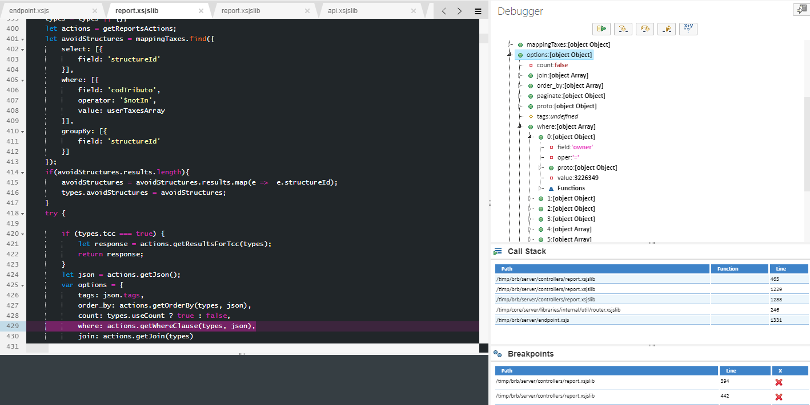
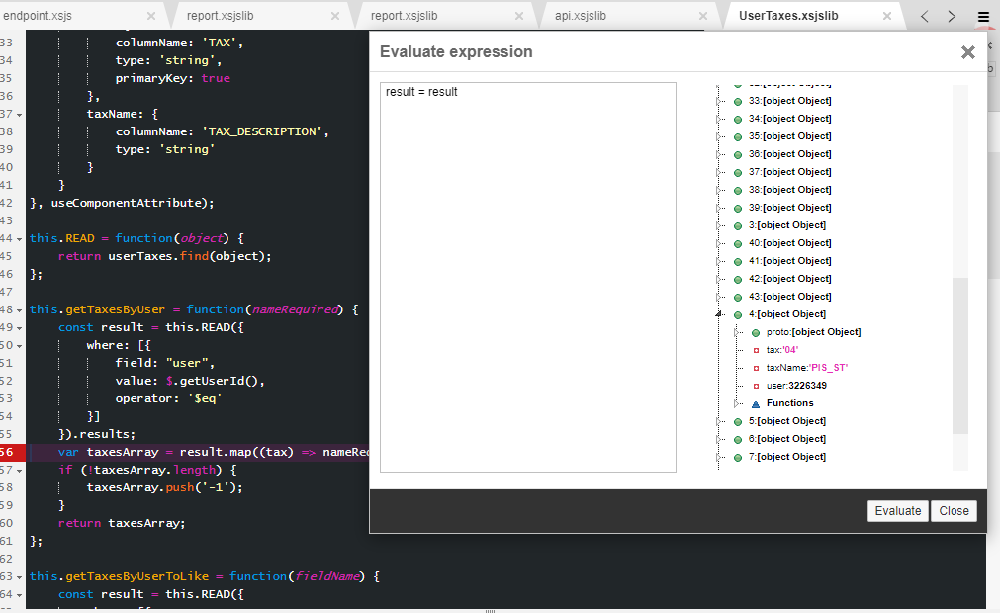
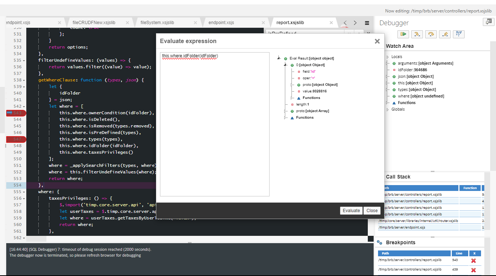

# Functionality to move Reports on BRB between forders
	- ## Step by Step client Request
		- Observation: some method read from a specific BRB, so we cannot use a copy.
		  background-color:: red
		- ### Adding to Folder
		  id:: 65e87e84-2980-490d-a452-239ef9e32c2f
		  collapsed:: true
			- **Selecting from the list of BRBs**
			  logseq.order-list-type:: number
			  :LOGBOOK:
			  CLOCK: [2024-03-06 Wed 15:04:57]--[2024-03-06 Wed 15:04:58] =>  00:00:01
			  CLOCK: [2024-03-06 Wed 15:05:05]--[2024-03-06 Wed 15:05:06] =>  00:00:01
			  :END:
				- DONE need to find how to take the selected items
				  logseq.order-list-type:: number
			- **Clicking on the button to add to target Folder**
			  logseq.order-list-type:: number
				- DONE Add the button to the UI
				  logseq.order-list-type:: number
				- DONE Add the functionality for the button on the UI
				  logseq.order-list-type:: number
				- DONE Add the endpoint on the UI
				  logseq.order-list-type:: number
				- DONE Add the endpoint on the Server
				  logseq.order-list-type:: number
				- DONE Add the functionality on the Server Side
				  logseq.order-list-type:: number
			- **Open the prompt to select the folder of Destination**
			  logseq.order-list-type:: number
				- DONE Find out how the prompt to move folders works today, can be reused?
				  logseq.order-list-type:: number
			- **Prompt loads all the Folders for the user**
			  logseq.order-list-type:: number
				- DONE Look for a `findAllFolders` method and if it doesn't exist, make one.
				  logseq.order-list-type:: number
					- Seams that folders work layer-by-layer
					  logseq.order-list-type:: number
			- **Selecting the destination Folder**
			  logseq.order-list-type:: number
				- DONE Checkbox or list to choose only one?
				  logseq.order-list-type:: number
			- **Inserting shortcut for the selected BRB on the destination folder**
			  logseq.order-list-type:: number
				- DONE Find out how the BRB are displayed in the folders today
				  logseq.order-list-type:: number
				- DONE Make the `onClick()`method of the button o the prompt to take the Folder as param and call to the back-end
				  logseq.order-list-type:: number
				- DONE  add the method `addToFolder()` on the Back-end for BRB
				  logseq.order-list-type:: number
		- ### Moving Between Folders
		  collapsed:: true
			- **Selecting from the list in the folder**
			  logseq.order-list-type:: number
				- DONE use the same method of the [Adding to Folder](logseq://graph/Notes?block-id=65e87e84-2980-490d-a452-239ef9e32c2f)
				  logseq.order-list-type:: number
			- **Clicking the button to move Between folders**
			  logseq.order-list-type:: number
			  id:: 65e87eab-d68c-424d-930f-2eebcb440fb5
				- DONE Add the Button to the UI
				  logseq.order-list-type:: number
				- DONE Add the method for the button in Front-end
				  logseq.order-list-type:: number
			- **Open Prompt**
			  logseq.order-list-type:: number
				- DONE Use the same prompt as used in the functionality [Adding to folder](logseq://graph/Notes?block-id=65e87e84-2980-490d-a452-239ef9e32c2f)
				  logseq.order-list-type:: number
			- **Selecting the destination folder**
			  logseq.order-list-type:: number
				- DONE Use the same method for listing the folder as [Adding to Folder](logseq://graph/Notes?block-id=65e87e84-2980-490d-a452-239ef9e32c2f)
				  logseq.order-list-type:: number
			- **Inserting the shortcut in destination folder and erase it from actual folder**
			  logseq.order-list-type:: number
				- DONE Add the method `transferToFolder()` on the back-end for BRB
				  logseq.order-list-type:: number
	- ## Ideas
		- <span style="text-decoration: line-through;">Only insert the Ids as filters for the actual BRB on the folders, using the actual mechanism of the folder, so when checked the BRB IDs can be inserted as filtered in the respective folder, that would mitigate the time expend creating a new table and relating it on the actual system used today</span>
		  logseq.order-list-type:: number
		- On the file timp.brb.server.controllers.report.xsjslib on the line 473 it call `cv_list_reports.READ(options)` we could make a new request and join the responses or modify the options to have all the reports inserted by the user. For both cases we would need a table containing all the files inserted on the folders.
		  logseq.order-list-type:: number
	- ## Development
		- ### Idea nº 1
			- DONE How listAll Works?
			  collapsed:: true
			  :LOGBOOK:
			  CLOCK: [2024-03-08 Fri 10:00:31]--[2024-03-08 Fri 17:36:53] =>  07:36:22
			  :END:
				- **When the user clicks on the folder it brings all the reports using the `listAll` method HIW?**
					- Request URL: http://as1-100-01-tq1:8000/timp/brb/server/endpoint.xsjs/reports/listAll/
					  logseq.order-list-type:: number
					- The endpoint appoint to Crontroller/reports.js -> this.listAll
					  logseq.order-list-type:: number
					  collapsed:: true
						- logseq.order-list-type:: number
						  ```js
						  this.listAll = function (object) {
						  	var result = null;
						  	var response = {};
						  	try {
						  		let options = {
						  			open: true,
						  			output: true,
						  			removed: false
						  		};
						  		result = _getReports(object, options);
						  		response = {
						  			listLength: result.length,
						  			list: result,
						  			offsetSize: Number(result.totalRowAmount),
						  			predefined: 0,
						  			open: 0,
						  			favorites: 0,
						  			mostUsed: 0,
						  			lastUsed: 0,
						  			removed: 0,
						  			output: 0
						  		};
						  		return response;
						  	} catch (e) {
						  		$.trace.error(e);
						  		// Ocorreu um erro ao tentar obter os relatórios
						  		$.messageCodes.push({
						  			code: 'BRB101051',
						  			type: 'E',
						  			errorInfo: util.parseError(e)
						  		});
						  		return null;
						  	}
						  };
						  ```
					- In this function a Variable _getReports( Object, options ) is called which actually brings all the data for the folder.
					  logseq.order-list-type:: number
					  collapsed:: true
						- logseq.order-list-type:: number
						  ```js 
						  let _getReports = (json, options, useCount) => {
						  	json = json || {};
						  	if (json.searchFilters) {
						  		options.searchFilters = json.searchFilters;
						  	}
						  	options.pageNumber = json.pageNumber || 1;
						  	options.offset = json.offset || 15;
						  	if (useCount) {
						  		options.useCount = useCount;
						  	}
						  	return this.getReports(options);
						  };
						  ```
					- The _getReports Variable returns another function called: `getReoprts(option)` in which option had now the `serachFilters`, `pageNumger` and `offset`
					  logseq.order-list-type:: number
					- The <span style="background-color: yellow; color: black;">getReports</span> function get the function `getTaxesByUser()` to fill the `var usertaxesArray` which is the base to define `avoidStructures`, as well as `avoidReports` in **line 52** so `userTaxesArray` should contain now the values for the tax in for the report they inserted in the folder to attend the client's request
					  logseq.order-list-type:: number
						- `getReport` Analysis.
						  logseq.order-list-type:: number
						  collapsed:: true
							- logseq.order-list-type:: number
							  ```js 
							  // Mount a custom query for listing
							  this.getReports = function (types) {
							      $.import('timp.atr.server.api', 'api'); 
							  	let atrApi2 = $.timp.atr.server.api.api;
							      const mappingTaxes = atrApi2.mappingTaxes.mappingTaxesxTributoModel;
							  	var userTaxes = coreApi.view.userTaxes;
							      var userTaxesArray = userTaxes.getTaxesByUser();
							  	var result = [];
							  	types = types || {};
							  	let actions = getReportsActions;
							  	let avoidStructures = mappingTaxes.find({
							          select: [{
							              field: 'structureId'
							          }],
							          where: [{
							              field: 'codTributo',
							              operator: '$notIn',
							              value: userTaxesArray
							          }],
							          groupBy: [{
							              field: 'structureId'
							          }]
							      });
							      if(avoidStructures.results.length){
							          avoidStructures = avoidStructures.results.map(e =>  e.structureId);
							          types.avoidStructures = avoidStructures;
							      }
							  	try {
							  
							  		if (types.tcc === true) {
							  			let response = actions.getResultsForTcc(types);
							  			return response;
							  		}
							  		let json = actions.getJson();
							  		var options = {
							  			tags: json.tags,
							  			order_by: actions.getOrderBy(types, json),
							  			count: types.useCount ? true : false,
							  			where: actions.getWhereClause(types, json),
							  			join: actions.getJoin(types)
							  			// simulate: true
							  		};
							  		
							  		if(types.bcb){
							  		    options.fields = ["id", "reportName", "json"]
							  		}
							  		    
							  		
							  		options = actions.addPagination(options, types);
							  		let response = [];
							  		
							  		let avoidReports = modelReportXTax.READ({
							  		    fields: ['reportId'],
							  		    where: [{
							  		        field: 'idTax',
							  		        oper: '=',
							  		        value: userTaxesArray,
							  		        not: true
							  		    }],
							  		    group_by: ['reportId']
							  		});
							  		
							  // 		lo de abajo x2
							  		if(avoidReports.length) {
							  		    avoidReports = avoidReports.map(e => e.reportId);
							  		    
							  		    options.where.push({
							  		        field: 'id',
							  		        oper: '=',
							  		        not: true,
							  		        value: avoidReports
							  		    })
							  		}
							  // 		Corregir Perfiles
							  		if(avoidStructures.length) {
							              options.where.push({
							  		        field: 'structureId',
							  		        oper: '=',
							  		        not: true,
							  		        value: avoidStructures
							  		    })
							          }
							  		response = cv_list_reports.READ(options);
							  		if(!types.raw){
							  		    result = actions.parseResponse(types, response);
							  		}else{
							  		    result = response;
							  		}
							  		result.totalRowAmount = response.totalRowAmount;
							  	} catch (e) {
							  		actions.logGetReportsError(types, e);
							  	}
							  	return result;
							  };
							  ```
						- The where only returns the reports where he is owner on **line 429**
						  logseq.order-list-type:: number
							- {:height 308, :width 599}
							  logseq.order-list-type:: number
						- logseq.order-list-type:: number
					- **userTaxes**
					  logseq.order-list-type:: number
						- In server.controller.reports.js:
						  logseq.order-list-type:: number
						  collapsed:: true
							- logseq.order-list-type:: number
							  ```js 
							  const coreApi = $.timp.core.server.api.api;
							  var userTaxes = coreApi.view.userTaxes;
							  ```
						- In core.server.api.api.js => 
						  logseq.order-list-type:: number
						  collapsed:: true
							- logseq.order-list-type:: number
							  ```js 
							  $.import('timp.core.server.models.views', 'UserTaxes');
							  this.view = {
							  	userTaxes: $.timp.core.server.models.views.UserTaxes
							  };
							  ```
						- In core.server.models.views.UserTaxes.js
						  logseq.order-list-type:: number
						  collapsed:: true
							- logseq.order-list-type:: number
							  ```js 
							  $.import('timp.core.server.orm', 'BaseModel');
							  const BaseModel = $.timp.core.server.orm.BaseModel.BaseModel;
							  $.import('timp.core.server.orm', 'table');
							  var tableLib = $.timp.core.server.orm.table;
							  
							  let useComponentAttribute = false;
							  let userTaxes = new BaseModel({
							  	name: 'timp.core.modeling.users/USER_TAXES',
							  	schema: '_SYS_BIC',
							  	identity: 'timp.core.modeling.users/USER_TAXES',
							  	type: 'view',
							  	inputParameters: [
							  		{
							  		    hanaName: 'USER_ID',
							  			columnName: '$$USER_ID$$',
							  			type: 'integer',
							  			defaultValue: $.getUserID()
							  		},
							  		{
							  		    hanaName: 'HANA_NAME',
							  			columnName: '$$HANA_NAME$$',
							  			type: 'string',
							  			defaultValue: $.session.getUsername()
							  		}
							  	],
							  	fields: {
							  		user: {
							  			columnName: 'USER',
							  			type: 'integer',
							  			primaryKey: true
							  		},
							  		tax: {
							  			columnName: 'TAX',
							  			type: 'string',
							  			primaryKey: true
							  		},
							  		taxName: {
							  			columnName: 'TAX_DESCRIPTION',
							  			type: 'string'
							  		}
							  	}
							  }, useComponentAttribute);
							  
							  this.READ = function(object) {
							  	return userTaxes.find(object);
							  };
							  
							  this.getTaxesByUser = function(nameRequired) {
							  	const result = this.READ({
							  		where: [{
							  			field: "user",
							  			value: $.getUserId(),
							  			operator: '$eq'
							          }]
							  	}).results;
							  	var taxesArray = result.map((tax) => nameRequired ? tax.taxName : tax.tax);
							  	if (!taxesArray.length) {
							  		taxesArray.push('-1');
							  	}
							  	return taxesArray;
							  };
							  
							  this.getTaxesByUserToLike = function(fieldName) {
							  	const result = this.READ({
							  		where: [{
							  			field: "user",
							  			value: $.getUserId(),
							  			operator: '$eq'
							          }]
							  	}).results;
							  	if (result.length > 0) {
							  		var taxesArray = result.map((e) => ({
							  			field: fieldName,
							  			oper: "LIKE",
							  			value: '%' + e.tax + '%'
							  		}));
							  		if (result.length > 1) {
							  			return taxesArray;
							  		} else {
							  			return taxesArray[0];
							  		}
							  	} else {
							  		var taxesObj = {
							  			field: fieldName,
							  			oper: "LIKE",
							  			value: '%' + null + '%'
							  		};
							  		return taxesObj;
							  	}
							  };
							  
							  let userTaxes_orm1 = new tableLib.Table({
							  	component: 'CORE',
							  	name: '"_SYS_BIC"."timp.core.modeling.users/USER_TAXES"',
							  	fields: {
							  		user: new tableLib.AutoField({
							  			name: 'USER',
							  			type: $.db.types.INTEGER
							  		}),
							  		tax: new tableLib.Field({
							  			name: 'TAX',
							  			type: $.db.types.NVARCHAR,
							  			dimension: 10
							  		})
							  	}
							  });
							  this.userTaxes_orm1 = userTaxes_orm1;
							  this.getIdentity = function() {
							  	return userTaxes.getIdentity();
							  };
							  
							  this.getOrm1Table = function() {
							  	return userTaxes_orm1;
							  };
							  
							  this.getJoin = function(fieldName, alias) {
							  	return {
							  	    map:'taxJoin',
							  		alias: 'taxJoin',
							  		type: 'inner',
							  		on: [{
							  			alias: 'taxJoin',
							  			field: 'tax',
							  			operator: '$eq',
							  			value: {
							  				alias: alias,
							  				field: fieldName
							  			}
							  		},
							  		{
							  			alias: 'taxJoin',
							  			field: 'user',
							  			operator: '$eq',
							  			value: $.getUserID()
							  		}]
							  	}
							  };
							  
							  this.getAlias = function() {
							  	return {
							  		collection: userTaxes.getIdentity(),
							  		name: 'taxJoin'
							  	}
							  };
							  
							  this.validateTax = function(tax){
							      var taxe = tax;
							      return this.getTaxesByUser().indexOf(tax) !== -1;
							  };
							  ```
						- Specifically in the `getTaxesByUser()` method in **line 42**; It returns all the taxes  the user has access to
						  logseq.order-list-type:: number
						  collapsed:: true
							- 
							  logseq.order-list-type:: number
							- logseq.order-list-type:: number
							  ```js 
							  let userTaxes = new BaseModel({
							  	name: 'timp.core.modeling.users/USER_TAXES',
							  	schema: '_SYS_BIC',
							  	identity: 'timp.core.modeling.users/USER_TAXES',
							  	type: 'view',
							  	inputParameters: [
							  		{
							  		    hanaName: 'USER_ID',
							  			columnName: '$$USER_ID$$',
							  			type: 'integer',
							  			defaultValue: $.getUserID()
							  		},
							  		{
							  		    hanaName: 'HANA_NAME',
							  			columnName: '$$HANA_NAME$$',
							  			type: 'string',
							  			defaultValue: $.session.getUsername()
							  		}
							  	],
							  	fields: {
							  		user: {
							  			columnName: 'USER',
							  			type: 'integer',
							  			primaryKey: true
							  		},
							  		tax: {
							  			columnName: 'TAX',
							  			type: 'string',
							  			primaryKey: true
							  		},
							  		taxName: {
							  			columnName: 'TAX_DESCRIPTION',
							  			type: 'string'
							  		}
							  	}
							  }, useComponentAttribute);
							  
							  this.READ = function(object) {
							  	return userTaxes.find(object);
							  };
							  
							  this.getTaxesByUser = function(nameRequired) {
							  	const result = this.READ({
							  		where: [{
							  			field: "user",
							  			value: $.getUserId(),
							  			operator: '$eq'
							          }]
							  	}).results;
							  	var taxesArray = result.map((tax) => nameRequired ? tax.taxName : tax.tax);
							  	if (!taxesArray.length) {
							  		taxesArray.push('-1');
							  	}
							  	return taxesArray;
							  };
							  ```
					- **modelReportXTax**
					  logseq.order-list-type:: number
						- logseq.order-list-type:: number
						  ```js 
						  const modelReportXTax = $.timp.brb.server.models.report.reportXTaxtable;
						  ```
						- **ReportXTaxtable**
						  logseq.order-list-type:: number
						  collapsed:: true
							- logseq.order-list-type:: number
							  ```js 
							  var reportXTaxtable = new tableLib.Table({
							      component: 'BRB',
							      name: schema.default + '."BRB::ReportXTax"',
							      tags: false,
							      fields: {
							          reportId: new tableLib.AutoField({
							              name: 'REPORT_ID',
							              type: $.db.types.INTEGER
							          }),
							          idTax: new tableLib.Field({
							              name: 'TAX_CODE',
							              type: $.db.types.NVARCHAR,
							              dimension: 10
							          })
							      }
							  });
							  this.reportXTaxtable = reportXTaxtable;
							  ```
			- DONE How can we make the Development work
			  collapsed:: true
			  :LOGBOOK:
			  CLOCK: [2024-03-08 Fri 17:37:17]--[2024-03-11 Mon 11:17:36] =>  65:40:19
			  :END:
				- The where clause gives all the params to the `cv_list_reports` on **line 473**, in the `options.where.idFolder` ther is an object which the ID is the id of the only Report Created on that folder
				  logseq.order-list-type:: number
					- I think it's possible to add the IDs of the shortcuts in the folder itself so this param can bring on the same search without requiring another call to `cv_list_reports`
					  logseq.order-list-type:: number
					- 
					  logseq.order-list-type:: number
		- ### Idea Nº 2
			- DONE Define Idea nº 2
			  :LOGBOOK:
			  CLOCK: [2024-03-11 Mon 11:36:56]--[2024-03-12 Tue 10:53:33] =>  23:16:37
			  :END:
			- #### Steps
				- **Inserting on to folders from output**
				  collapsed:: true
					- Client clicks on the checkbox
					  logseq.order-list-type:: number
						- Already exists
						  logseq.order-list-type:: number
					- Client clicks on the *Move Report button* to insert the report on to folder
					  logseq.order-list-type:: number
						- Create in the Front-end of BRB the button for *Move Report Button*
						  logseq.order-list-type:: number
						- Extract the ID of the Reports Selected
						  logseq.order-list-type:: number
						- If none is Selected Return toast with message "No Report Selected"
						  logseq.order-list-type:: number
					- Dialog box is open and all the folders are listed
					  logseq.order-list-type:: number
					  id:: 65ef1752-9194-4899-8e23-2ce106966861
						- `listAllFolder` is called using the `listFolder` recursively to return all the folder which will be displayed in the list on the popup.
						  logseq.order-list-type:: number
					- Client select destination folder and click on OK
					  logseq.order-list-type:: number
						- The method `addReportToFolder({ "id": <folder ID>, reportId: [id, ... id]})` will call the the Report file on method `addShortcutToFolder` that will insert on the table `BRB::Shortcuts` that will insert one line for each report  with the ID of the Folder and the ID of the report.
						  logseq.order-list-type:: number
				- **Entering the folder**
				  collapsed:: true
					- The client click on Root folder
					  logseq.order-list-type:: number
						- method already existent
						  logseq.order-list-type:: number
					- Client click on required folder and all the Reports inserted there appear
					  logseq.order-list-type:: number
						- the listAll method summarily calls `getReports(types)` in  /timp/brb/server/controllers/report.xsjslib and this last function call response = cv_list_reports.READ(options); which is a table in BRB containing all the BRB, on `"_SYS_BIC"."timp.brb.modeling/CV_LIST_REPORTS"`. either a new call will be made making `option.where.listFolder = [reports inserted in folder retrieved from BRB::Shortcuts]` and join the responses or we modify the already existing options.where.listFolder to contain the shortcut as well.
						  logseq.order-list-type:: number
				- **Moving on to another folder**
				  collapsed:: true
					- On client's folder
					  logseq.order-list-type:: number
						- Already Exists
						  logseq.order-list-type:: number
					- Client click on checkbox
					  logseq.order-list-type:: number
						- Already Exists
						  logseq.order-list-type:: number
					- Client click on *Move Report button*
					  logseq.order-list-type:: number
						- If none is Selected Return toast with message "No Report Selected"
						  logseq.order-list-type:: number
						- Takes the current folder ID and name
						  logseq.order-list-type:: number
					- A popup opens with all the folders available
					  logseq.order-list-type:: number
						- use the same as [Inserting on to folders from output item 3:](logseq://graph/Notes?block-id=65ef1752-9194-4899-8e23-2ce106966861)
						  logseq.order-list-type:: number
					- Client chosen report is excluded from the current folder and is included on to the chosen one
					  logseq.order-list-type:: number
						- Method Update is called from `addShortcutToFolder` with the params={currFolderId, destFolderId, [brbReports]}
						  logseq.order-list-type:: number
						- on the /timp/brb/server/controllers/report.xsjslib the `updatedShortcutsOnFolder` for each BRBReport is going to remove the `currFolderID` and insert the `destFolderId` on it's place
						  logseq.order-list-type:: number
				- **Removing report from folder**
				  collapsed:: true
					- On client's folder
					  logseq.order-list-type:: number
						- Already Exists
						  logseq.order-list-type:: number
					- Client click on checkbox
					  logseq.order-list-type:: number
						- Already Exists
						  logseq.order-list-type:: number
					- Client click on *Remove Report Button*
					  logseq.order-list-type:: number
						- Create the *Remove Report Button* on the BRB Front-end
						  logseq.order-list-type:: number
					- Confirmation pop's up
					  logseq.order-list-type:: number
						- UI function to inform the client
						  logseq.order-list-type:: number
					- Client Click OK 
					  logseq.order-list-type:: number
						- when clicked OK it starts `removeShortcutsFromFolder` method which call `deleteShortcut(currFolderId, [ BRBReports ])` method on /timp/brb/server/controllers/report.xsjslib 
						  logseq.order-list-type:: number
					- The Report selected is remove from folder
					  logseq.order-list-type:: number
						- `deleteShortcut(currFolderId, [ BRBReports ])` is going to find where in table `BRB::Shortcuts` currFolderId for each BRBReport and Delete it.
						  logseq.order-list-type:: number
		- ### Technical Specifications (Idea nº 2)
			- **Modification**
				- **LibraryToolbar.view.html** => 1h
					- **Path**
						- http://as1-100-01-tq1:8000/timp/core/ui/app/views/TimpLibrary/libraryToolbar.view.html
					- **Changes**
						- Complement changes in `libraryToolbar.controlle.js` -> 1h
				- **LIbraryToolbar.controller.js** => 7h
					- **Path**
						- http://as1-100-01-tq1:8000/timp/core/ui/app/controllers/timpLibrary/libraryToolbar.controller.js
					- **Changes**
						- Add the buttons for *Remove Report Button* and *Move Report button*
							- Add Buttons -> 1h
							- Add Functionality on front-end -> 2h
							- Display PopUp -> 1h
							- `ListAllFolders` -> 1h
							- Add to existing logic - 2h
				- **Report.xsjslib** => 7h
					- **Path**
						- /timp/brb/server/controllers/report.xsjslib
					- **Method that Calls**
						- http://as1-100-01-tq1:8000/timp/brb/server/endpoint.xsjs/reports/listAll/
					- **Changes**
						- Updating the`getReports` method to include the new call to `"_SYS_BIC"."timp.brb.modeling/CV_LIST_REPORTS"` -> 2h
						- Adding the new method `addShortcutToFolder` that will manage when the client wants a new shortcut in folder, or to update an existing shortcut -> 2.5h
						- Add the `removeShortcutToFolder` that will manage when the client wants to delete a shortcut or make an update in one -> 2.5h
				- **Create Table** => 5h
					- Create the table `BRB::Shortcuts` that will contain 2h
						- |Folder_ID|Report_ID|User_ID|User_Name|
					- Create the Structure to extract the data from the `BRB::Shortcuts` table => 3h
					-
			- **Security margin**
				- Given that most of the development I have done one time or never should make as 3 - "For not familiarized with the development" #[[Setting Deadlines]]
			- **Total Development time:**
				- 40 - 60 hours of Development