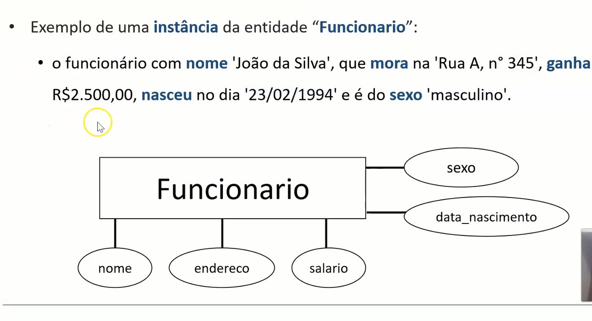
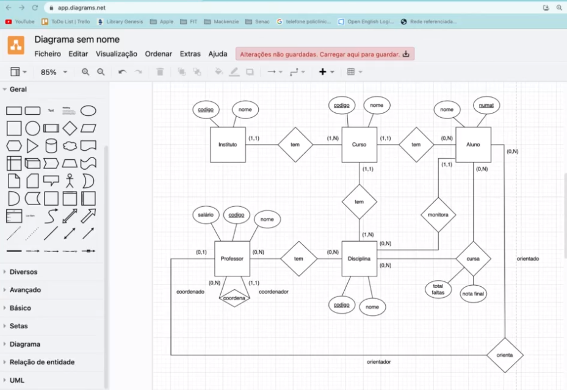
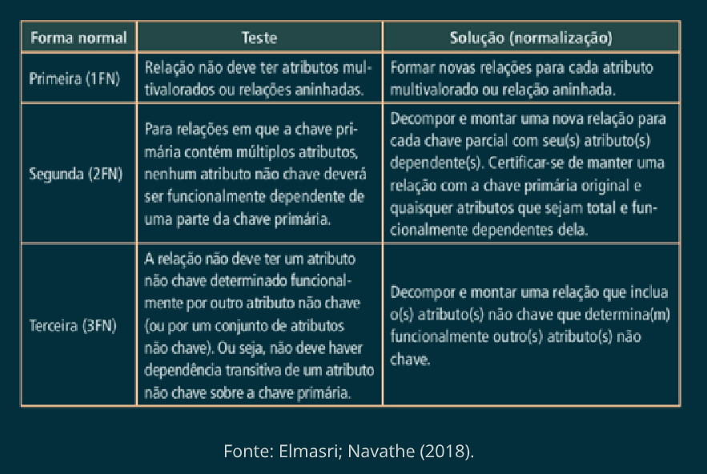

- #Mackenzie #[[3_Semester]] #Data
  id:: 6438c6c7-d193-42bc-b2f3-f052b6299850
- [[Mackenzie]] [[3_Semester]] [[Data]]
-
- ## Information
	- Professor: **LEONARDO MASSAYUKI TAKUNO**
-
-
- # Aula 1
  collapsed:: true
  <<<<<<< HEAD
  =======
  collapsed:: true
  >>>>>>> 5055831ef4bcf6459a0a356dc457d8173df3b1e3
	- 
	-
	- SGBD Sistema Gerenciador de Banco de Dados
	- The Data Base is manly to **manage data**, the **integrity** of it and the opening the possibility for many people to see the data simultaneously.
	-
	- ## Types of user of a DB #card
	  card-last-interval:: 4
	  card-repeats:: 1
	  card-ease-factor:: 2.6
	  card-next-schedule:: 2023-05-11T06:38:45.525Z
	  card-last-reviewed:: 2023-05-07T06:38:45.525Z
	  card-last-score:: 5
		- **Programmers of applications**
			- Use the Data Base on applications to storage and fetch the data.
		- **Final users**
			- The final user can access the Data Base through some application
		- **DA**
			- Data Administrator
			- What kind of data will be inserted in the Data Base
			- Choose the structure of the data to be inserted.
			- Rules to insert the data into the Data Base
			- Delimitate permissions for other users.
		- **Data Base Administrator (DBA)**
			- Ensure the rules created by the DA
			- Monitoring of the Data Base
			- Responsible for the security of the Data Base
			- responsible managing latency on the Data Base
		- **Considere as seguintes afirmações sobre os usuários de um banco de dados:**
		  collapsed:: true
		  card-last-interval:: 4
		  card-repeats:: 1
		  card-ease-factor:: 2.6
		  card-next-schedule:: 2023-05-21T14:14:27.612Z
		  card-last-reviewed:: 2023-05-17T14:14:27.612Z
		  card-last-score:: 5
		  1. Os **programadores de aplicações** desenvolvem programas aplicativos que acessam informações de um banco de dados.
		  2. Uma das formas dos **usuários finais** acessarem as informações de um banco de dados é por meio de programas aplicativos desenvolvidos pelos **programadores de aplicações**.
		  3. O **administrador de dados** (DA) é um gerente dos dados, ou seja, ele conhece bem os dados da empresa e sabe quais dados precisam ser armazenados em um banco de dados.
		  4. O **administrador de banco de dados** (DBA) implementa o banco de dados, de acordo com as decisões tomadas pelo DA. 
		  
		  Dentre os itens citados com relação aos **usuários de um banco de dados**, quais são **VERDADEIROS**? #card
			- All are correct!
		- Uma empresa de cosméticos “MGX” tem, dentre vários profissionais de tecnologia, um **Administrador de Dados** (DA) e um **Administrador de Banco de Dados** (DBA). Considere as seguintes afirmações sobre algumas funções do DA e do DBA, a seguir:
		  card-last-interval:: -1
		  card-repeats:: 0
		  card-ease-factor:: 2.5
		  card-last-reviewed:: nil
		  card-next-schedule:: nil
		  card-last-score:: nil
		  collapsed:: true
		  1. Estabelecer normas para manter e tratar os dados do banco de dados.
		  2. Implementar controles técnicos referentes às decisões sobre as normas dos dados do banco de dados.
		  3. Definir permissões aos usuários do banco de dados.
		  4. Coordenar e monitorar o uso do banco de dados.
		  5. Assegurar que o banco de dados opere com desempenho adequado.
		  Dentre os itens citados anteriormente, quais são **funções de um DA**? #card
			- 2, 4 e 5 somente.
		-
			- Uma empresa de produtos infantis “SPMN” tem, dentre vários profissionais de tecnologia, um **Administrador de Dados** (DA) e um **Administrador de Banco de Dados** (DBA). Considere as seguintes afirmações sobre algumas funções do DA e do DBA, a seguir: #card
			  collapsed:: true
			  <<<<<<< HEAD
			  card-last-interval:: 4
			  card-repeats:: 1
			  card-ease-factor:: 2.6
			  card-next-schedule:: 2023-12-26T12:58:45.516Z
			  card-last-reviewed:: 2023-12-22T12:58:45.516Z
			  card-last-score:: 5
			  =======
			  >>>>>>> 5055831ef4bcf6459a0a356dc457d8173df3b1e3
				- 1 e 3 somente.
			-
			- **DB architecture**
				- **Internal Level**
					- How the Data is storage internally
					- Low access "Low Level
				- **Conceptual level**
					- Is the representation of **all** the data but in a righter level.
					- DBA usually will use this level.
				- **External Level**
					- Is for the user that only needs the data.
					- Multiple kinds of access can be given to each kind of user, depending on permission
	-
		- A arquitetura de um banco de dados divide-se em níveis com as seguintes características:
		  collapsed:: true
		  card-last-interval:: 4
		  card-repeats:: 1
		  card-ease-factor:: 2.6
		  card-next-schedule:: 2023-09-30T17:18:45.664Z
		  card-last-reviewed:: 2023-09-26T17:18:45.664Z
		  card-last-score:: 5
		  1.O nível que se ocupa do modo como os dados são fisicamente armazenados.
		  2.Nível lógico de comunidade ou apenas lógico (mais abstrato que o físico e diferente da visão do usuário individual).
		  3.Nível lógico de comunidade ou apenas lógico (mais abstrato que o físico e diferente da visão do usuário individual). #card
			- interno, externo e conceitual.
		-
		- A arquitetura de um banco de dados divide-se em três níveis gerais, dentre estes:
		  collapsed:: true
		  -> O nível que descreve a parte do banco de dados que um dado grupo de usuários tem interesse, ocultando o restante do banco de dados e;
		  -> O nível que descreve os detalhes completos do armazenamento de dados e caminhos de acesso ao banco de dados. 
		  
		  **Esses dois níveis são, respectivamente: ** #card
			- nível externo e nível físico.
		- Analise as seguintes afirmações com relação à Arquitetura de um Banco de Dados:
		  collapsed:: true
		  card-last-interval:: 4
		  card-repeats:: 1
		  card-ease-factor:: 2.6
		  card-next-schedule:: 2023-08-28T13:52:31.411Z
		  card-last-reviewed:: 2023-08-24T13:52:31.411Z
		  card-last-score:: 5
		  1. O nível interno se ocupa do modo como os dados são fisicamente armazenados.
		  2. O nível externo se ocupa do modo como os dados são vistos por usuários individuais.
		  3. Uma visão externa representa a parte do banco de dados que um dado grupo de usuários tem interesse, ocultando o restante do banco de dados.
		  4. Uma visão conceitual é bem diferente do modo como os dados são visualizados por qualquer usuário.
		  
		  **São CORRETAS apenas as afirmações:** #card
			- I, II, III e IV.
		- ## Aplicando conhecimento
		  collapsed:: true
			- Com relação ao “**processamento de arquivos tradicionais (ou Sistema de Arquivos)**” versus “SGBD”, indique qual afirmação a seguir é **VERDADEIRA**:
			  collapsed:: true
			  **a.** Se o tempo para responder às consultas sobre os dados não for importante, ou seja, não precisa ser rápido, seria melhor utilizar um SGBD.
			  **b.** Se os dados forem concorrentemente acessados por diversos usuários, o melhor é utilizar Arquivos de Sistemas.
			  **c.** Se as alterações realizadas nos dados pelos usuários devem ser aplicadas consistentemente, o melhor seria utilizar Arquivos de Sistemas.
			  **d.** Se o acesso a determinadas partes dos dados deve ser restrito, o melhor seria utilizar um SGBD #card
				- Alternativa: D
			- Considere os seguintes itens com relação a um banco de dados:
			  collapsed:: true
			  **1.** Dependência de dados.
			  **2.** Acesso eficiente aos dados.
			  **3.** Integridade e segurança dos dados.
			  **4.** Acesso concorrente e recuperação de falha.
			  
			  Dentre os itens citados anteriormente, quais podem ser considerados **vantagens de um SGBD** (sistema gerenciador de banco de dados)?#card
				- Resp: 2, 3 e 4.
			- Das afirmações abaixo sobre bancos de dados pode se dizer que:
			  collapsed:: true
			  card-last-interval:: 4
			  card-repeats:: 1
			  card-ease-factor:: 2.6
			  card-next-schedule:: 2023-05-21T14:14:22.304Z
			  card-last-reviewed:: 2023-05-17T14:14:22.305Z
			  card-last-score:: 5
			  **1.** Os dados em um banco de dados são integrados em arquivos que formam o banco de dados e, também, são compartilhados para que vários usuários possam ler o mesmo dado ao mesmo tempo.
			  **2.** Qualquer solicitação de acesso ao banco de dados é tratada pelo SGBD.
			  **3.** O SGBD facilita a vida dos usuários de um banco de dados, pois ele isola esses usuários dos detalhes do nível de hardware.
			  **4.** Os usuários finais podem acessar um banco de dados, indiretamente, por meio de aplicações desenvolvidas pelos programadores de aplicações.
			  Dentre os itens citados anteriormente, quais são VERDADEIROS? #card 
			  São verdadeiras:
				- Todas
			- Com relação aos Conceitos Básicos e à Arquitetura de um Banco de Dados, considere as seguintes afirmações:
			  collapsed:: true
			  card-last-interval:: 4
			  card-repeats:: 1
			  card-ease-factor:: 2.6
			  card-next-schedule:: 2024-02-05T14:30:29.068Z
			  card-last-reviewed:: 2024-02-01T14:30:29.069Z
			  card-last-score:: 5
			  **1.** Os dados armazenados fisicamente em um banco de dados são integrados e não podem ser compartilhados de maneira alguma.
			  **2.** “Sistemas de arquivos (processamento de arquivos tradicionais)” gravam seus dados em disco, segundo estruturas de dados próprias, e para acessar os dados, é necessário conhecer essas estruturas. Portanto, se vários programas compartilham os mesmos dados, então todos devem conhecer e manipular as mesmas estruturas.
			  **3.** Diferentes usuários compartilham os dados, já que o banco de dados permite que vários usuários acessem e alterem o mesmo dado ao mesmo tempo.
			  **4.** Uma visão conceitual é bem diferente do modo como os dados são visualizados por qualquer usuário.
			  
			  São corretas apenas as afirmações: #card
				- 2 e 4
			- Com relação ao “**Sistemas de arquivos (processamento de arquivos tradicionais)**” e ao “Sistema de Banco de Dados”, indique qual afirmação abaixo é **VERDADEIRA**.
			  collapsed:: true
			  card-last-interval:: 4
			  card-repeats:: 1
			  card-ease-factor:: 2.6
			  card-next-schedule:: 2023-09-30T17:18:40.042Z
			  card-last-reviewed:: 2023-09-26T17:18:40.042Z
			  card-last-score:: 5
			  **a.** O “Sistema de Banco de Dados” possui uma dependência com o programa de aplicação bem maior que a dependência que um “Sistema de Arquivos” possui, já que o SGBD facilita toda a interface do Sistema de Arquivos com o programa.
			  **b.** “Sistemas de arquivos” gravam seus dados em disco, segundo estruturas de dados próprias e, para acessar os dados, é necessário conhecer estas estruturas. Portanto, se vários programas compartilham os mesmos dados, então todos devem conhecer e manipular as mesmas estruturas.
			  **c.** No “Sistema de Arquivos”, os dados são íntegros, já que os dados são armazenados em um único local bem especificado.
			  **d.** No “Sistema de Arquivos”, ocorre uma redução da duplicação de dados, pois como os dados estão armazenados em um único local, existem menos chances para os dados terem múltiplas cópias.
			  **e.** No “Sistema de Arquivos”, cada programa vê apenas os dados que lhe interessam e não precisa ser modificado se a estrutura de dados for alterada.
			  
			  Resposta: #card
				- B
- # Aula 2
  collapsed:: true
	- ## Texto de Apoio
		- 
	- ## Ponto de Partida
		- Modelo de Entidade-Relacionaemnto(MER)
			- It's a conceptual model that model the data upon the high level view no thinking at first on how the data will be stored
			- Each entity is represented by an rectangle.
			- For each attribute of the entity we can draw an ellipse for it:
				- 
			- Each Entity must have an **Primary Key**
			- Tool for trainning BrtModelo [BrModelo](https://www.sis4.com/brmodelo/antigo.html)
	- ## Professor Resolve
		- **Relationship**
			- Cardinality:
				- |**Form**|**To**|**Meaning**|
				  |N|N|From many to many|
				  |N|1|From many to 1|
				  |1|N|From 1 to many|
				-
	- ## Momento com Professor
		- **BANCO DE DADOS – AULA 2**
		  **MOMENTO COM O PROFESSOR**
		  Texto para a construção do Modelo Entidade-Relacionamento
		  Uma universidade possui vários institutos e cada instituto é responsável por um
		  ou mais cursos, mas um curso pertence somente a um único instituto. Para cada
		  instituto, deve-se ter o código e o nome, e, para cada curso, os mesmos dados
		  de instituto.
		  Cada curso da universidade possui várias disciplinas (pode não possuir
		  nenhuma disciplina quando ele for criado), sendo que cada disciplina deve estar
		  relacionada a um e somente um curso. Para cada disciplina, é necessário saber
		  seu código e nome.
		  Cada professor pode ministrar várias disciplinas (é permitido que um professor
		  não ministre nenhuma disciplina, temporariamente) e uma mesma disciplina
		  pode ser ministrada por mais de um professor (uma disciplina pode não ter
		  professor quando ela foi criada). É necessário saber o dia da semana e a sala
		  em que um determinado professor ministra certa disciplina.
		  Para cada professor, é necessário saber seu código, nome e salário. Cada
		  professor deve possuir um professor que é seu coordenador, sendo que um
		  professor pode coordenar nenhum ou vários professores, e um professor tem
		  sempre um único coordenador.
		  Cada aluno deve pertencer a um único curso e um curso pode ter nenhum ou
		  vários alunos. Todo aluno pode cursar nenhuma ou várias disciplinas (mesmo
		  que não seja do curso que ele pertence) e cada disciplina é cursada por nenhum
		  ou vários alunos. Para cada aluno, deve-se ter a nota final que ele tirou em
		  determinada disciplina, bem como o número de faltas. Cada aluno pode
		  monitorar várias disciplinas (ou nenhuma), mas uma disciplina sempre deverá
		  ter um único monitor.
		  A universidade deseja guardar informações de seus alunos, como nome e
		  número de matrícula.
		  Cada aluno ainda possui um único professor orientador de seu trabalho de
		  conclusão de curso (pode ser que o aluno não tenha nenhum orientador quando
		  ainda não iniciou seu trabalho de conclusão de curso), e um professor pode
		  orientar nenhum ou vários alunos.
		- 
		-
- # Aula 3
  collapsed:: true
	- ## Texto de Apoio
	- 
	- ## Ponto de Partida
		- **Relational Model**
			- **Entity Integrity** => Each row must have one unique Key so it may be found
			- **Domain Integrity** => Each given value must follow the rules for such type of value
			- **Reference Integrity** => The primary key for a given element must be present in the reference table that represents the relationship between the two, or NULL value.
	- ## Professor Resolve
		- **Maping Relations**
			- In the relationship whatever table in the **many** side receiver an foreign key at the end of the it's columns.
			- When the relations is 1 : 1 then the you can choose between the two instances to receive the foreign key.
	- ## Professor Resolve 2
		- [DBDesign](https://www.dbdesigner.net/)
- # Aula 4
  collapsed:: true
	- ## Texto de Apoio
		- 
		-
	- ## Normatizing
		- 
		- **Rules:**
			- **1FN** => **Cannot** have any nested tables.
			- **2FN** => **Cannot** have items that depend on only one part of the Primary key.
			- **3FN** => **Cannot** have any columns that depend on each other not specifically the primary key.
			-
- # Aula 5
	- ## Texto de Apoio
		- 
	- ## Ponto de partida
		- **SQL**
			- Is the default language to relational Data Base
			- To create a table with Name and Register with it being the primary key\
			- ```SQL 
			  CREATE TABLE Aluno
			  (Matricula INTEGER CHECK(Matricula >= 1),
			  Nome_aluno VARCHAR(50) NOT NULL,
			  PRIMARY KEY (Matricula)
			  );
			  
			  ```
			- ```sql 
			  INSERT
			  INTO Aluno (Matricula, Nome_aluno)
			  VALUES (1, 'João')
			  ```
			- ```SQL 
			  UPDATE nome_table
			  SET Nota = Nota + 1 
			  WHERE (Nota >= 7) AND (Nota <= 9);
			  ```
			- ```sql 
			  DELETE
			  FROM Aluno_disciplina
			  WHERE (Cod_disc = 101);
			  
			  ```
	- ## Professor Resolve
		- Using Oracle Data Base Online
	- ## Professor Resolve II
		- **SELECT**
		- ```SQL 
		  SELECT PeNome
		  FROM Peca
		  WHERE ((PeCor = 'Vermelho') OR (PeCor = 'Amarelo'))
		  AND (PePreco IN (09, 18, 22, 40, 90))
		  ORDER BY PePreco ASC;
		  ```
		-
		-
- # Aula 6
	- ## Texto de Apoio
		- 
		-
	- ## Ponto de Partida
		- Using: `JOIN`
		- **Ways to do it**
			- **Joining condition**
				- ```SQL 
				  -- Joining condition
				  SELECT *
				  FROM Table_1 A, Table_2 B
				  WHERE (A.titleofprimarykey = B.columtitleofforeingkey);
				  ```
				- If the where is used without any boundaries the tables resulting from this will be an Cartesian product.
			- **Inner join**
				- ```SQL 
				  -- INNER JOIN
				  SELECT *
				  FROM Table_1 A INNER JOIN Table_2 B
				  ON (A.titleofprimarykey = B.coluntitleofforeignkey);
				  ```
			- **Left Join**
				- ```SQL
				    -- Joining condition
				    SELECT *
				    FROM Table_1 A LEFT JOIN Table_2 B
				    ON (A.titleofprimarykey = B.coluntitleofforeignkey);
				  ```
					- All the lines on the table on the left will be on the resulting table, however from the table on the right only the lines with correspondence on the left table.
			- **Right Join**
				- ```SQL
				    -- Joining condition
				    SELECT *
				    FROM Table_1 A RIGH JOIN Table_2 B
				    ON (A.titleofprimarykey = B.coluntitleofforeignkey);
				  ```
					- All the lines on the table on the RIGHT will be on the resulting table, however from the table on the LEFT only the lines with correspondence on the RIGHT table.
	- ## Professor Resolve
		- **Nested Queries or Subqueries**
			- ```SQL 
			  SELECT *
			  FROM Funcionario
			  WHERE Salario > (
			    SELECT AVG(Salario)
			    FROM Fucnionario
			  );
			  ```
	- ## Praticando
		- 1) Obtenha o nome de cada aluno e o nome do curso a que cada um pertence.
		  Partir do banco de dados da aula 5. #card
			- ```SQL 
			  -- Dados
			    	-- Nome aluno  
			    	-- Nome Curso  
			    SELECT Nome_Aluno, Nome_Curso  
			    FROM Aluno A INNER JOIN Curso C  
			    ON (A.Cod_curso = C.Cod_curso);
			  ```
		- 2) Obtenha a maior idade, a menor idade e a idade média dos alunos do curso de 'Ciencia da Computacao'.
		  card-last-interval:: 4.59
		  card-repeats:: 1
		  card-ease-factor:: 2.6
		  card-next-schedule:: 2024-03-31T10:09:48.244Z
		  card-last-reviewed:: 2024-03-26T20:09:48.246Z
		  card-last-score:: 5
		  A partir do banco de dados da aula 5. #card
			- ```sql 
			  -- Dados
			  	-- Do curso de "Ciencia da Computação"
			  		-- Maior idade
			  		-- Menor idade
			  		-- Idade média
			  SELECT
			  	Nome_Curso,
			  	MAX(Idade) AS Maior_Idade,
			  	MIN(Idade) AS Menor_Idade,
			  	AVG(Idade) AS Idade_Media
			  FROM Aluno A INNER JOIN Curso C
			  ON A.Cod_curso = C.Cod_curso
			  GROUP BY Nome_Curso
			  HAVING Nome_Curso = 'Ciencia da Computacao'
			  ```
		- 3) Obtenha o nome de cada curso (que tenha aluno) e, para cada curso, a média de idade e a quantidade de alunos.
		  card-last-interval:: 4
		  card-repeats:: 1
		  card-ease-factor:: 2.6
		  card-next-schedule:: 2023-08-28T13:52:27.618Z
		  card-last-reviewed:: 2023-08-24T13:52:27.619Z
		  card-last-score:: 5
		  A partir do banco de dados da aula 5. #card
			- ```sql 
			  -- Dados
			    	-- Para cada curso com alunos  
			    		-- avg (idade)  
			    		-- count(alunos)  
			    SELECT  
			    	Nome_curso,  
			    	AVG(IDADE) AS Idade_Media,  
			    	COUNT(Nome_Aluno) AS Qtd_Alunos  
			    FROM Curso C INNER JOIN Aluno A  
			    ON C.Cod_curso = A.Cod_curso  
			    GROUP BY Nome_Curso  
			    HAVING COUNT(A.Nome_Aluno) > 0
			  ```
		- 4) Obtenha o nome de cada aluno da universidade (mesmo aqueles que ainda não cursaram disciplina) e a quantidade de disciplinas que cada um já cursou.
		  card-last-interval:: 4
		  card-repeats:: 1
		  card-ease-factor:: 2.6
		  card-next-schedule:: 2023-07-08T13:48:58.027Z
		  card-last-reviewed:: 2023-07-04T13:48:58.027Z
		  card-last-score:: 5
		  -> Retorne em ordem crescente da quantidade de disciplinas e, se houver empate na quantidade, em ordem crescente de nome do aluno.
		  A partir do banco de dados da aula 5. #card
			- ```sql 
			  -- DADOS
			  	-- nome alunos com ou sem disciplina
			  	-- quantidade de disciplinas que cada um ja cursou
			  -- DESC de qtd de desciplinas
			  -- DESC de nome do aluno
			  SELECT 
			  	A.Nome_Aluno,
			  	COUNT(AD.Cod_Disciplina) AS Qtd_Disciplinas
			  FROM Aluno A LEFT JOIN Aluno_Disc AD
			  ON A.Matricula = AD.Matricula
			  GROUP BY A.Nome_Aluno
			  ORDER BY 
			  	Qtd_Disciplinas DESC,
			  	Nome_Aluno DESC
			  ```
		- 5) Obtenha o nome das disciplinas que a aluna 'Claudia' cursou e a nota que ela tirou em cada uma delas.
		  card-last-interval:: 4
		  card-repeats:: 1
		  card-ease-factor:: 2.6
		  card-next-schedule:: 2024-02-05T14:30:38.508Z
		  card-last-reviewed:: 2024-02-01T14:30:38.508Z
		  card-last-score:: 5
		  A partir do banco de dados da aula 5. #card
			- ```sql
			  --DADOS
			  	-- CLAUDIA:
			  --NOME DISCIPLINA
			  --NOTA EM CADA.
			  SELECT 
			  	A.Nome_Aluno,
			  	D.Nome_Disciplina,
			  	AD.Nota
			  FROM Aluno A INNER JOIN Aluno_Disc AD
			  ON A.Matricula = AD.Matricula
			  INNER JOIN Disciplina D
			  ON AD.Cod_Disciplina = D.Cod_Disciplina
			  WHERE A.Nome_Aluno = 'Claudia'
			  ```
			-
		- 6) Obtenha o nome de cada disciplina e o nome do instituto a que cada uma pertence.
		  <<<<<<< HEAD
		  card-last-interval:: 4
		  card-repeats:: 1
		  card-ease-factor:: 2.6
		  card-next-schedule:: 2023-12-26T12:59:19.218Z
		  card-last-reviewed:: 2023-12-22T12:59:19.219Z
		  card-last-score:: 5
		  =======
		  >>>>>>> 5055831ef4bcf6459a0a356dc457d8173df3b1e3
		  A partir do banco de dados da aula 5. #card
			- ```sql 
			  --DADOS
			  	--NOMES DISCIPLINA
			  --NOME INSTITUTO
			  SELECT 
			  	D.Nome_Disciplina,
			  	I.Nome_Instituto
			  FROM Disciplina D INNER JOIN Curso C
			  ON D.Cod_Curso = C.Cod_curso
			  INNER JOIN Instituto I
			  ON C.Cod_Instituto = I.Cod_instituto
			  ```
		- 7) Obtenha o nome de todos os professores da universidade (mesmo aqueles que ainda não ministraram disciplina) e os nomes das disciplinas que eles ministram.
		  card-last-interval:: 4
		  card-repeats:: 1
		  card-ease-factor:: 2.6
		  card-next-schedule:: 2023-09-30T17:18:52.817Z
		  card-last-reviewed:: 2023-09-26T17:18:52.817Z
		  card-last-score:: 5
		  -> Retorne em ordem crescente do nome do professor.
		  A partir do banco de dados da aula 5. #card
			- ```sql 
			  --DADOS
			  	--NOMES PROFESSORES
			  --NOMES DAS DISCIPLINAS
			  --EM ORDEM CRESCENTE NOME PROF.
			  SELECT
			  	P.Nome_Professor,
			  	D.Nome_Disciplina
			  FROM
			  	Professor P LEFT JOIN Prof_Disc PD
			  ON P.Cod_Professor = PD.Cod_Professor
			  LEFT JOIN Disciplina D
			  ON PD.Cod_Disciplina = D.Cod_Disciplina
			  ORDER BY P.Nome_Professor ASC
			  ```
		- 8) Obtenha o nome dos alunos (de qualquer curso) que têm idade superior à média de idade dos alunos do curso de 'Administracao de Empresas'.
		  <<<<<<< HEAD
		  card-last-interval:: 4
		  card-repeats:: 1
		  card-ease-factor:: 2.6
		  card-next-schedule:: 2023-12-26T12:59:58.043Z
		  card-last-reviewed:: 2023-12-22T12:59:58.044Z
		  card-last-score:: 5
		  =======
		  >>>>>>> 5055831ef4bcf6459a0a356dc457d8173df3b1e3
		  A partir do banco de dados da aula 5. #card
			- ```sql 
			  SELECT
			  	Nome_Aluno,
			  	Idade
			  FROM Aluno
			  WHERE Idade > (
			  	SELECT AVG(Idade)
			  	FROM Aluno A INNER JOIN Curso C
			  	ON A.Cod_curso = C.Cod_curso
			  	WHERE C.Nome_Curso = 'Administracao de Empresas'
			  	)
			  ```
		- 9) Obtenha o nome de cada professor (que orienta aluno) e a quantidade de alunos que cada um orienta, mas somente aqueles que orientam mais alunos que o professor ‘Joao’.
		  card-last-interval:: 4
		  card-repeats:: 1
		  card-ease-factor:: 2.6
		  card-next-schedule:: 2023-05-11T06:38:24.423Z
		  card-last-reviewed:: 2023-05-07T06:38:24.426Z
		  card-last-score:: 5
		  A partir do banco de dados da aula 5. #card
			- ```sql
			  -- DADOS
			  	-- PROFESSOR QUE ORIENTA
			  -- QTD ORIENTANDOS SE > QUE PROF JOAO
			  SELECT 
			  	P.Nome_Professor,
			  	COUNT(A.Nome_Aluno) AS QTD_Orientandos
			  FROM
			  	Professor P INNER JOIN Aluno A
			  ON P.Cod_Professor = A.Cod_Professor_Orientador
			  GROUP BY P.Nome_Professor
			  HAVING COUNT(A.Nome_Aluno) > (
			    SELECT 
			  	COUNT(A.Nome_Aluno)
			    FROM
			  	Professor P INNER JOIN Aluno A
			    ON P.Cod_Professor = A.Cod_Professor_Orientador
			    WHERE P.Nome_Professor = 'Joao'
			  )
			  ```
		-
		-
- # Aula 7
  collapsed:: true
	- ## **PL/SQP** -> Oracle Data base language
		- **Procedure**, -> execute a determined task that you can preset
		- **Function** -> return a value, in structure is very similar to procedure.
		- **Trigger** -> Automatically executed when a insert or a update is done in a table.
	- ## Declaring variables.
		- Declare example:
			- ```sql 
			  DECLARE
			  	maior_salario int: = 0;
			  END;
			  ```
		- IF always has END IF; (ELSIF is the correact else if grammatic)
	- # Procedure
		- `CREATE OF REPLACE PROCEDURE`
			- take args between ()
			- need to have execute prcedure_name
		-
	- # Trigger
		- ```PLSQL 
		  CREATE OR REPLACE TRIGGER Insere_atualiza_Func
		  BEFORE
		  INSERT OR UPDATE OF Salario
		  ON Funcionario
		  FOR EACH ROW
		  BEGIN
		  	IF inserting THEN
		      	INSERT
		          INTO Admissao ( arg1, arg2, arg3 )
		          VALUES (:new.arg1, :new.arg2, arg3);
		          ELSIF UPDATING THEN
		          INSERT
		          INTO Historico_salarial (Cod_func, Salario_Antigo, Salario_Atual)
		          VALUES (:old.arg1, :old.arg2, new.salario);
		      END IF;
		  END;
		  
		  ```
	- # Aula 8
		- ## Commit
			- Atomicidade -> tudo é feito ou não
			- consistencia -> inicia e fim deve estar connsistente
			- isolamento -> varias são feitas mas cadda uma isoladamente
			- durabilidade -> se depois do commit houver falha no banco de dados mesmo assim os dados estarão armazenados.
		- ## Rollback
		- ## Restaurar
			- Volta ao ultimo commit
			- Ou tudo é feito ou tudo é perdido.
			- checkpointgravação fisica
		- ## Concorrencia
			- Atualização perdida
			- Dependencia sem commit
			- Analise inconsistente
			- ## Deadlock
				- uma das duas devem fzer um rollback
				- para economi de processamento a maioria dos bancos de dados entende que se a transação esta parada por um certo tempo deve fazer rolback por assumir um deadlock
				-