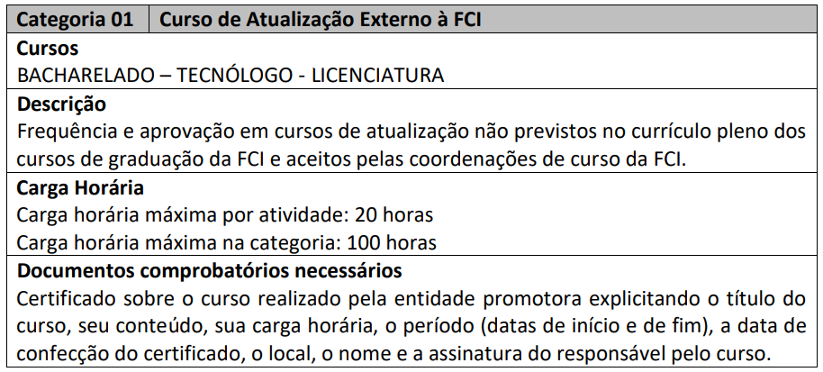
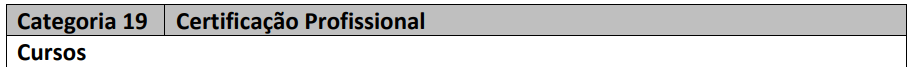
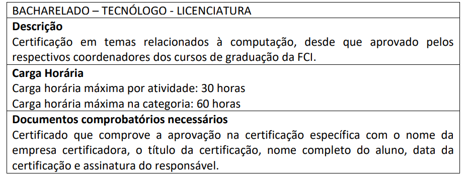
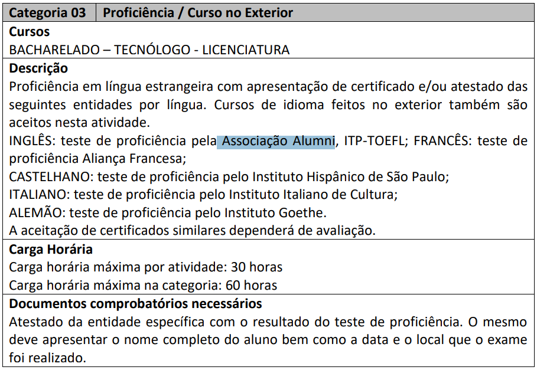
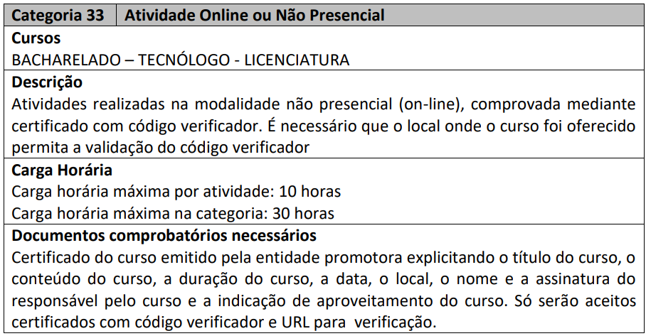
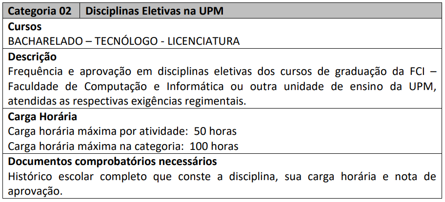
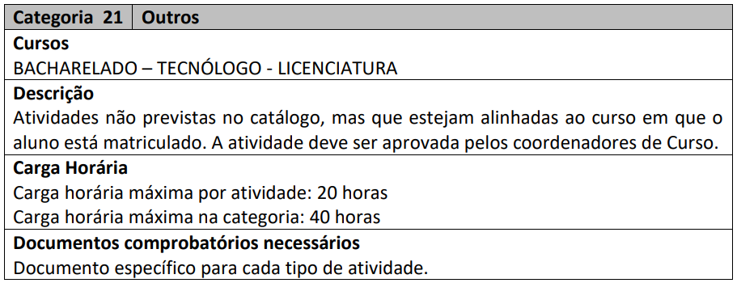

- 
- ## ToDo
	- LATER Pay for "curso em Video" certificates
	- LATER Join all certificates in a Dir
	- LATER Copy all links for all certifications to a spreadsheet
	- LATER Save the spreadsheet to a PDF
	- LATER Send PDF to FCI
- ## Options
  collapsed:: true
	- **Curso de atualização**
		- 
	- **Certification**
		- 
		- 
	- **Language Certification**
		- 
		- A partir do dia 11/06/2021, o Centro Alumni de Exames e Certificações estará funcionando na **Avenida Professor Noé Azevedo, 208 – 5º andar, Vila Mariana, São Paulo**. Para mais informações, e inscrição para exames aplicados pelo Centro Alumni de Exames e Certificações, entre em contato conosco pelo endereço de e-mail [prometric@alumni.org.br](mailto:prometric@alumni.org.br) ou pelo telefone: 55 11 5549 0007.
	- **Online or not in person**
		- 
	- **Maybe**
		- 
		- 
		-
- # Plan
  collapsed:: true
	- |Course|Max per Certificate|Max Total|
	  |Languages|30|60|
	  |Certification|30|60|
	  |Outros|20|40|
	  |Curso de Atualização Externo a FCi|20|100|
- # Platforms
  collapsed:: true
	- ## Curso em Vídeo:
		- ### Pricing
			- R$ 45 per certificate
			- R$ 25 per month with a certificate per month
				- 6 months or 12 months
		- Classes:
			-