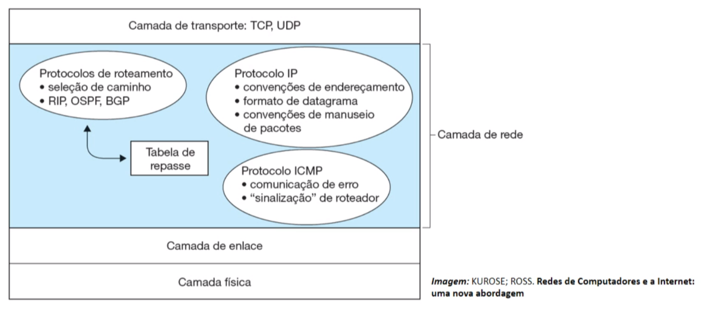

- [[Mackenzie]] [[3_Semester]] [[Data]]
-
- ## Information:
	- Teacher: MARCELO TEIXEIRA DE AZEVEDO
-
- # Aula 1
  collapsed:: true
	-
	- ## Ponto de partida
		- **How internet works?**
			- Hosts final systems running net applications
			- Commutators
		- **Infrastructure and communications**
			- Protocols -> TCP, IP, HTTP, FTP, PPP
	-
	- ## Texto de Apoio
		- 
	-
		- ## Professor Resolve
			- **Net command verification**
				- **Message** -> Data sent in between devices
				- **Means Transmission** -> Actual physic mean where it will pass through
				- **Protocols** -> Are norms that define how one device will communicate with another
			-
			- **IP protocol**
				- CMD ->`ipconfig`#card
					- Returns the IP adress fo rhte computer, IPV4 IPV6 DNS an so on.
				- CMD -> `ping + IP address or web domain #card
					- will return the time to reach the desired location.
				- CMD -> `tracert` #card
					- Return all the devices you will pass to access some device or domain.
				-
			- **Usefull webSites for net**
				- **whois** https://who.is/ -> Who is using this IP
				- **ping.eu** https://ping.eu/  -> where the IP is located.
				- **beta.simet.nic.br**  https://beta.simet.nic.br/ -> Speed test
				-
		- ## Praticando
			- **Questão 1**.
			  
			  Ipconfig é um programa do Sistema Operacional (SO) (Windows e Linux) que permite visualizar e configurar algumas opções TCP/IP.
			-
				- A.      Execute o comando “ipconfig”. Qual é o endereço IP da sua máquina? #card
					- CMD -> `ipconfig` `returns 192.168.15.114`
				- B.      O que é o endereço IP? #card
					- The IP Internet Protocol address is the number that identifies either a local network or a device on the internet. It is Number that follows government rules in order to trace you and give you access to information.
				- C.       Visite a página <http://www.whatismyip.com>. Ela informa o endereço IP de qualquer máquina que a acessar. O endereço mostrado no site é igual ao endereço que o ipconfig mostrou? Por qual razão temos dois endereços diferentes (se for o caso). #card
					- No they are not the same: the `ipconfig` command finds out the local IP for the PC, while the webpage finds out the IP address for the local network.
				- D.       O que seria o endereço de Gateway padrão? #card
					- Is the IP from the router which is connected to a Local Network can be configured manually or given Dynamically.
			- **Questão 2**.
			  
			  Ping é um comando que usa o protocolo ICMP para testar a conectividade entre equipamentos. Execute o comando ping no site de busca do google ([www.google.com.br](http://www.google.com.br/)), ou outro site de sua preferência e responda:
				- Quais são as informações retornadas pelo comando.? #card
					- Returns the 4 average for the time spent in trying to reach such domain, also manny of the information send was lost.
				- O que representa a variável tempo apresentada pelo comando? #card
					- The time spend to the package to reach such domain and return
				- O que é o TTL? #card
					- TTL Means time to leave -> The time that the specified information will be available in your system normally
				- Como podemos utilizar esse comando para gerenciar e detectar problemas na rede? #card
					- It can be used to see if we are reaching some domain, for an instance, if we can access the server on the company but not the Internet it is fare to assume that the Computer does not have permission but the network system is working.
			-
			- **Questão 3**.
			  
			  O comando traceroute consegue traçar uma rota entre dois hosts conectados à internet. No Unix, o comando tem o nome “traceroute”. No Windows, o nome é “tracert”. Execute o comando traceroute na linha de comando para o site do google tracert [www.google.com.br](http://www.google.com.br/)**
				- O que o comando tracert entende por salto? #card
					- The amount or Routers that the package will pass by.
				- **B.      **Por quantos endereços IP diferentes os “pacotes de passaram”? #card
					- In the case of www.google.com => 10 different IP's
				-
			- **Questão 4**.
			  
			  Agora, mediremos a taxa de transferência de dados da sua conexão internet. Acesse o site [https://beta.simet.nic.br/](https://beta.simet.nic.br/) e execute o teste.
			-
				- **A.      **Qual é seu tipo de conexão (fibra, cabo, radio etc.)?
					- Cable
				- **B.      **Qual é a taxa de transferência de download e upload?
					- The Speed in which the computer can donwload in MbpS and "Send" Upload in MbpS.
				- **C.      **Qual é a latência (ping)? O que seria essa medida de latência? #card
					- The time the computer spend to transfer 32 bytes of data to the domain chosen 8ms, average this time.
				- **D.      **O que seria o Jitter apresentado no site?
					- It is the Measurement for the time for data transfer. much like `ping`, however it is to measure the quality of your connection for streaming, VoIP and alike.
				-
				- Se você realizou o teste no Wi-Fi, se possível refaça o teste conectando seu dispositivo ao roteador por meio de um cabo. O resultado foi o mesmo? Se o resultado não foi o mesmo, por que os resultados mudaram? Procure uma razão técnica para isso.
					- The reason that the speed information can be transported in the Copper cable is much higher than the air, this way on wifii Speed will be lower and Jitter higher e.g.
		-
		- ## Exporando Conceitos
			- What is the IP?
				- The IP Internet Protocol is an protocol that dictated that every device should have and address for it to communicate in the internet and be available to be found.
				- Then all the information that needs to be sent to a device is braked in small pieces and then assembled again in the final device.
				-
- # Aula 2
  collapsed:: true
	- ## Texto de Apoio
		- 
		-
	- ## Ponto de Partida
		- Nucleo e periferia de rede.
		- **Paradigms:**
			- **Client/Server** -> every client access the same server to use the application.
			- **P2P** -> Like Torrent you can be both server and client, in this case as the number of the PC increases the speed of data transition also increase.
	- ## Professor Resolve
		- Dipositivos
		- Meio
		- Mensagens
		- Regras
		-
- # Aula 3
  collapsed:: true
	- ### Texto de Apoio
		- 
		-
	- ### Ponto de Partida
		- We are going to study the levels of an web application
		- **Web Applications** - Is the primary example of an application which englobes everything that is internet dependent.
	- ## Professor Explica
		- HTTP -> Hypertext Transfer Protocol
		- Time to transfer the data =>
			- **If not persistent** -> for each object that will be displayed in the screen the client has to make a new TCP handshake. (HTTP 1.0)
			- **if persistent**  -> The TCP handshake is started, all the objects are requested, then the TCP teardown. (HTTP 1.1)
		- **HTTP Protocols**
			- [WireShark](https://www.wireshark.org/) -> IT's a network sniffer open source usually used for audits.
	- ## Professor Resolve
		- **DNS => Domain Name System**
		- **SMTP => Simple Mail Transfer Protocol**
			- Not used to access you mail, only to transfer the e-mails.
			- To access your mail we use the **POP -> Post Office Protocol**
- # Aula 4
  collapsed:: true
	- ## Texto de Apoio
		- 
	- ## Ponto de Partida
		- **Tranport Level**
		-
- # Aula 5
  collapsed:: true
	-
	- ## Texto de Apoio
		- 
	- ## Ponto de Partida
		- ### Introduction to the Network Layers
			- Until now we saw the transportation layer, the internet protocol now is responsible to compose the address for the device used.
			- **IP** is responsible for: #card
				- 1. The final address for the device used.
				  2. Encapsulating the message with the address
				  3. Routing, so the message has the "least resistance path"
				  4. Any device in the middle will see the address on the headers and now where to send it
				  5. Quality of service  (QoS)-> manage what kind of messages, based on IP, will get priority on the communication.
				  6. Security -> Using IPsec (IP Security) to encrypting the messages between two or more hosts in a network.
			- 
				- More specifically IP and ICMP will be explained in this class
			- What is the system used today for routing? #card
				- **Virtual Circuits** -> the packages can be sent in any route not following a specific rule, this way the resources can be better managed for each router not depending on a huge infrastructure.
	- ## Professor Resolve
		- **Private IP** -> manly the 192.168.0.0 to 192.168.255.255
		- **Loop Back** -> 127.0.0.0 to 127.255.255.255 used to redirect the traffic to itself (client <-> server)
		- **Local Link (APIPA)** -> The OS can give this IP's in case of no configuration possible for the IP address -> 169.254.0.0 to 169.254.255.255
		- ### IP address calculation
			-
		-
		-
- # Aula 7
	- ## Texto de Apoio
		- 
	- ## Ponto de partida
		- ### Link layer
			- is the layers responsible to communicate every node where the physicals mean of transition changes.
			- Make the encapsulation for the datagram, manage flux, error detection, correcting mistakes, half-duplex, e full-duplex,
			- has to be able to resolve software and hardware, due to it being responsible for the hardware where the message is sent and received
			- **Error detection** -> The link layers does a calculation and finds a verification bit for the given information, after that the receiving party can re-do the mathematical operation and find if the verification bit matches what was sent, any error in this verification will trigger a response from the receiving end.
			- **MAC Acddress** -> Media Access Control
				- 48 bits, separated in 6 octets
			- **Ethernet Protocol** -> First introduced in the surging in Arpanet Xerox was a pioneer in it. One system that could communicate and handle, today we use the central management squama for lowering the interference between devices.
			-
		- ## Professor Resolve
			- **Multiple Access Protocol**, at the link layer of Ethernet
				- 3 ways to manage it.
					- **Canal sharing**: by time, frequency or code,
						- **TDMA** Time Division Multiple Access
						- **FDMA** Frequency Division Multiple Access
					- **Random access**
						- **CSMA** - Carrier Sense Multiple Access
							- Listen to the Frequency and see if are devices transmiting on that frequency
							- Listening while sending information.
					- **Controlled Access protocols**
						- **Pulling** -> The master will select what device can use the network by pulling it.
						- **Ring token** -> if the device won't use it gives way to the next device, or transmit on with the token in hand.
					- Today we use the CSMA however other types of communication such as Bluetooth can use token ring and so on.
		- ## Professor Resolve 2
			- **ARP** -> Address Resolution Protocol
				- cmd `arp -a` -> to see all the IP addresses with their relative MAC addresses
				- If this list is not already cached on your device the **ARP** will be used to find it out.
					- The device sends a Broadcast for the MAC ff:fff:ff:ff:ff:ff and soem device will respond with the MAC address for the sender.
		- ## Aplicando Conhecimento
			- Características principais dos dispositivos:
			  Switches e roteadores são dispositivos utilizados em redes de computadores para encaminhar pacotes de dados entre os dispositivos conectados. No entanto, existem algumas diferenças fundamentais entre eles:
			- Switches:
				- São dispositivos de rede que operam na camada de enlace de dados do modelo OSI.
				- Usam endereços MAC para encaminhar pacotes entre dispositivos na mesma rede local.
				- Normalmente possuem várias portas para conectar vários dispositivos em uma rede.
				- Podem ser gerenciáveis ou não gerenciáveis, com recursos de gerenciamento mais avançados nos modelos gerenciáveis.
				- São mais simples e geralmente menos caros do que roteadores.
			- Roteadores:
				- São dispositivos de rede que operam na camada de rede do modelo OSI.
				- Usam endereços IP para encaminhar pacotes entre diferentes redes.
				- Normalmente possuem duas portas ou mais para conectar várias redes.
				- São dispositivos mais avançados e possuem recursos mais sofisticados do que switches, incluindo filtragem de pacotes, roteamento de pacotes, NAT e VPN.
				- Podem ser gerenciáveis ou não gerenciáveis, com recursos de gerenciamento mais avançados nos modelos gerenciáveis.
				- São mais caros do que switches.
			- Quando devo usar um ou outro:
			  A escolha entre switches e roteadores depende do tipo de rede que você está construindo e das necessidades da rede:
			- Switches são adequados para redes locais (LANs) que possuem muitos dispositivos conectados e que compartilham a mesma rede física. Eles são ideais para redes de alta velocidade que exigem a transferência rápida de dados entre dispositivos.
			- Roteadores são ideais para redes de longa distância (WANs) e para interconectar várias LANs. Eles são necessários quando você precisa enviar dados entre diferentes redes, como a Internet.
			- Como o dispositivo toma a decisão para encaminhar os pacotes:
			  Os switches tomam a decisão de encaminhar pacotes com base no endereço MAC de destino, usando tabelas de endereços MAC para determinar qual porta do switch deve ser usada para encaminhar o pacote. O switch aprende esses endereços MAC por meio do envio e recebimento de pacotes.
			- Já os roteadores usam endereços IP para encaminhar pacotes entre diferentes redes. Eles fazem isso lendo o cabeçalho IP de um pacote e consultando sua tabela de roteamento para determinar o melhor caminho para encaminhar o pacote.
			- Como são geradas as tabelas de repasse de cada dispositivo:
			  As tabelas de encaminhamento em switches e roteadores são geradas automaticamente através da troca de pacotes na rede. Os switches aprendem endereços MAC de origem e destino dos pacotes que passam por eles e os armazenam em uma tabela interna. Quando um pacote chega, o switch consulta a tabela de endereços MAC para determinar a porta de saída correta para o pacote.
			- Os roteadores geram tabelas de roteamento por meio de protocolos de roteamento, como o OSPF ou o BGP, que compartilham informações sobre as redes conectadas aos roteadores. Essas informações são adicionadas à tabela de roteamento do roteador, permitindo que ele escol
			-
		- ## Aplicando conhecimento.
			- **Diferença entre switch e roteador:**
			- **O Switch**
				- O switch é um equipamento que controla o acesso de varia maquinas a rede local ou VLANs, de modo que o endereço MAC de cada máquina é armazenadoneste equipamento e após receber um pacote que irá para um Computador esepcífico ele direciona corretamente o pacote, de acordo com o seu *MAC Address*
				  É esperado que o Switch sejá usado em uma topografia estrela.
			- **Store-and-foward**  é uma técnica que visa melhor qualidade na transmissão de quadros ou pacoites por meio de armazenamento em um "Bufffer" o quadro para que este seja enviado ao *Device* correto seguindo o modo de geenciamento de compartilhamento de rede, geralmente é uma técnica empregada em quando há uma maior intermitência na conectividade, longo atraso na transmissão, taxa de erro grandes e voláteis ou  quando conexão fim-a-fim não são possívieis.
			- **Cut-through** O Switch examina o endereço do pacote e assim que o reconhece envia o pacote, o que aumenta o desempenho, contudo deixa para outras camadas as responsabilidades de reconhecimento de erro, o que tem por consequência aumentar o uso de banda, pois neste modo de operação o switch, já que não descarta qudros invalidos ou danificados.
			- **O Roteador**
				- É um equipamento que  comunica diferentes redes de computadores para envio de pacotes de dados entre estas redes baseado em IP, por meio da leitura do cabeçãlho do protocolo IP.
				- Uma função extra que um roteador pode ter é o **NAT - Network Address** Translation, para que uma rede de computadores possa acessar a internet com um mesmo IP.
			- **Roteador de Banda Larga** um dos prováveis responsáveis pela confusão entre roteador e switch, pois possui um switch integrado, o que é comumente usado em residência, quando se compra um pacote de telefonia e de internet em "combo".
			- No modelo **OSI** o switch opera de modo padrâo na camada 2, em alguns casos 3, já o rooteador opera na camada 3.
			- **Tabela de Comutação**
				- O switch possui uma tabela de comutação com o endereço <MAC, interface, TTL> entradas expiradas serão descartados TTL =~ 60min
				- O roteador possui um tabela de repasse que é atualizada sempre que um novo dispositivo é conectado a rede ou tem sua conexão desativada.
				- Cabe salientar que o Siwtch referencia os dispositivos por seu *MAC Address* enquanto o roteador ira fazê-lo por meio do IP.
				-
			-
- # Aula 8
	- ## Texto de Apoio
		- 
	- ## Ponto de Partida
		- ### Information Security
			- In order to have an **Security Incident** you need three main things:
				- Vulnerability
				- Threat
				- Atacks
			- How to PRotect Yourself
				- Confidentiality
				- Integrity
				- Availability
				- Authenticity
				- Legality
	- ## Encontro Sincrono
		- https://teams.microsoft.com/l/meetup-join/19%3ameeting_MWZlNDEyYzgtMzFkOS00YmNjLTgyOGYtYzhjZjBmYmI2M2Ri%40thread.v2/0?context=%7b%22Tid%22%3a%2251da9440-4e5e-47b3-8e5c-4817f6f43c04%22%2c%22Oid%22%3a%222f55ec89-e3f7-4a68-aea6-0aaee841bfca%22%7d
		-