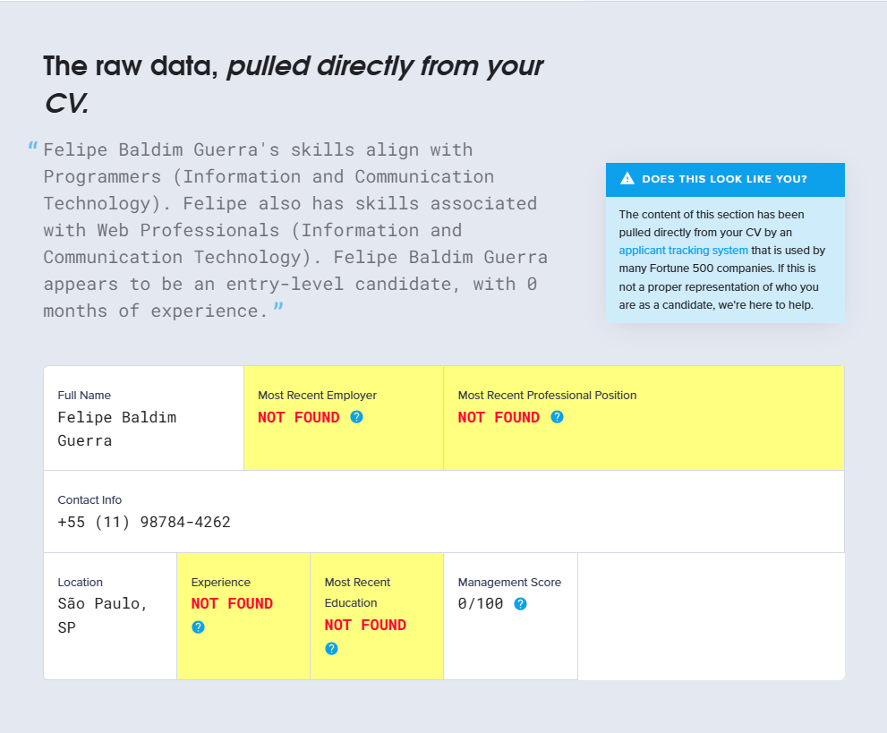

# Curriculum Vitae
	- ## Job leads CV Critique
		- ## CV Writing
			- In reading your CV, I did not find the kind of active language that would bring your work to life. Instead, **I saw passive words and non-action verbs.
			  
			  **Phrases like **“responsible for”** and **“Managing”** are monotonous, overused, and add little value to your CV. Strong action verbs, used with engaging language to outline outstanding achievements, are essential parts of a soundly-built CV.
			  
			  Now, let's see how to put this into practice. Here's a real life sample taken from a former client's CV. By changing the language, we helped to enhance the perception of the job-seeker.
			- **Passive language / Doing:** “Negotiated contracts with vendors”
			- **Action language / Achieving:** “Slashed payroll/benefits administration costs 30% by negotiating pricing and fees, while ensuring the continuation and enhancements of services.”
		- ### DIgital Readiness
			- Although CV in pdf are consistent some older Applicant Tracking Systems (ATS) could not read you CV properly.
			- Use .docx instead
		- ### CV Scan Test Results
			- 
			- Employer
			- Experience
			- Education
- # About me
	- About 1
	  collapsed:: true
		- I am a results-driven developer with a strong enthusiasm for both independent work and collaborative teamwork. I excel at making swift decisions and developing effective solutions, all while maintaining a positive and supportive work environment for my colleagues.
		- If you are looking for a professional, mature, and results-oriented individual, I would be delighted to contribute to your team. I invite you to test my abilities or provide an opportunity for me to demonstrate my skills. I am confident that we can achieve mutual growth and success together.
	- About 2
	  collapsed:: true
		- ### Professional Experience
		  
		  As a development professional with nearly three years of experience, I have acquired extensive technical skills and made significant contributions across various projects. My proficiency spans several programming languages, including Python, JavaScript (Vanilla JS, ReactJS, and NextJS), as well as database management with SAP HANA. I have also become adept at using tools and methodologies such as Git, GitHub, and Agile Methods, primarily utilizing Jira for project management.
		  
		  Throughout my career, I have been involved in full-stack development, handling both front-end and back-end components from the initial client consultation through to deployment. This process has included creating comprehensive technical documentation, both for gathering requirements and for serving as reference material for new employees.
		  
		  Quality assurance has been a critical part of my role, where I have conducted detailed inspection, resolution, and documentation of bugs to ensure fast and effective solutions for clients. Additionally, I have developed Robotic Process Automation (RPA) solutions to automate repetitive tasks, thereby allowing team members to focus on more intellectually demanding and profitable work.
		  
		  Employing Agile methodologies has enabled me to address issues promptly and efficiently, ensuring the timely delivery of projects. In terms of client interaction, I have maintained direct communication with clients to ensure alignment on project requirements and deliverables. Furthermore, I have worked collaboratively within cross-functional teams to enhance project outcomes and improve workflow processes.
	- About 3
	  collapsed:: true
		- ### Professional Experience
		  
		  **Development Professional**
		  *Duration: Nearly 3 years*
		- #### Technical Skills
		- **Programming Languages:** Python, JavaScript (Vanilla JS), ReactJS, NextJS
		- **Database:** SAP HANA
		- **Tools and Methodologies:** Git, GitHub, Agile Methods (primarily using Jira)
		- #### Key Responsibilities and Achievements
		- **Full-Stack Development:**
			- Developed both front-end and back-end components from initial client consultation to deployment.
			- Created comprehensive technical documentation for both requirements gathering and reference material for new employees.
		- **Quality Assurance:**
			- Conducted detailed inspection, resolution, and documentation of bugs to ensure fast and effective solutions for clients.
		- **Robotic Process Automation (RPA):**
			- Developed RPA solutions to automate repetitive tasks, allowing team members to focus on more intellectual and profitable work.
		- **Agile Methodology:**
			- Utilized Agile methodologies to address issues promptly and efficiently, ensuring timely delivery of projects.
		- ### Additional Contributions
		- **Client Interaction:** Maintained direct communication with clients to ensure alignment on project requirements and deliverables.
		- **Team Collaboration:** Worked collaboratively within cross-functional teams to enhance project outcomes and improve workflow processes.
	- About 4
	  collapsed:: true
		- ### Professional Experience
		  
		  As a development professional with nearly three years of experience, I have acquired extensive technical skills and made significant contributions across various projects. My proficiency spans several programming languages, including Python, JavaScript (Vanilla JS, ReactJS, and NextJS), as well as database management with SAP HANA. I have also become adept at using tools and methodologies such as Git, GitHub, and Agile Methods, primarily utilizing Jira for project management.
		  
		  Throughout my career, I have been involved in full-stack development, handling both front-end and back-end components from the initial client consultation through to deployment. This process has included creating comprehensive technical documentation, both for gathering requirements and for serving as reference material for new employees.
		  
		  Quality assurance has been a critical part of my role, where I have conducted detailed inspection, resolution, and documentation of bugs to ensure fast and effective solutions for clients. Additionally, I have developed Robotic Process Automation (RPA) solutions to automate repetitive tasks, thereby allowing team members to focus on more intellectually demanding and profitable work.
		  
		  Employing Agile methodologies has enabled me to address issues promptly and efficiently, ensuring the timely delivery of projects. In terms of client interaction, I have maintained direct communication with clients to ensure alignment on project requirements and deliverables. Furthermore, I have worked collaboratively within cross-functional teams to enhance project outcomes and improve workflow processes.
-
- Elevator Peach
  collapsed:: true
	- Hi, I’m Felipe Guerra, a development professional with nearly three years of experience specializing in Front Heavy full-stack development. My technical expertise covers a range of programming languages, including Python, TypeScript, JavaScript both Vanilla JS and NextJS) as well as database management with SAP HANA.
	- In my career, I've worked **extensively** with tools like Git and GitHub, and I’m well-versed in Agile methodologies, utilizing Jira for effective project management. My role often involves handling both front-end and back-end components, starting from initial client consultations all the way through to deployment. This comprehensive involvement ensures that I can create and maintain detailed technical documentation, which is crucial for both requirement gathering and onboarding new employees.
	- Quality assurance is a key focus of mine; I rigorously inspect, resolve, and document bugs to provide quick and effective solutions for clients. Additionally, I’ve developed RPA solutions, automating repetitive tasks to free up team members for more strategic work.
	- My experience with Agile methodologies has honed my ability to address issues swiftly and ensure projects are delivered on time. I maintain direct communication with clients to ensure their requirements and expectations are met and often exceeded.
	- In summary, my blend of technical skills, project management abilities, and client-focused approach has enabled me to deliver high-quality, efficient solutions that drive success for both my team and our clients.
	- If you are looking for: a **professional**, **mature**, and r**esults-oriented** individual, I would be delighted to contribute to your team. I invite you to test my abilities or provide an opportunity for me to demonstrate my skills. I am confident that we can achieve mutual growth and success together.
	- Thank you!