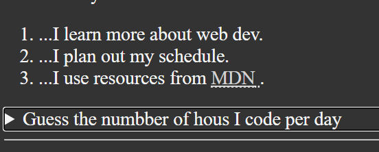
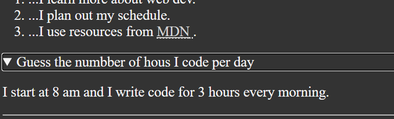

## Review
	- **Review lessons 1, 2 and 3 on html**
		- DONE HTML Review [[Feb 16th, 2024]]
		- DONE HTML Review [[Feb 22th, 2024]]'
		  :LOGBOOK:
		  CLOCK: [2024-02-22 Thu 15:09:23]--[2024-02-22 Thu 15:11:49] =>  00:02:26
		  :END:
		- DONE HTML Review [[Mar 16th, 2024]]
	- **Review lessons 4, 5, 6 and 7 on html**
		- DONE HTML Review [[Feb 17th, 2024]]
		  :LOGBOOK:
		  CLOCK: [2024-02-18 Sun 01:43:15]--[2024-02-18 Sun 01:53:36] =>  00:10:21
		  :END:
		- DONE HTML Review [[Feb 23th, 2024]]
		  :LOGBOOK:
		  CLOCK: [2024-02-24 Sat 02:57:47]--[2024-02-24 Sat 03:05:51] =>  00:08:04
		  :END:
		- DONE HTML Review [[Mar 17th, 2024]]
- ## Lesson 1
  collapsed:: true
	- **File names**: no spaces and lowercase
	- Do not use **#** in the names
	- ### Sections
		- head -> for the metadata
		- body -> for the content
	- ### Tags
		- h1 -> should have only one per page
	- ### Validations
		- w3c Markup validation Service
		- https://validator.w3.org/
- ## Lesson 2
  collapsed:: true
	- ### meta tags
		- ```html 
		  <meta charset="UTF-8">
		  <meta name="author" content="Felipe Guerra">
		  <meta name="description" content="This page contains all the things I am learning how to create as I learn HTML.">
		  ```
	- ### Head Tags
		- link -> to link images, styles, js.
		- ```html 
		  <link rel="icon" href="./html5.png" type="image/x-icon">
		  <link rel="stylesheet" href="style.css" type="text/css">
		  ```
	- ### Headers
		- tags h => Give meaning for the content, do not use it to change the text size.
- ## Lesson 3
  collapsed:: true
	- ### In line elements vs block elements
		- all the tags in the body so far are block elements, if we want to use in line tag we can choose between:
		- **<br>** => to break the line
		- **&nbsp;** =>to make it give a space
		- **<em></em>** => to give emphasis
		- **<strong></strong>** => to make it bolder
		- &lt; => <
		- &gt; => >
		- &copy; => copywrite symbol
		- "<abbr></abbr>" => nice to have but is not accessible.
			- ```html
			  <br>&nbsp;&nbsp;&nbsp;
			  ...I use resources from <abbr title="Mozilla Developer Network">MDN</abbr>.
			  ```
		- <adress></address> => provide semantic meaning for the context so it's accessible
		-
- ## Lesson 4
  collapsed:: true
	- **Lists**
		- OL -> for order lists
			- LI -> list item
		- UL -> for Unordered lists
			- LI -> list item
		- DT -> for description lists
			- DT -> Description Topic
			- DD -> Description Details
		- ```html
		     <ol>
		          <li>...I learn more about web dev.</li>
		          <li>...I plan out my schedule.</li>
		          <li>...I use resources from <abbr title="Mozilla Developer Network">MDN</abbr>.</li>
		      </ol>
		  
		      <hr>
		  
		      <h2>I Am Also Planning a Vacation</h2>
		      <p>I've been working hard and <em>really need a getaway</em>.</p>
		      <p>I live in <abbr title="Kansas">KS</abbr> so I want visit a beach.</p>
		  
		      <h3>Place I'd Like to Visit</h3>
		      <ul>
		          <li>I've heard good things about the Caribbean.</li>
		          <li>I've heard good things about going here:</li>
		      </ul>
		      <address>
		          Margaritaville Island Reserve Riviera Cancún<br>
		          Bahia Petempich Puerto Morelos, Mexico<br>
		          Clionia Morelos, México 77580
		      </address>
		  
		      <!-- TODO: Add more places -->
		      <h3>Places I Want to Avoid</h3>
		      <dl>
		          <dt>North Pole</dt>
		          <dd>I hear this is <strong>cold</strong></dd>
		  
		          <dt>South Pole</dt>
		          <dd>This is also cold</dd>
		  
		          <dt>Montain Tops</dt>
		          <dd>These are also cold</dd>
		      </dl>
		  ```
	-
- ## Lesson 5
	- Links can:
		- be used to reference another third party page.
		- Reference another page in my own server
		- A section on the same page
		- Used to download a item
		- Send an e-mail
		- To call a mobile number
		- ```html 
		   <ul>
		          <li>
		              Download an <a href="html5.png" download>HTML5 favicon</a>
		          </li>
		          <li>
		              Contact me at <a href="mailto:random@email.com">my email address</a>.
		          </li>
		          <li>
		              Dial <a href="tel:+1234567890">my phone number</a>.
		          </li>
		          <li>
		              Open <a href="https://www.google.com/" target="_blank">Google</a> in a new tab.
		          </li>
		      </ul>
		  
		     	<p>
		          <a href="/">Back to Home</a>
		      </p>
		  ```
- ## Lesson 6
  collapsed:: true
	- ### Images
		- For adding images we can use the tag ``
			- ```html
			  
			       >
			  ```
			- The width and the height should be always inserted on the page loading it's know how much space will the picture take and then the **Cumulative Layout Change** is not so bad.
			  background-color:: green
		- For helping accessibility devices and all other user we can use the `figure` and `figcapition` tag.
			- ```HTML 
			  <figure>
			    
			    <figcaption>
			      Caribbean Beach Getaway
			    </figcaption>
			  </figure>
			  ```
		- To use images **PlaceHolder** you can use the following:
			- Find More at [Lorem Ipsum](https://loremipsum.io)
			- For software [Irfan View](https://www.irfanview.com/)
			- Small Images [Tiny PNG](https://tinypng.com/)
			- |||
			  |  ||
			-
	- ### Code
		- We can use the tag `<code>` to insert some code in to the html
		- Also as by on the [W3C](https://www.w3schools.com/tags/tag_code.asp) website we can use:
			- |In line Element| What it do?|
			  | [<samp>](https://www.w3schools.com/tags/tag_samp.asp) | Defines sample output from a computer program |
			  | [<kbd>](https://www.w3schools.com/tags/tag_kbd.asp) | Defines keyboard input |
			  | [<var>](https://www.w3schools.com/tags/tag_var.asp) | Defines a variable |
			  | [<pre>](https://www.w3schools.com/tags/tag_pre.asp) | Defines preformatted text |
- ## Lesson 7
  collapsed:: true
	- ### Semantic Elements
		- **Header** => The header element brings information and can bring navigation to the page or container. Also you can insert more then 1 `header` per page, however it cannot disobey the logic of hierarchy
		- **main** => there can be only one main tag per page and it's function is to delimit the main content of the page.
		- **footer** => can be more then one footer per page,  but should follow the hierarchy as well, e. g. you can have the footer for the page and for a blogpost.
		- **Nav** => you also can have multiple nav on the same page, but be aware that the `aria-label` becomes a must after de second one.
			- ```html 
			  <nav aria-label="primary-navigation">
			    
			  <!-- OR you could do: -->
			  
			  <nav aria-labeledby="primary-navigation">
			  <h2 id="primary-navigation">Primary Navigation</h2>  
			  ```
		- **Article** => can be used for different article in the page, although there is no hard distinction between `section` and `article`
		- **Aside** => for complementary text.
		- **Details** => can be used to insert details in the page using the following:
			- ```html 
			  <aside>
			    <details>
			      <summary>
			        Guess the numbber of hous I code per day
			      </summary>
			      <p>I start at 8 am and I write code for 3 hours every morning.</p>
			    </details>
			  </aside>
			  ```
			- {:width 400}
			- {:width 400}
		- **Note** that using `article` then inserting `sections` inside of it will not change how the page is presented, however will improve how the machine and assistive technology reads the page.
		- **div** => have no meaning and are block elements avoid them.
		- **span** => avoid using them to make changes in the css.
		-