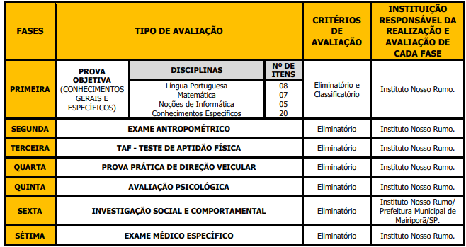

- #[[Concursos]]
- # Edital
	- 
- # Estratégia
	- ## Data da Prova
		- 30NOV25
		- 39 dias úteis -> **35 dias de estudo.**
	- ## 40 Questões
	  collapsed:: true
		- |**Questões**|**Matéria**|**T. diario / 3h** |
		  |20|Específico| 1h30min |
		  | 08 | Português | 30min | 
		  | 07 | Matemática | 30min |
		  | 05 | Informática | 30min |
		- Específico de manhã + Português ou Matemática ou Informatica cada dia.
		-
	- ## Simulados - 2
		- 
		- 
- # Etapas
  collapsed:: true
	- 
- # Estudo
	- ## Conhecimentos Gerais
		- ### LÍNGUA PORTUGUESA:
			- Interpretação de textos diversos. Principais tipos e gêneros textuais e suas funções. Semântica:
				- sinônimos, antônimos, sentido denotativo e sentido conotativo.
			- Emprego e diferenciação das classes de palavras: substantivo, adjetivo, numeral, pronome, artigo, verbo, advérbio, preposição e conjunção.
			- Tempos, modos e flexões verbais. Flexão de substantivos e adjetivos (gênero e número).
			- Colocação pronominal. Concordâncias verbal e nominal. Crase. Ortografia (conforme Novo Acordo vigente).
			- Pontuação. Acentuação.
		- ### MATEMÁTICA:
			- Conjuntos: linguagem básica, pertinência, inclusão, igualdade, reunião e interseção.
			- Números naturais, inteiros, racionais e reais: adição, subtração, multiplicação, divisão, potenciação e radiciação. Média
			  aritmética simples.
			- Máximo divisor comum.
			- Mínimo múltiplo comum.
			- Medidas: comprimento, área,
			  volume, ângulo, tempo e massa. Regra de três simples e composta.
			- Porcentagem, juros e descontos simples.
			- Operações com expressões algébricas e com polinômios.
			- Progressões aritmética e geométrica.
			- Raciocínio lógico e sequencial. Unidades de medida (metro, centímetro, milímetro, decâmetro, decímetro, hectômetro e quilômetro).
		- ### NOÇÕES DE INFORMÁTICA:
			- Conhecimentos sobre princípios básicos de Informática. Dispositivos de armazenamento. Periféricos de um computador.
			- MS-Windows 10: configurações, conceito de pastas, diretórios, arquivos e atalhos, área
			  de trabalho, área de transferência, manipulação de arquivos e pastas, uso dos menus, programas e aplicativos.
			- Libre Office.
			- Configuração de impressoras.
			- E-mail ZIMBRA.
			- Navegação na Internet, conceitos de URL, links, sites, busca e impressão de páginas.
			- Uso dos principais navegadores (Internet Explorer,
			  Mozilla Firefox e Google Chrome).
			- Aplicativos para segurança (antivírus, firewall, anti-spyware etc.).
			- Armazenamento de dados na nuvem (cloud storage).
	- ## Conhecimentos Específicos
		- Conhecimentos a respeito dos Grupos Vulneráveis e Minorias.
		- Constituição Federal: artigos 
		  background-color:: green
			- 1 a 5
			  background-color:: green
			- 6 a 14
			  background-color:: green
			- 37,
			  background-color:: green
			- 39,
			  background-color:: green
			- 41 e
			  background-color:: green
			- 144 -> Sistema Único de Segurança Pública – SUSP
			  background-color:: green
		- Código de Trânsito Brasileiro: artigos 291 a 312-B.
		  background-color:: yellow
		- Lei nº 13.022/2014 - Estatuto Geral das Guardas Municipais.
		  background-color:: pink
		- Lei 13.869/2019 - Crimes de abuso de autoridade. Decreto n° 678/1992 -
		  background-color:: yellow
		- Promulga a Convenção Americana sobre Direitos Humanos (Pacto de São José da Costa Rica). Declaração Universal dos Direitos Humanos.
		  background-color:: yellow
		- Código Penal: artigos 121 a 129, 138 a 145, 150, 155 a 183, 213 a 234-B, 
		  background-color:: yellow
			- 312 A 327, 334-A.
			  background-color:: red
		- Lei n° 8.069/1990 – Estatuto da Criança e do Adolescente: artigos 2, 171 a 178, 225 a 244-B.
		  background-color:: yellow
		- Lei nº 8.429/1992 - Lei de Improbidade Administrativa. 
		  background-color:: green
		- Lei nº 9.455/1997 - Define os crimes de tortura.
		  background-color:: yellow
		- Lei nº 9.605/1998 - Dispõe sobre as sanções penais e administrativas derivadas de condutas e atividades lesivas ao meio ambiente: artigos 32,42 e 65.
		  background-color:: yellow
		- Lei nº 11.340/2006 - Lei Maria da Penha: artigos 1º a 22, 24 e 41.
		  background-color:: pink
		- Lei nº 13.869/2019 - Dispõe sobre os crimes de abuso de autoridade.
		  background-color:: pink
		- Lei Complementar nº445/2022 - Dispõe sobre a implantação do Plano de Cargos, Carreira e Vencimentos dos servidores da Guarda Civil Municipal da Prefeitura de Mairiporã.
		  background-color:: yellow
		- Lei Complementar nº 472/2023 - Institui o Regulamento Disciplinar Interno dos servidores da Guarda Civil Municipal de Mairiporã.
		  background-color:: red
		- Lei Complementar 473/2023 - Dispõe sobre o Estatuto da Guarda Civil Municipal de Mairiporã.
		  background-color:: yellow
		- Lei nº 4.053/2021 - Dispõe sobre a poluição sonora. 
		  background-color:: red
		- Lei Orgânica do Município de Mairiporã. 
		  background-color:: red
		- Noções de primeiros socorros.
		  background-color:: yellow
- # Revisão
	- 14OUT25
		- Constituição Federal
			- [[Oct 15th, 2025]], [[Oct 21st, 2025]],  [[Nov 14th, 2023]]
				- Constituição Federal Art 1º -> 5º
-