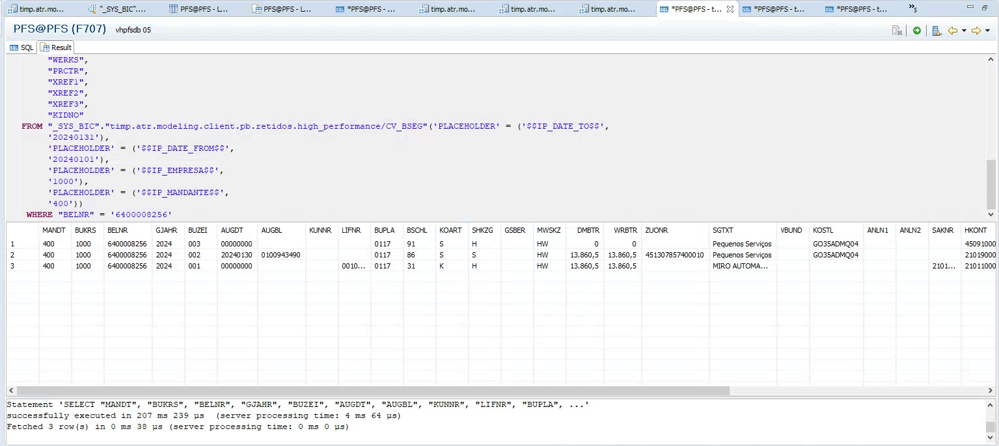
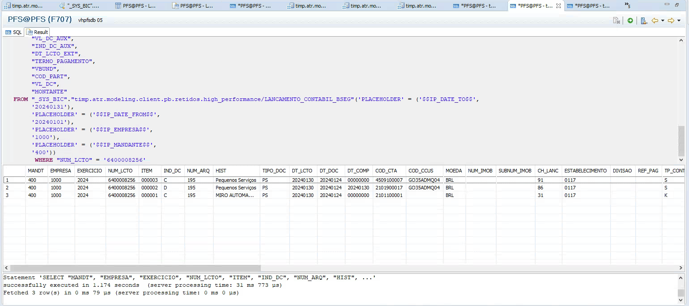
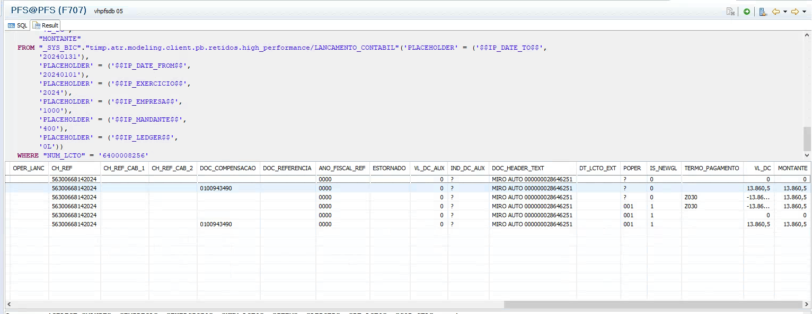
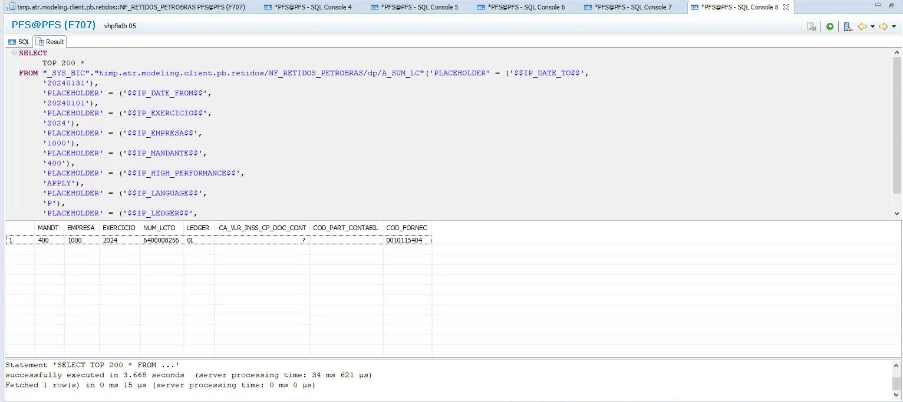
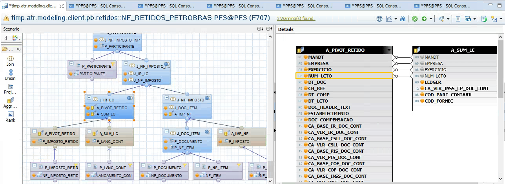
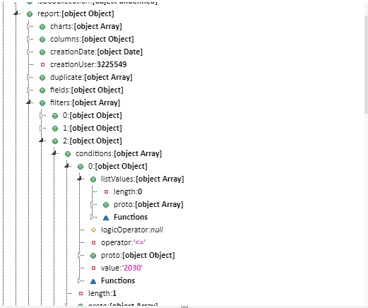

# BCB does not record information
collapsed:: true
	- **User:** William
	- **Context:** On the BRB after making an automatic adjustment the execution went fine, however when trying to record it an error was responded.
	  id:: 65c23278-7b72-4a48-b06b-d4d87217d1e6
	- ### Error
		- ```json 
		  "name": "ERR_SQL_INV_COLUMN",
		  "description": "invalid column name",
		  "@query": "SELECT CASE WHEN ('2020-09-18'>='2020-09-18' ) THEN  0 ELSE ( CASE WHEN (DAYS_BETWEEN(TO_DATE ('2020-09-18'), TO_DATE ( '2020-09-18') ) *  0.33 >20) THEN  20 ELSE  DAYS_BETWEEN(TO_DATE ('2020-09-18'), TO_DATE ( '2020-09-18') ) *0.33 END) END ,
		  CASE WHEN ( 0>0 ) THEN (   868936* 0/100) ELSE ( 0) END ,
		  CASE WHEN ( 0>0 ) THEN (   868936* 0/100) ELSE (0) END ,
		  0,0,NOME_EMPRESA,TELEFONE_EMPRESA,CNPJ_COMPLETO,868936+ 0+ 0  
		  FROM "_SYS_BIC"."timp.atr.modeling.client.pb.taxas_atualizacao/ALIQ_TAXA_ATUA_DADOS_EXTERNO_E_INTERNO" (
		    'PLACEHOLDER' = ('$$IP_MANDANTE$$', '300'), 
		    'PLACEHOLDER' = ('$$IP_YEAR_FROM$$', '2010'), 
		    'PLACEHOLDER' = ('$$IP_YEAR2_FROM$$', '10'), 
		    'PLACEHOLDER' = ('$$IP_DATE_FROM$$', '20100101'), 
		    'PLACEHOLDER' = ('$$IP_LANGUAGE$$', 'P'), 
		    'PLACEHOLDER' = ('$$IP_MANDANTE_TDF$$', '300'))   
		  WHERE RATE_START_DATE <= TO_DATS('2020-08-01') AND 
		  	(RATE_END_DATE >= TO_DATS('2020-08-31') OR 
		  	RATE_END_DATE IS NULL) AND 
		  	INDEX_CODE IS NOT NULL AND 
		  	RATE_START_DATE IS NOT NULL AND 
		  	ID IS NOT NULL AND COD_FILIAL = ?  
		  GROUP BY 
		  	NOME_EMPRESA,TELEFONE_EMPRESA,CNPJ_COMPLETO
		  ```
		- Searching for the view: ALIQ_TAXA_ATUA_DADOS_EXTERNO_E_INTERNO I found out that all the fields in the view do not match with the fields int the Report.
		  logseq.order-list-type:: number
		- **View**: ALIQ_TAXA_ATUA_DADOS_EXTERNO_E_INTERNO
			- ```js 
			  this. updateRateAliquotExternalAndInternalView = new BaseModel({
			      "name": "timp. atr.modeling. client. pb. taxas_atualizacao/ALIQ_TAXA_ATUA_DADOS_EXTERNO_E_INTERNO",
			      "schema": viewSchema,
			      "identity": "timp. atr.modeling. client. pb. taxas_atualizacao/ALIQ_TAXA_ATUA_DADOS_EXTERNO_E_INTERNO",
			      "type": "view",
			      "inputParameters": inputParameters,
			      "fields": {},
			      "accumulatedFactor":{},
			      "disclosureDate":{},
			      "id": {},
			      "indexCode":{},
			      "indexName":{},
			      "periodValue":{},
			      "rate":{},
			      "rateEndDate": {},
			      "rateStartDate": {},
			      "updateDateRate": {},
			      "value": {}
			  
			  }, false, false);
			  ```
		- **BRB Report:**
			- ```sql 
			  SELECT 
			    "TIMP"."BRB::Cache_8028371ORM3_2024_02_05_03_21_37_3226349_571::ID".nextval AS SEQUENCE_ID,
			    "UF_FILIAL",
			    "EMPRESA",
			    "FILIAL",
			    "DIRECT",
			    "NF_ID",
			    "NUM_ITEM",
			    "NUM_DOC",
			    "SER",
			    "COD_MOD",
			    "SYS_TIPO_NF",
			    "DT_E_S",
			    "DT_DOC",
			    "DT_CRIACAO",
			    "CANCELADO",
			    "DT_CANC",
			    "COD_SIT",
			    "COD_NAT",
			    LEFT(COD_NAT, 4) AS "CFOP Legal",
			    "DOCREF",
			    "COD_PART",
			    "CNPJ_CPF",
			    "UF",
			    "GRU_MAT_ITEM",
			    "COD_ITEM",
			    "NCM",
			    "DESCR_COMPL",
			    "SYS_IVA",
			    "SYS_DIR_ICMS",
			    "CHV_NFE",
			    IFNULL("VL_TOTAL_DOCUMENTO", 0) AS "VL_TOTAL_DOCUMENTO",
			    IFNULL("VL_MERC", 0) AS "VL_MERC",
			    IFNULL("QTD", 0) AS "QTD",
			    IFNULL("VL_UNID", 0) AS "VL_UNID",
			    IFNULL("VL_BC_ICMS", 0) AS "VL_BC_ICMS",
			    IFNULL("ALIQ_ICMS", 0) AS "ALIQ_ICMS",
			    IFNULL("ALIQ_ICMS_AJUSTADA", 0) AS "ALIQ_ICMS_AJUSTADA",
			    IFNULL("VL_ICMS", 0) AS "VL_ICMS",
			    IFNULL("VL_BC_EXC_ICMS", 0) AS "VL_BC_EXC_ICMS",
			    IFNULL("VL_BC_OUTRAS_ICMS", 0) AS "VL_BC_OUTRAS_ICMS",
			    IFNULL("VL_BC_ICMSST", 0) AS "VL_BC_ICMSST",
			    IFNULL("ALIQ_ICMSST", 0) AS "ALIQ_ICMSST",
			    IFNULL("VL_ICMSST", 0) AS "VL_ICMSST",
			    IFNULL("VL_BC_EXC_ICMSST", 0) AS "VL_BC_EXC_ICMSST",
			    IFNULL("VL_BC_OUTRAS_ICMSST", 0) AS "VL_BC_OUTRAS_ICMSST",
			    IFNULL("VL_BC_ICMS_DIFAL", 0) AS "VL_BC_ICMS_DIFAL",
			    IFNULL("ALIQ_ICMS_DIFAL", 0) AS "ALIQ_ICMS_DIFAL",
			    IFNULL("VL_ICMS_DIFAL", 0) AS "VL_ICMS_DIFAL", "NF_SRV", "TIPO_OPER",
			    IFNULL("VL_OUT", 0) AS "VL_OUT",
			    IFNULL("VL_FRT", 0) AS "VL_FRT",
			    IFNULL("VL_SEG", 0) AS "VL_SEG",
			    IFNULL("VL_DESC", 0) AS "VL_DESC", "MATUSE",
			    IFNULL("PERC_RED_BC_ICMS", 0) AS "PERC_RED_BC_ICMS",
			    IFNULL("PERC_RED_BC_ICMS_ST", 0) AS "PERC_RED_BC_ICMS_ST",
			    IFNULL("PERC_RED_BC_DIFAL", 0) AS "PERC_RED_BC_DIFAL", "MOD_DEF_ICMS",
			    TO_DECIMAL(ROUND(TO_DECIMAL((((CASE WHEN VL_BC_ICMS IS NULL THEN 0 ELSE CAST(COALESCE(VL_BC_ICMS, '0') AS DECIMAL) END) * 4) / 100)), 2), 25, 2) AS "FUNDO - BC ICMS - 4%",
			    TO_DECIMAL(ROUND(TO_DECIMAL((((CASE WHEN VL_BC_ICMS IS NULL THEN 0 ELSE CAST(COALESCE(VL_BC_ICMS, '0') AS DECIMAL) END) * 2) / 100)), 2), 25, 2) AS "FUNDO - BC ICMS - 2%",
			    TO_DECIMAL(ROUND(TO_DECIMAL((((CASE WHEN VL_ICMS IS NULL THEN 0 ELSE CAST(COALESCE(VL_ICMS, '0') AS DECIMAL) END) * 99) / 1000)), 2), 25, 2) AS "FUNDO - VLR ICMS - 0,099",
			    TO_DECIMAL(ROUND(TO_DECIMAL((((CASE WHEN VL_BC_ICMSST IS NULL THEN 0 ELSE CAST(COALESCE(VL_BC_ICMSST, '0') AS DECIMAL) END) * 2) / 100)), 2), 25, 2) AS "FUNDO - BC ICMS-ST - 2%",
			    TO_DECIMAL(ROUND(TO_DECIMAL((((CASE WHEN VL_BC_ICMS_DIFAL IS NULL THEN 0 ELSE CAST(COALESCE(VL_BC_ICMS_DIFAL, '0') AS DECIMAL) END) * 2) / 100)), 2), 25, 2) AS "FUNDO - BC DIFAL - 2%",
			    TO_DECIMAL(ROUND(TO_DECIMAL((((CASE WHEN VL_BC_ICMS IS NULL THEN 0 ELSE CAST(COALESCE(VL_BC_ICMS, '0') AS DECIMAL) END) * 1) / 100)), 2), 25, 2) AS "FUNDO - BC ICMS - 1%",
			    TO_DECIMAL(ROUND(TO_DECIMAL((((CASE WHEN VL_BC_ICMS IS NULL THEN 0 ELSE CAST(COALESCE(VL_BC_ICMS, '0') AS DECIMAL) END) * 5) / 100)), 2), 25, 2) AS "FUNDO - BC ICMS - 5%",
			    TO_DECIMAL(ROUND(TO_DECIMAL((((CASE WHEN VL_BC_ICMS_DIFAL IS NULL THEN 0 ELSE CAST(COALESCE(VL_BC_ICMS_DIFAL, '0') AS DECIMAL) END) * 6) / 100)), 2), 25, 2) AS "Valor DIFAL RJ",
			    TO_DECIMAL(ROUND(TO_DECIMAL((((CASE WHEN VL_BC_ICMS_DIFAL IS NULL THEN 0 ELSE CAST(COALESCE(VL_BC_ICMS_DIFAL, '0') AS DECIMAL) END) * 14) / 100)), 2), 25, 2) AS "Valor DIFAL Prod Imp RJ",
			    TO_DECIMAL(ROUND(TO_DECIMAL((((CASE WHEN VL_BC_ICMS_DIFAL IS NULL THEN 0 ELSE CAST(COALESCE(VL_BC_ICMS_DIFAL, '0') AS DECIMAL) END) * 18) / 100)), 2), 25, 2) AS "Valor Débito DIFAL SP",
			    TO_DECIMAL(ROUND(TO_DECIMAL((((CASE))))))
			  
			  ```
- # Paralelismo ISS
  id:: 65fadb5a-f155-4214-9b1b-07a9e4041a8e
  collapsed:: true
	- **For:** Samuel
	- **Client Need:**
		- Table is not being correctly being uploaded on to ???
		- Document of JAN - 01 - 2024 was not correctly uploaded to ???
		- **Issue:**
			- A bulk upload was done by the employees of Petrobras in SAP, however the file of "NUM_LCTO" | "BELNR": 6400008256 Is not being displayed int he timp platform.
			- To find were this file is being lost a bottom up approach was done in  the levels:
			  collapsed:: true
				- OK => timp.atr.modeling.client.pb.retidos.high_perfomance::CV_BSEG
					- 
				- OK => timp.atr.modeling.client.pb.retidos.high_perfomance::LANCAMENTO_CONTABIL_BSEG
					- 
				- OK => timp.atr.modeling.client.pb.retidos.high_perfomance::LANCAMENTO_CONTABIL
					- 
				- FAIL => timp.atr.modeling.client.pb.retidos::NF_RETIDOS_PETROBRAS->SEMANTICS
					- On the fist node after the view P_LANCAMENTO_CONTABIL, the A_SUM_LC
						- 
					- The problem is in the node:
		- **Problem origin:**
			- 
			- the node J_IR_LC used the NUM_LCTO for making the join in, however is a left join with the sap.glo.tmflocbr.ctr::NF_IMPOSTO_RETIDO and upon making a SELECT on this view the NUM_LCTO = 6400008256 was not found.
			-
- # Rodolfo
	- 280 -> Patronal e VL_INSS
	- 283 -> sem retorno em valor patronal quando  "VL_INSS" está zerado
		- COD_PART
			- V005% -> Física => Obrigatoriedade no valor patronal
			- V001% -> Jurídica
		- COD_CTA_INSS
			- Não aparece o numero da conta quando o VL_INSS está zerado.
	- PFS 3420 -> Analitica (280)
	- View 283 até 5 de janeiro estava funcionando
	- Documento contabil -> NUM_LCTO
	- ## Resolução
		- Verificar versões anteriores e ver se tem diferença de codigo
		  logseq.order-list-type:: number
		- Consultar as tabelas e ver se o erro persiste nas tabelas
		  logseq.order-list-type:: number
		- logseq.order-list-type:: number
		- logseq.order-list-type:: number
		- logseq.order-list-type:: number
- # William Structure 1285
  collapsed:: true
	- ```js 
	  this.execute = function (object) {
	  // 	var a = $.moment();
	  // 	$.trace.debug('request path: ' + $.request.path);
	  	var json = typeof(object) === 'string' ? brbUtil.__parse__(object) : object;
	  	json.statistics = true;
	  // 	let executionStartTime = brbUtil.calculateDate();
	  	const actions = executeFuntions;
	  	let response;
	  	try {
	  	    $._readedReports_ = $._readedReports_ || {};
	  	    $._readedReports_[object.id] = $._readedReports_[object.id] || actions.getReport(object.id);
	  		let report = $._readedReports_[object.id];
	  		actions.getPrivileges();
	  		let isBCBExecution = object.isBCBExecution;
	  		if(object.sequentialExecution && object.pageActualCache <  object.totalPagesCache){
	  		    let executor = actions.getNewExecutorController();
	  			response = executor.executePaginatedCache(object);
	  		} else if (actions.useNewExecutor(report, isBCBExecution, object.userCanChooseHighPerformanceBRB)) {
	  			let executor = actions.getNewExecutorController();
	  			response = executor.execute(object);
	  		} else if (actions.isValidReport(json, report, isBCBExecution)) {
	  			actions.logExecution(report);
	  			json = actions.addDefaultsValuesToJson(json);
	  			var cacheResponse = actions.getCacheResponse(json, object, report);
	  			response = actions.createResponse(cacheResponse, json, report, object, brbUtil.calculateDate(), $.moment());
	  		} else {
	  			$.logError('BRB201071');
	  			response = undefined;
	  		}
	  	} catch (e) {
	  		actions.logExecutionError(object.id, e);
	  		response = false;
	  	}
	  	return response;
	  };
	  ```
	- On line twelve the report returns the following: for the param "2030", there is an array of values that should be less or equal "2030"
		- 
	-