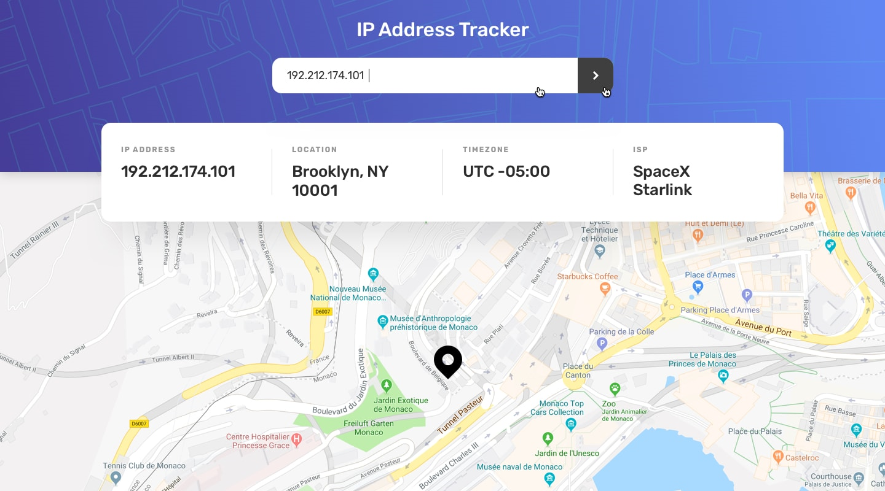
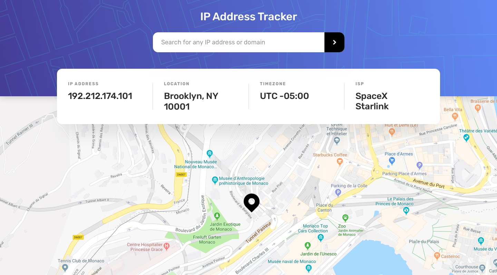
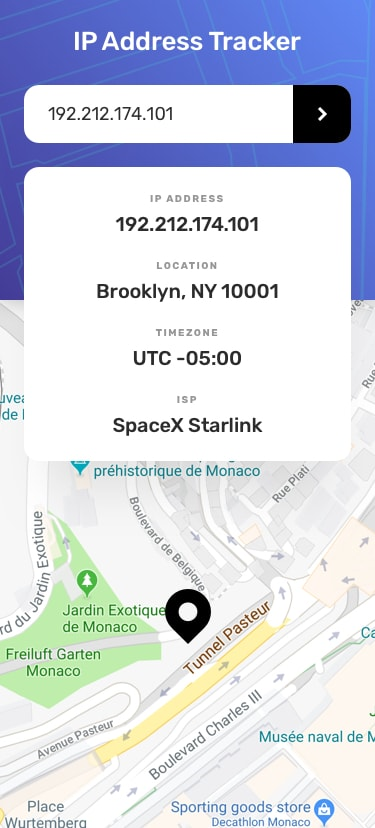

# Design
	- **Active States**
		- {:height 408, :width 720}
	- **Inactive States**
	  collapsed:: true
		- 
	- **Mobile Design**
	  collapsed:: true
		- 
	- ## Components
		- Search input
		  logseq.order-list-type:: number
		- Data Display
		  logseq.order-list-type:: number
		- Map
		  logseq.order-list-type:: number
	- ## Cards
		- DONE Read the Documentation of FrontEnd Mentor
		  :LOGBOOK:
		  CLOCK: [2023-09-12 Tue 17:31:33]--[2023-09-12 Tue 18:00:00] =>  00:28:27
		  :END:
		- DONE Test the API
		  :LOGBOOK:
		  CLOCK: [2023-09-12 Tue 17:28:11]--[2023-09-12 Tue 17:31:28] =>  00:03:17
		  CLOCK: [2023-09-12 Tue 18:00:11]--[2023-09-12 Tue 18:00:27] =>  00:00:16
		  :END:
		- DONE Read the Documentation for the Map API
		  :LOGBOOK:
		  CLOCK: [2023-09-12 Tue 18:00:30]--[2023-09-12 Tue 18:09:27] =>  00:08:57
		  CLOCK: [2023-09-13 Wed 11:27:50]--[2023-09-13 Wed 11:27:51] =>  00:00:01
		  :END:
		- NOW Define all the CSS Variables and Names.
		  :LOGBOOK:
		  CLOCK: [2023-09-13 Wed 11:45:08]
		  :END:
		- DONE Make Each component
		- DONE Make the skeleton for the page
		- DONE **Maybe** -> Look for how to get you IP address automatically
	- ## Requirements
		- View the optimal layout for each page depending on their device's screen size
		- See hover states for all interactive elements on the page
		- See their own IP address on the map on the initial page load
		- Search for any IP addresses or domains and see the key information and location