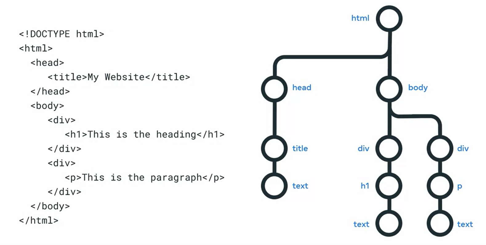
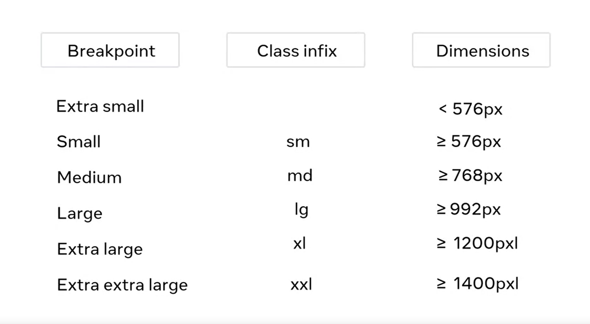
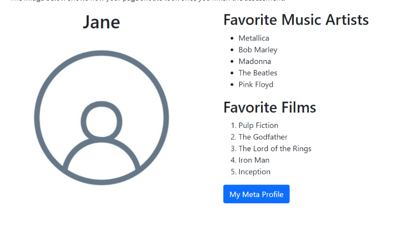

# Module 1
collapsed:: true
	- IDE - Integrated Development Environment #[[Developer - Glossary]]
	- ## Course syllabus for Introduction to Front-End Development
	  collapsed:: true
		- This course is the first of a series that aims to help you learn more about web development and prepares you for using Bootstrap on a biographical page you will create.  By the end of this course, you’ll be able to:
			- Describe the front-end developer role
			- Explain the core and underlying technologies that power the internet.
			- Use HTML to create a simple webpage
			- Use CSS to control the appearance of a simple webpage
			- Explain what React is
			- Describe the applications and characteristics of the most popular UI frameworks
			- In this course, you will explore the following:
		- ### **Module 1:**   **Get started with web development**  
		  
		  In this module, you are introduced to web development. You’ll learn about the different types of web developer roles and the responsibilities of front-end, back-end and full-stack developers. You will get a streamlined overview of the core technologies of HTML, CSS and JavaScript and explore the concepts that underpin how the internet works. Furthermore, you will be able to access hands-on exercises to edit a website. 
		  
		  After completing this module, you will be able to:
			- Describe the web developer job role.
			- Distinguish between front-end, back-end and full-stack developers.
			- Explain how data moves through the internet.
		- Describe the technologies that underpin the internet.
		- **Module 2:** **Introduction to HTML5 and CSS**
			- Here you'll learn about HTML5 and CSS. You'll also examine how to construct HTML documents and add basic styling and layout using CSS. 
			  
			  After completing this module, you will be able to:
			- Use HTML to create a simple webpage.
			- Use CSS to define the style of a simple webpage.
		- ### **Module 3:**   **UI Frameworks**
			- In this module, you'll learn about UI frameworks. In addition, you will learn how to use the Bootstrap framework to build responsive interfaces. You'll explore the benefits of working with UI frameworks. 
			  
			  After completing this module, you will be able to:
			- Outline the concepts that exist in most UI frameworks.
			- Use the Bootstrap CSS framework to create webpages.
			- Leverage Bootstrap documentation to reproduce and modify CSS components.
			- Use Bootstrap themes.
			- Describe the basics of React in relation to other frameworks and web technologies.
		- ###   **Module 4:**   **Graded Assessment**
			- Here you'll learn about the graded assessment. After you complete the individual units in this module, you'll synthesize the skills from the course to create and style a biographical page. You'll also have the opportunity to reflect on the course content and the learning path that lies ahead.
			- After completing this module, you will be able to:
				- Create and style a biographical page.
	- ##  How The Web Works
	  collapsed:: true
		- **URL** - Uniform Resource Locator #[[Developer - Glossary]]
			- **Protocol** -> HTTP
			- **Domain Name** -> Name of the Website
			- **File Path** -> What Page
		- ### Hosting
			- **Shared Hosting**
				- The server hosts a range of websites and the resources of processes are share as well that can slow your performance.
			- **VPS** - Virtual Private Service #[[Developer - Glossary]]
				- A Dedicated service, although the space is shared the capacity is already set for your website, usually more expensive
			- **Dedicated Hosting**
				- Even more expensive, and your website receives a dedicated space, not sharing anything with other websites
			- **Cloud hosting**
				- Cloud hosting uses a range of physical and virtual servers in order to make the webpage work, switching whenever necessary, although more expensive, can be a perfect solution to grow with the business
			-
				-
	- ## Questions
	  collapsed:: true
		- Question 1
		  In the client/server model, the accessing device is a *__*__________________.
		  Client
		  Server #card
			- Client
		- Question 2
		  The website address that you type in your web browser to navigate to a website is called a __________________.
		  Client name
		  HTTP
		  Domain name #card
			- Domain name
		- Question 3
		  Servers are typically stored in a building called a __________________.
		  Data Center
		  DNS Server
		  DHCP Center #card
			- Data Center
		- Question 4
		  The physical components of a server are called the *__*__________________.
		  Hardware
		  Software #card
			- Hardware
		- Question 5
		  The purpose of a web server is to *__*__________________.
		  1. Receive web pages and display them in the web browser.
		  2. Receive requests from a web browser and to respond with the correct content for that request.
		  3. Request content from a web browser and receive the response. #card
			- 2. Receive requests from a web browser and to respond with the correct content for that request.
		- Question 6
		  True or False. A website can consist of multiple web pages linked together.
		  True
		  False #card
			- True
		- Question 7
		  The links you click on in your web browser are known as *__*__________________.
		  Data links
		  Hyperlinks
		  Server links #card
			- Hyperlinks
		- Question 8
		  Which of these are the 3 main technologies of the web browser? Select all that apply.
		  HTML
		  C#
		  JavaScript
		  CSS #card
			- HTML, CSS, JavaScript
		- Question 9
		  When you run a website on the cloud, the website is restricted to one physical server.
		  True
		  False #card
			- False
	- ## Introduction to Internet Protocol
	  collapsed:: true
		- **TCP** - Transmission Control Protocol #[[Developer - Glossary]]
			- Solves the issue or order
		- **UDP** - User Datagram Protocol #[[Developer - Glossary]]
			- Solves the issue of lost messages
		- **HTTP** - Hyper Text Transfer Protocol #[[Developer - Glossary]]
			- **GET** -> Retrive
			- **POST** -> Send
			- **PUT** -> Update
			- **DELETE** -> Erase
			- **PATCH** - Client partially updates a resource on the web server
			- Versions 1.1 and 2.0 are the most used.
			- ### **Headers**
				- **Status codes:**
					- **Informational** 100 -199
					- **Successful** 200 - 299
					- **Redirection** 300- 399
					- **Client Error** 400 - 499
					- **Server Error** 500 - 599
		- ### Other internet protocols
			- **DHCP** - Dynamic Host Configuration Protocol #[[Developer - Glossary]]]
				- Is used to assign an IP address to a Device.
			- **DNS** - Domain Name System #[[Developer - Glossary]]]
				- Is used to return a Valid IP to a domain requested.
			- **IMAP** Internet message Access Protocol #[[Developer - Glossary]]]
				- Used to manage mailbox, receive e-mail, storing and downloading emails
			- **SMTP** - Simple Mail Transfer Protocol #[[Developer - Glossary]]]
				- Is used to send emails, also can receive, although IMAP is more commonly used.
			- **POP** - Post Office Protocol #[[Developer - Glossary]]]
				- Older protocol to download emails toa  client, the main difference is that it deletes the e-mail from the database once is downloaded into the client. Now is commonly used by Devs for e-mail automation, as is more simple to use
			- **FTP** -  File Transfer Protocol
				- Needs to run both in the client as in the server and is used to transfer files
			- **SSH** - Secure Shell Protocol
				- Used to access server remotely while keeping the messages secure
			- **SFTP** - SSH File Transfer Protocol
				- In order to send the files securely, as it's not secure in the **FTP** you can use the **SFTP** protocol, this ensures the safety of the message. Most of the FTP clients already support the SFTP protocol
		-
	- ## Webpages, Websites and Web Apps
	  collapsed:: true
		- Webpage is a single page consisting of HTML, CSS and JS.
		- A Website is a collection of Webpages under the same **domain name**
		- Website is more informative, while the WebApp is more interactive, as a food service, in summary the WebApp has more functionality for the user
	- ## Quiz
	  collapsed:: true
		- Question 1
		  When sending a message to another computer, the source and destination are specified using  *__*______________. 
		  a Domain Name
		  a Web Server
		  an IP Address #card
			- The source and destination of an IP packet are specified using an IP address.
		- Question 2
		  id:: 665e275d-60be-4eda-b156-91bf9d5669a7
		  Which of the following are valid IP addresses? Select all that apply.
		  192.0.2.235
		  example.com
		  4527:0db8:0a00:1567:0200:ff00:0042:8329
		  
		  #card
		  
		  IPV4 192.0.2.235
		  IPV6 4527:0db8:0a00:1567:0200:ff00:0042:8329
		- Question 3
		  When using TCP, data can arrive out of order.
		  True
		  False
		  
		  #card
			- Data sent via TCP can arrive out of order, but the protocol ensures it's reordered correctly before delivery to the application.
		- Question 4
		  Which of the following are valid HTTP methods? Select all that apply.
		  GET
		  POST
		  SEND
		  DELETE
		  #card
			- All but SEND
		- Question 5
		  HTML describes the structure and content of a web page.
		  True
		  False
		  
		  #card
			- HTML uses markup tags to describe the structure and content of a web page.
		- Question 6
		  When you type a website address (for example, coursera.org) in your web browser, which protocol is used to find the IP address of the website?
		  Internet Message Access Protocol (IMAP)
		  File Transfer Protocol (FTP)
		  Domain Name System Protocol (DNS)
		  
		  #card
			- The DNS protocol will return the IP address for a domain name.
		- Question 7
		  A web application is more *__*______________ compared to a website.
		  Informative
		  Interactive
		  
		  #card
			- Web applications are interactive, for example, using a web app to find local restaurants.
	- ## Framework and Libraries
	  collapsed:: true
		- **Libraries** are reusable pieces of code that can make time demanding tasks more simples, as e-mail validation, you could use a library to validate the e-mail inserted instead of validating it yourself, do not have opinion, just methods.
		- **Frameworks**, in other hand, are structures to build your code on top of, this way there easier process to it, way more opinion than the libraries, there is a specific method for building with the framework.
	- ## API and Services
	  collapsed:: true
		- **API** - Application Programming Interface #[[Developer - Glossary]]
		- **REST** - Representational State Transfer #[[Developer - Glossary]]
			- Is a Set of principles
		- Sensor Based API - usually used for IoT
	- ## IDE
	  collapsed:: true
		- Software to build application,
	- ## Quiz
	  collapsed:: true
		- Question 1
		  collapsed:: true
		  Which of the following can be done using the developer tools in your browser? Select all that apply. 
		  1. Inspect the HTML elements of a web page.
		  2. Check JavaScript error logs.
		  3. Inspect a timeline of HTTP requests and responses.
		  4. Upload images to the web server
		  5. Inspect the performance and memory usage of a webpage.
		  
		  #card
			- All but 4.
		- Question 2
		  collapsed:: true
		  In software development, a library provides _________________________.
		  1. Reusable pieces of code that can be used by your application.
		  2. A structure for developers to build an application with.
		  
		  #card
			- Answer 1
		- Question 3
		  collapsed:: true
		  In software development, an API is _________________________.
		  -> A set of functions that an application component or service can provide.
		  -> A text editor to write code with.
		  
		  #card
			- A set of functions that an application component or service can provide.
		- Question 4
		  collapsed:: true
		  Which of the following are benefits of using an Integrated Development Environment (IDE) such as Visual Studio Code? Select all that apply.
		  -> Syntax Highlighting
		  -> Error Highlighting
		  -> Autocomplete
		  -> Autodelete
		  -> IntelliSense
		  #card
			- All but Autodelete
- # Module 2
  collapsed:: true
	- ## HTML documents
	  collapsed:: true
		- ```html 
		  <!DOCTYPE html>
		  <html lang="en">
		  <head>
		      <title>Document</title>
		  </head>
		  <body>
		      
		  </body>
		  </html>
		  ```
	- ## Forms
	  collapsed:: true
		- Question - You are building an e-commerce site for a client. What kind of input types could you use? Check all that apply.
		  Username
		  Number
		  Textarea
		  Radio
		  Password
		  Email
		  Checkbox
		  Text #card
			- All but Username
			  ```html
			  <input type="password" />
			  ```
	- ## DOM - Document Object Model
	  collapsed:: true
		- **DOM** - Document Object Model #[[Developer - Glossary]]
		- Is basically the tree of the HTML elements
		- 
	- ## Accessibility
	  collapsed:: true
		- **WAI** - Web Accessibility Initiative #[[Developer - Glossary]]
		- **ARIA** - Accessible Rich Internet Application #[[Developer - Glossary]]
		  id:: 665f66c4-0a3e-4bb9-996b-b2922de81e94
			- [Aria Authoring Practices Guide](https://www.w3.org/WAI/ARIA/apg/)
			- [ARIA - HTML](https://w3c.github.io/html-aria/)
		- ## Quiz
			- Question 1
			  An HTML document begins with *__*____________.
			  The html tag
			  The DOCTYPE declaration
			  The head tag
			  The body tag
			  #card
				- The DOCTYPE declaration
			- Question 2
			  To display a link to another HTML document, the *__*____________ tag is used.
			  link
			  html
			  anchor (a)
			  img
			  #card
				- anchor (a)
			- Question 3
			  To add an image to a webpage, the *__*____________ tag is used.
			  img
			  image
			  anchor (a)
			  link
			  #card
				- img
			- Question 4
			  To represent the HTML document in JavaScript, the browser builds  _____________.
			  an HTML Element Model
			  an HTML Script
			  Document Object Model
			  #card
				- Document Object Model
			- Question 5
			  Which of the following answer choices improves web accessibility for people with disabilities? Select all that apply.
			  Correct HTML structure
			  Accessible Rich Internet Application (ARIA) techniques
			  Appropriate use of HTML elements
			  #card
				- Correct HTML structure
				  Accessible Rich Internet Application (ARIA) techniques
				  Appropriate use of HTML elements
	- ## CSS Selectors
	  collapsed:: true
		- ```HTML 
		  <div id="blog">
		    <h1>Latest News</h1>
		    <div>
		      <h1>Today's Weather</h1>
		      <p>The weather will be sunny</p>
		    </div>
		    <p>Subscribe for more news</p>
		  </div>
		  <div>
		    <h1>Archives</h1>
		  </div>
		  ```
		- ```css 
		  #blog div h1 {
		    color: blue;
		  }
		  ```
		- This will select all the H1, that are children of div, that are children of #blog
		  background-color:: blue
		- ```HTML 
		  <div id="blog">
		    <h1>Latest News</h1>
		    <div>
		      <h1>Today's Weather</h1>
		      <p>The weather will be sunny</p>
		    </div>
		    <p>Subscribe for more news</p>
		  </div>
		  ```
		- ```CSS 
		  #blog > h1 {
		    color: blue;
		  }
		  ```
		- This time only the first h1 directly under the #blog, and the #blog, itself, will be changed.
		  background-color:: blue
	- ## Quiz
	  collapsed:: true
		- Question 1
		  collapsed:: true
		  To reference a CSS file in an HTML document, you use the *__*____________ tag.
		  -> head
		  -> script
		  -> style
		  -> link 
		  #card
			- The link tag is used to reference a CSS file.
		- Question 2
		  collapsed:: true
		  In the following CSS rule, the `h1` part of the rule is called the *__*____________.
		  ```css
		  
		  h1 {
		    color: green;
		  }
		  
		  ```
		  
		  -> Box model
		  -> Selector
		  -> Inheritance
		  -> HTML #card
			- In this CSS rule h1 is called the selector.
		- Question 3
		  collapsed:: true
		  What is the total horizontal margin of the following CSS rule?
		  ```CSS
		  
		  div {
		    width: 10px;
		    padding: 20px;
		    margin: 40px;
		  }
		  
		  ```
		  -> 10 pixels
		  -> 30 pixels
		  -> 80 pixels
		  -> 70 pixels #card
			- For the given CSS rule, the total horizontal margin is the sum of the left and right margins. In this rule, the margin on the left is 40px, and the margin on the right is also 40px. Thus, the total horizontal margin is 40px (margin-left) + 40px (margin-right) = 80px.
		- Question 4
		  collapsed:: true
		  Which CSS property and value change the HTML element to a block-level element?
		  -> align-content  
		  -> content
		  -> list-style
		  -> display: block #card
			- The display property and block value are used to change the HTML element to a block-level element.
		- Question 5
		  collapsed:: true
		  Which CSS property and value change the text to center alignment?
		  -> text-align: center
		  -> align-self   
		  -> vertical-align   
		  -> align-items   #card
			- The text-align property and center value change the text to center alignment.
	- ## Quiz
	  collapsed:: true
		- Question 1
		  collapsed:: true
		  Which two elements should be added to the html element to make the structure of an HTML document?
		  
		  ```html 
		  <!DOCTYPE html>
		  <html>
		  </html>
		  ```
		  
		  -> `<body>`
		  -> `<head>`
		  -> `<div>`
		  -> `<p>` #card
			- ```html 
			  <body>
			  <head>
			  ```
		- Question 2
		  collapsed:: true
		  When using the anchor tag <a>, which attribute determines where the hyperlink links to?
		  -> href
		  -> link
		  -> src #card
			- href
		- Question 3
		  collapsed:: true
		  When adding an image to a web page, which of the following is the correct HTML tag?
		  ``
		  `<image>`
		  `<link>` #card
			- ``
		- Question 4
		  collapsed:: true
		  How many columns exist on the following HTML table?
		  ```html 
		  <table>
		    <tr>
		        <td>Falafel</td>
		        <td>$10.00</td>
		    </tr>
		    <tr>
		        <td>Pasta Salad</td>
		        <td>$12.00</td>
		    </tr>
		    <tr>
		  </table>    
		  ```
		  
		  -> 1 column
		  -> 2 columns
		  -> 3 columns #card
			- 2 Columns
		- Question 5
		  collapsed:: true
		  
		  When an HTML form is submitted to a web server, which HTTP methods can be used? Select all that apply.
		  
		  -> DELETE
		  -> PUT
		  -> POST
		  -> GET  #card
			- POST, GET
		- Question 6
		  collapsed:: true
		  For the following HTML code, which CSS selectors can be used to select the h1 element? Select all that apply.
		  ```HTML 
		  <h1 id="title">Welcome</h1>
		  ```
		  -> Element Selector
		  -> ID selector
		  -> Class Selector
		  -> Descendant Selector #card
			- Element Selector, ID Selector
		- Question 7
		  collapsed:: true
		  In the following CSS code, what is the color: part known as?
		  ```css 
		  p {
		    color: purple;
		  } 
		  ```
		  
		  -> CSS Selector
		  -> CSS Property
		  -> CSS Rule
		  -> CSS Attribute #card
			- CSS Property
		- Question 8
		  collapsed:: true
		  Based on the following CSS, what will be the margin-box width for div elements?
		  ```css 
		  div {
		    width: 10px;
		    padding-left: 5px;
		    padding-right: 5px;
		    margin-left: 5px;
		    margin-right: 5px;
		  }
		  ```
		  
		  -> 10 pixels
		  -> 20 pixels
		  -> 30 pixels
		  -> 40 pixels #card
			- -> 30 pixels
		- Question 9
		  collapsed:: true
		  True or false. In document flow, block-level elements always start on a new line.
		  -> True
		  -> False #card
			- True
		- Question 10
		  collapsed:: true
		  Based on the following CSS code, how will the text be aligned for the p element?
		  ```css 
		  p {
		    text-align: justify;
		  }
		  ``` 
		  
		  -> The text will be aligned to the left of the p element.
		  -> The text will be centered inside the p element.
		  -> The text will be spread out so that every line of the text has the same width within the p element.
		  -> The text will be aligned to the right of the p element. #card
			- -> The text will be spread out so that every line of the text has the same width within the p element.
- # Module 3
  collapsed:: true
	- ## Working with Libraries
	  collapsed:: true
		- Insertion of Bootstrap in HTML files, You must inset them in the header with link and in a `<script>` in the `<body>` tags
		- Dependencies management
		- Bundle -> All files to one single file
	- ## Responsive Design
	  collapsed:: true
		- When the design responds to the device it's being used.
		- In order for that to occur you are going to need:
			- **Flexible Grid** -> instead of fix measurements in px, you can use Percentages
			- **Fluid images** -> `max-width: 100%`, so it's not to grow larger then 100% and will be smaller if needed
			- **Media Query** ->
	- ## Bootstrap
	  collapsed:: true
	  #bootstrap
		- ### Getting Started with Bootstrap
		  collapsed:: true
			- Insert a container, usually:
				- ```html 
				  <div class="container">
				  </div>
				  ```
			- Can use:
				- ```html
				  <div class="container">
				  <div class="row">
				  <div class="col">
				  
				  <table calss="table">
				    
				  ```
		- ### Using Bootstrap Styles
		  collapsed:: true
			- You can use **infix** from Bootstrap, already to create the variation on the display?
				- 
				-
		- ### Boostrap Grid
			- when you use the infixes you do it like that:
				- ```html 
				  <div class="col-12 col-lg-6">
				  ```
				- That means that when the device is small, (because bootstrap is mobile first) it will be 12 spaces in column width, however when is a large screen it should be 6 unities of column width
		- ### Bootstrap components
			- https://getbootstrap.com/docs #bootstrap
			- [Bootstrap Themes](https://themes.getbootstrap.com/) #bootstrap
	- ## Other Styling Libraries
	  collapsed:: true
		- https://get.foundation/
		- https://purecss.io/
		- https://tailwindcss.com/
		- https://getuikit.com/
	- ## Static and Dynamic content
	- ## SPA
	  collapsed:: true
		- One single html page, but the content changes on demand
		- **Bundling:** all the information at once
		- **Lazy loading:** only the necessary for the window view and a little more
	- ## What is React
	  collapsed:: true
		- **Components ->** small snippets of code that display something in the page, helps with functions
	- ### How React Solve DOM Loading issue?
	  collapsed:: true
		- React Virtual DOM -> DOM in Memory
		  Compare both and changes only if necessary, it's called **reconciliation**
- # Module 4
  collapsed:: true
	- ## Graded Assessment
		- 
		-
- # Trainning
  collapsed:: true
	- {{cards [[Meta Front-End Developer Professional Certificate]]}}
- # Important || Good for CV
	- Material UI - https://mui.com/material-ui/
	- [Bootstrap Themes](https://themes.getbootstrap.com/)
	- **Aria**  Authoring Practice Guide APG - [Open Content](logseq://graph/Notes?block-id=665f66c4-0a3e-4bb9-996b-b2922de81e94)