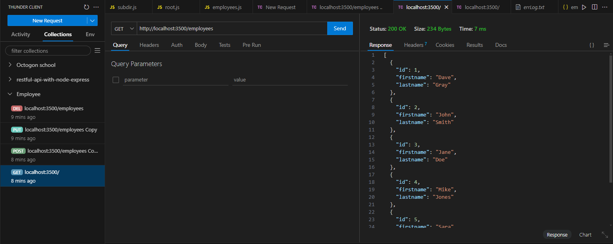
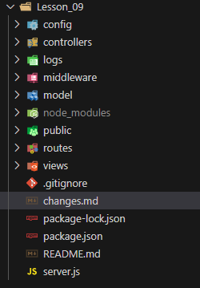

# Lesson 01 - Introduction
collapsed:: true
	- ## Revision
		- DONE Node - Introduction - 1st Revision - [[Feb 11th, 2025]]
		  :LOGBOOK:
		  CLOCK: [2025-02-11 Tue 11:58:56]--[2025-02-11 Tue 12:01:50] =>  00:02:54
		  :END:
		- DONE Node - Introduction - 2nd Revision - [[Feb 17th, 2025]]
		  :LOGBOOK:
		  CLOCK: [2025-02-21 Fri 10:39:48]
		  CLOCK: [2025-02-21 Fri 10:44:57]--[2025-02-21 Fri 10:47:01] =>  00:02:04
		  :END:
		- LATER Node - Introduction - 3rd Revision - [[Mar 10th, 2025]]
		- LATER Node - Introduction - 4th Revision - [[Aug 10th, 2025]]
	- ## Lesson
		- index.js
			- ```node 
			  // Differences between Javascript and Node
			  // 1. Node runs on a server, not in the browser (backend not frontend)
			  // 2. The console is the terminal window
			  console.log("Hello world!")
			  
			  // 3. global object insetead of window object
			  // console.log(global)
			  // 
			  // 4. Has common Core modules that we will explore
			  // 5. CommonJS modules instead of ES6 modules
			  // 6. Missing some JS APIs like fetch
			  
			  const os = require('os')
			  const path = require('path')
			  // const math = require('./math')
			  const { add, divide, subtract, multiply } = require('./math')
			  
			  console.log(__dirname)
			  // C:\Users\fbald\Documents\__WEB__\__BACKEND__\Node\Dave Gray Node\Lesson_01
			  
			  console.log(__filename)
			  // C:\Users\fbald\Documents\__WEB__\__BACKEND__\Node\Dave Gray Node\Lesson_01\server.js
			  
			  console.log(os.type())
			  // Windows_NT
			  
			  console.log(os.version())
			  // Windows 11 Home Single Language
			  
			  console.log(os.homedir())
			  // C:\Users\fbald
			  
			  console.log(path.dirname(__filename))
			  // C:\Users\fbald\Documents\__WEB__\__BACKEND__\Node\Dave Gray Node\Lesson_01
			  
			  console.log(path.basename(__filename))
			  // server.js
			  
			  console.log(path.extname(__filename))
			  // .js
			  
			  console.log(path.parse(__filename))
			  // {
			  //     root: 'C:\\',
			  //     dir: 'C:\\Users\\fbald\\Documents\\__WEB__\\__BACKEND__\\Node\\Dave Gray Node\\Lesson_01
			  //   ',
			  //     base: 'server.js',
			  //     ext: '.js',
			  //     name: 'server'
			  //   }
			  
			  console.log(add(2, 3))
			  console.log(divide(2, 3))
			  console.log(multiply(2, 3))
			  console.log(subtract(2, 3))
			  ```
		- math.js
			- ```node 
			  // You can export a function by either inserting exports. before them or
			  // export all as module on the last line
			  exports.add = (a, b) => a + b
			  exports.subtract = (a, b) => a - b
			  exports.multiply = (a, b) => a * b
			  exports.divide = (a, b) => a / b
			  
			  // module.exports = { add, subtract, multiply, divide }
			  
			  ```
	-
- # Lesson 02 - Read Write Files
  collapsed:: true
	- ## Revision
		- DONE Node - Read and Write files - 1st Revision - [[Feb 12th, 2025]]
		  :LOGBOOK:
		  CLOCK: [2025-02-12 Wed 10:04:57]--[2025-02-12 Wed 10:12:45] =>  00:07:48
		  :END:
		- DONE Node - Read and Write files - 2nd Revision - [[Feb 18th, 2025]]
		  :LOGBOOK:
		  CLOCK: [2025-02-21 Fri 10:47:38]--[2025-02-21 Fri 10:52:51] =>  00:05:13
		  :END:
		- LATER Node - Read and Write files - 3rd Revision - [[Mar 11th, 2025]]
		- LATER Node - Read and Write files - 4th Revision - [[Aug 11th, 2025]]
	- ## Lesson
		- index.js
			- ```node 
			  // To start we should look at the documentation in the NodeJS official documentation
			  // https://nodejs.org/docs/latest/api/
			  // Filesystem -> Search for readfiles and writefiles
			  
			  //  curl -s http://loripsum.net/api/10/medium > lorem.txt
			  // echo "Hi, my name is Felipe" >> starter.txt
			  
			  const fsPromises = require('fs').promises
			  const path = require('path')
			  
			  const fileOps = async () => {
			      try {
			          const data = await fsPromises.readFile(path.join(__dirname, 'files', 'starter.txt'), 'utf-8')
			          console.log(data)
			          await fsPromises.unlink(path.join(__dirname, 'files', 'starter.txt'))
			          await fsPromises.writeFile(path.join(__dirname, 'files', 'promiseWrite.txt'), data)
			          await fsPromises.appendFile(path.join(__dirname, 'files', 'promiseWrite.txt'), '\n\nNice to meet you!')
			          await fsPromises.rename(path.join(__dirname, 'files', 'promiseWrite.txt'), path.join(__dirname, 'files', 'promiseComplete.txt'))
			          const newData = await fsPromises.readFile(path.join(__dirname, 'files', 'promiseComplete.txt'), 'utf-8')
			          console.log(newData)
			      } catch (err) {
			          console.error(err)
			      }
			  }
			  
			  fileOps()
			  
			  fs.readFile(path.join(__dirname, 'files', 'starter.txt'), 'utf-8', (err, data) => {
			      // Path.join() should concatenate this names with the correct slashes for the given OS
			      if (err) throw err
			      console.log(data)
			  })
			  
			  console.log('Hello . . .')
			  
			  const data = 'Nice to meet you!'
			  const file = 'reply.txt'
			  
			  // Althoug we are doing it in order this is starting to look like call back hell.
			  fs.writeFile(path.join(__dirname, 'files', file), data, (err) => {
			      if (err) throw err
			      console.log('Write complete')
			  
			      // For the async nature of node we can do this so it write in order
			      fs.appendFile(path.join(__dirname, 'files', file), '\nYes it is\n', (err) => {
			          if (err) throw err
			          console.log('append complete')
			  
			          fs.rename(path.join(__dirname, 'files', file), path.join(__dirname, 'files', 'newReply.txt'), (err) => {
			              if (err) throw err
			              console.log('Rename complete')
			  
			          })
			      })
			  })
			  
			  
			  process.on('uncaughtException', err => {
			      console.error(`There was an uncaught error: ${err}`)
			      process.exit(1)
			  })
			  
			  
			  
			  
			  ```
		- stream.js
		  collapsed:: true
			- ```node 
			  const fs = require('fs')
			  const path = require('path')
			  
			  const rs = fs.createReadStream(path.join(__dirname, 'files', 'lorem.txt'), 'utf-8')
			  
			  const ws = fs.createWriteStream(path.join(__dirname, 'files', 'new-lorem.txt'))
			  
			  // One opinion is that this is more readable
			  rs.on('data', (dataChunck) => {
			      ws.write(dataChunck)
			  })
			  
			  // Anothe opinion is that this is more efficient
			  rs.pipe(ws) // => more efficient
			  
			  
			  ```
		- dir.js
			- ```node 
			  const fs = require('fs')
			  const path = require('path')
			  
			  
			  // existsSync is deprecated instead use fs.stat this way:
			  fs.stat(path.join(__dirname, 'newDir'), (err, stats) => {
			      {
			          if (err) { console.log('Directory does not exist') }
			          else { console.log('Directory exists') }
			      }
			  })
			  
			  // But the better way is to use fs.access this way:
			  // https://nodejs.org/docs/latest/api/fs.html#fsconstants
			  fs.access(path.join(__dirname, 'newDir'), fs.constants.F_OK, (err) => {
			      if (err) { console.log('Directory does not exist') }
			      else { console.log('Directory exists') }
			  })
			  
			  // This is the way to create a directory, deprecated
			  if (!fs.existsSync(path.join(__dirname, 'newDir'))) {
			      fs.mkdir(path.join(__dirname, 'newDir'), {}, err => {
			          if (err) throw err
			          console.log('Directory created')
			      })
			  } else {
			      fs.rmdir(path.join(__dirname, 'newDir'), err => {
			          if (err) throw err
			          console.log('Directory removed')
			      })
			  }
			  
			  ```
		-
- # Lesson 03 - NPM
  collapsed:: true
	- ## Revision
		- DONE Node - NPM - 1st Revision - [[Feb 12th, 2025]]
		  :LOGBOOK:
		  CLOCK: [2025-02-13 Thu 10:32:40]--[2025-02-13 Thu 10:34:29] =>  00:01:49
		  :END:
		- DONE Node - NPM - 2nd Revision - [[Feb 18th, 2025]]
		  :LOGBOOK:
		  CLOCK: [2025-02-21 Fri 10:52:53]--[2025-02-21 Fri 10:54:28] =>  00:01:35
		  :END:
		- LATER Node - NPM - 3rd Revision - [[Mar 11th, 2025]]
		- LATER Node - NPM - 4th Revision - [[Aug 11th, 2025]]
	- ## Lesson
		- `npm i nodemon -g `
			- nodemon => it runs the server and restarts it when we make changes
		- `npm i date-fns`
			- => a library for working with dates that will apear on 
			  the package.json file under dependencies
		- `npm i nodemon --save-dev OR npm i nodemon -D`
			- => it will appear on the package.json file under devDependencies
		- `npm install` => installs all the dependencies in the package.json file
		- Add start and dev scripts to the package.json file
		- => to run them use `npm run dev` OR `npm run start`
			- ```json
			  
			  "scripts": {
			     "start": "node index.js",
			     "dev": "nodemon index.js",
			     "test": "echo \"Error: no test specified\" && exit 1"
			   }, 
			  ```
		- On the package.json you can see the versions
			- ```json 
			  - "dependencies": {
			  - "date-fns": "^4.1.0", // => ^ means that you can update patches and minor version
			  - "uuid": "~11.0.5", // ~ => means: only updates patches
			  - "uuid": "*" // * => means: whateve version
			  - },
			  ```
		-
- # Lesson 04 - Node Events
  collapsed:: true
	- ## Revision
		- DONE Node - Node Events - 1st Revision - [[Feb 12th, 2025]]
		  :LOGBOOK:
		  CLOCK: [2025-02-13 Thu 10:34:43]--[2025-02-13 Thu 10:41:50] =>  00:07:07
		  :END:
		- DONE Node - Node Events - 2nd Revision - [[Feb 18th, 2025]]
		  :LOGBOOK:
		  CLOCK: [2025-02-21 Fri 10:54:34]--[2025-02-21 Fri 10:58:28] =>  00:03:54
		  :END:
		- LATER Node - Node Events - 3rd Revision - [[Mar 11th, 2025]]
		- LATER Node - Node Events - 4th Revision - [[Aug 11th, 2025]]
	- ## Lesson
		- logEvent.js
			- ```node 
			  const { format } = require('date-fns')
			  const { v4: uuid } = require('uuid')
			  
			  const fs = require('fs')
			  const fsPromises = fs.promises
			  const path = require('path')
			  
			  
			  // Read the code and understand what it does
			  const logEvents = async (message) => {
			      const dateTime = `${format(new Date(), "yyyyMMdd\tHH:mm:ss")}`
			      const logItem = `${dateTime}\t${uuid()}\t${message}\n`
			      console.log(logItem)
			      try {
			          if (!fs.existsSync(path.join(__dirname, 'logs'))) {
			              await fsPromises.mkdir(path.join(__dirname, 'logs'))
			          }
			          await fsPromises.appendFile(path.join(__dirname, 'logs', 'eventLog.txt'), logItem)
			      } catch (err) {
			          console.error('Error on the function logEvents', err)
			      }
			  }
			  
			  module.exports = logEvents
			  ```
		- index.js
			- ```node 
			  const logEvents = require('./logEvents')
			  const EventEmitter = require('events')
			  
			  // Documentation says you should do that
			  class MyEmitter extends EventEmitter { }
			  
			  // Initialize object
			  const myEmitter = new MyEmitter()
			  
			  // Add a listener for the log event
			  myEmitter.on('log', (msg) => logEvents(msg))
			  
			  setTimeout(() => {
			      // Emit event
			      myEmitter.emit('log', 'Log event emitted')
			  }, 2000)
			  
			  ```
- # Lesson 05 - Node Web Server
  collapsed:: true
	- ## Revision
		- DONE Node - Node Web Server - 1st Revision - [[Feb 12th, 2025]]
		  :LOGBOOK:
		  CLOCK: [2025-02-13 Thu 10:42:12]--[2025-02-13 Thu 10:50:49] =>  00:08:37
		  :END:
		- DONE Node - Node Web Server - 2nd Revision - [[Feb 18th, 2025]]
		  :LOGBOOK:
		  CLOCK: [2025-02-21 Fri 10:58:36]--[2025-02-21 Fri 11:06:10] =>  00:07:34
		  :END:
		- LATER Node - Node Web Server - 3rd Revision - [[Mar 11th, 2025]]
		- LATER Node - Node Web Server - 4th Revision - [[Aug 11th, 2025]]
	- ## Lesson
		- server.js
			- ```node 
			  const http = require('http');
			  const path = require('path');
			  const fs = require('fs');
			  const fsPromises = fs.promises;
			  
			  const logEvents = require('./logEvents');
			  const EventEmitter = require('events');
			  class Emitter extends EventEmitter { };
			  // initialize object 
			  const myEmitter = new Emitter();
			  myEmitter.on('log', (msg, fileName) => logEvents(msg, fileName));
			  const PORT = process.env.PORT || 3500;
			  
			  const serveFile = async (filePath, contentType, response) => {
			      try {
			          const rawData = await fsPromises.readFile(
			              filePath,
			              !contentType.includes('image') ? 'utf8' : ''
			          );
			          const data = contentType === 'application/json'
			              ? JSON.parse(rawData) : rawData;
			          response.writeHead(
			              filePath.includes('404.html') ? 404 : 200,
			              { 'Content-Type': contentType }
			          );
			          response.end(
			              contentType === 'application/json' ? JSON.stringify(data) : data
			          );
			      } catch (err) {
			          console.log(err);
			          myEmitter.emit('log', `${err.name}: ${err.message}`, 'errLog.txt');
			          response.statusCode = 500;
			          response.end();
			      }
			  }
			  
			  const server = http.createServer((req, res) => {
			      console.log(req.url, req.method);
			      myEmitter.emit('log', `${req.url}\t${req.method}`, 'reqLog.txt');
			  
			      const extension = path.extname(req.url);
			  
			      let contentType;
			  
			      switch (extension) {
			          case '.css':
			              contentType = 'text/css';
			              break;
			          case '.js':
			              contentType = 'text/javascript';
			              break;
			          case '.json':
			              contentType = 'application/json';
			              break;
			          case '.jpg':
			              contentType = 'image/jpeg';
			              break;
			          case '.png':
			              contentType = 'image/png';
			              break;
			          case '.txt':
			              contentType = 'text/plain';
			              break;
			          default:
			              contentType = 'text/html';
			      }
			    
			      // makes .html extension not required in the browser
			      if (!extension && req.url.slice(-1) !== '/') filePath += '.html';
			    
			      let filePath =
			          contentType === 'text/html' && req.url === '/'
			              ? path.join(__dirname, 'views', 'index.html')
			              : contentType === 'text/html' && req.url.slice(-1) === '/'
			                  ? path.join(__dirname, 'views', req.url, 'index.html')
			                  : contentType === 'text/html'
			                      ? path.join(__dirname, 'views', req.url)
			                      : path.join(__dirname, req.url);
			  
			  
			      const fileExists = fs.existsSync(filePath);
			  
			      if (fileExists) {
			          serveFile(filePath, contentType, res);
			      } else {
			          switch (path.parse(filePath).base) {
			              case 'old-page.html':
			                  res.writeHead(301, { 'Location': '/new-page.html' });
			                  res.end();
			                  break;
			              case 'www-page.html':
			                  res.writeHead(301, { 'Location': '/' });
			                  res.end();
			                  break;
			              default:
			                  serveFile(path.join(__dirname, 'views', '404.html'), 'text/html', res);
			          }
			      }
			  });
			  server.listen(PORT, () => console.log(`Server running on port ${PORT}`));
			  ```
		- logEvent.js
			- ```node 
			  const { format } = require('date-fns');
			  const { v4: uuid } = require('uuid');
			  
			  const fs = require('fs');
			  const fsPromises = require('fs').promises;
			  const path = require('path');
			  
			  const logEvents = async (message, logName) => {
			      const dateTime = `${format(new Date(), 'yyyyMMdd\tHH:mm:ss')}`;
			      const logItem = `${dateTime}\t${uuid()}\t${message}\n`;
			  
			      try {
			          if (!fs.existsSync(path.join(__dirname, 'logs'))) {
			              await fsPromises.mkdir(path.join(__dirname, 'logs'));
			          }
			  
			          await fsPromises.appendFile(path.join(__dirname, 'logs', logName), logItem);
			      } catch (err) {
			          console.log(err);
			      }
			  }
			  
			  module.exports = logEvents;
			  
			  ```
			-
- # Lesson 06 - Express
  collapsed:: true
	- ## Revision
		- DONE Node - Node Introduction to Express - 1st Revision - [[Feb 13th, 2025]]
		  :LOGBOOK:
		  CLOCK: [2025-02-13 Thu 10:50:55]--[2025-02-13 Thu 10:55:10] =>  00:04:15
		  :END:
		- DONE Node - Node Introduction to Express - 2nd Revision - [[Feb 19th, 2025]]
		  :LOGBOOK:
		  CLOCK: [2025-02-21 Fri 11:06:25]--[2025-02-21 Fri 11:09:00] =>  00:02:35
		  :END:
		- LATER Node - Node Introduction to Express - 3rd Revision - [[Mar 12th, 2025]]
		- LATER Node - Node Introduction to Express - 4th Revision - [[Aug 12th, 2025]]
	- ## Lesson
		- server.js
			- ```node 
			  const express = require('express')
			  const app = express()
			  const path = require('path')
			  const PORT = process.env.PORT || 3500
			  
			  // You can use RegEx directly on the .get() func
			  app.get('^/$|/index(.html)?', (req, res) => {
			      // res.sendFile('./views/index.html', { root: __dirname }) => also possible.
			      res.sendFile(path.join(__dirname, 'views', 'index.html'))
			  })
			  
			  app.get('/new-page(.html)?', (req, res) => {
			      res.sendFile(path.join(__dirname, 'views', 'new-page.html'))
			  })
			  
			  app.get('/old-page(.html)?', (req, res) => {
			      res.redirect(301, '/new-page.html') // 302 by default
			  })
			  
			  // Route Handlers
			  // You can chain like that
			  app.get('/hello(.html)?', (req, res, next) => {
			      res.send('Attemptend to load hello.html')
			      next()
			  }, (req, res) => {
			      res.send('Hello World')
			  })
			  
			  // Another example of chaining, more common
			  // More about it in the middleware lesson
			  const one = (req, res, next) => {
			      console.log('One')
			      next()
			  }
			  
			  const two = (req, res, next) => {
			      console.log('Two')
			      next()
			  }
			  
			  const three = (req, res) => {
			      console.log('Three')
			      res.send('Finished')
			  }
			  
			  app.get('/chain(.html)?', [one, two, three])
			  
			  // If this statement is in front of any other route, it will be executed first.
			  app.get('/*', (req, res) => {
			      res.status(404).sendFile(path.join(__dirname, 'views', '404.html'))
			  })
			  
			  app.listen(PORT, () => console.log(`Server running on port ${PORT}`))
			  
			  ```
- # Lesson 07 - Middleware
  collapsed:: true
	- ## Revision
		- DONE Node - Express Middleware - 1st Revision - [[Feb 22nd, 2025]]
		  :LOGBOOK:
		  CLOCK: [2025-02-24 Mon 10:20:13]--[2025-02-24 Mon 10:25:00] =>  00:04:47
		  :END:
		- DONE Node - Express Middleware - 2nd Revision - [[Feb 28th, 2025]]
		  :LOGBOOK:
		  CLOCK: [2025-03-06 Thu 16:04:40]--[2025-03-06 Thu 16:13:25] =>  00:08:45
		  :END:
		- LATER Node - Express Middleware - 3rd Revision - [[Mar 22nd, 2025]]
		- LATER Node - Express Middleware - 4th Revision - [[Aug 22nd, 2025]]
	- ## Lesson
		- ### Changes in code:
		  collapsed:: true
			- Changes:
			  logseq.order-list-type:: number
				- Added public dir, as we are using express built-in middleware
				  logseq.order-list-type:: number
				- Changed the import paths for this static views files from ../<name> to <name> for they are public
				  logseq.order-list-type:: number
			- Changes:
			  logseq.order-list-type:: number
				- Used the custom middleware func to log the calls to back-end
				  logseq.order-list-type:: number
				- Changed the location of the file logEvents.js to middleware
				  logseq.order-list-type:: number
				- Changed the path for saving the log.txt file so it's not on middleware
				  logseq.order-list-type:: number
				- Create the function logger to cleanup the server.js and leave it on logEvents.js
				  logseq.order-list-type:: number
				- Installed cors, as for the google.com console => fetch('http:localhost:3500') it was returned CORS error
				  logseq.order-list-type:: number
			- Changes:
			  logseq.order-list-type:: number
				- Added whitelist for the corsOptions
				  logseq.order-list-type:: number
				- Made a anonymous func to send a 500 status with the error message for the front-end after the get method for 404 page
				  logseq.order-list-type:: number
			- Changes:
			  logseq.order-list-type:: number
				- Transported the error handling for it's own file and use logger to make it log into error.txt
				  logseq.order-list-type:: number
			- Changes:
			  logseq.order-list-type:: number
				- logseq.order-list-type:: number
				  1. Using app.all to handle 404 pages so it can return the proper type for each type of filetype
		- ### server.js
		  collapsed:: true
			- ```node 
			  const express = require('express')
			  const app = express()
			  const path = require('path')
			  const cors = require('cors')
			  const { logger } = require('./middleware/logEvents')
			  const { errorHandler } = require('./middleware/errorHandler')
			  const PORT = process.env.PORT || 3500
			  
			  // Custom middleware => should be before anything else
			  app.use(logger)
			  
			  // Built-in middleware to handle CORS
			  // Cross origin Resource Sharing
			  // Remove on production
			  const whitelist = [
			      'https://www.yoursite.com',
			      // 'https://www.google.com',
			      'http://127.0.0.1:5500',
			      'http://localhost:3500'
			  ]
			  const corsOptions = {
			      origin: (origin, callback) => {
			          // on developemment mode origin is undefined
			          // so we need to allow undefined
			          if (whitelist.indexOf(origin) !== -1 || !origin) {
			              callback(null, true)
			          } else {
			              callback(new Error('Not allowed by CORS'))
			          }
			      },
			      optionsSuccessStatus: 200
			  }
			  app.use(cors(corsOptions))
			  
			  // Built-in middleware to handle urlencoded data
			  // in other words, form data:
			  // 'content-type: application/x-www-form-urlencoded'
			  app.use(express.urlencoded({ extended: false }))
			  
			  // Built-in middleware for json
			  app.use(express.json())
			  
			  // Built-in middleware to serve static files from the public folder
			  app.use(express.static(path.join(__dirname, 'public')))
			  
			  app.get('^/$|/index(.html)?', (req, res) => {
			      //res.sendFile('./views/index.html', { root: __dirname })
			      res.sendFile(path.join(__dirname, 'views', 'index.html'))
			  })
			  
			  app.get('/new-page(.html)?', (req, res) => {
			      res.sendFile(path.join(__dirname, 'views', 'new-page.html'))
			  })
			  
			  app.get('/old-page(.html)?', (req, res) => {
			      res.redirect(301, '/new-page.html') //302 by default
			  })
			  
			  // Route handlers
			  app.get('/hello(.html)?', (req, res, next) => {
			      console.log('attempted to load hello.html')
			      next()
			  }, (req, res) => {
			      res.send('Hello World!')
			  })
			  
			  
			  // chaining route handlers
			  const one = (req, res, next) => {
			      console.log('one')
			      next()
			  }
			  
			  const two = (req, res, next) => {
			      console.log('two')
			      next()
			  }
			  
			  const three = (req, res) => {
			      console.log('three')
			      res.send('Finished!')
			  }
			  
			  app.get('/chain(.html)?', [one, two, three])
			  
			  // app.all also acceps regex
			  app.all('*', (req, res) => {
			      res.status(404)
			      if (req.accepts('html')) {
			          res.sendFile(path.join(__dirname, 'views', '404.html'))
			      } else if (req.accepts('json')) {
			          res.json({ status: '404', error: 'Page not found' })
			      } else {
			          res.type('txt').send('404: Page not found')
			      }
			  })
			  
			  app.use(errorHandler)
			  
			  app.listen(PORT, () => console.log(`Server running on port ${PORT}`))
			  ```
		- ### errorHandler.js
		  collapsed:: true
			- ```node 
			  const { logEvents } = require('./logEvents')
			  
			  exports.errorHandler = (err, req, res, next) => {
			      logEvents(`${err.name}: ${err.message}`, 'error.txt')
			      console.error(err.stack)
			      res.status(500).send(err.message)
			  }
			  ```
		- ### logevents.js
		  collapsed:: true
			- ```node 
			  const { format } = require('date-fns');
			  const { v4: uuid } = require('uuid');
			  
			  const fs = require('fs');
			  const fsPromises = require('fs').promises;
			  const path = require('path');
			  
			  const logEvents = async (message, logName) => {
			      const dateTime = `${format(new Date(), 'yyyyMMdd\tHH:mm:ss')}`;
			      const logItem = `${dateTime}\t${uuid()}\t${message}\n`;
			  
			      try {
			          if (!fs.existsSync(path.join(__dirname, '..', 'logs'))) {
			              await fsPromises.mkdir(path.join(__dirname, '..', 'logs'));
			          }
			  
			          await fsPromises.appendFile(path.join(__dirname, '..', 'logs', logName), logItem);
			      } catch (err) {
			          console.log(err);
			      }
			  }
			  
			  // should always calls next() to pass control to the next middleware function
			  const logger = (req, res, next) => {
			      logEvents(`${req.method}\t${req.headers.origin}\t${req.url}`, 'req.txt')
			      console.log(`${req.method} ${req.path}`)
			      next()
			  }
			  
			  module.exports = { logger, logEvents };
			  
			  ```
- # Lesson 08 - Express Routes
  collapsed:: true
	- ## Revision
		- DONE Node - Express Routes - 1st Revision - [[Feb 22nd, 2025]]
		  :LOGBOOK:
		  CLOCK: [2025-02-24 Mon 10:25:05]--[2025-02-24 Mon 10:33:02] =>  00:07:57
		  :END:
		- DONE Node - Express Routes - Task [[Feb 24th, 2025]]
		  collapsed:: true
		  :LOGBOOK:
		  CLOCK: [2025-02-24 Mon 10:54:43]--[2025-02-26 Wed 10:06:37] =>  47:11:54
		  :END:
			- Make api request actually work on a memory saved constant
		- DONE Node - Express Routes - 2nd Revision - [[Feb 28th, 2025]]
		  :LOGBOOK:
		  CLOCK: [2025-03-06 Thu 16:13:36]--[2025-03-06 Thu 16:19:17] =>  00:05:41
		  :END:
		- LATER Node - Express Routes - 3rd Revision - [[Mar 22nd, 2025]]
		- LATER Node - Express Routes - 4th Revision - [[Aug 22nd, 2025]]
	- ## Lesson
		- ### Changes:
			- Created the routes file
			  logseq.order-list-type:: number
			- Added '..','views', 'subdir',
			  logseq.order-list-type:: number
			- Added app.use('/subdir') to server.js however it does not use the css files
			  logseq.order-list-type:: number
			- Extrated the routes for root to a root.js file
			  logseq.order-list-type:: number
			- Created routes/api/employees.js to handle api calls
			  logseq.order-list-type:: number
			- Used thunderClient to GET POST PUT DELETE.
			  logseq.order-list-type:: number
			- As a challenge implement the routes/api/employees.js file so it handles the data insertions and deletion
			  logseq.order-list-type:: number
		- ### Server.js
		  collapsed:: true
			- ```node 
			  const express = require('express')
			  const app = express()
			  const path = require('path')
			  const cors = require('cors')
			  const { logger } = require('./middleware/logEvents')
			  const errorHandler = require('./middleware/errorHandler')
			  const PORT = process.env.PORT || 3500
			  
			  // custom middleware logger
			  app.use(logger)
			  
			  // Cross Origin Resource Sharing
			  const whitelist = ['https://www.yoursite.com', 'http://127.0.0.1:5500', 'http://localhost:3500']
			  const corsOptions = {
			      origin: (origin, callback) => {
			          if (whitelist.indexOf(origin) !== -1 || !origin) {
			              callback(null, true)
			          } else {
			              callback(new Error('Not allowed by CORS'))
			          }
			      },
			      optionsSuccessStatus: 200
			  }
			  app.use(cors(corsOptions))
			  
			  // built-in middleware to handle urlencoded data
			  // in other words, form data:  
			  // ‘content-type: application/x-www-form-urlencoded’
			  app.use(express.urlencoded({ extended: false }))
			  
			  // built-in middleware for json 
			  app.use(express.json())
			  
			  //serve static files
			  app.use(express.static(path.join(__dirname, '/public')))
			  app.use('/subdir', express.static(path.join(__dirname, '/public')))
			  
			  // routes
			  app.use('/', require('./routes/root'))
			  app.use('/subdir', require('./routes/subdir'))
			  app.use('/employees', require('./routes/api/employees'))
			  
			  
			  app.all('*', (req, res) => {
			      res.status(404)
			      if (req.accepts('html')) {
			          res.sendFile(path.join(__dirname, 'views', '404.html'))
			      } else if (req.accepts('json')) {
			          res.json({ "error": "404 Not Found" })
			      } else {
			          res.type('txt').send("404 Not Found")
			      }
			  })
			  
			  app.use(errorHandler)
			  
			  app.listen(PORT, () => console.log(`Server running on port ${PORT}`))
			  ```
		- ### Employees.js
		  collapsed:: true
			- ```node 
			  const express = require('express')
			  const router = express.Router()
			  const data = {}
			  // "like" connecting to a database
			  data.employees = require('../../data/employees.json')
			  
			  // instead of making router.get, router.post  . . .]
			  router.route('/')
			      .get((req, res) => {
			          res.json(data.employees)
			      })
			      .post((req, res) => {
			          // Just example, not a real implementation
			          res.json({
			              "firstname": req.body.firstname,
			              "lastname": req.body.lastname
			          })
			      })
			      .put((req, res) => {
			          // Just example, not a real implementation
			          res.json({
			              "firstname": req.body.firstname,
			              "lastname": req.body.lastname
			          })
			      })
			      .delete((req, res) => {
			          // Just example, not a real implementation
			          res.json({ "id": req.body.id })
			      })
			  
			  router.route('/:id')
			      .get((req, res) => {
			          // Just example, not a real implementation
			          res.json({ "id": req.params.id })
			      })
			  module.exports = router
			  ```
		- ### Root.js
		  collapsed:: true
			- ```node 
			  const express = require('express')
			  const router = express.Router()
			  const path = require('path')
			  
			  router.get('^/$|/index(.html)?', (req, res) => {
			      res.sendFile(path.join(__dirname, '..', 'views', 'index.html'))
			  })
			  
			  router.get('/new-page(.html)?', (req, res) => {
			      res.sendFile(path.join(__dirname, '..','views', 'new-page.html'))
			  })
			  
			  router.get('/old-page(.html)?', (req, res) => {
			      res.redirect(301, '/new-page.html') //302 by default
			  })
			  
			  module.exports = router
			  ```
		- ### Subdir.js
		  collapsed:: true
			- ```node 
			  const express = require('express')
			  const router = express.Router()
			  const path = require('path')
			  
			  router.get('^/$|/index(.html)?', (req, res) => {
			      res.sendFile(path.join(__dirname, '..','views', 'subdir', 'index.html'))
			  })
			  
			  router.get('/test(.html)?', (req, res) => {
			      res.sendFile(path.join(__dirname, '..','views', 'subdir', 'test.html'))
			  })
			  
			  
			  module.exports = router
			  ```
			-
		- ### ThuderClient
			- {:height 283, :width 688}
- # Lesson 09 - Express MVC Model View Controller
  collapsed:: true
	- ## Revision
		- DONE Node - MVC Module View Controller - 1st Revision [[Feb 25th, 2025]]
		  :LOGBOOK:
		  CLOCK: [2025-02-26 Wed 10:07:00]--[2025-02-26 Wed 10:29:51] =>  00:22:51
		  :END:
		- DONE Node - MVC Module View Controller - 2nd Revision [[Mar 3rd, 2025]]
		  :LOGBOOK:
		  CLOCK: [2025-03-06 Thu 16:19:27]--[2025-03-06 Thu 16:27:06] =>  00:07:39
		  :END:
		- LATER Node - MVC Module View Controller - 3rd Revision [[Mar 24th, 2025]]
		- LATER Node - MVC Module View Controller - 4th Revision [[Aug 24th, 2025]]
	- ## Lesson
	  collapsed:: true
		- ### Changes.md
			- ```markdown  
			  1. Changed the dir data name for model
			  2. Added the dir Controller
			  3. Implemented the logic for the api in the employeeController 
			      - On the router only the addresses are visible the logic is all in the controller
			  4. Create config dir to insert the cors configuration in it
			  5. Made the changes on the employeeController.js to make it execute CRUD correctly
			  ```
			- {:height 367, :width 250}
		- ### server.js
		  collapsed:: true
			- ```node 
			  const express = require('express')
			  const app = express()
			  const path = require('path')
			  const cors = require('cors')
			  const corsOptions = require('./config/corsOptions')
			  const { logger } = require('./middleware/logEvents')
			  const errorHandler = require('./middleware/errorHandler')
			  const PORT = process.env.PORT || 3501
			  
			  // custom middleware logger
			  app.use(logger)
			  
			  // Cross origin Resource Sharing
			  app.use(cors(corsOptions))
			  
			  // built-in middleware to handle form data
			  app.use(express.urlencoded({ extended: false }))
			  
			  // built-in middleware for json 
			  app.use(express.json())
			  
			  //serve static files
			  app.use(express.static(path.join(__dirname, '/public')))
			  
			  // routes
			  app.use('/', require('./routes/root'))
			  app.use('/employees', require('./routes/api/employees'))
			  
			  app.all('*', (req, res) => {
			      res.status(404)
			      if (req.accepts('html')) {
			          res.sendFile(path.join(__dirname, 'views', '404.html'))
			      } else if (req.accepts('json')) {
			          res.json({ "error": "404 Not Found" })
			      } else {
			          res.type('txt').send("404 Not Found")
			      }
			  })
			  
			  app.use(errorHandler)
			  
			  app.listen(PORT, () => console.log(`Server running on port ${PORT}`))
			  ```
		- ### employeeController.js
		  collapsed:: true
			- ```node 
			  const data = {
			      employees: require('../model/employees.json'),
			      setEmployees: (data) => { this.employees = data }
			  
			  }
			  
			  const getAllEmployees = ((req, res) => {
			      res.json(data.employees)
			  })
			  
			  const createNewEmployee = (req, res) => {
			      const newEmployee = {
			          id: data.employees[data.employees.length - 1].id + 1,
			          firstname: req.body.firstname,
			          lastname: req.body.lastname
			      }
			  
			      if (!newEmployee.firstname || !newEmployee.lastname) {
			          return res.status(400).json({ "error": "Please enter first and last name" })
			      }
			  
			      data.setEmployees([...data.employees, newEmployee])
			      res.status(201).json(newEmployee)
			  }
			  
			  
			  
			  const updataEmployee = (req, res) => {
			      const employee = data.employees.find(employee => employee.id === parseInt(req.body.id))
			  
			      if (!employee) {
			          return res.status(404).json({ "error": "Employee not found" })
			      }
			  
			      if (req.body.firstname) employee.firstname = req.body.firstname
			      if (req.body.lastname) employee.lastname = req.body.lastname
			  
			      res.json(employee)
			  }
			  
			  const deleteEmployee = (req, res) => {
			      let deleted
			      try {
			          const index = data.employees.findIndex(employee => employee.id === req.body.id)
			          if (index === -1) {
			              throw new Error("Employee not found")
			          }
			  
			          deleted = data.employees.splice(index, 1)[0]
			  
			      } catch (err) {
			          return res.status(404).json({ "Error": "Employee not found" })
			      }
			      res.json(deleted)
			  }
			  
			  const getEmployeeById = (req, res) => {
			      const employee = data.employees.find(emp => emp.id === parseInt(req.params.id))
			      if (!employee) {
			          return res.status(404).json({ "error": "Employee not found" })
			      }
			      return res.status(200).json(employee)
			  }
			  
			  module.exports = {
			      getAllEmployees,
			      createNewEmployee,
			      updataEmployee,
			      deleteEmployee,
			      getEmployeeById
			  }
			  ```
		- ### api/employee.js
		  collapsed:: true
			- ```node 
			  const express = require('express')
			  const router = express.Router()
			  const employeesController = require('../../controllers/employeesController')
			  
			  router.route('/')
			      .get(employeesController.getAllEmployees)
			      .post(employeesController.createNewEmployee)
			      .put(employeesController.updataEmployee)
			      .delete(employeesController.deleteEmployee)
			  
			  router.route('/:id')
			      .get(employeesController.getEmployeeById)
			  module.exports = router
			  ```
		- ### model/employee.json
		  collapsed:: true
			- ```json 
			  [
			      {
			          "id": 1,
			          "firstname": "Dave",
			          "lastname": "Gray"
			      },
			      {
			          "id": 2,
			          "firstname": "John",
			          "lastname": "Smith"
			      },
			      {
			          "id": 3,
			          "firstname": "Jane",
			          "lastname": "Doe"
			      },
			      {
			          "id": 4,
			          "firstname": "Mike",
			          "lastname": "Jones"
			      },
			      {
			          "id": 5,
			          "firstname": "Sara",
			          "lastname": "Wilson"
			      }
			  ]
			  ```
- # Lesson 10 - Bcrypt authentication
  collapsed:: true
	- ## Revision
		- DONE Node Express - Bcrypt authentication - 1st Revision [[Feb 27th, 2025]]
		  :LOGBOOK:
		  CLOCK: [2025-02-27 Thu 12:11:04]--[2025-02-27 Thu 12:19:51] =>  00:08:47
		  :END:
		- LATER Node Express - Bcrypt authentication - 2nd Revision [[Mar 5th, 2025]]
		- LATER Node Express - Bcrypt authentication - 3rd Revision [[Mar 26th, 2025]]
		- LATER Node Express - Bcrypt authentication - 4th Revision [[Aug 26th, 2025]]
	- ## Lesson
		- ### Learned also
		  collapsed:: true
			- You cannot use arrow function on a definition of a database:
			  logseq.order-list-type:: number
			  collapsed:: true
				- ```node 
				  const usersDB = {
				      users: require('../models/users.json'),
				      setUsers: function (data) { this.users = data }
				    // setUsers: (data) => { this.users = data }
				  }
				  ```
				- For the arrow function get it's "this" from inheritance, meaning it will not refer to the database in this case of use
		- ### Changes.js
		  id:: 67bf2b5a-2550-4355-9a31-b224dc36e3cf
		  collapsed:: true
			- ```
			  User Password Authentication with Node.js & Express
			  
			  1. Create the models/user.json
			  2. Create the registerController.js
			      - `npm install bcrypt`
			      - develop handleNewUser() 
			  3. Create routes/api/register.js
			  4. Add the route to server.js
			  5. Try to POST with thunderclient
			      - POST OK
			  6. Create the authControlle.js
			      - Make the logic for it to search and match the database
			  7. Add the route to the server.js file
			  
			  ```
		- ### users.json
		  collapsed:: true
			- ```node 
			  [
			      {
			          "username": "Felipe1",
			          "password": "$2b$10$7EPYYP16lrDd2L7zyKYar.nXElEt.5zARM7hv14zanKVZ4vF4bLO2"
			      },
			      {
			          "username": "Felipe2",
			          "password": "$2b$10$M69VWZxqD57FMWnwyKaeQe8iAo2wzsDgyltWlZnXO7mJAfBpakNsS"
			      }
			  ]
			  ```
		- ### registerController.js
		  collapsed:: true
			- ```node 
			  const usersDB = {
			      users: require('../models/users.json'),
			      setUsers: function (data) { this.users = data }
			  }
			  
			  const fsPromises = require('fs').promises
			  const path = require('path')
			  const bcrypt = require('bcrypt')
			  
			  exports.handleNewUser = async (req, res) => {
			      const { username, password } = req.body
			  
			      if (!username || !password) {
			          return res.status(400).send('Missing username or password') // bad request
			      }
			  
			      const duplicateUser = usersDB.users.find(person => person.username === username) 
			  
			      if (duplicateUser) {
			          return res.status(409).send('Username already exists') // conflict
			      }
			      try {
			          // Encrypt password
			          const hashedPassword = await bcrypt.hash(password, 10) // ,10 is the number of salt rounds
			          // Store the new user
			          const newUser = {
			              username,
			              password: hashedPassword
			          }
			          usersDB.setUsers([...usersDB.users, newUser])
			          await fsPromises.writeFile(
			              path.join(__dirname, '../models/users.json'),
			              JSON.stringify(usersDB.users)
			          )
			          console.log('New user created:', newUser)
			          res.status(201).send(`User ${username} created`)
			      } catch (error) {
			          console.error(error)
			          res.status(500).json({ "message": "Internal Server Error" }) // internal server error
			      }
			  }
			  
			  
			  ```
		- ### authController.js
		  collapsed:: true
			- ```node 
			  const usersDB = {
			      users: require('../models/users.json'),
			      setUsers: function (data) { this.users = data }
			  }
			  
			  const bcrypt = require('bcrypt')
			  
			  exports.handleLogin = async (req, res) => {
			      const { username, password } = req.body
			      if (!username || !password) {
			          return res.status(400).send('Missing username or password') // Bad request
			      }
			  
			      const foundUser = usersDB.users.find(person => person.username === username)
			      if (!foundUser) return res.status(401).send('Invalid username') // unauthorized
			      // Evaluate the password
			      const match = await bcrypt.compare(password, foundUser.password)
			  
			      // Create JWT token
			  
			      if (!match) return res.status(401).send('Invalid password') // unauthorized
			      res.status(200).json({ "message": `User: ${username} is logger in!` })
			      console.log(`User: ${username} is logger in!`)
			  }
			  
			  
			  ```
		- ### server.js
		  collapsed:: true
			- ```node 
			  const express = require('express')
			  const app = express()
			  const path = require('path')
			  const cors = require('cors')
			  const corsOptions = require('./config/corsOptions')
			  const { logger } = require('./middleware/logEvents')
			  const errorHandler = require('./middleware/errorHandler')
			  const PORT = process.env.PORT || 3501
			  
			  // custom middleware logger
			  app.use(logger)
			  
			  // Cross Origin Resource Sharing
			  app.use(cors(corsOptions))
			  
			  // built-in middleware to handle urlencoded form data
			  app.use(express.urlencoded({ extended: false }))
			  
			  // built-in middleware for json 
			  app.use(express.json())
			  
			  //serve static files
			  app.use('/', express.static(path.join(__dirname, '/public')))
			  
			  // routes
			  app.use('/', require('./routes/root'))
			  app.use('/register', require('./routes/api/register')) // ADDED
			  app.use('/auth', require('./routes/api/auth')) // ADDED
			  app.use('/employees', require('./routes/api/employees'))
			  
			  app.all('*', (req, res) => {
			      res.status(404)
			      if (req.accepts('html')) {
			          res.sendFile(path.join(__dirname, 'views', '404.html'))
			      } else if (req.accepts('json')) {
			          res.json({ "error": "404 Not Found" })
			      } else {
			          res.type('txt').send("404 Not Found")
			      }
			  })
			  
			  app.use(errorHandler)
			  
			  app.listen(PORT, () => console.log(`Server running on port ${PORT}`))
			  ```
- # Lesson 11 - JWT Authentication
  collapsed:: true
	- ## Revision
		- LATER Node Express - JWT Authentication - 1st Revision [[Feb 28, 2025]]
		- LATER Node Express - JWT Authentication - 2nd Revision [[Mar 6th, 2025]]
		- LATER Node Express - JWT Authentication - 3rd Revision [[Mar 27th, 2025]]
		- LATER Node Express - JWT Authentication - 4th Revision [[Aug 27th, 2025]]
	- ## Lesson
		- ### Changes
		  collapsed:: true
			- ```md
			  Using JWT Authentication - Json Web Token
			  
			  The JWT is a token that the user receives after the authentication
			  - Access Token = short time (5 - 15 min)
			  - Refresh Token = long time (days)
			  It protects against:
			  - XSS: Cross-Site Scripting
			  - CSRF: CS Request Forgery
			  DO NOT store in local storage or cookie keep in memory
			  
			  Refresh token:
			  - Sent as httpOnly cookie:
			      - Not Accessible via JS
			      - Must have expiry
			  
			  Start:
			  1. Install the packages:
			  `npm i dotenv jsonwebtoken cookie-parser`
			  2. Create a .env file and add it to .gitignore
			  3. on terminal
			      - `node`
			      - `require('crypto').randomBytes(64).toString('hex')`
			  4. Add the keys to the .env file
			  5. On authController.js
			      - Create the logic to return the accessToken and refreToken
			      - Create the logic to save it to the DB
			  6. Create a middleWare vefiryJWT.js
			      - Create the logic for JWT verification
			  7. Create a refreshTokenController, route and add to server
			  8. Create the logoutController, route and add to server
			  ```
		- ### logoutController.js
		  collapsed:: true
			- ```node 
			  const usersDB = {
			      users: require('../model/users.json'),
			      setUsers: function (data) { this.users = data }
			  }
			  
			  const fsPromises = require('fs').promises
			  const path = require('path')
			  
			  exports.handleLogout = async (req, res) => {
			      // On client also delete the refreshToken cookie
			      const cookies = req.cookies
			      if (!cookies?.jwt) return res.sendStatus(204) // No Content
			      // is refreshtoken in db?
			      const refreshToken = cookies.jwt
			      const foundUser = usersDB.users.find(person => person.refreshToken === refreshToken)
			  
			      if (!foundUser) {
			          res.clearCookie('jwt', { httpOnly: true, sameSite: "None", secure: true })
			          return res.sendStatus(204) // No Content
			      }
			  
			      // Delete refreshToken from db
			      const otherUsers = usersDB.users.filter(person => person.username !== foundUser.username)
			      const currentUser = { ...foundUser, refreshToken: '' }
			      usersDB.setUsers([...otherUsers, currentUser])
			      await fsPromises.writeFile(
			          path.join(__dirname, '..', 'model', 'users.json'),
			          JSON.stringify(usersDB.users)
			      )
			  
			      res.clearCookie('jwt', { httpOnly: true, sameSite: "None", secure: true })  // delete refreshToken cookie
			      res.sendStatus(204) // No Content
			  
			  }
			  ```
		- ### authController.js
		  collapsed:: true
			- ```node 
			  const usersDB = {
			      users: require('../model/users.json'),
			      setUsers: function (data) { this.users = data }
			  }
			  const bcrypt = require('bcrypt')
			  
			  const jwt = require('jsonwebtoken')
			  require('dotenv').config()
			  const fsPromises = require('fs').promises
			  const path = require('path')
			  
			  const handleLogin = async (req, res) => {
			      const { user, pwd } = req.body
			      if (!user || !pwd) return res.status(400).json({ 'message': 'Username and password are required.' })
			      const foundUser = usersDB.users.find(person => person.username === user)
			      if (!foundUser) return res.sendStatus(401) //Unauthorized 
			      // evaluate password 
			      const match = await bcrypt.compare(pwd, foundUser.password)
			      if (match) {
			          // create JWTs
			          const accessToken = jwt.sign(
			              { username: foundUser.username },
			              process.env.ACCESS_TOKEN_SECRET,
			              { expiresIn: '30s' }
			          )
			  
			          const refreshToken = jwt.sign(
			              { username: foundUser.username },
			              process.env.REFRESH_TOKEN_SECRET,
			              { expiresIn: '1d' }
			          )
			  
			          // Saving refreshToken with current user
			          const otherUsers = usersDB.users.filter(person => person.username !== foundUser.username)
			          const currentUser = { ...foundUser, refreshToken }
			          usersDB.setUsers([...otherUsers, currentUser])
			          await fsPromises.writeFile(
			              path.join(__dirname, '..', 'model', 'users.json'),
			              JSON.stringify(usersDB.users)
			          )
			          // Send only the accesstoken to the client
			          // The client will use on app memory only the accesstoken
			          // The refreshToken will be stored in a secure httpOnly cookie
			      res.cookie('jwt', refreshToken, { 
			              httpOnly: true, 
			              sameSite: 'None',
			              maxAge: 24 * 60 * 60 * 1000,
			  
			          }) // 1 day
			          // res.json({ accessToken })
			          res.json({ 'success': `User ${user} is logged in!` })
			      } else {
			          res.sendStatus(401)
			      }
			  }
			  
			  module.exports = { handleLogin }
			  ```
		- ### refreshTokenController.js
		  collapsed:: true
			- ```node 
			  const usersDB = {
			      users: require('../model/users.json'),
			      setUsers: function (data) { this.users = data }
			  }
			  
			  const jwt = require('jsonwebtoken')
			  require('dotenv').config()
			  
			  exports.handleRefreshToken = (req, res) => {
			      const cookies = req.cookies
			      if (!cookies?.jwt) return res.sendStatus(401)
			      console.log('cookies.jwt:', cookies.jwt)
			      const refreshToken = cookies.jwt
			  
			      const foundUser = usersDB.users.find(person => person.refreshToken === refreshToken)
			  
			      console.log('foundUser:', foundUser)
			  
			      if (!foundUser) return res.sendStatus(403) // forbidden 
			      console.log("didn't made here")
			      // Evaluate JWT
			      jwt.verify(
			          refreshToken,
			          process.env.REFRESH_TOKEN_SECRET,
			          (err, decoded) => {
			              if (err || foundUser.username !== decoded.username) return res.sendStatus(403) // forbidden invalid token
			              const accessToken = jwt.sign(
			                  { username: foundUser.username },
			                  process.env.ACCESS_TOKEN_SECRET,
			                  { expiresIn: '30s' }
			              )
			              res.json({ accessToken })
			          }
			      )
			  }
			  
			  
			  ```
		- ### config/allowedOrigins.js
		  collapsed:: true
			- ```node 
			  const allowedOrigins = [
			      'https://www.yoursite.com',
			      'http://127.0.0.1:5500',
			      'http://localhost:3500'
			  ]
			  
			  module.exports = allowedOrigins
			  ```
		- ### credentials.js
		  collapsed:: true
			- ```node 
			  const allowedOrigins = require('../config/allowedOrigins')
			  
			  // should verify if the origin is included in the allowedOrigins list and insert:
			  // 'AccessControlAllowCredentials' to true
			  
			  const credentials = (req, res, next) => {
			      const origin = req.headers.origin
			      if (allowedOrigins.includes(origin)) {
			          res.headers('Access-Control-Allow-Credentials', true)
			      }
			      next()
			  }
			  
			  module.exports = credentials
			  ```
		- ### verifyJWT.js
		  collapsed:: true
			- ```node 
			  const jwt = require('jsonwebtoken')
			  require('dotenv').config()
			  
			  exports.verifyJWT = (req, res, next) => {
			      const authHeader = req.headers['authorization']
			      if (!authHeader) return res.sendStatus(401)
			      console.log('authHeader:', authHeader) // Bearere token
			      const token = authHeader.split(' ')[1]
			      jwt.verify(
			          token,
			          process.env.ACCESS_TOKEN_SECRET,
			          (err, decoded) => {
			              if (err) return res.sendStatus(403) // forbidden invalid token
			              req.user = decoded.usernamme
			              next()
			          }
			      )
			  }
			  ```
		- ### server.js
		  collapsed:: true
			- ```node 
			  const express = require('express')
			  const app = express()
			  const path = require('path')
			  const cors = require('cors')
			  const corsOptions = require('./config/corsOptions')
			  const { logger } = require('./middleware/logEvents')
			  const errorHandler = require('./middleware/errorHandler')
			  const { verifyJWT } = require('./middleware/verifyJWT')
			  const cookieParser = require('cookie-parser')
			  const credentials = require('./middleware/credentials')
			  const PORT = process.env.PORT || 3501
			  
			  // custom middleware logger
			  app.use(logger)
			  
			  // Use credentials middleware
			  // Should be before cors.
			  app.use(credentials)
			  
			  // Cross Origin Resource Sharing
			  app.use(cors(corsOptions))
			  
			  // built-in middleware to handle urlencoded form data
			  app.use(express.urlencoded({ extended: false }))
			  
			  // built-in middleware for json 
			  app.use(express.json())
			  
			  // Middelware for cookies
			  app.use(cookieParser())
			  
			  //serve static files
			  app.use('/', express.static(path.join(__dirname, '/public')))
			  
			  
			  
			  // routes
			  app.use('/', require('./routes/root'))
			  app.use('/register', require('./routes/register'))
			  app.use('/auth', require('./routes/auth'))
			  app.use('/refresh', require('./routes/refresh'))
			  app.use('/logout', require('./routes/logout'))
			  
			  app.use(verifyJWT) // Wouldn't like to use it in /, /register, /auth
			  app.use('/employees', require('./routes/api/employees'))
			  
			  app.all('*', (req, res) => {
			      res.status(404)
			      if (req.accepts('html')) {
			          res.sendFile(path.join(__dirname, 'views', '404.html'))
			      } else if (req.accepts('json')) {
			          res.json({ "error": "404 Not Found" })
			      } else {
			          res.type('txt').send("404 Not Found")
			      }
			  })
			  
			  app.use(errorHandler)
			  
			  app.listen(PORT, () => console.log(`Server running on port ${PORT}`))
			  ```
			-
- # Lesson 12 - Roles
  collapsed:: true
	- ## Revision
		- LATER Node Express - Roles - 1st Revision [[Feb 28, 2025]]
		- LATER Node Express - Roles - 2nd Revision [[Mar 6th, 2025]]
		- LATER Node Express - Roles - 3rd Revision [[Mar 27th, 2025]]
		- LATER Node Express - Roles - 4th Revision [[Aug 27th, 2025]]
	- ## Lesson
		- ### changes.md
		  collapsed:: true
			- ```markdown
			  # Authorize User Roles and Permissions
			  
			  Difference between Authorization and Authentication
			  - Authentication:
			      - Who are you?
			      - Login
			  - Authorization:
			      - What are you allowed to do?
			      - Roles and Permissions
			  
			  1. Create roles_list.js file in config
			  2. Add manually the roles to the users in: model/user.js
			  3. Add the roles to the newUser in controllers/registrerController.js
			  4. Send the roles to the client in the response on authController.js
			  5. Add the roles to refreshToken.js when it responds to the client
			  6. Add the roles to verifyJWT.js file and remember that now decoded.userInfo has the username and roles
			  7. Create a middleware to verify the roles in the routes
			  8. Add the middleware to the routes in routes/api/employees.js
			  *Note* that the thunderclient extention does not allow `secure: true` in the request body
			  
			  The main objective is to create roles and vefify them for the users requests
			  ```
		- ### config/roles_list.js
		  collapsed:: true
			- ```node 
			  const ROLES_LIST = {
			      "Admin": 5150,
			      "Editor": 1984,
			      "User": 2001
			  }
			  
			  module.exports = ROLES_LIST
			  ```
		- ### authController.js
		  collapsed:: true
			- ```node 
			  const usersDB = {
			      users: require('../model/users.json'),
			      setUsers: function (data) { this.users = data }
			  }
			  const bcrypt = require('bcrypt');
			  
			  const jwt = require('jsonwebtoken');
			  require('dotenv').config();
			  const fsPromises = require('fs').promises;
			  const path = require('path');
			  
			  const handleLogin = async (req, res) => {
			      const { user, pwd } = req.body;
			      if (!user || !pwd) return res.status(400).json({ 'message': 'Username and password are required.' });
			      const foundUser = usersDB.users.find(person => person.username === user);
			      if (!foundUser) return res.sendStatus(401); //Unauthorized 
			      // evaluate password 
			      const match = await bcrypt.compare(pwd, foundUser.password);
			      if (match) {
			          const roles = Object.values(foundUser.roles)
			  
			          // create JWTs
			          const accessToken = jwt.sign(
			              {
			                  "userInfo": {
			                      'username': foundUser.username,
			                      'roles': roles
			                  }
			              },
			              process.env.ACCESS_TOKEN_SECRET,
			              { expiresIn: '30s' }
			          );
			          const refreshToken = jwt.sign(
			              { "username": foundUser.username },
			              process.env.REFRESH_TOKEN_SECRET,
			              { expiresIn: '1d' }
			          );
			          // Saving refreshToken with current user
			          const otherUsers = usersDB.users.filter(person => person.username !== foundUser.username);
			          const currentUser = { ...foundUser, refreshToken };
			          usersDB.setUsers([...otherUsers, currentUser]);
			          await fsPromises.writeFile(
			              path.join(__dirname, '..', 'model', 'users.json'),
			              JSON.stringify(usersDB.users)
			          );
			          res.cookie('jwt', refreshToken, { httpOnly: true, sameSite: 'None', secure: true, maxAge: 24 * 60 * 60 * 1000 });
			          res.json({ accessToken });
			      } else {
			          res.sendStatus(401);
			      }
			  }
			  
			  module.exports = { handleLogin };
			  ```
		- ### refreshTokenController.js
		  collapsed:: true
			- ```node 
			  const usersDB = {
			      users: require('../model/users.json'),
			      setUsers: function (data) { this.users = data }
			  }
			  const jwt = require('jsonwebtoken');
			  require('dotenv').config();
			  
			  const handleRefreshToken = (req, res) => {
			      const cookies = req.cookies;
			      if (!cookies?.jwt) return res.sendStatus(401);
			      const refreshToken = cookies.jwt;
			  
			      const foundUser = usersDB.users.find(person => person.refreshToken === refreshToken);
			      if (!foundUser) return res.sendStatus(403); //Forbidden 
			      // evaluate jwt 
			      jwt.verify(
			          refreshToken,
			          process.env.REFRESH_TOKEN_SECRET,
			          (err, decoded) => {
			              if (err || foundUser.username !== decoded.userInfo.username) return res.sendStatus(403);
			              const roles = Object.values(foundUser.roles)
			  
			              const accessToken = jwt.sign(
			                  {
			                      "userInfo": {
			                          'username': decoded.userInfo.username,
			                          'roles': roles
			                      }
			                  },
			                  process.env.ACCESS_TOKEN_SECRET,
			                  { expiresIn: '30s' }
			              );
			              res.json({ accessToken })
			          }
			      );
			  }
			  
			  module.exports = { handleRefreshToken }
			  ```
		- ### registerControler.js
		  collapsed:: true
			- ```node 
			  const usersDB = {
			      users: require('../model/users.json'),
			      setUsers: function (data) { this.users = data }
			  }
			  const fsPromises = require('fs').promises;
			  const path = require('path');
			  const bcrypt = require('bcrypt');
			  
			  const handleNewUser = async (req, res) => {
			      const { user, pwd } = req.body;
			      if (!user || !pwd) return res.status(400).json({ 'message': 'Username and password are required.' });
			      // check for duplicate usernames in the db
			      const duplicate = usersDB.users.find(person => person.username === user);
			      if (duplicate) return res.sendStatus(409); //Conflict 
			      try {
			          //encrypt the password
			          const hashedPwd = await bcrypt.hash(pwd, 10);
			          //store the new user
			          const newUser = { 
			              "username": user, 
			              "roles": {
			                  "User": 2001
			              },
			              "password": hashedPwd
			           };
			          usersDB.setUsers([...usersDB.users, newUser]);
			          await fsPromises.writeFile(
			              path.join(__dirname, '..', 'model', 'users.json'),
			              JSON.stringify(usersDB.users)
			          );
			          console.log(usersDB.users);
			          res.status(201).json({ 'success': `New user ${user} created!` });
			      } catch (err) {
			          res.status(500).json({ 'message': err.message });
			      }
			  }
			  
			  module.exports = { handleNewUser };
			  ```
		- ### middleware/verifyRoles.js
		  collapsed:: true
			- ```node 
			  const verifyRoles = (...allowedRoles) => {
			      return (req, res, next) => {
			          if (!req?.roles) return res.sendStatus(401);
			          const rolesArray = [...allowedRoles];
			          const result = req.roles.map(role => rolesArray.includes(role)).find(val => val === true);
			          if (!result) return res.sendStatus(401);
			          next();
			      }
			  }
			  
			  module.exports = verifyRoles
			  ```
		- ### routes/api/employee.js
		  collapsed:: true
			- ```node 
			  const express = require('express');
			  const router = express.Router();
			  const employeesController = require('../../controllers/employeesController');
			  const ROLES_LIST = require('../../config/roles_list');
			  const verifyRoles = require('../../middleware/verifyRoles');
			  
			  router.route('/')
			      .get(employeesController.getAllEmployees)
			      .post(
			          verifyRoles(ROLES_LIST.Admin, ROLES_LIST.Editor),
			          employeesController.createNewEmployee,
			      )
			      .put(
			          verifyRoles(ROLES_LIST.Admin, ROLES_LIST.Editor),
			          employeesController.updateEmployee
			      )
			      .delete(
			          verifyRoles(ROLES_LIST.Admin),
			          employeesController.deleteEmployee
			      );
			  
			  router.route('/:id')
			      .get(employeesController.getEmployee);
			  
			  module.exports = router;
			  ```
- # Lesson 13 - Intro to MongoDB
  collapsed:: true
	- ## Revision
		- LATER Node Express - Intro to MongoDB - 1st Revision [[Mar 1st, 2025]]
		- LATER Node Express - Intro to MongoDB - 2nd Revision [[Mar 7th, 2025]]
		- LATER Node Express - Intro to MongoDB - 3rd Revision [[Mar 28th, 2025]]
		- LATER Node Express - Intro to MongoDB - 4th Revision [[Aug 28th, 2025]]
	- ## Lesson
		- ### Plus
		  collapsed:: true
			- ```bash 
			  This makes it save the diff to changes.txt without some of the context
			  git diff --unified=0 <commit1> <commit2> > changes.txt 
			  
			  This makes it not show the diff of files package.json and package-lock.json
			  git diff --unified=0 79541e5 3646e4d -- ':!package.json' ':!package-lock.json' > git_changes.md
			  ```
		- ### git_changes.txt
		  collapsed:: true
			- ```bash
			  diff --git a/config/dbConn.js b/config/dbConn.js
			  new file mode 100644
			  index 0000000..df1ea9b
			  --- /dev/null
			  +++ b/config/dbConn.js
			  @@ -0,0 +1,12 @@
			  +const mongoose = require('mongoose');
			  +
			  +const connectDB = async () => {
			  +    try {
			  +        await mongoose.connect(process.env.DATABASE_URI);
			  +        // Note that useUnifiedTopology and useNewUrlParser are deprecated
			  +    } catch (err) {
			  +        console.error(err);
			  +    }
			  +}
			  +
			  +module.exports = connectDB; module.exports = connectDB
			  \ No newline at end of file
			  diff --git a/controllers/authController.js b/controllers/authController.js
			  index 537373e..619d679 100644
			  --- a/controllers/authController.js
			  +++ b/controllers/authController.js
			  @@ -8 +7,0 @@ const jwt = require('jsonwebtoken');
			  -require('dotenv').config();
			  diff --git a/controllers/refreshTokenController.js b/controllers/refreshTokenController.js
			  index 67427f4..fae9c76 100644
			  --- a/controllers/refreshTokenController.js
			  +++ b/controllers/refreshTokenController.js
			  @@ -6 +5,0 @@ const jwt = require('jsonwebtoken');
			  -require('dotenv').config();
			  diff --git a/middleware/verifyJWT.js b/middleware/verifyJWT.js
			  index aad36ff..85da170 100644
			  --- a/middleware/verifyJWT.js
			  +++ b/middleware/verifyJWT.js
			  @@ -2 +1,0 @@ const jwt = require('jsonwebtoken');
			  -require('dotenv').config();
			  diff --git a/notes/changes.md b/notes/changes.md
			  new file mode 100644
			  index 0000000..163e6eb
			  --- /dev/null
			  +++ b/notes/changes.md
			  @@ -0,0 +1,31 @@
			  +Intro to MongoDB
			  +
			  +1. server => require mongoose
			  +2. create a dbConn.js file and define the connection
			  +
			  +```node 
			  +const mongoose = require('mongoose');
			  +
			  +const connectDB = async () => {
			  +    try {
			  +        await mongoose.connect(process.env.DATABASE_URI, {
			  +            useUnifiedTopology: true,
			  +            useNewUrlParser: true
			  +        })
			  +    } catch (err) {
			  +        console.error(err);
			  +    }
			  +}
			  +
			  +module.exports = connectDB
			  +```
			  +
			  +3. use it in  the server.js file
			  +4. in the server file: only listes to PORT if the connection is successful
			  +```node 
			  +// Only listen for requests after the database connection is established
			  +mongoose.connection.once('open', () => {
			  +    console.log('Connected to MongoDB');
			  +    app.listen(PORT, () => console.log(`Server running on port ${PORT}`));
			  +})
			  +```
			  diff --git a/server.js b/server.js
			  index cec12b8..f70a9cf 100644
			  --- a/server.js
			  +++ b/server.js
			  @@ -0,0 +1 @@
			  +require('dotenv').config();
			  @@ -11 +12,6 @@ const credentials = require('./middleware/credentials');
			  -const PORT = process.env.PORT || 3500;
			  +const mongoose = require('mongoose');
			  +const connectDB = require('./config/dbConn');
			  +const PORT = process.env.PORT || 3501;
			  +
			  +// Connect to MongoDB
			  +connectDB();
			  @@ -58 +64,5 @@ app.use(errorHandler);
			  -app.listen(PORT, () => console.log(`Server running on port ${PORT}`));
			  \ No newline at end of file
			  +// Only listen for requests after the database connection is established
			  +mongoose.connection.once('open', () => {
			  +    console.log('Connected to MongoDB');
			  +    app.listen(PORT, () => console.log(`Server running on port ${PORT}`));
			  +})
			  \ No newline at end of file
			  
			  ```
		- ### changes.md
		  collapsed:: true
			- ```markdown 
			  Intro to MongoDB
			  
			  1. server => require mongoose
			  2. create a dbConn.js file and define the connection
			  
			  ```node 
			  const mongoose = require('mongoose');
			  
			  const connectDB = async () => {
			      try {
			          await mongoose.connect(process.env.DATABASE_URI, {
			              useUnifiedTopology: true,
			              useNewUrlParser: true
			          })
			      } catch (err) {
			          console.error(err);
			      }
			  }
			  
			  module.exports = connectDB
			  ```
			  
			  3. use it in  the server.js file
			  4. in the server file: only listes to PORT if the connection is successful
			  ```node 
			  // Only listen for requests after the database connection is established
			  mongoose.connection.once('open', () => {
			      console.log('Connected to MongoDB');
			      app.listen(PORT, () => console.log(`Server running on port ${PORT}`));
			  })
			  ```
			  
			  ```
		- ### dbConn.js
		  collapsed:: true
			- ```node 
			  const mongoose = require('mongoose');
			  
			  const connectDB = async () => {
			      try {
			          await mongoose.connect(process.env.DATABASE_URI);
			          // Note that useUnifiedTopology and useNewUrlParser are deprecated
			      } catch (err) {
			          console.error(err);
			      }
			  }
			  
			  module.exports = connectDB; module.exports = connectDB
			  ```
		- ### server.js
		  collapsed:: true
			- ```node 
			  require('dotenv').config();
			  const express = require('express');
			  const app = express();
			  const path = require('path');
			  const cors = require('cors');
			  const corsOptions = require('./config/corsOptions');
			  const { logger } = require('./middleware/logEvents');
			  const errorHandler = require('./middleware/errorHandler');
			  const verifyJWT = require('./middleware/verifyJWT');
			  const cookieParser = require('cookie-parser');
			  const credentials = require('./middleware/credentials');
			  const mongoose = require('mongoose');
			  const connectDB = require('./config/dbConn');
			  const PORT = process.env.PORT || 3501;
			  
			  // Connect to MongoDB
			  connectDB();
			  
			  // custom middleware logger
			  app.use(logger);
			  
			  // Handle options credentials check - before CORS!
			  // and fetch cookies credentials requirement
			  app.use(credentials);
			  
			  // Cross Origin Resource Sharing
			  app.use(cors(corsOptions));
			  
			  // built-in middleware to handle urlencoded form data
			  app.use(express.urlencoded({ extended: false }));
			  
			  // built-in middleware for json 
			  app.use(express.json());
			  
			  //middleware for cookies
			  app.use(cookieParser());
			  
			  //serve static files
			  app.use('/', express.static(path.join(__dirname, '/public')));
			  
			  // routes
			  app.use('/', require('./routes/root'));
			  app.use('/register', require('./routes/register'));
			  app.use('/auth', require('./routes/auth'));
			  app.use('/refresh', require('./routes/refresh'));
			  app.use('/logout', require('./routes/logout'));
			  
			  app.use(verifyJWT);
			  app.use('/employees', require('./routes/api/employees'));
			  
			  app.all('*', (req, res) => {
			      res.status(404);
			      if (req.accepts('html')) {
			          res.sendFile(path.join(__dirname, 'views', '404.html'));
			      } else if (req.accepts('json')) {
			          res.json({ "error": "404 Not Found" });
			      } else {
			          res.type('txt').send("404 Not Found");
			      }
			  });
			  
			  app.use(errorHandler);
			  
			  // Only listen for requests after the database connection is established
			  mongoose.connection.once('open', () => {
			      console.log('Connected to MongoDB');
			      app.listen(PORT, () => console.log(`Server running on port ${PORT}`));
			  })
			  ```
		- ### .env
		  collapsed:: true
			- ```.env
			  DATABASE_URI=mongodb+srv://mongotutorial:<password>@cluster0.e6bfp.mongodb.net/<ClusterName>?retryWrites=true&w=majority&appName=Cluster0
			  ```
- # Lesson 14 - MongoDB CRUS
  collapsed:: true
	- ## Revision
		- LATER Node Express - MongoDB CRUD - 1st Revision [[Mar 1st, 2025]]
		- LATER Node Express - MongoDB CRUD - 2nd Revision [[Mar 7th, 2025]]
		- LATER Node Express - MongoDB CRUD - 3rd Revision [[Mar 28th, 2025]]
		- LATER Node Express - MongoDB CRUD - 4th Revision [[Aug 28th, 2025]]
	- ## Lessson
		-