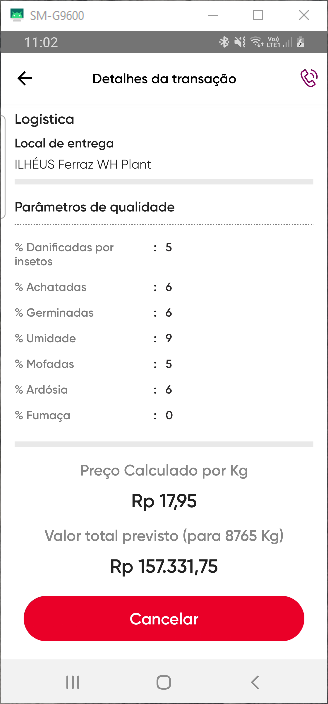

- ### Bottom menu =>
	- {:height 532, :width 240}
	- #### Suggestion
		- There are many items on the bottom. One solution is to insert crop care and farm plan on the hamburger menu.
	- #### Transalations
		- Crop_Doctor: Dr. Plantação.
		- farm_plan: "Planejamento de Plantação" or "Planejamento"
-
	-
- ### On the hamburger menu
	- {:height 532, :width 240}
	- #### Translations:
		- Share with olam: Compartilhe com Olam.
	- {:height 532, :width 240}
	- Others: Outros
	- Deforestation: Denúncia de Desmatamento
	- Child Labour Alert: Denúncia de Trabalho Infantil
- ### Fix Price negotiations
	- {:height 532, :width 240}
	- #### Translations:
		- Fixed Purchase: Preço Fixo
	- {:height 532, :width 240}
	- #### Translations:
		- Fixed Purchase: Preço Fixo
		- Payment on Delivery: Pagamento Mediante Entrega or "Pagamento Após Entrega". Which ever fits better, seams to have space for both options.
		- {:height 532, :width 240}
		- {:height 532, :width 240}
		- #### Translations
			- **Rp** Should be **R$**
-
- ### Profile
	- {:height 532, :width 240}
	- #### Transalations
		- CNPJ ID: CNPJ (no need to ID on the end)
- ### Farm details
	- {:height 532, :width 240}
	- #### Translations
		- ZipCode: CEP
	- {:height 532, :width 240}
	- "Adicionar fazenda": could be -> "Adicionar" If helps with the size of it, or just make the button center and large enough.
	-
- ### Transaction Creation
	- {:height 532, :width 240}
	- #### Correction
		- **R$/sc**: should match the home screen label, should it be **R$/kg**, **R$/@** or **R$/sc**. with corresponding value, this one particularly should be **R$/kg**
		- Rp: R$
		- Fixed Purchase: Preço Fixo
		- Payment on Delivery: "Pagamento Mediante Entrega" or "Pagamento Após Entrega". Which ever fits better, seams to have space for both options.
	- {:height 532, :width 240}
	- On the bottom price **Rp**: **R$**
- ### Share with Olam
	- {:height 532, :width 240}
	- de FeedBack:  da Comunicação (Selecione a categoria da comunicação)
	- Other: Outros
	- Deforestation: Denúncia de Desmatamento
	- Child Labor Alert: Denuncia de Trabalho Infantil
- ### PTBF
	- #### Negotiation Details
		- {:height 532, :width 240}
		- The button does not say anything as it is. should say "Fazer Fixação" "Negociar Fixação" "Vender".
		-
	-