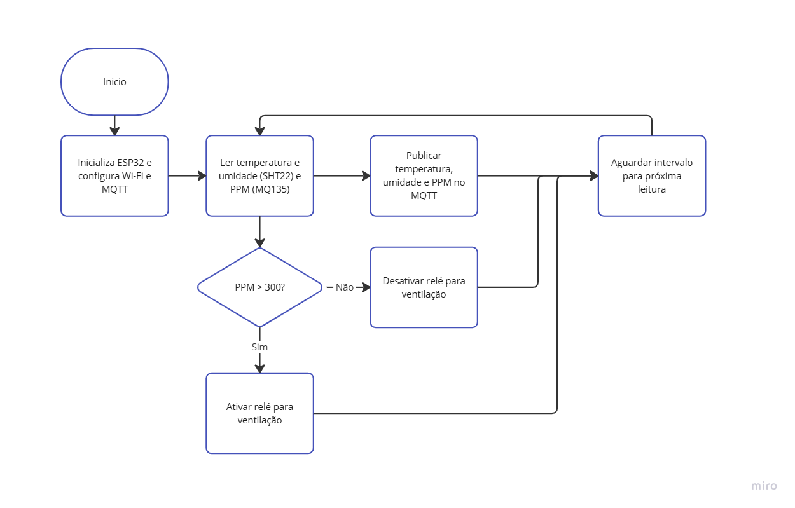
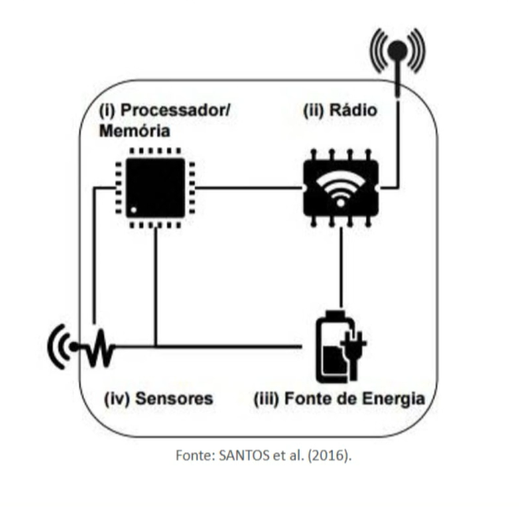
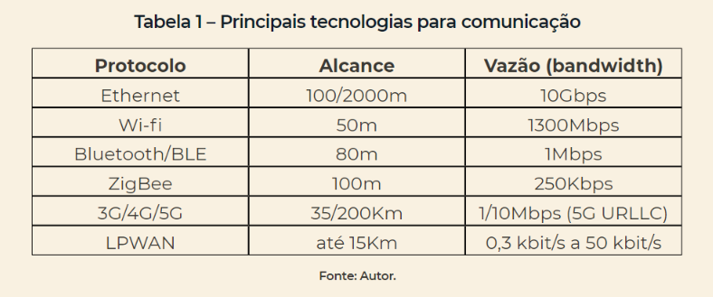

# Project
	- ## Delivery
		- LATER Artigo completo
		- LATER Video de demonstração do funcionamento com MQTT
		- LATER repositório contendo os dados e o código fonte
	- ## Aplicando 3
		- LATER Funcionamento
		- LATER Referencias
		- LATER Descrição de métodos e ferramentas
		- LATER Revisão da plataforma adotada
	- ## Aplicando 4
		- ### Checklist para Revisão do Artigo
		- #### **Seção Materiais e Métodos**
		  collapsed:: true
			- DONE Revisar o modelo de montagem da proposta e descrever detalhadamente o funcionamento do protótipo.
				- DONE Descrever o funcionamento e acionamento dos sensores e atuadores utilizados.
				- DONE Confirmar que há ao menos um atuador e um sensor na solução.
				- DONE Garantir a comunicação com a internet via protocolo MQTT e descrever isso na especificação.
				- https://docs.google.com/document/d/1mEbedlDu141VTB4UWZOdXW-Xolxwd1-u4Dyaxh5GiYM/edit?disco=AAABYyZIMUg
			- DONE Descrever o módulo de comunicação escolhido (ex.: Arduino UNO, NodeMCU).
				- DONE Caso o Arduino UNO seja usado, detalhar a integração com o broker MQTT (incluindo troca de mensagens e conversão de interfaces de comunicação).
				- DONE Se substituir o Arduino por outra plataforma, atualizar o artigo e os diagramas para refletir essa mudança.
			- DONE Atualizar o desenho/diagrama e esquema eletrônico do projeto.
				- DONE Representar o módulo de comunicação nos diagramas (usar software como Fritzing, se necessário).
			- DONE Criar um fluxograma detalhado que represente o funcionamento do protótipo.
			  collapsed:: true
				- DONE Incluir outros diagramas, gráficos, pseudocódigos e informações úteis para a documentação.
				- <iframe width="768" height="432" src="https://miro.com/app/live-embed/uXjVLEfLuM8=/?moveToViewport=1567,-81,1062,679&embedId=840056676435" frameborder="0" scrolling="no" allow="fullscreen; clipboard-read; clipboard-write" allowfullscreen></iframe>
				- 
		- #### **Seção Resultados**
			- DONE Inserir imagens da montagem em funcionamento com descrições detalhadas do que cada imagem representa.
			- LATER Adicionar link para um vídeo-demonstração no YouTube (configurado como não listado).
			  background-color:: red
			  collapsed:: true
				- LATER Garantir que o rosto do aluno esteja visível e que ele se identifique no vídeo.
				- LATER Explicar oralmente o funcionamento do hardware e do código desenvolvido.
				- LATER Demonstrar detalhadamente o funcionamento do projeto com o protocolo MQTT.
			- DONE Medir o tempo médio de resposta:
			  collapsed:: true
				- DONE Entre o envio de comandos e a ação do atuador (quatro medições).
				- DONE Entre a detecção do sensor e o recebimento dos dados no broker MQTT (quatro medições).
				- DONE Preencher a tabela de tempos médios e calcular os valores.
				- LATER Apresentar gráficos com os resultados dessas medições.
			- LATER Inserir gráficos, imagens e capturas de tela que demonstrem o funcionamento do protótipo e a comunicação com o broker MQTT.
			- DONE Inserir link para um repositório no GitHub contendo:
			  collapsed:: true
				- DONE Breve descrição do funcionamento e uso do projeto para reprodução.
				- DONE Software desenvolvido e documentação do código.
				- DONE Descrição detalhada do hardware utilizado (plataformas, sensores, atuadores, peças impressas em 3D, medidas etc.).
				- DONE Documentação das interfaces, protocolos e módulos de comunicação.
				- DONE Comunicação/controle via internet (TCP/IP) e uso do protocolo MQTT.
		- #### **Seção Conclusões**
			- DONE Responder às perguntas no artigo:
			  collapsed:: true
				- DONE Os objetivos propostos foram alcançados?
				- DONE Quais foram os principais problemas enfrentados e como foram resolvidos?
				- DONE Quais são as vantagens e desvantagens do projeto?
				  background-color:: red
				- DONE O que poderia ser feito para melhorar o projeto?
			- #### **Seção Bibliografia/Referências**
			- DONE Atualizar as referências de acordo com as citações no texto.
			- DONE Consultar o manual de trabalhos acadêmicos do Mackenzie, se necessário.
			  
			  ---
			  
			  Com este checklist, você poderá verificar facilmente o que já foi feito e o que ainda precisa ser ajustado.
		-
- # Review
  collapsed:: true
	- LATER Teams Meating 19:00 [[Aug 15th, 2023]]
	  collapsed:: true
		- https://teams.microsoft.com/l/meetup-join/19%3ameeting_ZmM5YzFjYWQtN2Q1Ni00Y2E2LTk0YTItMmU0MjVjYTgyY2Y0%40thread.v2/0?context=%7b%22Tid%22%3a%2251da9440-4e5e-47b3-8e5c-4817f6f43c04%22%2c%22Oid%22%3a%22c7910f38-5019-4919-86ed-50db5dad2acb%22%7d
	- LATER Tema - Desenvolvimento sustentável - Irrigação Automatica
- # Messages
  collapsed:: true
	- ## First requirement and explanations
	  collapsed:: true
		- Olá Pessoal,
		- Vou fazer um breve resumo de como funcionará a dinâmica aqui na disciplina de Objetos Inteligentes Conectados:
		- Ao longo do semestre vocês irão fazer um projeto que deve estar relacionado a ODS 9 da ONU ler a ODS no link a seguir: [[https://brasil.un.org/pt-br/sdgs/9](https://brasil.un.org/pt-br/sdgs/9)].
		- O Projeto pode ser feito INDIVIDUALMENTE ou em DUPLAS.
		- Vocês vão projetar uma solução que atende a ODS 9, para isso vão ter que utilizar uma plataforma de prototipagem + o uso de sensores + Protocolo MQTT (conexão com a internet).
		- Exemplos:
		  • Arduino Uno/Mega/Nano
		  • NodeMCU (ESP8266)
		  • ESP32/ESP32LoraWan.
		  • Raspberry Pi 3 Model B/ Zero
		- Os critérios de avaliação estão disponíveis em Plano de Ensino (Não haverá provas nesta disciplina).
		- Vocês deverão criar um artigo (de acordo com o modelo disponibilizado) e ao longo das entregas incrementando o artigo até que na última entrega o artigo esteja completo, além disso deverão gravar um vídeo de apresentação do projeto (vídeo de até 5 minutos).
		- Em todos os "Aplicando Conhecimento" os requisitos das entregas e do projeto estarão devidamente explicados em detalhes.
		- Att.
		  André Luís de Oliveira
		  Professor-Tutor
	- ## Ideas
	  collapsed:: true
		- ### FIrst Air qualit around the industry
			- Um projeto interessante e relativamente simples que pode ser desenvolvido com o ESP32, alinhado ao ODS 9 e ao tema de IoT (Internet of Things), é um **Sistema de Monitoramento de Qualidade do Ar em Áreas Industriais**.
			- ### Ideia do Projeto:
			  
			  **Sistema de Monitoramento de Qualidade do Ar utilizando ESP32 e Sensores IoT**
			- #### Objetivo:
			  
			  Desenvolver um sistema de baixo custo para monitorar a qualidade do ar em áreas próximas a indústrias, contribuindo para a redução do impacto ambiental e promovendo uma industrialização mais sustentável, conforme os objetivos do ODS 9.
			- #### Componentes Necessários:
			- **ESP32**: Microcontrolador com Wi-Fi e Bluetooth integrados, que servirá como núcleo de processamento e comunicação do sistema.
			- **Sensor de Gás MQ-135**: Sensor para medir a qualidade do ar, especialmente gases nocivos como CO2, NH3, benzeno, etc.
			- **Sensor de Partículas (PM2.5, PM10)**: Para medir partículas finas no ar, que são prejudiciais à saúde.
			- **Display OLED** (opcional): Para mostrar os valores medidos em tempo real.
			- **Conexão Wi-Fi**: Para enviar os dados coletados para um servidor em nuvem ou uma plataforma de IoT, como o Thingspeak ou o Blynk, para visualização remota.
			- **Fonte de Alimentação**: Pode ser uma bateria recarregável para tornar o dispositivo portátil.
			- #### Funcionamento:
			- **Coleta de Dados**: O ESP32 coleta continuamente dados dos sensores de qualidade do ar, como níveis de CO2, partículas suspensas e outros poluentes.
			- **Processamento**: Os dados são processados pelo ESP32 para detectar níveis críticos de poluição.
			- **Envio de Dados**: Utilizando a conexão Wi-Fi do ESP32, os dados são enviados para uma plataforma de IoT (como Thingspeak) onde podem ser visualizados em tempo real em um painel online.
			- **Notificações**: Em caso de níveis críticos de poluição, o sistema pode enviar alertas para smartphones ou exibir notificações via e-mail, utilizando serviços como o IFTTT.
			- **Exibição Local**: Opcionalmente, um display OLED pode ser utilizado para exibir os valores de qualidade do ar localmente, sem a necessidade de conexão com a internet.
			- #### Benefícios do Projeto:
			- **Promover a Sustentabilidade**: Este projeto ajuda a monitorar e controlar a poluição industrial, promovendo uma indústria mais responsável e sustentável.
			- **Inovação com IoT**: Integração de sensores com IoT para criar um sistema inteligente de monitoramento ambiental.
			- **Infraestrutura Resiliente**: Ao permitir o monitoramento constante, o projeto pode ajudar a identificar áreas que necessitam de melhorias na infraestrutura para reduzir a poluição.
			- **Aplicação em Pequena e Média Escala**: Pode ser implementado em pequenas indústrias ou áreas industriais maiores, adaptando-se à necessidade.
			- #### Expansão do Projeto:
			- **Automatização de Respostas**: Com base nos dados coletados, o sistema pode acionar ventiladores ou sistemas de filtragem de ar automaticamente.
			- **Painel de Controle**: Desenvolver um painel de controle mais sofisticado, acessível por mobile e desktop, para visualização dos dados históricos e tomada de decisões.
			- **Integração com Cidades Inteligentes**: Este sistema pode ser integrado com outras infraestruturas urbanas para melhorar a qualidade de vida em áreas urbanas industriais.
			  
			  Este projeto não só é um excelente exemplo de aplicação de IoT, mas também promove a industrialização sustentável e a inovação em conformidade com os objetivos do ODS 9.
	- ### Materials
		- https://www.robocore.net/sensor-gas/modulo-sensor-de-gases-toxicos-mq-135?gad_source=1&gclid=CjwKCAjw59q2BhBOEiwAKc0ijadUoK6qP8Q4ZaNZixUWiKgRg3eTQ-lx9zMYJwcFVUk3ye09PDo29BoCT8EQAvD_BwE
		- https://www.robocore.net/sensor-ambiente/sensor-de-temperatura-e-umidade-dht22
- # Aula 1
  collapsed:: true
	- ## Texto de Apoio
		- 
		- Objetos Inteligentes Conectados
		-
- # Aula 2
  collapsed:: true
	- ## Ponto de Partida
	  collapsed:: true
		- **Embedded Systems**
			- Systems that once programmed and inserted in a object are usually static
			- **microprocessors** -> First to be made, to take the place of the store large computers at the time, is dependent on other components for memory, computer bus, input output units
			- **Microcontrollers** -> All the dispositive are already in a single microcontroller, not dependent of any other components, however it does not counts with the high capability of processing of the microprocessor
			- **Firmware** -> The embeded software is called
		- **Smart Object**
			- 
			- **Memory** usually by relying on a microcontroller, many of the times it counts with increase in memory by using external memory.
			- **Network module**
			-
			-
	- ## Texto de Apoio
		- 
		- 
		-
- # Aula 4
  collapsed:: true
	- https://mackenzie365-my.sharepoint.com/personal/1165694_mackenzie_br/_layouts/15/stream.aspx?id=%2Fpersonal%2F1165694%5Fmackenzie%5Fbr%2FDocuments%2FGrava%C3%A7%C3%B5es%2FObj%20Intelig%20Conectados%5F%20Momento%20com%20o%20Professor%2D20241031%5F190721%2DGrava%C3%A7%C3%A3o%20de%20Reuni%C3%A3o%2Emp4&nav=eyJyZWZlcnJhbEluZm8iOnsicmVmZXJyYWxBcHAiOiJTdHJlYW1XZWJBcHAiLCJyZWZlcnJhbFZpZXciOiJTaGFyZURpYWxvZy1MaW5rIiwicmVmZXJyYWxBcHBQbGF0Zm9ybSI6IldlYiIsInJlZmVycmFsTW9kZSI6InZpZXcifX0&ga=1&referrer=StreamWebApp%2EWeb&referrerScenario=AddressBarCopied%2Eview%2E785321c7%2Db31a%2D4998%2Da495%2Ddae15d33c873
	-