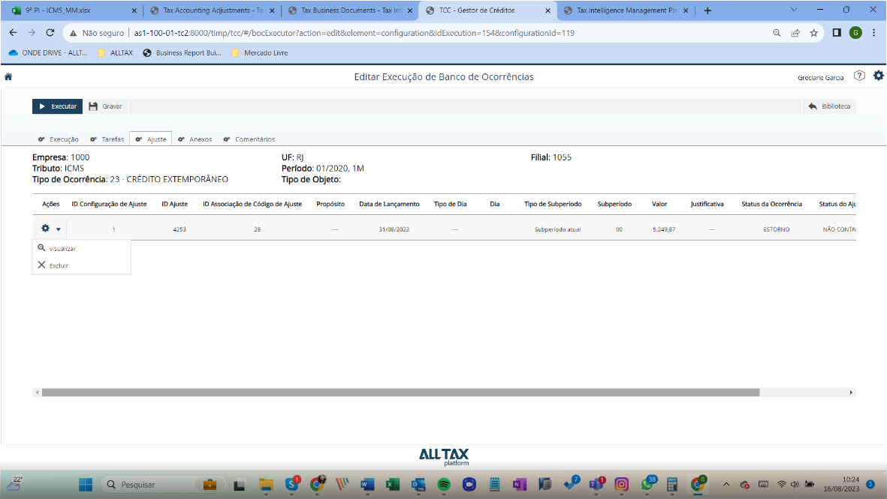
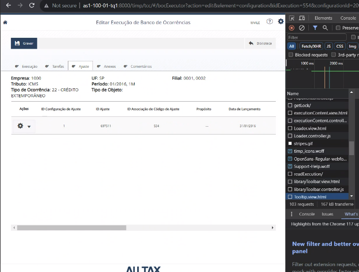
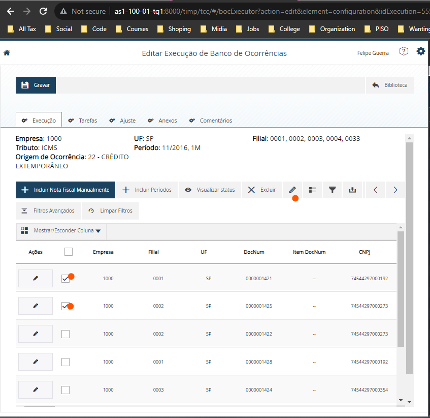

# Detailling
	- 
	- They want a option to reverse | undo the last change instead of only having the possibility of deleting.
	- timp -> tcc -> BANCO DE OCORRENCIAS -> CONFIGURAÇÃO E EXECUÇÃO > ID 209 > Executar
	- **Criar Execução no Banco de Ocorrencia:**
		- http://as1-100-01-tq1:8000/timp/tcc/#/bocExecutor?action=new&element=configuration&configurationId=209
	- **Parâmetros**:
		- EMPRESA: 1000
		- UF: SPFILIAL: 1000
		- TRIBUTO: ICMS
		- ORIGEM DE OCORRÊNCIA: 22- CRÉDITO EXTEMPORÂNEO
		- PERÍODO: 11/2016
		- FLAG DE CENTRALIZAÇÃO DE MOVIMENTO ATIVADO
- # Question
  collapsed:: true
	- For how long the last status should be saved?
		- Just now? cached?
		- Permanently? On DB? Same table, another table only for it.
- # Tracking
  collapsed:: true
	- TCC-> Editar Execução de Banco de Ocorrencia
	- {:height 334, :width 430}
	- DONE From where the Data comes from?
		- Status da ocorrencia
		- Status do ajuste
	- DONE Does the column OCCURRENCE_STATUS_HIERARCHY is user for what?
	- DONE Can we create a column on the table for OCCURRENCE_PREVIOUS_STATUS
	- |Status|Status anterior|
	  |Deferido|-|
	- para nelson castaneda.
		- Achamos as tabelas de onde vem a informação.
		  logseq.order-list-type:: number
		- Vimos que o dev anterior já criou o drop down, contudo a funcionalidade não esta executando corretamente.
		  logseq.order-list-type:: number
		- Para que possamos implementar:
		  logseq.order-list-type:: number
			- Será necessario corrigir dois pequenos problema com a funcionalidade do Botão de "Estornar", pois não retira o ajuste de tela (mesmo com refresh) nem altrera o status para o último status da ocorrencia ou ainda pra o anterior.
			  logseq.order-list-type:: number
			- Desenvolver um modo de armazenar a última STATUS_DA_OCORRENCIA;
			  logseq.order-list-type:: number
				- Ou por criar uma coluna para cada item ( OCCURRENCE_PREVIOUS_STATUS ) e setar o valor do campo para o valor do campo correspondente no momento da mudança. Caso sejá desfeita a mudança íra puxar o valor do campo ( OCCURRENCE_PREVIOUS_STATUS ) e setar o valor para Null.
				  logseq.order-list-type:: number
				- Ou criar uma tabela especifica para isso e realizar um Join em cima do Join já existente na View: CV_BANCODEOCORRENCIAFISCAL_EXECUTADOS.
				  logseq.order-list-type:: number
				- **Qual das duas opções é a melhor?**
				  logseq.order-list-type:: number
			- Além da alteração ou na tabella ou na view teremos que alterar o código para que execute as mudanças no caso de Estorno pelo botão.
			  logseq.order-list-type:: number
- # xhr
	- ## When an adjustment is created on the edit button:
		- **Image**:
		  collapsed:: true
			- 
		- **createAdjustments/**
		  collapsed:: true
			- Url: http://as1-100-01-tq1:8000/timp/tcc/server/endpoint.xsjs/boc/createAdjustments/
			- Payload:
				- [{"idCompany":["1000"],"uf":["SP"],"idBranch":["0001","0002","0003","0004","0033"],"ID":1,"idAdjustment":null,"idAdjustmentAssociation":534,"purpose":null,"postingDate":"2016-11-30T02:00:00.000Z","dayType":null,"day":null,"subperiodType":null,"subperiod":null,"value":"2000.00","justification":null,"occurrenceStatus":"ESTORNADO","year":"2016","month":"11","configurationId":"209","nfIds":[{"id":4311,"created":true},{"id":4312,"created":true}],"execSubperiod":"1M"}]
			- Response:
				- ```json 
				  [
				      {
				          "prevId": 1,
				          "id": "697888",
				          "status": "A01",
				          "year": "2016",
				          "month": "11",
				          "descPadrao": "Cent. saldos Devedor - Origem",
				          "xmlSent": "<tmf:FIPostingPost><BusinessPlace><MandtTDF>300</MandtTDF><CompanyCode>1000</CompanyCode><Branch>0033</Branch></BusinessPlace><FIPostingHeaderData><OBJ_KEY>A0197</OBJ_KEY><OBJ_TYPE>BKPFF</OBJ_TYPE><OBJ_SYS>TD3</OBJ_SYS><USERNAME>MCHAV</USERNAME><HEADER_TXT>Cent. saldos Devedor - Origem</HEADER_TXT><OBJ_KEY_R></OBJ_KEY_R><COMP_CODE>1000</COMP_CODE><AC_DOC_NO></AC_DOC_NO><FISC_YEAR>2016</FISC_YEAR><DOC_DATE>20161130</DOC_DATE><PSTNG_DATE>20161130</PSTNG_DATE><TRANS_DATE>20161130</TRANS_DATE><FIS_PERIOD>2016/11</FIS_PERIOD><DOC_TYPE>SA</DOC_TYPE><REF_DOC_NO></REF_DOC_NO><COMPO_ACC></COMPO_ACC><REASON_REV></REASON_REV><REF_DOC_NO_LONG></REF_DOC_NO_LONG><ACC_PRINCIPLE></ACC_PRINCIPLE><DOC_STATUS></DOC_STATUS></FIPostingHeaderData><FIPostingItemData><ItemsTable><ITEMNO_ACC>001</ITEMNO_ACC><GL_ACCOUNT>0021401002</GL_ACCOUNT><COMP_CODE>1000</COMP_CODE><PSTNG_DATE>20161130</PSTNG_DATE><DOC_TYPE></DOC_TYPE><AC_DOC_NO></AC_DOC_NO><FISC_YEAR>2016</FISC_YEAR><FIS_PERIOD>2016/11</FIS_PERIOD><STAT_CON></STAT_CON><REF_KEY_1></REF_KEY_1><REF_KEY_2></REF_KEY_2><REF_KEY_3></REF_KEY_3><CUSTOMER></CUSTOMER><VENDOR_NO></VENDOR_NO><ALLOC_NMBR></ALLOC_NMBR><ITEM_TEXT>Cent. saldos Devedor - Origem</ITEM_TEXT><BUS_AREA></BUS_AREA><COSTCENTER></COSTCENTER><ACTTYPE></ACTTYPE><ORDERID></ORDERID><ORIG_GROUP></ORIG_GROUP><COST_OBJ></COST_OBJ><PROFIT_CTR></PROFIT_CTR><PART_PRCTR></PART_PRCTR><WBS_ELEMENT></WBS_ELEMENT><NETWORK></NETWORK><ROUTING_NO></ROUTING_NO><ORDER_ITNO></ORDER_ITNO><ACTIVITY></ACTIVITY><PLANT></PLANT><SALES_ORD></SALES_ORD><S_ORD_ITEM></S_ORD_ITEM><SEGMENT></SEGMENT><PARTNER_SEGMENT></PARTNER_SEGMENT><MATERIAL></MATERIAL><CS_TRANS_T></CS_TRANS_T></ItemsTable><ItemsTable><ITEMNO_ACC>002</ITEMNO_ACC><GL_ACCOUNT>0011309002</GL_ACCOUNT><COMP_CODE>1000</COMP_CODE><PSTNG_DATE>20161130</PSTNG_DATE><DOC_TYPE></DOC_TYPE><AC_DOC_NO></AC_DOC_NO><FISC_YEAR>2016</FISC_YEAR><FIS_PERIOD>2016/11</FIS_PERIOD><STAT_CON></STAT_CON><REF_KEY_1></REF_KEY_1><REF_KEY_2></REF_KEY_2><REF_KEY_3></REF_KEY_3><CUSTOMER></CUSTOMER><VENDOR_NO></VENDOR_NO><ALLOC_NMBR></ALLOC_NMBR><ITEM_TEXT>Cent. saldos Devedor - Origem</ITEM_TEXT><BUS_AREA></BUS_AREA><COSTCENTER></COSTCENTER><ACTTYPE></ACTTYPE><ORDERID></ORDERID><ORIG_GROUP></ORIG_GROUP><COST_OBJ></COST_OBJ><PROFIT_CTR></PROFIT_CTR><PART_PRCTR></PART_PRCTR><WBS_ELEMENT></WBS_ELEMENT><NETWORK></NETWORK><ROUTING_NO></ROUTING_NO><ORDER_ITNO></ORDER_ITNO><ACTIVITY></ACTIVITY><PLANT></PLANT><SALES_ORD></SALES_ORD><S_ORD_ITEM></S_ORD_ITEM><SEGMENT></SEGMENT><PARTNER_SEGMENT></PARTNER_SEGMENT><MATERIAL></MATERIAL><CS_TRANS_T></CS_TRANS_T></ItemsTable></FIPostingItemData><FIPostingVendorData/><FIPostingCustomerData/><FIPostingCurrency><CurrencyTable><ITEMNO_ACC>001</ITEMNO_ACC><CURR_TYPE></CURR_TYPE><CURRENCY>BRL</CURRENCY><CURRENCY_ISO>BRL</CURRENCY_ISO><AMT_DOCCUR>2000.00</AMT_DOCCUR><EXCH_RATE></EXCH_RATE><EXCH_RATE_V></EXCH_RATE_V><AMT_BASE></AMT_BASE><DISC_BASE></DISC_BASE><DISC_AMT></DISC_AMT><TAX_AMT></TAX_AMT></CurrencyTable><CurrencyTable><ITEMNO_ACC>002</ITEMNO_ACC><CURR_TYPE></CURR_TYPE><CURRENCY>BRL</CURRENCY><CURRENCY_ISO>BRL</CURRENCY_ISO><AMT_DOCCUR>-2000</AMT_DOCCUR><EXCH_RATE></EXCH_RATE><EXCH_RATE_V></EXCH_RATE_V><AMT_BASE></AMT_BASE><DISC_BASE></DISC_BASE><DISC_AMT></DISC_AMT><TAX_AMT></TAX_AMT></CurrencyTable></FIPostingCurrency><Check><Check></Check></Check><FIPostingExtension2><Extension2Table><STRUCTURE>BUPLA</STRUCTURE><VALUEPART1>0000000001</VALUEPART1><VALUEPART2>0033</VALUEPART2><VALUEPART3></VALUEPART3><VALUEPART4></VALUEPART4></Extension2Table><Extension2Table><STRUCTURE>BUPLA</STRUCTURE><VALUEPART1>0000000002</VALUEPART1><VALUEPART2>0033</VALUEPART2><VALUEPART3></VALUEPART3><VALUEPART4></VALUEPART4></Extension2Table></FIPostingExtension2></tmf:FIPostingPost>",
				          "xmlResp": "<soap-env:Envelope xmlns:soap-env=\"http://schemas.xmlsoap.org/soap/envelope/\"><soap-env:Header/><soap-env:Body><soap-env:Fault><faultcode>soap-env:Client</faultcode><faultstring xml:lang=\"en\">Application exception occurred!</faultstring><detail><n0:FIPostingFault xmlns:n0=\"http://sap.com/xi/TMFLOCBR\" xmlns:prx=\"urn:sap.com:proxy:TD3:/1SAI/TAS698CAE7DB70C859D4C3C:750\"><standard><faultText>RFC destination not found; contact system administrator</faultText></standard></n0:FIPostingFault></detail></soap-env:Fault></soap-env:Body></soap-env:Envelope>"
				      }
				  ]
				  ```
		- **updateExecution/**
		  collapsed:: true
			- Url: http://as1-100-01-tq1:8000/timp/tcc/server/endpoint.xsjs/boc/updateExecution/
			- Payload:
			  collapsed:: true
				- {"configurationId":"209","taxCode":"00","month":"11","year":"2016","subperiod":"1M","branches":["1000_SP_0001","1000_SP_0002","1000_SP_0003","1000_SP_0004","1000_SP_0033"],"occurrenceOriginId":22,"occurrenceOriginDescription":"","nf":[{"id":4311,"ID":4311,"idExecution":555,"nfId":"0000001421","occurrenceId":3994,"empresa":"1000","ufFilial":"SP","filial":"0001","vlDesIcms":null,"codNat":"1111AA","vlTotalDocumento":1000,"series":"","emissionDate":"18/11/2016","cnpj":"74544297000192","valueDecimal":"","occurrenceStatus":"11","occurrenceStatusHierarchy":"I","isManual":0,"authorizedPlots":"","chargebackFactorValue":0,"idEccDocument":"--","prctr":"--","blart":"--","zounr":"--","xblnr":"--","sgtxt":"--","wrbtr":"--","budat":"--","bldat":"--","usnam":"--","hkont":"--","created":true,"netCreditAmount":1000,"numItem":null,"lastOccurrenceStatus":null,"lastOccurrenceStatusHierarchy":null,"statusModificationDate":"2023-09-28T13:02:31.422Z","count":0,"processNumber":"","protocolCommunicationNumber":"","requestProtocolNumber":"","defermentNumber":"","refusalNumber":"","justification":"","creditOrigin":"","di":"","undueReason":"","externalLetter":"","restatementValue":0,"jurNumberPjur":"","defermentValue":0,"rejectedValue":0,"isManualChargebackFactor":0},{"id":4312,"ID":4312,"idExecution":555,"nfId":"0000001425","occurrenceId":3995,"empresa":"1000","ufFilial":"SP","filial":"0002","vlDesIcms":null,"codNat":"1111AA","vlTotalDocumento":1000,"series":"","emissionDate":"22/11/2016","cnpj":"74544297000273","valueDecimal":"","occurrenceStatus":"11","occurrenceStatusHierarchy":"I","isManual":0,"authorizedPlots":"","chargebackFactorValue":0,"idEccDocument":"--","prctr":"--","blart":"--","zounr":"--","xblnr":"--","sgtxt":"--","wrbtr":"--","budat":"--","bldat":"--","usnam":"--","hkont":"--","created":true,"netCreditAmount":1000,"numItem":null,"lastOccurrenceStatus":null,"lastOccurrenceStatusHierarchy":null,"statusModificationDate":"2023-09-28T13:02:31.422Z","count":0,"processNumber":"","protocolCommunicationNumber":"","requestProtocolNumber":"","defermentNumber":"","refusalNumber":"","justification":"","creditOrigin":"","di":"","undueReason":"","externalLetter":"","restatementValue":0,"jurNumberPjur":"","defermentValue":0,"rejectedValue":0,"isManualChargebackFactor":0},{"id":4313,"ID":4313,"idExecution":555,"nfId":"0000001422","occurrenceId":3996,"empresa":"1000","ufFilial":"SP","filial":"0002","vlDesIcms":null,"codNat":"1111AA","vlTotalDocumento":1000,"series":"","emissionDate":"20/11/2016","cnpj":"74544297000273","valueDecimal":"","occurrenceStatus":null,"occurrenceStatusHierarchy":null,"isManual":0,"authorizedPlots":null,"chargebackFactorValue":"21.11","idEccDocument":"--","prctr":"--","blart":"--","zounr":"--","xblnr":"--","sgtxt":"--","wrbtr":"--","budat":"--","bldat":"--","usnam":"--","hkont":"--","created":true,"netCreditAmount":788.9000000000001,"numItem":null,"lastOccurrenceStatus":null,"lastOccurrenceStatusHierarchy":null,"statusModificationDate":"20/11/2016"},{"id":4314,"ID":4314,"idExecution":555,"nfId":"0000001428","occurrenceId":3997,"empresa":"1000","ufFilial":"SP","filial":"0001","vlDesIcms":null,"codNat":"9999AA","vlTotalDocumento":1000,"series":"","emissionDate":"15/11/2016","cnpj":"74544297000192","valueDecimal":"","occurrenceStatus":null,"occurrenceStatusHierarchy":null,"isManual":0,"authorizedPlots":null,"chargebackFactorValue":"30.00","idEccDocument":"--","prctr":"--","blart":"--","zounr":"--","xblnr":"--","sgtxt":"--","wrbtr":"--","budat":"--","bldat":"--","usnam":"--","hkont":"--","created":true,"netCreditAmount":700,"numItem":null,"lastOccurrenceStatus":null,"lastOccurrenceStatusHierarchy":null,"statusModificationDate":"15/11/2016"},{"id":4315,"ID":4315,"idExecution":555,"nfId":"0000001424","occurrenceId":3998,"empresa":"1000","ufFilial":"SP","filial":"0003","vlDesIcms":null,"codNat":"1111AA","vlTotalDocumento":1000,"series":"","emissionDate":"19/11/2016","cnpj":"74544297000354","valueDecimal":"","occurrenceStatus":null,"occurrenceStatusHierarchy":null,"isManual":0,"authorizedPlots":null,"idEccDocument":"--","prctr":"--","blart":"--","zounr":"--","xblnr":"--","sgtxt":"--","wrbtr":"--","budat":"--","bldat":"--","usnam":"--","hkont":"--","created":true,"netCreditAmount":1000,"numItem":null,"lastOccurrenceStatus":null,"lastOccurrenceStatusHierarchy":null,"statusModificationDate":"19/11/2016"},{"id":4316,"ID":4316,"idExecution":555,"nfId":"0000001423","occurrenceId":3999,"empresa":"1000","ufFilial":"SP","filial":"0003","vlDesIcms":null,"codNat":"1111AA","vlTotalDocumento":1000,"series":"","emissionDate":"22/11/2016","cnpj":"74544297000354","valueDecimal":"","occurrenceStatus":null,"occurrenceStatusHierarchy":null,"isManual":0,"authorizedPlots":null,"idEccDocument":"--","prctr":"--","blart":"--","zounr":"--","xblnr":"--","sgtxt":"--","wrbtr":"--","budat":"--","bldat":"--","usnam":"--","hkont":"--","created":true,"netCreditAmount":1000,"numItem":null,"lastOccurrenceStatus":null,"lastOccurrenceStatusHierarchy":null,"statusModificationDate":"22/11/2016"}],"variants":{"nf":[],"occurrenceStatus":[]},"tasks":[],"adjustmentConfigurations":"[{\"idCompany\":[\"1000\"],\"uf\":[\"SP\"],\"idBranch\":[\"0001\",\"0002\",\"0003\",\"0004\",\"0033\"],\"ID\":1,\"idAdjustment\":\"697888\",\"idAdjustmentAssociation\":534,\"purpose\":null,\"postingDate\":\"2016-11-30T02:00:00.000Z\",\"dayType\":null,\"day\":null,\"subperiodType\":null,\"subperiod\":null,\"value\":\"2000.00\",\"justification\":null,\"occurrenceStatus\":\"ESTORNADO\",\"status\":\"A01\",\"year\":\"2016\",\"month\":\"11\",\"configurationId\":\"209\",\"nfIds\":[{\"id\":4311,\"created\":true},{\"id\":4312,\"created\":true}],\"execSubperiod\":\"1M\"}]","comments":[],"commentsToDelete":[],"idBocStatusMdr":24,"id":"555"}
			- Response:
			  collapsed:: true
				- ```json 
				  {
				      "createdOccurrenceStatus": [],
				      "createdNfs": [],
				      "deletedNfs": [],
				      "updatedNf": [
				          {
				              "id": 4311,
				              "ID": 4311,
				              "idExecution": 555,
				              "nfId": "0000001421",
				              "occurrenceId": 3994,
				              "empresa": "1000",
				              "ufFilial": "SP",
				              "filial": "0001",
				              "vlDesIcms": null,
				              "codNat": "1111AA",
				              "vlTotalDocumento": 1000,
				              "series": "",
				              "emissionDate": "18/11/2016",
				              "cnpj": "74544297000192",
				              "valueDecimal": "",
				              "occurrenceStatus": "11",
				              "occurrenceStatusHierarchy": "I",
				              "isManual": 0,
				              "authorizedPlots": "",
				              "chargebackFactorValue": 0,
				              "idEccDocument": "--",
				              "prctr": "--",
				              "blart": "--",
				              "zounr": "--",
				              "xblnr": "--",
				              "sgtxt": "--",
				              "wrbtr": "--",
				              "budat": "--",
				              "bldat": "--",
				              "usnam": "--",
				              "hkont": "--",
				              "created": true,
				              "netCreditAmount": 1000,
				              "numItem": null,
				              "lastOccurrenceStatus": null,
				              "lastOccurrenceStatusHierarchy": null,
				              "statusModificationDate": "2023-09-28T13:02:31.422Z",
				              "count": 0,
				              "processNumber": "",
				              "protocolCommunicationNumber": "",
				              "requestProtocolNumber": "",
				              "defermentNumber": "",
				              "refusalNumber": "",
				              "justification": "",
				              "creditOrigin": "",
				              "di": "",
				              "undueReason": "",
				              "externalLetter": "",
				              "restatementValue": 0,
				              "jurNumberPjur": "",
				              "defermentValue": 0,
				              "rejectedValue": 0,
				              "isManualChargebackFactor": 0
				          },
				          {
				              "id": 4312,
				              "ID": 4312,
				              "idExecution": 555,
				              "nfId": "0000001425",
				              "occurrenceId": 3995,
				              "empresa": "1000",
				              "ufFilial": "SP",
				              "filial": "0002",
				              "vlDesIcms": null,
				              "codNat": "1111AA",
				              "vlTotalDocumento": 1000,
				              "series": "",
				              "emissionDate": "22/11/2016",
				              "cnpj": "74544297000273",
				              "valueDecimal": "",
				              "occurrenceStatus": "11",
				              "occurrenceStatusHierarchy": "I",
				              "isManual": 0,
				              "authorizedPlots": "",
				              "chargebackFactorValue": 0,
				              "idEccDocument": "--",
				              "prctr": "--",
				              "blart": "--",
				              "zounr": "--",
				              "xblnr": "--",
				              "sgtxt": "--",
				              "wrbtr": "--",
				              "budat": "--",
				              "bldat": "--",
				              "usnam": "--",
				              "hkont": "--",
				              "created": true,
				              "netCreditAmount": 1000,
				              "numItem": null,
				              "lastOccurrenceStatus": null,
				              "lastOccurrenceStatusHierarchy": null,
				              "statusModificationDate": "2023-09-28T13:02:31.422Z",
				              "count": 0,
				              "processNumber": "",
				              "protocolCommunicationNumber": "",
				              "requestProtocolNumber": "",
				              "defermentNumber": "",
				              "refusalNumber": "",
				              "justification": "",
				              "creditOrigin": "",
				              "di": "",
				              "undueReason": "",
				              "externalLetter": "",
				              "restatementValue": 0,
				              "jurNumberPjur": "",
				              "defermentValue": 0,
				              "rejectedValue": 0,
				              "isManualChargebackFactor": 0
				          },
				          {
				              "id": 4313,
				              "ID": 4313,
				              "idExecution": 555,
				              "nfId": "0000001422",
				              "occurrenceId": 3996,
				              "empresa": "1000",
				              "ufFilial": "SP",
				              "filial": "0002",
				              "vlDesIcms": null,
				              "codNat": "1111AA",
				              "vlTotalDocumento": 1000,
				              "series": "",
				              "emissionDate": "20/11/2016",
				              "cnpj": "74544297000273",
				              "valueDecimal": "",
				              "occurrenceStatusHierarchy": null,
				              "isManual": 0,
				              "authorizedPlots": null,
				              "chargebackFactorValue": "21.11",
				              "idEccDocument": "--",
				              "prctr": "--",
				              "blart": "--",
				              "zounr": "--",
				              "xblnr": "--",
				              "sgtxt": "--",
				              "wrbtr": "--",
				              "budat": "--",
				              "bldat": "--",
				              "usnam": "--",
				              "hkont": "--",
				              "created": true,
				              "netCreditAmount": 788.9000000000001,
				              "numItem": null,
				              "lastOccurrenceStatus": null,
				              "lastOccurrenceStatusHierarchy": null,
				              "statusModificationDate": "20/11/2016"
				          },
				          {
				              "id": 4314,
				              "ID": 4314,
				              "idExecution": 555,
				              "nfId": "0000001428",
				              "occurrenceId": 3997,
				              "empresa": "1000",
				              "ufFilial": "SP",
				              "filial": "0001",
				              "vlDesIcms": null,
				              "codNat": "9999AA",
				              "vlTotalDocumento": 1000,
				              "series": "",
				              "emissionDate": "15/11/2016",
				              "cnpj": "74544297000192",
				              "valueDecimal": "",
				              "occurrenceStatusHierarchy": null,
				              "isManual": 0,
				              "authorizedPlots": null,
				              "chargebackFactorValue": "30.00",
				              "idEccDocument": "--",
				              "prctr": "--",
				              "blart": "--",
				              "zounr": "--",
				              "xblnr": "--",
				              "sgtxt": "--",
				              "wrbtr": "--",
				              "budat": "--",
				              "bldat": "--",
				              "usnam": "--",
				              "hkont": "--",
				              "created": true,
				              "netCreditAmount": 700,
				              "numItem": null,
				              "lastOccurrenceStatus": null,
				              "lastOccurrenceStatusHierarchy": null,
				              "statusModificationDate": "15/11/2016"
				          },
				          {
				              "id": 4315,
				              "ID": 4315,
				              "idExecution": 555,
				              "nfId": "0000001424",
				              "occurrenceId": 3998,
				              "empresa": "1000",
				              "ufFilial": "SP",
				              "filial": "0003",
				              "vlDesIcms": null,
				              "codNat": "1111AA",
				              "vlTotalDocumento": 1000,
				              "series": "",
				              "emissionDate": "19/11/2016",
				              "cnpj": "74544297000354",
				              "valueDecimal": "",
				              "occurrenceStatusHierarchy": null,
				              "isManual": 0,
				              "authorizedPlots": null,
				              "idEccDocument": "--",
				              "prctr": "--",
				              "blart": "--",
				              "zounr": "--",
				              "xblnr": "--",
				              "sgtxt": "--",
				              "wrbtr": "--",
				              "budat": "--",
				              "bldat": "--",
				              "usnam": "--",
				              "hkont": "--",
				              "created": true,
				              "netCreditAmount": 1000,
				              "numItem": null,
				              "lastOccurrenceStatus": null,
				              "lastOccurrenceStatusHierarchy": null,
				              "statusModificationDate": "19/11/2016"
				          },
				          {
				              "id": 4316,
				              "ID": 4316,
				              "idExecution": 555,
				              "nfId": "0000001423",
				              "occurrenceId": 3999,
				              "empresa": "1000",
				              "ufFilial": "SP",
				              "filial": "0003",
				              "vlDesIcms": null,
				              "codNat": "1111AA",
				              "vlTotalDocumento": 1000,
				              "series": "",
				              "emissionDate": "22/11/2016",
				              "cnpj": "74544297000354",
				              "valueDecimal": "",
				              "occurrenceStatusHierarchy": null,
				              "isManual": 0,
				              "authorizedPlots": null,
				              "idEccDocument": "--",
				              "prctr": "--",
				              "blart": "--",
				              "zounr": "--",
				              "xblnr": "--",
				              "sgtxt": "--",
				              "wrbtr": "--",
				              "budat": "--",
				              "bldat": "--",
				              "usnam": "--",
				              "hkont": "--",
				              "created": true,
				              "netCreditAmount": 1000,
				              "numItem": null,
				              "lastOccurrenceStatus": null,
				              "lastOccurrenceStatusHierarchy": null,
				              "statusModificationDate": "22/11/2016"
				          }
				      ],
				      "occurrenceStatusMap": {},
				      "updatedExecution": true,
				      "deletedEEF": []
				  }
				  ```
		- **updateExecutionHistory/**
		  collapsed:: true
			- Url: http://as1-100-01-tq1:8000/timp/tcc/server/endpoint.xsjs/boc/updateExecutionHistory/
			- Payload:
				- object: {"id":"555"}
				- note: ID of the adjustment created
			- Response:
				- ```json 
				  {"created":true,"updated":true}
				  ```
	- # Banco de Ocorrencia -> Executados
		- **UpdateExecution/**
		  collapsed:: true
			- URL: http://as1-100-01-tq1:8000/timp/tcc/server/endpoint.xsjs/boc/updateExecution/
			- Payload:
			  collapsed:: true
				- {"configurationId":"209","taxCode":"00","month":"11","year":"2016","subperiod":"1M","branches":["1000_SP_0001","1000_SP_0002","1000_SP_0003","1000_SP_0004","1000_SP_0033"],"occurrenceOriginId":22,"occurrenceOriginDescription":"","nf":[{"id":4311,"ID":4311,"idExecution":555,"nfId":"0000001421","occurrenceId":3994,"empresa":"1000","ufFilial":"SP","filial":"0001","vlDesIcms":null,"codNat":"1111AA","vlTotalDocumento":1000,"series":"","emissionDate":"18/11/2016","cnpj":"74544297000192","valueDecimal":"","occurrenceStatus":"11","occurrenceStatusHierarchy":"I","isManual":0,"authorizedPlots":"","statusModificationDate":"Thu Sep 28 2023","idEccDocument":"--","prctr":"--","blart":"--","zounr":"--","xblnr":"--","sgtxt":"--","wrbtr":"--","budat":"--","bldat":"--","usnam":"--","hkont":"--","created":true,"netCreditAmount":1000,"numItem":null,"lastOccurrenceStatus":null,"lastOccurrenceStatusHierarchy":null,"chargebackFactorValue":0,"count":0,"processNumber":"","protocolCommunicationNumber":"","requestProtocolNumber":"","defermentNumber":"","refusalNumber":"","justification":"","creditOrigin":"","di":"","undueReason":"","externalLetter":"","restatementValue":0,"jurNumberPjur":"","defermentValue":0,"rejectedValue":0,"isManualChargebackFactor":0},{"id":4312,"ID":4312,"idExecution":555,"nfId":"0000001425","occurrenceId":3995,"empresa":"1000","ufFilial":"SP","filial":"0002","vlDesIcms":null,"codNat":"1111AA","vlTotalDocumento":1000,"series":"","emissionDate":"22/11/2016","cnpj":"74544297000273","valueDecimal":"","occurrenceStatus":"11","occurrenceStatusHierarchy":"I","isManual":0,"authorizedPlots":"","statusModificationDate":"Thu Sep 28 2023","idEccDocument":"--","prctr":"--","blart":"--","zounr":"--","xblnr":"--","sgtxt":"--","wrbtr":"--","budat":"--","bldat":"--","usnam":"--","hkont":"--","created":true,"netCreditAmount":1000,"numItem":null,"lastOccurrenceStatus":null,"lastOccurrenceStatusHierarchy":null,"chargebackFactorValue":0,"count":0,"processNumber":"","protocolCommunicationNumber":"","requestProtocolNumber":"","defermentNumber":"","refusalNumber":"","justification":"","creditOrigin":"","di":"","undueReason":"","externalLetter":"","restatementValue":0,"jurNumberPjur":"","defermentValue":0,"rejectedValue":0,"isManualChargebackFactor":0},{"id":4313,"ID":4313,"idExecution":555,"nfId":"0000001422","occurrenceId":3996,"empresa":"1000","ufFilial":"SP","filial":"0002","vlDesIcms":null,"codNat":"1111AA","vlTotalDocumento":1000,"series":"","emissionDate":"20/11/2016","cnpj":"74544297000273","valueDecimal":"","occurrenceStatus":null,"occurrenceStatusHierarchy":null,"isManual":0,"authorizedPlots":null,"statusModificationDate":"Fri Aug 11 2017","chargebackFactorValue":"21.11","idEccDocument":"--","prctr":"--","blart":"--","zounr":"--","xblnr":"--","sgtxt":"--","wrbtr":"--","budat":"--","bldat":"--","usnam":"--","hkont":"--","created":true,"netCreditAmount":788.9000000000001,"numItem":null,"lastOccurrenceStatus":null,"lastOccurrenceStatusHierarchy":null},{"id":4314,"ID":4314,"idExecution":555,"nfId":"0000001428","occurrenceId":3997,"empresa":"1000","ufFilial":"SP","filial":"0001","vlDesIcms":null,"codNat":"9999AA","vlTotalDocumento":1000,"series":"","emissionDate":"15/11/2016","cnpj":"74544297000192","valueDecimal":"","occurrenceStatus":null,"occurrenceStatusHierarchy":null,"isManual":0,"authorizedPlots":null,"statusModificationDate":"Sat Mar 11 2017","chargebackFactorValue":"30.00","idEccDocument":"--","prctr":"--","blart":"--","zounr":"--","xblnr":"--","sgtxt":"--","wrbtr":"--","budat":"--","bldat":"--","usnam":"--","hkont":"--","created":true,"netCreditAmount":700,"numItem":null,"lastOccurrenceStatus":null,"lastOccurrenceStatusHierarchy":null},{"id":4315,"ID":4315,"idExecution":555,"nfId":"0000001424","occurrenceId":3998,"empresa":"1000","ufFilial":"SP","filial":"0003","vlDesIcms":null,"codNat":"1111AA","vlTotalDocumento":1000,"series":"","emissionDate":"19/11/2016","cnpj":"74544297000354","valueDecimal":"","occurrenceStatus":null,"occurrenceStatusHierarchy":null,"isManual":0,"authorizedPlots":null,"statusModificationDate":"Tue Jul 11 2017","idEccDocument":"--","prctr":"--","blart":"--","zounr":"--","xblnr":"--","sgtxt":"--","wrbtr":"--","budat":"--","bldat":"--","usnam":"--","hkont":"--","created":true,"netCreditAmount":1000,"numItem":null,"lastOccurrenceStatus":null,"lastOccurrenceStatusHierarchy":null},{"id":4316,"ID":4316,"idExecution":555,"nfId":"0000001423","occurrenceId":3999,"empresa":"1000","ufFilial":"SP","filial":"0003","vlDesIcms":null,"codNat":"1111AA","vlTotalDocumento":1000,"series":"","emissionDate":"22/11/2016","cnpj":"74544297000354","valueDecimal":"","occurrenceStatus":null,"occurrenceStatusHierarchy":null,"isManual":0,"authorizedPlots":null,"statusModificationDate":"Wed Oct 11 2017","idEccDocument":"--","prctr":"--","blart":"--","zounr":"--","xblnr":"--","sgtxt":"--","wrbtr":"--","budat":"--","bldat":"--","usnam":"--","hkont":"--","created":true,"netCreditAmount":1000,"numItem":null,"lastOccurrenceStatus":null,"lastOccurrenceStatusHierarchy":null}],"variants":{"nf":[],"occurrenceStatus":[]},"tasks":[],"adjustmentConfigurations":"[{\"idCompany\":[\"1000\"],\"uf\":[\"SP\"],\"idBranch\":[\"0001\",\"0002\",\"0003\",\"0004\",\"0033\"],\"ID\":1,\"idAdjustment\":\"697888\",\"idAdjustmentAssociation\":534,\"purpose\":null,\"postingDate\":\"2016-11-30T02:00:00.000Z\",\"dayType\":null,\"day\":null,\"subperiodType\":null,\"subperiod\":null,\"value\":\"2000.00\",\"justification\":null,\"occurrenceStatus\":\"ESTORNADO\",\"status\":\"A01\",\"year\":\"2016\",\"month\":\"11\",\"configurationId\":\"209\",\"nfIds\":[{\"id\":4311,\"created\":true},{\"id\":4312,\"created\":true}],\"execSubperiod\":\"1M\",\"adjustmentData\":{\"idEccDocument\":null,\"postingDataNF\":{\"idDadosLanc\":697888,\"blart\":null,\"belnr\":null,\"bldat\":null,\"budat\":null,\"xblnr\":null,\"usnam\":null,\"bschl\":null,\"wrbtr\":null,\"zuonr\":null,\"sgtxt\":null,\"hkont\":null,\"prctr\":null,\"status\":\"A01\",\"brLabel\":\"PENDENTE\",\"usLabel\":\"PENDING\"}}}]","comments":[],"commentsToDelete":[],"idBocStatusMdr":24,"id":"555"}
			- Response:
			  collapsed:: true
				- ```json 
				  {
				      "createdOccurrenceStatus": [],
				      "createdNfs": [],
				      "deletedNfs": [],
				      "updatedNf": [
				          {
				              "id": 4311,
				              "ID": 4311,
				              "idExecution": 555,
				              "nfId": "0000001421",
				              "occurrenceId": 3994,
				              "empresa": "1000",
				              "ufFilial": "SP",
				              "filial": "0001",
				              "vlDesIcms": null,
				              "codNat": "1111AA",
				              "vlTotalDocumento": 1000,
				              "series": "",
				              "emissionDate": "18/11/2016",
				              "cnpj": "74544297000192",
				              "valueDecimal": "",
				              "occurrenceStatus": "11",
				              "occurrenceStatusHierarchy": "I",
				              "isManual": 0,
				              "authorizedPlots": "",
				              "statusModificationDate": "Thu Sep 28 2023",
				              "idEccDocument": "--",
				              "prctr": "--",
				              "blart": "--",
				              "zounr": "--",
				              "xblnr": "--",
				              "sgtxt": "--",
				              "wrbtr": "--",
				              "budat": "--",
				              "bldat": "--",
				              "usnam": "--",
				              "hkont": "--",
				              "created": true,
				              "netCreditAmount": 1000,
				              "numItem": null,
				              "lastOccurrenceStatus": null,
				              "lastOccurrenceStatusHierarchy": null,
				              "chargebackFactorValue": 0,
				              "count": 0,
				              "processNumber": "",
				              "protocolCommunicationNumber": "",
				              "requestProtocolNumber": "",
				              "defermentNumber": "",
				              "refusalNumber": "",
				              "justification": "",
				              "creditOrigin": "",
				              "di": "",
				              "undueReason": "",
				              "externalLetter": "",
				              "restatementValue": 0,
				              "jurNumberPjur": "",
				              "defermentValue": 0,
				              "rejectedValue": 0,
				              "isManualChargebackFactor": 0
				          },
				          {
				              "id": 4312,
				              "ID": 4312,
				              "idExecution": 555,
				              "nfId": "0000001425",
				              "occurrenceId": 3995,
				              "empresa": "1000",
				              "ufFilial": "SP",
				              "filial": "0002",
				              "vlDesIcms": null,
				              "codNat": "1111AA",
				              "vlTotalDocumento": 1000,
				              "series": "",
				              "emissionDate": "22/11/2016",
				              "cnpj": "74544297000273",
				              "valueDecimal": "",
				              "occurrenceStatus": "11",
				              "occurrenceStatusHierarchy": "I",
				              "isManual": 0,
				              "authorizedPlots": "",
				              "statusModificationDate": "Thu Sep 28 2023",
				              "idEccDocument": "--",
				              "prctr": "--",
				              "blart": "--",
				              "zounr": "--",
				              "xblnr": "--",
				              "sgtxt": "--",
				              "wrbtr": "--",
				              "budat": "--",
				              "bldat": "--",
				              "usnam": "--",
				              "hkont": "--",
				              "created": true,
				              "netCreditAmount": 1000,
				              "numItem": null,
				              "lastOccurrenceStatus": null,
				              "lastOccurrenceStatusHierarchy": null,
				              "chargebackFactorValue": 0,
				              "count": 0,
				              "processNumber": "",
				              "protocolCommunicationNumber": "",
				              "requestProtocolNumber": "",
				              "defermentNumber": "",
				              "refusalNumber": "",
				              "justification": "",
				              "creditOrigin": "",
				              "di": "",
				              "undueReason": "",
				              "externalLetter": "",
				              "restatementValue": 0,
				              "jurNumberPjur": "",
				              "defermentValue": 0,
				              "rejectedValue": 0,
				              "isManualChargebackFactor": 0
				          },
				          {
				              "id": 4313,
				              "ID": 4313,
				              "idExecution": 555,
				              "nfId": "0000001422",
				              "occurrenceId": 3996,
				              "empresa": "1000",
				              "ufFilial": "SP",
				              "filial": "0002",
				              "vlDesIcms": null,
				              "codNat": "1111AA",
				              "vlTotalDocumento": 1000,
				              "series": "",
				              "emissionDate": "20/11/2016",
				              "cnpj": "74544297000273",
				              "valueDecimal": "",
				              "occurrenceStatusHierarchy": null,
				              "isManual": 0,
				              "authorizedPlots": null,
				              "statusModificationDate": "Fri Aug 11 2017",
				              "chargebackFactorValue": "21.11",
				              "idEccDocument": "--",
				              "prctr": "--",
				              "blart": "--",
				              "zounr": "--",
				              "xblnr": "--",
				              "sgtxt": "--",
				              "wrbtr": "--",
				              "budat": "--",
				              "bldat": "--",
				              "usnam": "--",
				              "hkont": "--",
				              "created": true,
				              "netCreditAmount": 788.9000000000001,
				              "numItem": null,
				              "lastOccurrenceStatus": null,
				              "lastOccurrenceStatusHierarchy": null
				          },
				          {
				              "id": 4314,
				              "ID": 4314,
				              "idExecution": 555,
				              "nfId": "0000001428",
				              "occurrenceId": 3997,
				              "empresa": "1000",
				              "ufFilial": "SP",
				              "filial": "0001",
				              "vlDesIcms": null,
				              "codNat": "9999AA",
				              "vlTotalDocumento": 1000,
				              "series": "",
				              "emissionDate": "15/11/2016",
				              "cnpj": "74544297000192",
				              "valueDecimal": "",
				              "occurrenceStatusHierarchy": null,
				              "isManual": 0,
				              "authorizedPlots": null,
				              "statusModificationDate": "Sat Mar 11 2017",
				              "chargebackFactorValue": "30.00",
				              "idEccDocument": "--",
				              "prctr": "--",
				              "blart": "--",
				              "zounr": "--",
				              "xblnr": "--",
				              "sgtxt": "--",
				              "wrbtr": "--",
				              "budat": "--",
				              "bldat": "--",
				              "usnam": "--",
				              "hkont": "--",
				              "created": true,
				              "netCreditAmount": 700,
				              "numItem": null,
				              "lastOccurrenceStatus": null,
				              "lastOccurrenceStatusHierarchy": null
				          },
				          {
				              "id": 4315,
				              "ID": 4315,
				              "idExecution": 555,
				              "nfId": "0000001424",
				              "occurrenceId": 3998,
				              "empresa": "1000",
				              "ufFilial": "SP",
				              "filial": "0003",
				              "vlDesIcms": null,
				              "codNat": "1111AA",
				              "vlTotalDocumento": 1000,
				              "series": "",
				              "emissionDate": "19/11/2016",
				              "cnpj": "74544297000354",
				              "valueDecimal": "",
				              "occurrenceStatusHierarchy": null,
				              "isManual": 0,
				              "authorizedPlots": null,
				              "statusModificationDate": "Tue Jul 11 2017",
				              "idEccDocument": "--",
				              "prctr": "--",
				              "blart": "--",
				              "zounr": "--",
				              "xblnr": "--",
				              "sgtxt": "--",
				              "wrbtr": "--",
				              "budat": "--",
				              "bldat": "--",
				              "usnam": "--",
				              "hkont": "--",
				              "created": true,
				              "netCreditAmount": 1000,
				              "numItem": null,
				              "lastOccurrenceStatus": null,
				              "lastOccurrenceStatusHierarchy": null
				          },
				          {
				              "id": 4316,
				              "ID": 4316,
				              "idExecution": 555,
				              "nfId": "0000001423",
				              "occurrenceId": 3999,
				              "empresa": "1000",
				              "ufFilial": "SP",
				              "filial": "0003",
				              "vlDesIcms": null,
				              "codNat": "1111AA",
				              "vlTotalDocumento": 1000,
				              "series": "",
				              "emissionDate": "22/11/2016",
				              "cnpj": "74544297000354",
				              "valueDecimal": "",
				              "occurrenceStatusHierarchy": null,
				              "isManual": 0,
				              "authorizedPlots": null,
				              "statusModificationDate": "Wed Oct 11 2017",
				              "idEccDocument": "--",
				              "prctr": "--",
				              "blart": "--",
				              "zounr": "--",
				              "xblnr": "--",
				              "sgtxt": "--",
				              "wrbtr": "--",
				              "budat": "--",
				              "bldat": "--",
				              "usnam": "--",
				              "hkont": "--",
				              "created": true,
				              "netCreditAmount": 1000,
				              "numItem": null,
				              "lastOccurrenceStatus": null,
				              "lastOccurrenceStatusHierarchy": null
				          }
				      ],
				      "occurrenceStatusMap": {},
				      "updatedExecution": true,
				      "deletedEEF": []
				  }
				  ```
		- **UpdateExecutionHistory/**
		  collapsed:: true
			- URL: http://as1-100-01-tq1:8000/timp/tcc/server/endpoint.xsjs/boc/updateExecutionHistory/
			- Payload:
			  collapsed:: true
				- {"id":"555"}
			- Response:
			  collapsed:: true
				- ```json 
				  {"created":false,"updated":true}
				  ```
		- **listExecution/**
		  collapsed:: true
			- URL: http://as1-100-01-tq1:8000/timp/tcc/server/endpoint.xsjs/boc/listExecution/
			- Payload:
				- `{"page":11,"getFilters":true,"fromLibrary":true}`
			- Response:
			  collapsed:: true
				- ```json 
				  {
				      "data": [
				          {
				              "id": 555,
				              "configurationId": 209,
				              "taxCode": "00",
				              "year": "2016",
				              "month": "11",
				              "subperiod": "1M",
				              "idBocStatusMdr": 24,
				              "occurrenceOriginId": 22,
				              "occurrenceOriginDescription": "",
				              "isDeleted": 0,
				              "variants": {
				                  "nf": [],
				                  "occurrenceStatus": []
				              },
				              "instanceID": 0,
				              "adjustmentConfigurations": [
				                  {
				                      "idCompany": [
				                          "1000"
				                      ],
				                      "uf": [
				                          "SP"
				                      ],
				                      "idBranch": [
				                          "0001",
				                          "0002",
				                          "0003",
				                          "0004",
				                          "0033"
				                      ],
				                      "ID": 1,
				                      "idAdjustment": "697888",
				                      "idAdjustmentAssociation": 534,
				                      "purpose": null,
				                      "postingDate": "2016-11-30T02:00:00.000Z",
				                      "dayType": null,
				                      "day": null,
				                      "subperiodType": null,
				                      "subperiod": null,
				                      "value": "2000.00",
				                      "justification": null,
				                      "occurrenceStatus": "ESTORNADO",
				                      "status": "A01",
				                      "year": "2016",
				                      "month": "11",
				                      "configurationId": "209",
				                      "nfIds": [
				                          {
				                              "id": 4311,
				                              "created": true
				                          },
				                          {
				                              "id": 4312,
				                              "created": true
				                          }
				                      ],
				                      "execSubperiod": "1M",
				                      "adjustmentData": {
				                          "idEccDocument": null,
				                          "postingDataNF": {
				                              "idDadosLanc": 697888,
				                              "blart": null,
				                              "belnr": null,
				                              "bldat": null,
				                              "budat": null,
				                              "xblnr": null,
				                              "usnam": null,
				                              "bschl": null,
				                              "wrbtr": null,
				                              "zuonr": null,
				                              "sgtxt": null,
				                              "hkont": null,
				                              "prctr": null,
				                              "status": "A01",
				                              "brLabel": "PENDENTE",
				                              "usLabel": "PENDING"
				                          }
				                      }
				                  }
				              ],
				              "creationUser": 3226349,
				              "creationDate": "Thu Sep 28 2023 09:42:51 GMT-0300",
				              "modificationUser": 3226349,
				              "modificationDate": "Thu Sep 28 2023 10:18:14 GMT-0300",
				              "creationUserData": [
				                  {
				                      "id": 3226349,
				                      "creationDate": "Tue Aug 15 2023 12:56:20 GMT-0300",
				                      "creationUser": 3225573,
				                      "modificationDate": "Tue Aug 15 2023 13:00:45 GMT-0300",
				                      "modificationUser": 3225233,
				                      "name": "Felipe",
				                      "email": "",
				                      "hana_user": "FGUER",
				                      "last_name": "Guerra",
				                      "cargo": "",
				                      "status": 1,
				                      "admin": 0
				                  }
				              ],
				              "modificationUserData": [
				                  {
				                      "id": 3226349,
				                      "creationDate": "Tue Aug 15 2023 12:56:20 GMT-0300",
				                      "creationUser": 3225573,
				                      "modificationDate": "Tue Aug 15 2023 13:00:45 GMT-0300",
				                      "modificationUser": 3225233,
				                      "name": "Felipe",
				                      "email": "",
				                      "hana_user": "FGUER",
				                      "last_name": "Guerra",
				                      "cargo": "",
				                      "status": 1,
				                      "admin": 0
				                  }
				              ],
				              "configuration": {
				                  "occurrenceType": "CREDITO EXTEMPORANEO",
				                  "objectType": "",
				                  "registerAccounting": ""
				              },
				              "eef": [
				                  {
				                      "id": 933,
				                      "executionId": 555,
				                      "companyId": "1000",
				                      "stateId": "SP",
				                      "branchId": "0001"
				                  },
				                  {
				                      "id": 934,
				                      "executionId": 555,
				                      "companyId": "1000",
				                      "stateId": "SP",
				                      "branchId": "0002"
				                  },
				                  {
				                      "id": 935,
				                      "executionId": 555,
				                      "companyId": "1000",
				                      "stateId": "SP",
				                      "branchId": "0003"
				                  },
				                  {
				                      "id": 936,
				                      "executionId": 555,
				                      "companyId": "1000",
				                      "stateId": "SP",
				                      "branchId": "0004"
				                  },
				                  {
				                      "id": 937,
				                      "executionId": 555,
				                      "companyId": "1000",
				                      "stateId": "SP",
				                      "branchId": "0033"
				                  }
				              ],
				              "taxData": {
				                  "codTributo": "00",
				                  "descrCodTributoLabel": "ICMS"
				              },
				              "objectTypeLabel": "--",
				              "occurrenceTypeLabel": "--"
				          }
				      ],
				      "pages": 11
				  }
				  ```
		- **readExecution/**
			- URL: http://as1-100-01-tq1:8000/timp/tcc/server/endpoint.xsjs/boc/readExecution/
			- Payload:
				- `{"id":"555"}`
			- Response:
				- ```json 
				  {
				      "id": 555,
				      "configurationId": 209,
				      "taxCode": "00",
				      "year": "2016",
				      "month": "11",
				      "subperiod": "1M",
				      "idBocStatusMdr": 24,
				      "occurrenceOriginId": 22,
				      "occurrenceOriginDescription": "",
				      "isDeleted": 0,
				      "variants": {
				          "nf": [],
				          "occurrenceStatus": []
				      },
				      "instanceID": 0,
				      "adjustmentConfigurations": [
				          {
				              "idCompany": [
				                  "1000"
				              ],
				              "uf": [
				                  "SP"
				              ],
				              "idBranch": [
				                  "0001",
				                  "0002",
				                  "0003",
				                  "0004",
				                  "0033"
				              ],
				              "ID": 1,
				              "idAdjustment": "697888",
				              "idAdjustmentAssociation": 534,
				              "purpose": null,
				              "postingDate": "2016-11-30T02:00:00.000Z",
				              "dayType": null,
				              "day": null,
				              "subperiodType": null,
				              "subperiod": null,
				              "value": "2000.00",
				              "justification": null,
				              "occurrenceStatus": "ESTORNADO",
				              "status": "A01",
				              "year": "2016",
				              "month": "11",
				              "configurationId": "209",
				              "nfIds": [
				                  {
				                      "id": 4311,
				                      "created": true
				                  },
				                  {
				                      "id": 4312,
				                      "created": true
				                  }
				              ],
				              "execSubperiod": "1M",
				              "adjustmentData": {
				                  "idEccDocument": null,
				                  "postingDataNF": {
				                      "idDadosLanc": 697888,
				                      "blart": null,
				                      "belnr": null,
				                      "bldat": null,
				                      "budat": null,
				                      "xblnr": null,
				                      "usnam": null,
				                      "bschl": null,
				                      "wrbtr": null,
				                      "zuonr": null,
				                      "sgtxt": null,
				                      "hkont": null,
				                      "prctr": null,
				                      "status": "A01",
				                      "brLabel": "PENDENTE",
				                      "usLabel": "PENDING"
				                  }
				              }
				          }
				      ],
				      "creationUser": 3226349,
				      "creationDate": "Thu Sep 28 2023 09:42:51 GMT-0300",
				      "modificationUser": 3226349,
				      "modificationDate": "Thu Sep 28 2023 10:18:14 GMT-0300",
				      "creationUserData": [
				          {
				              "id": 3226349,
				              "creationDate": "Tue Aug 15 2023 12:56:20 GMT-0300",
				              "creationUser": 3225573,
				              "modificationDate": "Tue Aug 15 2023 13:00:45 GMT-0300",
				              "modificationUser": 3225233,
				              "name": "Felipe",
				              "email": "",
				              "hana_user": "FGUER",
				              "last_name": "Guerra",
				              "cargo": "",
				              "status": 1,
				              "admin": 0
				          }
				      ],
				      "modificationUserData": [
				          {
				              "id": 3226349,
				              "creationDate": "Tue Aug 15 2023 12:56:20 GMT-0300",
				              "creationUser": 3225573,
				              "modificationDate": "Tue Aug 15 2023 13:00:45 GMT-0300",
				              "modificationUser": 3225233,
				              "name": "Felipe",
				              "email": "",
				              "hana_user": "FGUER",
				              "last_name": "Guerra",
				              "cargo": "",
				              "status": 1,
				              "admin": 0
				          }
				      ],
				      "configuration": {
				          "id": 209,
				          "occurrenceType": "CREDITO EXTEMPORANEO",
				          "destinyState": null,
				          "countyId": null,
				          "objectType": "",
				          "occurrenceValue": 0,
				          "year": null,
				          "month": null,
				          "subperiod": null,
				          "instanceID": 0,
				          "objectTypeOccurrenceId": null,
				          "idBocStatusMdr": 24,
				          "occurrenceOriginId": 22,
				          "occurrenceOriginDescription": "",
				          "observation": "",
				          "creditAdjustmentAssociationId": null,
				          "debitAdjustmentAssociationId": null,
				          "PaymentAdjustmentAssociationId": null,
				          "isDeleted": null,
				          "creationUser": 3224885,
				          "creationDate": "Fri Aug 04 2023 12:17:55 GMT-0300",
				          "modificationUser": 3225275,
				          "modificationDate": "Wed Sep 06 2023 10:19:35 GMT-0300",
				          "registerAccounting": "",
				          "componentOrigin": "BRB",
				          "configurationId": 8028082,
				          "externalFields": "{\"Chave NFe\":{\"key\":\"CHV_NFE\",\"value\":\"Chave de acesso da nota fiscal eletrônica\"},\"Empresa\":{\"key\":\"EMPRESA\",\"value\":\"Empresa\"},\"Filial\":{\"key\":\"FILIAL\",\"value\":\"Filial\"},\"Estado\":{\"key\":\"UF_FILIAL\",\"value\":\"UF da filial\"},\"CNPJ\":{\"key\":\"CNPJ_FILIAL\",\"value\":\"CNPJ da filial\"},\"Data emissão\":{\"key\":\"DT_E_S\",\"value\":\"Data lançamento doc. fiscal\"},\"DocNum\":{\"key\":\"NF_ID\",\"value\":\"Docnum\"},\" Item DocNum\":{\"key\":\"NUM_ITEM\",\"value\":\"Item-docnum\"},\"Data de Lançamento\":{\"key\":\"DT_E_S\",\"value\":\"Data lançamento doc. fiscal\"},\"CFOP\":{\"key\":\"COD_NAT\",\"value\":\"CFOP\"},\"Valor Total\":{\"key\":\"VL_OPR_ENTRADA\",\"value\":\"Valor de mercadorias e serviços\"}}",
				          "creationUserData": [
				              {
				                  "id": 3224885,
				                  "creationDate": "Mon Nov 30 2020 18:28:21 GMT-0300",
				                  "modificationDate": "Tue Sep 12 2023 18:18:23 GMT-0300",
				                  "modificationUser": 3224885,
				                  "name": "Samara",
				                  "email": "",
				                  "hana_user": "SAMAL",
				                  "last_name": "Lima",
				                  "cargo": "",
				                  "status": 0,
				                  "admin": 1
				              }
				          ],
				          "modificationUserData": [
				              {
				                  "id": 3225275,
				                  "creationDate": "Mon May 17 2021 19:10:21 GMT-0300",
				                  "modificationDate": "Wed Aug 23 2023 15:56:48 GMT-0300",
				                  "modificationUser": 3225275,
				                  "name": "Arthur",
				                  "email": "",
				                  "hana_user": "AGONC",
				                  "last_name": "Goncalves",
				                  "cargo": "",
				                  "status": 0,
				                  "admin": 1
				              }
				          ],
				          "tax": [
				              {
				                  "id": 417,
				                  "taxCode": "00",
				                  "configurationId": 209
				              }
				          ],
				          "destinationState": [],
				          "county": [],
				          "eef": [
				              {
				                  "id": 1024,
				                  "configurationId": 209,
				                  "companyId": "1000",
				                  "stateId": "SP",
				                  "branchId": "0001"
				              },
				              {
				                  "id": 1025,
				                  "configurationId": 209,
				                  "companyId": "1000",
				                  "stateId": "SP",
				                  "branchId": "0002"
				              },
				              {
				                  "id": 1026,
				                  "configurationId": 209,
				                  "companyId": "1000",
				                  "stateId": "SP",
				                  "branchId": "0003"
				              },
				              {
				                  "id": 1027,
				                  "configurationId": 209,
				                  "companyId": "1000",
				                  "stateId": "SP",
				                  "branchId": "0004"
				              },
				              {
				                  "id": 1028,
				                  "configurationId": 209,
				                  "companyId": "1000",
				                  "stateId": "SP",
				                  "branchId": "0033"
				              }
				          ],
				          "objectTypeArray": [],
				          "taxData": [
				              {
				                  "id": 1,
				                  "codTributo": "00",
				                  "descrCodTributo": "00 - ICMS",
				                  "descrCodTributoLabel": "ICMS",
				                  "isFederal": 0,
				                  "isActive": 1,
				                  "taxClassification": 2,
				                  "country": "BR"
				              }
				          ],
				          "occurrences": [],
				          "countyName": [],
				          "fiscalOcurrenceType": [],
				          "creditAdjustmentAssociationData": [],
				          "debitAdjustmentAssociationData": [],
				          "paymentAdjustmentAssociationData": []
				      },
				      "eef": [
				          {
				              "id": 933,
				              "executionId": 555,
				              "companyId": "1000",
				              "stateId": "SP",
				              "branchId": "0001"
				          },
				          {
				              "id": 934,
				              "executionId": 555,
				              "companyId": "1000",
				              "stateId": "SP",
				              "branchId": "0002"
				          },
				          {
				              "id": 935,
				              "executionId": 555,
				              "companyId": "1000",
				              "stateId": "SP",
				              "branchId": "0003"
				          },
				          {
				              "id": 936,
				              "executionId": 555,
				              "companyId": "1000",
				              "stateId": "SP",
				              "branchId": "0004"
				          },
				          {
				              "id": 937,
				              "executionId": 555,
				              "companyId": "1000",
				              "stateId": "SP",
				              "branchId": "0033"
				          }
				      ],
				      "taxData": {
				          "codTributo": "00",
				          "descrCodTributoLabel": "ICMS"
				      },
				      "nf": [
				          {
				              "id": 4311,
				              "ID": 4311,
				              "idExecution": 555,
				              "nfId": "0000001421",
				              "occurrenceId": 3994,
				              "empresa": "1000",
				              "ufFilial": "SP",
				              "filial": "0001",
				              "vlDesIcms": null,
				              "codNat": "1111AA",
				              "vlTotalDocumento": 1000,
				              "series": "",
				              "emissionDate": "18/11/2016",
				              "cnpj": "74544297000192",
				              "valueDecimal": "",
				              "occurrenceStatus": "11",
				              "occurrenceStatusHierarchy": "I",
				              "isManual": 0,
				              "authorizedPlots": null,
				              "statusModificationDate": "Thu Sep 28 2023",
				              "idEccDocument": 0,
				              "prctr": null,
				              "blart": null,
				              "zounr": null,
				              "xblnr": null,
				              "sgtxt": null,
				              "wrbtr": null,
				              "budat": null,
				              "bldat": null,
				              "usnam": null,
				              "hkont": null,
				              "created": true,
				              "netCreditAmount": null,
				              "numItem": null,
				              "lastOccurrenceStatus": null,
				              "lastOccurrenceStatusHierarchy": null
				          },
				          {
				              "id": 4312,
				              "ID": 4312,
				              "idExecution": 555,
				              "nfId": "0000001425",
				              "occurrenceId": 3995,
				              "empresa": "1000",
				              "ufFilial": "SP",
				              "filial": "0002",
				              "vlDesIcms": null,
				              "codNat": "1111AA",
				              "vlTotalDocumento": 1000,
				              "series": "",
				              "emissionDate": "22/11/2016",
				              "cnpj": "74544297000273",
				              "valueDecimal": "",
				              "occurrenceStatus": "11",
				              "occurrenceStatusHierarchy": "I",
				              "isManual": 0,
				              "authorizedPlots": null,
				              "statusModificationDate": "Thu Sep 28 2023",
				              "idEccDocument": 0,
				              "prctr": null,
				              "blart": null,
				              "zounr": null,
				              "xblnr": null,
				              "sgtxt": null,
				              "wrbtr": null,
				              "budat": null,
				              "bldat": null,
				              "usnam": null,
				              "hkont": null,
				              "created": true,
				              "netCreditAmount": null,
				              "numItem": null,
				              "lastOccurrenceStatus": null,
				              "lastOccurrenceStatusHierarchy": null
				          },
				          {
				              "id": 4313,
				              "ID": 4313,
				              "idExecution": 555,
				              "nfId": "0000001422",
				              "occurrenceId": 3996,
				              "empresa": "1000",
				              "ufFilial": "SP",
				              "filial": "0002",
				              "vlDesIcms": null,
				              "codNat": "1111AA",
				              "vlTotalDocumento": 1000,
				              "series": "",
				              "emissionDate": "20/11/2016",
				              "cnpj": "74544297000273",
				              "valueDecimal": "",
				              "occurrenceStatus": null,
				              "occurrenceStatusHierarchy": null,
				              "isManual": 0,
				              "authorizedPlots": null,
				              "statusModificationDate": "Fri Aug 11 2017",
				              "chargebackFactorValue": 21.11,
				              "idEccDocument": 0,
				              "prctr": null,
				              "blart": null,
				              "zounr": null,
				              "xblnr": null,
				              "sgtxt": null,
				              "wrbtr": null,
				              "budat": null,
				              "bldat": null,
				              "usnam": null,
				              "hkont": null,
				              "created": true,
				              "netCreditAmount": null,
				              "numItem": null,
				              "lastOccurrenceStatus": null,
				              "lastOccurrenceStatusHierarchy": null
				          },
				          {
				              "id": 4314,
				              "ID": 4314,
				              "idExecution": 555,
				              "nfId": "0000001428",
				              "occurrenceId": 3997,
				              "empresa": "1000",
				              "ufFilial": "SP",
				              "filial": "0001",
				              "vlDesIcms": null,
				              "codNat": "9999AA",
				              "vlTotalDocumento": 1000,
				              "series": "",
				              "emissionDate": "15/11/2016",
				              "cnpj": "74544297000192",
				              "valueDecimal": "",
				              "occurrenceStatus": null,
				              "occurrenceStatusHierarchy": null,
				              "isManual": 0,
				              "authorizedPlots": null,
				              "statusModificationDate": "Sat Mar 11 2017",
				              "chargebackFactorValue": 30,
				              "idEccDocument": 0,
				              "prctr": null,
				              "blart": null,
				              "zounr": null,
				              "xblnr": null,
				              "sgtxt": null,
				              "wrbtr": null,
				              "budat": null,
				              "bldat": null,
				              "usnam": null,
				              "hkont": null,
				              "created": true,
				              "netCreditAmount": null,
				              "numItem": null,
				              "lastOccurrenceStatus": null,
				              "lastOccurrenceStatusHierarchy": null
				          },
				          {
				              "id": 4315,
				              "ID": 4315,
				              "idExecution": 555,
				              "nfId": "0000001424",
				              "occurrenceId": 3998,
				              "empresa": "1000",
				              "ufFilial": "SP",
				              "filial": "0003",
				              "vlDesIcms": null,
				              "codNat": "1111AA",
				              "vlTotalDocumento": 1000,
				              "series": "",
				              "emissionDate": "19/11/2016",
				              "cnpj": "74544297000354",
				              "valueDecimal": "",
				              "occurrenceStatus": null,
				              "occurrenceStatusHierarchy": null,
				              "isManual": 0,
				              "authorizedPlots": null,
				              "statusModificationDate": "Tue Jul 11 2017",
				              "idEccDocument": 0,
				              "prctr": null,
				              "blart": null,
				              "zounr": null,
				              "xblnr": null,
				              "sgtxt": null,
				              "wrbtr": null,
				              "budat": null,
				              "bldat": null,
				              "usnam": null,
				              "hkont": null,
				              "created": true,
				              "netCreditAmount": null,
				              "numItem": null,
				              "lastOccurrenceStatus": null,
				              "lastOccurrenceStatusHierarchy": null
				          },
				          {
				              "id": 4316,
				              "ID": 4316,
				              "idExecution": 555,
				              "nfId": "0000001423",
				              "occurrenceId": 3999,
				              "empresa": "1000",
				              "ufFilial": "SP",
				              "filial": "0003",
				              "vlDesIcms": null,
				              "codNat": "1111AA",
				              "vlTotalDocumento": 1000,
				              "series": "",
				              "emissionDate": "22/11/2016",
				              "cnpj": "74544297000354",
				              "valueDecimal": "",
				              "occurrenceStatus": null,
				              "occurrenceStatusHierarchy": null,
				              "isManual": 0,
				              "authorizedPlots": null,
				              "statusModificationDate": "Wed Oct 11 2017",
				              "idEccDocument": 0,
				              "prctr": null,
				              "blart": null,
				              "zounr": null,
				              "xblnr": null,
				              "sgtxt": null,
				              "wrbtr": null,
				              "budat": null,
				              "bldat": null,
				              "usnam": null,
				              "hkont": null,
				              "created": true,
				              "netCreditAmount": null,
				              "numItem": null,
				              "lastOccurrenceStatus": null,
				              "lastOccurrenceStatusHierarchy": null
				          }
				      ],
				      "occurrenceStatus": {},
				      "periodInfo": {
				          "1000_SP_0001_2016_11": {
				              "id": 144627,
				              "idCompany": "1000",
				              "uf": "SP",
				              "idBranch": "0001",
				              "year": "2016",
				              "month": "11",
				              "status": "100",
				              "statusTdf": "",
				              "isDeleted": null,
				              "creationDate": "Fri Jul 28 2023 15:07:53 GMT-0300",
				              "creationUser": 3225443,
				              "modificationDate": "Wed Nov 30 2016 16:24:24 GMT-0200",
				              "modificationUser": 46
				          },
				          "1000_SP_0002_2016_11": {
				              "id": 144627,
				              "idCompany": "1000",
				              "uf": "SP",
				              "idBranch": "0001",
				              "year": "2016",
				              "month": "11",
				              "status": "100",
				              "statusTdf": "",
				              "isDeleted": null,
				              "creationDate": "Fri Jul 28 2023 15:07:53 GMT-0300",
				              "creationUser": 3225443,
				              "modificationDate": "Wed Nov 30 2016 16:24:24 GMT-0200",
				              "modificationUser": 46
				          },
				          "1000_SP_0003_2016_11": {
				              "id": 144627,
				              "idCompany": "1000",
				              "uf": "SP",
				              "idBranch": "0001",
				              "year": "2016",
				              "month": "11",
				              "status": "100",
				              "statusTdf": "",
				              "isDeleted": null,
				              "creationDate": "Fri Jul 28 2023 15:07:53 GMT-0300",
				              "creationUser": 3225443,
				              "modificationDate": "Wed Nov 30 2016 16:24:24 GMT-0200",
				              "modificationUser": 46
				          },
				          "1000_SP_0004_2016_11": {
				              "id": 144627,
				              "idCompany": "1000",
				              "uf": "SP",
				              "idBranch": "0001",
				              "year": "2016",
				              "month": "11",
				              "status": "100",
				              "statusTdf": "",
				              "isDeleted": null,
				              "creationDate": "Fri Jul 28 2023 15:07:53 GMT-0300",
				              "creationUser": 3225443,
				              "modificationDate": "Wed Nov 30 2016 16:24:24 GMT-0200",
				              "modificationUser": 46
				          },
				          "1000_SP_0033_2016_11": {
				              "id": 144627,
				              "idCompany": "1000",
				              "uf": "SP",
				              "idBranch": "0001",
				              "year": "2016",
				              "month": "11",
				              "status": "100",
				              "statusTdf": "",
				              "isDeleted": null,
				              "creationDate": "Fri Jul 28 2023 15:07:53 GMT-0300",
				              "creationUser": 3225443,
				              "modificationDate": "Wed Nov 30 2016 16:24:24 GMT-0200",
				              "modificationUser": 46
				          }
				      },
				      "subPeriod": {
				          "id": 185989,
				          "idCompany": "ZABT",
				          "uf": "SP",
				          "idBranch": "0002",
				          "idTax": "34",
				          "year": "2016",
				          "month": "11",
				          "subPeriod": "1M",
				          "startDate": "Tue Nov 01 2016 00:00:00 GMT-0200",
				          "endDate": "Wed Nov 30 2016 00:00:00 GMT-0200",
				          "status": "100",
				          "periodicity": "MONTHLY",
				          "startDateTypeDate": "Tue Nov 01 2016",
				          "endDateTypeDate": "Wed Nov 30 2016",
				          "creationDate": "Thu Jun 01 2023 11:56:23 GMT-0300",
				          "creationUser": 3225298,
				          "modificationDate": "Thu Jun 01 2023 11:56:23 GMT-0300",
				          "modificationUser": 3225298,
				          "tributo": [
				              {
				                  "id": 34,
				                  "codTributo": "34",
				                  "descrCodTributo": "34 - ISS_RETIDO",
				                  "descrCodTributoLabel": "ISS_RETIDO",
				                  "isFederal": 1,
				                  "isActive": 1,
				                  "taxClassification": 1,
				                  "country": "BR"
				              }
				          ]
				      },
				      "executionParameters": {
				          "year": "2016",
				          "month": "11",
				          "subperiod": "1M",
				          "taxCode": "00",
				          "idBocStatusMdr": 24,
				          "companyId": [
				              "1000"
				          ],
				          "stateId": [
				              "SP"
				          ],
				          "branchId": [
				              "0001",
				              "0002",
				              "0003",
				              "0004",
				              "0033"
				          ],
				          "branches": [
				              "1000_SP_0001",
				              "1000_SP_0002",
				              "1000_SP_0003",
				              "1000_SP_0004",
				              "1000_SP_0033"
				          ]
				      },
				      "bocStatus": {
				          "errors": [],
				          "description": "CRÉDITO EXTEMPORÂNEO",
				          "occurrenceOrigin": 22,
				          "startDate": "01/01/2010",
				          "endDate": null,
				          "inativo": 0,
				          "ativo": 1,
				          "statusBoc": {
				              "creditReversal": false,
				              "idFluxBpma": null,
				              "firstStatus": [
				                  {
				                      "idStatus": "OUTROS"
				                  }
				              ],
				              "lastStatus": [
				                  {
				                      "idStatus": "PROTOCOLADO"
				                  }
				              ],
				              "hierarchies": [],
				              "firstStatusDescription": [
				                  {
				                      "key": 11
				                  }
				              ],
				              "lastStatusDescription": [],
				              "descriptions": []
				          },
				          "adjustmentsBoc": [
				              {
				                  "id": 16,
				                  "idStatus": "11",
				                  "idStatusConfiguration": 24,
				                  "tribute": "00",
				                  "idAdjustmentCode": 275,
				                  "idAdjustmentAssociation": 534,
				                  "adjustmentCode": "A0197",
				                  "adjustmentFormula": null,
				                  "postingDate": null,
				                  "postingDateType": "4",
				                  "specificDay": null,
				                  "dayType": null,
				                  "day": null,
				                  "subperiodType": null,
				                  "subperiod": null,
				                  "description": null,
				                  "isApproved": 0,
				                  "isDescriptionType": 1
				              }
				          ],
				          "id": 24
				      },
				      "statusMap": {
				          "1": "CREDITO EXTEMPORANEO",
				          "3": "1234567 123456789123456789",
				          "4": "1234567",
				          "5": "12345678912345678912",
				          "6": "12345678912345678912 123",
				          "7": "JOB AUTOMATICO",
				          "8": "SEM JOB AUTOMATICO",
				          "9": "TESTE",
				          "10": "TESTE 2",
				          "11": "ESTORNADO",
				          "12": "APROPRIADO"
				      },
				      "processInstances": {
				          "1": "1 - Justica Federal",
				          "2": "2 - Justica Estadual",
				          "9": "Processo Judicial"
				      },
				      "days": [
				          {
				              "key": "01",
				              "name": "Primeiro"
				          },
				          {
				              "key": "02",
				              "name": "Segundo"
				          },
				          {
				              "key": "03",
				              "name": "Terceiro"
				          },
				          {
				              "key": "04",
				              "name": "Quarto"
				          },
				          {
				              "key": "05",
				              "name": "Quinto"
				          },
				          {
				              "key": "06",
				              "name": "Sexto"
				          },
				          {
				              "key": "07",
				              "name": "Sétimo"
				          },
				          {
				              "key": "08",
				              "name": "Oitavo"
				          },
				          {
				              "key": "09",
				              "name": "Nono"
				          },
				          {
				              "key": "10",
				              "name": "Décimo"
				          },
				          {
				              "key": "11",
				              "name": "Décimo Primeiro"
				          },
				          {
				              "key": "12",
				              "name": "Décimo Segundo"
				          },
				          {
				              "key": "13",
				              "name": "Décimo Terceiro"
				          },
				          {
				              "key": "14",
				              "name": "Décimo Quarto"
				          },
				          {
				              "key": "15",
				              "name": "Décimo Quinto"
				          },
				          {
				              "key": "16",
				              "name": "Décimo Sexto"
				          },
				          {
				              "key": "17",
				              "name": "Décimo Sétimo"
				          },
				          {
				              "key": "18",
				              "name": "Décimo Oitavo"
				          },
				          {
				              "key": "19",
				              "name": "Décimo Nono"
				          },
				          {
				              "key": "20",
				              "name": "Vigésimo"
				          },
				          {
				              "key": "21",
				              "name": "Vigésimo Primeiro"
				          },
				          {
				              "key": "22",
				              "name": "Vigésimo Segundo"
				          },
				          {
				              "key": "23",
				              "name": "Vigésimo Terceiro"
				          },
				          {
				              "key": "24",
				              "name": "Vigésimo Quarto"
				          },
				          {
				              "key": "25",
				              "name": "Vigésimo Quinto"
				          },
				          {
				              "key": "26",
				              "name": "Vigésimo Sexto"
				          },
				          {
				              "key": "27",
				              "name": "Vigésimo Sétimo"
				          },
				          {
				              "key": "28",
				              "name": "Vigésimo Oitavo"
				          },
				          {
				              "key": "29",
				              "name": "Vigésimo Nono"
				          },
				          {
				              "key": "30",
				              "name": "Trigésimo"
				          },
				          {
				              "key": "31",
				              "name": "Trigésimo Primeiro"
				          },
				          {
				              "key": "32",
				              "name": "Antepenúltimo"
				          },
				          {
				              "key": "33",
				              "name": "Penúltimo"
				          },
				          {
				              "key": "34",
				              "name": "Último"
				          },
				          {
				              "key": "64918",
				              "name": "Décimo Quinto"
				          },
				          {
				              "key": "64919",
				              "name": "Décimo Sexto"
				          },
				          {
				              "key": "64920",
				              "name": "Décimo Sétimo"
				          },
				          {
				              "key": "64921",
				              "name": "Décimo Oitavo"
				          }
				      ],
				      "occurrenceStatusList": [],
				      "tasks": [],
				      "statusBOC": "",
				      "annexes": [],
				      "occurrenceTypes": [
				          {
				              "id": 1,
				              "objType": "OCCURRENCE_FO",
				              "brLabel": "Intimação fiscal",
				              "usLabel": "Intimação fiscal",
				              "key": 1,
				              "label": "Intimação fiscal",
				              "bond": null
				          },
				          {
				              "id": 2,
				              "objType": "OCCURRENCE_FO",
				              "brLabel": "Auto de infração",
				              "usLabel": "Auto de infração",
				              "key": 2,
				              "label": "Auto de infração",
				              "bond": null
				          },
				          {
				              "id": 3,
				              "objType": "OCCURRENCE_FO",
				              "brLabel": "Auditoria Interna",
				              "usLabel": "Auditoria Interna",
				              "key": 3,
				              "label": "Auditoria Interna",
				              "bond": null
				          },
				          {
				              "id": 4,
				              "objType": "OCCURRENCE_FO",
				              "brLabel": "Controle Interno",
				              "usLabel": "Controle Interno",
				              "key": 4,
				              "label": "Controle Interno",
				              "bond": null
				          },
				          {
				              "id": 5,
				              "objType": "OCCURRENCE_FO",
				              "brLabel": "Cobrança em fronteira",
				              "usLabel": "Cobrança em fronteira",
				              "key": 5,
				              "label": "Cobrança em fronteira",
				              "bond": null
				          },
				          {
				              "id": 6,
				              "objType": "OCCURRENCE_FO",
				              "brLabel": "Denúncia espontânea",
				              "usLabel": "Denúncia espontânea",
				              "key": 6,
				              "label": "Denúncia espontânea",
				              "bond": null
				          },
				          {
				              "id": 7,
				              "objType": "OCCURRENCE_FO",
				              "brLabel": "Pagamento espontâneo",
				              "usLabel": "Pagamento espontâneo",
				              "key": 7,
				              "label": "Pagamento espontâneo",
				              "bond": null
				          },
				          {
				              "id": 8,
				              "objType": "OCCURRENCE_FO",
				              "brLabel": "Crédito extemporâneo",
				              "usLabel": "Crédito extemporâneo",
				              "key": 8,
				              "label": "Crédito extemporâneo",
				              "bond": null
				          },
				          {
				              "id": 9,
				              "objType": "OCCURRENCE_FO",
				              "brLabel": "Repetição de indébito",
				              "usLabel": "Repetição de indébito",
				              "key": 9,
				              "label": "Repetição de indébito",
				              "bond": null
				          },
				          {
				              "id": 10,
				              "objType": "OCCURRENCE_FO",
				              "brLabel": "Outros",
				              "usLabel": "Outros",
				              "key": 10,
				              "label": "Outros",
				              "bond": null
				          },
				          {
				              "id": 31,
				              "objType": "OCCURRENCE_FO",
				              "brLabel": "Teste Nova Ocorrência",
				              "usLabel": "Teste Nova Ocorrência",
				              "key": 31,
				              "label": "Teste Nova Ocorrência",
				              "bond": null
				          },
				          {
				              "id": 33,
				              "objType": "OCCURRENCE_FO",
				              "brLabel": "Teste de Restrição",
				              "usLabel": "Teste de Restrição",
				              "key": 33,
				              "label": "Teste de Restrição",
				              "bond": null
				          },
				          {
				              "id": 35,
				              "objType": "OCCURRENCE_FO",
				              "brLabel": "OCC14",
				              "usLabel": "OCC14",
				              "key": 35,
				              "label": "OCC14",
				              "bond": null
				          },
				          {
				              "id": 36,
				              "objType": "OCCURRENCE_FO",
				              "brLabel": "Classificação Teste",
				              "usLabel": "Classificação Teste",
				              "key": 36,
				              "label": "Classificação Teste",
				              "bond": null
				          },
				          {
				              "id": 38,
				              "objType": "OCCURRENCE_FO",
				              "brLabel": "OP-CN",
				              "usLabel": "OP-CN",
				              "key": 38,
				              "label": "OP-CN",
				              "bond": null
				          },
				          {
				              "id": 39,
				              "objType": "OCCURRENCE_FO",
				              "brLabel": "[FWCF-696]",
				              "usLabel": "[FWCF-696]",
				              "key": 39,
				              "label": "[FWCF-696]",
				              "bond": null
				          },
				          {
				              "id": 41,
				              "objType": "OCCURRENCE_FO",
				              "brLabel": "ISS RETIDO",
				              "usLabel": "ISS RETIDO",
				              "key": 41,
				              "label": "ISS RETIDO",
				              "bond": null
				          },
				          {
				              "id": 44,
				              "objType": null,
				              "brLabel": null,
				              "usLabel": null,
				              "key": 44,
				              "label": null,
				              "bond": null
				          },
				          {
				              "id": 45,
				              "objType": "OCCURRENCE_FO",
				              "brLabel": "Ocorrência de Teste (SAM)",
				              "usLabel": "Ocorrência de Teste (SAM)",
				              "key": 45,
				              "label": "Ocorrência de Teste (SAM)",
				              "bond": null
				          },
				          {
				              "id": 48,
				              "objType": "OCCURRENCE_FO",
				              "brLabel": "PS-20090",
				              "usLabel": "PS-20090",
				              "key": 48,
				              "label": "PS-20090",
				              "bond": null
				          },
				          {
				              "id": 50,
				              "objType": "OCCURRENCE_FO",
				              "brLabel": "Ocorrencia11Jul",
				              "usLabel": "Ocorrencia11Jul",
				              "key": 50,
				              "label": "Ocorrencia11Jul",
				              "bond": null
				          },
				          {
				              "id": 52,
				              "objType": "OCCURRENCE_FO",
				              "brLabel": "14JUL22",
				              "usLabel": "14JUL22",
				              "key": 52,
				              "label": "14JUL22",
				              "bond": null
				          },
				          {
				              "id": 54,
				              "objType": "OCCURRENCE_FO",
				              "brLabel": "OC050822 - COM STATUS AJUSTE",
				              "usLabel": "OC050822 - COM STATUS AJUSTE",
				              "key": 54,
				              "label": "OC050822 - COM STATUS AJUSTE",
				              "bond": null
				          },
				          {
				              "id": 56,
				              "objType": "OCCURRENCE_FO",
				              "brLabel": "Crédito Extemporâneo",
				              "usLabel": "Crédito Extemporâneo",
				              "key": 56,
				              "label": "Crédito Extemporâneo",
				              "bond": null
				          },
				          {
				              "id": 57,
				              "objType": "OCCURRENCE_FO",
				              "brLabel": "1",
				              "usLabel": "1",
				              "key": 57,
				              "label": "1",
				              "bond": null
				          }
				      ],
				      "objectTypes": [
				          {
				              "id": 11,
				              "objType": "OBJECT_FO",
				              "brLabel": "ICMS",
				              "usLabel": "ICMS",
				              "key": 11,
				              "label": "ICMS",
				              "bond": null
				          },
				          {
				              "id": 12,
				              "objType": "OBJECT_FO",
				              "brLabel": "ICMS-ST",
				              "usLabel": "ICMS-ST",
				              "key": 12,
				              "label": "ICMS-ST",
				              "bond": null
				          },
				          {
				              "id": 13,
				              "objType": "OBJECT_FO",
				              "brLabel": "CIAP",
				              "usLabel": "CIAP",
				              "key": 13,
				              "label": "CIAP",
				              "bond": null
				          },
				          {
				              "id": 14,
				              "objType": "OBJECT_FO",
				              "brLabel": "Estorno de insumos",
				              "usLabel": "Estorno de insumos",
				              "key": 14,
				              "label": "Estorno de insumos",
				              "bond": null
				          },
				          {
				              "id": 15,
				              "objType": "OBJECT_FO",
				              "brLabel": "Coeficiente de Creditamento (CIAP)",
				              "usLabel": "Coeficiente de Creditamento (CIAP)",
				              "key": 15,
				              "label": "Coeficiente de Creditamento (CIAP)",
				              "bond": null
				          },
				          {
				              "id": 16,
				              "objType": "OBJECT_FO",
				              "brLabel": "Outros",
				              "usLabel": "Outros",
				              "key": 16,
				              "label": "Outros",
				              "bond": null
				          },
				          {
				              "id": 17,
				              "objType": "OBJECT_FO",
				              "brLabel": "DIFAL",
				              "usLabel": "DIFAL",
				              "key": 17,
				              "label": "DIFAL",
				              "bond": null
				          },
				          {
				              "id": 18,
				              "objType": "OBJECT_FO",
				              "brLabel": "IPI",
				              "usLabel": "IPI",
				              "key": 18,
				              "label": "IPI",
				              "bond": null
				          },
				          {
				              "id": 19,
				              "objType": "OBJECT_FO",
				              "brLabel": "PIS",
				              "usLabel": "PIS",
				              "key": 19,
				              "label": "PIS",
				              "bond": null
				          },
				          {
				              "id": 20,
				              "objType": "OBJECT_FO",
				              "brLabel": "COFINS",
				              "usLabel": "COFINS",
				              "key": 20,
				              "label": "COFINS",
				              "bond": null
				          },
				          {
				              "id": 21,
				              "objType": "OBJECT_FO",
				              "brLabel": "IRPJ",
				              "usLabel": "IRPJ",
				              "key": 21,
				              "label": "IRPJ",
				              "bond": null
				          },
				          {
				              "id": 22,
				              "objType": "OBJECT_FO",
				              "brLabel": "CSSL",
				              "usLabel": "CSSL",
				              "key": 22,
				              "label": "CSSL",
				              "bond": null
				          },
				          {
				              "id": 23,
				              "objType": "OBJECT_FO",
				              "brLabel": "Retenções Federais",
				              "usLabel": "Retenções Federais",
				              "key": 23,
				              "label": "Retenções Federais",
				              "bond": null
				          },
				          {
				              "id": 24,
				              "objType": "OBJECT_FO",
				              "brLabel": "ISS",
				              "usLabel": "ISS",
				              "key": 24,
				              "label": "ISS",
				              "bond": null
				          },
				          {
				              "id": 32,
				              "objType": "OBJECT_FO",
				              "brLabel": "Teste Novo Objeto",
				              "usLabel": "Teste Novo Objeto",
				              "key": 32,
				              "label": "Teste Novo Objeto",
				              "bond": null
				          },
				          {
				              "id": 34,
				              "objType": "OBJECT_FO",
				              "brLabel": "Teste de Restrição",
				              "usLabel": "Teste de Restrição",
				              "key": 34,
				              "label": "Teste de Restrição",
				              "bond": null
				          },
				          {
				              "id": 37,
				              "objType": "OBJECT_FO",
				              "brLabel": "Teste Classificação",
				              "usLabel": "Teste Classificação",
				              "key": 37,
				              "label": "Teste Classificação",
				              "bond": null
				          },
				          {
				              "id": 40,
				              "objType": "OBJECT_FO",
				              "brLabel": "História [FWCF-696]",
				              "usLabel": "História [FWCF-696]",
				              "key": 40,
				              "label": "História [FWCF-696]",
				              "bond": null
				          },
				          {
				              "id": 42,
				              "objType": "OBJECT_FO",
				              "brLabel": "Apuração ICMS",
				              "usLabel": "Apuração ICMS",
				              "key": 42,
				              "label": "Apuração ICMS",
				              "bond": null
				          },
				          {
				              "id": 46,
				              "objType": "OBJECT_FO",
				              "brLabel": "APURAÇÃO ICMS _ SAM",
				              "usLabel": "APURAÇÃO ICMS _ SAM",
				              "key": 46,
				              "label": "APURAÇÃO ICMS _ SAM",
				              "bond": null
				          },
				          {
				              "id": 47,
				              "objType": "OBJECT_FO",
				              "brLabel": "NOVO OBJETO _ SAM",
				              "usLabel": "NOVO OBJETO _ SAM",
				              "key": 47,
				              "label": "NOVO OBJETO _ SAM",
				              "bond": null
				          },
				          {
				              "id": 49,
				              "objType": "OBJECT_FO",
				              "brLabel": "PS-20090 2",
				              "usLabel": "PS-20090 2",
				              "key": 49,
				              "label": "PS-20090 2",
				              "bond": null
				          },
				          {
				              "id": 51,
				              "objType": "OBJECT_FO",
				              "brLabel": "Objeto11Jul",
				              "usLabel": "Objeto11Jul",
				              "key": 51,
				              "label": "Objeto11Jul",
				              "bond": null
				          },
				          {
				              "id": 53,
				              "objType": "OBJECT_FO",
				              "brLabel": "14JUL22",
				              "usLabel": "14JUL22",
				              "key": 53,
				              "label": "14JUL22",
				              "bond": null
				          },
				          {
				              "id": 55,
				              "objType": "OBJECT_FO",
				              "brLabel": "OBJTO05082022 - AJUSTE",
				              "usLabel": "OBJTO05082022 - AJUSTE",
				              "key": 55,
				              "label": "OBJTO05082022 - AJUSTE",
				              "bond": null
				          },
				          {
				              "id": 59,
				              "objType": "OBJECT_FO",
				              "brLabel": "A",
				              "usLabel": "A",
				              "key": 59,
				              "label": "A",
				              "bond": null
				          },
				          {
				              "id": 60,
				              "objType": "OBJECT_FO",
				              "brLabel": "B",
				              "usLabel": "B",
				              "key": 60,
				              "label": "B",
				              "bond": null
				          },
				          {
				              "id": 61,
				              "objType": "OBJECT_FO",
				              "brLabel": "B",
				              "usLabel": "B",
				              "key": 61,
				              "label": "B",
				              "bond": null
				          }
				      ],
				      "objectTypeFiscalOccurrenceRegisters": [
				          {
				              "key": 90,
				              "name": "90 - Auto de infração"
				          },
				          {
				              "key": 110,
				              "name": "110 - Auto de infração"
				          },
				          {
				              "key": 112,
				              "name": "112 - Auditoria Interna"
				          },
				          {
				              "key": 113,
				              "name": "113 - Auditoria Interna"
				          },
				          {
				              "key": 114,
				              "name": "114 - Ocorrência de Teste (SAM)"
				          },
				          {
				              "key": 115,
				              "name": "115 - Ocorrência de Teste (SAM)"
				          },
				          {
				              "key": 116,
				              "name": "116 - PS-20090"
				          },
				          {
				              "key": 117,
				              "name": "117 - PS-20090"
				          },
				          {
				              "key": 118,
				              "name": "118 - Ocorrencia11Jul"
				          },
				          {
				              "key": 119,
				              "name": "119 - Auto de infração"
				          },
				          {
				              "key": 120,
				              "name": "120 - Auditoria Interna"
				          },
				          {
				              "key": 121,
				              "name": "121 - 14JUL22"
				          },
				          {
				              "key": 122,
				              "name": "122 - OC050822 - COM STATUS AJUSTE"
				          },
				          {
				              "key": 123,
				              "name": "123 - Crédito Extemporâneo"
				          },
				          {
				              "key": 124,
				              "name": "124 - Crédito Extemporâneo"
				          }
				      ],
				      "comments": [],
				      "adjustmentsEef": [
				          {
				              "id": 4490,
				              "executionId": 555,
				              "nfId": 4311,
				              "adjustmentId": 1,
				              "approvedValue": 1000
				          },
				          {
				              "id": 4491,
				              "executionId": 555,
				              "nfId": 4312,
				              "adjustmentId": 1,
				              "approvedValue": 1000
				          }
				      ],
				      "adjustmentStatusLabels": [
				          {
				              "id": 27,
				              "objType": "TAA::AdjustmentStatus",
				              "key": "1",
				              "brLabel": "Editado",
				              "usLabel": "Updated",
				              "bond": null
				          },
				          {
				              "id": 28,
				              "objType": "TAA::AdjustmentStatus",
				              "key": "2",
				              "brLabel": "Excluído",
				              "usLabel": "Deleted",
				              "bond": null
				          },
				          {
				              "id": 34,
				              "objType": "TAA::AdjustmentStatus",
				              "key": "A01",
				              "brLabel": "PENDENTE",
				              "usLabel": "PENDING",
				              "bond": ""
				          },
				          {
				              "id": 43,
				              "objType": "TAA::AdjustmentStatus",
				              "key": "A02",
				              "brLabel": "CONTABILIZADO",
				              "usLabel": "ACCOUNTED",
				              "bond": ""
				          },
				          {
				              "id": 46,
				              "objType": "TAA::AdjustmentStatus",
				              "key": "A03",
				              "brLabel": "CANCELADO",
				              "usLabel": "CANCELED",
				              "bond": ""
				          },
				          {
				              "id": 652,
				              "objType": "TAA::AdjustmentStatus",
				              "key": "A04",
				              "brLabel": "RASCUNHO",
				              "usLabel": "DRAFT",
				              "bond": null
				          },
				          {
				              "id": 658,
				              "objType": "TAA::AdjustmentStatus",
				              "key": "A05",
				              "brLabel": "GERADO",
				              "usLabel": "GENERATED",
				              "bond": null
				          },
				          {
				              "id": 760,
				              "objType": "TAA::AdjustmentStatus",
				              "key": "A06",
				              "brLabel": "NÃO CONTABILIZA",
				              "usLabel": "NOT COUNT",
				              "bond": ""
				          },
				          {
				              "id": 761,
				              "objType": "TAA::AdjustmentStatus",
				              "key": "A07",
				              "brLabel": "EM ANDAMENTO",
				              "usLabel": "IN PROGRESS",
				              "bond": null
				          },
				          {
				              "id": 765,
				              "objType": "TAA::AdjustmentStatus",
				              "key": "A08",
				              "brLabel": "CONCLUÍDO",
				              "usLabel": "COMPLETED",
				              "bond": null
				          }
				      ],
				      "fiscalOccurrenceFactorReverse": {
				          "273": {
				              "AM": {
				                  "0001": [
				                      {
				                          "id": 14,
				                          "factorReverseValue": "1.00",
				                          "startDate": "Fri Sep 01 2023 00:00:00 GMT-0300",
				                          "endDate": null,
				                          "creationUserName": "SAMAL",
				                          "modificationUserName": "SAMAL",
				                          "isActive": 1,
				                          "creationUser": 3224885,
				                          "creationDate": "Wed Sep 06 2023 18:42:07 GMT-0300",
				                          "modificationUser": 3224885,
				                          "modificationDate": "Wed Sep 06 2023 18:45:34 GMT-0300"
				                      },
				                      {
				                          "id": 13,
				                          "factorReverseValue": "56.56",
				                          "startDate": "Fri Sep 01 2023 00:00:00 GMT-0300",
				                          "endDate": null,
				                          "creationUserName": "SAMAL",
				                          "modificationUserName": "SAMAL",
				                          "isActive": 1,
				                          "creationUser": 3224885,
				                          "creationDate": "Wed Sep 06 2023 18:37:43 GMT-0300",
				                          "modificationUser": 3224885,
				                          "modificationDate": "Wed Sep 06 2023 18:37:43 GMT-0300"
				                      }
				                  ]
				              }
				          },
				          "1000": {
				              "SP": {
				                  "0001": [
				                      {
				                          "id": 48,
				                          "factorReverseValue": "71.20",
				                          "startDate": "Mon Jan 01 2024 00:00:00 GMT-0300",
				                          "endDate": "Wed Jan 31 2024 00:00:00 GMT-0300",
				                          "creationUserName": "RCOSTA",
				                          "modificationUserName": "RCOSTA",
				                          "isActive": 1,
				                          "creationUser": 3226329,
				                          "creationDate": "Wed Sep 20 2023 17:18:32 GMT-0300",
				                          "modificationUser": 3226329,
				                          "modificationDate": "Wed Sep 20 2023 17:18:32 GMT-0300"
				                      },
				                      {
				                          "id": 47,
				                          "factorReverseValue": "0.01",
				                          "startDate": "Mon Oct 02 2023 00:00:00 GMT-0300",
				                          "endDate": "Tue Oct 03 2023 00:00:00 GMT-0300",
				                          "creationUserName": "CDOMI",
				                          "modificationUserName": "CDOMI",
				                          "isActive": 1,
				                          "creationUser": 3226338,
				                          "creationDate": "Wed Sep 20 2023 16:27:57 GMT-0300",
				                          "modificationUser": 3226338,
				                          "modificationDate": "Wed Sep 20 2023 16:27:57 GMT-0300"
				                      },
				                      {
				                          "id": 46,
				                          "factorReverseValue": "0.01",
				                          "startDate": "Fri Sep 01 2023 00:00:00 GMT-0300",
				                          "endDate": "Sat Sep 02 2023 00:00:00 GMT-0300",
				                          "creationUserName": "CDOMI",
				                          "modificationUserName": "CDOMI",
				                          "isActive": 1,
				                          "creationUser": 3226338,
				                          "creationDate": "Mon Sep 18 2023 19:12:15 GMT-0300",
				                          "modificationUser": 3226338,
				                          "modificationDate": "Mon Sep 18 2023 19:12:15 GMT-0300"
				                      },
				                      {
				                          "id": 45,
				                          "factorReverseValue": "0.01",
				                          "startDate": "Fri Sep 01 2023 00:00:00 GMT-0300",
				                          "endDate": "Sat Sep 02 2023 00:00:00 GMT-0300",
				                          "creationUserName": "CDOMI",
				                          "modificationUserName": "CDOMI",
				                          "isActive": 1,
				                          "creationUser": 3226338,
				                          "creationDate": "Mon Sep 18 2023 19:11:30 GMT-0300",
				                          "modificationUser": 3226338,
				                          "modificationDate": "Mon Sep 18 2023 19:11:30 GMT-0300"
				                      },
				                      {
				                          "id": 22,
				                          "factorReverseValue": "30.00",
				                          "startDate": "Wed Nov 02 2016 00:00:00 GMT-0200",
				                          "endDate": "Tue Nov 29 2016 00:00:00 GMT-0200",
				                          "creationUserName": "MMARI",
				                          "modificationUserName": "MMARI",
				                          "isActive": 1,
				                          "creationUser": 3224748,
				                          "creationDate": "Fri Sep 08 2023 16:29:11 GMT-0300",
				                          "modificationUser": 3224748,
				                          "modificationDate": "Fri Sep 08 2023 16:29:11 GMT-0300"
				                      },
				                      {
				                          "id": 20,
				                          "factorReverseValue": "2.55",
				                          "startDate": "Wed Sep 06 2023 00:00:00 GMT-0300",
				                          "endDate": "Thu Sep 14 2023 00:00:00 GMT-0300",
				                          "creationUserName": "SAMAL",
				                          "modificationUserName": "SAMAL",
				                          "isActive": 1,
				                          "creationUser": 3224885,
				                          "creationDate": "Fri Sep 08 2023 15:31:36 GMT-0300",
				                          "modificationUser": 3224885,
				                          "modificationDate": "Fri Sep 08 2023 15:31:36 GMT-0300"
				                      },
				                      {
				                          "id": 18,
				                          "factorReverseValue": "25.00",
				                          "startDate": "Fri Sep 01 2023 00:00:00 GMT-0300",
				                          "endDate": "Fri Sep 29 2023 00:00:00 GMT-0300",
				                          "creationUserName": "MMARI",
				                          "modificationUserName": "MMARI",
				                          "isActive": 1,
				                          "creationUser": 3224748,
				                          "creationDate": "Fri Sep 08 2023 14:33:27 GMT-0300",
				                          "modificationUser": 3224748,
				                          "modificationDate": "Fri Sep 08 2023 14:45:18 GMT-0300"
				                      },
				                      {
				                          "id": 14,
				                          "factorReverseValue": "1.00",
				                          "startDate": "Fri Sep 01 2023 00:00:00 GMT-0300",
				                          "endDate": null,
				                          "creationUserName": "SAMAL",
				                          "modificationUserName": "SAMAL",
				                          "isActive": 1,
				                          "creationUser": 3224885,
				                          "creationDate": "Wed Sep 06 2023 18:42:07 GMT-0300",
				                          "modificationUser": 3224885,
				                          "modificationDate": "Wed Sep 06 2023 18:45:34 GMT-0300"
				                      },
				                      {
				                          "id": 14,
				                          "factorReverseValue": "1.00",
				                          "startDate": "Fri Sep 01 2023 00:00:00 GMT-0300",
				                          "endDate": null,
				                          "creationUserName": "SAMAL",
				                          "modificationUserName": "SAMAL",
				                          "isActive": 1,
				                          "creationUser": 3224885,
				                          "creationDate": "Wed Sep 06 2023 18:42:07 GMT-0300",
				                          "modificationUser": 3224885,
				                          "modificationDate": "Wed Sep 06 2023 18:45:34 GMT-0300"
				                      },
				                      {
				                          "id": 13,
				                          "factorReverseValue": "56.56",
				                          "startDate": "Fri Sep 01 2023 00:00:00 GMT-0300",
				                          "endDate": null,
				                          "creationUserName": "SAMAL",
				                          "modificationUserName": "SAMAL",
				                          "isActive": 1,
				                          "creationUser": 3224885,
				                          "creationDate": "Wed Sep 06 2023 18:37:43 GMT-0300",
				                          "modificationUser": 3224885,
				                          "modificationDate": "Wed Sep 06 2023 18:37:43 GMT-0300"
				                      },
				                      {
				                          "id": 9,
				                          "factorReverseValue": "99.99",
				                          "startDate": "Fri Sep 01 2023 00:00:00 GMT-0300",
				                          "endDate": "Sat Sep 30 2023 00:00:00 GMT-0300",
				                          "creationUserName": "GGARC",
				                          "modificationUserName": "LLARA",
				                          "isActive": 1,
				                          "creationUser": 3226225,
				                          "creationDate": "Wed Sep 06 2023 18:01:39 GMT-0300",
				                          "modificationUser": 3226356,
				                          "modificationDate": "Thu Sep 07 2023 01:35:48 GMT-0300"
				                      },
				                      {
				                          "id": 9,
				                          "factorReverseValue": "99.99",
				                          "startDate": "Fri Sep 01 2023 00:00:00 GMT-0300",
				                          "endDate": "Sat Sep 30 2023 00:00:00 GMT-0300",
				                          "creationUserName": "GGARC",
				                          "modificationUserName": "LLARA",
				                          "isActive": 1,
				                          "creationUser": 3226225,
				                          "creationDate": "Wed Sep 06 2023 18:01:39 GMT-0300",
				                          "modificationUser": 3226356,
				                          "modificationDate": "Thu Sep 07 2023 01:35:48 GMT-0300"
				                      },
				                      {
				                          "id": 9,
				                          "factorReverseValue": "99.99",
				                          "startDate": "Fri Sep 01 2023 00:00:00 GMT-0300",
				                          "endDate": "Sat Sep 30 2023 00:00:00 GMT-0300",
				                          "creationUserName": "GGARC",
				                          "modificationUserName": "LLARA",
				                          "isActive": 1,
				                          "creationUser": 3226225,
				                          "creationDate": "Wed Sep 06 2023 18:01:39 GMT-0300",
				                          "modificationUser": 3226356,
				                          "modificationDate": "Thu Sep 07 2023 01:35:48 GMT-0300"
				                      },
				                      {
				                          "id": 6,
				                          "factorReverseValue": "45.67",
				                          "startDate": "Tue Sep 05 2023 00:00:00 GMT-0300",
				                          "endDate": null,
				                          "creationUserName": "NCAST",
				                          "modificationUserName": "NCAST",
				                          "isActive": 1,
				                          "creationUser": 3224717,
				                          "creationDate": "Wed Sep 06 2023 17:29:02 GMT-0300",
				                          "modificationUser": 3224717,
				                          "modificationDate": "Wed Sep 06 2023 17:29:02 GMT-0300"
				                      },
				                      {
				                          "id": 4,
				                          "factorReverseValue": "88.88",
				                          "startDate": "Fri Sep 01 2023 00:00:00 GMT-0300",
				                          "endDate": "Sat Sep 30 2023 00:00:00 GMT-0300",
				                          "creationUserName": "GGARC",
				                          "modificationUserName": "GGARC",
				                          "isActive": 1,
				                          "creationUser": 3226225,
				                          "creationDate": "Wed Sep 06 2023 15:53:46 GMT-0300",
				                          "modificationUser": 3226225,
				                          "modificationDate": "Wed Sep 06 2023 15:53:46 GMT-0300"
				                      },
				                      {
				                          "id": 4,
				                          "factorReverseValue": "88.88",
				                          "startDate": "Fri Sep 01 2023 00:00:00 GMT-0300",
				                          "endDate": "Sat Sep 30 2023 00:00:00 GMT-0300",
				                          "creationUserName": "GGARC",
				                          "modificationUserName": "GGARC",
				                          "isActive": 1,
				                          "creationUser": 3226225,
				                          "creationDate": "Wed Sep 06 2023 15:53:46 GMT-0300",
				                          "modificationUser": 3226225,
				                          "modificationDate": "Wed Sep 06 2023 15:53:46 GMT-0300"
				                      },
				                      {
				                          "id": 3,
				                          "factorReverseValue": "8.88",
				                          "startDate": "Fri Sep 01 2023 00:00:00 GMT-0300",
				                          "endDate": "Sat Sep 30 2023 00:00:00 GMT-0300",
				                          "creationUserName": "GGARC",
				                          "modificationUserName": "NFERR",
				                          "isActive": 1,
				                          "creationUser": 3226225,
				                          "creationDate": "Wed Sep 06 2023 15:47:23 GMT-0300",
				                          "modificationUser": 3225624,
				                          "modificationDate": "Wed Sep 06 2023 18:01:34 GMT-0300"
				                      },
				                      {
				                          "id": 3,
				                          "factorReverseValue": "8.88",
				                          "startDate": "Fri Sep 01 2023 00:00:00 GMT-0300",
				                          "endDate": "Sat Sep 30 2023 00:00:00 GMT-0300",
				                          "creationUserName": "GGARC",
				                          "modificationUserName": "NFERR",
				                          "isActive": 1,
				                          "creationUser": 3226225,
				                          "creationDate": "Wed Sep 06 2023 15:47:23 GMT-0300",
				                          "modificationUser": 3225624,
				                          "modificationDate": "Wed Sep 06 2023 18:01:34 GMT-0300"
				                      },
				                      {
				                          "id": 3,
				                          "factorReverseValue": "8.88",
				                          "startDate": "Fri Sep 01 2023 00:00:00 GMT-0300",
				                          "endDate": "Sat Sep 30 2023 00:00:00 GMT-0300",
				                          "creationUserName": "GGARC",
				                          "modificationUserName": "NFERR",
				                          "isActive": 1,
				                          "creationUser": 3226225,
				                          "creationDate": "Wed Sep 06 2023 15:47:23 GMT-0300",
				                          "modificationUser": 3225624,
				                          "modificationDate": "Wed Sep 06 2023 18:01:34 GMT-0300"
				                      },
				                      {
				                          "id": 3,
				                          "factorReverseValue": "8.88",
				                          "startDate": "Fri Sep 01 2023 00:00:00 GMT-0300",
				                          "endDate": "Sat Sep 30 2023 00:00:00 GMT-0300",
				                          "creationUserName": "GGARC",
				                          "modificationUserName": "NFERR",
				                          "isActive": 1,
				                          "creationUser": 3226225,
				                          "creationDate": "Wed Sep 06 2023 15:47:23 GMT-0300",
				                          "modificationUser": 3225624,
				                          "modificationDate": "Wed Sep 06 2023 18:01:34 GMT-0300"
				                      },
				                      {
				                          "id": 3,
				                          "factorReverseValue": "8.88",
				                          "startDate": "Fri Sep 01 2023 00:00:00 GMT-0300",
				                          "endDate": "Sat Sep 30 2023 00:00:00 GMT-0300",
				                          "creationUserName": "GGARC",
				                          "modificationUserName": "NFERR",
				                          "isActive": 1,
				                          "creationUser": 3226225,
				                          "creationDate": "Wed Sep 06 2023 15:47:23 GMT-0300",
				                          "modificationUser": 3225624,
				                          "modificationDate": "Wed Sep 06 2023 18:01:34 GMT-0300"
				                      },
				                      {
				                          "id": 3,
				                          "factorReverseValue": "8.88",
				                          "startDate": "Fri Sep 01 2023 00:00:00 GMT-0300",
				                          "endDate": "Sat Sep 30 2023 00:00:00 GMT-0300",
				                          "creationUserName": "GGARC",
				                          "modificationUserName": "NFERR",
				                          "isActive": 1,
				                          "creationUser": 3226225,
				                          "creationDate": "Wed Sep 06 2023 15:47:23 GMT-0300",
				                          "modificationUser": 3225624,
				                          "modificationDate": "Wed Sep 06 2023 18:01:34 GMT-0300"
				                      },
				                      {
				                          "id": 2,
				                          "factorReverseValue": "99.99",
				                          "startDate": "Fri Sep 01 2023 00:00:00 GMT-0300",
				                          "endDate": "Sat Sep 30 2023 00:00:00 GMT-0300",
				                          "creationUserName": "GGARC",
				                          "modificationUserName": "LLARA",
				                          "isActive": 1,
				                          "creationUser": 3226225,
				                          "creationDate": "Wed Sep 06 2023 15:43:48 GMT-0300",
				                          "modificationUser": 3226356,
				                          "modificationDate": "Thu Sep 07 2023 04:29:53 GMT-0300"
				                      },
				                      {
				                          "id": 2,
				                          "factorReverseValue": "99.99",
				                          "startDate": "Fri Sep 01 2023 00:00:00 GMT-0300",
				                          "endDate": "Sat Sep 30 2023 00:00:00 GMT-0300",
				                          "creationUserName": "GGARC",
				                          "modificationUserName": "LLARA",
				                          "isActive": 1,
				                          "creationUser": 3226225,
				                          "creationDate": "Wed Sep 06 2023 15:43:48 GMT-0300",
				                          "modificationUser": 3226356,
				                          "modificationDate": "Thu Sep 07 2023 04:29:53 GMT-0300"
				                      },
				                      {
				                          "id": 2,
				                          "factorReverseValue": "99.99",
				                          "startDate": "Fri Sep 01 2023 00:00:00 GMT-0300",
				                          "endDate": "Sat Sep 30 2023 00:00:00 GMT-0300",
				                          "creationUserName": "GGARC",
				                          "modificationUserName": "LLARA",
				                          "isActive": 1,
				                          "creationUser": 3226225,
				                          "creationDate": "Wed Sep 06 2023 15:43:48 GMT-0300",
				                          "modificationUser": 3226356,
				                          "modificationDate": "Thu Sep 07 2023 04:29:53 GMT-0300"
				                      },
				                      {
				                          "id": 2,
				                          "factorReverseValue": "99.99",
				                          "startDate": "Fri Sep 01 2023 00:00:00 GMT-0300",
				                          "endDate": "Sat Sep 30 2023 00:00:00 GMT-0300",
				                          "creationUserName": "GGARC",
				                          "modificationUserName": "LLARA",
				                          "isActive": 1,
				                          "creationUser": 3226225,
				                          "creationDate": "Wed Sep 06 2023 15:43:48 GMT-0300",
				                          "modificationUser": 3226356,
				                          "modificationDate": "Thu Sep 07 2023 04:29:53 GMT-0300"
				                      },
				                      {
				                          "id": 2,
				                          "factorReverseValue": "99.99",
				                          "startDate": "Fri Sep 01 2023 00:00:00 GMT-0300",
				                          "endDate": "Sat Sep 30 2023 00:00:00 GMT-0300",
				                          "creationUserName": "GGARC",
				                          "modificationUserName": "LLARA",
				                          "isActive": 1,
				                          "creationUser": 3226225,
				                          "creationDate": "Wed Sep 06 2023 15:43:48 GMT-0300",
				                          "modificationUser": 3226356,
				                          "modificationDate": "Thu Sep 07 2023 04:29:53 GMT-0300"
				                      },
				                      {
				                          "id": 2,
				                          "factorReverseValue": "99.99",
				                          "startDate": "Fri Sep 01 2023 00:00:00 GMT-0300",
				                          "endDate": "Sat Sep 30 2023 00:00:00 GMT-0300",
				                          "creationUserName": "GGARC",
				                          "modificationUserName": "LLARA",
				                          "isActive": 1,
				                          "creationUser": 3226225,
				                          "creationDate": "Wed Sep 06 2023 15:43:48 GMT-0300",
				                          "modificationUser": 3226356,
				                          "modificationDate": "Thu Sep 07 2023 04:29:53 GMT-0300"
				                      },
				                      {
				                          "id": 2,
				                          "factorReverseValue": "99.99",
				                          "startDate": "Fri Sep 01 2023 00:00:00 GMT-0300",
				                          "endDate": "Sat Sep 30 2023 00:00:00 GMT-0300",
				                          "creationUserName": "GGARC",
				                          "modificationUserName": "LLARA",
				                          "isActive": 1,
				                          "creationUser": 3226225,
				                          "creationDate": "Wed Sep 06 2023 15:43:48 GMT-0300",
				                          "modificationUser": 3226356,
				                          "modificationDate": "Thu Sep 07 2023 04:29:53 GMT-0300"
				                      },
				                      {
				                          "id": 2,
				                          "factorReverseValue": "99.99",
				                          "startDate": "Fri Sep 01 2023 00:00:00 GMT-0300",
				                          "endDate": "Sat Sep 30 2023 00:00:00 GMT-0300",
				                          "creationUserName": "GGARC",
				                          "modificationUserName": "LLARA",
				                          "isActive": 1,
				                          "creationUser": 3226225,
				                          "creationDate": "Wed Sep 06 2023 15:43:48 GMT-0300",
				                          "modificationUser": 3226356,
				                          "modificationDate": "Thu Sep 07 2023 04:29:53 GMT-0300"
				                      },
				                      {
				                          "id": 2,
				                          "factorReverseValue": "99.99",
				                          "startDate": "Fri Sep 01 2023 00:00:00 GMT-0300",
				                          "endDate": "Sat Sep 30 2023 00:00:00 GMT-0300",
				                          "creationUserName": "GGARC",
				                          "modificationUserName": "LLARA",
				                          "isActive": 1,
				                          "creationUser": 3226225,
				                          "creationDate": "Wed Sep 06 2023 15:43:48 GMT-0300",
				                          "modificationUser": 3226356,
				                          "modificationDate": "Thu Sep 07 2023 04:29:53 GMT-0300"
				                      },
				                      {
				                          "id": 2,
				                          "factorReverseValue": "99.99",
				                          "startDate": "Fri Sep 01 2023 00:00:00 GMT-0300",
				                          "endDate": "Sat Sep 30 2023 00:00:00 GMT-0300",
				                          "creationUserName": "GGARC",
				                          "modificationUserName": "LLARA",
				                          "isActive": 1,
				                          "creationUser": 3226225,
				                          "creationDate": "Wed Sep 06 2023 15:43:48 GMT-0300",
				                          "modificationUser": 3226356,
				                          "modificationDate": "Thu Sep 07 2023 04:29:53 GMT-0300"
				                      },
				                      {
				                          "id": 2,
				                          "factorReverseValue": "99.99",
				                          "startDate": "Fri Sep 01 2023 00:00:00 GMT-0300",
				                          "endDate": "Sat Sep 30 2023 00:00:00 GMT-0300",
				                          "creationUserName": "GGARC",
				                          "modificationUserName": "LLARA",
				                          "isActive": 1,
				                          "creationUser": 3226225,
				                          "creationDate": "Wed Sep 06 2023 15:43:48 GMT-0300",
				                          "modificationUser": 3226356,
				                          "modificationDate": "Thu Sep 07 2023 04:29:53 GMT-0300"
				                      }
				                  ],
				                  "0004": [
				                      {
				                          "id": 21,
				                          "factorReverseValue": "0.43",
				                          "startDate": "Tue Nov 21 2023 00:00:00 GMT-0300",
				                          "endDate": "Wed Nov 22 2023 00:00:00 GMT-0300",
				                          "creationUserName": "SAMAL",
				                          "modificationUserName": "SAMAL",
				                          "isActive": 1,
				                          "creationUser": 3224885,
				                          "creationDate": "Fri Sep 08 2023 15:38:34 GMT-0300",
				                          "modificationUser": 3224885,
				                          "modificationDate": "Fri Sep 08 2023 15:40:46 GMT-0300"
				                      },
				                      {
				                          "id": 14,
				                          "factorReverseValue": "1.00",
				                          "startDate": "Fri Sep 01 2023 00:00:00 GMT-0300",
				                          "endDate": null,
				                          "creationUserName": "SAMAL",
				                          "modificationUserName": "SAMAL",
				                          "isActive": 1,
				                          "creationUser": 3224885,
				                          "creationDate": "Wed Sep 06 2023 18:42:07 GMT-0300",
				                          "modificationUser": 3224885,
				                          "modificationDate": "Wed Sep 06 2023 18:45:34 GMT-0300"
				                      },
				                      {
				                          "id": 13,
				                          "factorReverseValue": "56.56",
				                          "startDate": "Fri Sep 01 2023 00:00:00 GMT-0300",
				                          "endDate": null,
				                          "creationUserName": "SAMAL",
				                          "modificationUserName": "SAMAL",
				                          "isActive": 1,
				                          "creationUser": 3224885,
				                          "creationDate": "Wed Sep 06 2023 18:37:43 GMT-0300",
				                          "modificationUser": 3224885,
				                          "modificationDate": "Wed Sep 06 2023 18:37:43 GMT-0300"
				                      },
				                      {
				                          "id": 12,
				                          "factorReverseValue": "0.39",
				                          "startDate": "Fri Nov 24 2023 00:00:00 GMT-0300",
				                          "endDate": null,
				                          "creationUserName": "NFERR",
				                          "modificationUserName": "NFERR",
				                          "isActive": 1,
				                          "creationUser": 3225624,
				                          "creationDate": "Wed Sep 06 2023 18:20:21 GMT-0300",
				                          "modificationUser": 3225624,
				                          "modificationDate": "Wed Sep 06 2023 18:32:07 GMT-0300"
				                      },
				                      {
				                          "id": 10,
				                          "factorReverseValue": "0.39",
				                          "startDate": "Tue Nov 21 2023 00:00:00 GMT-0300",
				                          "endDate": "Wed Nov 22 2023 00:00:00 GMT-0300",
				                          "creationUserName": "NFERR",
				                          "modificationUserName": "NFERR",
				                          "isActive": 1,
				                          "creationUser": 3225624,
				                          "creationDate": "Wed Sep 06 2023 18:03:16 GMT-0300",
				                          "modificationUser": 3225624,
				                          "modificationDate": "Wed Sep 06 2023 18:08:11 GMT-0300"
				                      }
				                  ],
				                  "0033": [
				                      {
				                          "id": 21,
				                          "factorReverseValue": "0.43",
				                          "startDate": "Tue Nov 21 2023 00:00:00 GMT-0300",
				                          "endDate": "Wed Nov 22 2023 00:00:00 GMT-0300",
				                          "creationUserName": "SAMAL",
				                          "modificationUserName": "SAMAL",
				                          "isActive": 1,
				                          "creationUser": 3224885,
				                          "creationDate": "Fri Sep 08 2023 15:38:34 GMT-0300",
				                          "modificationUser": 3224885,
				                          "modificationDate": "Fri Sep 08 2023 15:40:46 GMT-0300"
				                      },
				                      {
				                          "id": 14,
				                          "factorReverseValue": "1.00",
				                          "startDate": "Fri Sep 01 2023 00:00:00 GMT-0300",
				                          "endDate": null,
				                          "creationUserName": "SAMAL",
				                          "modificationUserName": "SAMAL",
				                          "isActive": 1,
				                          "creationUser": 3224885,
				                          "creationDate": "Wed Sep 06 2023 18:42:07 GMT-0300",
				                          "modificationUser": 3224885,
				                          "modificationDate": "Wed Sep 06 2023 18:45:34 GMT-0300"
				                      },
				                      {
				                          "id": 13,
				                          "factorReverseValue": "56.56",
				                          "startDate": "Fri Sep 01 2023 00:00:00 GMT-0300",
				                          "endDate": null,
				                          "creationUserName": "SAMAL",
				                          "modificationUserName": "SAMAL",
				                          "isActive": 1,
				                          "creationUser": 3224885,
				                          "creationDate": "Wed Sep 06 2023 18:37:43 GMT-0300",
				                          "modificationUser": 3224885,
				                          "modificationDate": "Wed Sep 06 2023 18:37:43 GMT-0300"
				                      },
				                      {
				                          "id": 12,
				                          "factorReverseValue": "0.39",
				                          "startDate": "Fri Nov 24 2023 00:00:00 GMT-0300",
				                          "endDate": null,
				                          "creationUserName": "NFERR",
				                          "modificationUserName": "NFERR",
				                          "isActive": 1,
				                          "creationUser": 3225624,
				                          "creationDate": "Wed Sep 06 2023 18:20:21 GMT-0300",
				                          "modificationUser": 3225624,
				                          "modificationDate": "Wed Sep 06 2023 18:32:07 GMT-0300"
				                      },
				                      {
				                          "id": 10,
				                          "factorReverseValue": "0.39",
				                          "startDate": "Tue Nov 21 2023 00:00:00 GMT-0300",
				                          "endDate": "Wed Nov 22 2023 00:00:00 GMT-0300",
				                          "creationUserName": "NFERR",
				                          "modificationUserName": "NFERR",
				                          "isActive": 1,
				                          "creationUser": 3225624,
				                          "creationDate": "Wed Sep 06 2023 18:03:16 GMT-0300",
				                          "modificationUser": 3225624,
				                          "modificationDate": "Wed Sep 06 2023 18:08:11 GMT-0300"
				                      },
				                      {
				                          "id": 10,
				                          "factorReverseValue": "0.39",
				                          "startDate": "Tue Nov 21 2023 00:00:00 GMT-0300",
				                          "endDate": "Wed Nov 22 2023 00:00:00 GMT-0300",
				                          "creationUserName": "NFERR",
				                          "modificationUserName": "NFERR",
				                          "isActive": 1,
				                          "creationUser": 3225624,
				                          "creationDate": "Wed Sep 06 2023 18:03:16 GMT-0300",
				                          "modificationUser": 3225624,
				                          "modificationDate": "Wed Sep 06 2023 18:08:11 GMT-0300"
				                      }
				                  ],
				                  "0003": [
				                      {
				                          "id": 20,
				                          "factorReverseValue": "2.55",
				                          "startDate": "Wed Sep 06 2023 00:00:00 GMT-0300",
				                          "endDate": "Thu Sep 14 2023 00:00:00 GMT-0300",
				                          "creationUserName": "SAMAL",
				                          "modificationUserName": "SAMAL",
				                          "isActive": 1,
				                          "creationUser": 3224885,
				                          "creationDate": "Fri Sep 08 2023 15:31:36 GMT-0300",
				                          "modificationUser": 3224885,
				                          "modificationDate": "Fri Sep 08 2023 15:31:36 GMT-0300"
				                      },
				                      {
				                          "id": 14,
				                          "factorReverseValue": "1.00",
				                          "startDate": "Fri Sep 01 2023 00:00:00 GMT-0300",
				                          "endDate": null,
				                          "creationUserName": "SAMAL",
				                          "modificationUserName": "SAMAL",
				                          "isActive": 1,
				                          "creationUser": 3224885,
				                          "creationDate": "Wed Sep 06 2023 18:42:07 GMT-0300",
				                          "modificationUser": 3224885,
				                          "modificationDate": "Wed Sep 06 2023 18:45:34 GMT-0300"
				                      },
				                      {
				                          "id": 13,
				                          "factorReverseValue": "56.56",
				                          "startDate": "Fri Sep 01 2023 00:00:00 GMT-0300",
				                          "endDate": null,
				                          "creationUserName": "SAMAL",
				                          "modificationUserName": "SAMAL",
				                          "isActive": 1,
				                          "creationUser": 3224885,
				                          "creationDate": "Wed Sep 06 2023 18:37:43 GMT-0300",
				                          "modificationUser": 3224885,
				                          "modificationDate": "Wed Sep 06 2023 18:37:43 GMT-0300"
				                      },
				                      {
				                          "id": 4,
				                          "factorReverseValue": "88.88",
				                          "startDate": "Fri Sep 01 2023 00:00:00 GMT-0300",
				                          "endDate": "Sat Sep 30 2023 00:00:00 GMT-0300",
				                          "creationUserName": "GGARC",
				                          "modificationUserName": "GGARC",
				                          "isActive": 1,
				                          "creationUser": 3226225,
				                          "creationDate": "Wed Sep 06 2023 15:53:46 GMT-0300",
				                          "modificationUser": 3226225,
				                          "modificationDate": "Wed Sep 06 2023 15:53:46 GMT-0300"
				                      },
				                      {
				                          "id": 2,
				                          "factorReverseValue": "99.99",
				                          "startDate": "Fri Sep 01 2023 00:00:00 GMT-0300",
				                          "endDate": "Sat Sep 30 2023 00:00:00 GMT-0300",
				                          "creationUserName": "GGARC",
				                          "modificationUserName": "LLARA",
				                          "isActive": 1,
				                          "creationUser": 3226225,
				                          "creationDate": "Wed Sep 06 2023 15:43:48 GMT-0300",
				                          "modificationUser": 3226356,
				                          "modificationDate": "Thu Sep 07 2023 04:29:53 GMT-0300"
				                      },
				                      {
				                          "id": 2,
				                          "factorReverseValue": "99.99",
				                          "startDate": "Fri Sep 01 2023 00:00:00 GMT-0300",
				                          "endDate": "Sat Sep 30 2023 00:00:00 GMT-0300",
				                          "creationUserName": "GGARC",
				                          "modificationUserName": "LLARA",
				                          "isActive": 1,
				                          "creationUser": 3226225,
				                          "creationDate": "Wed Sep 06 2023 15:43:48 GMT-0300",
				                          "modificationUser": 3226356,
				                          "modificationDate": "Thu Sep 07 2023 04:29:53 GMT-0300"
				                      },
				                      {
				                          "id": 2,
				                          "factorReverseValue": "99.99",
				                          "startDate": "Fri Sep 01 2023 00:00:00 GMT-0300",
				                          "endDate": "Sat Sep 30 2023 00:00:00 GMT-0300",
				                          "creationUserName": "GGARC",
				                          "modificationUserName": "LLARA",
				                          "isActive": 1,
				                          "creationUser": 3226225,
				                          "creationDate": "Wed Sep 06 2023 15:43:48 GMT-0300",
				                          "modificationUser": 3226356,
				                          "modificationDate": "Thu Sep 07 2023 04:29:53 GMT-0300"
				                      }
				                  ],
				                  "0002": [
				                      {
				                          "id": 17,
				                          "factorReverseValue": "0.02",
				                          "startDate": "Tue Nov 21 2023 00:00:00 GMT-0300",
				                          "endDate": null,
				                          "creationUserName": "LLARA",
				                          "modificationUserName": "LLARA",
				                          "isActive": 1,
				                          "creationUser": 3226356,
				                          "creationDate": "Fri Sep 08 2023 13:24:17 GMT-0300",
				                          "modificationUser": 3226356,
				                          "modificationDate": "Fri Sep 08 2023 13:24:17 GMT-0300"
				                      },
				                      {
				                          "id": 15,
				                          "factorReverseValue": "21.11",
				                          "startDate": "Tue Nov 21 1989 00:00:00 GMT-0200",
				                          "endDate": null,
				                          "creationUserName": "NFERR",
				                          "modificationUserName": "NFERR",
				                          "isActive": 1,
				                          "creationUser": 3225624,
				                          "creationDate": "Fri Sep 08 2023 12:28:40 GMT-0300",
				                          "modificationUser": 3225624,
				                          "modificationDate": "Fri Sep 08 2023 12:28:40 GMT-0300"
				                      },
				                      {
				                          "id": 14,
				                          "factorReverseValue": "1.00",
				                          "startDate": "Fri Sep 01 2023 00:00:00 GMT-0300",
				                          "endDate": null,
				                          "creationUserName": "SAMAL",
				                          "modificationUserName": "SAMAL",
				                          "isActive": 1,
				                          "creationUser": 3224885,
				                          "creationDate": "Wed Sep 06 2023 18:42:07 GMT-0300",
				                          "modificationUser": 3224885,
				                          "modificationDate": "Wed Sep 06 2023 18:45:34 GMT-0300"
				                      },
				                      {
				                          "id": 13,
				                          "factorReverseValue": "56.56",
				                          "startDate": "Fri Sep 01 2023 00:00:00 GMT-0300",
				                          "endDate": null,
				                          "creationUserName": "SAMAL",
				                          "modificationUserName": "SAMAL",
				                          "isActive": 1,
				                          "creationUser": 3224885,
				                          "creationDate": "Wed Sep 06 2023 18:37:43 GMT-0300",
				                          "modificationUser": 3224885,
				                          "modificationDate": "Wed Sep 06 2023 18:37:43 GMT-0300"
				                      },
				                      {
				                          "id": 12,
				                          "factorReverseValue": "0.39",
				                          "startDate": "Fri Nov 24 2023 00:00:00 GMT-0300",
				                          "endDate": null,
				                          "creationUserName": "NFERR",
				                          "modificationUserName": "NFERR",
				                          "isActive": 1,
				                          "creationUser": 3225624,
				                          "creationDate": "Wed Sep 06 2023 18:20:21 GMT-0300",
				                          "modificationUser": 3225624,
				                          "modificationDate": "Wed Sep 06 2023 18:32:07 GMT-0300"
				                      },
				                      {
				                          "id": 4,
				                          "factorReverseValue": "88.88",
				                          "startDate": "Fri Sep 01 2023 00:00:00 GMT-0300",
				                          "endDate": "Sat Sep 30 2023 00:00:00 GMT-0300",
				                          "creationUserName": "GGARC",
				                          "modificationUserName": "GGARC",
				                          "isActive": 1,
				                          "creationUser": 3226225,
				                          "creationDate": "Wed Sep 06 2023 15:53:46 GMT-0300",
				                          "modificationUser": 3226225,
				                          "modificationDate": "Wed Sep 06 2023 15:53:46 GMT-0300"
				                      },
				                      {
				                          "id": 3,
				                          "factorReverseValue": "8.88",
				                          "startDate": "Fri Sep 01 2023 00:00:00 GMT-0300",
				                          "endDate": "Sat Sep 30 2023 00:00:00 GMT-0300",
				                          "creationUserName": "GGARC",
				                          "modificationUserName": "NFERR",
				                          "isActive": 1,
				                          "creationUser": 3226225,
				                          "creationDate": "Wed Sep 06 2023 15:47:23 GMT-0300",
				                          "modificationUser": 3225624,
				                          "modificationDate": "Wed Sep 06 2023 18:01:34 GMT-0300"
				                      },
				                      {
				                          "id": 2,
				                          "factorReverseValue": "99.99",
				                          "startDate": "Fri Sep 01 2023 00:00:00 GMT-0300",
				                          "endDate": "Sat Sep 30 2023 00:00:00 GMT-0300",
				                          "creationUserName": "GGARC",
				                          "modificationUserName": "LLARA",
				                          "isActive": 1,
				                          "creationUser": 3226225,
				                          "creationDate": "Wed Sep 06 2023 15:43:48 GMT-0300",
				                          "modificationUser": 3226356,
				                          "modificationDate": "Thu Sep 07 2023 04:29:53 GMT-0300"
				                      },
				                      {
				                          "id": 2,
				                          "factorReverseValue": "99.99",
				                          "startDate": "Fri Sep 01 2023 00:00:00 GMT-0300",
				                          "endDate": "Sat Sep 30 2023 00:00:00 GMT-0300",
				                          "creationUserName": "GGARC",
				                          "modificationUserName": "LLARA",
				                          "isActive": 1,
				                          "creationUser": 3226225,
				                          "creationDate": "Wed Sep 06 2023 15:43:48 GMT-0300",
				                          "modificationUser": 3226356,
				                          "modificationDate": "Thu Sep 07 2023 04:29:53 GMT-0300"
				                      },
				                      {
				                          "id": 2,
				                          "factorReverseValue": "99.99",
				                          "startDate": "Fri Sep 01 2023 00:00:00 GMT-0300",
				                          "endDate": "Sat Sep 30 2023 00:00:00 GMT-0300",
				                          "creationUserName": "GGARC",
				                          "modificationUserName": "LLARA",
				                          "isActive": 1,
				                          "creationUser": 3226225,
				                          "creationDate": "Wed Sep 06 2023 15:43:48 GMT-0300",
				                          "modificationUser": 3226356,
				                          "modificationDate": "Thu Sep 07 2023 04:29:53 GMT-0300"
				                      },
				                      {
				                          "id": 2,
				                          "factorReverseValue": "99.99",
				                          "startDate": "Fri Sep 01 2023 00:00:00 GMT-0300",
				                          "endDate": "Sat Sep 30 2023 00:00:00 GMT-0300",
				                          "creationUserName": "GGARC",
				                          "modificationUserName": "LLARA",
				                          "isActive": 1,
				                          "creationUser": 3226225,
				                          "creationDate": "Wed Sep 06 2023 15:43:48 GMT-0300",
				                          "modificationUser": 3226356,
				                          "modificationDate": "Thu Sep 07 2023 04:29:53 GMT-0300"
				                      }
				                  ]
				              },
				              "RJ": {
				                  "0005": [
				                      {
				                          "id": 11,
				                          "factorReverseValue": "0.39",
				                          "startDate": "Sun Dec 31 2023 00:00:00 GMT-0300",
				                          "endDate": null,
				                          "creationUserName": "NFERR",
				                          "modificationUserName": "LLARA",
				                          "isActive": 1,
				                          "creationUser": 3225624,
				                          "creationDate": "Wed Sep 06 2023 18:18:30 GMT-0300",
				                          "modificationUser": 3226356,
				                          "modificationDate": "Thu Sep 07 2023 14:12:07 GMT-0300"
				                      },
				                      {
				                          "id": 4,
				                          "factorReverseValue": "88.88",
				                          "startDate": "Fri Sep 01 2023 00:00:00 GMT-0300",
				                          "endDate": "Sat Sep 30 2023 00:00:00 GMT-0300",
				                          "creationUserName": "GGARC",
				                          "modificationUserName": "GGARC",
				                          "isActive": 1,
				                          "creationUser": 3226225,
				                          "creationDate": "Wed Sep 06 2023 15:53:46 GMT-0300",
				                          "modificationUser": 3226225,
				                          "modificationDate": "Wed Sep 06 2023 15:53:46 GMT-0300"
				                      },
				                      {
				                          "id": 4,
				                          "factorReverseValue": "88.88",
				                          "startDate": "Fri Sep 01 2023 00:00:00 GMT-0300",
				                          "endDate": "Sat Sep 30 2023 00:00:00 GMT-0300",
				                          "creationUserName": "GGARC",
				                          "modificationUserName": "GGARC",
				                          "isActive": 1,
				                          "creationUser": 3226225,
				                          "creationDate": "Wed Sep 06 2023 15:53:46 GMT-0300",
				                          "modificationUser": 3226225,
				                          "modificationDate": "Wed Sep 06 2023 15:53:46 GMT-0300"
				                      },
				                      {
				                          "id": 3,
				                          "factorReverseValue": "8.88",
				                          "startDate": "Fri Sep 01 2023 00:00:00 GMT-0300",
				                          "endDate": "Sat Sep 30 2023 00:00:00 GMT-0300",
				                          "creationUserName": "GGARC",
				                          "modificationUserName": "NFERR",
				                          "isActive": 1,
				                          "creationUser": 3226225,
				                          "creationDate": "Wed Sep 06 2023 15:47:23 GMT-0300",
				                          "modificationUser": 3225624,
				                          "modificationDate": "Wed Sep 06 2023 18:01:34 GMT-0300"
				                      }
				                  ],
				                  "0006": [
				                      {
				                          "id": 4,
				                          "factorReverseValue": "88.88",
				                          "startDate": "Fri Sep 01 2023 00:00:00 GMT-0300",
				                          "endDate": "Sat Sep 30 2023 00:00:00 GMT-0300",
				                          "creationUserName": "GGARC",
				                          "modificationUserName": "GGARC",
				                          "isActive": 1,
				                          "creationUser": 3226225,
				                          "creationDate": "Wed Sep 06 2023 15:53:46 GMT-0300",
				                          "modificationUser": 3226225,
				                          "modificationDate": "Wed Sep 06 2023 15:53:46 GMT-0300"
				                      }
				                  ]
				              }
				          },
				          "1010": {
				              "SP": {
				                  "0003": [
				                      {
				                          "id": 14,
				                          "factorReverseValue": "1.00",
				                          "startDate": "Fri Sep 01 2023 00:00:00 GMT-0300",
				                          "endDate": null,
				                          "creationUserName": "SAMAL",
				                          "modificationUserName": "SAMAL",
				                          "isActive": 1,
				                          "creationUser": 3224885,
				                          "creationDate": "Wed Sep 06 2023 18:42:07 GMT-0300",
				                          "modificationUser": 3224885,
				                          "modificationDate": "Wed Sep 06 2023 18:45:34 GMT-0300"
				                      },
				                      {
				                          "id": 13,
				                          "factorReverseValue": "56.56",
				                          "startDate": "Fri Sep 01 2023 00:00:00 GMT-0300",
				                          "endDate": null,
				                          "creationUserName": "SAMAL",
				                          "modificationUserName": "SAMAL",
				                          "isActive": 1,
				                          "creationUser": 3224885,
				                          "creationDate": "Wed Sep 06 2023 18:37:43 GMT-0300",
				                          "modificationUser": 3224885,
				                          "modificationDate": "Wed Sep 06 2023 18:37:43 GMT-0300"
				                      }
				                  ]
				              }
				          },
				          "2000": {
				              "BA": {
				                  "TA16": [
				                      {
				                          "id": 19,
				                          "factorReverseValue": "75.00",
				                          "startDate": "Fri Sep 01 2023 00:00:00 GMT-0300",
				                          "endDate": "Sat Sep 30 2023 00:00:00 GMT-0300",
				                          "creationUserName": "MMARI",
				                          "modificationUserName": "MMARI",
				                          "isActive": 1,
				                          "creationUser": 3224748,
				                          "creationDate": "Fri Sep 08 2023 14:37:05 GMT-0300",
				                          "modificationUser": 3224748,
				                          "modificationDate": "Fri Sep 08 2023 14:51:44 GMT-0300"
				                      }
				                  ]
				              }
				          },
				          "4000": {
				              "MG": {
				                  "0040": [
				                      {
				                          "id": 14,
				                          "factorReverseValue": "1.00",
				                          "startDate": "Fri Sep 01 2023 00:00:00 GMT-0300",
				                          "endDate": null,
				                          "creationUserName": "SAMAL",
				                          "modificationUserName": "SAMAL",
				                          "isActive": 1,
				                          "creationUser": 3224885,
				                          "creationDate": "Wed Sep 06 2023 18:42:07 GMT-0300",
				                          "modificationUser": 3224885,
				                          "modificationDate": "Wed Sep 06 2023 18:45:34 GMT-0300"
				                      },
				                      {
				                          "id": 13,
				                          "factorReverseValue": "56.56",
				                          "startDate": "Fri Sep 01 2023 00:00:00 GMT-0300",
				                          "endDate": null,
				                          "creationUserName": "SAMAL",
				                          "modificationUserName": "SAMAL",
				                          "isActive": 1,
				                          "creationUser": 3224885,
				                          "creationDate": "Wed Sep 06 2023 18:37:43 GMT-0300",
				                          "modificationUser": 3224885,
				                          "modificationDate": "Wed Sep 06 2023 18:37:43 GMT-0300"
				                      }
				                  ]
				              },
				              "SP": {
				                  "0041": [
				                      {
				                          "id": 14,
				                          "factorReverseValue": "1.00",
				                          "startDate": "Fri Sep 01 2023 00:00:00 GMT-0300",
				                          "endDate": null,
				                          "creationUserName": "SAMAL",
				                          "modificationUserName": "SAMAL",
				                          "isActive": 1,
				                          "creationUser": 3224885,
				                          "creationDate": "Wed Sep 06 2023 18:42:07 GMT-0300",
				                          "modificationUser": 3224885,
				                          "modificationDate": "Wed Sep 06 2023 18:45:34 GMT-0300"
				                      },
				                      {
				                          "id": 13,
				                          "factorReverseValue": "56.56",
				                          "startDate": "Fri Sep 01 2023 00:00:00 GMT-0300",
				                          "endDate": null,
				                          "creationUserName": "SAMAL",
				                          "modificationUserName": "SAMAL",
				                          "isActive": 1,
				                          "creationUser": 3224885,
				                          "creationDate": "Wed Sep 06 2023 18:37:43 GMT-0300",
				                          "modificationUser": 3224885,
				                          "modificationDate": "Wed Sep 06 2023 18:37:43 GMT-0300"
				                      }
				                  ]
				              }
				          },
				          "6000": {
				              "MA": {
				                  "0063": [
				                      {
				                          "id": 14,
				                          "factorReverseValue": "1.00",
				                          "startDate": "Fri Sep 01 2023 00:00:00 GMT-0300",
				                          "endDate": null,
				                          "creationUserName": "SAMAL",
				                          "modificationUserName": "SAMAL",
				                          "isActive": 1,
				                          "creationUser": 3224885,
				                          "creationDate": "Wed Sep 06 2023 18:42:07 GMT-0300",
				                          "modificationUser": 3224885,
				                          "modificationDate": "Wed Sep 06 2023 18:45:34 GMT-0300"
				                      },
				                      {
				                          "id": 13,
				                          "factorReverseValue": "56.56",
				                          "startDate": "Fri Sep 01 2023 00:00:00 GMT-0300",
				                          "endDate": null,
				                          "creationUserName": "SAMAL",
				                          "modificationUserName": "SAMAL",
				                          "isActive": 1,
				                          "creationUser": 3224885,
				                          "creationDate": "Wed Sep 06 2023 18:37:43 GMT-0300",
				                          "modificationUser": 3224885,
				                          "modificationDate": "Wed Sep 06 2023 18:37:43 GMT-0300"
				                      }
				                  ]
				              },
				              "RJ": {
				                  "0061": [
				                      {
				                          "id": 14,
				                          "factorReverseValue": "1.00",
				                          "startDate": "Fri Sep 01 2023 00:00:00 GMT-0300",
				                          "endDate": null,
				                          "creationUserName": "SAMAL",
				                          "modificationUserName": "SAMAL",
				                          "isActive": 1,
				                          "creationUser": 3224885,
				                          "creationDate": "Wed Sep 06 2023 18:42:07 GMT-0300",
				                          "modificationUser": 3224885,
				                          "modificationDate": "Wed Sep 06 2023 18:45:34 GMT-0300"
				                      },
				                      {
				                          "id": 13,
				                          "factorReverseValue": "56.56",
				                          "startDate": "Fri Sep 01 2023 00:00:00 GMT-0300",
				                          "endDate": null,
				                          "creationUserName": "SAMAL",
				                          "modificationUserName": "SAMAL",
				                          "isActive": 1,
				                          "creationUser": 3224885,
				                          "creationDate": "Wed Sep 06 2023 18:37:43 GMT-0300",
				                          "modificationUser": 3224885,
				                          "modificationDate": "Wed Sep 06 2023 18:37:43 GMT-0300"
				                      }
				                  ]
				              },
				              "SC": {
				                  "0060": [
				                      {
				                          "id": 14,
				                          "factorReverseValue": "1.00",
				                          "startDate": "Fri Sep 01 2023 00:00:00 GMT-0300",
				                          "endDate": null,
				                          "creationUserName": "SAMAL",
				                          "modificationUserName": "SAMAL",
				                          "isActive": 1,
				                          "creationUser": 3224885,
				                          "creationDate": "Wed Sep 06 2023 18:42:07 GMT-0300",
				                          "modificationUser": 3224885,
				                          "modificationDate": "Wed Sep 06 2023 18:45:34 GMT-0300"
				                      },
				                      {
				                          "id": 13,
				                          "factorReverseValue": "56.56",
				                          "startDate": "Fri Sep 01 2023 00:00:00 GMT-0300",
				                          "endDate": null,
				                          "creationUserName": "SAMAL",
				                          "modificationUserName": "SAMAL",
				                          "isActive": 1,
				                          "creationUser": 3224885,
				                          "creationDate": "Wed Sep 06 2023 18:37:43 GMT-0300",
				                          "modificationUser": 3224885,
				                          "modificationDate": "Wed Sep 06 2023 18:37:43 GMT-0300"
				                      }
				                  ],
				                  "0064": [
				                      {
				                          "id": 14,
				                          "factorReverseValue": "1.00",
				                          "startDate": "Fri Sep 01 2023 00:00:00 GMT-0300",
				                          "endDate": null,
				                          "creationUserName": "SAMAL",
				                          "modificationUserName": "SAMAL",
				                          "isActive": 1,
				                          "creationUser": 3224885,
				                          "creationDate": "Wed Sep 06 2023 18:42:07 GMT-0300",
				                          "modificationUser": 3224885,
				                          "modificationDate": "Wed Sep 06 2023 18:45:34 GMT-0300"
				                      },
				                      {
				                          "id": 13,
				                          "factorReverseValue": "56.56",
				                          "startDate": "Fri Sep 01 2023 00:00:00 GMT-0300",
				                          "endDate": null,
				                          "creationUserName": "SAMAL",
				                          "modificationUserName": "SAMAL",
				                          "isActive": 1,
				                          "creationUser": 3224885,
				                          "creationDate": "Wed Sep 06 2023 18:37:43 GMT-0300",
				                          "modificationUser": 3224885,
				                          "modificationDate": "Wed Sep 06 2023 18:37:43 GMT-0300"
				                      }
				                  ]
				              },
				              "SP": {
				                  "0062": [
				                      {
				                          "id": 14,
				                          "factorReverseValue": "1.00",
				                          "startDate": "Fri Sep 01 2023 00:00:00 GMT-0300",
				                          "endDate": null,
				                          "creationUserName": "SAMAL",
				                          "modificationUserName": "SAMAL",
				                          "isActive": 1,
				                          "creationUser": 3224885,
				                          "creationDate": "Wed Sep 06 2023 18:42:07 GMT-0300",
				                          "modificationUser": 3224885,
				                          "modificationDate": "Wed Sep 06 2023 18:45:34 GMT-0300"
				                      },
				                      {
				                          "id": 13,
				                          "factorReverseValue": "56.56",
				                          "startDate": "Fri Sep 01 2023 00:00:00 GMT-0300",
				                          "endDate": null,
				                          "creationUserName": "SAMAL",
				                          "modificationUserName": "SAMAL",
				                          "isActive": 1,
				                          "creationUser": 3224885,
				                          "creationDate": "Wed Sep 06 2023 18:37:43 GMT-0300",
				                          "modificationUser": 3224885,
				                          "modificationDate": "Wed Sep 06 2023 18:37:43 GMT-0300"
				                      }
				                  ]
				              }
				          },
				          "BR01": {
				              "null": {
				                  "0002": [
				                      {
				                          "id": 14,
				                          "factorReverseValue": "1.00",
				                          "startDate": "Fri Sep 01 2023 00:00:00 GMT-0300",
				                          "endDate": null,
				                          "creationUserName": "SAMAL",
				                          "modificationUserName": "SAMAL",
				                          "isActive": 1,
				                          "creationUser": 3224885,
				                          "creationDate": "Wed Sep 06 2023 18:42:07 GMT-0300",
				                          "modificationUser": 3224885,
				                          "modificationDate": "Wed Sep 06 2023 18:45:34 GMT-0300"
				                      },
				                      {
				                          "id": 13,
				                          "factorReverseValue": "56.56",
				                          "startDate": "Fri Sep 01 2023 00:00:00 GMT-0300",
				                          "endDate": null,
				                          "creationUserName": "SAMAL",
				                          "modificationUserName": "SAMAL",
				                          "isActive": 1,
				                          "creationUser": 3224885,
				                          "creationDate": "Wed Sep 06 2023 18:37:43 GMT-0300",
				                          "modificationUser": 3224885,
				                          "modificationDate": "Wed Sep 06 2023 18:37:43 GMT-0300"
				                      }
				                  ],
				                  "0001": [
				                      {
				                          "id": 14,
				                          "factorReverseValue": "1.00",
				                          "startDate": "Fri Sep 01 2023 00:00:00 GMT-0300",
				                          "endDate": null,
				                          "creationUserName": "SAMAL",
				                          "modificationUserName": "SAMAL",
				                          "isActive": 1,
				                          "creationUser": 3224885,
				                          "creationDate": "Wed Sep 06 2023 18:42:07 GMT-0300",
				                          "modificationUser": 3224885,
				                          "modificationDate": "Wed Sep 06 2023 18:45:34 GMT-0300"
				                      },
				                      {
				                          "id": 13,
				                          "factorReverseValue": "56.56",
				                          "startDate": "Fri Sep 01 2023 00:00:00 GMT-0300",
				                          "endDate": null,
				                          "creationUserName": "SAMAL",
				                          "modificationUserName": "SAMAL",
				                          "isActive": 1,
				                          "creationUser": 3224885,
				                          "creationDate": "Wed Sep 06 2023 18:37:43 GMT-0300",
				                          "modificationUser": 3224885,
				                          "modificationDate": "Wed Sep 06 2023 18:37:43 GMT-0300"
				                      }
				                  ]
				              }
				          },
				          "IN01": {
				              "null": {
				                  "IN01": [
				                      {
				                          "id": 14,
				                          "factorReverseValue": "1.00",
				                          "startDate": "Fri Sep 01 2023 00:00:00 GMT-0300",
				                          "endDate": null,
				                          "creationUserName": "SAMAL",
				                          "modificationUserName": "SAMAL",
				                          "isActive": 1,
				                          "creationUser": 3224885,
				                          "creationDate": "Wed Sep 06 2023 18:42:07 GMT-0300",
				                          "modificationUser": 3224885,
				                          "modificationDate": "Wed Sep 06 2023 18:45:34 GMT-0300"
				                      },
				                      {
				                          "id": 13,
				                          "factorReverseValue": "56.56",
				                          "startDate": "Fri Sep 01 2023 00:00:00 GMT-0300",
				                          "endDate": null,
				                          "creationUserName": "SAMAL",
				                          "modificationUserName": "SAMAL",
				                          "isActive": 1,
				                          "creationUser": 3224885,
				                          "creationDate": "Wed Sep 06 2023 18:37:43 GMT-0300",
				                          "modificationUser": 3224885,
				                          "modificationDate": "Wed Sep 06 2023 18:37:43 GMT-0300"
				                      }
				                  ]
				              }
				          },
				          "KR01": {
				              "null": {
				                  "BP01": [
				                      {
				                          "id": 14,
				                          "factorReverseValue": "1.00",
				                          "startDate": "Fri Sep 01 2023 00:00:00 GMT-0300",
				                          "endDate": null,
				                          "creationUserName": "SAMAL",
				                          "modificationUserName": "SAMAL",
				                          "isActive": 1,
				                          "creationUser": 3224885,
				                          "creationDate": "Wed Sep 06 2023 18:42:07 GMT-0300",
				                          "modificationUser": 3224885,
				                          "modificationDate": "Wed Sep 06 2023 18:45:34 GMT-0300"
				                      },
				                      {
				                          "id": 13,
				                          "factorReverseValue": "56.56",
				                          "startDate": "Fri Sep 01 2023 00:00:00 GMT-0300",
				                          "endDate": null,
				                          "creationUserName": "SAMAL",
				                          "modificationUserName": "SAMAL",
				                          "isActive": 1,
				                          "creationUser": 3224885,
				                          "creationDate": "Wed Sep 06 2023 18:37:43 GMT-0300",
				                          "modificationUser": 3224885,
				                          "modificationDate": "Wed Sep 06 2023 18:37:43 GMT-0300"
				                      }
				                  ],
				                  "BP02": [
				                      {
				                          "id": 14,
				                          "factorReverseValue": "1.00",
				                          "startDate": "Fri Sep 01 2023 00:00:00 GMT-0300",
				                          "endDate": null,
				                          "creationUserName": "SAMAL",
				                          "modificationUserName": "SAMAL",
				                          "isActive": 1,
				                          "creationUser": 3224885,
				                          "creationDate": "Wed Sep 06 2023 18:42:07 GMT-0300",
				                          "modificationUser": 3224885,
				                          "modificationDate": "Wed Sep 06 2023 18:45:34 GMT-0300"
				                      },
				                      {
				                          "id": 13,
				                          "factorReverseValue": "56.56",
				                          "startDate": "Fri Sep 01 2023 00:00:00 GMT-0300",
				                          "endDate": null,
				                          "creationUserName": "SAMAL",
				                          "modificationUserName": "SAMAL",
				                          "isActive": 1,
				                          "creationUser": 3224885,
				                          "creationDate": "Wed Sep 06 2023 18:37:43 GMT-0300",
				                          "modificationUser": 3224885,
				                          "modificationDate": "Wed Sep 06 2023 18:37:43 GMT-0300"
				                      }
				                  ]
				              }
				          },
				          "TH01": {
				              "null": {
				                  "0000": [
				                      {
				                          "id": 14,
				                          "factorReverseValue": "1.00",
				                          "startDate": "Fri Sep 01 2023 00:00:00 GMT-0300",
				                          "endDate": null,
				                          "creationUserName": "SAMAL",
				                          "modificationUserName": "SAMAL",
				                          "isActive": 1,
				                          "creationUser": 3224885,
				                          "creationDate": "Wed Sep 06 2023 18:42:07 GMT-0300",
				                          "modificationUser": 3224885,
				                          "modificationDate": "Wed Sep 06 2023 18:45:34 GMT-0300"
				                      },
				                      {
				                          "id": 13,
				                          "factorReverseValue": "56.56",
				                          "startDate": "Fri Sep 01 2023 00:00:00 GMT-0300",
				                          "endDate": null,
				                          "creationUserName": "SAMAL",
				                          "modificationUserName": "SAMAL",
				                          "isActive": 1,
				                          "creationUser": 3224885,
				                          "creationDate": "Wed Sep 06 2023 18:37:43 GMT-0300",
				                          "modificationUser": 3224885,
				                          "modificationDate": "Wed Sep 06 2023 18:37:43 GMT-0300"
				                      }
				                  ],
				                  "0001": [
				                      {
				                          "id": 14,
				                          "factorReverseValue": "1.00",
				                          "startDate": "Fri Sep 01 2023 00:00:00 GMT-0300",
				                          "endDate": null,
				                          "creationUserName": "SAMAL",
				                          "modificationUserName": "SAMAL",
				                          "isActive": 1,
				                          "creationUser": 3224885,
				                          "creationDate": "Wed Sep 06 2023 18:42:07 GMT-0300",
				                          "modificationUser": 3224885,
				                          "modificationDate": "Wed Sep 06 2023 18:45:34 GMT-0300"
				                      },
				                      {
				                          "id": 13,
				                          "factorReverseValue": "56.56",
				                          "startDate": "Fri Sep 01 2023 00:00:00 GMT-0300",
				                          "endDate": null,
				                          "creationUserName": "SAMAL",
				                          "modificationUserName": "SAMAL",
				                          "isActive": 1,
				                          "creationUser": 3224885,
				                          "creationDate": "Wed Sep 06 2023 18:37:43 GMT-0300",
				                          "modificationUser": 3224885,
				                          "modificationDate": "Wed Sep 06 2023 18:37:43 GMT-0300"
				                      }
				                  ]
				              }
				          },
				          "ZABB": {
				              "MG": {
				                  "0003": [
				                      {
				                          "id": 14,
				                          "factorReverseValue": "1.00",
				                          "startDate": "Fri Sep 01 2023 00:00:00 GMT-0300",
				                          "endDate": null,
				                          "creationUserName": "SAMAL",
				                          "modificationUserName": "SAMAL",
				                          "isActive": 1,
				                          "creationUser": 3224885,
				                          "creationDate": "Wed Sep 06 2023 18:42:07 GMT-0300",
				                          "modificationUser": 3224885,
				                          "modificationDate": "Wed Sep 06 2023 18:45:34 GMT-0300"
				                      },
				                      {
				                          "id": 13,
				                          "factorReverseValue": "56.56",
				                          "startDate": "Fri Sep 01 2023 00:00:00 GMT-0300",
				                          "endDate": null,
				                          "creationUserName": "SAMAL",
				                          "modificationUserName": "SAMAL",
				                          "isActive": 1,
				                          "creationUser": 3224885,
				                          "creationDate": "Wed Sep 06 2023 18:37:43 GMT-0300",
				                          "modificationUser": 3224885,
				                          "modificationDate": "Wed Sep 06 2023 18:37:43 GMT-0300"
				                      }
				                  ],
				                  "0033": [
				                      {
				                          "id": 14,
				                          "factorReverseValue": "1.00",
				                          "startDate": "Fri Sep 01 2023 00:00:00 GMT-0300",
				                          "endDate": null,
				                          "creationUserName": "SAMAL",
				                          "modificationUserName": "SAMAL",
				                          "isActive": 1,
				                          "creationUser": 3224885,
				                          "creationDate": "Wed Sep 06 2023 18:42:07 GMT-0300",
				                          "modificationUser": 3224885,
				                          "modificationDate": "Wed Sep 06 2023 18:45:34 GMT-0300"
				                      },
				                      {
				                          "id": 13,
				                          "factorReverseValue": "56.56",
				                          "startDate": "Fri Sep 01 2023 00:00:00 GMT-0300",
				                          "endDate": null,
				                          "creationUserName": "SAMAL",
				                          "modificationUserName": "SAMAL",
				                          "isActive": 1,
				                          "creationUser": 3224885,
				                          "creationDate": "Wed Sep 06 2023 18:37:43 GMT-0300",
				                          "modificationUser": 3224885,
				                          "modificationDate": "Wed Sep 06 2023 18:37:43 GMT-0300"
				                      }
				                  ]
				              },
				              "PR": {
				                  "0004": [
				                      {
				                          "id": 14,
				                          "factorReverseValue": "1.00",
				                          "startDate": "Fri Sep 01 2023 00:00:00 GMT-0300",
				                          "endDate": null,
				                          "creationUserName": "SAMAL",
				                          "modificationUserName": "SAMAL",
				                          "isActive": 1,
				                          "creationUser": 3224885,
				                          "creationDate": "Wed Sep 06 2023 18:42:07 GMT-0300",
				                          "modificationUser": 3224885,
				                          "modificationDate": "Wed Sep 06 2023 18:45:34 GMT-0300"
				                      },
				                      {
				                          "id": 13,
				                          "factorReverseValue": "56.56",
				                          "startDate": "Fri Sep 01 2023 00:00:00 GMT-0300",
				                          "endDate": null,
				                          "creationUserName": "SAMAL",
				                          "modificationUserName": "SAMAL",
				                          "isActive": 1,
				                          "creationUser": 3224885,
				                          "creationDate": "Wed Sep 06 2023 18:37:43 GMT-0300",
				                          "modificationUser": 3224885,
				                          "modificationDate": "Wed Sep 06 2023 18:37:43 GMT-0300"
				                      }
				                  ]
				              },
				              "RJ": {
				                  "0001": [
				                      {
				                          "id": 14,
				                          "factorReverseValue": "1.00",
				                          "startDate": "Fri Sep 01 2023 00:00:00 GMT-0300",
				                          "endDate": null,
				                          "creationUserName": "SAMAL",
				                          "modificationUserName": "SAMAL",
				                          "isActive": 1,
				                          "creationUser": 3224885,
				                          "creationDate": "Wed Sep 06 2023 18:42:07 GMT-0300",
				                          "modificationUser": 3224885,
				                          "modificationDate": "Wed Sep 06 2023 18:45:34 GMT-0300"
				                      },
				                      {
				                          "id": 13,
				                          "factorReverseValue": "56.56",
				                          "startDate": "Fri Sep 01 2023 00:00:00 GMT-0300",
				                          "endDate": null,
				                          "creationUserName": "SAMAL",
				                          "modificationUserName": "SAMAL",
				                          "isActive": 1,
				                          "creationUser": 3224885,
				                          "creationDate": "Wed Sep 06 2023 18:37:43 GMT-0300",
				                          "modificationUser": 3224885,
				                          "modificationDate": "Wed Sep 06 2023 18:37:43 GMT-0300"
				                      }
				                  ]
				              },
				              "SP": {
				                  "0002": [
				                      {
				                          "id": 14,
				                          "factorReverseValue": "1.00",
				                          "startDate": "Fri Sep 01 2023 00:00:00 GMT-0300",
				                          "endDate": null,
				                          "creationUserName": "SAMAL",
				                          "modificationUserName": "SAMAL",
				                          "isActive": 1,
				                          "creationUser": 3224885,
				                          "creationDate": "Wed Sep 06 2023 18:42:07 GMT-0300",
				                          "modificationUser": 3224885,
				                          "modificationDate": "Wed Sep 06 2023 18:45:34 GMT-0300"
				                      },
				                      {
				                          "id": 13,
				                          "factorReverseValue": "56.56",
				                          "startDate": "Fri Sep 01 2023 00:00:00 GMT-0300",
				                          "endDate": null,
				                          "creationUserName": "SAMAL",
				                          "modificationUserName": "SAMAL",
				                          "isActive": 1,
				                          "creationUser": 3224885,
				                          "creationDate": "Wed Sep 06 2023 18:37:43 GMT-0300",
				                          "modificationUser": 3224885,
				                          "modificationDate": "Wed Sep 06 2023 18:37:43 GMT-0300"
				                      }
				                  ]
				              }
				          },
				          "ZABT": {
				              "MG": {
				                  "0001": [
				                      {
				                          "id": 14,
				                          "factorReverseValue": "1.00",
				                          "startDate": "Fri Sep 01 2023 00:00:00 GMT-0300",
				                          "endDate": null,
				                          "creationUserName": "SAMAL",
				                          "modificationUserName": "SAMAL",
				                          "isActive": 1,
				                          "creationUser": 3224885,
				                          "creationDate": "Wed Sep 06 2023 18:42:07 GMT-0300",
				                          "modificationUser": 3224885,
				                          "modificationDate": "Wed Sep 06 2023 18:45:34 GMT-0300"
				                      },
				                      {
				                          "id": 13,
				                          "factorReverseValue": "56.56",
				                          "startDate": "Fri Sep 01 2023 00:00:00 GMT-0300",
				                          "endDate": null,
				                          "creationUserName": "SAMAL",
				                          "modificationUserName": "SAMAL",
				                          "isActive": 1,
				                          "creationUser": 3224885,
				                          "creationDate": "Wed Sep 06 2023 18:37:43 GMT-0300",
				                          "modificationUser": 3224885,
				                          "modificationDate": "Wed Sep 06 2023 18:37:43 GMT-0300"
				                      }
				                  ],
				                  "0002": [
				                      {
				                          "id": 14,
				                          "factorReverseValue": "1.00",
				                          "startDate": "Fri Sep 01 2023 00:00:00 GMT-0300",
				                          "endDate": null,
				                          "creationUserName": "SAMAL",
				                          "modificationUserName": "SAMAL",
				                          "isActive": 1,
				                          "creationUser": 3224885,
				                          "creationDate": "Wed Sep 06 2023 18:42:07 GMT-0300",
				                          "modificationUser": 3224885,
				                          "modificationDate": "Wed Sep 06 2023 18:45:34 GMT-0300"
				                      },
				                      {
				                          "id": 13,
				                          "factorReverseValue": "56.56",
				                          "startDate": "Fri Sep 01 2023 00:00:00 GMT-0300",
				                          "endDate": null,
				                          "creationUserName": "SAMAL",
				                          "modificationUserName": "SAMAL",
				                          "isActive": 1,
				                          "creationUser": 3224885,
				                          "creationDate": "Wed Sep 06 2023 18:37:43 GMT-0300",
				                          "modificationUser": 3224885,
				                          "modificationDate": "Wed Sep 06 2023 18:37:43 GMT-0300"
				                      }
				                  ]
				              },
				              "MS": {
				                  "0033": [
				                      {
				                          "id": 14,
				                          "factorReverseValue": "1.00",
				                          "startDate": "Fri Sep 01 2023 00:00:00 GMT-0300",
				                          "endDate": null,
				                          "creationUserName": "SAMAL",
				                          "modificationUserName": "SAMAL",
				                          "isActive": 1,
				                          "creationUser": 3224885,
				                          "creationDate": "Wed Sep 06 2023 18:42:07 GMT-0300",
				                          "modificationUser": 3224885,
				                          "modificationDate": "Wed Sep 06 2023 18:45:34 GMT-0300"
				                      },
				                      {
				                          "id": 13,
				                          "factorReverseValue": "56.56",
				                          "startDate": "Fri Sep 01 2023 00:00:00 GMT-0300",
				                          "endDate": null,
				                          "creationUserName": "SAMAL",
				                          "modificationUserName": "SAMAL",
				                          "isActive": 1,
				                          "creationUser": 3224885,
				                          "creationDate": "Wed Sep 06 2023 18:37:43 GMT-0300",
				                          "modificationUser": 3224885,
				                          "modificationDate": "Wed Sep 06 2023 18:37:43 GMT-0300"
				                      }
				                  ]
				              },
				              "PR": {
				                  "0003": [
				                      {
				                          "id": 14,
				                          "factorReverseValue": "1.00",
				                          "startDate": "Fri Sep 01 2023 00:00:00 GMT-0300",
				                          "endDate": null,
				                          "creationUserName": "SAMAL",
				                          "modificationUserName": "SAMAL",
				                          "isActive": 1,
				                          "creationUser": 3224885,
				                          "creationDate": "Wed Sep 06 2023 18:42:07 GMT-0300",
				                          "modificationUser": 3224885,
				                          "modificationDate": "Wed Sep 06 2023 18:45:34 GMT-0300"
				                      },
				                      {
				                          "id": 13,
				                          "factorReverseValue": "56.56",
				                          "startDate": "Fri Sep 01 2023 00:00:00 GMT-0300",
				                          "endDate": null,
				                          "creationUserName": "SAMAL",
				                          "modificationUserName": "SAMAL",
				                          "isActive": 1,
				                          "creationUser": 3224885,
				                          "creationDate": "Wed Sep 06 2023 18:37:43 GMT-0300",
				                          "modificationUser": 3224885,
				                          "modificationDate": "Wed Sep 06 2023 18:37:43 GMT-0300"
				                      }
				                  ]
				              },
				              "RS": {
				                  "0004": [
				                      {
				                          "id": 14,
				                          "factorReverseValue": "1.00",
				                          "startDate": "Fri Sep 01 2023 00:00:00 GMT-0300",
				                          "endDate": null,
				                          "creationUserName": "SAMAL",
				                          "modificationUserName": "SAMAL",
				                          "isActive": 1,
				                          "creationUser": 3224885,
				                          "creationDate": "Wed Sep 06 2023 18:42:07 GMT-0300",
				                          "modificationUser": 3224885,
				                          "modificationDate": "Wed Sep 06 2023 18:45:34 GMT-0300"
				                      },
				                      {
				                          "id": 13,
				                          "factorReverseValue": "56.56",
				                          "startDate": "Fri Sep 01 2023 00:00:00 GMT-0300",
				                          "endDate": null,
				                          "creationUserName": "SAMAL",
				                          "modificationUserName": "SAMAL",
				                          "isActive": 1,
				                          "creationUser": 3224885,
				                          "creationDate": "Wed Sep 06 2023 18:37:43 GMT-0300",
				                          "modificationUser": 3224885,
				                          "modificationDate": "Wed Sep 06 2023 18:37:43 GMT-0300"
				                      }
				                  ]
				              }
				          },
				          "AR01": {
				              "null": {
				                  "0001": [
				                      {
				                          "id": 14,
				                          "factorReverseValue": "1.00",
				                          "startDate": "Fri Sep 01 2023 00:00:00 GMT-0300",
				                          "endDate": null,
				                          "creationUserName": "SAMAL",
				                          "modificationUserName": "SAMAL",
				                          "isActive": 1,
				                          "creationUser": 3224885,
				                          "creationDate": "Wed Sep 06 2023 18:42:07 GMT-0300",
				                          "modificationUser": 3224885,
				                          "modificationDate": "Wed Sep 06 2023 18:45:34 GMT-0300"
				                      },
				                      {
				                          "id": 13,
				                          "factorReverseValue": "56.56",
				                          "startDate": "Fri Sep 01 2023 00:00:00 GMT-0300",
				                          "endDate": null,
				                          "creationUserName": "SAMAL",
				                          "modificationUserName": "SAMAL",
				                          "isActive": 1,
				                          "creationUser": 3224885,
				                          "creationDate": "Wed Sep 06 2023 18:37:43 GMT-0300",
				                          "modificationUser": 3224885,
				                          "modificationDate": "Wed Sep 06 2023 18:37:43 GMT-0300"
				                      }
				                  ]
				              }
				          }
				      }
				  }
				  ```
		- reverseAdjustments/
		  collapsed:: true
			- URL: http://as1-100-01-tq1:8000/timp/taa/server/endpoint.xsjs/reverseAdjustments/
			- Payload:
				- `{"ids":["697888"],"adapterId":3,"location":"http://as1-100-23:8000/sap/bc/srt/xip/tmf/tmffireversalpostsyncin/300/tmffireversalpostsyncin/tmffireversalpostsyncin","destination":{"serviceDestinationId":153,"destinationPath":"","destination":"/sap/bc/srt/wsdl/flv_10002A111AD1/bndg_url/sap/bc/srt/xip/tmf/tmffireversalpostsyncin/300/tmffireversalpostsyncin/tmffireversalpostsyncin","isDefault":true,"isHttpsEnabled":false,"adapterId":3},"date":1,"reason":"04"}`
			- Response:
				- ```json 
				  {
				      "results": {
				          "error": [],
				          "reversedAdjustments": [],
				          "documentAlreadyRevertedInSAP": false
				      },
				      "messageCodes": [
				          {
				              "code": "TAA210058",
				              "type": "E",
				              "errorInfo": "{\"fileName\":\"/timp/taa/server/controllers/la_controller.xsjslib\",\"lineNumber\":5069,\"columnNumber\":3,\"Error Msg\":\"TypeError: res is undefined\"}"
				          }
				      ],
				      "status": 500
				  }
				  ```
				-