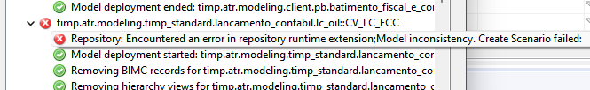
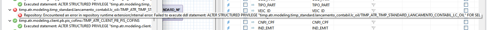
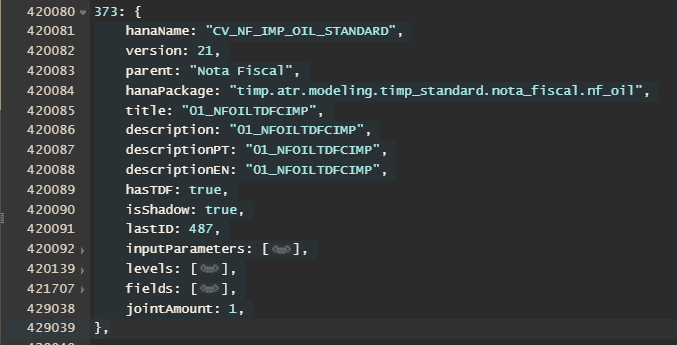

# Steps
	- DONE Where to join the two tables?
	  :LOGBOOK:
	  CLOCK: [2023-10-02 Mon 10:08:22]--[2023-10-02 Mon 11:04:44] =>  00:56:22
	  :END:
		- Before his answer I was making a manual conference to make it work.
		- William Moreira Answered that the Docnum is the correct Key to use and its relative on the CV_NF_IMP_OIL_STANDARD View.
	- DONE Filtering and making the Join for the CV_NF_IMP_OIL_STANDARD view
	  :LOGBOOK:
	  CLOCK: [2023-10-02 Mon 11:05:16]--[2023-10-02 Mon 17:20:15] =>  06:14:59
	  :END:
		- Error:
			- 
			- 
			- **NOTE:**
				- Error probably for it not having enouth data for the validation in TD1. the dependant view do not display any alert regarding the changed view: timp.atr.modeling.timp_standard.nota_fiscal.nf_oil::CV_NF_IMP_OIL_STANDARD
	-
	-
- # Pre-Flight
	- DONE Table version has been changed?
	  :LOGBOOK:
	  CLOCK: [2023-10-02 Mon 17:45:37]--[2023-10-02 Mon 17:45:38] =>  00:00:01
	  :END:
	- DONE Ask Wesley Moreira in what Level the new columns will be displayed?
	  :LOGBOOK:
	  CLOCK: [2023-10-02 Mon 17:23:56]--[2023-10-02 Mon 17:45:41] =>  00:21:45
	  :END:
	- DONE Shadow has params?
	- DONE Does view display two new fields?
	  :LOGBOOK:
	  CLOCK: [2023-10-02 Mon 17:45:50]--[2023-10-02 Mon 17:45:51] =>  00:00:01
	  :END:
		- **Numero NFSe** e **Codigo Verificador NFSe**
	- NOW Structure has been inserted from the VSCode in to the structure.xsjslib file?
	  :LOGBOOK:
	  CLOCK: [2023-10-02 Mon 17:45:55]
	  :END:
	- NOW Ask for transport to TQ1
	  :LOGBOOK:
	  CLOCK: [2023-10-02 Mon 17:24:15]--[2023-10-02 Mon 17:46:06] =>  00:21:51
	  :END:
	- DONE Does `jointAmount` has to change?
		- No it remains 1
		- 
	- Changelist Released, please transport to TQ1
		- TD1@ATX//536300 [ATR] PP-2277 Adicao de campos PREFNO CHECOD [VIEW]
		- view: timp.atr.modeling.timp_standard.nota_fiscal.nf_oil::CV_NF_IMP_OIL_STANDARD
		  AP: --
		- Components: --
		- Structure: 373
- # Notes
	- Line for the 373 structure -> 420080
	-