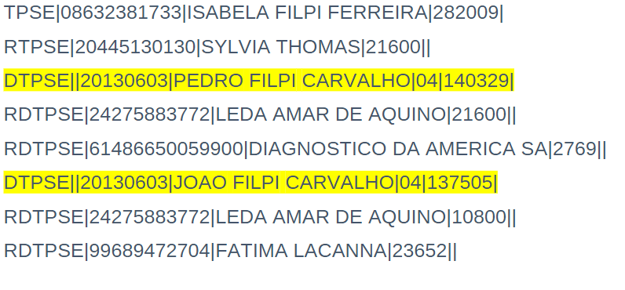

# pensei:
	- array [values]
	- func que compara values now com array de values.
	- if -> trigger logerror
	-
-
- # Notes:
	- Developer: Artur Carmo
	- previsto: 40 horas total
	- only DTPSE cannot repeat ONLY for this type of the Code.
	- ## Second problem
		- loop
			- buffer for last brpde
			- if now its a brpde then lorerror -> buffer brpde do not has children
			-
- # Steps
	- DONE Questions
		- Should the data in the data be considered repeated only by the second field?
		  logseq.order-list-type:: number
			- It aways has the same quantity of characters?
			  logseq.order-list-type:: number
			- It Data Represent What specifically?
			  logseq.order-list-type:: number
		- logseq.order-list-type:: number
- # Technical Specification
	- ## First issue
		- ### Sub-issue 1:
			- Repeated data at the end leaves one data repeated.
			- Note: the repeated data is not the same as the other
				- 
			- **Question:**
				- Should the data in the data be considered repeated only by the second field?
				  logseq.order-list-type:: number
					- It aways has the same quantity of characters?
					  logseq.order-list-type:: number
					- It Data Represent What specifically?
					  logseq.order-list-type:: number
		- ### Sub-issue 2:
			- Besides that it should specificity on the log what kind of issues happened.
	- ## Second Issue
		- The Expatriated Archive has inputs that do not Have VRPDE Value, it can be imported normally but the absence of the VRDPE must be alerted on the log, taking the lines of the input archive as reference
		- **Questions:**
			- How can I know if the data has or not the VRDPE value or not, what each column means?
-