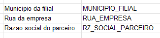

# Error in PFS
	- LATER ATR MUN_UF Dimension -> Need to change to 255
	-
	- ## Resolution Steps
		- LATER Mark how many fields are not being displayed
		- LATER Search for this fields in the Structure ATR 638
		- LATER Make a primary analysis on the issue
		- LATER Try to move data in PFS
		-
- # Changelist
  collapsed:: true
	- Changelist released, please transport to **TQ1** PP-2860
		- Changelist: 
		  logseq.order-list-type:: number
			- AP => 	TD1@ATX//563424
			  logseq.order-list-type:: number
			- CODE =>	TD1@ATX//562989
			  logseq.order-list-type:: number
			- VIEW => TD1@ATX//562485
			  logseq.order-list-type:: number
		- Components: [ATR]
		  logseq.order-list-type:: number
		- Install: [ATR]
		  logseq.order-list-type:: number
		- Analytic Privileges: 
		  logseq.order-list-type:: number
			- logseq.order-list-type:: number
			  timp.atr.modeling.client.pb.retidos.apuracao::TIMP_ATR_CLIENT_PB_RETIDOS_APURACAO
		- Views: 
		  logseq.order-list-type:: number
			- logseq.order-list-type:: number
			  timp.atr.modeling.client.pb.retidos.apuracao::APURACAO_OFICIALIZADA_ISS_PROPRIO_PETROBRAS
		- Structures: 
		  logseq.order-list-type:: number
			- timp.atr.server.models.tables.apuracao.issRetidoPropriox.sjslib
			  logseq.order-list-type:: number
		- Code: []
		  logseq.order-list-type:: number
		- Manually Replied:
		  logseq.order-list-type:: number
			- /timp/atr/server/structures/structures.xsjslib
			  logseq.order-list-type:: number
- # Steps
  collapsed:: true
	- DONE Make the table ISS_RETIDO_AJUSTEF
	  logseq.order-list-type:: number
	  :LOGBOOK:
	  CLOCK: [2024-04-16 Tue 17:39:28]--[2024-04-16 Tue 17:39:31] =>  01:45:03
	  :END:
		- DONE Copy the fields that will be needed on the table from the Excel and match them with the structure, remember to use complete default type table.
		  logseq.order-list-type:: number
	- DONE Fields
	  logseq.order-list-type:: number
	  collapsed:: true
	  :LOGBOOK:
	  CLOCK: [2024-04-16 Tue 13:54:07]--[2024-04-16 Tue 13:54:08] =>  01:30:45
	  :END:
		- DONE Aliquota ISS - Proprio
		  logseq.order-list-type:: number
		  :LOGBOOK:
		  CLOCK: [2024-04-16 Tue 16:07:10]--[2024-04-16 Tue 16:08:32] =>  00:01:22
		  :END:
			- HanaName: ALIQ_ISS_PROPRIO
			  logseq.order-list-type:: number
			- Type: DECIMAL
			  logseq.order-list-type:: number
			- Dimension: 15.4
			  logseq.order-list-type:: number
		- DONE  Analista
		  logseq.order-list-type:: number
		  :LOGBOOK:
		  CLOCK: [2024-04-16 Tue 16:08:35]--[2024-04-16 Tue 16:09:40] =>  00:01:05
		  :END:
			- HanaName: ANALISTA
			  logseq.order-list-type:: number
			- Type: NVARCHAR
			  logseq.order-list-type:: number
			- Dimension: 50
			  logseq.order-list-type:: number
		- DONE  Documento Contabil
		  logseq.order-list-type:: number
		  :LOGBOOK:
		  CLOCK: [2024-04-16 Tue 16:09:43]--[2024-04-16 Tue 16:11:05] =>  00:01:22
		  :END:
			- HanaName: BELNR
			  logseq.order-list-type:: number
			- Type: NVARCHAR
			  logseq.order-list-type:: number
			- Dimension: 10
			  logseq.order-list-type:: number
		- DONE  Cidade parceiro - dado mestre
		  logseq.order-list-type:: number
		  :LOGBOOK:
		  CLOCK: [2024-04-16 Tue 16:11:07]--[2024-04-16 Tue 16:12:22] =>  00:01:15
		  :END:
			- HanaName: CIDADE_PARCEIRO_MESTRE
			  logseq.order-list-type:: number
			- Type: NVARCHAR
			  logseq.order-list-type:: number
			- Dimension: 40
			  logseq.order-list-type:: number
		- DONE  COD FORNECEDOR - BCB
		  logseq.order-list-type:: number
		  :LOGBOOK:
		  CLOCK: [2024-04-16 Tue 16:12:29]--[2024-04-16 Tue 16:13:33] =>  00:01:04
		  :END:
			- HanaName: COD_FORN_BENEF
			  logseq.order-list-type:: number
			- Type: NVARCHAR
			  logseq.order-list-type:: number
			- Dimension: 10
			  logseq.order-list-type:: number
		- DONE  Codigo do Fornecedor
		  logseq.order-list-type:: number
		  :LOGBOOK:
		  CLOCK: [2024-04-16 Tue 16:13:36]--[2024-04-16 Tue 16:14:28] =>  00:00:52
		  :END:
			- HanaName: COD_FORNECEDOR
			  logseq.order-list-type:: number
			- Type: NVARCHAR
			  logseq.order-list-type:: number
			- Dimension: 11
			  logseq.order-list-type:: number
		- DONE  Codigo do parceiro
		  logseq.order-list-type:: number
		  :LOGBOOK:
		  CLOCK: [2024-04-16 Tue 16:14:32]--[2024-04-16 Tue 16:15:27] =>  00:00:55
		  :END:
			- HanaName: COD_PART
			  logseq.order-list-type:: number
			- Type: NVARCHAR
			  logseq.order-list-type:: number
			- Dimension: 60
			  logseq.order-list-type:: number
		- DONE  Data Atual
		  logseq.order-list-type:: number
		  :LOGBOOK:
		  CLOCK: [2024-04-16 Tue 16:15:30]--[2024-04-16 Tue 16:16:51] =>  00:01:21
		  :END:
			- HanaName: DATA_ATUAL
			  logseq.order-list-type:: number
			- Type: DATE
			  logseq.order-list-type:: number
			- Dimension: -
			  logseq.order-list-type:: number
		- DONE  Data criacao
		  logseq.order-list-type:: number
		  :LOGBOOK:
		  CLOCK: [2024-04-16 Tue 16:16:54]--[2024-04-16 Tue 16:18:07] =>  00:01:13
		  :END:
			- HanaName: DT_CRIACAO
			  logseq.order-list-type:: number
			- Type: NVARCHAR
			  logseq.order-list-type:: number
			- Dimension: 8
			  logseq.order-list-type:: number
		- DONE  Data emissao do doc. fiscal
		  logseq.order-list-type:: number
		  :LOGBOOK:
		  CLOCK: [2024-04-16 Tue 16:18:10]--[2024-04-16 Tue 16:27:52] =>  00:09:42
		  :END:
			- HanaName: DT_DOC
			  logseq.order-list-type:: number
			- Type: NVARCHAR
			  logseq.order-list-type:: number
			- Dimension: 8
			  logseq.order-list-type:: number
		- DONE  Data lancamento doc. fiscal
		  logseq.order-list-type:: number
		  :LOGBOOK:
		  CLOCK: [2024-04-16 Tue 16:27:55]--[2024-04-16 Tue 16:28:53] =>  00:00:58
		  :END:
			- HanaName: DT_E_S
			  logseq.order-list-type:: number
			- Type: NVARCHAR
			  logseq.order-list-type:: number
			- Dimension: 8
			  logseq.order-list-type:: number
		- DONE  Data lancamento
		  logseq.order-list-type:: number
		  :LOGBOOK:
		  CLOCK: [2024-04-16 Tue 16:28:56]--[2024-04-16 Tue 16:29:47] =>  00:00:51
		  :END:
			- HanaName: DT_LANCTO
			  logseq.order-list-type:: number
			- Type: NVARCHAR
			  logseq.order-list-type:: number
			- Dimension: 8
			  logseq.order-list-type:: number
		- DONE  Empresa
		  logseq.order-list-type:: number
		  :LOGBOOK:
		  CLOCK: [2024-04-16 Tue 16:29:50]--[2024-04-16 Tue 16:36:34] =>  00:06:44
		  :END:
			- HanaName: EMPRESA
			  logseq.order-list-type:: number
			- Type: NVARCHAR
			  logseq.order-list-type:: number
			- Dimension: 4
			  logseq.order-list-type:: number
		- DONE  Filial
		  logseq.order-list-type:: number
		  :LOGBOOK:
		  CLOCK: [2024-04-16 Tue 16:36:36]--[2024-04-16 Tue 16:37:43] =>  00:01:07
		  :END:
			- HanaName: FILIAL
			  logseq.order-list-type:: number
			- Type: NVARCHAR
			  logseq.order-list-type:: number
			- Dimension: 4
			  logseq.order-list-type:: number
		- DONE  Indicativo ISS
		  logseq.order-list-type:: number
		  :LOGBOOK:
		  CLOCK: [2024-04-16 Tue 16:37:46]--[2024-04-16 Tue 16:38:52] =>  00:01:06
		  :END:
			- HanaName: IND_SERVICO
			  logseq.order-list-type:: number
			- Type: NVARCHAR
			  logseq.order-list-type:: number
			- Dimension: 1
			  logseq.order-list-type:: number
		- DONE  ISS Retido
		  logseq.order-list-type:: number
		  :LOGBOOK:
		  CLOCK: [2024-04-16 Tue 16:38:54]--[2024-04-16 Tue 16:41:01] =>  00:02:07
		  :END:
			- HanaName: ISS_RETIDO
			  logseq.order-list-type:: number
			- Type: DECIMAL
			  logseq.order-list-type:: number
			- Dimension: 15.4
			  logseq.order-list-type:: number
		- DONE  Municipio + UF
		  logseq.order-list-type:: number
		  :LOGBOOK:
		  CLOCK: [2024-04-16 Tue 16:41:04]--[2024-04-16 Tue 16:43:59] =>  00:02:55
		  :END:
			- HanaName: MUN_UF
			  logseq.order-list-type:: number
			- Type: NVARCHAR
			  logseq.order-list-type:: number
			- Dimension:
			  logseq.order-list-type:: number
		- DONE  Docnum
		  logseq.order-list-type:: number
		  :LOGBOOK:
		  CLOCK: [2024-04-16 Tue 16:44:02]--[2024-04-16 Tue 16:44:55] =>  00:00:53
		  :END:
			- HanaName: NF_ID
			  logseq.order-list-type:: number
			- Type: NVARCHAR
			  logseq.order-list-type:: number
			- Dimension: 10
			  logseq.order-list-type:: number
		- DONE  Indicador de nota de servico
		  logseq.order-list-type:: number
		  :LOGBOOK:
		  CLOCK: [2024-04-16 Tue 16:45:07]--[2024-04-16 Tue 16:46:43] =>  00:01:36
		  :END:
			- HanaName: NF_SRV
			  logseq.order-list-type:: number
			- Type: NVARCHAR
			  logseq.order-list-type:: number
			- Dimension: 1
			  logseq.order-list-type:: number
		- DONE  Usuario de criacao
		  logseq.order-list-type:: number
		  :LOGBOOK:
		  CLOCK: [2024-04-16 Tue 16:46:46]--[2024-04-16 Tue 16:47:42] =>  00:00:56
		  :END:
			- HanaName: NOME_USUARIO
			  logseq.order-list-type:: number
			- Type: NVARCHAR
			  logseq.order-list-type:: number
			- Dimension: 12
			  logseq.order-list-type:: number
		- DONE  Numero da NF
		  logseq.order-list-type:: number
		  :LOGBOOK:
		  CLOCK: [2024-04-16 Tue 16:47:45]--[2024-04-16 Tue 16:50:35] =>  00:02:50
		  :END:
			- HanaName: NUM_DOC
			  logseq.order-list-type:: number
			- Type: NVARCHAR
			  logseq.order-list-type:: number
			- Dimension: 9
			  logseq.order-list-type:: number
		- DONE  Doc. ref. origem
		  logseq.order-list-type:: number
		  :LOGBOOK:
		  CLOCK: [2024-04-16 Tue 16:50:38]--[2024-04-16 Tue 16:51:53] =>  00:01:15
		  :END:
			- HanaName: NUM_REF_LANCTO
			  logseq.order-list-type:: number
			- Type: NVARCHAR
			  logseq.order-list-type:: number
			- Dimension: 35
			  logseq.order-list-type:: number
		- DONE  Status da Retencao
		  logseq.order-list-type:: number
		  :LOGBOOK:
		  CLOCK: [2024-04-16 Tue 16:51:55]--[2024-04-16 Tue 17:03:43] =>  00:11:48
		  :END:
			- HanaName: STATUS_RETENCAO
			  logseq.order-list-type:: number
			- Type: NVARCHAR
			  logseq.order-list-type:: number
			- Dimension: 24
			  logseq.order-list-type:: number
		- DONE  Extemporaneo
		  logseq.order-list-type:: number
		  :LOGBOOK:
		  CLOCK: [2024-04-16 Tue 17:04:05]--[2024-04-16 Tue 17:06:08] =>  00:02:03
		  :END:
			- HanaName: TIPO_APURACAO
			  logseq.order-list-type:: number
			- Type: REGRA
			  logseq.order-list-type:: number
			- Dimension: 15
			  logseq.order-list-type:: number
		- DONE  tipo part
		  logseq.order-list-type:: number
		  :LOGBOOK:
		  CLOCK: [2024-04-16 Tue 17:06:10]--[2024-04-16 Tue 17:07:02] =>  00:00:52
		  :END:
			- HanaName: TIPO_PART
			  logseq.order-list-type:: number
			- Type: NVARCHAR
			  logseq.order-list-type:: number
			- Dimension: 10
			  logseq.order-list-type:: number
		- DONE  BC ISS - Proprio
		  logseq.order-list-type:: number
		  :LOGBOOK:
		  CLOCK: [2024-04-16 Tue 17:07:04]--[2024-04-16 Tue 17:08:21] =>  00:01:17
		  :END:
			- HanaName: VL_BC_ISS_PROPRIO
			  logseq.order-list-type:: number
			- Type: DECIMAL
			  logseq.order-list-type:: number
			- Dimension: 15.4
			  logseq.order-list-type:: number
		- DONE Valor a Recolher
		  logseq.order-list-type:: number
		  :LOGBOOK:
		  CLOCK: [2024-04-16 Tue 17:08:27]--[2024-04-16 Tue 17:18:39] =>  00:10:12
		  CLOCK: [2024-04-16 Tue 17:18:48]--[2024-04-16 Tue 17:19:54] =>  00:01:06
		  :END:
			- HanaName: VL_DMBTR
			  logseq.order-list-type:: number
			- Type: DECIMAL
			  logseq.order-list-type:: number
			- Dimension: 15.4
			  logseq.order-list-type:: number
		- DONE  ISS Apurado
		  logseq.order-list-type:: number
		  :LOGBOOK:
		  CLOCK: [2024-04-16 Tue 17:20:53]--[2024-04-16 Tue 17:21:48] =>  00:00:55
		  :END:
			- HanaName: VL_ISS_PROPRIO
			  logseq.order-list-type:: number
			- Type: DECIMAL
			  logseq.order-list-type:: number
			- Dimension: 15.4
			  logseq.order-list-type:: number
		- DONE  Valor doc. fiscal
		  logseq.order-list-type:: number
		  :LOGBOOK:
		  CLOCK: [2024-04-16 Tue 17:21:50]--[2024-04-16 Tue 17:40:37] =>  00:18:47
		  :END:
			- HanaName: VL_TOTAL_DOCUMENTO
			  logseq.order-list-type:: number
			- Type: DECIMAL
			  logseq.order-list-type:: number
			- Dimension: 15.4
			  logseq.order-list-type:: number
	- LATER Create the package: atr.modeling.client.pb.retidos.apuracao, as solicited on the Ticket.
	  logseq.order-list-type:: number
	- LATER Create the view on the package
	  logseq.order-list-type:: number
	- LATER copy the structure ATR 638 to a new structure, changing the data origin.
	  logseq.order-list-type:: number
- # Questions
  collapsed:: true
	- Does the field to make the analysis on the Branch starting or not with "4" is for the Branch field *Filial* or the *ISS_RETIDO*?
	- The date format belongs to what field? => *DATA_ATUAL*?
- # Notes
  collapsed:: true
	- PP-3011 -> Analysis by Josselyn
	- Fields to make:
	  collapsed:: true
		- | 
		   | Nome do
		  Campo | 
		   | Nome HANA | 
		   | TIPO | 
		   | Tamanho | 
		   | Type | 
		  |
		  | 
		   | Aliquota ISS - Proprio | 
		   | ALIQ_ISS_PROPRIO           | 
		   | DECIMAL | 
		   | 15.4 | 
		   |  | 
		  |
		- | 
		   | Analista | 
		   | ANALISTA | 
		   | NVARCHAR | 
		   | 50 | 
		   |  | 
		  |
		- | 
		   | Documento Contabil | 
		   | BELNR                                    | 
		   | NVARCHAR | 
		   | 10 | 
		   |  | 
		  |
		  | 
		   | Cidade parceiro - dado mestre | 
		   | CIDADE_PARCEIRO_MESTRE        | 
		   | NVARCHAR | 
		   | 40 | 
		   |  | 
		  |
		  | 
		   | COD FORNECEDOR - BCB | 
		   | COD_FORN_BENEF | 
		   | NVARCHAR | 
		   | 10 | 
		   |  | 
		  |
		- | 
		   | Codigo do Fornecedor | 
		   | COD_FORNECEDOR | 
		   | NVARCHAR | 
		   | 11 | 
		   |  | 
		  |
		- | 
		   | Codigo do parceiro | 
		   | COD_PART                       | 
		   | NVARCHAR | 
		   | 60 | 
		   |  | 
		  |
		  | 
		   | Data Atual | 
		   | DATA_ATUAL | 
		   | DATE | 
		   | - | 
		   | (DD/MM/AAAA) | 
		  |
		- | 
		   | Data criacao | 
		   | DT_CRIACAO                      | 
		   | NVARCHAR | 
		   | 8 | 
		   | (DD/MM/AAAA) | 
		  |
		- | 
		   | Data emissao do doc. fiscal | 
		   | DT_DOC                     | 
		   | NVARCHAR | 
		   | 8 | 
		   | (DD/MM/AAAA) | 
		  |
		- | 
		   | Data lancamento doc. fiscal | 
		   | DT_E_S                          | 
		   | NVARCHAR | 
		   | 8 | 
		   | (DD/MM/AAAA) | 
		  |
		- | 
		   | Data lancamento | 
		   | DT_LANCTO                      | 
		   | NVARCHAR | 
		   | 8 | 
		   | (DD/MM/AAAA) | 
		  |
		- | 
		   | Empresa | 
		   | EMPRESA                      | 
		   | NVARCHAR | 
		   | 4 | 
		   |  | 
		  |
		- | 
		   | Filial | 
		   | FILIAL                          | 
		   | NVARCHAR | 
		   | 4 | 
		   |  | 
		  |
		- | 
		   | Indicativo ISS | 
		   | IND_SERVICO                     | 
		   | NVARCHAR | 
		   | 1 | 
		   |  | 
		  |
		- | 
		   | ISS Retido | 
		   | ISS_RETIDO | 
		   | DECIMAL | 
		   | 15.4 | 
		   |  | 
		  |
		- | 
		   | Municipio + UF | 
		   | MUN_UF | 
		   | NVARCHAR | 
		   |   | 
		   |  | 
		  |
		- | 
		   | Docnum | 
		   | NF_ID                         | 
		   | NVARCHAR | 
		   | 10 | 
		   |  | 
		  |
		- | 
		   | Indicador de nota de servico | 
		   | NF_SRV                           | 
		   | NVARCHAR | 
		   | 1 | 
		   |  | 
		  |
		- | 
		   | Usuario de criacao | 
		   | NOME_USUARIO                     | 
		   | NVARCHAR | 
		   | 12 | 
		   |  | 
		  |
		- | 
		   | Numero da NF | 
		   | NUM_DOC                         | 
		   | NVARCHAR | 
		   | 9 | 
		   |  | 
		  |
		- | 
		   | Doc. ref. origem | 
		   | NUM_REF_LANCTO                   | 
		   | NVARCHAR | 
		   | 35 | 
		   |  | 
		  |
		- | 
		   | Status da Retencao | 
		   | STATUS_RETENCAO                | 
		   | NVARCHAR | 
		   | 24 | 
		   |  | 
		  |
		- | 
		   | Extemporaneo | 
		   | TIPO_APURACAO | 
		   | REGRA | 
		   | 15 | 
		   |  | 
		  |
		- | 
		   | tipo_part | 
		   | TIPO_PART | 
		   | NVARCHAR  | 
		   | 10 | 
		   |  | 
		  |
		  | 
		   | BC ISS - Proprio | 
		   | VL_BC_ISS_PROPRIO              | 
		   | DECIMAL | 
		   | 15.4 | 
		   |  | 
		  |
		- | 
		   | Valor a Recolher | 
		   | VL_DMBTR                         | 
		   | DECIMAL | 
		   | 15.4 | 
		   |  | 
		  |
		- | 
		   | ISS Apurado | 
		   | VL_ISS_PROPRIO                  | 
		   | DECIMAL | 
		   | 15.4 | 
		   |  | 
		  |
		- | 
		   | Valor doc. fiscal | 
		   | VL_TOTAL_DOCUMENTO           | 
		   | DECIMAL | 
		   | 15.4 | 
		   |  | 
		  |
	- test
	- Add all fields with metre,
- # Caveats
  collapsed:: true
	- The view: CTR_NF_CUSTOM_OV_ISS_PROPRIO, from which the view: APURACAO_OFICIALIZADA_ISS_AJUSTEF_PETROBRAS should be copied from was presenting the error `Error: SAP DBTech JDBC: [2048]: column store error: search table error:  [34023] Instantiation of calculation model failed` therefor I started a analysis on the view to find the problem
	  collapsed:: true
		- **CTR_NF_CUSTOM_OV_ISS_PROPRIO**
			- **Path:**
				- timp.atr.modeling.client.pb.nota_fiscal.item_com_imposto
			- **Projections:**
				- P_NF_CUSTOM => CTR_NF_CUSTOM
				  background-color:: red
				- P_YSMMHIST_PROTOC
				  background-color:: green
				- P_YSMMDOC_PROTOC
				  background-color:: green
				- P_ZOTDS_ESSREXF
				  background-color:: green
				- P_BSEG
				  background-color:: green
		- **CTR_NF_CUSTOM**
			- **Path:**
				- timp.atr.modeling.client.pb.nota_fiscal.item_com_imposto
			- **Projetctions:**
				- CTR_NF_OIL_ADDON => CTR_NF_OIL_ADDON
				  background-color:: red
				- P_MAT_LOTE
				  background-color:: green
				- P_MBEW_OIL
				  background-color:: green
				- P_AUSP
				  background-color:: green
				- P_CABN
				  background-color:: green
				- P_EMPRESA_FILIAL_CADSTRO
				  background-color:: green
				- P_YSSD_PERGLPGN
				  background-color:: green
				- P_ADRCITYT
				  background-color:: green
		- **CTR_NF_OIL**
			- **Path:**
				- timp.atr.modeling.client.pb.is.oil.nota_fiscal.item_com_imposto
			- **Projections:**
				- P_NF_OIL => CTR_NF_OIL
				  background-color:: red
				- P_DIR_ICMS
				  background-color:: green
				- P_DIR_IPI
				  background-color:: green
				- P_DIR_PIS
				  background-color:: green
				- P_DIR_ISS
				  background-color:: green
				- P_DIR_COF
				  background-color:: green
				- P_UNID_MED
				  background-color:: green
				- P_MATERIAL
				  background-color:: green
				- P_GRU_MAT
				  background-color:: green
				- P_NF_MSG
				  background-color:: green
				- P_PARC_FOR
				  background-color:: green
				- P_PARC_FIL
				  background-color:: green
		- **CTR_NF_OIL**
			- **Path:**
				- timp.atr.modeling.client.pb.is.oil.nota_fiscal.item_com_imposto
			- **Projections:**
				- P_CTR_NF_EMP_FIL => CTR_VF_EMP_FIL => CTR_NF
				  background-color:: red
				- P_CTR_NF_PB => CTR_NF_PB
				  background-color:: red
		- **CTR_NF_PB**
			- **Path:**
				- timp.atr.modeling.ctr.nota_fiscal.item_com_imposto
			- **Projections:**
				- P_CTR_NF_V2 => CTR_NF => CTR_NF
				  background-color:: red
				- P_EMP_FIL_CAD
				  background-color:: green
		- **CTR_NF_PB**
			- **Path:**
				- timp.atr.modeling.client.pb.nota_fiscal.item_com_imposto
			- **Projections:**
				- P_CTR_NF_N2 => CTR_NF
				  background-color:: red
				- P_VBRP
				  background-color:: green
				- P_YSOIJNDMPORTO
				  background-color:: green
				- P_MARA
				  background-color:: green
				- P_T134T
				  background-color:: green
		- **CTR_NF**
			- **Path:**
				- timp.atr.modeling.ctr.nota_discal.item_com_imposto
			- **Projections:**
				- P_KNA1
				  background-color:: green
				- P_NF => NF_DOCUMENTO_ITEM_IMPOSTO
				  background-color:: red
				- P_DOC_EXTRA
				  background-color:: green
				- P_DOC_REF
				  background-color:: green
				- P_PARTICIPANTE
				  background-color:: green
				- P_SUBPERIOD
				  background-color:: green
				- P_TFB_COMB
				  background-color:: green
				- P_EMPRESA_FILIAL_CADASTRO
				  background-color:: green
				- P_NF_OBSERVATION
				  background-color:: green
				- P_LIN_EXTRA
				  background-color:: green
		- **NF_DOCUMENTO_ITEM_IMPOSTO**
			- **Path:**
				- timp.atr.modeling.ctr.nota_fiscal.item_com_imposto
			- **Projections:**
				- P_PRV_PARTICIPANTE
				  background-color:: green
				- P_NF_DOCUMENTO
				  background-color:: green
				- P_NF_ITEM
				  background-color:: green
				- P_IMPOSTO_CALCULO => NF_IMPOSTO_CALCULO
				  background-color:: red
		- **NF_IMPOSTO_CALCULO**
			- **Path:**
				- timp.atr.modeling.nota_fiscal
			- **Projections:**
				- P_CALCULO => NF_IMPOSTO
				  background-color:: red
		- **NF_IMPOSTO**
			- **Path:**
				- timp.atr.modeling.ctr.nota_fiscal
			- **Projections:**
				- P_NF_IMP
				  background-color:: green
				- P_TRIBU_MAP
				  background-color:: green
	- **Missing fields**
		- Municipio da filial
		  background-color:: green
		- Rua da empresa => logradouro_empresa P_EMPRESA_FILIAL_CADASTRO => "LOGRADOURO_EMPRESA"
		  background-color:: green
		- Razao social do parceiro => J_1BNFDOC => "NOME"
		- 
		-
-