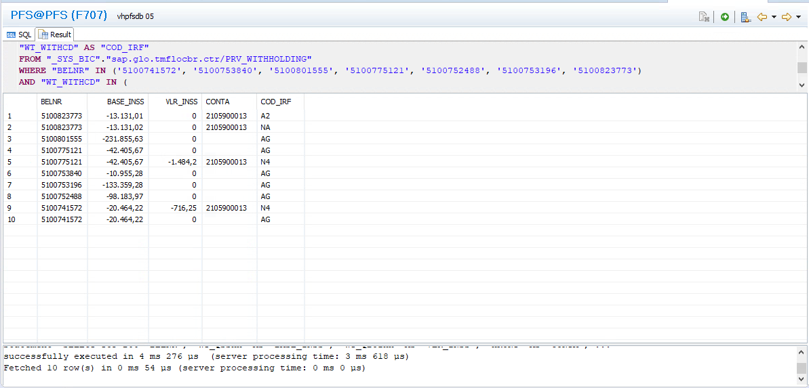

# [BRB] Erro nas informações dos campos de INSS Doc. Contábil
	- [Jira](https://agilebusinessservices.atlassian.net/browse/PP-3068)
	- ## Questions
	  collapsed:: true
		- Does all the lines have the same issue or only the mentioned ones?
		- The value for the field CA_BASE_INSS_COD_CONT is what?
			- 
		- CA e AR são adicionais que irão existir somente quando aliquota inss efetiva = 13
		-
	- # Notes
		- To fix the issue with CA_BASE_INSS_DOC_CONT make it max on the second to last Aggregation node
		- View: prv_if_imposto_retido está ok
			- ```md 
			  WT_QSSHH -> BASE_IRF
			  
			  IF(WT_AMMAN=x, WT_QBUIHH, WT_QSBHH) -> VLR_IRF
			  
			  HKONT -> COD_CTA
			  WT_WITHCD -> CODIGO_IRF
			  QSCOD -> CHAVE_IRF
			  ```
			- sap.glo.tmflocbr.ctr::NF_IMPOSTO_RETIDO to confirm, does the aggregation make it do not work
		- table with item:
			- ```sql 
			  SELECT
			  TOP 200
			  "BELNR",
			  "WT_QSSHH" AS "BASE_INSS",
			  "WT_QBUIHH" AS "VLR_INSS",
			  "HKONT" AS "CONTA",
			  "WT_WITHCD" AS "COD_IRF"
			  FROM "LT_PEX". "WITH_ITEM"
			  WHERE "BELNR" IN ('5100741572', '5100753840', '5100801555', '5100775121', '5100752488', '5100753196', '5100823773')
			  AND "WT_WITHCD" IN (
			  'Il', 'AG', 'A2', 'A3', 'A4', 'A5', 'A7', 'A9', 'A5', 'A7', 'Pl',
			  'TR', 'PF', 'NG', 'Nl', 'N2', 'NA', 'N4', 'SE', 'MG', 'CI', 'SE',
			  'El', 'N8', 'N6', 'N7', 'N3', 'N5', 'N4', '03', '01', '02')
			  
			  ORDER BY "BELNR" DESC
			  ```
		- ```sql 
		  SELECT
		  "NUM_LCTO",
		  "CAT_IMPOSTO",
		  "CODIGO_IRF",
		  
		  "EXERCICIO"
		  "NUM_ITEM",|
		  "DT_LCTO",
		  "DT_DOC",
		  "ESTABELECIMENTO",
		  "NUM_ARQ",
		  sum ("BASE_IRF") AS "BASE_IRF",
		  sum ("VL_IRF") AS "VL_IRF"
		  FROM " SYS_BIC". "sap.glo. tmflocbr.ctr/PRV_NF_IMPOSTO_RETIDO"
		  WHERE "NUM_LCTO" IN ('5100741572', '5100753840', '5100801555', '5100775121', '5100752488', '5100753196', '5100823773')
		  AND "CODIGO_IRF" IN (
		  'Il', 'AG', 'A2', 'A3', 'A4', 'A5', 'A7', 'A9', 'A5', 'A7', 'Pl',
		  'TR', 'PF', 'NG', 'Nl', 'N2', 'NA', 'N4', 'SE', 'MG', 'CI', 'SE',
		  'El', 'N8', 'N6', 'N7', 'N3', 'N5', 'N4', '03', '01', '02'
		  
		  GROUP BY "MANDT",
		  "EMPRESA",
		  "NUM_LCTO",
		  "EXERCICIO",
		  "NUM ITEM",
		  "DT LCTO",
		  "DT DOC",
		  "ESTABELECIMENTO",
		  "NUM ARQ",
		  "CAT IMPOSTO",
		  "CODIGO_IRF",
		  "CHAVE_IRF",
		  "TIP REND",
		  "DT_COMP",
		  "CNPJ",
		  "CPF",
		  "IE",
		  "IM",
		  "COD_CTA",
		  "COD_PART",
		  "NOME",
		  "ENDE",
		  "NUMERO",
		  "CIDADE",
		  "BAIRRO",
		  "CEP",
		  "UF",
		  "COD_PAIS",
		  "MOEDA",
		  "TIP_CONTA",
		  "BASE_EXC_IRF",
		  "DOC_COMPENSACAO",
		  "DOC_ESTORNO",
		  "IND_ESTORNO",
		  "CH_REF",
		  "DOC_HEADER_TEXT",
		  "J_1BWHT_BS",
		  "TIPO PART"
		  ORDER BY "NUM LCTO" DESC
		  ```
		- ```sql 
		  SELECT
		  TOP 200
		  "NUM LCTO",
		  "BASE IRF",
		  "VL IRF"
		  FROM " SYS_BIC". "sap.glo.tmflocbr.ctr/NF_IMPOSTO_RETIDO/dp/P_IMPOSTO_RETIDO" (
		  'PLACEHOLDER' = ('$$IP_DATE_TO$$',
		  '20210831'),
		  'PLACEHOLDER' = ('$$IP_DATE_FROM$$',
		  '20210801'),
		  'PLACEHOLDER' = ('$$IP_EXERCICIOS$',
		  '2021'),
		  'PLACEHOLDER' = ('$$IP_EMPRESAŞ$',
		  '1000'),
		  'PLACEHOLDER' = ('$$IP_MANDANTE$$',
		  '400'),
		  'PLACEHOLDER' = ('$$IP_HIGH_PERFORMANCE$$',
		  'APPLY'),
		  'PLACEHOLDER' = ('$$IP_LANGUAGE$$',
		  'P'),
		  'PLACEHOLDER' = ('$$IP_LEDGER$$',
		  'OL'))
		  WHERE
		  "NUM_LCTO" IN ('5100741572', '5100753840', '5100801555', '5100775121', '5100752488', '5100753196', '5100823773')
		  ORDER BY "NUM_LCTO" DESC
		  ```
	- # Investigation
		- PATH for the view getting the data, more specifically CA_BASE_INSS_DOC_CONT and CA_VLR_INSS_DOC_CONT :
			- **NF_RETIDOS_PETROBRAS_INSS**
			  background-color:: green
				- PATH: timp.atr.client.pb.retidos.consolidados
				- Query:
					- ```SQL 
					  SELECT
					      "NUM_LCTO",
					      "CA_PERCENT_BASE_INSS",
					      "VL_INSS",
					      "CA_BASE_INSS_DOC_CONT",|
					      "CA_VLR_INSS_DOC_CONT",
					      "NF_ID",
					      "NUM_ITEM",
					      "COD_CTA_INSS",
					      "NUM_DOC",
					      "CHAVE_IRF",
					      "CAT_COD_IRF_INSS",
					      "CAT_COD_IRF_INSS_MULTA",
					      "COD ITEM"
					  FROM "_SYS_BIC". "timp.atr.modeling. client.pb.retidos.consolidado/NF_RETIDOS_PETROBRAS_INSS" (
					      'PLACEHOLDER' = ('$$IP_TRIBUTOS$', 'INSS') ,
					      'PLACEHOLDER' = ('$$IP_DATE_TO$$', '20210831'),
					      'PLACEHOLDER' = ('$$IP_DATE_FROM$$', '20210801'),
					      'PLACEHOLDER' = ('$$IP_EXERCICIOS$', '2021'),
					      'PLACEHOLDER' = ('$$IP_EMPRESA$$', '1000'),
					      'PLACEHOLDER' = ('$$IP_MANDANTE$$', '400'),
					      'PLACEHOLDER' = ('$$IP_LANGUAGE$$', 'P'),
					      'PLACEHOLDER' = ('$$IP_LEDGER$$', 'OL'))
					  WHERE "NUM_LCTO" IN (
					      '5100741572', '5100753840', '5100801555', '5100775121', '5100752488', '5100753196', '5100823773'
					      )
					  AND "CODIGO_IRF" IN ( 
					      'I1', 'AG', 'A2', 'A3', 'A4', 'A5', 'A7', 'A9', 'A5', 'A7', 'P1', 'TR', 'PF', 'NG', 'N1', 'N2', 'NA', 'N4', 'SE', 'MG', 'CI', 'SE', 'E1', 'N8', 'N6', 'N7', 'N3', 'N5', 'N4', '03', '01', '02'
					      ) AND (
					      "CAT_COD_IRF_INSS" LIKE '%I1' OR
					      "CAT_COD_IRF_INSS" LIKE '%AG' OR
					      "CAT_COD_IRF_INSS" LIKE '%A2' OR
					      "CAT_COD_IRF_INSS" LIKE '%A3' OR
					      "CAT_COD_IRF_INSS" LIKE '%A4' OR
					      "CAT_COD_IRF_INSS" LIKE '%A5' OR
					      "CAT_COD_IRF_INSS" LIKE '%A7' OR
					      "CAT_COD_IRF_INSS" LIKE '%A9' OR
					      "CAT_COD_IRF_INSS" LIKE '%P1' OR
					      "CAT_COD_IRF_INSS" LIKE '%TR' OR
					      "CAT_COD_IRF_INSS" LIKE '%PF' OR
					      "CAT_COD_IRF_INSS" LIKE '%NG' OR
					      "CAT_COD_IRF_INSS" LIKE '%N1' OR
					      "CAT_COD_IRF_INSS" LIKE '%N2' OR
					      "CAT_COD_IRF_INSS" LIKE '%NA' OR
					      "CAT_COD_IRF_INSS" LIKE '%N4' OR
					      "CAT_COD_IRF_INSS" LIKE '%SE' OR
					      "CAT_COD_IRF_INSS" LIKE '%MG' OR
					      "CAT_COD_IRF_INSS" LIKE '%CI' OR
					      "CAT_COD_IRF_INSS" LIKE '%E1' OR
					      "CAT_COD_IRF_INSS" LIKE '%N8' OR
					      "CAT_COD_IRF_INSS" LIKE '%N6' OR
					      "CAT_COD_IRF_INSS" LIKE '%N7' OR
					      "CAT_COD_IRF_INSS" LIKE '%N3' OR
					      "CAT_COD_IRF_INSS" LIKE '%N5' OR
					      "CAT_COD_IRF_INSS" LIKE '%03' OR
					      "CAT_COD_IRF_INSS" LIKE '%01' OR
					      "CAT_COD_IRF_INSS" LIKE '%02'
					      )
					  ORDER BY "NUM_LCTO" DESC
					  ```
				- Response:
				  collapsed:: true
					- 
			- **NF_RETIDOS_PETROBRAS**
			  background-color:: green
				- PATH: timp.atr.client.pb.retidos
				- Query:
					- ```sql 
					  SELECT
					      "NUM_LCTO",
					      "CA_PERCENT_BASE_INSS",
					      "VL_INSS",
					      "CA_BASE_INSS_DOC_CONT",
					      "CA_VLR_INSS_DOC_CONT",
					      "NF_ID",
					      "NUM_ITEM",
					      "COD_CTA_INSS",
					      "NUM_DOC",
					      "CHAVE_IRF",
					      "CAT_COD_IRF_INSS",
					      "CAT_COD_IRF_INSS_MULTA",
					      "COD_ITEM",
					      "CODIGO_IRF",
					      "BASE_CALCULO_INSS_SIOF_INSS"
					  FROM "_SYS_BIC"."timp.atr.modeling.client.pb.retidos/NF_RETIDOS_PETROBRAS" (
					      'PLACEHOLDER' = ('$$IP_TRIBUTO$$', 'INSS'),
					      'PLACEHOLDER' = ('$$IP_DATE_TO$$', '20210831'),
					      'PLACEHOLDER' = ('$$IP_DATE_FROM$$', '20210801'),
					      'PLACEHOLDER' = ('$$IP_EXERCICIO$$', '2021'),
					      'PLACEHOLDER' = ('$$IP_EMPRESA$$', '1000'),
					      'PLACEHOLDER' = ('$$IP_MANDANTE$$', '400'),
					      'PLACEHOLDER' = ('$$IP_HIGH_PERFORMANCE$$', 'APPLY'),
					      'PLACEHOLDER' = ('$$IP_LANGUAGE$$', 'P'),
					      'PLACEHOLDER' = ('$$IP_LEDGER$$', 'OL')
					      )
					  WHERE "NUM_LCTO" IN (
					      '5100741572', '5100753840', '5100801555', '5100775121', '5100752488', '5100753196', '5100823773'
					      )
					  AND "CODIGO_IRF" IN ( 
					      'I1', 'AG', 'A2', 'A3', 'A4', 'A5', 'A7', 'A9', 'A5', 'A7', 'P1', 'TR', 'PF', 'NG', 'N1', 'N2', 'NA', 'N4', 'SE', 'MG', 'CI', 'SE', 'E1', 'N8', 'N6', 'N7', 'N3', 'N5', 'N4', '03', '01', '02'
					      )
					  ```
			- **NF_IMPOSTO_RETIDO**
			  background-color:: green
				- PATH: sap.glo.tmflocbr.ctr
				- Query:
					- ```sql 
					  SELECT
					      "NUM_LCTO",
					      "CAT IMPOSTO",
					      "CODIGO_IRF",
					      "CHAVE IRF",
					      "COD CTA",
					      "IND ESTORNO",
					      "CH REF",
					      "DOC HEADER_TEXT",
					      "J 1BWHT BS",
					      "TIPO PART",
					      "TIPO RETIDO",
					      "MOMENTO RET",
					      sum("VL IRF") AS "VL_IRF",
					      sum ("BASE_IRF") AS "BASE_IRF"
					  FROM " SYS BIC". "sap.glo. tmflocbr.ctr/NF_IMPOSTO_RETIDO" (
					      'PLACEHOLDER' = ('$$P_MANDT$$', '400'),
					      'PLACEHOLDER' = ('$$P_DT_INI$$', '20210801'),
					      'PLACEHOLDER' = ('$$P_DT_FIN$$', '20210831'),
					      'PLACEHOLDER' = ('$$P_EMPRESA$$', '1000'))
					  WHERE "NUM LCTO" IN (
					      '5100741572', '5100753840', '5100801555', '5100775121', '5100752488', '5100753196', '5100823773'
					      )
					  AND "CODIGO_IRF" IN ( 
					      'Il', 'AG', 'A2', 'A3', 'A4', 'A5', 'A7', 'A9', 'A5', 'A7', 'Pl', 'TR', 'PF', 'NG', 'Nl', 'N2', 'NA', 'N4', 'SE', 'MG', 'CI', 'SE', 'El', 'N8', 'N6', 'N7', 'N3', 'N5', 'N4', '03', '01', '02'
					      )
					  GROUP BY
					      "MANDT",
					      "EMPRESA",
					      "EXERCICIO",
					      "NUM_LCTO",
					      "NUM_ITEM",
					      "CAT_IMPOSTO",
					      "DT_DOC",
					      "DT_LCTO",
					      "CODIGO_IRF",
					      "CHAVE_IRF",
					      "DT_COMP",
					      "TIP_REND",
					      "NUM_ARQ",
					      "COD_CTA",
					      "CNPJ",
					      "CPE",
					      "IE",
					      "IM",
					      "COD_PART",
					      "NOME",
					      "ENDE",
					      "NUMERO",
					      "CIDADE",
					      "BAIRRO",
					      "UF",
					      "CEP",
					      "MOEDA",
					      "COD_PAIS",
					      "ESTABELECIMENTO",
					      "TIP_CONTA",
					      "BASE_EXC_IRF",
					      "DOC_COMPENSACAO",
					      "DOC_ESTORNO",
					      "IND_ESTORNO",
					      "CH_REF",
					      "DOC_HEADER_TEXT",
					      "J_1BWHT_BS",
					      "TIPO_PART",
					      "TIPO_RETIDO",
					      "MOMENTO_RET"
					  ORDER BY "NUM LCTO" DESC
					  ```
				- Response:
				  collapsed:: true
					- 
			- **PRV_NF_IMPOSTO_RETIDO**
			  background-color:: green
				- PATH: sap.glo.tmflocbr.ctr
				- Query:
					- ```sql 
					  SELECT
					      "NUM_LCTO",
					      "CAT_IMPOSTO",
					      "CODIGO_IRF",
					      "EXERCICIO"
					      "NUM_ITEM",
					      "DT_LCTO",
					      "DT_DOC",
					      "ESTABELECIMENTO",
					      "NUM_ARQ",
					      sum ("BASE_IRF") AS "BASE_IRF",
					      sum ("VL_IRF") AS "VL_IRF"
					  FROM 
					      "_SYS_BIC"."sap.glo.tmflocbr.ctr/PRV_NF_IMPOSTO_RETIDO"
					  WHERE 
					      "NUM_LCTO" IN (
					              '5100741572', '5100753840', '5100801555', '5100775121', '5100752488', '5100753196', '5100823773'
					              )
					  AND 
					      "CODIGO_IRF" IN (
					          'Il', 'AG', 'A2', 'A3', 'A4', 'A5', 'A7', 'A9', 'A5', 'A7', 'Pl', 'TR', 'PF', 'NG', 'N1', 'N2', 'NA', 'N4','SE', 'MG', 'CI', 'SE', 'El', 'N8', 'N6', 'N7', 'N3', 'N5', 'N4', '03', '01', '02'
					      )
					  GROUP BY
					      "MANDT",
					      "EMPRESA",
					      "NUM_LCTO",
					      "EXERCICIO",
					      "NUM_ITEM",
					      "DT_LCTO",
					      "DT_DOC",
					      "ESTABELECIMENTO",
					      "NUM_ARQ",
					      "CAT_IMPOSTO",
					      "CODIGO_IRF",
					      "CHAVE_IRF",
					      "TIP_REND",
					      "DT_COMP",
					      "CNPJ",
					      "CPF",
					      "IE",
					      "IM",
					      "COD_CTA",
					      "COD_PART",
					      "NOME",
					      "ENDE",
					      "NUMERO",
					      "CIDADE",
					      "BAIRRO",
					      "CEP",
					      "UF",
					      "COD_PAIS",
					      "MOEDA",
					      "TIP_CONTA",
					      "BASE_EXC_IRF",
					      "DOC_COMPENSACAO",
					      "DOC_ESTORNO",
					      "IND_ESTORNO",
					      "CH_REF",
					      "DOC_HEADER_TEXT",
					      "J_1BWHT_BS",
					      "TIPO_PART"
					  ORDER BY "NUM_LCTO" DESC
					  ```
				- Response:
				  collapsed:: true
					- 
			- **PRV_WITHHOLDING**
			  background-color:: green
				- PATH: sap.glo.tmflocbr.ctr
				- ```sql 
				  SELECT
				  TOP 200
				  "BELNR",
				  "WT_QSSHH" AS "BASE_INSS",
				  "WT_QBUIHH" AS "VLR_INSS",
				  "HKONT" AS "CONTA",
				  "WT_WITHCD" AS "COD_IRF"
				  FROM "_SYS_BIC"."sap.glo.tmflocbr.ctr/PRV_WITHHOLDING"
				  WHERE "BELNR" IN ('5100741572', '5100753840', '5100801555', '5100775121', '5100752488', '5100753196', '5100823773')
				  AND "WT_WITHCD" IN (
				  'I1', 'AG', 'A2', 'A3', 'A4', 'A5', 'A7', 'A9', 'A5', 'A7', 'P1',
				  'TR', 'PF', 'NG', 'N1', 'N2', 'NA', 'N4', 'SE', 'MG', 'CI', 'SE',
				  'E1', 'N8', 'N6', 'N7', 'N3', 'N5', 'N4', '03', '01', '02')
				  
				  ORDER BY "BELNR" DESC
				  ```
				- {:height 324, :width 659}
			- **TABLE: WITHITEM**
			  background-color:: green
				- ```sql 
				  SELECT
				  TOP 200
				  "BELNR",
				  "WT_QSSHH" AS "BASE_INSS",
				  "WT_QBUIHH" AS "VLR_INSS",
				  "HKONT" AS "CONTA",
				  "WT_WITHCD" AS "COD_IRF"
				  FROM "LT_PEX". "WITH_ITEM"
				  WHERE "BELNR" IN ('5100741572', '5100753840', '5100801555', '5100775121', '5100752488', '5100753196', '5100823773')
				  AND "WT_WITHCD" IN (
				  'I1', 'AG', 'A2', 'A3', 'A4', 'A5', 'A7', 'A9', 'A5', 'A7', 'P1',
				  'TR', 'PF', 'NG', 'N1', 'N2', 'NA', 'N4', 'SE', 'MG', 'CI', 'SE',
				  'E1', 'N8', 'N6', 'N7', 'N3', 'N5', 'N4', '03', '01', '02')
				  
				  ORDER BY "BELNR" DESC
				  ```
				- 
		- PATH for the VL_INSS:
			- **NF_RETIDOS_PETROBRAS_INSS**
				- PATH: timp.atr.client.pb.retidos.consolidados
			- **NF_RETIDOS_PETROBRAS**
				- PATH: timp.atr.client.pb.retidos
			- **PRV_NF_IMPOSTO**
				- PATH: sap.glo.tmflocbr.ctr
				- Has a Union with several other tables that bring the value, that will be sum in aggregation node, previous to semantics.
				  background-color:: yellow