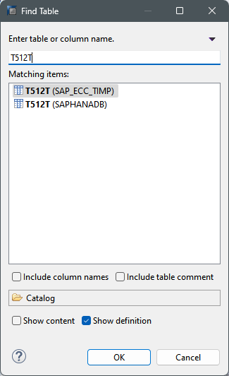

# Notes
	- LATER Ask Nelson about the compatibility of the development in TC2 and in PFS so the mapping of TC2 can be pushed correctly.
	  background-color:: yellow
- # Questions
  collapsed:: true
	- What table should I use?
		- 
	- Can I make the View on the same package as the CA_CONTAB_FP?
		- p.b.a.e.ft.trab
	-
- # Steps
  collapsed:: true
	- |Name|Development|Time|
	  |Join| View| 30 min |
	  |AP| View|20 min|
	  | Query Compare | View | 20 min |
	  | Fields | Structure | 60min |
	  | Fields positioning | Structure | 40min |
	  | Installing | Structure | 20min |
	  | Testing (Query in Platform TD1) Replicate in PFS  | Structure | 40 min |