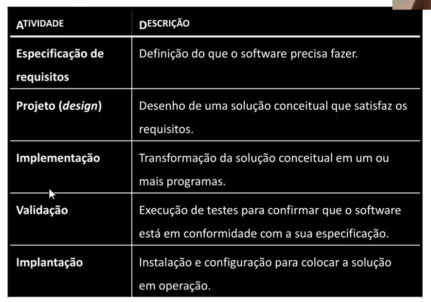
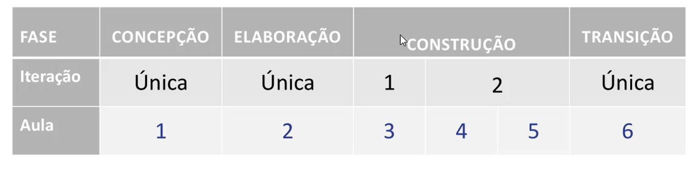

# Aula 1
collapsed:: true
	- ## Ponto de Partida
		- 
		- **Fases**
			- 
		- **Concepção**
			- Definição do tema do projeto
			- Definição do templete do documento de especificação
			- Formação dos grupos
			- Criação do repositório de controle de versão
			- Criação do quadro de acompanhamento do projeto
			- Definição da plataforma de desenvolvimento
			- Elaboração dos diagramas e das descrições dos casos de uso.
	- ## Texto de Apoio
		- 
- # Aula 2
  collapsed:: true
	- ## Texto de Apoio
		- 
	- ## Praticando
		- **Correções:**
			- DONE Casos de Uso
			- DONE Diagramas de Casos de Uso
			- DONE Descrição dos casos de uso principais
			- LATER
			-
- # Aula 3
  collapsed:: true
	- Entrega:
		- Entregar uma funcionalidade do trabalho pronta, com servidor e com front-end
		- ### Detalhamento da Entrega
			- Como cada grupo pode já estar em uma etapa diferente da implementação do projeto, precisamos combinar com cada um qual entidade será utilizada nesse desenvolvimento. O que será entregue?
				- Diagrama de implantação (deverá ser inserido posteriormente no documento do projeto em um capítulo exclusivo), link do quadro Kanban, link do Código Fonte (github) e link da aplicação em funcionamento (hospedagem)
				- Link de uma funcionalidade da aplicação em funcionamento
				- Link do vídeo demonstração da aplicação em funcionamento (inserir explicações, demonstrar o guia do usuário, repositório do github, código-fonte, quadro de acompanhamento do
				  projeto)
				- Documento Guia do Usuário (em pdf ou docx)
			- Lista
				- Diagrama de implantação
				- Funcionalidade:
					- Fron-end
					- Back-end
				- Subir a aplicação.
				- Demonstração em vídeo
				- Documento Guia do ususário (como navegar a aplicação)