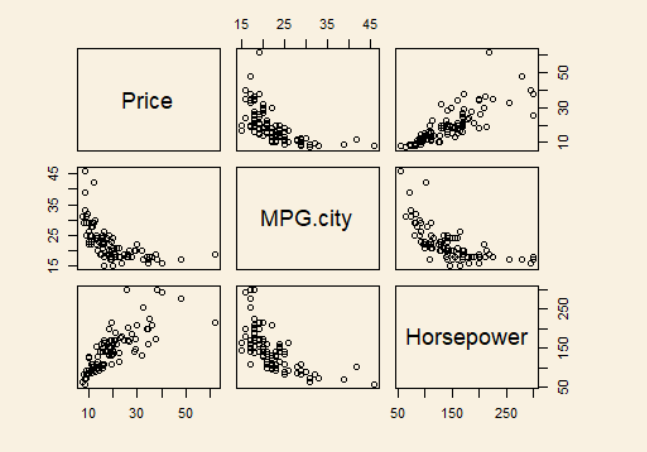
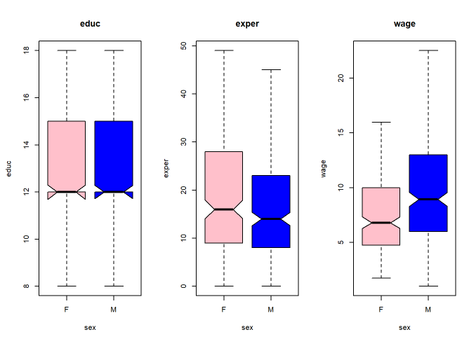

# Review
	- DONE Estatística Aplicada - Aula 1 [[Feb 24rd, 2024]]
	  :LOGBOOK:
	  CLOCK: [2024-02-25 Sun 01:30:48]--[2024-02-25 Sun 01:47:27] =>  00:16:39
	  :END:
	- DONE Estatística Aplicada - Aula 1 [[Mar 1st, 2024]]
	  :LOGBOOK:
	  CLOCK: [2024-03-01 Fri 06:02:28]--[2024-03-01 Fri 06:05:22] =>  00:02:54
	  :END:
	- DONE Estatística Aplicada - Aula 1 [[Mar 23rd, 2024]]
	- DONE Estatística Aplicada - Aula 2 (->Texto de Apoio) [[Mar 1st, 2024]]
	  :LOGBOOK:
	  CLOCK: [2024-03-01 Fri 06:05:26]--[2024-03-01 Fri 06:08:43] =>  00:03:17
	  :END:
	- DONE Estatística Aplicada - Aula 2 (->Texto de Apoio) [[Mar 6th, 2024]]
	  :LOGBOOK:
	  CLOCK: [2024-03-07 Thu 05:44:25]--[2024-03-07 Thu 05:46:51] =>  00:02:26
	  :END:
	- DONE Estatística Aplicada - Aula 2 (->Texto de Apoio) [[Apr 1st, 2024]]
	- DONE Estatística Aplicada - Aula 3 (->Texto de Apoio) [[Mar 17th, 2024]]
	  collapsed:: true
	- DONE Estatística Aplicada - Aula 3 (->Texto de Apoio) [[Apr 16th, 2024]]
	- DONE Estatística Aplicada - Aula 3 (->Texto de Apoio) [[Apr 17th, 2024]]
- # Aula 1
  collapsed:: true
	- ## Ponto de Partida
		- DONE install R
		  :LOGBOOK:
		  CLOCK: [2024-02-25 Sun 01:30:18]--[2024-02-25 Sun 01:30:18] =>  00:00:00
		  :END:
		- DONE Install R Studios
		  :LOGBOOK:
		  CLOCK: [2024-02-25 Sun 01:30:15]--[2024-02-25 Sun 01:30:17] =>  00:00:02
		  :END:
	- ## Texto de Apoio
		- 
	- ## Praticando
		- 
	- ### Explorando Conceitos
		- Acesse estes materiais e explore os comandos básicos de R e dataframes. Os links poderão ser bastante úteis para você ao longo dos exercícios, auxiliando em seu aprendizado.
		- R Tutorial – An R Introduction to Statistics
			- [http://www.r-tutor.com/content/r-tutorial-ebookLinks to an external site.](http://www.r-tutor.com/content/r-tutorial-ebook)
		- Quick-R
			- [https://www.statmethods.net/r-tutorial/index.htmlLinks to an external site.](https://www.statmethods.net/r-tutorial/index.html)
- # Aula 2
  collapsed:: true
	- ## Ponto de Partida
		- **Descriptive Statistics**
		  collapsed:: true
			- When dealing with qualitative data usually is a good statistic to have the frequency of such data, we can use the command:
				- ```R 
				  table(df$region)
				  table(df$sex)
				  ```
				- Which will return how many times each of the unique values are repeated for `region` and `sex`
			- **Análise univariada**
			  | Univariada | Descrição |
			  | ---- | ---- | ---- |
			  | min(x) | Mínimo elemento em x |
			  | max(x) | Máximo elemento em x |
			  | range(x) | Range (min to max) elementos em x |
			  | length(x) | número de elementos em x |
			  | mean(x) | Média dos valores em x |
			  | median(x) | Mediana dos valores em x |
			  | var(x) | Variância dos elementos em x |
			  | sd(x) | Desvio padrão dos elementos em x |
			  | quantile(x,p) | O percentual p quartil dos elementos de x |
			  | table(x) | Frequencias de valores de x |
			- **Análise multivariada**
			  | Multivariada | Descrição |
			  | ---- | ---- | ---- |
			  | cor(x,y) | Correlação entre os elementos x e y |
			  | cov(x,y) | cov(x,y) Covariance between x and y |
	- ## Texto de Apoio
		- 
		- First information about the data:
			- ```R 
			  library(MASS)
			  head(Cars93)
			  help(Cars93)
			  ```
		- Attach - detach
			- ```R 
			  suppressMessages(attach(Cars93))
			  
			  mean(Price)
			  ## [1] 19.50968
			  
			  var(Price)
			  ## [1] 93.30458
			  
			  sd(Price)
			  ## [1] 9.65943
			  
			  cat(mean(Price) - sd(Price), mean(Price) + sd(Price))
			  ## 9.850248 29.16911
			  
			  detach(Cars93)
			  ```
		- Standard Score
			- ```R 
			  suppressMessages(attach(Cars93))
			  
			  scale(Price, center=FALSE) [1:6] # uma amostra dos escores padrão
			  ## [1] 0.7271963 1.5504374 1.3309065 1.7242328 1.3720685 0.7180492
			  L = scale(Price) > 3 # selecionando escores maiores que 3
			  print(Cars93[L,])
			  
			  detach(Cars93)
			  ```
		- Graphical Correlation
			- ```R 
			  myCars = Cars93[ , c('Price',"MPG.city", 'Horsepower') ]
			  pairs(myCars)
			  ```
			- 
	- ## Praticando
		- Erro no exercício 3 - Resolvido
		  background-color:: green
	- ## Aplicando Conhecimento
		- Parou no Execicio 1.3 -> Finalizado
		  background-color:: green
- # Aula 3
	- ## Ponto de Partida
		- Data Visualization
			- Anscombe's 4 Regressiondata sets
			- Presentation Graph and Exploration Graph
			- **Histogram** -> Shows Amount and frequency of ONE parameter
			- **Bar Graph** -> Shows 2 variables in relation with themselves.
	- ## Texto de Apoio
		- 
	- ## Praticando
		- ## Exercícios
		- ### Exercício 1
		  
		  Considere a base.
		- install.packages("mosaicData")
		  data(CPS85 , package = "mosaicData")
		  head(CPS85)
		- Faça um histograma e gráficos de caixa de `educ` e `expr`. Existem outliers para que valores?
		  
		  **Solução**
		  
		  2.Faça gráficos para exibir a distribuição (histograma) de valores de `educ`, `exper` e `wage` separadamente para os sexos Masculino e Feminino. Que distribuições concentram valores mais a esquerda (valores menores)?
		  
		  Esses são casos de distribuições chamadas distribuições assimétricas em calda.
		  
		  **Solução**
		- 3. Analise a distribuição dos mesmos dados do problema anterior, mas agora empregue um gráfico de caixa e a função `~` para exibir separadamente os sexos.
		  
		  Dica: experimente `educ ~ sex`.
		  
		  **Solução**
		- 4. Consulte o help do boxplot e busque uma opção que exiba com maior evidência a mediana e o quanto ela difere dos outros valores. Repita então o exercício anterior com essa opção. Se conseguir (rs) empregue uma opção para colorir diferentemente as caixas para o sexo Feminino e Masculino. Utilize também um parâmetro para não exibir os outliers.
		  
		  Dica: não se incomode com a mensagem de warning se surgir.
		- ```R 
		  par(mfrow = c(1, 3))
		  
		  boxplot(educ ~ sex, data=CPS85, main='educ',col=c('pink','blue'),
		          notch=TRUE,outline=FALSE)
		  boxplot(exper ~ sex, data=CPS85, main='exper',col=c('pink','blue'),
		          notch=TRUE,outline=FALSE)
		  boxplot(wage ~ sex, data=CPS85, main='wage',col=c('pink','blue'),
		          notch=TRUE,outline=FALSE)
		  
		  ```
		- 
		- 5. Empregue um gráfico de barras e outro de pizza para exibir a proporção de do status de casados na base. Dica: para o `pie()` você precisa fornecer a frequencia dos valores. Empregue em conjunto o `table()`.
		  
		  **SOlução**
		- 6. Faça um gráfico de densidade e um histogram com breaks=30 para os valores de rendimentos (`wage`). Compare os gráficos.
		  
		  **Solução**
		- ### Exercício 2
		- 1. Empregue a função `rnorm` para gerar valores randomicos. Acesse o `help(norm)`. Mas o seu formato geral é:
		  
		  ```
		  rnorm( n, valor médio, desvio padrão)
		  ```
		  
		  gere 4 séries com 100 valores aleatórios com média 50 e desvio padrão 10, 50, 20 e 5 respectivamente. Em seguida plot os gráficos de densidade e compare.
		  
		  Dica: você pode querer empregar `plot(density(...),...)` no lugar do `densityplot()`.
		  
		  **Solução**
		- 2. Repita o exercício anterior somente para as séries de desvio padrão 10 e 20, mas compare também os histogramas produzidos. Compare os resultados.
		  
		  **Solução**
		- ### Exercício 3
		  
		  Considere a base.
		- 1. Produza o gráfico:
		  
		  ```
		  boxplot(DOLAR ~ data, data=df)
		  ```
		  
		  Por quê o gráfico aparentemente não exibe os quartis de cada data?
		  
		  **Solução**