-
- # Cards Assemble
	- {{cards [[Proctored CCAT]] }}
		- Summary: 19 items, 19 review counts [[Sep 24th, 2025]]
			- Remembered:   18 (94%)
			- Forgotten :   1 (5%)
		- Summary: 6 items, 6 review counts [[Sep 18th, 2025]]
			- Remembered:   6 (100%)
			- Forgotten :   0 (0%)
		- Summary: 34 items, 34 review counts [[Sep 17th, 2025]]
			- Remembered:   29 (85%)
			- Forgotten :   5 (14%)
	-
- # Proctored CCAT - Preparation
	- #CrossOver #[[L2 Customer Support Engineer]]
	- ## Categories
		- Number sequence logic
		  logseq.order-list-type:: number
		- Rule of 3 simple and compound and proportions
		  logseq.order-list-type:: number
		- Fill in the blank.
		  logseq.order-list-type:: number
			- Vocabulary can be a negative 
			  logseq.order-list-type:: number
		- Graph interpretation and percentage
		  logseq.order-list-type:: number
		- Arithmetic averages direct and reversed
		  logseq.order-list-type:: number
		- Percentage and sequence of percentage and probability
		  logseq.order-list-type:: number
		- Spatial awareness
		  logseq.order-list-type:: number
		- logseq.order-list-type:: number
	- ## To study
		- Fast multiplication techniques
		  logseq.order-list-type:: number
		- rule of 3, simple and complex
		  logseq.order-list-type:: number
		- Graph interpretation
		  logseq.order-list-type:: number
	- ## Study -  Videos
		- **Videos**
		  collapsed:: true
			- | Questions | Video |
			  | 01 - 10 |{{video https://www.youtube.com/watch?v=b-3Pm7i8p6Y&list=PLKMMyGAEA3VFm72j8_cM6SfYsb0lzTKz8&index=1}}|
			  |11 - 20|{{video https://www.youtube.com/watch?v=H-FIPypKX6A&list=PLKMMyGAEA3VFm72j8_cM6SfYsb0lzTKz8&index=3}}|
			  |21 - 30|{{video https://www.youtube.com/watch?v=mxSrYLHo35w&list=PLKMMyGAEA3VFm72j8_cM6SfYsb0lzTKz8&index=4}}|
			  |31 - 40|{{video https://www.youtube.com/watch?v=2lEIxMBxrwE&list=PLKMMyGAEA3VFm72j8_cM6SfYsb0lzTKz8&index=4}}|
		- ### Question 1
		  collapsed:: true
			- What would be the next number in the series?
			  card-last-interval:: 4
			  card-repeats:: 2
			  card-ease-factor:: 2.7
			  card-next-schedule:: 2025-09-28T12:26:37.596Z
			  card-last-reviewed:: 2025-09-24T12:26:37.596Z
			  card-last-score:: 5
			  1 ... 3 ... 7 ... 13 ... 21 ... ?
			  31
			  33
			  35
			  37
			  39 #card
				- The solution is on the difference between the number that progresses in a **Arithmetic Progression** therefor:
					- 1 ... 3 ... 7 ...  13 ... 21 =>
						- 3-1 = 2
						- 7-3 = 4
						- 13-7 = 6
						- Confirm Hypothesis with 21 - 13 -> 8
						- 2, 4, 6, 8, 10 -> 21 + 10 => 31
				-
		- ### Question 2
		  collapsed:: true
			- A data scientist uses 1.25 MB of storage on her computer for an operation. If she performs 140 such operations per month, how many megabytes of storage she will need every month?
			  card-last-interval:: 4
			  card-repeats:: 2
			  card-ease-factor:: 2.7
			  card-next-schedule:: 2025-09-28T12:45:29.937Z
			  card-last-reviewed:: 2025-09-24T12:45:29.937Z
			  card-last-score:: 5
			  168
			  170
			  174
			  175
			  181
			   #card
				- 1.25 MB can be broken in 1MB and .25 MB which is 1/4 of 1MB.
				  logseq.order-list-type:: number
				- 1/4 of 140 -> half is 70 and half again is 35, lock it in place.
				  logseq.order-list-type:: number
				- 140 * 1 = 140 + 35(locked) => 175
				  logseq.order-list-type:: number
		- ### Question 3
		  collapsed:: true
			- A plumber can complete a repair in 2.5 hours. His colleague takes 3
			  card-last-interval:: 15.72
			  card-repeats:: 3
			  card-ease-factor:: 2.7
			  card-next-schedule:: 2025-10-10T05:48:59.503Z
			  card-last-reviewed:: 2025-09-24T12:48:59.503Z
			  card-last-score:: 5
			  hours to complete the repair. If both of them start working at the same
			  time, and each works 45 hours over the course of one week,
			  how many repairs will they have completed?
			  32
			  33
			  35
			  37
			  39 #card
				- **Answer**
					- 33
				- **Reason**
					- First
						- Take the 45 hours and divide by 3, (Simpler), which is 15 repairs.
						- As the first plumber repairs in 2.5 hours -> 15 * 1/2 is 7.5 hours "more"
						- 7.5 can be decomposed as
							- 2.5 + 2.5 = 5
							- 5 + 2.5 = 7
						- Which means 3 more repairs
						- 15 repairs each, more 3 repairs of the faster side: 33 repairs
		- ### Question 4
		  collapsed:: true
			- Fill in the blanks with most appropriate words:
			  card-last-interval:: 11.2
			  card-repeats:: 3
			  card-ease-factor:: 2.8
			  card-next-schedule:: 2025-10-05T16:27:27.412Z
			  card-last-reviewed:: 2025-09-24T12:27:27.412Z
			  card-last-score:: 5
			  Because her department was increasingly short-staffed, the scope of her work began 
			  to ___ upon the limits of already ___ bandwidth.
			  bestow .. depleted
			  proceed .. augmented
			  infringe .. enriched
			  encroach .. strained
			  impart .. delimited #card
				- **Answer**
					- encroach .. strained
		- ### Question 5
		  collapsed:: true
			- Fill in the blanks with most appropriate words:
			  card-last-interval:: 31.36
			  card-repeats:: 4
			  card-ease-factor:: 2.8
			  card-next-schedule:: 2025-10-25T20:27:05.589Z
			  card-last-reviewed:: 2025-09-24T12:27:05.589Z
			  card-last-score:: 5
			  To prove that other residents considered the new billboard to be a ___ on the neighbourhood, he conducted a survey in the hopes of documenting his neighbours' negative reaction to it.
			  -windfall
			  -query
			  -tariff
			  -boon
			  -blight #card
				- **Answer**
					- Blight
		- ### Question 6
		  collapsed:: true
			- 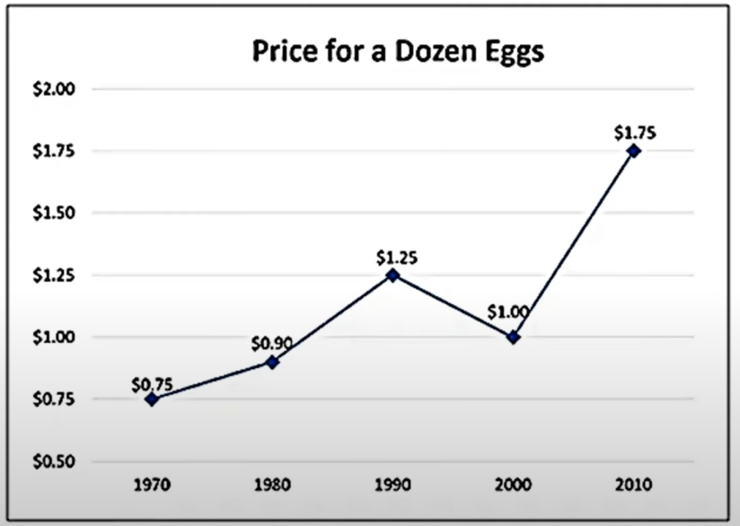{:width 450}
			  card-last-interval:: 10.24
			  card-repeats:: 3
			  card-ease-factor:: 2.56
			  card-next-schedule:: 2025-10-04T17:25:23.116Z
			  card-last-reviewed:: 2025-09-24T12:25:23.116Z
			  card-last-score:: 5
			  What percentage did price increase between 1990 and 2010
			  20%
			  25%
			  40%
			  50%
			  75% #card
				- **Answer**
					- 40%
				- **Reason**
					- The difference between 1.75 and 1.25 is 0.5
					  logseq.order-list-type:: number
					- .5 represent which percentage of 1.25?
					  logseq.order-list-type:: number
						- 10% of 1.25 is 0.125 which times 4 is 50
						  logseq.order-list-type:: number
					- Therefor the answer is 40%
					  logseq.order-list-type:: number
		- ### Question 7
		  collapsed:: true
			- A group of 4 numbers has an average of 27. The first 3 numbers are 7, 29 and 35. What is the fourth number?
			  31
			  33
			  35
			  37
			  39 #card
				- **Answer**
					- 37
				- **Reason**
					- First the total amount before dividing by four is 4 * 27 which can be decomposed in to:
						- 2 * 27 = 54, and 54 * 2 = 108
					- Second sum of 7, 29, and 35.
					- Seven lends 1 unity to 29 -> 6 + 30 + 35 -> 6 + 65 -> 71
					- 71 to 108 -> it can be locked by the 7, only answer with 7 in units case is 37 or:
						- subtract 1 unity of both 70 and 108. which would be 107 - 70, much more obvious.
		- ### Question 8
		  collapsed:: true
			- A new car is purchased for $24,000. The value of the car depreciates by 20% in the first year and 15% in the next. What is the value of the car after 2 years?
			  card-last-interval:: -1
			  card-repeats:: 1
			  card-ease-factor:: 2.36
			  card-next-schedule:: 2025-09-25T03:00:00.000Z
			  card-last-reviewed:: 2025-09-24T12:48:26.631Z
			  card-last-score:: 1
			  16,300
			  16,320
			  16,340
			  16,360
			  16,380 #card
				- **Answer**
					- 10% of 24000 is 2400 => 20% is 4800
					- 24000 - 4800 = 19200
					- 10% of 19200 is 1920 -> 1920 *1.5 = 2880
					- 19200 - 2880 =>
						- 19200 - 2880 - 120 = -120
						- 19200 - 3000 = -120
						- 16200 + 120 = 16320
		- ### Question 9
		  collapsed:: true
			- An analyst determines that there is a 20% chance that the flight will be delayed. If this is true and someone takes a round trip (2 flights), what are the chances that NEITHER flight will be delayed?
			  card-last-interval:: 4
			  card-repeats:: 2
			  card-ease-factor:: 2.7
			  card-next-schedule:: 2025-09-28T12:22:34.237Z
			  card-last-reviewed:: 2025-09-24T12:22:34.237Z
			  card-last-score:: 5
			  56%
			  60%
			  64%
			  70%
			  80% #card
				- **Answer**
					- 64%
		- ### Question 10
		  collapsed:: true
			- Choose the word that is most nearly OPPOSITE in meaning to the word:
			  card-last-interval:: 11.2
			  card-repeats:: 3
			  card-ease-factor:: 2.8
			  card-next-schedule:: 2025-10-05T16:28:33.908Z
			  card-last-reviewed:: 2025-09-24T12:28:33.908Z
			  card-last-score:: 5
			  QUOTIDIAN.
			  -disregarded
			  -paraphrased
			  -frequent
			  -abnormal
			  -estimated #card
				- **Answer**
					- Abnormal
		- ### Question 11
		  collapsed:: true
			- If a factory produces 16 motorcycles per hour, how many motorcycles can  it produce in 6 hours?
			  card-last-interval:: 4
			  card-repeats:: 2
			  card-ease-factor:: 2.7
			  card-next-schedule:: 2025-09-28T12:44:33.459Z
			  card-last-reviewed:: 2025-09-24T12:44:33.459Z
			  card-last-score:: 5
			  94
			  96
			  98
			  92
			  80 #card
				- **Answer**
					- 96
		- ### Question 12
		  collapsed:: true
			- Which of the following is smallest value?
			  card-last-interval:: 4
			  card-repeats:: 2
			  card-ease-factor:: 2.7
			  card-next-schedule:: 2025-09-28T12:24:31.132Z
			  card-last-reviewed:: 2025-09-24T12:24:31.133Z
			  card-last-score:: 5
			  2.375
			  0.2
			  0.08
			  0.765
			  1.428 #card
				- **Answer**
					- .08
		- ### Question 13
		  collapsed:: true
			- A home goods store sells 385 lamps in the month of June. If it sells 200
			  card-last-interval:: 4
			  card-repeats:: 2
			  card-ease-factor:: 2.7
			  card-next-schedule:: 2025-09-28T12:45:05.658Z
			  card-last-reviewed:: 2025-09-24T12:45:05.659Z
			  card-last-score:: 5
			  more in the next month, how many lamps did it sell in July?
			  485
			  525
			  585
			  625
			  685 #card
				- **Answer**
					- 585
		- ### Question 14
			- 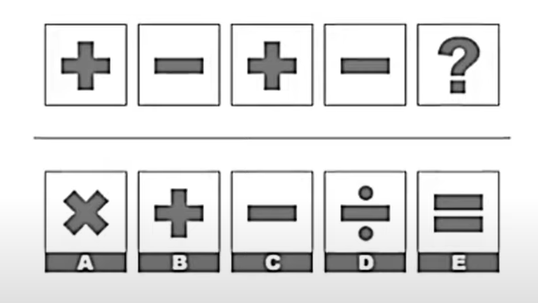{:width 450, :height 262}
			  card-last-interval:: 4
			  card-repeats:: 2
			  card-ease-factor:: 2.7
			  card-next-schedule:: 2025-09-28T12:25:58.389Z
			  card-last-reviewed:: 2025-09-24T12:25:58.390Z
			  card-last-score:: 5
			  Which of the following boxes should replace the question mark?
			  #card
				- **Answer**
					- B
		- ### Question 15
		  collapsed:: true
			- 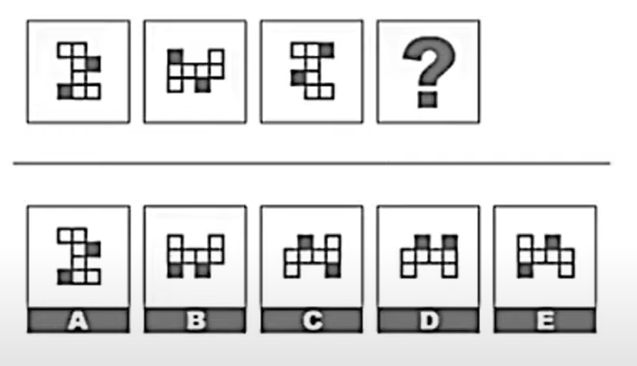{:width 450}
			  card-last-interval:: 4
			  card-repeats:: 2
			  card-ease-factor:: 2.7
			  card-next-schedule:: 2025-09-28T12:44:53.425Z
			  card-last-reviewed:: 2025-09-24T12:44:53.425Z
			  card-last-score:: 5
			  Which of the following boxes should replace the question mark? #card
				- **Answer**
					- C
		- ### Question 16
		  collapsed:: true
			- 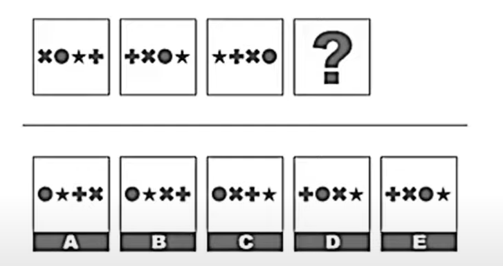{:width 450}
			  card-last-interval:: 11.2
			  card-repeats:: 3
			  card-ease-factor:: 2.8
			  card-next-schedule:: 2025-10-05T16:27:29.549Z
			  card-last-reviewed:: 2025-09-24T12:27:29.549Z
			  card-last-score:: 5
			  Which of the following boxes should replace the question mark? #card
				- **Answer**
					- A
		- ### Question 17
		  collapsed:: true
			- 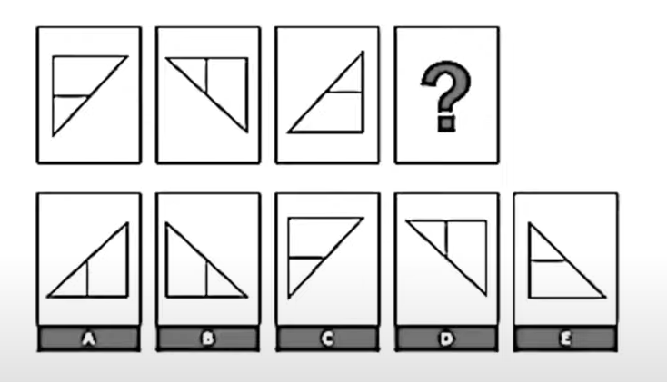{:width 450}
			  card-last-interval:: 4
			  card-repeats:: 2
			  card-ease-factor:: 2.7
			  card-next-schedule:: 2025-09-28T12:44:43.488Z
			  card-last-reviewed:: 2025-09-24T12:44:43.488Z
			  card-last-score:: 5
			  Which of the following boxes should replace the question mark? #card
				- **Answer**
					- B
		- ### Question 18
		  collapsed:: true
			- LADDER is to CLIMB as . . .
			  card-last-interval:: 11.2
			  card-repeats:: 3
			  card-ease-factor:: 2.8
			  card-next-schedule:: 2025-10-05T16:28:05.757Z
			  card-last-reviewed:: 2025-09-24T12:28:05.758Z
			  card-last-score:: 5
			  DIRT is to CLEAN
			  CHAIR is to SIT
			  NOVEL is to BOOK
			  TASTE is to SOUND
			  LIGHT is to BRIGHT #card
				- **Answer**
					- CHAIR is to SIT
		- ### Question 19
		  collapsed:: true
			- TERRIFY is to FRIGHTEN as ...
			  card-last-interval:: 4
			  card-repeats:: 2
			  card-ease-factor:: 2.7
			  card-next-schedule:: 2025-09-28T12:24:17.500Z
			  card-last-reviewed:: 2025-09-24T12:24:17.501Z
			  card-last-score:: 5
			  DEMAND is to REQUEST
			  EXPLORE is to IGNORE
			  BRAG is to SCOLD
			  PREDATOR is to PRAY
			  CHASE is to CAPTURE #card
				- **Answer**
					- DEMAND is to REQUEST
		- ### Question 20
		  collapsed:: true
			- INVISIBLE is to SEE as ...
			  card-last-interval:: 4
			  card-repeats:: 2
			  card-ease-factor:: 2.7
			  card-next-schedule:: 2025-09-28T12:27:21.046Z
			  card-last-reviewed:: 2025-09-24T12:27:21.046Z
			  card-last-score:: 5
			  UNATTAINABLE is to REACH
			  INTOLERABLE is to CONDEMN
			  INTENTIONAL is to REVERSE
			  IMPERFECT is to IMPROVE
			  INNATE is to RECOVER #card
				- **Answer**
					- UNATTAINABLE is to REACH
		- ### Question 21
		  collapsed:: true
			- What would be the next in the series?
			  card-last-interval:: 11.2
			  card-repeats:: 3
			  card-ease-factor:: 2.8
			  card-next-schedule:: 2025-10-05T16:27:59.389Z
			  card-last-reviewed:: 2025-09-24T12:27:59.389Z
			  card-last-score:: 5
			  wgfi ... yfgm ... aehq ... cdiu ?
			  fcjy
			  fbkz
			  ecjy
			  ecky
			  ebjz #card
				- **Answer**
					- ecjy
				- **Reason**
					- First letter -> Skips a letter alphabetically in each occurrence
					- Second letter -> is the reversed alphabet in each occurrence
					- Third letter -> is the alphabet order in each occurrence
		- ### Question 22
		  collapsed:: true
			- Assume the first 2 statements are True. Is the final statement:
			  card-last-interval:: 33.64
			  card-repeats:: 4
			  card-ease-factor:: 2.9
			  card-next-schedule:: 2025-10-28T03:26:23.892Z
			  card-last-reviewed:: 2025-09-24T12:26:23.893Z
			  card-last-score:: 5
			  1) True 2) False or 3) Uncertain based on facts provided
			  Randall is older than Nicole
			  Greg is younger than Nicole
			  Randall is younger than Greg
			  True
			  False
			  Uncertain #card
				- **Answer**
					- False
		- ### Question 23
		  collapsed:: true
			- Assume the first 2 statements are True. Is the final statement:
			  card-last-interval:: 4
			  card-repeats:: 2
			  card-ease-factor:: 2.7
			  card-next-schedule:: 2025-09-28T12:44:10.688Z
			  card-last-reviewed:: 2025-09-24T12:44:10.688Z
			  card-last-score:: 5
			  1) True 2) False or 3) Uncertain based on facts provided
			  Vivian is the only senior analyst at the headquarter office
			  Omar is a senior analyst
			  Omar does not work at the headquarter office
			  True
			  False
			  Uncertain #card
				- **Answer**
					- True
		- ### Question 24
		  collapsed:: true
			- Assume the first 2 statements are True. Is the final statement:
			  card-last-interval:: 4
			  card-repeats:: 2
			  card-ease-factor:: 2.7
			  card-next-schedule:: 2025-09-28T12:43:54.959Z
			  card-last-reviewed:: 2025-09-24T12:43:54.960Z
			  card-last-score:: 5
			  1) True 2) False or 3) Uncertain based on facts provided
			  Every person at meeting voted in favor of the merger
			  Julia was at the meeting
			  Julia voted in favor of the merger
			  True
			  False
			  Uncertain #card
				- **Answer**
					- True
		- ### Question 25
		  collapsed:: true
			- How many of items in the left hand column & right hand column are exactly
			  card-last-interval:: 15.72
			  card-repeats:: 3
			  card-ease-factor:: 2.7
			  card-next-schedule:: 2025-10-10T05:50:16.070Z
			  card-last-reviewed:: 2025-09-24T12:50:16.071Z
			  card-last-score:: 5
			  the same?
			  {:width 450} #card
				- **Answer**
					- 4
		- ### Question 26
		  collapsed:: true
			- How many of items in the left hand column & right hand column are exactly
			  card-last-interval:: 13.33
			  card-repeats:: 1
			  card-ease-factor:: 2.6
			  card-next-schedule:: 2025-10-07T19:50:47.130Z
			  card-last-reviewed:: 2025-09-24T12:50:47.130Z
			  card-last-score:: 5
			  the same?
			  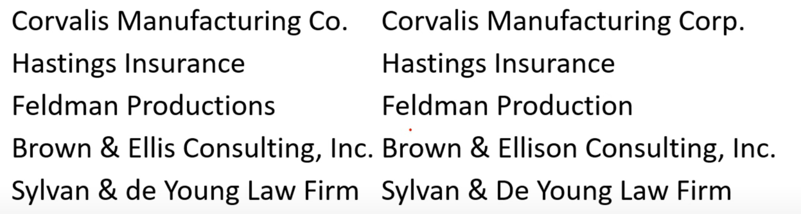{:width 450} #card
				- **Answer**
					- 1
		- ### Question 27
		  collapsed:: true
			- How many of items in the left hand column & right hand column are exactly
			  card-last-interval:: 4
			  card-repeats:: 2
			  card-ease-factor:: 2.7
			  card-next-schedule:: 2025-09-28T12:23:18.766Z
			  card-last-reviewed:: 2025-09-24T12:23:18.766Z
			  card-last-score:: 5
			  the same?
			  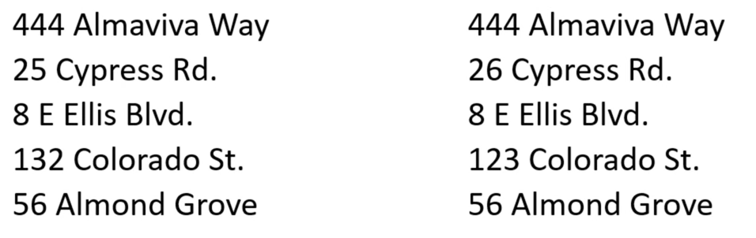{:width 450} #card
				- **Answere**
					- 3
		- ### Question 28
		  collapsed:: true
			- 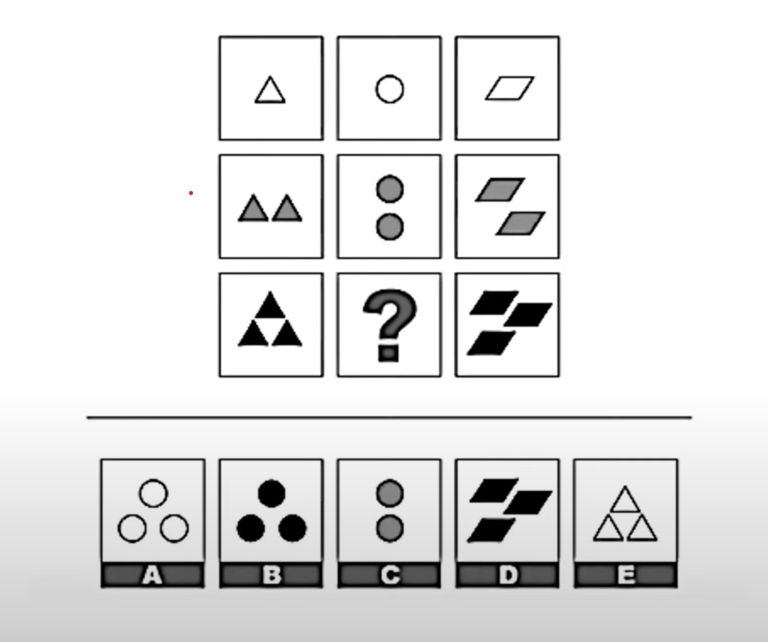{:width 450} 
			  card-last-interval:: 4
			  card-repeats:: 2
			  card-ease-factor:: 2.7
			  card-next-schedule:: 2025-09-28T12:43:14.832Z
			  card-last-reviewed:: 2025-09-24T12:43:14.833Z
			  card-last-score:: 5
			  Which of the following boxes should replace the question mark? #card
				- **Answer**
					- B
		- ### Question 29
		  collapsed:: true
			- 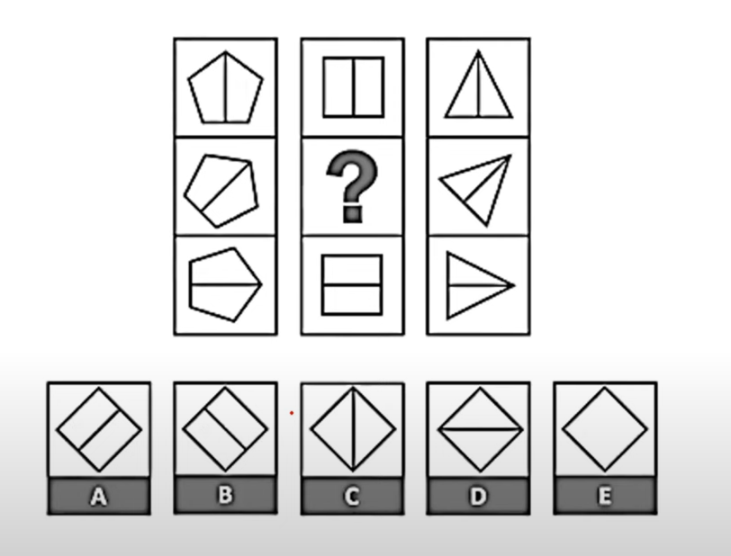{:width 450} 
			  card-last-interval:: 13.33
			  card-repeats:: 1
			  card-ease-factor:: 2.6
			  card-next-schedule:: 2025-10-07T19:50:54.935Z
			  card-last-reviewed:: 2025-09-24T12:50:54.935Z
			  card-last-score:: 5
			  Which of the following boxes should replace the question mark? #card
				- **Answer**
					- A
		- ### Question 30
		  collapsed:: true
			- 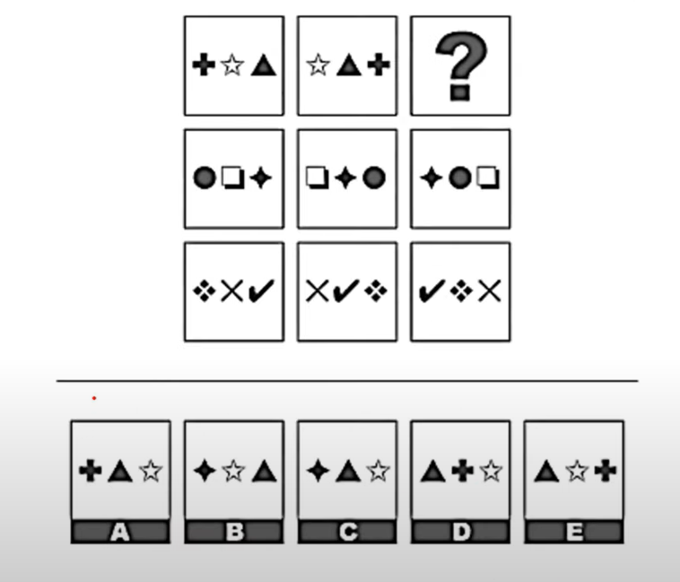{:width 450} 
			  card-last-interval:: 4
			  card-repeats:: 2
			  card-ease-factor:: 2.7
			  card-next-schedule:: 2025-09-28T12:45:48.472Z
			  card-last-reviewed:: 2025-09-24T12:45:48.472Z
			  card-last-score:: 5
			  Which of the following boxes should replace the question mark? #card
				- **Answer**
					- D
		- ### Question 31
		  collapsed:: true
			- ACCELERATE is to VELOCITY as ...
			  card-last-interval:: 33.64
			  card-repeats:: 4
			  card-ease-factor:: 2.9
			  card-next-schedule:: 2025-10-28T03:27:55.996Z
			  card-last-reviewed:: 2025-09-24T12:27:55.997Z
			  card-last-score:: 5
			  SOUND is to DECIBELS
			  INCARCERATE is to PRISON
			  LEVITATE is to ELEVATION
			  COMMISERATE is to WEIGHT
			  DENIGRATE is to REPUTATION #card
				- **Answer**
					- LEVITATE is to ELEVATION
		- ### Question 32
		  collapsed:: true
			- **Choose the word to fill in the blanks:**
			  card-last-interval:: 4
			  card-repeats:: 2
			  card-ease-factor:: 2.7
			  card-next-schedule:: 2025-09-28T12:43:30.159Z
			  card-last-reviewed:: 2025-09-24T12:43:30.160Z
			  card-last-score:: 5
			  The company's management ____ its resources extremely Carefully, in order to ensure every division maximized its profit.
			  -demonstrated
			  -elucidated
			  -constructed
			  -allocated
			  -hedged #card
				- **Answer**
					- Allocated
		- ### Question 33
		  collapsed:: true
			- **Choose the word to fill in the blanks:**
			  card-last-interval:: 11.2
			  card-repeats:: 3
			  card-ease-factor:: 2.8
			  card-next-schedule:: 2025-10-05T16:28:28.820Z
			  card-last-reviewed:: 2025-09-24T12:28:28.820Z
			  card-last-score:: 5
			  The politician's earlier association with the student movement ____ His reputation with some in his party.
			  -belittled
			  -damaged
			  -accentuated
			  -enlivened
			  -impressed #card
				- **Answer**
					- Damaged
		- ### Question 34
		  collapsed:: true
			- **Choose the word to fill in the blanks:**
			  card-last-interval:: 4
			  card-repeats:: 2
			  card-ease-factor:: 2.7
			  card-next-schedule:: 2025-09-28T12:43:44.493Z
			  card-last-reviewed:: 2025-09-24T12:43:44.493Z
			  card-last-score:: 5
			  The company needed to find a way to quantify and ____ the productivity of its employees in order to decide who deserved raises that year.
			  -correspond
			  -stabilize
			  -mitigate
			  -counteract
			  -measure
			   #card
				- **Answer**
					- Measure
		- ### Question 35
		  collapsed:: true
			- 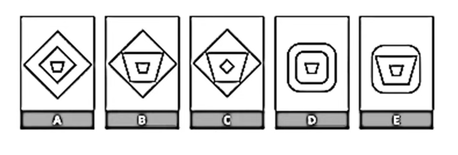{:width 450}
			  card-last-interval:: 4
			  card-repeats:: 2
			  card-ease-factor:: 2.7
			  card-next-schedule:: 2025-09-28T12:26:18.301Z
			  card-last-reviewed:: 2025-09-24T12:26:18.301Z
			  card-last-score:: 5
			  Which of the following does not belong? #card
				- **Answer**
					- C
		- ### Question 36
		  collapsed:: true
			- 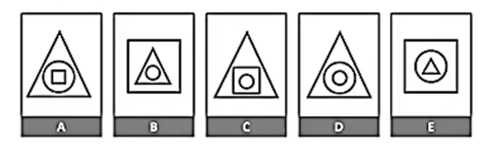{:width 450}
			  card-last-interval:: 4
			  card-repeats:: 2
			  card-ease-factor:: 2.7
			  card-next-schedule:: 2025-09-28T12:44:21.375Z
			  card-last-reviewed:: 2025-09-24T12:44:21.376Z
			  card-last-score:: 5
			  Which of the following does not belong #card
				- **Answer**
					- D
		- ### Question 37
		  collapsed:: true
			- 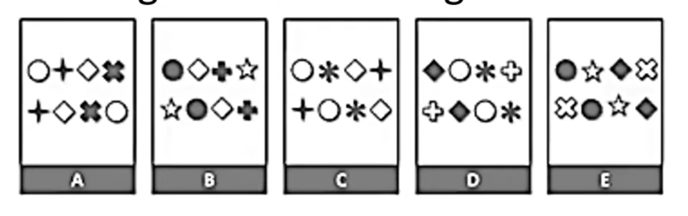{:width 450}
			  card-last-interval:: 11.2
			  card-repeats:: 3
			  card-ease-factor:: 2.8
			  card-next-schedule:: 2025-10-05T16:27:02.708Z
			  card-last-reviewed:: 2025-09-24T12:27:02.708Z
			  card-last-score:: 5
			  Which of the following does not belong? #card
				- **Answer**
					- A
		- ### Question 38
		  collapsed:: true
			- 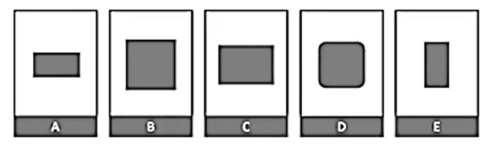{:width 450}
			  card-last-interval:: 33.64
			  card-repeats:: 4
			  card-ease-factor:: 2.9
			  card-next-schedule:: 2025-10-28T03:28:01.333Z
			  card-last-reviewed:: 2025-09-24T12:28:01.333Z
			  card-last-score:: 5
			  Which of the following does not belong? #card
				- **Answer**
					- D
		- ### Question 39
		  collapsed:: true
			- A store has a sale, where all jackets are sold at a discount of 40%. If regular price of jacket is $75, how many jackets could be bought at Sale price if a shopper spent $495?
			  card-last-interval:: 97.56
			  card-repeats:: 5
			  card-ease-factor:: 2.9
			  card-next-schedule:: 2025-12-31T01:49:23.999Z
			  card-last-reviewed:: 2025-09-24T12:49:23.999Z
			  card-last-score:: 5
			  11
			  12
			  13
			  14
			  15 #card
				- **Answer**
					- 11
				- **Reason**
					- if the discount is of 40%  the jacket coasts 60% of 75
						- 60% of 75 <-> 75% of 60 => 3/4 of 60 is 45
						- 45 * 10 is 450, one more is 495
		- ### Question 40
		  collapsed:: true
			- 36 is 15% of what number? 
			  card-last-interval:: 11.2
			  card-repeats:: 3
			  card-ease-factor:: 2.8
			  card-next-schedule:: 2025-10-05T16:25:16.959Z
			  card-last-reviewed:: 2025-09-24T12:25:16.959Z
			  card-last-score:: 5
			  220
			  225
			  235
			  240
			  250 #card
				- **Answer**
					- 240
				- **Logic**
					- I want to arrive at 10% for it's easier to calculate mentally.
						- 36 is divisible by 3
						- 15% is divisible by 3
						- 5% is 12 then 10% is 24 => 240 is the answer.