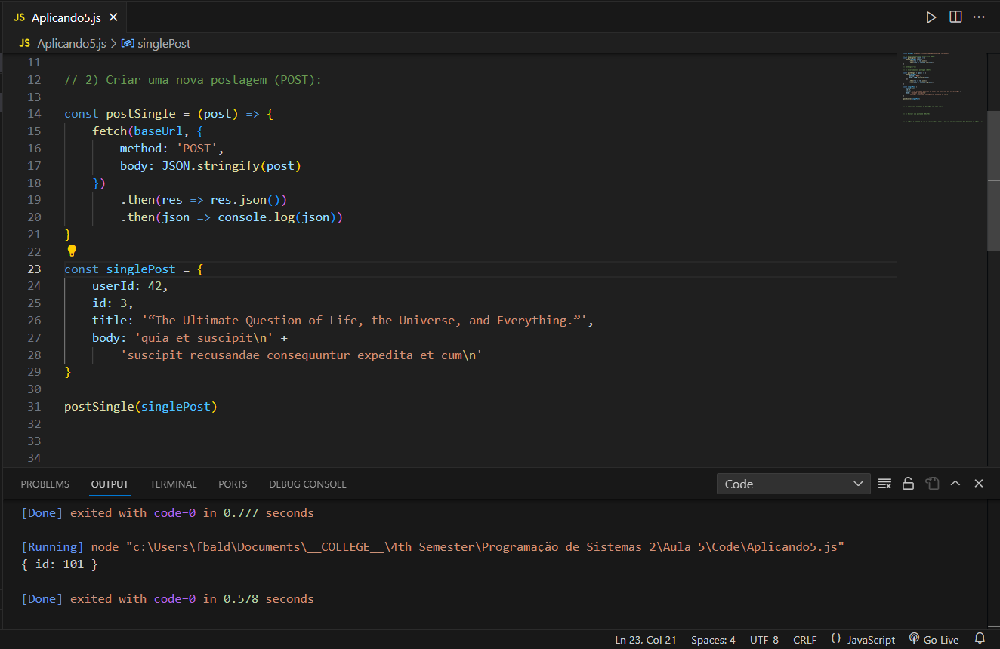
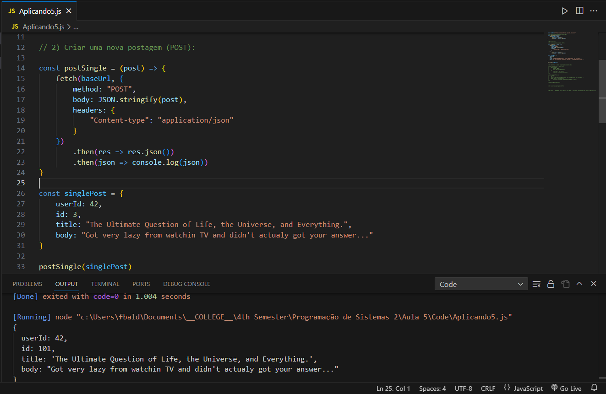
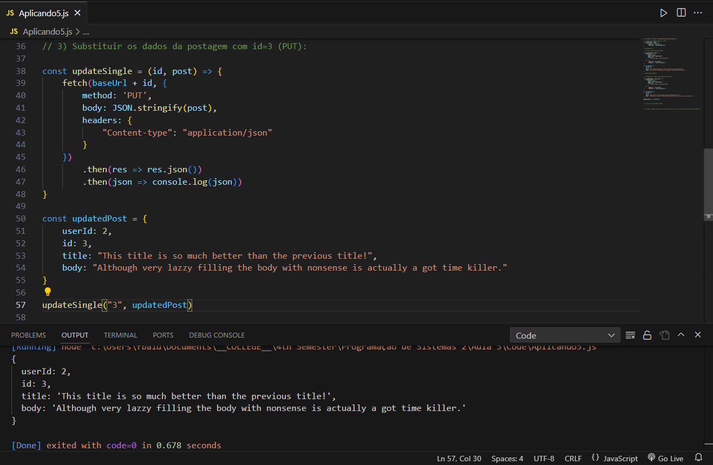
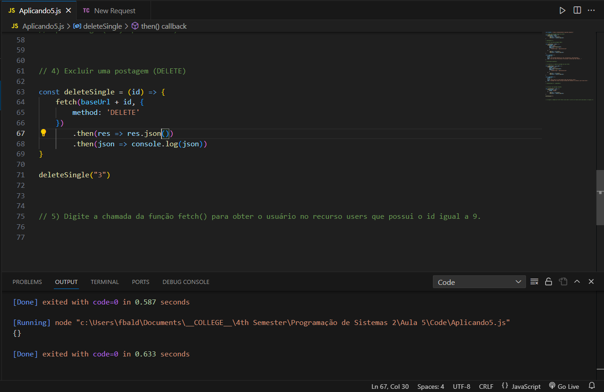
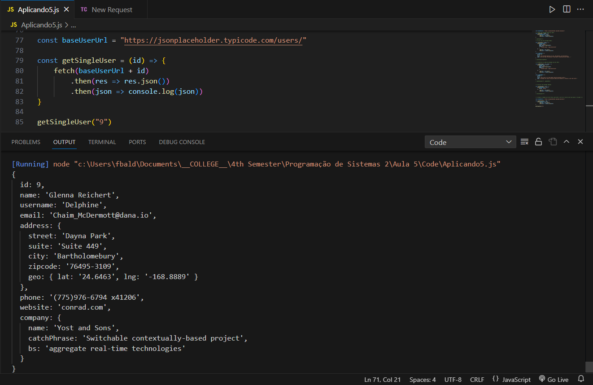

- [[Mackenzie]] [[4_Semester]]
- # Aula 1
  collapsed:: true
	- ## Ponto de Partida.
	  collapsed:: true
		- **Heritage** -> #card
		  card-last-interval:: 4
		  card-repeats:: 1
		  card-ease-factor:: 2.6
		  card-next-schedule:: 2023-08-13T11:50:26.887Z
		  card-last-reviewed:: 2023-08-09T11:50:26.888Z
		  card-last-score:: 5
			- Heritage is the fact that class that extends another one will maintain the methods such first class has.
			- All the Classes inherit the Class object
			- Decorator `@override` -> is to use the same name as the parent Class had used in a method.
		- **Polymorphism** -> #card
		  card-last-interval:: 4
		  card-repeats:: 1
		  card-ease-factor:: 2.6
		  card-next-schedule:: 2023-08-07T20:20:36.284Z
		  card-last-reviewed:: 2023-08-03T20:20:36.285Z
		  card-last-score:: 5
			- The Classes have the same methods and returns same types but the class is chose at the time of execution.
	- ## Texto de Apoio
		- 
		- ```Java 
		  super(...) // Call the value of hsuch param in the parent class
		  super.id // Calls the ID of the parent class if it may eb det as protected.
		  super.mehtod() // Access the methods of the parent class both public and private.
		  ```
		- **Polymorphism**  ->
			- overload or override.
			- **Overload** (Static) -> two methods with the same name however the input and return are different between the methods.
				- ```java 
				  // Example of Static Polymorphism
				  
				  public class A{
				    String calcula() {return 1;};
				    int calcula(int a){return a;};
				  }
				  ```
			- Polymorphism **Override** (Dynamic) -> #card
			  card-last-score:: 5
			  card-repeats:: 1
			  card-next-schedule:: 2023-08-07T20:20:31.893Z
			  card-last-interval:: 4
			  card-ease-factor:: 2.6
			  card-last-reviewed:: 2023-08-03T20:20:31.893Z
			  collapsed:: true
				- The Class that inherits the super class, can use the decorator: `@override` to make the method return a different result besides that already assigned to that method on super.
				- ```Java 
				  // Example of Dinamic Polymorphism
				  public class A {
				    int calcula() {return 1}
				    String metodoA(){return "Class A"}
				  }
				  
				  public class B extends A {
				    @override
				    int calcula() {return 2}
				    String metodoA(){return "Class B"}
				  }
				  ```
			- **Abstract Class** #card
			  card-last-interval:: 4
			  card-repeats:: 1
			  card-ease-factor:: 2.6
			  card-next-schedule:: 2023-08-07T20:20:12.557Z
			  card-last-reviewed:: 2023-08-03T20:20:12.558Z
			  card-last-score:: 5
			  collapsed:: true
				- It's a class with the `abstract` in the name an if the method may be abstract as well they should carry the `abstract` in the definitions as well.
				- All the children are going to implement the abstract methods with a `@override` decorator.
				- ```java 
				  public abstract class A {
				    public A(String name){
				      this.name == name;
				    }
				    String helloA(){return "Hello A";};
				    
				    int abstract numberOfA(int a){return a;};
				  }
				  
				  //  The abstract mehtod will have to implement all teh abstract mehtods
				  
				  ```
			- **Interface** -> #card
			  card-last-interval:: 4
			  card-repeats:: 2
			  card-ease-factor:: 2.7
			  card-next-schedule:: 2023-08-13T11:50:37.377Z
			  card-last-reviewed:: 2023-08-09T11:50:37.378Z
			  card-last-score:: 5
			  collapsed:: true
				- It's a set of rules that can implemented in the classes and it defines not how the method will operate but that such methods should exist.
				- ```java 
				  // Shape.java
				  public interface Shape {
				      double calculateArea();
				      double calculatePerimeter();
				  }
				  
				  // Rectangle.java
				  public class Rectangle implements Shape {
				      private double length;
				      private double width;
				  
				      public Rectangle(double length, double width) {
				          this.length = length;
				          this.width = width;
				      }
				  
				      @Override
				      public double calculateArea() {
				          return length * width;
				      }
				  
				      @Override
				      public double calculatePerimeter() {
				          return 2 * (length + width);
				      }
				  }
				  
				  // Circle.java
				  public class Circle implements Shape {
				      private double radius;
				  
				      public Circle(double radius) {
				          this.radius = radius;
				      }
				  
				      @Override
				      public double calculateArea() {
				          return Math.PI * radius * radius;
				      }
				  
				      @Override
				      public double calculatePerimeter() {
				          return 2 * Math.PI * radius;
				      }
				  }
				  
				  // Main.java
				  public class Main {
				      public static void main(String[] args) {
				          Rectangle rectangle = new Rectangle(5, 10);
				          Circle circle = new Circle(3);
				  
				          System.out.println("Rectangle Area: " + rectangle.calculateArea());
				          System.out.println("Rectangle Perimeter: " + rectangle.calculatePerimeter());
				  
				          System.out.println("Circle Area: " + circle.calculateArea());
				          System.out.println("Circle Perimeter: " + circle.calculatePerimeter());
				      }
				  }
				  // also the class can extend other class and implements multiple classes.
				  ```
	- ## Praticando
	  collapsed:: true
		- ```java 
		  public class Ponto {
		      private int x, y;
		      public Ponto(int x, int y) {
		          this.x = x;
		          this.y = y;
		      }
		      @override
		      public String toString() {
		          return "Ponto{ x= " + x + ", y= " + y +" }";
		      }
		  
		      public boolean equals(Ponto ponto) {
		          return x == ponto.x && y == ponto.y;
		      }
		  
		      public double distancia(Ponto ponto) {
		          return 13.54;
		      }
		  }
		  ```
		- ```java 
		  public class TestaPonto {
		      public static void main(String[] args) {
		          Ponto p1 = new Ponto(1, 2);
		          Ponto p2 = new Ponto(4, 6);
		          System.out.println("p1 => " + p1);
		          System.out.println("p2 => " + p2);
		          System.out.println("igauis => " + p1.equals(p2));
		          System.out.println("distancias => " + p1.distancia(p2));
		      }
		  }
		  ```
	- ## Aplicando Conhecimento
		-
- # Aula 5
	- ## Ponto de Partida
		- **Internet evolution**
			- Static pages vs. dynamic generated pages
	- ## Texto de Apoio
		- 
	- ## Aplicando Conhecimento
		- **Questão 1**
			- 
		- **Questão 1**
			- 
		- **Questão 3**
			- 
		- **Questão 4**
			- 
			- **Para:**
				- ```js
				  const deleteSingle = (id) => {
				      fetch(basePostUrl + id, {
				          method: 'DELETE'
				      })
				          .then(res => console.log(res))
				  }
				  ```
			- **Então Resposta seria:**
				- ```json 
				  Response {
				    [Symbol(realm)]: null,
				    [Symbol(state)]: {
				      aborted: false,
				      rangeRequested: false,
				      timingAllowPassed: true,
				      requestIncludesCredentials: true,
				      type: 'default',
				      status: 200,
				      timingInfo: {
				        startTime: 48.45729994773865,
				        redirectStartTime: 0,
				        redirectEndTime: 0,
				        postRedirectStartTime: 48.45729994773865,
				        finalServiceWorkerStartTime: 0,
				        finalNetworkResponseStartTime: 0,
				        finalNetworkRequestStartTime: 0,
				        endTime: 0,
				        encodedBodySize: 2,
				        decodedBodySize: 2,
				        finalConnectionTimingInfo: null
				      },
				      cacheState: '',
				      statusText: 'OK',
				      headersList: HeadersList {
				        cookies: null,
				        [Symbol(headers map)]: [Map],
				        [Symbol(headers map sorted)]: null
				      },
				      urlList: [ [URL] ],
				      body: { stream: undefined }
				    },
				    [Symbol(headers)]: HeadersList {
				      cookies: null,
				      [Symbol(headers map)]: Map(23) {
				        'date' => [Object],
				        'content-type' => [Object],
				        'content-length' => [Object],
				        'connection' => [Object],
				        'report-to' => [Object],
				        'reporting-endpoints' => [Object],
				        'nel' => [Object],
				        'x-powered-by' => [Object],
				        'x-ratelimit-limit' => [Object],
				        'x-ratelimit-remaining' => [Object],
				        'x-ratelimit-reset' => [Object],
				        'vary' => [Object],
				        'access-control-allow-credentials' => [Object],
				        'cache-control' => [Object],
				        'pragma' => [Object],
				        'expires' => [Object],
				        'x-content-type-options' => [Object],
				        'etag' => [Object],
				        'via' => [Object],
				        'cf-cache-status' => [Object],
				        'server' => [Object],
				        'cf-ray' => [Object],
				        'alt-svc' => [Object]
				      },
				      [Symbol(headers map sorted)]: null
				    }
				  }
				  ```
		- **Questão 5**
			- 