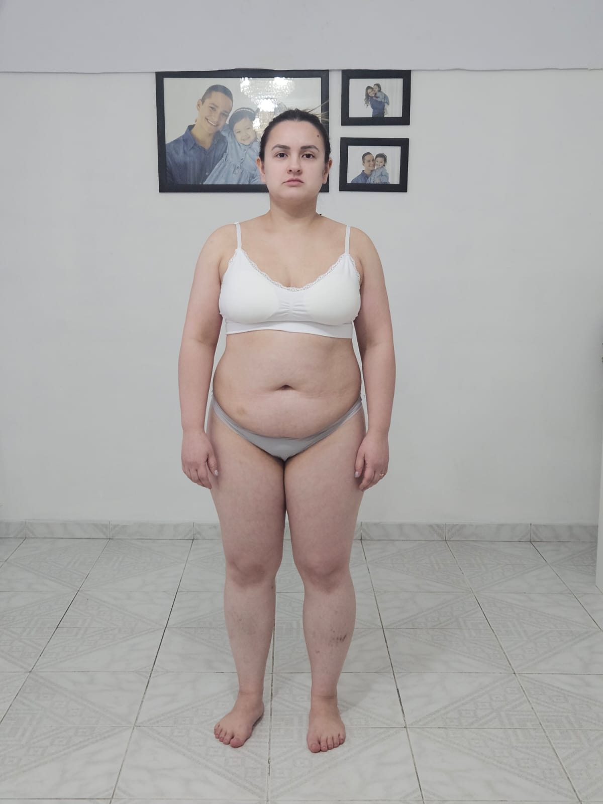
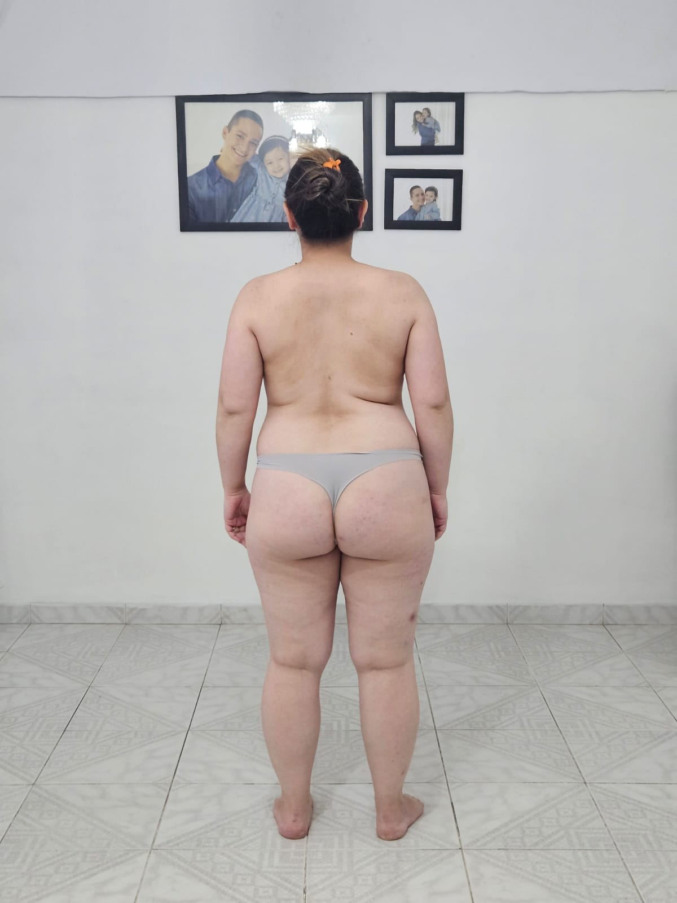
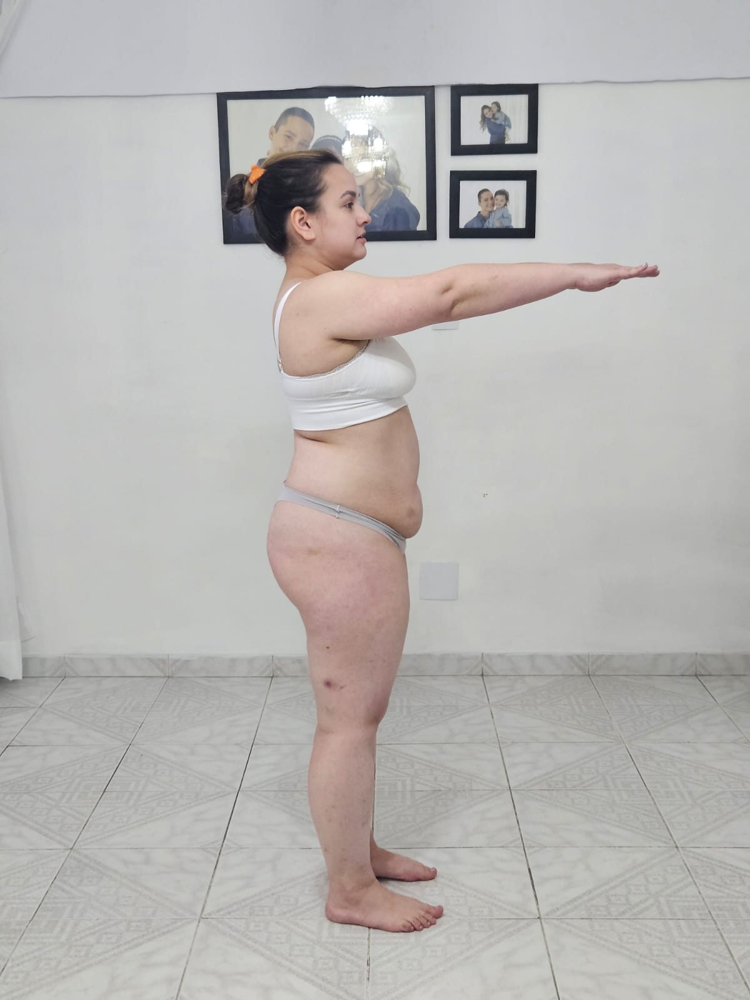

# Project Scope
collapsed:: true
	- The idea is to lose fat around the body while maintaining, or gaining strength
	- The training will consist of a a sum of endurance and power.
		- For the **endurance** a static bicycle will be used
		- For the **power** training, at least on the first phase (6 weeks), the exercises will consist of body weight only, given the previous lack of training
- # Exercises and schedules
  collapsed:: true
	- The training will be going for 6 weeks, from [[Feb 17th, 2025]] to [[Mar 31st, 2025]]
	- ## A -> Strength
		- |Exercise|Sets|Repetitions / Time|Rest|Exertion Perception |Obs|
		  |Push Up plank |3|30s|30s|7|Good time and rest|
		  |Knee elevation standing|3|30s| - |8.5| Should have been 30/30|
		  |Knee Push Up|3|10 reps|2:30|7|Good Time and rest|
		  |Sit ups|3|10|2:30|6|Good Time and rest|
		-
	- ## B
	- ## C
	- ## D
	-
- # Measurements
	- | Body Part | 17FEV25 (cm) | 08AUG25 (cm) | Dif (cm) |
	  |Neck|34|33.5||
	  |Torax|94|95||
	  |Belly up 5cm from belly button|88|85||
	  |Belly down 5 cm from belly button|105|102||
	  |Hip|112|108.5||
	  |High Tight Right|66|66||
	  |High Tight Left|65|67||
	  |Low Tight Right|53|48.5||
	  |Low Tight Left|53|48.5||
	  |Calf Right|41|40.5||
	  |Calf Left|42|41||
	  |Biceps Right |31|30.5||
	  |Biceps Left|31|30.5||
		-
	-
- # Photos
  collapsed:: true
	- Start
		- |17FEV25| 31MAR25|
		  |_1739837514963_0.jpg){:height 499, :width 368}| {:height 499, :width 368} |
		  |_1739837543724_0.jpg)| {:height 499, :width 368} |
		  |_1739837569988_0.jpg)| {:height 499, :width 368} |
		  |_1739837581270_0.jpg){:height 499, :width 368}| {:height 499, :width 368} |
		-