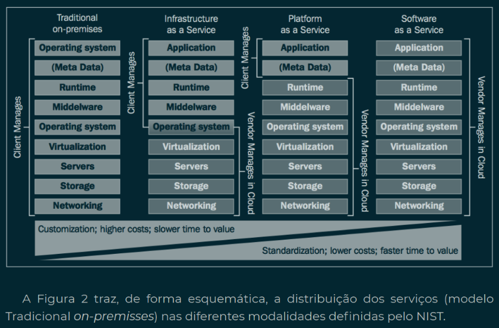

# Review
	- DONE Serviços em Nuvem - Aula 1 [[Mar 7th, 2024]]
	  :LOGBOOK:
	  CLOCK: [2024-03-07 Thu 05:36:04]--[2024-03-07 Thu 05:37:59] =>  00:01:55
	  :END:
	- DONE Serviços em Nuvem - Aula 1 [[Mar 13th, 2024]]
	- DONE Serviços em Nuvem - Aula 1 [[Apr 6th, 2024]]
- # Aula 1
	- ## Ponto de Partida
		- AWS - Cloud Services
	- ## Texto de Apoio
		- 
		- ### Characteristics of cloud services
			- Auto service on demand
			  logseq.order-list-type:: number
			- Broad Network Access
			  logseq.order-list-type:: number
			- Resource Sharing
			  logseq.order-list-type:: number
			- Fast Elasticity
			  logseq.order-list-type:: number
			- Measured Services
			  logseq.order-list-type:: number
		- ### Service Models
			- 
			- SaaS - Software as Service
			  logseq.order-list-type:: number
			- PaaS - Platform as Service
			  logseq.order-list-type:: number
			- IaaS - Infrastructure as Service
			  logseq.order-list-type:: number
		- ### Distribution Models
			- Private Cloud
			  logseq.order-list-type:: number
			- Community Cloud
			  logseq.order-list-type:: number
			- Public Cloud
			  logseq.order-list-type:: number
			- Hybrid Cloud -> Fastest Growing (different previous entities that share data)
			  logseq.order-list-type:: number
	- ## Professor Resolve
		- Variable Storage S3
			- Uload your files for the static page
			  logseq.order-list-type:: number
			- Enable public access to the repository
			  logseq.order-list-type:: number
			- Enable public access to the files
			  logseq.order-list-type:: number
			- logseq.order-list-type:: number
			- logseq.order-list-type:: number