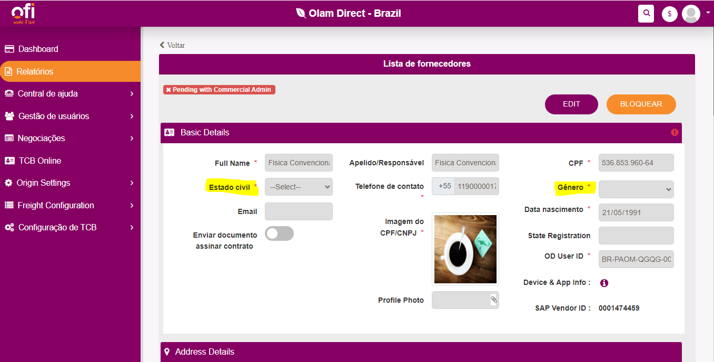

- #### The present document brings all the current errors that must be resolved in order to it be a proper working tool for the Cocoa Business Team and the farmer to use and trust this product. Last update: Feb 23th, 2023
  ---
- # User Registration:
	- ## Errors:
		- ### Portal does not load user information properly -> Feb 02, 2023
			- Wen the profile for the farmer is open in the Portal the information regarding gender and marital status consistently is not displayed.
			- It was tested more than once, with hard refresh on the browser in between the attempts.
			- 
		- ### App does not allow photo insertion -> Feb 02, 2023
			- The app does not accept photo, instead closes automatically without any warning.
	- ## Must
		- ### Adress number in user registration -> Dec 29, 2022
			- Is not possible to find an address without a number, this must be inserted in the user registration both in the portal and in the app.
			- Is not possible to reach the farmer without it.
- # Agronomy
	- ## Error
		- ### Admin cannot create a survey
			- After selecting the questions for the survey and the correct location the survey is not submitted.
- # Fixed price (E2E)
	- ## Must
		- ### See amount on negotiation list
			- In the pending approval transactions is possible to see the weight for the transaction, however for the In the **Bid Back** and **Open Transactions** transaction is not.
- # Farmer App - Fixed price
	- ## Errors
		- ### Cocoa price units of measurement.
			- In the landing page the price is in **R$/kg** => should be the possibility for **R$/@** and **R$/sc**.
			- In the transaction page, the **Atual** **Max** and **Min** prices are in **R$/sc** but with the value of **R$/kg**
		- ### Translation to Portuguese.
			- **Type of contract** -> still in English
			- **Payment Terms** -> still in English
- # Portal - Fixed Price
	- ## Errors
		- ### Unable to fetch existing farmer freight cost
			- If the farmer has farms that are not defined in the freight logic under freight cost but has one that is -> even thought one is on the logic it is not possible to create a contract for this farmer.
			- Note: The exactly same address is working for other producers.
		- ### Net price to SAP.
			- The net price is not correct it is necessary a meeting to understand what is happening and what need to be changed in order for it to work.