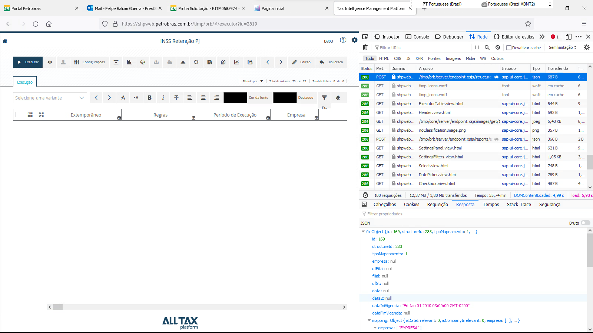

# Transfer to TD1
	- ## Correction Field Mapping With Item
	- DONE /timp/mdr/server/controllers/correctionFieldMappingWithItem.xsjslib
	  :LOGBOOK:
	  CLOCK: [2024-01-29 Mon 16:10:36]--[2024-01-29 Mon 16:40:04] =>  00:29:28
	  :END:
	- DONE /timp/mdr/server/models/tables/correctionFieldMappingWithItem.xsjslib
	  :LOGBOOK:
	  CLOCK: [2024-01-29 Mon 16:40:12]--[2024-01-29 Mon 16:40:26] =>  00:00:14
	  :END:
	- DONE /timp/mdr/ui/app/controllers/correctionFieldMappingWithItem/list.controller.js
	  :LOGBOOK:
	  CLOCK: [2024-01-29 Mon 16:40:08]--[2024-01-29 Mon 16:41:43] =>  00:01:35
	  CLOCK: [2024-01-29 Mon 16:43:59]--[2024-01-29 Mon 16:44:41] =>  00:00:42
	  :END:
	- DONE /timp/mdr/ui/app/views/correctionFieldMappingWithItem/list.view.html
	  :LOGBOOK:
	  CLOCK: [2024-01-29 Mon 16:40:28]--[2024-01-29 Mon 16:41:42] =>  00:01:14
	  :END:
	- DONE /timp/mdr/server/endpoints/correctionFieldMappingWithItem.xsjs
	  :LOGBOOK:
	  CLOCK: [2024-01-29 Mon 16:41:46]--[2024-01-29 Mon 16:43:48] =>  00:02:02
	  :END:
	- NOW /timp/mdr/ui/app/config/endpoints.js
	  :LOGBOOK:
	  CLOCK: [2024-01-29 Mon 16:50:36]
	  :END:
	- DONE /timp/mdr/ui/i18n/ptrbr.i18n
	- DONE /timp/mdr/ui/i18n/enus.i18n
- # Notes
  collapsed:: true
	- As it use the structure 283 for the field in the report I went to inspect it. Seams that the the calculated column: CA_PERCENT_BASE_INSS, has a typo in the code that defines it: 
	  logseq.order-list-type:: number
		- logseq.order-list-type:: number
		  ```sql 
		  jf("VL_TOTAL_DOCUMENTO"!=0
		  ,("VL_BC_INSS"/"VL_TOTAL_DOCUMENTO")*100,0.0)
		  
		  -- Couldn't be:
		  
		  if("VL_TOTAL_DOCUMENTO"!=0
		  ,("VL_BC_INSS"/"VL_TOTAL_DOCUMENTO")*100,0.0)
		  ```
	- the date o n the input params should be the emission date.
	  logseq.order-list-type:: number
	- The code seams to be running ok, so I'm going to analyse the View portion of the problem.
	  logseq.order-list-type:: number
- # Comparative analysis before and after changes
	- ## Report 4039
	  background-color:: green
		- **Before:** 2min 46sec 70cent
		- **After:** 2min 29sec 10cent
	- ## Report 4034
	  background-color:: red
		- **Before:** 01min 57sec 60cent
		- **After:** -> **no evidence**
	- ## Report 4035
	  background-color:: green
		- **Before:** 06min 31sec 28cent
		- **After:** 06min 44sec 21cent
	- ## Report 4038
	  background-color:: red
		- **Before:** 05min 27sec 85cent
		- **After:** 05min 27sec 85cent
		- **Exactly equal ?**
	- ## Report 4037
	  background-color:: green
		- **Before:** 01min 46sec 02cent
		- **After:** 01min 49sec 88cent
	- ## Report 4036
	  background-color:: red
		- **Before:** 02min 05sec 54cent
		- **After:** -> **No Evidence**
	- ## Report 4030
	  background-color:: red
		- **Before:** 04min 54sec 94cent
		- **After:** -> **No Evidence**
- # CV Analysis
  collapsed:: true
	- ## NF_RETIDOS_PETROBRAS_INSS
	- ## NF_RETIDOS_PETROBRAS
		- ### Calculation in Joins Rule
		  collapsed:: true
			- In J_PARTICIPANTE node, the calculated column COD_PART is used in the join definition of the input J_NF_IMPOSTO_IMPOSTO_RETIDO
			- In J_PARTICIPANTE node, the calculated column TIPO_PART is used in the join definition of the input   J_NF_IMPOSTO_IMPOSTO_RETIDO
			- In J_PARTICIPANTE node, the calculated column COD_PART is used in the join definition of the input    P_PARTICIPANTE
			- In J_PARTICIPANTE node, the calculated column TIPO_PART is used in the join definition of the input    P_PARTICIPANTE
			- In J_NF_AUSP_SIMPLES node, the calculated column COD_PART_AUSP is used in the join definition of the input J_SIGLA_GERENTE
			- In J_NF_AUSP_PIS node, the calculated column COD_PART_AUSP is used in the join definition of the input J_NF_AUSP_SIMPLES
			- In J_NF_AUSP_CBO node, the calculated column COD_PART_AUSP is used in the join definition of the input J_NF_AUSP_PIS
			- In J_NF_RBKP node, the calculated column CA_GJAHR is used in the join definition of the input A_CHAVE_MIRO
			- In J_NF_RBKP node, the calculated column CA_BELNR is used in the join definition of the input A_CHAVE_MIRO
			- AIn J_PROT_MUN_FRS node, the aggregated column DOCUMENTO is used in the join defintion of the input J_PROT_DOC_FRS
			- In J_NF_Z_CRCTRIB node, the calculated column COD_ITEM is used in the join definition of the input J_PROT_MUN_FRS
			- AIn J_NF_Z_CRCTRIB node, the calculated column NUM_REF_LANCTO is used in the join definition of the input A_DISTINCT_FULL_TABLE
			- In J_NF_TAFS_2 node, the calculated column COD_ITEM is used in the join definition of the input J_NF_Z_CRCTRIB
			- AIn J_NF_TAFS node, the calculated column COD_ITEM is used in the join definition of the input J_NF_TAFS_2
			- In J_NF_TAFS node, the calculated column CA_LOC_DOMICILIO_ISS_JOIN is used in the join definition of the input J_NF_TAFS_2
			- AIn J_LC116_ZSER node, the calculated column COD_ITEM is used in the join definition of the input J_NF_TAFS
			- In J_NF_PROT_YZR node, the calculated column NUM_DOC is used in the join definition of the input J_LC116_ZSER
			- In J_NF_PROT_YZR node, the calculated column SER is used in the join definition of the input J_LC116_ZSER
			- In J_NF_PROT_YZR node, the calculated column CNPJ_CPF is used in the join definition of the input J_LC116_ZSER
			- AIn J_LC116_FEDERAL node, the calculated column COD_ITEM is used in the join definition of the input J_NF_PROT_YZR
			- A In J_SIOF_INSS node, the calculated column CNPJ_CPF is used in the join definition of the input P_LC116_NOT_NULL
			- In J_SIOF_INSS node, the calculated column YYNUM_CONTRATO_SEMP_PROT is used in the join definition of the input P_LC116_NOT_NULL
			- In J_SIOF_INSS node, the calculated column COD_ITEM is used in the join definition of the input P_LC116_NOT_NULL
			- AIn J_SIOF_INSS node, the calculated column ZSER_SIOF is used in the join definition of the input P_SIOF_INSS
			- AIn J_MUN_CONT node, the calculated column CA_JOIN_COD_MUNICIPIO_CONTRATADA is used in the join definition of the input P_SIOF_ISS
			- AIn J_INSS_LC116_00 node, the calculated column CNPJ_CPF is used in the join definition of the input P_LC116_NULL
			- A In J_INSS_LC116_00 node, the calculated column YYNUM_CONTRATO_SEMP_PROT is used in the join definition of the input P_LC116_NULL
			- AIn J_INSS_LC116_00 node, the calculated column COD_ITEM is used in the join definition of the input P_LC116_NULL
			- A In J_INSS_LC116_00 node, the calculated column ZSER_SIOF is used in the join definition of the input A_ZSER_SIOF
			- AIn J_SIOF_ISS node, the calculated column YYNUM_CONTRATO_SEMP_PROT is used in the join definition of the input U_SIOF_INSS
			- A In J_SIOF_ISS node, the calculated column COD_ITEM is used in the join definition of the input U_SIOF_INSS
			- In J_SIOF_ISS node, the calculated column CNPJ_CPF is used in the join definition of the input U_SIOF_INSS
			- A In J_SIOF_ISS node, the calculated column CA_JOIN_COD_MUN_FRS_7 is used in the join definition of the input U_SIOF_INSS
			- A In J_SIOF_ISS node, the calculated column ZSER_SIOF is used in the join definition of the input J_UF_CONTRATADA
			- A In J_NF_MUN_ISS_RET node, the calculated column CA_JOIN_DESC_MUN_ISS_RETIDO is used in the join definition of the input P_CALC_SIOF
			- AIn J_UF_ISS_RET node, the calculated column CA_JOIN_DESC_MUN_ISS_RETIDO is used in the join definition of the input J_NF_MUN_ISS_RET
			- In J_MUN_TAFS node, the calculated column CA_JOIN_DESC_MUN_TAFS is used in the join definition of the input J_UF_ISS_RET
			- A In J_UF_MUN_TAFS node, the calculated column CA_JOIN_DESC_MUN_TAFS is used in the join definition of the input J_MUN_TAFS
		- ### A Calculation in Filter Expressions Rule
		  collapsed:: true
			- In P_IMPOSTO_RETIDO node, the calculated column NUM_LCTO_STARTS_WITH is used in the filter expression
			- In P_SIOF_LC116_00 node, the aggregated column CV_RETENCAO_INSS_SN is used in the filter expression
		- ### Base Nodes Select Analyis
		  collapsed:: true
			- #### NF_IMPOSTO_RETIDO
				- Successfully executed in **477 ms 247 µs**  (server processing time: **335 ms 168 µs**)
				  Fetched 94 row(s) in **283 ms 963 µs** (server processing time: **2 ms 154 µs**)
				- 
				-
			- #### LANCAMENTO_CONTABIL
				- **Obs:** The exercicio could be mappend to receive a IP for the analysis show the following at least in TQ1 where the data is lesser then in PHP:
				  collapsed:: true
					- 
					-
				- Successfully executed in **3.213 seconds**  (server processing time: **3.070 seconds**)
				  Fetched 1000 row(s) in **733 ms 138 µs** (server processing time: **14 ms 419 µs**)
				  Result limited to 1000 row(s) due to value configured in the Preferences
				- 
				-
			- #### NF_DOCUMENTO
				- successfully executed in **998 ms 0 µs**  (server processing time: **714 ms 130 µs**)
				  Fetched 1000 row(s) in **862 ms 742 µs** (server processing time: **16 ms 649 µs**)
				  Result limited to 1000 row(s) due to value configured in the Preferences
				- 
			- #### NF_ITEM
				- Sccessfully executed in **3.178 seconds**  (server processing time: **2.902 seconds**)
				  Fetched 1000 row(s) in **855 ms 663 µs** (server processing time: **25 ms 222 µs**)
				  Result limited to 1000 row(s) due to value configured in the Preferences
				- 
				-
			- #### NF_IMPOSTO
				- Successfully executed in **952 ms 936 µs**  (server processing time: **813 ms 822 µs**)
				  Fetched 1000 row(s) in **698 ms 395 µs** (server processing time: **5 ms 705 µs**)
				  Result limited to 1000 row(s) due to value configured in the Preferences
				- 
				-
			- #### **Full View Execution**
				- Successfully executed in **25.559 seconds**  (server processing time: **25.280 seconds**)
				  Fetched 136 row(s) in **415 ms 908 µs** (server processing time: **3 ms 867 µs**)
					- SQL Code:
						- ```
						  SELECT "CA_PERCENT_BASE_INSS", "ALIQ_INSS_EFETIVA", 
						  "PER_DT_DOC", "PER_DT_E_S", "CA_DOMICILIO_FISCAL_ISS_7", 
						  "MANDT", "NF_ID", "NUM_ITEM", "EMPRESA", 
						  "FILIAL", "DESC_MUN_ISS_RETIDO", "CA_VLR_ISS_DOC_CONT", 
						  "CA_BASE_ISS_DOC_CONT", SUM("CA_VLR_INSS_DOC_CONT"), 
						  SUM("CA_BASE_INSS_DOC_CONT"), "CA_VLR_COF_DOC_CONT", 
						  "CA_BASE_COF_DOC_CONT", "CA_VLR_PIS_DOC_CONT", 
						  "CA_BASE_PIS_DOC_CONT", "CA_VLR_CSLL_DOC_CONT", 
						  "CA_BASE_CSLL_DOC_CONT", "CA_VLR_IR_DOC_CONT", 
						  "CA_BASE_IR_DOC_CONT", "COD_CTA_PISCOFINSCSLLIR", 
						  "COD_CTA_ISS", "COD_CTA_INSS", 
						  "DOC_COMPENSACAO", "COD_SUSP_ADIC", "NR_PROC_RET_ADIC", 
						  "TP_PROC_RET_ADIC", "COD_SUSP_PRINC", 
						  "NR_PROC_RET_PRINC", "TP_PROC_RET_PRINC", "TP_SERVICO", 
						  "IND_CPRB", "IND_OBRA", "MOEDA", "DOCMIRO_ESTORNO", 
						  "CARAC_CBO", "CARACT_SIMPLES", "DOC_HEADER_TEXT", 
						  "NUM_LCTO", "EXERCICIO", "DT_LCTO", 
						  "NUM_REF_LANCTO", "NBS", "DT_AUTH", "IND_PGTO", 
						  "NF_SRV", "DT_COMP", "KONNR", "IE", "ALIQ_IR_RET", 
						  "ALIQ_CSL_RET", "ALIQ_COFINS_RET", "ALIQ_PIS_RET", 
						  "TIPO_SERV_IMP", "L_DOM_FISCAL_ISS_RETIDO", 
						  "ALIQ_ISSQN", "DOCSTAT", "IND_SERVICO", "CENTRO", 
						  "VL_TOTAL_DOCUMENTO", "DT_EXTEMPORANEA", 
						  "HR_E_S", "IM_FILIAL", "IE_FILIAL", "CNPJ_FILIAL", 
						  "TIPO_PART", "IND_OPER", "TIPO_OPER", "SUB", 
						  "SER", "OBSERVACAO", "NOME_USUARIO", "CHV_CONDICAO", 
						  "IND_EMIT", "MANUAL", "PAIS", "INCOTERMS1", 
						  "IM", "COD_SIT", "CANCELADO", "SYS_TIPO_NF", 
						  "COD_PART", "DT_CANC", "DT_CRIACAO", "CHV_NFE", 
						  "FUN_PARC", "DIRECT", "NUM_DOC", "DOCREF", "PCO_CATEGORY", 
						  "COD_MOD", "DT_E_S", "PROTOCOLO_PROT", 
						  "J_1BBRANCH_PROT", "NFNUM_NFE_PROT", "GRAURISCO_PROT", 
						  SUM("BASEINSS_PROT"), "TOTALRETENCOES_PROT", 
						  "VLVALETRANSPORTE_PROT", "VLVALEALIMENTA_PROT", 
						  "VLEQUIPAMENTO_PROT", "COD_MUNICIPAL_LEI_116_PROT", 
						  "BASEISS_PROT", "VLMATERIAL_PROT", "YYNUM_CONTRATO_PROT", 
						  SUM("CA_VLR_INSS_CP_DOC_CONT"), 
						  "CARAC_PIS", "COND_REDISS_MUN_TAFS", "RED_BCISS_MUN_TAFS", 
						  "ALIQ_ISS_MUN_TAFS", "RETENCAO_MUN_TAFS", 
						  "COD_MUN_FRS", "COND_REDISS_NF_TAFS", "RED_BCISS_NF_TAFS", 
						  "ALIQ_ISS_NF_TAFS", "RETENCAO_NF_TAFS", 
						  "COD_MUN_TAFS", "CHAVE_IRF", "CAT_COD_IRF_INSS", 
						  "CAT_COD_IRF_INSS_MULTA", "CAT_COD_IRF_ISS", 
						  "CAT_COD_IRF_IRRF", "CAT_COD_IRF_CSLL", 
						  "CAT_COD_IRF_PIS", "CAT_COD_IRF_COFINS", "CAT_COD_IRF_CIDE", 
						  "CAT_COD_IRF_IOF", "COD_CTA_IOF", 
						  "CA_BASE_IOF_DOC_CONT", "CA_VLR_IOF_DOC_CONT", 
						  "COD_CTA_CIDE", "CA_BASE_CIDE_DOC_CONT", "CA_VLR_CIDE_DOC_CONT", 
						  "COD_ITEM", "CFOP", "COD_ITEM_LC116_ZSER_TAFS", 
						  "CA_JOIN_DESC_MUN_ISS_RETIDO", 
						  "YYNUM_CONTRATO_SEMP_PROT", "CNPJ_CPF", "COMPL", 
						  "NOME", "UF", "DESC_MUN", "CEP", "BAIRRO", "NUMERO", 
						  "ENDE", "YYSIGLA_GER", SUM("VL_INSS_MULTA"), 
						  SUM("LIMITE_REDUCAO_INSS"), "CONDICAO_REDUCAO_INSS", 
						  "VL_BC_IR", "VL_BC_CS", "VL_BC_CO", "QTD", 
						  "VL_IR_RET", "VL_CSLL_RET", "VL_BC_RET", SUM("VL_INSS"), 
						  SUM("VL_BC_INSS"), "VL_COFINS_RET", 
						  "VL_PIS_RET", "VL_ISSQN", "VL_BC_ISSQN", "VL_LIQ_IMP", 
						  "VL_UNID", "VL_MERC", "VL_DESC", "VL_OPR_ENTRADA", 
						  "VL_SEG", "VL_FRT", "VL_OUT", "VLR_NRET_ADIC", 
						  "VLR_ADICIONAL", "VLR_SERVICOS_25", "VLR_SERVICOS_20", 
						  "VLR_SERVICOS_15", "VLR_NRET_PRINC", 
						  "VLR_RET_SUB", "VLR_RETENCAO", "VLR_BASE_RET", 
						  "ERNAM", "YYGERENTE", "DESC_MUN_FRS", "UF_MUN_ISS_RETIDO", 
						  "UF_MUN_TAFS", "UF_FILIAL", "LEDGER", 
						  "UF_MUN_FRS", "CNPJ_CONTRATADA_SIOF", "COD_ITEM_LC116_SIOF", 
						  "LOCAL_PREST_SIOF", "PREV_REEMB_SIOF", 
						  "DESCR_SIOF", "COD_NBS_SIOF", "DESCR_NBS_SIOF", 
						  "NOME_CONTR_SIOF", "CNAE_PRINCIPAL_SIOF", 
						  "NATUREZA_SIOF", "RELACAO_CONTRATUAL_SIOF", "UNIDADE_ECONOMICA_SIOF", 
						  "CONFLITO_LC11603_SIOF", 
						  "MUN_EXIGE_NAO_ESTABELEC_SIOF", "DESCRICAO_LC116_SIOF", 
						  SUM("BASE_CALCULO_INSS_SIOF"), "BASE_CALCULO_ISS_SIOF", 
						  "ALIQUOTA_RETENCAO_TF_SIOF", "ALIQUOTA_RETENCAO_ISS_SIOF", 
						  MAX("ALIQUOTA_RETENCAO_INSS_SIOF"), 
						  "GRAU_RISCO_INSS_SIOF", "PERM_DED_BC_ISS_SIOF", 
						  "COD_RET_INSS_SIOF", "COD_RET_TF_SIOF", 
						  "OBSERVACAO_S_INSS_SIOF", "OBSERVACAO_S_ISS_SIOF", 
						  "OBSERVACAO_S_TF_SIOF", "OBSERVACAO_N_INSS_SIOF", 
						  "OBSERVACAO_N_ISS_SIOF", "OBSERVACAO_N_TF_SIOF", 
						  "CV_RETENCAO_INSS_SN_SIOF", "CV_RETENCAO_TF_SN_SIOF", 
						  "CV_RETENCAO_ISS_SN_SIOF", 
						  "COD_MUNICIPIO_CONTRATADA_SIOF", "COD_MUNI_BENEFISS_SIOF", 
						  "NOME_MUNI_BENEFISS_SIOF", "MUNICIPIO_EMISSOR", 
						  "DESC_MUN_TAFS", "ID_LOCPREST", "DESCRICAO", 
						  "AGUA_MAR", "ESTABELECIMENTO", "NUM_ARQ", 
						  "CODIGO_IRF", "TIP_REND", "TIP_CONTA", "BASE_EXC_IRF", 
						  "VL_IRF", "DOC_ESTORNO", "IND_ESTORNO", 
						  "J_1BWHT_BS", "CNPJ_CONTRATADA_SIOF_ISS", "COD_ITEM_LC116_SIOF_ISS", 
						  "COD_MUNICIPIO_CONTRATADA_SIOF_ISS", 
						  "CV_RETENCAO_INSS_SN_SIOF_ISS", "CV_RETENCAO_TF_SN_SIOF_ISS", 
						  "CV_RETENCAO_ISS_SN_SIOF_ISS", 
						  "OBSERVACAO_S_INSS_SIOF_ISS", "OBSERVACAO_S_ISS_SIOF_ISS", 
						  "OBSERVACAO_S_TF_SIOF_ISS", "OBSERVACAO_N_INSS_SIOF_ISS", 
						  "OBSERVACAO_N_ISS_SIOF_ISS", 
						  "OBSERVACAO_N_TF_SIOF_ISS", "COD_RET_INSS_SIOF_ISS", 
						  "COD_RET_TF_SIOF_ISS", "PERM_DED_BC_ISS_SIOF_ISS", 
						  "GRAU_RISCO_INSS_SIOF_ISS", "ALIQUOTA_RETENCAO_TF_SIOF_ISS", 
						  "ALIQUOTA_RETENCAO_ISS_SIOF_ISS", 
						  MAX("ALIQUOTA_RETENCAO_INSS_SIOF_ISS"), 
						  "BASE_CALCULO_ISS_SIOF_ISS", SUM("BASE_CALCULO_INSS_SIOF_ISS"), 
						  "DESCRICAO_LC116_SIOF_ISS", 
						  "MUN_EXIGE_NAO_ESTABELEC_SIOF_ISS", "CONFLITO_LC11603_SIOF_ISS", 
						  "UNIDADE_ECONOMICA_SIOF_ISS", 
						  "RELACAO_CONTRATUAL_SIOF_ISS", "NATUREZA_SIOF_ISS", 
						  "CNAE_PRINCIPAL_SIOF_ISS", "NOME_CONTR_SIOF_ISS", 
						  "DESCR_NBS_SIOF_ISS", "COD_NBS_SIOF_ISS", 
						  "DESCR_SIOF_ISS", "PREV_REEMB_SIOF_ISS", "LOCAL_PREST_SIOF_ISS", 
						  "UF_MUNICIPIO_CONTRATADA_SIOF_ISS", 
						  "DESC_MUNICIPIO_CONTRATADA_SIOF_ISS", "VERSAO", 
						  "COD_MUNI_BENEFISS_SIOF_ISS", "NOME_MUNI_BENEFISS_SIOF_ISS", 
						  "DT_DOC", "COD_RET_IR", "COD_RET_CSLL", 
						  "COD_RET_PIS", "COD_RET_COFINS", "BASE_CALC_PATRONAL", 
						  "CORRECTION_DATE", "CORRECTION_USER", 
						  "SF_PERIODO_COMPETENCIA", "SF_EXTEMPORANEIDADE" 
						  FROM "_SYS_BIC"."timp.atr.modeling.client.pb.retidos/NF_RETIDOS_PETROBRAS"(
						  'PLACEHOLDER'=('$$IP_MANDANTE$$','300'),
						  'PLACEHOLDER'=('$$IP_DATE_FROM$$','20150101'),
						  'PLACEHOLDER'=('$$IP_DATE_TO$$','20240101'),
						  'PLACEHOLDER'=('$$IP_LANGUAGE$$','P'),
						  'PLACEHOLDER'=('$$IP_EMPRESA$$','1000'),
						  'PLACEHOLDER'=('$$IP_FILIAL$$',''),
						  'PLACEHOLDER'=('$$IP_EXERCICIO$$',''),
						  'PLACEHOLDER'=('$$IP_LEDGER$$',''),
						  'PLACEHOLDER'=('$$IP_TRIBUTO$$','INSS'),
						  'PLACEHOLDER'=('$$IP_HIGH_PERFORMANCE$$','APPLY'))
						  GROUP BY "CA_PERCENT_BASE_INSS", "ALIQ_INSS_EFETIVA", "PER_DT_DOC", "PER_DT_E_S", 
						  "CA_DOMICILIO_FISCAL_ISS_7", "MANDT", "NF_ID", 
						  "NUM_ITEM", "EMPRESA", "FILIAL", "DESC_MUN_ISS_RETIDO", 
						  "CA_VLR_ISS_DOC_CONT", "CA_BASE_ISS_DOC_CONT", 
						  "CA_VLR_COF_DOC_CONT", "CA_BASE_COF_DOC_CONT", 
						  "CA_VLR_PIS_DOC_CONT", "CA_BASE_PIS_DOC_CONT", 
						  "CA_VLR_CSLL_DOC_CONT", "CA_BASE_CSLL_DOC_CONT", 
						  "CA_VLR_IR_DOC_CONT", "CA_BASE_IR_DOC_CONT", 
						  "COD_CTA_PISCOFINSCSLLIR", "COD_CTA_ISS", 
						  "COD_CTA_INSS", "DOC_COMPENSACAO", "COD_SUSP_ADIC", 
						  "NR_PROC_RET_ADIC", "TP_PROC_RET_ADIC", 
						  "COD_SUSP_PRINC", "NR_PROC_RET_PRINC", "TP_PROC_RET_PRINC", 
						  "TP_SERVICO", "IND_CPRB", "IND_OBRA", 
						  "MOEDA", "DOCMIRO_ESTORNO", "CARAC_CBO", "CARACT_SIMPLES", 
						  "DOC_HEADER_TEXT", "NUM_LCTO", "EXERCICIO", 
						  "DT_LCTO", "NUM_REF_LANCTO", "NBS", "DT_AUTH", 
						  "IND_PGTO", "NF_SRV", "DT_COMP", "KONNR", 
						  "IE", "ALIQ_IR_RET", "ALIQ_CSL_RET", "ALIQ_COFINS_RET", 
						  "ALIQ_PIS_RET", "TIPO_SERV_IMP", "L_DOM_FISCAL_ISS_RETIDO", 
						  "ALIQ_ISSQN", "DOCSTAT", "IND_SERVICO", 
						  "CENTRO", "VL_TOTAL_DOCUMENTO", "DT_EXTEMPORANEA", 
						  "HR_E_S", "IM_FILIAL", "IE_FILIAL", 
						  "CNPJ_FILIAL", "TIPO_PART", "IND_OPER", "TIPO_OPER", 
						  "SUB", "SER", "OBSERVACAO", "NOME_USUARIO", 
						  "CHV_CONDICAO", "IND_EMIT", "MANUAL", "PAIS", 
						  "INCOTERMS1", "IM", "COD_SIT", "CANCELADO", 
						  "SYS_TIPO_NF", "COD_PART", "DT_CANC", "DT_CRIACAO", 
						  "CHV_NFE", "FUN_PARC", "DIRECT", "NUM_DOC", 
						  "DOCREF", "PCO_CATEGORY", "COD_MOD", "DT_E_S", "PROTOCOLO_PROT", 
						  "J_1BBRANCH_PROT", "NFNUM_NFE_PROT", 
						  "GRAURISCO_PROT", "TOTALRETENCOES_PROT", "VLVALETRANSPORTE_PROT", 
						  "VLVALEALIMENTA_PROT", "VLEQUIPAMENTO_PROT", 
						  "COD_MUNICIPAL_LEI_116_PROT", 
						  "BASEISS_PROT", "VLMATERIAL_PROT", "YYNUM_CONTRATO_PROT", 
						  "CARAC_PIS", "COND_REDISS_MUN_TAFS", 
						  "RED_BCISS_MUN_TAFS", "ALIQ_ISS_MUN_TAFS", "RETENCAO_MUN_TAFS", 
						  "COD_MUN_FRS", "COND_REDISS_NF_TAFS", 
						  "RED_BCISS_NF_TAFS", "ALIQ_ISS_NF_TAFS", 
						  "RETENCAO_NF_TAFS", "COD_MUN_TAFS", "CHAVE_IRF", 
						  "CAT_COD_IRF_INSS", "CAT_COD_IRF_INSS_MULTA", 
						  "CAT_COD_IRF_ISS", "CAT_COD_IRF_IRRF", "CAT_COD_IRF_CSLL", 
						  "CAT_COD_IRF_PIS", "CAT_COD_IRF_COFINS", 
						  "CAT_COD_IRF_CIDE", "CAT_COD_IRF_IOF", "COD_CTA_IOF", 
						  "CA_BASE_IOF_DOC_CONT", "CA_VLR_IOF_DOC_CONT", 
						  "COD_CTA_CIDE", "CA_BASE_CIDE_DOC_CONT", 
						  "CA_VLR_CIDE_DOC_CONT", "COD_ITEM", "CFOP", "COD_ITEM_LC116_ZSER_TAFS", 
						  "CA_JOIN_DESC_MUN_ISS_RETIDO", 
						  "YYNUM_CONTRATO_SEMP_PROT", "CNPJ_CPF", 
						  "COMPL", "NOME", "UF", "DESC_MUN", "CEP", "BAIRRO", 
						  "NUMERO", "ENDE", "YYSIGLA_GER", "CONDICAO_REDUCAO_INSS", 
						  "VL_BC_IR", "VL_BC_CS", "VL_BC_CO", 
						  "QTD", "VL_IR_RET", "VL_CSLL_RET", "VL_BC_RET", 
						  "VL_COFINS_RET", "VL_PIS_RET", "VL_ISSQN", "VL_BC_ISSQN", 
						  "VL_LIQ_IMP", "VL_UNID", "VL_MERC", 
						  "VL_DESC", "VL_OPR_ENTRADA", "VL_SEG", "VL_FRT", 
						  "VL_OUT", "VLR_NRET_ADIC", "VLR_ADICIONAL", "VLR_SERVICOS_25", 
						  "VLR_SERVICOS_20", "VLR_SERVICOS_15", 
						  "VLR_NRET_PRINC", "VLR_RET_SUB", "VLR_RETENCAO", 
						  "VLR_BASE_RET", "ERNAM", "YYGERENTE", "DESC_MUN_FRS", 
						  "UF_MUN_ISS_RETIDO", "UF_MUN_TAFS", 
						  "UF_FILIAL", "LEDGER", "UF_MUN_FRS", "CNPJ_CONTRATADA_SIOF", 
						  "COD_ITEM_LC116_SIOF", "LOCAL_PREST_SIOF", 
						  "PREV_REEMB_SIOF", "DESCR_SIOF", "COD_NBS_SIOF", 
						  "DESCR_NBS_SIOF", "NOME_CONTR_SIOF", 
						  "CNAE_PRINCIPAL_SIOF", "NATUREZA_SIOF", "RELACAO_CONTRATUAL_SIOF", 
						  "UNIDADE_ECONOMICA_SIOF", "CONFLITO_LC11603_SIOF", 
						  "MUN_EXIGE_NAO_ESTABELEC_SIOF", 
						  "DESCRICAO_LC116_SIOF", "BASE_CALCULO_ISS_SIOF", 
						  "ALIQUOTA_RETENCAO_TF_SIOF", "ALIQUOTA_RETENCAO_ISS_SIOF", 
						  "GRAU_RISCO_INSS_SIOF", "PERM_DED_BC_ISS_SIOF", 
						  "COD_RET_INSS_SIOF", "COD_RET_TF_SIOF", 
						  "OBSERVACAO_S_INSS_SIOF", "OBSERVACAO_S_ISS_SIOF", 
						  "OBSERVACAO_S_TF_SIOF", "OBSERVACAO_N_INSS_SIOF", 
						  "OBSERVACAO_N_ISS_SIOF", "OBSERVACAO_N_TF_SIOF", 
						  "CV_RETENCAO_INSS_SN_SIOF", "CV_RETENCAO_TF_SN_SIOF", 
						  "CV_RETENCAO_ISS_SN_SIOF", 
						  "COD_MUNICIPIO_CONTRATADA_SIOF", "COD_MUNI_BENEFISS_SIOF", 
						  "NOME_MUNI_BENEFISS_SIOF", "MUNICIPIO_EMISSOR", 
						  "DESC_MUN_TAFS", "ID_LOCPREST", "DESCRICAO", 
						  "AGUA_MAR", "ESTABELECIMENTO", "NUM_ARQ", 
						  "CODIGO_IRF", "TIP_REND", "TIP_CONTA", "BASE_EXC_IRF", 
						  "VL_IRF", "DOC_ESTORNO", "IND_ESTORNO", 
						  "J_1BWHT_BS", "CNPJ_CONTRATADA_SIOF_ISS", "COD_ITEM_LC116_SIOF_ISS", 
						  "COD_MUNICIPIO_CONTRATADA_SIOF_ISS", 
						  "CV_RETENCAO_INSS_SN_SIOF_ISS", "CV_RETENCAO_TF_SN_SIOF_ISS", 
						  "CV_RETENCAO_ISS_SN_SIOF_ISS", 
						  "OBSERVACAO_S_INSS_SIOF_ISS", "OBSERVACAO_S_ISS_SIOF_ISS", 
						  "OBSERVACAO_S_TF_SIOF_ISS", 
						  "OBSERVACAO_N_INSS_SIOF_ISS", "OBSERVACAO_N_ISS_SIOF_ISS", 
						  "OBSERVACAO_N_TF_SIOF_ISS", "COD_RET_INSS_SIOF_ISS", 
						  "COD_RET_TF_SIOF_ISS", "PERM_DED_BC_ISS_SIOF_ISS", 
						  "GRAU_RISCO_INSS_SIOF_ISS", "ALIQUOTA_RETENCAO_TF_SIOF_ISS", 
						  "ALIQUOTA_RETENCAO_ISS_SIOF_ISS", 
						  "BASE_CALCULO_ISS_SIOF_ISS", "DESCRICAO_LC116_SIOF_ISS", 
						  "MUN_EXIGE_NAO_ESTABELEC_SIOF_ISS", 
						  "CONFLITO_LC11603_SIOF_ISS", "UNIDADE_ECONOMICA_SIOF_ISS", 
						  "RELACAO_CONTRATUAL_SIOF_ISS", 
						  "NATUREZA_SIOF_ISS", "CNAE_PRINCIPAL_SIOF_ISS", 
						  "NOME_CONTR_SIOF_ISS", "DESCR_NBS_SIOF_ISS", 
						  "COD_NBS_SIOF_ISS", "DESCR_SIOF_ISS", "PREV_REEMB_SIOF_ISS", 
						  "LOCAL_PREST_SIOF_ISS", "UF_MUNICIPIO_CONTRATADA_SIOF_ISS", 
						  "DESC_MUNICIPIO_CONTRATADA_SIOF_ISS", 
						  "VERSAO", "COD_MUNI_BENEFISS_SIOF_ISS", 
						  "NOME_MUNI_BENEFISS_SIOF_ISS", "DT_DOC", 
						  "COD_RET_IR", "COD_RET_CSLL", "COD_RET_PIS", 
						  "COD_RET_COFINS", "BASE_CALC_PATRONAL", "CORRECTION_DATE", 
						  "CORRECTION_USER", "SF_PERIODO_COMPETENCIA", 
						  "SF_EXTEMPORANEIDADE"
						  ```
				-
	- ## PFS Analysis on NF_RETIDOS_PETROBRAS
		- ### Base Nodes Select Analyis
			- #### Params For Analysis:
				- **Data From:** 01JAN2015
				- **Date From:** 01JAN 2024
				- **Empresa:** 1000
				- **Mandt:** 400
			- #### NF_IMPOSTO_RETIDOS
				- **Data Preview**: 3 min 28 sec
				  background-color:: blue
				- 
			- #### LANCAMENTO_CONTABIL
			  background-color:: red
				- **Data Preview:** 15 min 18 sec
				- 
				- #### **Sub Analysis on LANCAMENTO_CONTABIL**
					- **Used Params**: Same as NF_RETIDOS_PETROBRAS
					- #### PREV_LANCAMENTO_CONTABIL_BSEG
						- **Data Preview:** 1 min 27 sec
						- {:height 206, :width 485}
					- #### PREV_LANCAMENTO_CONTABIL_FAGLFLEX
						- **Data Preview: => ERROR**
						  background-color:: red
						  id:: 65a95f36-adde-4786-9a9a-e25b0ed9d352
							- **Error Type:** Memory allocation failure
							- **Failure Type:** STATEMENT_MEMORY_LIMIT
							- **Allocated Size:** 539329818224 bytes (approximately 503 GB)
							- **In-use Count:** 138
						- 
						- #### **Sub Analysis on PREV_LACAMENTO_CONTABIL_FAGLFLEX**
						  collapsed:: true
							- #### ECC_ACC_FAGFLEXA
								- **Data Preview:** 40min 28sec
								- 
								- **Obs:** this actually is a view that only brings from a table, maybe instead of using the SAP generated view, we could make a new one filtering all of the unwanted data with the input params, then we can map the input param from the NF_RETIDOS_PETROBRAS to it.
								  background-color:: green
							- #### ECC_DOCUMENTO_CONTABIL_BKPF
								- **Data Preview:** 21ms
								- 
					- #### PREV_LANCAMENTO_CONTABIL_BSEG_ADD
						- **Data Preview:** 2sec
						- NO DATA RETRIVED
							- **Fix filter:**
								- ```SQL 
								  "IS_SHADOWED" = 0 AND "IS_FAGL" = 0
								  ```
						- 
						- Note that in the calculated Column CA_COD_HIST_PAD the expression is
							- ```sql 
							  jf("COD_HIST_PAD" = '' or isNull("COD_HIST_PAD"), "TIPO_DOC", "COD_HIST_PAD")
							  ```
							- Shouldn't be a IF statement?
					- #### PREV_LANCAMENTO_CONTABIL_SHADOW
						- **Data Preview:** 2sec => No Rows Retrived
						- 
					- #### PREV_LANCAMENTO_CONTABIL_GL_ONLY
						- **Data Preview:** 1min, 8sec
						- 
			- #### NF_DOCUMENTO
			  background-color:: yellow
				- **Data Preview:** 6 sec
				- 
			- #### NF_ITEM
			  background-color:: yellow
				- **Data Preview:** 6 min 2sec
				- 
			- #### NF_IMPOSTO
			  background-color:: blue
				- **Data Preview:** 1 min 19 sec
				- 
			- #### **Full View Execution**
				- **Data Preview:** 15 min 18 sec
		-
- # After Execution
  collapsed:: true
	- collapsed:: true
	  1. The page calls for the execute method on the controller.report.listOutputReports
		- ```JS
		  // List of outputs reports
		  this.listOutputReports = function (params) {
		  	return this.getTotalByTypeList('OUTPUT', null, params);
		  };
		  ```
		-
	- collapsed:: true
	  2. in the Report file it calls for getTotalByTypeList.
		- ```JS 
		  //The keyListType and report parameters are optional
		  this.getTotalByTypeList = function (keyListType, report, params) {
		  	var result = null;
		  	try {
		  		var json = $.request.parameters.get('object') || {};
		  		if(params) {
		  		    json = params;
		  		}
		  		if (typeof json === 'string') {
		  			json = brbUtil.__parse__(json);
		  		}
		  		var listResult = [];
		  		var offsetSize = 0;
		  		const structureMappingModel = $.createBaseRuntimeModel($.schema.slice(1, -1), 'ATR::STRUCTURE_MAPPING');
		  		if (typeof keyListType !== 'undefined') {
		  			switch (keyListType.toUpperCase()) {
		  				case 'ROOT': {
		  					listResult = this.listAll(json);
		  					let totalRowAmount = listResult.offsetSize;
		  					listResult = listResult.list;
		  					listResult.totalRowAmount = totalRowAmount;
		  					break;
		  				}
		  				case 'LU':
		  					listResult = this.getLatestUsedReports(json);
		  					break;
		  				case 'MU':
		  					listResult = this.getMostUsedReports(json);
		  					break;
		  				case 'TRASH':
		  					listResult = this.getDeletedReports(json);
		  					break;
		  				case 'OPEN':
		  					listResult = this.getOpenReports(json);
		  					break;
		  				case 'PRE':
		  					listResult = this.getPredefinedReports(json);
		  					break;
		  				case 'FAV':
		  					listResult = this.getFavoriteReports(json);
		  					break;
		  				case 'OUTPUT':
		  					listResult = this.getOutputReports(json);
		  					break;
		  				default:
		  					listResult = this.getFavoriteReports(json);
		  					break;
		  			}
		  			offsetSize = parseInt(listResult.totalRowAmount, 10);
		  		}
		  		var structureHashes = listResult.map(function (lr) {
		  			return lr.metadata.structureHash;
		  		});
		  		structureHashes = structureHashes.filter(function (sh) {
		  			return sh !== null;
		  		});
		  		if (structureHashes && structureHashes.length) {
		  			var mappingResults = structureMappingModel.find({
		  				'where': [{
		  					'field': 'SOURCE_STRUCTURE_HASH',
		  					'operator': '$in',
		  					'value': structureHashes
		  				}]
		  			});
		  			if (mappingResults.results.length) {
		  				var hashes = [];
		  				mappingResults.results.map(function (h) {
		  					hashes.push(h.SOURCE_STRUCTURE_HASH);
		  				});
		  				listResult.map(function (lr) {
		  					if (hashes.indexOf(lr.metadata.structureHash) !== -1) {
		  						lr.canMigrate = true;
		  					}
		  				});
		  			}
		  		}
		  		//If report is not being used, set it as null
		  		if (typeof report === 'undefined') {
		  			report = null;
		  		}
		  		result = {
		  			listLength: listResult.length,
		  			list: listResult,
		  			offsetSize: json.getCounters ? offsetSize : undefined,
		  			predefined: 0,
		  			open: 0,
		  			favorites: 0,
		  			mostUsed: 0,
		  			lastUsed: 0,
		  			removed: 0,
		  			output: 0
		  		};
		  	} catch (e) {
		  		$.trace.error(e);
		  		// Ocorreu um erro ao tentar obter os totais de relatórios
		  		$.messageCodes.push({
		  			code: 'BRB101058',
		  			type: 'E',
		  			errorInfo: util.parseError(e)
		  		});
		  	}
		  	return result;
		  };
		  ```
- # Requests in BRB
  collapsed:: true
	- Mpeamento de entrada atr ad 144
	- ## Clicar em Relatório de Output
		- timp.brb.endpoint.xsjs/reports/ListOutputReports
		  logseq.order-list-type:: number
			- idstructure: 283, idTax:35
			  logseq.order-list-type:: number
			- {:height 395, :width 689}
			  logseq.order-list-type:: number
			- {:height 396, :width 689}
			  logseq.order-list-type:: number
	- ## On click in the 2819 id
	  logseq.order-list-type:: number
		- 
		  logseq.order-list-type:: number
		- 
		  logseq.order-list-type:: number
	- ## Upon Execution
	  logseq.order-list-type:: number
		- 
		  logseq.order-list-type:: number
		- 
		  logseq.order-list-type:: number
		- 
		  logseq.order-list-type:: number
		- 
		  logseq.order-list-type:: number
	- Filtering on configuration then clicking on the execute
	  logseq.order-list-type:: number
		- 
		  logseq.order-list-type:: number
		- 
		  logseq.order-list-type:: number
		- logseq.order-list-type:: number