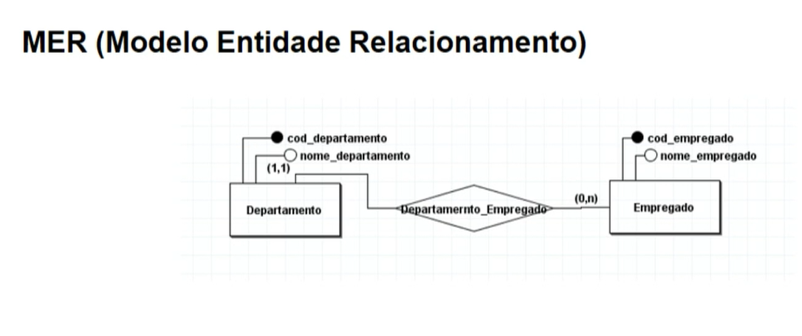
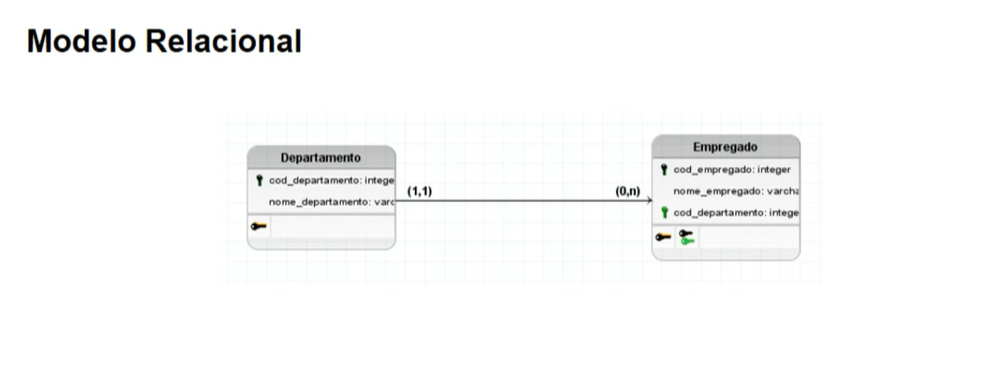
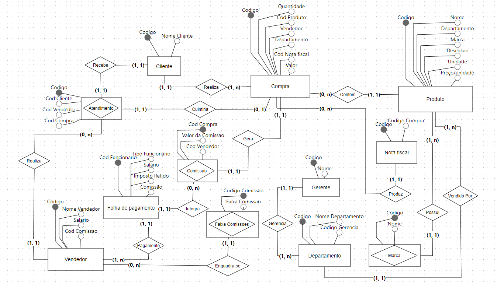
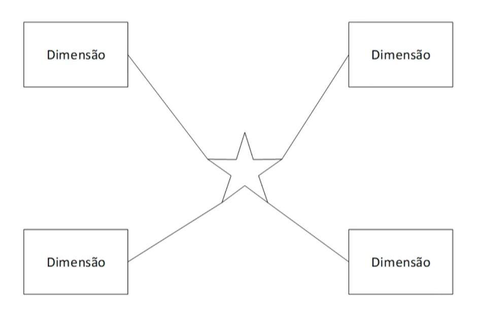
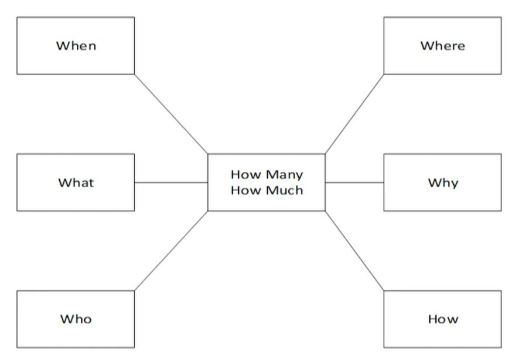
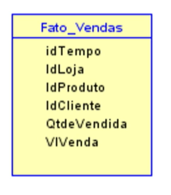

- [[5_Semester]] [[Mackenzie]]
- # Reviews
	- Aula 1
		- DONE Topic. Banco de Dados [[Feb 23rd, 2024]]
		  :LOGBOOK:
		  CLOCK: [2024-02-24 Sat 03:06:10]--[2024-02-24 Sat 03:09:20] =>  00:03:10
		  :END:
		- DONE Topic. Banco de Dados [[Feb 29th, 2024]]
		  :LOGBOOK:
		  CLOCK: [2024-02-29 Thu 06:36:13]--[2024-02-29 Thu 06:44:23] =>  00:08:10
		  :END:
		- DONE Topic. Banco de Dados [[Mar 22nd, 2024]]
	- Aula 2
		- DONE Topic. Banco de Dados - Aula 2 [[Mar 10th, 2024]]
		- DONE Topic. Banco de Dados - Aula 2 [[Mar 16th, 2024]]
		- DONE Topic. Banco de Dados - Aula 2 [[Apr 10th, 2024]]
-
- # Aula 1
	- ## Ponto de Partida
	  collapsed:: true
		- |**Conceitual**|**Lógico**|
		  |Entidade|Tabela|
		  |Atributo|Coluna|
		  |Tupla|Linha|
		- Usually the BrModelo is used to make the ER Model
		- 
		- 
		-
		-
	- ## Texto de Apoio
		- 
		- **Entidades**
		  • São uma representação abstrata de um objeto do mundo real.
		  • Um conjunto de objetos do mundo real que tem as mesmas características
		  é chamada de entidade.
		- **Atributos**
		  • São as propriedades descritas das entidades.
		  • Um atributo pode ser originário de outras tabelas.
		- **Relacionamentos**
		  • Uma associação entre entidades
	- ## Aplicando Conhecimento
		- **Enunciado**
		  collapsed:: true
			- Uma empresa deseja ter informações relativas a seus
				- clientes
				- vendedores
				- produtos
				- pedidos
				- atendimentos realizados por um determinado vendedor para um determinado departamento da empresa.
			- Para cada cliente
				- código
				- nome do cliente.
			- Para cada vendedor
				- código
				- nome do vendedor
				- salário
				- faixa de comissão a que ele pertence
			- Para cada gerência
				- código
				- nome do gerente.
			- Para cada departamento
				- código
				- nome do departamento
				- gerência do Dpto.
			- Para cada produto
				- código
				- nome do produto
				- departamento
				- marca do produto.
			- Para cada marca de produto
				- código
				- nome da marca.
			- Cada cliente
				- poderá fazer várias compras e, com isso, terá diversas notas fiscais. Ele poderá ser atendido por um vendedor, mas um vendedor poderá atender vários pedidos. Um pedido só poderá ser de um único cliente. Os clientes podem fazer vários pedidos, sendo que cada pedido poderá ter um único produto e é necessário saber a quantidade do produto.
			- Para cada produto
				- é necessário armazenar um código, a descrição do produto, a unidade em que o produto é vendido e o valor unitário do produto, ou seja, o valor referente a uma unidade do produto (que pode ser quilo, litro, metro etc.). Cada produto está associado a uma marca e é vendido em um determinado departamento que tem um gerente.
		- **Resultado**
			- {:height 402, :width 688}
			-
- ## Aula 2
	- ### Ponto de Partida
		- #### **Data Warehouse**
		  collapsed:: true
			- Decision making -> BI
			- In the transition model every action has a transaction, ACID, Atomicity, Consistency, Isolation, Durability
			- Now, in the model for the warehouse we would use the OLAP -> Online Analytical Processing..
			- Warehousing can be looked as the older brother of the Big Data.
			- #### Characteristics
				- **Oriented by Topic** -> One main area of study in point
				- **Integrated** -> Simple to extract information from
				- **Time Variability** -> Maintain Data throughout the time
				- **Non Volatile** -> Data cannot be lost
			- ### Architecture
			  collapsed:: true
				- **Star** -> In the centre the Fact Table and connected to it the Dimension tables.
					- 
				- **Snow Flake** ->  Looks like the **Star** but the adjacent tables have move information than the Dimension tables, where each of the table answer one of he questions
					- 
				-
				-
				-
		- #### **Multidimension**
		  collapsed:: true
			- Used the system OLAP, it has a lot of information that can be crossed, it is going to use primary keys to find the data, more robust, and bigger
			- **Architecture**
			  collapsed:: true
				- **Route**
					- Identify the process to be modelled
					  logseq.order-list-type:: number
					- Identify the Facts and Metrics
					  logseq.order-list-type:: number
					- Identify the Dimension
					  logseq.order-list-type:: number
					- Ratify the Granularity (day, month, hour)?
					  logseq.order-list-type:: number
				- **Fact Table** -> To Build it we start with a Fact Table that is responsible for the facts
				- **Dimensions** -> displays the information a way a management would like to see, concise, specific, with meaning to the numbers.
				- **Metrics** -> Metrics will be in the fact table.
				- That all is what we call **CUBE** Time x Product x Stores
				- 
				- #### To build the **Fact Table** answer this questions:
				  collapsed:: true
					- what process are we modelling?
					  logseq.order-list-type:: number
					- Which measurement we use to measure this process?
					  logseq.order-list-type:: number
					- In what level this metric is significative?
					  logseq.order-list-type:: number
				- To build the Dimension tables:
				  collapsed:: true
					- Usually the question the client has are the question that will help build the **Dimension** tables.
					- What where the sales between Jun and July in the south
					  logseq.order-list-type:: number
						- **Period** -> time
						  logseq.order-list-type:: number
						- **Region** -> place
						  logseq.order-list-type:: number
						- Both Period and Region would be **Dimensions**
						  logseq.order-list-type:: number
					- logseq.order-list-type:: number
		- #### **Case Study**
	- ### Texto de Apoio
		- 
	- ### Praticando
		- No processo de modelagem multidimensional, é correto afirmar que os tipos de dados qualitativos representam categorias distintas e não números. As operações matemáticas, como adição ou subtração, não fazem sentido nesses dados. Na modelagem dimensional, como são chamadas as tabelas com esse tipo de informação?
		  logseq.order-list-type:: number
		  collapsed:: true
		  Grupo de escolhas da pergunta
		  -> Tabela dimensão
		  -> Tabela dependente
		  -> Tabela fato
		  -> Tabela fraca
		  -> Tabela associativa #card
			- Tabela Dimensão
			  logseq.order-list-type:: number
		- No processo de modelagem multidimensional, é correto afirmar que os tipos de dados quantitativos também são chamados de dados numéricos, pois representam números. No caso de abordagem de modelagem de dados dimensionais, esses dados são chamados:
		  logseq.order-list-type:: number
		  collapsed:: true
		  Grupo de escolhas da pergunta
		  -> Complementares
		  -> Corporativo
		  -> Associativo
		  -> Informativo
		  -> Medida #card
			- Medida
			  logseq.order-list-type:: number
		- No ambiente de modelagem multidimensional, como são chamadas as tabelas em que são colocadas informações importantes para a gestão do negócio, as quais podem ser números, valores que podem ser somando e/ ou agregados para indicar o desempenho da empresa, as informações que podem ser por unidade de negócio ou por departamento?
		  logseq.order-list-type:: number
		  collapsed:: true
		  Grupo de escolhas da pergunta
		  -> Tabela associativa
		  -> Tabela fato
		  -> Tabela dependente
		  -> Tabela fraca
		  -> Tabela dimensão #card
			- Fato
			  logseq.order-list-type:: number
		- No ambiente de modelagem multidimensional, como são chamadas as tabelas nas quais os gestores podem visualizar o negócio e que darão significado aos números (medidas, valores, métricas)?
		  logseq.order-list-type:: number
		  collapsed:: true
		  Grupo de escolhas da pergunta
		  -> Tabela fraca
		  -> Tabela fato
		  -> Tabela associativa
		  -> Tabela dimensão
		  -> Tabela dependente #card
			- Dimensão
			  logseq.order-list-type:: number
		- A granularidade é uma das mais importantes definições na modelagem multidimensional. Além dos tipos de cargas, devemos também decidir sobre qual será a granularidade das tabelas Fatos.
		  logseq.order-list-type:: number
		  collapsed:: true
		  Em um modelo multidimensional de dados, definir a granularidade significa definir o:
		  Grupo de escolhas da pergunta
		  -> tamanho dos registros suportados pelas tabelas dimensão.
		  -> número máximo de tabelas dimensão a ser suportado pelo modelo.
		  -> nível de detalhamento dos dados a serem inseridos nesse modelo.
		  -> número máximo de usuários suportados pelo sistema.
		  -> tipo de relacionamento a ser estabelecido entre as tabelas dimensão e as tabelas fato. #card
			- -> nível de detalhamento dos dados a serem inseridos nesse modelo.
			  logseq.order-list-type:: number