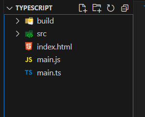

- Back to [[TypeScript]]
- # Lesson 01 - Start
	- ## Revision
		- DONE Typescript Start - 1st Revision - [[Feb 7th, 2025]]
		  :LOGBOOK:
		  CLOCK: [2025-02-07 Fri 09:03:23]--[2025-02-07 Fri 09:07:30] =>  00:04:07
		  :END:
		- DONE Typescript Start - 2nd Revision - [[Feb 13th, 2025]]
		  :LOGBOOK:
		  CLOCK: [2025-02-14 Fri 13:08:43]--[2025-02-14 Fri 13:11:52] =>  00:03:09
		  :END:
		- LATER Typescript Start - 3rd Revision - [[Mar 6th, 2025]]
		- LATER Typescript Start - 4th Revision - [[Aug 6th, 2025]]
	-
	- [TypeScript web page](https://www.typescriptlang.org/docs/)
	- **Requirements:**
		- VSCode
		- NodeLTS
	- ## Starting
		- After creating the first TypeScript file you can use the command:
			- `tsc <nameoffile.ts>` -> it will compile to a JS file with the same name.
			- `tsc <nameoffiel.ts> <nameofjsfile.js>` -> it will compile to a JS file with the name provided..
		- After that it will raise a problem, however is just because the variable is declared in both files now, and you should close the JS one.
	- ## Live Reload compatibility
		- `tsc main.js -w ` -> to watch the file, if only working with one file.
		- **For using more files in this way you can:**
			- Using the directories structure:
			- 
			- **Initiate tsc to config the file.** ->  ` tsc --init`
			- **Change the settings in the modules section for:**
				- `"rootDir": "./scr",`
				- `"outDir": "./build/js",`
			- **Now just run:**
				- `tsc -w` and you're done
			- If you need to use an older version of JS the target argument can be set to other than `es2016` on the `tsconfig.json` file.
			- If you **delete the file** in the watched directory the out directory still will keep the file, so you must delete it on both the **src** and the **build/js** directories.
			- The TS will compile all files you make even out of the **src dir**, so to stop that you need to:
				- ```json 
				   // include this code at the end of your tsconfig.json file
				  	"skipLibCheck": true                                 /* Skip type checking all .d.ts files. */
				    },
				    "include": [
				      "src"
				    ]
				  }
				  ```
			- ## Dinamic types
				- The JavaScript works with dynamic types which means that it forces a string if it is a number to operate in mathematical operations, although it shouldn't, that being said the **TS won't get in the way of our JS files and will compile with warnings**
					- Use this feature to better your JS code.
			- ## Ignore or not the errors in JS
				- ### Option 1
					- You can toggle the argument int he `tsconfig.json` file to: `"noEmitOnError": true,` so it **may NOT** compile to JS if there is an error.
				- ### Option 2
					- A second option is to use the terminal and give the argument there:
						- `tsc noEmitOnError -w` -> this will overwrite the `tsconfig.json` file and do not compile with error.
		- ## Notes
			- If a favicon.ico not found error is raised you can only add the code:
			  `<link rel="shortcut icon" href="#">`
			-
- # Lesson 02 - Basic Types
	- ## Revision
		- DONE Typescript Basic Types - 1st Revision - [[Feb 7th, 2025]]
		  :LOGBOOK:
		  CLOCK: [2025-02-07 Fri 09:07:38]--[2025-02-07 Fri 09:09:12] =>  00:01:34
		  :END:
		- DONE Typescript Basic Types - 2nd Revision - [[Feb 13th, 2025]]
		  :LOGBOOK:
		  CLOCK: [2025-02-14 Fri 13:11:59]--[2025-02-14 Fri 13:13:55] =>  00:01:56
		  :END:
		- LATER Typescript Basic Types - 3rd Revision - [[Mar 6th, 2025]]
		- LATER Typescript Basic Types - 4th Revision - [[Aug 6th, 2025]]
	- The JS is a weekly typed language while the TS is a strong typed language
	- Should not be mistaken for the dynamically typed or statically typed
	- **Static type** -> types are checked at the compile.
	- **Dynamic type** -> Types are checked at the run time
	- ```TypeScript
	  let myName: string = 'Dave'
	  let meaningOfLife: number
	  let isLoading: boolean
	  // It let all types to be assigned to the any type
	  let album: any
	  
	  // Instead we can do the union type not limited to 2 data types
	  let album: string | number
	  
	  myName = 'jonh'
	  meaningOfLife = 42
	  isLoading = true
	  album = 1924
	  
	  const sum = (a:  number, b: number ) => { 
	      return a + b
	   }
	  
	  let postId: string | number
	  let isActive: number | boolean
	  
	  // In the case of a program were you use a variable you cannot figure out the type.
	  // As the RegExp, you insert it and then just see the suggested type in TS
	  // let re = /\w+/g => On Hover it will show let re: RegExp = /\w+/g
	  let re: RegExp = /\w+/g
	  ```
	-
- # Lesson 03 - Array, Tuples, Enums
	- ## Revision
		- DONE Typescript Array, Tuples, Enums - 1st Revision - [[Feb 7th, 2025]]
		  :LOGBOOK:
		  CLOCK: [2025-02-07 Fri 09:09:22]--[2025-02-07 Fri 09:15:51] =>  00:06:29
		  :END:
		- DONE Typescript Array, Tuples, Enums - 2nd Revision - [[Feb 13th, 2025]]
		  :LOGBOOK:
		  CLOCK: [2025-02-14 Fri 13:14:06]--[2025-02-14 Fri 13:23:31] =>  00:09:25
		  :END:
		- LATER Typescript Array, Tuples, Enums - 3rd Revision - [[Mar 6th, 2025]]
		- LATER Typescript Array, Tuples, Enums - 4th Revision - [[Aug 6th, 2025]]
	-
	- **Basically**
		- if you just insert the variables in the array it will assume that the array accept all the types in it, in any position
		- In need of a position restrictive list you can use a tuple with set types, it will only accept the types set in the position there were set in.
		-
		- ```TS 
		  let stringArr = [
		      'one',
		      'jey',
		      'Dave'
		  ]
		  
		  let guitars = [
		      'strat',
		      'Les Paul',
		      5150
		  ]
		  
		  let mixedData = [
		      'EVH',
		      1984,
		      true
		  ]
		  
		  stringArr[0] = 'Jonh'
		  stringArr.push('hey')
		  
		  guitars[0] = 1984
		  guitars.unshift('Jim')
		  
		  
		  guitars = stringArr
		  
		  // // Cannot accept for the stringArr is only string
		  // stringArr = guitars
		  
		  let test = [] // Will be type any
		  let bands: string[] = [] // Will be set as type string
		  bands.push('Van Halen')
		  
		  // The array accept all the types you set it to, however
		  //  if you what to be restrict about the position of each type you should use Tuples
		  
		  // Specific types that only accept itens in such position to be such types
		  let myTuple: [string, number, boolean] = ['Dave', 42, true]
		  
		  // Union type that accepts all the types in any position 
		  let mixed = ['Dave', 42, true]
		  
		  // myTuple = mixed // -> will complain
		  mixed = myTuple // Will be accepted
		  
		  // Objects
		  let myObj: Object
		  
		  // It is assignable for its type object
		  // All the possibilities bellow will be accepted
		  myObj = []
		  myObj = bands
		  myObj = {}
		  
		  const exampleObject = {
		      prop1: 'Felipe',
		      prop2: true
		  }
		  
		  exampleObject.prop1 = 'Guerra'
		  
		  // To create a object that is conformed to specific types
		  type Guitarist = {
		      // You can use the ? character to make:
		      // IF there is name, it should be string.
		      name?: string,
		      active: boolean,
		      albums: (string | number)[]
		  }
		  
		  let evh: Guitarist = {
		      name: 'Eddie',
		      active: false,
		      albums: [1984, 5150, 'OUT812']
		  }
		  
		  let jp: Guitarist = {
		      name: 'Jimmy',
		      active: true,
		      albums: ['I', 'II', 'IV']
		  }
		  
		  evh = jp // It will work for both are guitarist types
		  
		  // To make a property in a object optional we can insert a ? before the :
		  
		  type Guitarist2 = {
		      name: string,
		      active?: boolean,
		      albums: (string | number)[]
		  }
		  
		  const greetGuitarists = (guitarist: Guitarist) => {
		      return `Hello ${guitarist.name}!`
		  }
		  // in case of a optional type if we call a method on it TypeScript will complain 
		  // We could do the following
		  const greetGuitarists2 = (guitarist: Guitarist) => {
		      // We need to give it the possibility to be undefined as well
		      return `Hello ${guitarist.name?.toUpperCase()}!`
		  
		  }
		  
		  console.log(greetGuitarists(jp)) // -> hello Jimmy!
		  
		  //  A interface is possible too
		  // The interface should be thought more a class definition not an object defintion 
		  interface person {
		      name: string,
		      age: number
		  }
		  
		  // Enums - Is another features of TypeScript (does not existis in JS)
		  //  It automatically assigns the 0 to the first item and so on.
		  // If you whant to use start at other number you just assign it to the enum,
		  enum Grade {
		      U = 4,
		      D,
		      C,
		      B,
		      A,
		  }
		  
		  console.log(Grade.U) // -> 4
		  console.log(Grade.A) // -> 8
		  
		  
		  // Interface can be implemented along the way, not necessarily at the same time.
		  // it will have both properties, although the interface is implemented twice.
		  interface x {
		      name: string
		  }
		  
		  interface x {
		      age: number
		  }
		  
		  let a: x = { name: 'felipe', age: 30 }
		  ```
- # Lesson 04 - Basic functions
	- ## Revision
		- DONE Typescript Basic Functions- 1st Revision - [[Feb 7th, 2025]]
		  :LOGBOOK:
		  CLOCK: [2025-02-07 Fri 09:21:12]--[2025-02-07 Fri 09:32:10] =>  00:10:58
		  :END:
		- DONE Typescript Basic Functions - 2nd Revision - [[Feb 13th, 2025]]
		  :LOGBOOK:
		  CLOCK: [2025-02-14 Fri 13:26:30]--[2025-02-14 Fri 13:32:54] =>  00:06:24
		  :END:
		- LATER Typescript Basic Functions - 3rd Revision - [[Mar 6th, 2025]]
		- LATER Typescript Basic Functions - 4th Revision - [[Aug 6th, 2025]]
	- ```typescript 
	  type stringOrNumber = string | number
	  
	  type stringOrNumberArray = (string | number)[]
	  
	  type Guitarist = {
	      name?: string,
	      active: boolean,
	      albums: stringOrNumberArray
	  }
	  
	  type UserId = stringOrNumber
	  
	  
	  // Interfaces do not allow types aliases to be assigned.
	  interface PostId = stringOrNumber // => Error
	  
	  // Literal Type:
	  let myName: 'Felipe'
	  
	  let userName: 'Felipe' | 'Baldim' | 'Guerra'
	  
	  userName = '' // => Vscode will suggerst userName params
	  
	  //  Type Aliases
	  type stringOrNumber = string | number
	  
	  type stringOrNumberArray = (string | number)[]
	  
	  type Guitarist = {
	      name: string,
	      active: boolean,
	      albums: stringOrNumberArray
	  }
	  
	  type UserID = stringOrNumber
	  
	  
	  // Interfaces do not allow to types aliases to be assigned.
	  interface PostId = stringOrNumber
	  
	  
	  // Literal types
	  let myName: " Felipe"
	  
	  let userName: " Felipe" | 'Jhon' | 'Amy'
	  userName = 'Amy'
	  
	  
	  // Functions
	  const add = (a: number, b: number): number => {
	      return a + b
	  }
	  
	  const logMsg = (message: any): void => {
	      console.log(message)
	  }
	  
	  logMsg('Hello')
	  logMsg(add(2, 3))
	  
	  // Not arrow functions will work as well
	  let subtract = function (c: number, d: number): number {
	      return c - d
	  }
	  
	  // Literal type for functions
	  type mathFunction = (a: number, b: number) => number
	  
	  // // A interface can be used as well although interface it's more like classes.
	  interface mathFunction {
	      (a: number, b: number): number
	  }
	  
	  
	  let multiply: mathFunction = function (c, d) {
	      return c * d
	  }
	  
	  let divide: mathFunction = (e, f) => e / f
	  
	  
	  logMsg('[Multiplying whit default params]\n' + multiply(2, 2))
	  logMsg(multiply(2, 3))
	  
	  let arrowFuncTest: mathFunction = (a, b) => {
	      return a + b
	  }
	  
	  // OPTIONAL PARAMETERS
	  // The optional param must be THE LAST on the list
	  const addAll = (a: number, b: number, c?: number): number => {
	      if (typeof c !== 'undefined') {
	          return a + b + c
	      }
	      return a + b
	  }
	  
	  // Default param value
	  // Default Values do not need to be in the LAST position in the params.
	  const sumAll = (a: number = 2, b: number, c: number = 2): number => {
	      return a + b + c
	  }
	  
	  logMsg(addAll(2, 3, 2))
	  logMsg(addAll(2, 3))
	  logMsg(sumAll(2, 3, 2))
	  logMsg(sumAll(2, 3))
	  
	  // If you want to mark the first argument with default 
	  // value you should pass the params as well as the first = unddefined
	  logMsg(sumAll(undefined, 3))
	  
	  // NOTE: the Default value wont work with the lyteral types
	  
	  // Rest parameters
	  // Rest params should come at the end
	  const total = (a: number, ...nums: number[]): number => {
	      return nums.reduce((prev, curr) => prev + curr)
	  }
	  
	  logMsg("[total]" + total(1, 2, 3, 4))
	  
	  // The never type
	  // If a function return only if there is a error the return of this function will be never type.
	  const createError = (errMsg: string): never => {
	      throw new Error(errMsg) // => type "Never"
	  }
	  
	  // A infinete loop will return a Never type as well
	  const infinite = (): never => {
	      let i: number = 1
	      while (true) {
	          i++
	          // if (i > 100) break
	      }
	  }
	  
	  // Custom type guard
	  const isNumber = (value: any): boolean => {
	      return typeof value === 'number'
	          ? true : false
	  }
	  
	  // Use of the never type
	  const numberOrString = (value: number | string): string | Never => {
	      if (typeof value === 'string') return 'string'
	      if (isNumber(value)) return 'number'
	      return createError('This should never happen!') // This is a Never Type
	  }
	  ```
	-
- # Lesson 05 - Type assertion or Casting
	- ## Revision
		- DONE Typescript Type Assertion or Casting - 1st Revision - [[Feb 7th, 2025]]
		  :LOGBOOK:
		  CLOCK: [2025-02-07 Fri 10:11:39]--[2025-02-07 Fri 10:16:06] =>  00:04:27
		  :END:
		- DONE Typescript Assertion or Casting - 2nd Revision - [[Feb 13th, 2025]]
		  :LOGBOOK:
		  CLOCK: [2025-02-14 Fri 13:35:46]--[2025-02-14 Fri 13:40:44] =>  00:04:58
		  :END:
		- LATER Typescript Assertion or Casting  - 3rd Revision - [[Mar 6th, 2025]]
		- LATER Typescript Assertion or Casting - 4th Revision - [[Aug 6th, 2025]]
	- Casting and assertion refer exactly to the same thing.
	- `main.ts file`
		- ```TS 
		  type One = string
		  type Two = string | number
		  type three = 'Hello'
		  
		  // Convert to more or less specific type
		  let a: One = 'Hello'
		  let b = a as Two // Less specific
		  let c = a as three // more specific
		  
		  let d = <One>'world'
		  let e = <string | number>'world' // This syntax cannot be used in React
		  
		  const addOrConcat = (a: number, b: number, c: 'add' | 'concat'): number | string => {
		      if (c === 'add') {
		          return a + b
		      }
		      return '' + a + b
		  }
		  
		  // I know better than you
		  let myVal: string = addOrConcat(2, 2, "concat") as string
		  
		  // WARNING Be careful the TS does not see a problem in it But String will be returned
		  let nextVal: number = addOrConcat(2, 2, "concat") as number
		  
		  10 as string // TS will complain about it
		  (10 as unknown) as string // TS wont complain about it, be careful!
		  
		  // The DOM
		  const img = document.querySelector('img')! // ! = "Non Null assertion"
		  const myImg = document.getElementById('#img') as HTMLImageElement
		  const nextImg = <HTMLImageElement>document.getElementById('#img') // Won't work in react
		  
		  img.src
		  myImg.src
		  nextImg.src
		  ```
	- `copywrite.ts` file
		- ```TS 
		  // Original JS code
		  const year = document.getElementById("year")
		  const thisYear = new Date().getFullYear()
		  year.setAttribute("datetime", thisYear)
		  year.textContent = thisYear
		  
		  // Make the code above "type safe"
		  
		  // TS Code Mine
		  const year = document.getElementById("year") as HTMLSpanElement
		  const thisYear = new Date().getFullYear().toString()
		  year.setAttribute("datetime", thisYear)
		  year.textContent = thisYear
		  
		  
		  // Dave's
		  
		  // // TS Code 1st variation 
		  let year: HTMLElement | null
		  year = document.getElementById("year")
		  let thisYear: string
		  thisYear = new Date().getFullYear().toString()
		  if (year) {
		      year.setAttribute("datetime", thisYear.toString())
		      year.textContent = thisYear
		  }
		  
		  // TS Code 2nd variation 
		  const year = document.getElementById("year") as HTMLSpanElement
		  const thisYear: string = new Date().getFullYear().toString()
		  year.setAttribute("datetime", thisYear)
		  year.textContent = thisYear
		  ```
- # Lesson 06 - Classes in TS
	- ## Revision
		- DONE Typescript Classes in TS - 1st Revision - [[Feb 7th, 2025]]
		  :LOGBOOK:
		  CLOCK: [2025-02-07 Fri 10:16:13]--[2025-02-07 Fri 10:33:42] =>  00:17:29
		  :END:
		- DONE Typescript Classes in TS - 2nd Revision - [[Feb 13th, 2025]]
		  :LOGBOOK:
		  CLOCK: [2025-02-21 Fri 09:47:06]--[2025-02-21 Fri 09:53:07] =>  00:06:01
		  :END:
		- LATER Typescript Classes in TS  - 3rd Revision - [[Mar 6th, 2025]]
		- LATER Typescript Classes in TS - 4th Revision - [[Aug 6th, 2025]]
	- ```TS 
	  
	  // Visibility modifiers
	  // You can declare classes in two ways, the first:
	  // Normal class
	  class Coder {
	      name: string
	      music: string
	      age: number
	      lang: string
	  
	      constructor(
	          name: string,
	          music: string,
	          age: number,
	          lang: string
	      ) {
	          this.name = name
	          this.music = music
	          this.age = age
	          this.lang = lang
	      }
	  }
	  
	  // IF we add the public to the name on constructor it's marked as redundand,
	  // so we can use it to eliminate the declaration of params
	  class Coder2 {
	  
	      constructor(
	          public readonly name: string,
	          public music: string,
	          private age: number,
	          protected lang: string = 'Typescript'
	      ) {
	          this.name = name
	          this.music = music
	          this.age = age
	          this.lang = lang
	      }
	  
	      public getAge() {
	          return `Hello I'm ${this.age}`
	      }
	  }
	  
	  // to initiate a variable without constructing it:
	  // secondLang!: string -> used before the constructor. (non Beginner)
	  
	  const Felipe = new Coder2('Felipe', 'Rock', 47, 'Typescript')
	  console.log(Felipe.getAge())
	  // console.log(Felipe.age) // JS would work with it even though TS dosen't like it
	  // console.log(Felipe.lang) // JS would work with it even though TS dosen't like it
	  
	  class WebDev extends Coder2 {
	      constructor(
	          public computer: string,
	          name: string,
	          music: string,
	          age: number,
	      ) {
	          super(name, music, age)
	          this.computer = computer
	      }
	      public getLang() {
	          return `I write in ${this.lang}`
	      }
	  }
	  /////////////////////////////////////////////////////
	  
	  // Implementing a interface to a Class
	  interface Musician {
	      name: string,
	      instrument: string,
	      play(action: string): string
	  }
	  
	  class Guitarist implements Musician {
	      name: string
	      instrument: string
	  
	      constructor(name: string, instrument: string) {
	          this.name = name
	          this.instrument = instrument
	      }
	  
	      play(action: string) {
	          return `${this.name} ${action} the ${this.instrument}`
	      }
	  
	  }
	  
	  const Page = new Guitarist('Jimmy', 'guitar')
	  console.log(Page.play('strums'))
	  
	  ///////////////////////////////////////////////////////
	  
	  // Static => points only to the class it self, not to be used outside of it.
	  
	  class Peeps {
	      static count: number = 0
	  
	      static getCount(): number {
	          return Peeps.count
	      }
	      public id: number
	  
	      constructor(
	          public name: string,
	      ) {
	          this.name = name
	          this.id = ++Peeps.count
	      }
	  }
	  
	  const John = new Peeps('John')
	  const Steve = new Peeps('Steve')
	  const Amy = new Peeps('Amy')
	  
	  console.log(Steve.id)
	  console.log(Amy.id)
	  console.log(Peeps.count)
	  
	  ///////////////////////////////////////////////
	  
	  class Bands {
	      private dataState: string[]
	  
	      constructor() {
	          this.dataState = []
	      }
	  
	      public get data(): string[] {
	          return this.dataState
	      }
	  
	      public set data(value: string[]) {
	          if (Array.isArray(value) && value.every(el => typeof el === 'string')) {
	              this.dataState = value
	              return
	  
	          } else throw new Error('Params is not an array of strings')
	      }
	  }
	  
	  const MyBands = new Bands()
	  MyBands.data = ['Neil Young', 'LedZep']
	  console.log(MyBands.data)
	  MyBands.data = [...MyBands.data, 'ZZ Top']
	  console.log(MyBands.data)
	  
	  // Progress over perfection
	  ```
- # Lesson 07 - Index Signature, Keyof Assertion & Record Utility type
	- ## Revision
		- DONE Typescript index Signature - 1nd Revision - [[Feb 8th, 2025]]
		  :LOGBOOK:
		  CLOCK: [2025-02-10 Mon 11:28:16]--[2025-02-10 Mon 11:32:24] =>  00:04:08
		  :END:
		- DONE Typescript index Signature - 2nd Revision - [[Feb 14th, 2025]]
		  :LOGBOOK:
		  CLOCK: [2025-02-21 Fri 10:16:44]--[2025-02-21 Fri 10:21:25] =>  00:04:41
		  :END:
		- LATER Typescript index Signature - 3rd Revision - [[Mar 7th, 2025]]
		- LATER Typescript index Signature - 4th Revision - [[Aug 7th, 2025]]
	- ## Index Signatures
		- ```ts 
		  // Index Signatures
		  // Necessary for declaring a interface without knowing the actual name of the params
		  // or to access the params dinamically 
		  
		  // NO INDEX SIGNATURE
		  interface TransactionObj0 {
		      Pizza: number,
		      Books: number,
		      Job: number
		  }
		  
		  // WITH INDEX SIGNATURE
		  interface TransactionObj1 {
		      readonly [index: string]: number,
		  }
		  
		  // Would return undefined, so we can ask for non existent key
		  console.log(todaysTransactions['Dave'])
		  
		  
		  // COULD BE ALSO MORE DEFINED
		  interface TransactionObj {
		      [index: string]: number,
		      Pizza: number,
		      Books: number,
		      Job: number
		  }
		  
		  
		  const todaysTransactions: TransactionObj = {
		      Pizza: -10,
		      Books: -5,
		      Job: 50
		  }
		  
		  // Accessing it dinamicaly
		  console.log(todaysTransactions.Pizza)
		  console.log(todaysTransactions['Pizza'])
		  
		  let prop: string = 'Pizza'
		  
		  // console.log(todaysTransactions[prop]) => No index signature with a parameter of type 'string' was found on type 'TransactionObj'
		  
		  const todaysNet = (transactions: TransactionObj): number => {
		      let total = 0
		      for (const transaction in transactions) {
		          total += transactions[transaction] // => No index signature with a parameter of type 'string' was found on type 'TransactionObj'
		      }
		      return total
		  }
		  
		  console.log(todaysNet(todaysTransactions))
		  
		  /////////////////////////////////////////
		  
		  // You do not need neither comas to declare members but stay consistent
		  interface Student {
		      [key: string]: string | number | number[] | undefined
		      name: string
		      GPA: number
		      classes?: number[]
		  }
		  
		  const student: Student = {
		      name: 'Doug',
		      GPA: 3.5,
		      classes: [100, 200]
		  }
		  
		  // console.log(student.test)
		  
		  // This won't work without the Student interface index signarture
		  for (const key in student) {
		      console.log(`${key}: ${student[key]}`)
		  }
		  
		  // This will work without the Student interface index signature
		  for (const key in student) {
		      console.log(`${key}: ${student[key as keyof Student]}`)
		  }
		  
		  // You can also use keyof with typeof if you do not know the type of something
		  Object.keys(student).map(key => {
		      console.log(student[key as keyof typeof student])
		  })
		  
		  const logStudentKey = (student: Student, key: keyof Student): void => {
		      console.log(`Student ${key}: ${student[key]}`)
		  }
		  
		  logStudentKey(student, 'GPA') // => Student GPA: 3.5
		  logStudentKey(student, 'name') // => Student name: Doug
		  
		  ////////////////////////////////////////////////////////
		  
		  interface Incomes {
		      [key: string]: number
		  }
		  
		  // Benefits are that you can use the literal type in a interface with index signature
		  // However you won't be able to assing specific types to specific keys
		  type Streams = 'salary' | 'bonus' | 'sidehustle'
		  type Incomes = Record<Streams, number>
		  
		  const monthlyIncomes: Incomes = {
		      salary: 500,
		      bonus: 100,
		      sidehustle: 250
		  }
		  
		  for (const revenue in monthlyIncomes) {
		      console.log(monthlyIncomes[revenue as keyof Incomes])
		  }
		  ```
		-
- # Lesson 08 - Generics
	- ## Revision
		- DONE Typescript Generics - 1nd Revision - [[Feb 8th, 2025]]
		  :LOGBOOK:
		  CLOCK: [2025-02-10 Mon 11:33:53]--[2025-02-10 Mon 11:41:06] =>  00:07:13
		  :END:
		- DONE Typescript Generics - 2nd Revision - [[Feb 14th, 2025]]
		  :LOGBOOK:
		  CLOCK: [2025-02-21 Fri 10:07:36]--[2025-02-21 Fri 10:16:27] =>  00:08:51
		  :END:
		- LATER Typescript Generics  - 3rd Revision - [[Mar 7th, 2025]]
		- LATER Typescript Generics - 4th Revision - [[Aug 7th, 2025]]
	- ## Generics
		- ```ts 
		  const echo = <T>(arg: T): T => arg
		  
		  //////////////////////////////////
		  
		  const isObj = <T>(arg: T): boolean => {
		      return (typeof arg === 'object' && !Array.isArray(arg) && arg !== null)
		  }
		  
		  console.log(isObj(true))
		  console.log(isObj('John'))
		  console.log(isObj([1, 2, 3]))
		  console.log(isObj({ name: 'John' }))
		  console.log(isObj(null))
		  
		  ///////////////////////////////////
		  
		  const isTrue = <T>(arg: T): { arg: T, is: boolean } => {
		      if (Array.isArray(arg) && !arg.length) {
		          return { arg, is: false }
		      }
		      if (isObj(arg) && !Object.keys(arg as keyof T).length) {
		          return { arg, is: false }
		      }
		      return { arg, is: !!arg }
		  }
		  
		  console.log(isTrue(false))
		  console.log(isTrue(0))
		  console.log(isTrue(true))
		  console.log(isTrue(1))
		  console.log(isTrue('Dave'))
		  console.log(isTrue(''))
		  console.log(isTrue(null))
		  console.log(isTrue(undefined))
		  console.log(isTrue({})) // modified
		  console.log(isTrue({ name: 'Dave' }))
		  console.log(isTrue([])) // modified
		  console.log(isTrue([1, 2, 3]))
		  console.log(isTrue(NaN))
		  console.log(isTrue(-0))
		  
		  ////////////////////////////////////
		  
		  interface BoolCheck<T> {
		      value: T,
		      is: boolean,
		  }
		  
		  const checkBoolValue = <T>(arg: T): BoolCheck<T> => {
		      if (Array.isArray(arg) && !arg.length) {
		          return { value: arg, is: false }
		      }
		      if (isObj(arg) && !Object.keys(arg as keyof T).length) {
		          return { value: arg, is: false }
		      }
		      return { value: arg, is: !!arg }
		  }
		  
		  //////////////////////////////////////
		  
		  
		  interface HasID {
		      id: number
		  }
		  
		  const processUser = <T extends HasID>(user: T): T => {
		      // process the user with logic here 
		      return user
		  }
		  
		  console.log(processUser({ id: 1, name: 'Dave' }))
		  //console.log(processUser({ name: 'Dave'}))
		  
		  ///////////////////////////////////////
		  
		  
		  const getUsersProperty = <T extends HasID, K extends keyof T>(users: T[], key: K): T[K][] => {
		      return users.map(user => user[key])
		  }
		  
		  const usersArray = [
		      {
		          "id": 1,
		          "name": "Leanne Graham",
		          "username": "Bret",
		          "email": "Sincere@april.biz",
		          "address": {
		              "street": "Kulas Light",
		              "suite": "Apt. 556",
		              "city": "Gwenborough",
		              "zipcode": "92998-3874",
		              "geo": {
		                  "lat": "-37.3159",
		                  "lng": "81.1496"
		              }
		          },
		          "phone": "1-770-736-8031 x56442",
		          "website": "hildegard.org",
		          "company": {
		              "name": "Romaguera-Crona",
		              "catchPhrase": "Multi-layered client-server neural-net",
		              "bs": "harness real-time e-markets"
		          }
		      },
		      {
		          "id": 2,
		          "name": "Ervin Howell",
		          "username": "Antonette",
		          "email": "Shanna@melissa.tv",
		          "address": {
		              "street": "Victor Plains",
		              "suite": "Suite 879",
		              "city": "Wisokyburgh",
		              "zipcode": "90566-7771",
		              "geo": {
		                  "lat": "-43.9509",
		                  "lng": "-34.4618"
		              }
		          },
		          "phone": "010-692-6593 x09125",
		          "website": "anastasia.net",
		          "company": {
		              "name": "Deckow-Crist",
		              "catchPhrase": "Proactive didactic contingency",
		              "bs": "synergize scalable supply-chains"
		          }
		      },
		  ]
		  
		  console.log(getUsersProperty(usersArray, "email"))
		  console.log(getUsersProperty(usersArray, "username"))
		  
		  ///////////////////////////////////////
		  
		  class StateObject<T> {
		      private data: T
		  
		      constructor(value: T) {
		          this.data = value
		      }
		  
		      get state(): T {
		          return this.data
		      }
		  
		      set state(value: T) {
		          this.data = value
		      }
		  }
		  
		  const store = new StateObject("John")
		  console.log(store.state)
		  store.state = "Dave"
		  //store.state = 12
		  
		  const myState = new StateObject<(string | number | boolean)[]>([15])
		  myState.state = ['Dave', 42, true]
		  console.log(myState.state)
		  ```
- # Lesson 09 - Utility Types
	- ## Revision
		- DONE Typescript Utility Types - 1nd Revision - [[Feb 8th, 2025]]
		  :LOGBOOK:
		  CLOCK: [2025-02-10 Mon 12:42:54]--[2025-02-10 Mon 12:43:38] =>  00:00:44
		  CLOCK: [2025-02-10 Mon 13:08:35]--[2025-02-10 Mon 13:14:09] =>  00:05:34
		  :END:
		- DONE Typescript Utility Types - 2nd Revision - [[Feb 14th, 2025]]
		  :LOGBOOK:
		  CLOCK: [2025-02-21 Fri 10:21:42]--[2025-02-21 Fri 10:29:08] =>  00:07:26
		  :END:
		- LATER Typescript Utility Types - 3rd Revision - [[Mar 7th, 2025]]
		- LATER Typescript Utility Types - 4th Revision - [[Aug 7th, 2025]]
	- ## Utility Types
		- ```ts 
		  // Utility Types 
		  
		  // Partial 
		  
		  interface Assignment {
		      studentId: string,
		      title: string,
		      grade: number,
		      verified?: boolean,
		  }
		  
		  const updateAssignment = (
		    assign: Assignment, 
		    propsToUpdate: Partial<Assignment>
		  ): Assignment => {
		      return { ...assign, ...propsToUpdate }
		  }
		  
		  const assign1: Assignment = {
		      studentId: "compsci123",
		      title: "Final Project",
		      grade: 0,
		  }
		  
		  console.log(updateAssignment(assign1, { grade: 95 }))
		  const assignGraded: Assignment = updateAssignment(assign1, { grade: 95 })
		  
		  
		  // Required and Readonly 
		  
		  const recordAssignment = (assign: Required<Assignment>): Assignment => {
		      // send to database, etc. 
		      return assign
		  }
		  
		  const assignVerified: Readonly<Assignment> = { ...assignGraded, verified: true }
		  
		  // NOTE: assignVerified won't work with recordAssignment!
		  // Why? Try it and see what TS tells you :)
		  
		  recordAssignment({ ...assignGraded, verified: true })
		  
		  // Record 
		  const hexColorMap: Record<string, string> = {
		      red: "FF0000",
		      green: "00FF00",
		      blue: "0000FF",
		  }
		  
		  type Students = "Sara" | "Kelly"
		  type LetterGrades = "A" | "B" | "C" | "D" | "U"
		  
		  const finalGrades: Record<Students, LetterGrades> = {
		      Sara: "B",
		      Kelly: "U"
		  }
		  
		  interface Grades {
		      assign1: number,
		      assign2: number,
		  }
		  
		  const gradeData: Record<Students, Grades> = {
		      Sara: { assign1: 85, assign2: 93 },
		      Kelly: { assign1: 76, assign2: 15 },
		  }
		  
		  // Pick and Omit 
		  
		  type AssignResult = Pick<Assignment, "studentId" | "grade">
		  
		  const score: AssignResult = {
		      studentId: "k123",
		      grade: 85,
		  }
		  
		  type AssignPreview = Omit<Assignment, "grade" | "verified">
		  
		  const preview: AssignPreview = {
		      studentId: "k123",
		      title: "Final Project",
		  }
		  
		  // Exclude and Extract 
		  
		  type adjustedGrade = Exclude<LetterGrades, "U">
		  
		  type highGrades = Extract<LetterGrades, "A" | "B">
		  
		  // Nonnullable 
		  
		  type AllPossibleGrades = 'Dave' | 'John' | null | undefined
		  type NamesOnly = NonNullable<AllPossibleGrades>
		  
		  // ReturnType 
		  
		  //type newAssign = { title: string, points: number }
		  
		  const createNewAssign = (title: string, points: number) => {
		      return { title, points }
		  }
		  
		  type NewAssign = ReturnType<typeof createNewAssign>
		  
		  const tsAssign: NewAssign = createNewAssign("Utility Types", 100)
		  console.log(tsAssign)
		  
		  // Parameters 
		  
		  type AssignParams = Parameters<typeof createNewAssign>
		  
		  const assignArgs: AssignParams = ["Generics", 100]
		  
		  const tsAssign2: NewAssign = createNewAssign(...assignArgs)
		  console.log(tsAssign2)
		  
		  // Awaited - helps us with the ReturnType of a Promise 
		  
		  interface User {
		      id: number,
		      name: string,
		      username: string,
		      email: string,
		  }
		  
		  const fetchUsers = async (): Promise<User[]> => {
		  
		      const data = await fetch(
		          'https://jsonplaceholder.typicode.com/users'
		      ).then(res => {
		          return res.json()
		      }).catch(err => {
		          if (err instanceof Error) console.log(err.message)
		      })
		      return data
		  }
		  
		  type FetchUsersReturnType = Awaited<ReturnType<typeof fetchUsers>>
		  
		  fetchUsers().then(users => console.log(users))
		  ```