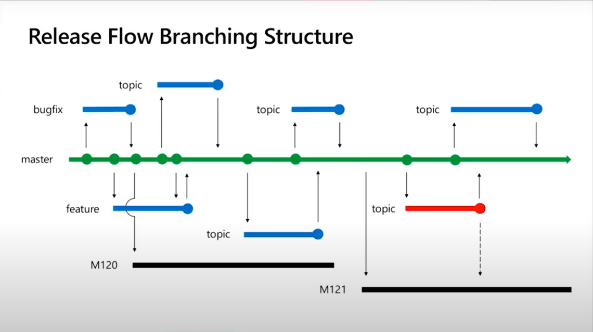

- #[[Meta - Front-end Development, Professional Certificate]]
- # Module 1
  collapsed:: true
	- ## What is Version control
	  collapsed:: true
		- Benefits of Version control
			- Revision History
			  logseq.order-list-type:: number
			- Identity -> who
			  logseq.order-list-type:: number
			- Collaboration
			  logseq.order-list-type:: number
			- Automation
			  logseq.order-list-type:: number
			- Efficiency
			  logseq.order-list-type:: number
	- ## Version Control Terminology
	  collapsed:: true
		- 
	- ## Systems of Version Control
	  collapsed:: true
		- **Centralized** -> One server contains all the data and changes and, in order to commit, the developer must be connected to the server
		- **Decentralized** -> Every user is a server, and only needs to be connected on the moment of the `push` and `pull` usually faster and more complex to use
	- ## A History of revision
		- **VCS** -> Version Control Systems #[[Developer - Glossary]]
- # Module 2
  collapsed:: true
	- ## What is Unix Commands
	  collapsed:: true
		- #[[Developer - Glossary]]
		- helpers -> `man` manual for the intructions `man ls` manual for `ls` command
		- `ls` -> list all directories
			- `ls -l` -> with the read and write permissions
			- `ls -a` -> Include the ridden directories
		- `pwd` -> print the full path of the current working dir
		- `cp` -> copy files from one directory to another
		- `mv` -> move files from one dir to another
	- ## Using Bash on Mac
	  collapsed:: true
		- | **Command** | **Used for** |
		  | ---- | ---- | ---- |
		  | cd | Change Directory |
		  | ls | List command used for showing the content of a directory. |
		  | rm | Remove command used for removing a file or a directory |
		  | mv | Used to move files or folders to another location |
		  | touch | Allows creating of a new empty file or to update a timestamp on a file |
		  | cp | Used to make a copy of a file or folder |
		  | mkdir | Make a new directory |
		  | pwd | Print work directory, shows the current location in the shell |
		  | cat | Allows reading or concatenation of a file |
		  | less | Displays the contents of a file one page at a time. |
		  | grep | Global regular expression, allows for searching contents of files or folders |
	- ## Pipes
	  collapsed:: true
		- You can use pipes to pass the return of a command to another command:
			- ```bash 
			  cat test1.txt | wc -w
			  ~ OR
			  cat test1.txt test2.txt | wc -w
			  ```
	- ## Redirection
	  collapsed:: true
		- |id|id for|comment|
		  |0|stdin||
		  |1|stdout||
		  |2|stderr||
		- ### Input `<`
			- ```bash 
			  cat > input.txt
			  this is me adding some text from the keyboard!
			  
			  # press ctrl + d to finish the text
			  
			  cat < input.txt
			  ## Returns the text inputed
			  this is me adding some text from the keyboard!
			  ```
		- Output `>`
			- ```bash 
			  ls -l > output.txt
			  # This will make as the output.txt file now has the information from the ls -l command
			  ```
		- Error `2> OR 2>&1`
			-
			-
	- ## Grep
	  collapsed:: true
		- **GREP** -> Global Regular Expression Print #[[Developer - Glossary]]
		-
	- ## Resolving Conflicts
	  collapsed:: true
		- The process of resolving competing changes is called Merging or Rebasing
		- `git log --merge` -> can be used to see the log of merges #gitcommand
		- `git diff` -> Shows the difference between the most recent merge or merge attempt
		- **PR** -> Pull Request #[[Developer - Glossary]]
		- `cat .git/refs/heads/main` -> Will give you the latest commit hash
	- ## Diff Command
	  collapsed:: true
		- `git diff <first> <second>` #gitcommand
		- ```bash 
		  fbald@Metil-Propano MINGW64 ~/Documents/__FRONTEND__/Meta Front-end - Coursera/Version Control/Success_Exercise/repo-exercise (main)
		  $ git diff main feature/testing-branches
		  diff --git a/README.md b/README.md
		  index 6ea2f89..0964fdc 100644
		  --- a/README.md
		  +++ b/README.md
		  @@ -1,2 +1,3 @@
		  -# repo-exercise minor update
		  -This is a minor update in a file.
		  +# repo-exercise
		  +This is a second minor change
		  +This is the second branch os this tutorial
		  diff --git a/vim_python_text.py b/vim_python_text.py
		  new file mode 100644
		  index 0000000..747471e
		  --- /dev/null
		  +++ b/vim_python_text.py
		  @@ -0,0 +1,4 @@
		  +# this is a python file comment
		  +for i in range(0,5):
		  +    print("Hello World" + "This is a vim testing python file")
		  +
		  ```
		- ```bash 
		  fbald@Metil-Propano MINGW64 ~/Documents/__FRONTEND__/Meta Front-end - Coursera/Version Control/Success_Exercise/repo-exercise (main)
		  $ git log --pretty=oneline
		  14ac47025ccc316b6060cab9763923e5308c6b0d (HEAD -> main) minor update
		  01c0a560bcfc571fb31281337fb1a66862fb7ae7 (origin/main, origin/HEAD) Successful exercise
		  6b4ccf91c7d255699b12cb01a18dcdb1daa20d73 Initial commit
		  
		  fbald@Metil-Propano MINGW64 ~/Documents/__FRONTEND__/Meta Front-end - Coursera/Version Control/Success_Exercise/repo-exercise (main)
		  $ git diff 01c0a560bcfc571fb31281337fb1a66862fb7ae7 6b4ccf91c7d255699b12cb01a18dcdb1daa20d73
		  diff --git a/result.txt b/result.txt
		  deleted file mode 100644
		  index 3582111..0000000
		  --- a/result.txt
		  +++ /dev/null
		  @@ -1 +0,0 @@
		  -Success
		  
		  ```
		-
	- ## Blame
	  collapsed:: true
		- `git blame <filename>` -> It will bring all the changes to the file #gitcommand
		- Given that any file could contain infinite lines we could use:
		- `git blame -L 1,10 <filename>` -> This command search in the file between the lines 1 and 10 #gitcommand
		-
		-
	- ## Git Patterns and Anti-patterns for successful developers
		- {{video https://www.youtube.com/watch?v=t_4lLR6F_yk}}
		- 
		-
	-