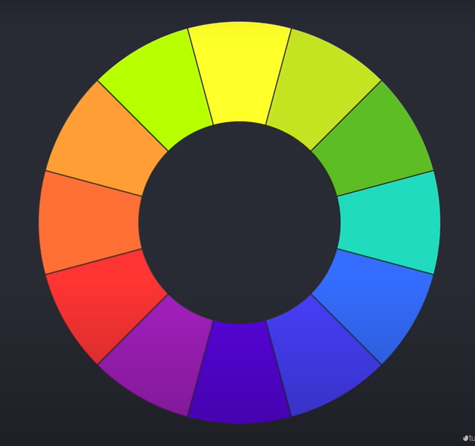
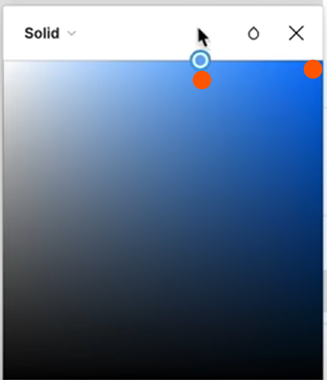
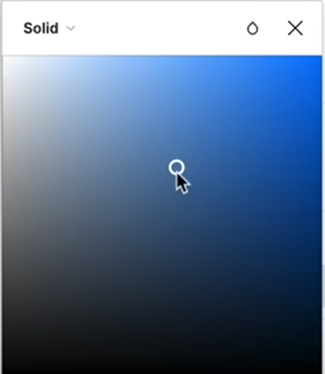

# UI vs UX
collapsed:: true
	- **UI** -> User Experience is the part that takes care of the artistic part of a web development, colour, fonts, spaces, etc.
	- **UX** -> User Experience is the part that takes care of how the user is going to navigate the page, the feal of the page for the client.
	- Both are **Web Designers**.
- # Learning To Work With Projects Briefs
  collapsed:: true
	- Always start with a briefing 
	  logseq.order-list-type:: number
	- Be clear about what are you making and who are you making it for.
	  logseq.order-list-type:: number
	- Be detailed about the in regards of the final content and fill the brief with it.
	  logseq.order-list-type:: number
	- The brief will serve as fundament for the wireframe.
	  logseq.order-list-type:: number
- # WireFrame
  collapsed:: true
	- **Low fidelity prototype**
	- Is not the final design of  the project
	  background-color:: red
	- If the UX and UI are handled by different people you can be messy about it, no need to make it look like the final version, also, if you're both the UX and the UI designer you can make it look more like a final project from the w ireframe stages
- # Colour Theory
	- ## Colour Division
	  collapsed:: true
		- ### Primary
			- Red, Blue, Yellow
		- ### Secondary
			- Mixing Primary Colours equally
			- ### Tertiary
				- Mixing Primary and secondary colours equally
		- ### Pallet
		  collapsed:: true
			- 
	- ## Colour Nomenclature
	  collapsed:: true
		- ### Colour Hue
			- Is the dominant colour in a colour family **the pure colour**
		- ### Tint
			- Is the mix of white with the hue color.
			- Moving on the colour pallet to the left you can move the tint.
			- 
		- ### Shade
			- Is the mixing of the hue colour with black **Moving the colour picker downwards**
		- ### Tone
			- Is when you mix both black and white with the hue colour.
		- ### Saturation
			- On the Hue the saturation is 100%
			- Moving diagonally to the bottom left will make it less saturated.
			- 
		- ### Brightness
			- Tells if the colour is closed to white  or closer to black.
		- ### Colour temperature
			- **Cold** -> Blues, Greens, Violet
			- **Warm** -> Yellow, Orange, Red
		-
	- ## Types of systems
	  collapsed:: true
		- **CMYK** -> Cyan, Magenta, Yellow and Black
		- **RGB** -> Red, Green and Blue (additive method)
		- **HSB** -> Hue, Saturation and Brightness
			- **Hue** -> Goes from 0 to 360 degrees Red is both 0 and 360
			- **Saturation** -> Varies in a 100% scale
			- **Brightness** -> Varies in a 100% scale
		- **HEX** -> uses the **RGB** but each colour is represented in with a hexadecimal scale.
		-
		-
- # Color Application
	- **RED** -> Color of passing, attention intensity excitement: Sport and Statements
	- **BLUE** -> Disease, disguise: trust, calm, tranquility.
	- **Yellow** -> Joy, Happiness, Warmth, energy
	- **Green**  -> Colour of the nature: heath, fertility, well being: eco brands, health, and so on.
	- **Orange** -> Happiness, confidence, energy and optimism and it's complementary to blue.
	- **Purple** -> Luxury, Loyalty, sophistication, Wealth: Luxury brands and hight-end
- # Color Harmony
	- Take the HEX of the colour you choose and https://color.adobe.com/create/color-wheel
	- **Analogous** -> Give you analogues to the colour you inserted.
	- **Monochromatic** -> Give you Tints and Shades of the colour you choose.
	- **Triad** -> 3 points equilateral star.
	- **Complementary** -> the opposite end of the spectrum
	- **Split Complementary** -> the opposite end of the spectrum but Spliced
	- **Double Split Complementary** -> Split complementary plus 2 neighbouring colours
- # Colour Tools
	- https://color.adobe.com/create/color-wheel
	- https://mycolor.space/?hex=%23845EC2&sub=1
	- https://colorhunt.co/
	- https://colors.muz.li/
	- https://webgradients.com/
- # Choosing the Colour Pallet for Your Project
	- Obs: Keep your colours and other general stuff in the assets folder in Figma
	-